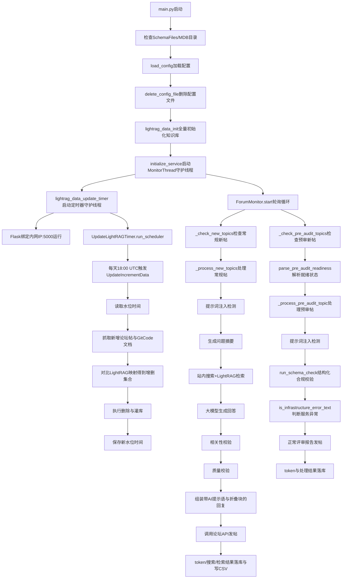

# 技术栈与架构文档

## 1. 语言与运行时

**Python 3.10**

- **运行时版本**：Python 3.10（来源：`Dockerfile` 基础镜像 `python:3.10-slim`）
- **负责范围**：整个服务的实现语言，覆盖业务编排、HTTP 客户端、大模型调用、数据库操作、定时任务、Web 服务等全部功能模块

## 2. 构建与依赖

### 构建工具

| 工具 | 用途 | 声明位置 |
|------|------|----------|
| Docker | 容器镜像构建，构建期从 GitCode 拉取 Redfish/MDB Schema 规则文件 | `Dockerfile` |
| pip | Python 依赖安装 | `requirements.txt` |
| pytest | 测试框架 | `pytest.ini` / `requirements-test.txt` |

### 核心依赖及版本

| 组件 | 版本 | 声明位置 |
|------|------|----------|
| openai | 1.109.1 | `requirements.txt` |
| langchain-openai | 0.3.35 | `requirements.txt` |
| langchain-core | 0.3.84 | `requirements.txt` |
| httpx | 0.28.1 | `requirements.txt` |
| requests | 2.33.0 | `requirements.txt` |
| beautifulsoup4 | 4.13.4 | `requirements.txt` |
| markdownify | >= 0.14 | `requirements.txt` |
| pandas | 2.3.1 | `requirements.txt` |
| flask | 3.1.3 | `requirements.txt` |
| werkzeug | 3.1.6 | `requirements.txt` |
| psycopg2-binary | >= 2.9 | `requirements.txt` |
| PyYAML | 6.0.2 | `requirements.txt` |
| python-json-logger | 3.0.0 | `requirements.txt` |
| python-dotenv | 1.2.1 | `requirements.txt` |
| schedule | 1.2.0 | `requirements.txt` |
| retrying | 1.4.0 | `requirements.txt` |
| pytz | 2025.2 | `requirements.txt` |
| gitpython | 3.1.3 | `requirements.txt` |
| netifaces | 0.11.0 | `requirements.txt` |
| urllib3 | 2.6.3 | `requirements.txt` |
| prometheus-client | 0.20.0 | `requirements.txt` |
| authlib | 1.3.1 | `requirements.txt` |
| cryptography | 42.0.8 | `requirements.txt` |

### 外部依赖（非 Python 包）

| 组件 | 用途 | 来源 |
|------|------|------|
| Redfish_SchemaFiles | Redfish Schema 定义文件，用于 JSON Schema 校验 | 构建期从 GitCode 远程拉取（`Dockerfile`） |
| MDB_SchemaFiles | MDB 合规校验规则集（v6.3/v6.5） | 构建期从 GitCode 远程拉取（`Dockerfile`） |
| PostgreSQL | 权威数据存储与去重 | 外部服务（配置于 `config/config.yaml`） |
| 大模型 API | OpenAI 兼容接口（如 SiliconFlow） | 外部服务（配置于 `config/config.yaml`） |
| 论坛平台 API | Discourse 风格，拉帖/发帖/搜索 | 外部服务（配置于 `config/config.yaml`） |
| LightRAG 服务 | 文档检索（RAG）与知识库灌入 | 外部服务（配置于 `config/config.yaml`） |
| GitCode | 知识源仓库文档抓取 | 外部服务（配置于 `config/config.yaml`） |

## 3. 整体架构

```mermaid
flowchart TD
    main[main.py<br/>生产入口] --> utils[src/utils.py<br/>配置加载与删除]
    main --> monitor[src/ForumBot/monitor.py<br/>编排核心]
    main --> lightrag_init[src/update_lightrag/full_data_init.py<br/>知识库全量初始化]
    main --> lightrag_timer[src/update_lightrag/increment_date_update_timer.py<br/>知识库增量定时器]
    
    monitor --> forum_client[src/ForumBot/forum_client.py<br/>论坛HTTP客户端]
    monitor --> ai_processor[src/ForumBot/ai_processor.py<br/>大模型调用层]
    monitor --> data_processor[src/ForumBot/data_processor.py<br/>数据与解析层]
    monitor --> schema_validation[src/ForumBot/SchemaValidation/<br/>Redfish结构化校验子包]
    monitor --> mdb_validation[src/ForumBot/MdbValidation/<br/>MDB合规校验子包]
    
    schema_validation --> end_to_end_check[end_to_end_check.py<br/>对外入口]
    schema_validation --> extract_reviews[extract_reviews.py<br/>评审点提取]
    schema_validation --> redfish_checker[redfish_checker.py<br/>Redfish校验核心]
    schema_validation --> schema_validator[redfish_schema_validator.py<br/>JSON Schema校验]
    schema_validation --> uri_generator[redfish_uri_generator.py<br/>URI示例生成]
    schema_validation --> review_workflow[redfish_review_workflow.py<br/>规则合规检查]
    
    mdb_validation --> mdb_classifier[mdb_classifier.py<br/>MDB相关性判断]
    mdb_validation --> mdb_checker[mdb_checker.py<br/>MDB合规校验]
    
    lightrag_init --> lightrag_client[src/update_lightrag/lightrag_client.py<br/>LightRAG服务交互]
    lightrag_timer --> lightrag_client
    lightrag_timer --> forum_fetcher[src/update_lightrag/forum_data_Fetcher.py<br/>论坛数据抓取]
    lightrag_timer --> gitcode_client[src/update_lightrag/gitcode_client.py<br/>GitCode API客户端]
    lightrag_timer --> update_time[src/update_lightrag/update_time.py<br/>水位时间管理]
    
    data_processor --> token_tracker[src/ForumBot/token_tracker.py<br/>全局token计数器]
    data_processor --> image_processor[src/ForumBot/image_processor.py<br/>帖子图片处理]
    
    main --> logging_config[src/ForumBot/logging_config.py<br/>日志器配置]
    
    main --> flask_health[Flask健康检查接口<br/>/health /health/detail]
```

## 4. 调用链

### 主链路流程

### 逐步说明

1. **启动检查**：`main.py` 先检查 `SchemaFiles` 目录是否就绪（缺失则退出），`MdbRuleFiles` 缺失仅记 warning。
2. **配置加载与销毁**：`utils.load_config()` 加载 `config/config.yaml` 后，`delete_config_file()` 立即删除配置文件防止敏感信息落盘。
3. **知识库全量初始化**：`lightrag_data_init()` 调用 `FullDataUpdate.update_full_data` 同步初始化 LightRAG 知识库，失败则退出。
4. **监控线程启动**：`initialize_service()` 构造 `ForumMonitor` 实例并用 `MonitorThread` 包装启动守护线程，进入轮询循环。
5. **增量更新定时器启动**：`lightrag_data_update_timer()` 起 `scheduler` 守护线程，每天 18:00 UTC 触发 `UpdateIncrementData` 增量任务。
6. **Flask 健康检查服务**：主线程跑 Flask，绑定到自动探测的内网 IP（优先 `10.` 段，其次 `192.168.` 段）的 5000 端口，提供 `/health` 和 `/health/detail` 接口。
7. **常规问答链路**：`ForumMonitor._check_new_topics` 拉新帖 → `_process_new_topics` 依次执行注入检测、摘要、搜索+检索、生成回答、相关性与质量双重校验、组装回复（带"AI 生成"提示语与折叠块）、发帖，全程 token/搜索/检索结果落库与写 CSV。
8. **预审链路**：`ForumMonitor._check_pre_audit_topics` 拉预审帖 → `parse_pre_audit_readiness` 判断就绪 → `_process_pre_audit_topic` 做注入检测后直接调用 `run_schema_check` 做 Redfish/MDB 合规校验 → `is_infrastructure_error_text` 识别服务异常则拒发，正常报告作为回复发出。
9. **增量更新执行**：定时器触发后，`UpdateIncrementData.update_lightrag_task` 读水位时间（DB 不可达则跳过本轮）→ 抓取新帖与 GitCode 变更 → 对比 LightRAG 现有映射得增删集合 → 执行删除与灌库 → 保存新水位。

## 5. 运行载体

**Docker 容器（单一类型）**

- **镜像**：基于 `python:3.10-slim` 构建的自定义镜像（来源：`Dockerfile`）
- **数量**：输入中未提供，需查阅源码确认
- **用户**：非 root 用户 `appuser`（来源：`Dockerfile` 的 `USER appuser`）
- **暴露端口**：5000（Flask 健康检查主端口）、5001（来源：`Dockerfile` 的 `EXPOSE 5000 5001`）
- **启动命令**：`python main.py`（来源：`Dockerfile` 的 `CMD`）

## 6. 调度与编排

### 进程结构

**单进程多线程模型**

- **主线程**：Flask 应用，提供健康检查接口（`/health`、`/health/detail`），绑定到内网 IP 的 5000 端口
- **守护线程 1**：`MonitorThread`，运行 `ForumMonitor.start()` 轮询循环，执行常规问答与预审两条回复链路
- **守护线程 2**：`scheduler` 守护线程，运行 `UpdateLightRAGTimer.run_scheduler()`，每天 18:00 UTC 触发 LightRAG 增量更新任务

### 任务调度

| 维度 | 取值 | 说明 |
|------|------|------|
| 调度器 | Python `threading` + `schedule` 库 | `threading.Thread(daemon=True)` 启动守护线程；`schedule` 库注册定时任务（来源：`main.py` 与 `src/update_lightrag/increment_date_update_timer.py`） |
| 任务类型 | 2 种 | 1. 论坛轮询监控（常规问答 + 预审），持续轮询；2. LightRAG 增量更新，定时触发（每天 18:00 UTC） |
| 优先级 | 不适用 | 输入中未提供优先级配置 |
| 亲和性 | 不适用 | 输入中未提供亲和性配置 |
| 队列 | 无独立队列 | 单线程顺序处理，逐帖 try/except 容错，单帖处理异常不影响其他帖子（来源：`src/ForumBot/monitor.py` 的逐帖容错逻辑） |

### 容错与重试

| 机制 | 适用范围 | 行为 |
|------|----------|------|
| 逐帖容错 | 常规问答与预审链路 | 单帖处理异常捕获后 continue，不阻塞其他帖子（来源：`src/ForumBot/monitor.py`） |
| 重试退避 | 大模型调用 | 带重试与退避（来源：`src/ForumBot/ai_processor.py`） |
| 从严默认 | 注入检测/相关性/质量校验 | 出错时默认判为注入/不相关/不合格，宁可不回复（来源：`CLAUDE.md`） |
| 服务异常拒发 | 预审链路 | `is_infrastructure_error_text` 识别基础设施错误（超时、限流、空响应）则拒绝发帖，避免把服务错误当评审意见发出（来源：`src/ForumBot/monitor.py`） |
| 数据库连接重试 | PostgreSQL 连接失败 | 默认重试 3 次（来源：`CLAUDE.md`） |
| 定时任务水位检查 | LightRAG 增量更新 | DB 不可达时跳过本轮，不致命（来源：`src/update_lightrag/update_time.py` 的 `UpdateTimeUnavailableError` 处理逻辑） |

### 健康检查

**监控探针依赖**

- **检查接口**：`/health`（简要）、`/health/detail`（详细）
- **判定依据**：`MonitorThread` 守护线程是否存活（`is_alive()`）
- **响应码**：存活返回 200，崩溃返回 503（来源：`main.py` 的 `/health` 接口实现）
