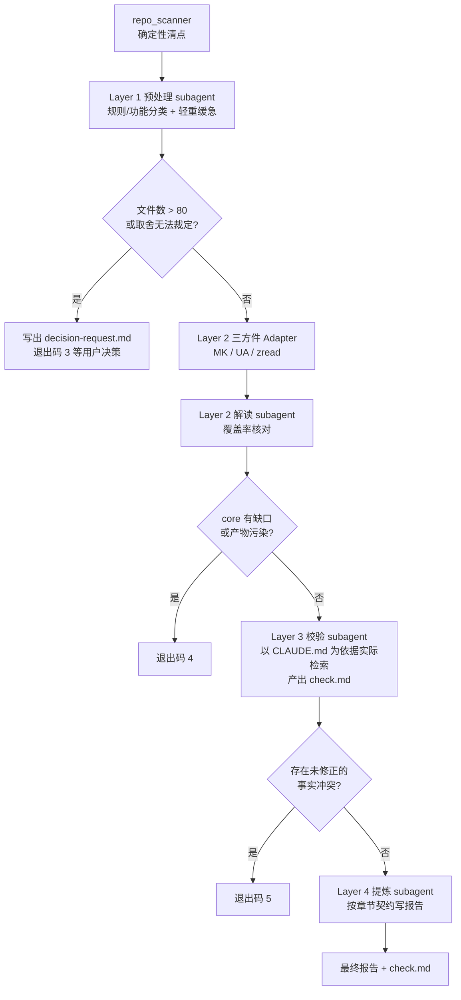

# 代码知识提取框架

代码知识提取工具。有两个入口：

- **`pipeline.py`（推荐）** — 四层流水线，带范围决策闸门与事实校验闸门。四层各由一个
  独立 subagent（claude-sonnet-5）执行。
- **`extract.py`** — 原两层直连入口（Adapter + Refiner），无预处理与校验层。

## 交付标准

最终报告必须同时满足：

- **a** 无原则性错误、无事实错误
- **b** 能指导新员工了解并熟悉该项目的流程 + 结构 + 技术栈
- **c** 能辅助新员工对新需求做合理分析

`onboarding` 输出类型专为 b/c 设计。

## 四层架构（pipeline.py）



各层职责与硬约束写在 `agents/<layer>/CLAUDE.md`，运行时以 `--append-system-prompt`
注入（不依赖 CLAUDE.md 自动发现，避免因 cwd 不同而漏掉约束）。
全局强约束在 `constraints.py`，追加在层级约束之后，**每一次模型调用都注入**。

### 三道闸门

| 闸门 | 触发条件 | 退出码 | 恢复方式 |
|---|---|---|---|
| 范围决策 | core+auxiliary > 80，或取舍无法用仓内证据裁定，或约定文件超限未读 | 3 | 读 `work/<项目>/decision-request.md`，认可后加 `--decision-approved --reuse-preprocess` 重跑 |
| 覆盖率 | core 层任一文件未进入产物；或 unexpected 页面占比 > 20%（产物污染） | 4 | 收窄范围或换用干净的 wiki 名重跑 |
| 事实冲突 | 存在 severity=fact_conflict 且未修正/未裁定的条目 | 5 | 读 `output/<项目>/<工具>/check.md` 补充信息后重跑 |

闸门的判定由 subagent 给出，Python 侧再复核一次并可强制升级 —— 模型会漏判。

## 目录结构

```
scripts/
├── agents/                    # 四层 subagent 的职责约束
│   ├── preprocess/CLAUDE.md   #   Layer 1 规则/功能分类、轻重缓急
│   ├── extract/CLAUDE.md      #   Layer 2 覆盖率核对
│   ├── verify/CLAUDE.md       #   Layer 3 事实校验，产出 check.md
│   └── refine/CLAUDE.md       #   Layer 4 按章节契约写报告
├── adapters/                  # 三方件适配器
│   ├── base.py                #   BaseAdapter 抽象基类
│   ├── mk_adapter.py          #   MemoryKnowledge
│   ├── zread_adapter.py       #   open-zread
│   └── ua_adapter.py          #   Understand-Anything
├── refine/refiner.py          # 章节契约 + 直连 API 的提炼实现
├── constraints.py             # 全局强约束（唯一来源）
├── agent_runner.py            # subagent 调用与产物契约校验
├── repo_scanner.py            # 确定性仓库清点
├── source_selector.py         # 源文件选择（抽样式 / 精确路径式）
├── pipeline.py                # 四层流水线入口
├── extract.py                 # 两层直连入口
├── config.yaml
├── requirements.txt
└── README.md
```

## 中间产物

`work/<项目名>/` 下逐层落盘，每层都可单独复查：

| 文件 | 产出层 | 内容 |
|---|---|---|
| `scan.json` / `scan-manifest.md` | Python | 全量文件清单、目录统计、CLAUDE.md 全文 |
| `preprocess.json` | Layer 1 | rule_facts、interpret_inputs（core/auxiliary/excluded）、core_flow |
| `decision-request.md` | 闸门 | 需用户决策时的完整候选与方案 |
| `raw.json` | Layer 2 | 三方件原始产物 |
| `coverage.json` | Layer 2 | missing / unexpected / 覆盖率 |
| `verify.json` | Layer 3 | conflicts、corrections_for_refiner |

`check.md` 与最终报告落在 `output/<项目名>/<工具>/`。

## 强约束设计（constraints.py）

三组纪律，每条对应一次已核实的真实错误，不是预防性设计：

| 组 | 条目 | 对应的真实错误 |
|---|---|---|
| 契约纪律 | C1 章节是契约不是下限<br/>C2 禁止自引对比维度 | prompt 只列 4 节，输出 7 节；自加章节造假密度 11.4%，是要求章节的 11 倍 |
| 事实纪律 | C3 字面量逐字复制<br/>C4 无差异就写无差异<br/>C5 不放大作用域<br/>C6 无依据处留空标注<br/>C7 断言给来源路径 | `Ascend1980`（真实 `ascend-1980`，全仓 0 次）<br/>两版 values.yaml 实差 4 行却编出演进叙事<br/>vendored 容器的 python3.12 被说成全仓要求 |
| 范围纪律 | C8 禁止擅自遗弃或截断<br/>C9 只做被要求的事 | 3000 字符硬截断静默吃掉 MK 产物 29.8% 内容 |

**截断已被彻底移除。** `Refiner._build_pages_summary` 超出
`input_char_limit`（默认 60 万字符）时抛 `OverflowError_`，附带最大的 10 个页面清单，
由上层或用户决定分批还是收窄范围 —— 绝不静默丢数据。

## 四层流水线用法

```bash
# 首次运行：跑到预处理层，若需决策会停下（退出码 3）
python pipeline.py --repo /path/to/repo --adapter mk --output-type onboarding

# 阅读 work/<项目名>/decision-request.md，认可后继续（复用已有划分，不重扫）
python pipeline.py --repo /path/to/repo --adapter mk --output-type onboarding \
    --decision-approved --reuse-preprocess

# 只看预处理层的划分结果
python pipeline.py --repo /path/to/repo --adapter mk --output-type onboarding \
    --stop-after preprocess

# 调整大项目阈值
python pipeline.py --repo /path/to/repo --adapter mk --output-type onboarding \
    --threshold 120
```

## 输出目录结构

产物默认写入 `openKnowledgeBase/output/`（即 scripts 目录的 `../../output/`，可通过配置或
`--output-root` 覆盖）。按 `<项目名>/<工具>/` 两级分类，避免同一个仓跑多个工具互相覆盖：

```
output/
└── <项目名>/
    ├── .raw/                      # 中间产物（原始 JSON），不提交
    │   └── <工具>-<时间戳>.json
    ├── mk/
    │   ├── architecture.md
    │   └── quickstart.md
    └── zread/
        └── architecture.md
```

- `<项目名>`：从 `--repo` 自动推导。本地路径取 basename；Git URL 取仓库名并去掉 `.git`
  后缀（如 `https://github.com/opensourceways/forum-reply-robot.git` -> `forum-reply-robot`）。
- `<工具>`：对应 adapter 的 `get_tool_name()`（`mk` / `zread` / `ua`）。
- 产物文件名默认为 `<输出类型>.md`（如 `architecture.md`）。
- `output/*/.raw/` 已加入 `.gitignore`，不会被提交。

## 快速开始

### 1. 安装依赖

```bash
pip install -r requirements.txt
```

### 2. 配置环境

编辑 `config.yaml`，或设置环境变量：

```bash
# 使用 Anthropic Claude
export ANTHROPIC_API_KEY="your-api-key"

# 或使用 DeepSeek
export DEEPSEEK_API_KEY="your-api-key"
```

### 3. 运行提取

`--output` 现在是可选参数：不传时按上面「输出目录结构」的规则自动计算路径。

```bash
# 使用 open-zread 提取并生成架构文档（自动写入
# output/<项目名>/zread/architecture.md）
python extract.py \
  --adapter zread \
  --repo /path/to/your/repo \
  --output-type architecture

# 使用 MemoryKnowledge 提取并生成快速开始指南（自动写入
# output/<项目名>/mk/quickstart.md）
python extract.py \
  --adapter mk \
  --repo /path/to/your/repo \
  --output-type quickstart

# 手动指定输出路径（覆盖自动计算，绝对路径优先）
python extract.py \
  --adapter zread \
  --repo /path/to/your/repo \
  --output-type architecture \
  --output result.md

# 覆盖默认输出根目录
python extract.py \
  --adapter zread \
  --repo /path/to/your/repo \
  --output-type architecture \
  --output-root /tmp/my-output

# 保存原始 JSON 数据（用于调试，落在 output/<项目名>/.raw/ 下）
python extract.py \
  --adapter zread \
  --repo /path/to/your/repo \
  --output-type architecture \
  --save-raw
```

## 三种适配器说明

### MKAdapter - MemoryKnowledge

**前提条件**：
- MemoryKnowledge 服务已在 `http://localhost:8421` 运行（接口前缀 `/v3`）
- 参考路径：`/Users/gorden/huawei/code/TencentDB-Agent-Memory/MemoryKnowledge/`

**工作流程**：
1. 创建 wiki（`POST /v3/wiki/create`，或传入 `wiki_id` 复用已有 wiki）
2. 批量写入源文件到 `POST /v3/wiki/raw/write`（单文件 ≤512KB，单请求 ≤10 个文件且总量 ≤5MB，按限制自动分批）
3. 触发 `POST /v3/wiki/ingest`
4. 轮询 `POST /v3/wiki/get` 直到 `status` 为 `ready` 或 `failed`（`failed` 时抛出 `sync_error`）
5. `POST /v3/wiki/page/ls` 获取页面列表，再按 `PAGE_READ_MAX`（20）分批 `POST /v3/wiki/page/read` 读取内容

所有接口均为 POST，统一响应包裹 `{code, message, request_id?, data}`，请求需带 `x-tdai-service-id` 请求头和 `team_id` 字段。

**配置项**（config.yaml）：
```yaml
adapters:
  mk:
    api_url: http://localhost:8421
    api_prefix: /v3
    service_name: trial-svc
    team_name: trial-team
```

**源文件选择**：默认由 `MKAdapter` 内部扫描 `repo_path` 下的常见源码/文档文件；配合
`--source-select` 时改用 `source_selector.select_sources()` 挑选一批代表性文件后再传入
（见下方「source_selector - 源文件选择器」一节），避免海量 YAML 拖慢 ingest。

### ZreadAdapter - open-zread

**前提条件**：
- 已安装 `open-zread`：`pip install open-zread`

**工作流程**：
1. 如果是 Git URL，克隆到临时目录
2. 执行 `python -m open_zread.main --output .open-zread/wiki`
3. 递归读取 `.open-zread/wiki/` 下的所有 `.md` 文件
4. 解析 frontmatter 和内容

**配置项**：无需额外配置

### UAAdapter - Understand-Anything

**前提条件**：
- UA 是 Claude Code 插件，**没有 HTTP API**，也没有独立 CLI。它由 LLM 在 Claude Code
  会话中执行 `/understand` 命令驱动的多阶段分析流程，产物落盘到目标仓库的
  `<repo>/.ua/knowledge-graph.json`（新版）或 `<repo>/.understand-anything/knowledge-graph.json`（旧版兼容）。
- **必须先在目标仓库对应的 Claude Code 会话中运行一次 `/understand`**，生成该产物后才能使用本适配器；
  产物缺失时会抛出清晰的 `RuntimeError` 并提示运行 `/understand`，不会静默返回空结果。

**工作流程**：
1. 定位知识图谱产物：优先使用 `data_dir`（若配置），否则依次探测 `<repo>/.ua/` 与
   `<repo>/.understand-anything/`
2. 读取并解析 `knowledge-graph.json`（`{version, project, nodes, edges, layers, tour}`）
3. 转换为 `pages[]`：项目概览页（来自 `project`）、项目导览页（来自 `tour`，按 `order` 排序）、
   每个 `layer` 一个子系统页、每个 `node` 一个页面（`content` 取 `summary`，`metadata` 保留
   `nodeType`/`layer`/`tags`/`complexity`/`relations`，`path` 取 `filePath`）

**配置项**（config.yaml）：
```yaml
adapters:
  ua:
    # data_dir 可选：显式指定知识图谱产物所在目录（不传则自动探测
    # <repo>/.ua/ 或旧版 <repo>/.understand-anything/）
    # data_dir: /path/to/.ua
```

## source_selector - 源文件选择器

配合 `--adapter mk --source-select` 使用，从代码仓中挑选一批代表性源文件后再交给
`MKAdapter`，避免把仓库中全部文件（尤其是海量 YAML）都上传导致 ingest 耗时过长。

**选择规则**：
1. 全部 `.md` 文件
2. 全部 `.py` / `.sh` 文件
3. YAML 抽样：按文件所在目录的**前 `group_depth` 级路径**分组，每组随机抽样
   `yaml_sample_per_group` 个（默认 2 个，种子固定为 42 保证可复现）
4. 额外生成 1 份合成的目录清单 `.md` 文件（目录树 + 各目录文件统计 + Helm Chart 清单），
   弥补 YAML 抽样丢失的目录全貌信息

**为什么按路径分组而不是按目录抽样**：曾评估过“每个含 YAML 的目录抽 2 个”的方案，在实测
仓库 `ascend-ci-deployment` 上得到 539 个目录 × 2 ≈ 1067 个文件，相对 2104 个 YAML 总数几乎
没有起到筛选作用。改为按前两级路径分组后，同一仓库实测收敛到 75 组 / 148 个抽样文件，
配合全部 17 个 md + 6 个 py/sh + 1 份目录清单，共 172 个源文件、总计约 512KB，筛选效果符合预期。

非 `.md`/`.txt` 的原始文件（`.py`/`.sh`/`.yaml`/`.yml`）会被转义为扁平文件名（路径中的 `/`
替换为 `__`，追加 `.md` 后缀），内容用带语言标记的代码块包裹并注明原始路径；单文件内容超过
400KB 会被截断并注明省略行数/字节数（远低于 MK 的 512KB 单文件硬限制，为包裹开销留出余量）。

**CLI 用法**：
```bash
python extract.py \
  --adapter mk \
  --repo /path/to/your/repo \
  --output-type architecture \
  --source-select \
  --yaml-sample-per-group 2 \
  --yaml-group-depth 2
```

## 输出类型说明

### architecture - 架构文档

生成项目架构文档，包含：
- 项目定位与核心价值
- 架构设计（模块划分、依赖关系）
- 关键机制（设计模式、技术选型）
- 目录结构说明
- Mermaid 流程图

### quickstart - 快速开始指南

生成快速上手文档，包含：
- 安装步骤
- 配置说明
- 运行方法
- 验证方法
- 常见问题

### api-reference - API 参考

生成 API 参考文档，包含：
- API 概览
- 认证方式
- 接口列表（方法、参数、返回值、示例）
- 错误码
- SDK 使用示例

### onboarding - 新员工上手报告

对应交付标准 b（了解流程+结构+技术栈）与 c（辅助新需求分析）。六个章节：

1. 项目定位
2. 技术栈（版本号逐字来自输入，查不到就标注需查阅源码）
3. 主流程（落到具体文件，Mermaid flowchart TD）
4. 代码结构（辅助能力只需一到两句说清作用）
5. 项目规则约束（来自 CLAUDE.md 与配置文件，逐条给来源路径）
6. 新需求落点指引（需求类型 → 改哪些文件 → 受哪些规则约束）

章节定义在 `Refiner.SECTION_CONTRACTS`，四层流水线与直连入口共用同一份。

## 配置文件详解

`config.yaml` 分为两部分：

### adapters 配置

每个适配器的连接信息：

```yaml
adapters:
  mk:
    api_url: http://localhost:8421
    api_prefix: /v3
    service_name: trial-svc
    team_name: trial-team
  ua:
    # data_dir: /path/to/.ua
```

### output 配置

输出路径配置：

```yaml
output:
  root: ../../output   # 相对 scripts 目录解析，或写绝对路径
```

命令行 `--output-root` 优先级高于此配置。

### refiner 配置

大模型提炼层配置：

```yaml
refiner:
  model: claude-opus-4              # 模型名称
  base_url: https://api.4router.net/v1  # API 基础 URL（可选）
  api_key: ${ANTHROPIC_API_KEY}    # API Key（支持环境变量）
```

**支持的模型**：
- Anthropic Claude：`claude-opus-4`, `claude-sonnet-4` 等
- DeepSeek：`deepseek-chat`
- 任何 OpenAI 兼容接口

**DeepSeek 配置示例**：
```yaml
refiner:
  model: deepseek-chat
  base_url: https://api.deepseek.com
  api_key: ${DEEPSEEK_API_KEY}
```

## CLI 参数

```
usage: extract.py [-h] --adapter {mk,zread,ua} --repo REPO --output-type
                  {architecture,quickstart,api-reference} [--output OUTPUT]
                  [--output-root OUTPUT_ROOT] [--config CONFIG]
                  [--work-dir WORK_DIR] [--save-raw]
                  [--source-select] [--yaml-sample-per-group YAML_SAMPLE_PER_GROUP]
                  [--yaml-group-depth YAML_GROUP_DEPTH]

参数说明:
  --adapter         适配器类型：mk / zread / ua
  --repo            代码仓路径（本地路径或 Git URL）
  --output-type     输出文档类型：architecture / quickstart / api-reference
  --output          输出文件路径（Markdown 格式，可选）。不传则按
                    <output-root>/<项目名>/<工具>/<输出类型>.md 自动计算
  --output-root     输出根目录（可选），覆盖 config.yaml 中的 output.root
  --config          配置文件路径（默认：config.yaml）
  --work-dir        工作目录（三方工具运行时的临时工作目录，与产物输出路径无关，默认：./work）
  --save-raw        保存 Adapter 原始输出到 output/<项目名>/.raw/<工具>-<时间戳>.json（调试用）
  --source-select        仅对 --adapter mk 生效：启用 source_selector 挑选代表性源文件，
                          而不是让 MKAdapter 内部扫描整个仓库（见上方「source_selector」一节）
  --yaml-sample-per-group  配合 --source-select：每个 YAML 分组抽样的文件数（默认：2）
  --yaml-group-depth       配合 --source-select：YAML 分组时取目录路径的前几级作为分组键（默认：2）
```

## 中间产物

使用 `--save-raw` 时，Adapter 输出的原始 JSON 会保存到
`output/<项目名>/.raw/<工具>-<时间戳>.json`（该目录已加入 `.gitignore`，不会被提交），格式：

```json
{
  "pages": [
    {
      "title": "页面标题",
      "content": "页面内容（Markdown）",
      "metadata": {
        "sources": ["file1.py", "file2.py"],
        "tags": ["tag1", "tag2"],
        "type": "wiki-page"
      },
      "path": "relative/path/to/file.md"
    }
  ],
  "tool": "zread",
  "timestamp": "2026-08-07T10:30:00",
  "repo": "/path/to/repo"
}
```

## 扩展新适配器

1. 在 `adapters/` 下创建新文件（如 `my_adapter.py`）
2. 继承 `BaseAdapter` 并实现 `extract()` 方法
3. 返回统一的 `pages` 格式
4. 在 `adapters/__init__.py` 中导出
5. 在 `extract.py` 的 `create_adapter()` 中添加分支

示例：

```python
from .base import BaseAdapter

class MyAdapter(BaseAdapter):
    def get_tool_name(self) -> str:
        return "my-tool"
    
    def extract(self, repo_path: str, output_dir: str) -> dict:
        # 实现提取逻辑
        pages = []
        # ... 
        return {
            "pages": pages,
            "tool": self.get_tool_name(),
            "timestamp": datetime.now().isoformat(),
            "repo": repo_path
        }
```

## 故障排查

### 1. MKAdapter 连接失败

**错误**：`上传源文件失败: Connection refused`

**解决**：
- 确认 MemoryKnowledge 服务已启动
- 检查 `config.yaml` 中的 `api_url` / `api_prefix` 是否正确
- 尝试手动访问（健康检查接口不带 `/v3` 前缀）：`curl http://localhost:8421/health`

### 2. ZreadAdapter 命令未找到

**错误**：`执行 open-zread 失败: No module named 'open_zread'`

**解决**：
- 安装 open-zread：`pip install open-zread`
- 确认安装成功：`python -m open_zread.main --help`

### 3. Refiner API Key 未设置

**错误**：`未提供 API Key`

**解决**：
- 设置环境变量：`export ANTHROPIC_API_KEY="your-key"`
- 或在 `config.yaml` 中直接写入（不推荐）

### 4. 大模型调用超时

**错误**：页面数量过多导致 token 超限

**解决**：
- 当前 Refiner 会截断每个页面到 3000 字符
- 如需调整，修改 `refine/refiner.py` 中的 `_build_pages_summary()` 方法

## 参考资料

- **MK API 示例**：`/Users/gorden/huawei/code/TencentDB-Agent-Memory/MemoryKnowledge/`
- **open-zread 输出**：`/tmp/oz-trial/forum-reply-robot/.open-zread/wiki/`
- **提炼示例文档**：`/Users/gorden/LLM/Obsidian/knowledgeBase/doc/2026-08-09/forum-reply-robot-architecture.md`

## 许可证

根据项目需要添加
