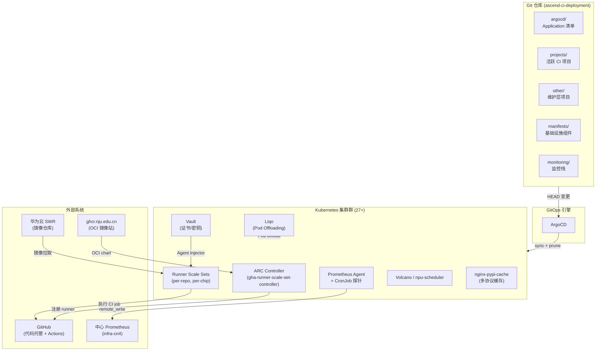
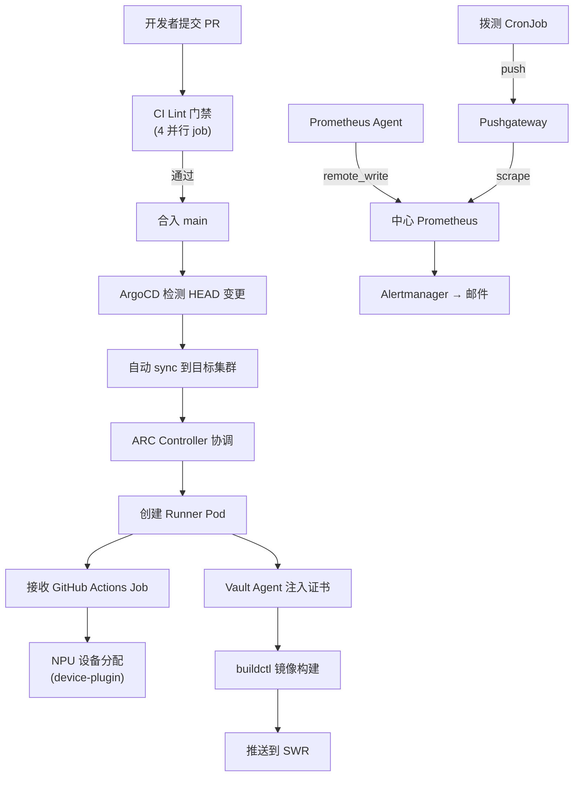

# ascend-ci-deployment 项目架构文档

## 1. 项目定位

**ascend-ci-deployment** 是华为 Ascend NPU 芯片 CI 基础设施的中心 IaC（Infrastructure as Code）仓库。它通过 GitOps 模型（ArgoCD），将 GitHub Actions Runner Controller（ARC）、监控栈、跨集群调度、包缓存代理等基础设施组件，声明式地部署到 27+ 个分布式 Kubernetes 集群上。

**核心价值主张：**
- 为搭载 Ascend NPU 的 Kubernetes 集群提供自动扩缩的 GitHub Actions 自托管 runner
- 以 Git 仓库为唯一事实来源，所有集群状态通过 ArgoCD 自动对账
- 支持 CPU/NPU 异构调度（Volcano、npu-scheduler）、跨集群 Pod Offloading（Liqo）、多协议包缓存等企业级 CI 需求

## 2. 架构设计

### 2.1 架构总览



### 2.2 核心模块划分

| 模块 | 目录 | 职责 |
|------|------|------|
| **GitOps 部署层** | `argocd/controllers/`、`argocd/clusters/` | 每集群一个 ArgoCD Application，自动同步 |
| **ARC 控制面** | `manifests/arc-controller-*` | 多版本 ARC controller（0.12.0/0.13.1/0.14.2） |
| **Runner 配置** | `projects/`、`other/` | per-project、per-chip 的 runner scale set Helm values 与 PodTemplate ConfigMap |
| **存储/密钥** | `manifests/vault/`、`manifests/secret-manager/` | Vault 服务 + SecretDefinition CRD 同步 |
| **调度** | `manifests/scheduler-plugins*`、`manifests/volcano-controller-*` | NPU 感知调度器 + Volcano 批量调度 |
| **跨集群** | `manifests/liqo/` | Liqo Pod Offloading、Consumer/Provider 拓扑 |
| **监控** | `monitoring/`、`manifests/prometheus/` | 中心化采集 + 边缘拨测 |
| **包缓存** | `manifests/nginx-pypi-cache-*` | APT/PyPI/yum/Go/Rust 五协议缓存 |
| **镜像构建** | `manifests/buildkitd-*` | BuildKit mTLS 远程构建服务 |
| **CI 门禁** | `.github/workflows/`、`scripts/` | yamllint、argocd-app-lint、coverage check |

### 2.3 数据流



## 3. 关键机制

### 3.1 ARC 版本分界规范

以 v0.14.0 为分界线，目录命名、`scaleSetLabels`、`resourceMeta`、镜像来源均存在系统性差异。新部署需先确认版本后选择规范。

> 来源：`wiki/concepts/arc-版本分界规范.md`

### 3.2 Helm 伞形图表锁版模式

每个部署变体通过一个薄包装 Chart.yaml 固定上游 chart 版本，实现 per-directory 可审计的版本控制：

```yaml
# manifests/arc-controller-0.14.2/Chart.yaml
dependencies:
  - name: gha-runner-scale-set-controller
    version: 0.14.2
    repository: oci://ghcr.io/actions/actions-runner-controller-charts
```

> 来源：`manifests/arc-controller-0.14.2/Chart.yaml`

### 3.3 Runner PodTemplate ConfigMap 模式

每个 runner 变体的 job pod 规格（NPU 数量、CPU/内存、调度器、生命周期钩子）封装在 ConfigMap 的 `data.default.yaml` 键中，容器名用 `$job` 占位：

```yaml
# 典型结构
volumes:
  - name: shared-volume    # 跨 job 缓存 PVC
  - name: driver-tools     # Ascend driver hostPath
  - name: shm-volume       # emptyDir Memory /dev/shm
```

> 来源：`wiki/concepts/runner-podtemplate-configmap-pattern.md`

### 3.4 Liqo 跨集群 Pod Offloading

Consumer 集群通过 VirtualKubelet 将 runner pod 透明调度到 Provider 集群的 NPU 节点，无需跨集群 Pod 网络：

| Consumer | Provider | 隔离 Namespace |
|----------|----------|----------------|
| cn12-001 | gy004 | ascend-gha-runners-gy004 |
| cn12-001 | gy005 | ascend-gha-runners-gy005 |
| gy006 | cn12-001 | ascend-gha-runners |

> 来源：`manifests/liqo/README.md`

### 3.5 SecretDefinition Vault 同步

GitHub App 凭据存于 Vault，通过 `SecretDefinition` CRD 声明式同步到目标 namespace 的 Kubernetes Secret：

```
Vault (secrets/data/ascend/ci)
  → SecretDefinition CR
    → secret-manager operator
      → Kubernetes Secret
        → gha-runner-scale-set (githubConfigSecret)
```

> 来源：`wiki/concepts/secret-synchronization-flow.md`

### 3.6 中心化采集 + 边缘拨测监控

业务集群 Prometheus Agent 通过 `remote_write` 推送至中心集群；独立 CronJob 通过 Pushgateway 推送拨测指标。中心集群运行 kube-prometheus-stack HA pair 负责告警评估。

> 来源：`monitoring/README.md`

### 3.7 NPU 就绪 postStart 探针

runner job pod 启动后，通过 `lifecycle.postStart` 轮询 `npu-smi info`（300 秒超时），确保 Ascend NPU 设备就绪后才释放容器进入主工作负载：

```sh
if [ -c "/dev/davinci_manager" ]; then
  while true; do
    if npu-smi info &> /dev/null; then break; fi
    sleep 1; elapsed=$(($SECONDS - $start_time))
    if [ $elapsed -ge 300 ]; then exit 1; fi
  done
fi
```

> 来源：`wiki/concepts/npu-readiness-poststart-probe-pattern.md`

## 4. 目录结构

```
ascend-ci-deployment/
├── .claude/skills/arc-deploy/     # AI Agent 部署技能模板
├── .github/workflows/             # CI lint 流水线 + 镜像同步工作流
├── argocd/
│   ├── controllers/               # 每集群一个 ARC controller Application
│   └── clusters/<cluster>/        # 每集群的项目 config + runner Application
├── manifests/
│   ├── arc-controller-{0.12.0,0.13.1,0.14.2}/  # ARC 多版本 controller
│   ├── arc-controller-for-cpu-node/             # CPU-only 节点专用 controller
│   ├── buildkitd-server/          # BuildKit 远程构建服务
│   ├── liqo/                      # Liqo 跨集群 offloading
│   │   ├── liqo-1.2.0/           # vendored chart
│   │   └── consumer-cn12-001/    # consumer 侧 namespace offloading
│   ├── nginx-pypi-cache-new/      # 五协议包缓存代理
│   ├── npu-exporter/              # NPU 指标 DaemonSet
│   ├── scheduler-plugins{,-new,-test}/  # npu-scheduler 组件
│   ├── secret-manager/            # Tuenti secrets-manager operator
│   ├── vault/                     # HashiCorp Vault 部署
│   ├── volcano-controller-sh-{001,002}/  # Volcano 批量调度器
│   └── ...                        # grafana, cluster-autoscaling, etc.
├── monitoring/
│   ├── base/                      # 17 个公共资源（CronJob/RBAC/Agent/探针）
│   ├── config-for-<cluster>/      # 每集群 3 文件差异 overlay
│   ├── prometheus/                # kube-prometheus-stack 中心集群伞形图表
│   ├── kube-state-metrics/        # 业务集群 KSM 包装图表
│   ├── node-exporter/             # 业务集群 node-exporter 包装图表
│   └── pushgateway/               # Pushgateway 包装图表
├── projects/<org>/<repo>/         # 活跃 CI 项目 runner 配置
│   ├── config[-for-<cluster>]/    # namespace/PVC/RBAC/Secret/ConfigMap
│   └── linux-<arch>-<series>-<count>/  # Helm umbrella chart (values.yaml)
├── other/<org>/<repo>/            # 维护期低活跃项目（同结构）
├── scripts/                       # CI lint 脚本 (argocd-app-lint, check-projects-coverage)
├── tests/                         # 脚本单元测试
└── docs/                          # CI 检查规则文档
```

### 关键文件/目录说明

| 路径 | 作用 |
|------|------|
| `argocd/controllers/arc-controller-<cluster>.yaml` | 将特定版本 ARC controller 部署到指定集群 |
| `projects/<org>/<repo>/linux-aarch64-a3-8/values.yaml` | 8 芯 NPU runner 的完整 Helm values |
| `projects/<org>/<repo>/config/linux-aarch64-a3-8-configmap.yaml` | runner job pod 的 PodTemplate ConfigMap |
| `monitoring/config-for-<cluster>/kustomization.yaml` | 每集群监控 overlay 入口 |
| `manifests/liqo/consumer-cn12-001/<ns>/kustomization.yaml` | Liqo consumer 侧 offloading 配置 |
| `scripts/argocd-app-lint.sh` | ArgoCD Application 静态校验（R1–R7） |
| `.github/workflows/ci-lint.yml` | PR 门禁流水线定义 |