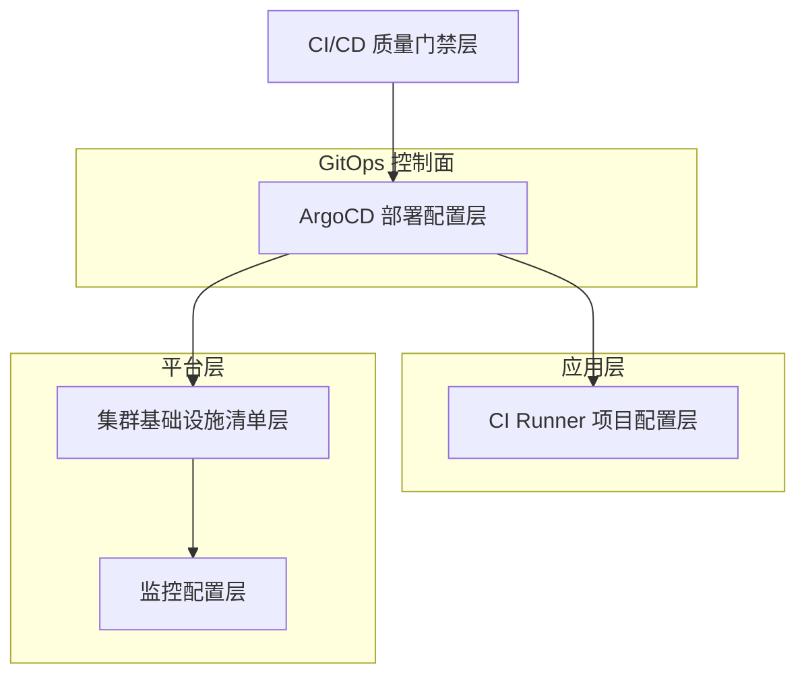
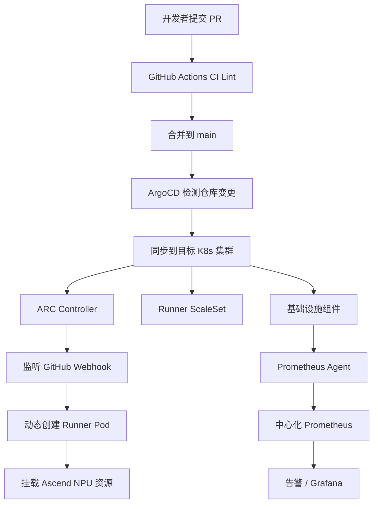
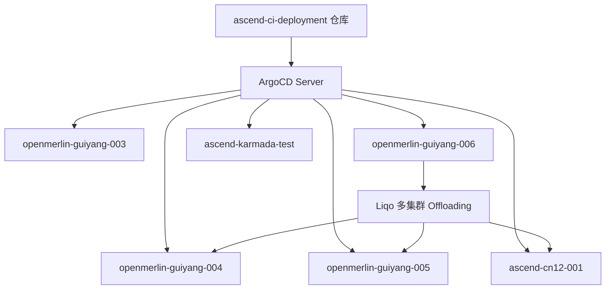

# ascend-ci-deployment 项目架构文档

## 1. 项目定位

**ascend-ci-deployment** 是一个 GitOps 部署仓库，用于在搭载华为 Ascend NPU 芯片的 Kubernetes 集群上部署和管理 GitHub Actions Runner Controller (ARC)。

**解决的问题：** 开源 AI/ML 项目（如 vllm-ascend、PyTorch、LLaMA-Factory、triton-ascend 等）需要带 NPU 加速能力的 CI 环境来执行训练、推理和编译任务，但公共 CI 服务不提供 Ascend NPU 资源。

**核心价值主张：**
- 为多个开源 AI 项目提供专属的、按需弹性伸缩的 NPU CI Runner
- 通过 GitOps 模式（ArgoCD）实现多集群、多项目的声明式部署管理
- 统一的监控、密钥管理和基础设施编排，降低多集群运维复杂度

## 2. 架构设计

### 2.1 分层架构

系统采用五层分层架构，从上到下依次为：



### 2.2 核心数据流



### 2.3 多集群部署拓扑



## 3. 关键机制

### 3.1 GitOps 同步链

ArgoCD Application 作为部署的入口点，形成两级引导链：

1. **控制器层**：`argocd/controllers/` 下的 Application 将 ARC Controller 部署到各集群
2. **应用层**：`argocd/clusters/` 下的 Application 将 Runner ScaleSet 和基础设施组件部署到对应命名空间

每个 Application 通过 `spec.source.path` 指向仓库内的 Helm Chart 或 Kustomize 目录，ArgoCD 自动检测 Git 变更并同步。

来源：`argocd/controllers/arc-controller-cn12-001.yaml`、`argocd/clusters/openmerlin-guiyang-006/argus.yaml`

### 3.2 Runner 资源声明模式

项目 Runner 配置采用统一模式：

- `Chart.yaml` 声明对 `gha-runner-scale-set` 上游 chart 的依赖
- `values.yaml` 覆盖关键参数：`githubConfigUrl`（目标仓库）、`runnerScaleSetName`（Runner 标签）、NPU 资源数量（`huawei.com/Ascend1980` 等）

目录路径编码了项目归属和硬件规格，例如 `projects/Ascend/pytorch/linux-aarch64-a3-16` 表示 Ascend/pytorch 项目、ARM64 架构、A3 型号、16 NPU。

来源：`projects/Ascend/pytorch/linux-aarch64-a3-16/values.yaml`

### 3.3 多源 Application 配置分离

基础设施组件使用 ArgoCD multi-source 特性，将 Helm Chart 和环境特定的 values 文件分离到不同仓库，实现敏感配置与 chart 定义解耦：

```yaml
spec:
  sources:
    - repoURL: <本仓库>        # Helm chart
    - repoURL: <配置仓库>      # values 文件
```

来源：`argocd/clusters/openmerlin-guiyang-006/argus.yaml`、`argocd/clusters/openmerlin-guiyang-006/squid-rpardini.yaml`

### 3.4 密钥管理

通过 HashiCorp Vault + Agent Injector 模式注入密钥，避免在 YAML 中硬编码凭据。SecretDefinition CRD 声明式映射 Vault 路径到 Kubernetes Secret。

来源：`manifests/vault/deployment.yaml`、`manifests/custom-npu-exporter/aiframework-hb3/deployment.yaml`、`monitoring/base/pushgateway-secret.yaml`

### 3.5 中心化监控与边缘拨测

- 每个集群部署 Prometheus Agent，抓取本地指标后 remote write 到中心 Prometheus
- 多个 CronJob 定期探测：GitHub 连通性、TLS 证书过期、云账户余额、共享磁盘使用率、镜像仓库同步状态
- 探测结果推送到 Pushgateway 供告警规则消费

来源：`monitoring/base/prometheus-agent-deployment.yaml`、`monitoring/base/cronjob-github-probe.yaml`、`monitoring/README.md`

### 3.6 多集群调度

- **Liqo**：实现跨集群 Pod Offloading，消费者集群（gy006）可将工作负载调度到提供者集群
- **Karmada**：多集群资源编排
- **Volcano**：批处理调度器，支持优先级队列
- **自定义 NPU Scheduler Plugin**：NPU 资源感知调度

来源：`manifests/liqo/README.md`、`manifests/karmada-operator/`、`manifests/volcano-queue/`、`manifests/scheduler-plugins/deployment.yaml`

### 3.7 CI 质量门禁

PR 提交触发：
- YAML Lint 格式检查
- ArgoCD Application 规范校验（路径对应、命名规范、目录存在性等 7 条规则）
- 新项目 ArgoCD 覆盖率检查
- Gitleaks 密钥泄露扫描
- scaleSetLabels 变更检测

来源：`.github/workflows/ci-lint.yml`、`scripts/argocd-app-lint.sh`、`scripts/check-projects-coverage.py`

## 4. 目录结构

| 目录/文件 | 作用 |
|-----------|------|
| `argocd/controllers/` | ARC Controller 的 ArgoCD Application 定义，每集群一个 |
| `argocd/clusters/` | 各集群的基础设施和 Runner 部署的 ArgoCD Application |
| `projects/` | 正式合作项目的 Runner Helm 配置（按组织/仓库/机型组织） |
| `other/` | 其他项目的 Runner 配置（结构同 projects/） |
| `manifests/` | Kubernetes 原生清单和 Helm Chart（ARC controller、argus、NPU exporter、Vault、Liqo、Karmada 等） |
| `monitoring/base/` | 监控基础设施 Kustomize 清单（Prometheus Agent、CronJob 探针） |
| `monitoring/config-for-*/` | 各集群的监控 overlay 补丁 |
| `monitoring/kube-state-metrics/`、`node-exporter/`、`prometheus/`、`pushgateway/` | 监控组件 Helm Chart |
| `scripts/` | CI 校验脚本（lint、覆盖率检查） |
| `tests/` | 脚本的单元测试 |
| `.github/workflows/` | GitHub Actions CI 流水线 |
| `docs/` | CI 检查规则等文档 |
| `CLAUDE.md` / `AGENTS.md` | AI 辅助运维的仓库规范 |

## 5. 技术选型总结

| 领域 | 技术选型 |
|------|----------|
| GitOps 引擎 | ArgoCD（声明式同步、自动裁剪、multi-source） |
| CI Runner 编排 | Actions Runner Controller (ARC) + gha-runner-scale-set Helm chart |
| 包管理 | Helm（项目 Runner）+ Kustomize（监控、NPU exporter） |
| 密钥管理 | HashiCorp Vault + Agent Injector + SecretDefinition CRD |
| 多集群 | Liqo（Pod Offloading）、Karmada（资源编排） |
| 调度 | Volcano（批处理队列）、自定义 NPU Scheduler Plugin |
| 监控 | Prometheus Agent + remote write + Pushgateway + Grafana |
| 镜像构建 | BuildKitD（arm64/amd64 双架构） |
| 镜像同步 | skopeo（ghcr.io → 华为云内部仓库） |
| 网络加速 | git-cdn、smart-git-proxy、squid 缓存代理、nginx PyPI 缓存 |
| 节点伸缩 | Karpenter NodePool |