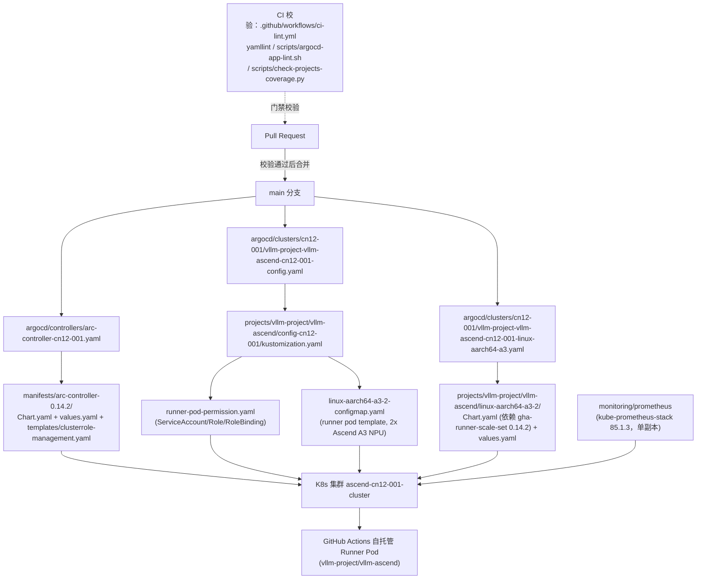

# ascend-ci-deployment 新员工上手指南

## 1. 项目定位

本仓库用于在搭载华为 Ascend NPU 芯片的 Kubernetes 集群上部署 GitHub Actions Runner Controller（ARC），使各个组织/仓库能够接入 Ascend CI（来源：`raw.json` 项目概览节点 `path=""`，content："This repository is used to deploy Actions Runner Controller on a Kubernetes cluster with Ascend NPU chips, enabling organizations and repositories to integrate Ascend CI."）。

`README.md` 描述仓库整体用途、目录结构，以及为新仓库接入 runner scale set 的分步说明（来源：`raw.json` content，path=`README.md`）。

仓库本质是一个 GitOps 配置库：不包含运行时业务代码，而是存放 K8s manifests、Helm values 与 Kustomize overlays，由 ArgoCD 读取并同步到各个 K8s 集群，从而拉起 GitHub Actions 自托管 runner（来源：`preprocess.json` `core_flow`）。仓库同时通过 `.github/workflows/ci-lint.yml` 对提交到 `main` 分支的变更做结构校验，但该校验是配套的质量门禁，不是主流程本身（来源：`preprocess.json` `core_flow`）。

仓库在更大系统（超级项目 `ascend-ci-project`）中的具体归属关系，输入中未提供，需查阅源码确认。

## 2. 技术栈

**语言**：gotmpl、json、markdown、python、shell、tgz、tpl、txt、unknown、yaml（来源：`raw.json` 项目概览节点，content 中"语言"字段）。

**框架/依赖**：Helm、Kustomize、GitHub Actions（来源：`raw.json` 项目概览节点，content 中"框架/依赖"字段）。

**关键依赖及版本（逐字取自输入）**：

| 组件 | 版本/字面量 | 来源文件 |
|------|------|----------|
| ARC 控制器 chart（arc） | apiVersion v2, name: arc, version: 0.14.2 | `manifests/arc-controller-0.14.2/Chart.yaml`（`preprocess.json` rule_facts） |
| gha-runner-scale-set-controller（arc chart 依赖） | version 0.14.2, repository `oci://ghcr.io/actions/actions-runner-controller-charts` | `manifests/arc-controller-0.14.2/Chart.yaml`（`preprocess.json` rule_facts） |
| ARC >= 0.14.0 定制控制器/listener 镜像（由各集群 ArgoCD Application inline helm values 覆盖注入） | `swr.cn-southwest-2.myhuaweicloud.com/modelfoundry/gha-runner-scale-set-controller:0.14.201` | CLAUDE.md（`preprocess.json` rule_facts）；`argocd/controllers/arc-controller-cn12-001.yaml` content |
| `manifests/arc-controller-0.14.2/values.yaml` 自身默认镜像（已修正） | `ghcr.nju.edu.cn/actions/gha-runner-scale-set-controller`（默认 NJU 镜像，tag 为空）；`resources: {}`，limits/requests 均被注释，未配置实际资源限制 | `verify.json` conflicts[K03].corrected_fact，优先级高于 raw.json 中原始描述 |
| liqo chart（适用范围：vendored 目录，非本仓自研内容） | apiVersion v2, name: liqo, type: application, version: 0.1.0, appVersion: v1.2.0 | `manifests/liqo/liqo-1.2.0/Chart.yaml`（`preprocess.json` rule_facts） |
| liqo-crds（liqo chart 依赖，同上适用范围） | version 0.1.0, repository `file://./charts/liqo-crds` | `manifests/liqo/liqo-1.2.0/Chart.yaml` |
| gha-runner-scale-set（vllm-ascend / gy-005 代表样本） | 0.14.2 | `projects/vllm-project/vllm-ascend/linux-aarch64-a3-2/Chart.yaml`（`raw.json` content） |
| gha-runner-scale-set（other/Ascend-CI 代表样本） | 0.12.0，来源 GitHub ARC OCI registry（NJU 镜像） | `other/Ascend/Ascend-CI/linux-aarch64-310p-1/Chart.yaml`（`raw.json` content） |
| kube-prometheus-stack | 85.1.3 | `monitoring/prometheus/Chart.yaml`（`raw.json` content） |
| CI 运行环境 | container image `python:3.12`，runs-on `linux-amd64-cpu-1` | `.github/workflows/ci-lint.yml`（`preprocess.json` rule_facts） |
| yamllint 配置 | `extends: default`，`line-length.max: 200` | `.yamllint`（`preprocess.json` rule_facts） |

**ArgoCD 集群目录与 ARC 版本对应关系（逐字取自输入）**：gy-003→0.13.0，gy-004→0.14.2，gy-005→0.14.2，gy-006→0.14.2，hk-001→0.13.0，hk-ci→0.13.0，cn12-001→0.14.2，hb-003→0.13.0，hb-003-verl→0.13.0，hidevlab-k8s→0.13.0，verl-suzhou→0.13.0，karmada-test→0.13.0（来源：CLAUDE.md，`preprocess.json` rule_facts）。

其他未在上表列出的组件版本，输入中未提供，需查阅源码确认。

## 3. 主流程

主流程判定依据：CLAUDE.md 的目录职责说明，以及 `argocd/clusters/` 下 Application YAML 的 `source.path` 实际指向 `projects/`、`other/`、`manifests/`、`monitoring/`（来源：`preprocess.json` `core_flow`）。以下以 `cn12-001` 集群、`vllm-project/vllm-ascend` 项目为代表样本追踪完整链路（来源：`preprocess.json` `interpret_inputs.core` 对应条目）。

链路说明（每一步来源）：

1. **CI 门禁**：PR 变更 `**.yaml`/`**.yml`/`.yamllint`/`scripts/argocd-app-lint.sh`/`scripts/check-projects-coverage.py`/`.github/workflows/ci-lint.yml` 时触发 4 个 job（yamllint、argocd-app-lint、check-projects-coverage、check-scale-set-labels），全部以 `python:3.12` 容器运行在 `linux-amd64-cpu-1` 上，且都受 `!contains(title,'[skip ci]')` 条件约束（来源：`.github/workflows/ci-lint.yml`，`preprocess.json` rule_facts）。其中 `argocd-app-lint` job 执行 `scripts/argocd-app-lint.sh`，该脚本实际定义 6 个规则检查函数 `r1_check`/`r2_check`/`r4_check`/`r5_check`/`r6_check`/`r7_check`，不存在 `r3_check`，序号非连续（来源：`verify.json` conflicts[K04].corrected_fact）；`check-projects-coverage` job 执行 `scripts/check-projects-coverage.py`，该脚本是覆盖率检查的入口，查找新增项目目录，交叉核对 Application source path 与文档中的 runner 名称，通过 `report_fail` 报告失败并在违规时非零退出（来源：`raw.json` content，path=`scripts/check-projects-coverage.py`）。
2. **ARC 控制器部署**：`argocd/controllers/arc-controller-cn12-001.yaml` 是部署链路起点之一,将 ARC 控制器 Helm chart v0.14.2（自定义华为 SWR 镜像 `gha-runner-scale-set-controller:0.14.201`，通过该 Application 的 inline helm values 覆盖注入）同步到 `arc-systems` 命名空间下的 `ascend-cn12-001-cluster`（来源：`raw.json` content，path=`argocd/controllers/arc-controller-cn12-001.yaml`）。该 chart 依赖 `manifests/arc-controller-0.14.2/Chart.yaml` 声明的上游 `gha-runner-scale-set-controller`；chart 自身 `values.yaml` 中的镜像是默认的 NJU 镜像，resources 为空未配置资源限制（来源：`verify.json` conflicts[K03].corrected_fact）；`templates/clusterrole-management.yaml` 定义了控制器所需的 ClusterRole/ClusterRoleBinding 权限模板（来源：`raw.json` content）。
3. **Kustomize Config Application**：`argocd/clusters/cn12-001/vllm-project-vllm-ascend-cn12-001-config.yaml` 将 Kustomize base config 同步到 `ascend-cn12-001-cluster`（来源：`raw.json` content）。其入口 `projects/vllm-project/vllm-ascend/config-cn12-001/kustomization.yaml` 聚合了 namespace、storage、permissions、secrets、Docker CLI installer 与 runner pod template 等资源（来源：`raw.json` content）。其中 `runner-pod-permission.yaml` 定义 ServiceAccount/Role/RoleBinding，授予 runner pod 管理 ephemeral pod、访问 secret、管理 Job 的权限（来源：`raw.json` content）；`linux-aarch64-a3-2-configmap.yaml` 定义带 2 个 Ascend A3 NPU 的 GitHub Actions runner pod template（来源：`raw.json` content）。
4. **Helm Runner Application**：`argocd/clusters/cn12-001/vllm-project-vllm-ascend-cn12-001-linux-aarch64-a3.yaml` 部署多个 Helm Application，将 vllm-project/vllm-ascend 的 runner scale set（a3-0/2/...）同步到 `ascend-cn12-001-cluster`（来源：`raw.json` content）。对应 chart `projects/vllm-project/vllm-ascend/linux-aarch64-a3-2/Chart.yaml` 声明依赖 `gha-runner-scale-set 0.14.2`；`values.yaml` 设置 `scaleSetLabels: [linux-aarch64-a3-2, gy-005]`，`ascend-1980` 是 `template.metadata.labels` 下的 pod 标签 `ascend-ci.com/npu-resource-model`（不是 nodeSelector，该文件唯一的 `nodeSelector` 是 `beta.kubernetes.io/arch: amd64`），"2" 来自 `ascend-ci.com/required-npu-count`，指单个 runner pod 所需的 NPU 数量，文件中不存在 `minRunners`/`maxRunners`/`replicas` 字段（来源：`verify.json` conflicts[K02].corrected_fact，修正 raw.json 中"an ascend-1980 NPU node selector for a 2-way runner pool"的原始描述）。
5. **落地到 K8s 集群**：以上 ARC 控制器、RBAC、ConfigMap、Runner Helm chart 共同作用于目标 K8s 集群，最终注册为 GitHub Actions 自托管 runner（来源：`preprocess.json` `core_flow`）。
6. **监控（并行，非阻塞部署）**：`monitoring/prometheus` 基于 `kube-prometheus-stack 85.1.3`。当前 Prometheus 与 Alertmanager 均为单副本（`replicas: 1`），HA 所需的跨节点反亲和性配置目前被注释，注释说明将在正式上线时恢复为 `replicas: 2`，即当前实际部署不是 HA（来源：`verify.json` conflicts[K05].corrected_fact，修正 raw.json 中"Prometheus HA (1 replica)"的原始描述）。该组件另配置了 Alertmanager、华为 SWR 自定义镜像、基于文件的服务发现方式跨集群抓取指标，并关闭本地集群监控组件（来源：`raw.json` content，path=`monitoring/prometheus/values.yaml`）。

## 4. 代码结构

| 目录 | 职责 | 详略 | 来源 |
|------|------|------|------|
| `projects/{org}/{repo}/` | 活跃项目的 CI runner 配置，长期维护 | core（723 个文件，已由 `projects/vllm-project/vllm-ascend/` 代表样本覆盖其结构与串联方式） | CLAUDE.md；`preprocess.json` interpret_inputs.excluded |
| `other/{org}/{repo}/` | 低活跃/维护性项目的 runner 配置，与 `projects/` 结构同构 | core（823 个文件，已由 `other/Ascend/Ascend-CI` 代表样本覆盖） | CLAUDE.md；`preprocess.json` interpret_inputs.excluded |
| `monitoring/` | 各集群监控配置（顶层，不归属任何 org） | core（72 个文件，组件级 chart 已由 `monitoring/prometheus` 代表样本覆盖） | CLAUDE.md；`preprocess.json` interpret_inputs.excluded |
| `manifests/` | 共享基础设施 Helm chart（ARC 控制器各版本、liqo、karmada-operator 等） | core（331 个文件，含已单列的 `arc-controller-0.14.2`；其余为 arc-controller 历史版本 0.12.0/0.13.0/0.13.1 与其他基础组件，依赖声明去重后仅 6 种，已由 0.14.2 代表样本覆盖） | `preprocess.json` interpret_inputs.excluded |
| `manifests/liqo/` | vendored 第三方 Liqo chart（含 CRD），非本仓自研内容 | auxiliary，仅需知悉其为第三方引入代码，不适用于本仓自身规则（143 个文件） | `preprocess.json` interpret_inputs.excluded |
| `argocd/controllers/` | 每个集群一个 ARC 控制器 Application | core（16 个文件，仅集群名与目标不同，已由 `arc-controller-cn12-001.yaml` 覆盖） | `preprocess.json` interpret_inputs |
| `argocd/clusters/{cluster}/` | 每集群项目的 config + runner Application | core（287 个文件，命名与 source.path 规律固定，已由 cn12-001 的 config + runner 两个代表样本覆盖） | `preprocess.json` interpret_inputs |
| `.claude/skills/arc-deploy/SKILL.md` | Claude Agent skill：根据 JSON 配置自动生成 namespace/secret/PVC/ConfigMap/Helm values 等部署文件 | core | `preprocess.json` interpret_inputs.core |
| `.claude/skills/arc-deploy/templates/*.json` | arc-deploy skill 的示例配置模板 | auxiliary，仅作为 skill 的输入样例 | `preprocess.json` interpret_inputs.auxiliary |
| `scripts/argocd-app-lint.sh` | 对 Application YAML 做结构校验（6 个规则检查函数 r1/r2/r4/r5/r6/r7），被 `ci-lint.yml` 的 `argocd-app-lint` job 调用 | core | `raw.json` content；`verify.json` conflicts[K04]；`preprocess.json` interpret_inputs.core |
| `scripts/check-projects-coverage.py` | 编排覆盖率检查：核对新 `projects/` 目录是否有对应 Application 与文档条目，被 `ci-lint.yml` 的 `check-projects-coverage` job 调用 | core | `raw.json` content；`preprocess.json` interpret_inputs.core |
| `script.sh`（根目录） | 零散脚本，未被 CI 工作流引用；与 README.md 之间不存在文档化关系 | auxiliary，仅为辅助工具脚本 | `preprocess.json` interpret_inputs.auxiliary；`verify.json` conflicts[K06] |
| `tests/` | `test-argocd-app-lint.sh`、`test_check_projects_coverage.py`、`test_sync_new_projects_to_docs.py`，分别对应上述脚本与文档同步脚本的测试 | auxiliary，熟悉作用即可 | `preprocess.json` interpret_inputs.auxiliary |
| `docs/ci-checks.md` | 描述 PR 检查规则与合并后自动触发项，与 `ci-lint.yml` 中检查项逐一对应 | core | `raw.json` content；`preprocess.json` interpret_inputs.core |
| `PROGRESS_REPORT.md` / `argocd-removal-record.md` / `config-pod-template-analysis.md` | 历史进度记录、历史移除记录、Pod 模板分析文档 | auxiliary，均为辅助性说明材料，非主流程 | `preprocess.json` interpret_inputs.auxiliary |
| `.github/workflows/ci-lint.yml` | PR 门禁：yamllint、argocd-app-lint、check-projects-coverage、check-scale-set-labels 四个 job | core（详见第 3 节） | `preprocess.json` rule_facts |
| `.github/workflows/notify-docs-refresh.yml`、`notify-superproject.yml`、`sync-images.yml` | 从文件名可知分别用于通知文档刷新、通知超级项目、同步镜像；具体触发条件与步骤字面量输入中未提供，需查阅源码确认 | auxiliary | `preprocess.json` rule_facts |
| `README.md` | 仓库根说明文档，描述整体用途、目录结构、新仓库接入 runner 的分步说明 | core | `preprocess.json` interpret_inputs.core |

## 5. 项目规则约束

以下规则均来自 CLAUDE.md 与配置文件（`preprocess.json` rule_facts），逐条列出来源路径；涉及 verify.json 修正的条目已用修正后事实替换原文。

1. **目录职责划分**：`projects/{org}/{repo}/` 用于 GitHub 上有活跃 CI 的 org/repo，长期维护；`other/{org}/{repo}/` 用于不再活跃维护但仍需保留 runner 的项目。（来源：CLAUDE.md）
2. **monitoring/ 位置固定**：`monitoring/` 永远在顶层，不在 `projects/` 或 `other/` 下。（来源：CLAUDE.md）
3. **单 runner 项目的 org 放置**：一个 org 下只有 runner 相关项目时，runner 配置直接放在 `other/{org}/` 下（如 `other/ascend-gha-runners/`）。（来源：CLAUDE.md）
4. **Application 路径对应**：ArgoCD Application 的 `source.path` 必须与 `projects/`、`other/`、`monitoring/`、`manifests/` 目录对应。（来源：CLAUDE.md）
5. **命名空间命名**：新项目命名空间格式为 `{org-lower}-{repo-lower}` 全小写，如 `alibaba/ROLL` → `alibaba-roll`；已有项目保持已有命名，不重命名，如 `vllm-project/vllm-ascend` → `vllm-project`。（来源：CLAUDE.md）
6. **Runner 目录命名**：ARC < 0.14.0 命名为 `linux-{arch}-{npu}-{count}`，如 `linux-aarch64-a3-2`；ARC >= 0.14.0 为 `linux-{arch}-{npu}-{count}-{cluster_suffix}`，如 `linux-aarch64-a3-2-gy005`。（来源：CLAUDE.md）
7. **config 目录命名变体**：`config/`（默认）、`config-{cluster}/`（无 for 前缀，如 `config-hk001/`）、`config-for-{cluster}/`（带 for 前缀，如 `config-for-guiyang-005/`），规则是匹配已有约定，不统一。（来源：CLAUDE.md）
8. **scaleSetLabels 要求**：ARC >= 0.14.0 的 `gha-runner-scale-set.scaleSetLabels` 必须有 2 个标签（capability label + cluster label）。（来源：CLAUDE.md）
9. **resourceMeta 要求**：ARC >= 0.14.0 的 `gha-runner-scale-set.resourceMeta.ephemeralRunnerSet.annotations` 必须标注 `actions.github.com/job-cpu`、`actions.github.com/job-memory`、`actions.github.com/job-npu`。（来源：CLAUDE.md）
10. **定制镜像固定**：ARC >= 0.14.0 定制镜像固定为 `swr.cn-southwest-2.myhuaweicloud.com/modelfoundry/gha-runner-scale-set-controller:0.14.201`；该镜像通过每个集群的 ArgoCD Application inline helm values 覆盖注入，不写在 chart 自身 `values.yaml` 中（chart 自身默认使用 NJU 镜像）。（来源：CLAUDE.md；`verify.json` conflicts[K03].corrected_fact）
11. **ArgoCD Application 规范**：Config Application 必须包含 `syncOptions: [CreateNamespace=true]`；Runner Application 必须指定 `spec.source.helm.releaseName`；所有 Application 必须设置 `automated.prune: true`；多个 runner 可合并到一个文件，用 `---` 分隔。（来源：CLAUDE.md）
12. **集群与 ARC 版本对应**：gy-003→0.13.0，gy-004→0.14.2，gy-005→0.14.2，gy-006→0.14.2，hk-001→0.13.0，hk-ci→0.13.0，cn12-001→0.14.2，hb-003→0.13.0，hb-003-verl→0.13.0，hidevlab-k8s→0.13.0，verl-suzhou→0.13.0，karmada-test→0.13.0。（来源：CLAUDE.md）
13. **存储类使用分布（已修正）**：`sfsturbo-subpath-sc` 是仓库中使用最广泛的存储类（304 个文件引用），覆盖 gy-004、gy-005、gy-006、hk-001、hk-ci、cn12-001、ascend-infra-guiyang-cluster-001 等集群及绝大多数项目 runner 的 ephemeral 存储，**并非**仅限 gy-006/cn12-001/hk-ci 三个集群；`csi-sfsturbo`（99 个文件引用）主要用于各项目 `config/local-storage-pvc.yaml` 的基础持久化存储，规模远小于 `sfsturbo-subpath-sc`。此条修正了 CLAUDE.md 原文"csi-sfsturbo（大多数集群使用）；sfsturbo-subpath-sc 仅用于 gy-006、cn12-001、hk-ci"的表述。（来源：`verify.json` conflicts[K01].corrected_fact / corrections_for_refiner，优先级高于 CLAUDE.md 原文）
14. **分支保护与 PR 规范**：默认分支必须通过 PR 合入，禁止直接 push；每个 PR 必须在 body 中包含独立一行 `resolve <issue URL>`。（来源：CLAUDE.md）
15. **AGENTS.md 规则复用**：AGENTS.md 内容为 `@CLAUDE.md`，即整体指向复用 CLAUDE.md 的规则内容。（来源：AGENTS.md）
16. **YAML lint 规则**：`extends: default`；ignore 路径包括 `manifests/*/templates/`、`manifests/*/chart/templates/`、`manifests/*/chart/charts/`、`manifests/liqo/liqo-*/`、`manifests/karmada-operator/`；`line-length.max: 200`，`allow-non-breakable-inline-mappings: true`；`indentation.spaces: 2`，`indent-sequences: true`；`new-line-at-end-of-file: enable`；`document-start: disable`；`comments.min-spaces-from-content: 1`；`empty-lines.max: 1`，`max-end: 0`；`truthy.allowed-values: ['true', 'false', 'on', 'off']`。（来源：`.yamllint`）
17. **CI 门禁（ci-lint.yml）**：触发条件为 `pull_request` 到 `branches: [main]`，路径过滤 `**.yaml`、`**.yml`、`.yamllint`、`scripts/argocd-app-lint.sh`、`scripts/check-projects-coverage.py`、`.github/workflows/ci-lint.yml`；`yamllint` job 对 PR 变更的 `*.yaml`/`*.yml` 文件运行 `yamllint -c .yamllint`；`argocd-app-lint` job 执行 `bash scripts/argocd-app-lint.sh`（实际含 6 个规则检查函数 r1/r2/r4/r5/r6/r7，不存在 r3）；`check-projects-coverage` job 执行 `python3 scripts/check-projects-coverage.py` 检查新 `projects/` 目录是否有对应 ArgoCD Application 和文档条目；`check-scale-set-labels` job 检测 `*/values.yaml` 中 `scaleSetLabels` 的新增/修改并在 PR 评论中提醒；所有 job 均以 `python:3.12` 容器运行在 `linux-amd64-cpu-1` 上，且均有条件 `if: "!contains(github.event.pull_request.title, '[skip ci]')"`。（来源：`.github/workflows/ci-lint.yml`；`verify.json` conflicts[K04]）
18. **依赖版本要求（适用范围：manifests/arc-controller-0.14.2/）**：`arc` chart（apiVersion v2, version 0.14.2）依赖 `gha-runner-scale-set-controller` version 0.14.2，仓库地址 `oci://ghcr.io/actions/actions-runner-controller-charts`；该 chart 自身 `values.yaml` 默认镜像为 NJU 镜像，非 CLAUDE.md 要求的 SWR 定制镜像，定制镜像需通过各集群 ArgoCD Application 覆盖。（来源：`manifests/arc-controller-0.14.2/Chart.yaml`；`verify.json` conflicts[K03]）
19. **依赖版本要求（适用范围：manifests/liqo/ vendored 目录，非本仓自研内容，不代表整体项目规则）**：`liqo` chart（apiVersion v2, type application, version 0.1.0, appVersion v1.2.0）依赖 `liqo-crds` version 0.1.0，仓库地址 `file://./charts/liqo-crds`。（来源：`manifests/liqo/liqo-1.2.0/Chart.yaml`）

## 6. 新需求落点指引

| 需求类型 | 应改动的模块/文件 | 受第 5 节哪些规则约束 |
|----------|--------------------|----------------------|
| 新增一个活跃 CI 项目的 runner 部署 | 新建 `projects/{org}/{repo}/config{-cluster可选}/`（namespace、PVC、RBAC、secret、pod template configmap）与 `linux-{arch}-{npu}-{count}[-{cluster_suffix}]/`（Helm chart+values），并在 `argocd/clusters/{cluster}/` 下新增对应的 config Application 与 runner Application | 规则 1（目录职责）、5（命名空间命名）、6（runner 目录命名）、7（config 目录命名变体）、8/9/10（ARC>=0.14.0 强制要求，若目标集群 ARC>=0.14.0）、11（ArgoCD Application 规范）、4（source.path 对应） |
| 已有活跃项目降级为低活跃/维护模式 | 将其目录从 `projects/{org}/{repo}/` 迁移到 `other/{org}/{repo}/`，内部结构保持不变 | 规则 1（目录职责划分依据活跃度而非结构差异） |
| 新增一个集群的 ARC 控制器部署 | 新建 `argocd/controllers/arc-controller-{cluster}.yaml`，指向 `manifests/` 下对应 ARC 版本的 chart，并通过 inline helm values 覆盖注入定制镜像 | 规则 12（集群与 ARC 版本对应表）、10（ARC>=0.14.0 定制镜像固定要求及注入方式，若适用）、11（Application 规范） |
| 修改 CI 校验逻辑（新增/调整 lint 规则） | 修改 `scripts/argocd-app-lint.sh` 或 `scripts/check-projects-coverage.py`，并同步更新 `.github/workflows/ci-lint.yml` 中对应 job；需同步更新 `docs/ci-checks.md` 保持与检查项逐一对应 | 规则 17（ci-lint.yml 四个 job 的触发条件与执行内容） |
| 为新集群或新组件新增/调整存储配置 | 修改对应项目 `config/local-storage-pvc.yaml`（持久化存储）或 runner `values.yaml` 中的 ephemeral 存储配置，需先核实存储类实际分布 | 规则 13（存储类使用分布，已用 verify.json 修正后事实替代 CLAUDE.md 原文声称的三集群限定范围） |
| 新增或调整某集群的监控配置 | 在 `monitoring/` 下新增/修改对应组件目录，不得放入 `projects/` 或 `other/` 下；若需启用 Prometheus HA，需取消 `monitoring/prometheus/values.yaml` 中反亲和性配置的注释并将 replicas 改为 2 | 规则 2（monitoring/ 永远在顶层） |
| 提交任意变更 | 新建独立分支修改，PR body 中必须包含独立一行 `resolve <issue URL>` | 规则 14（分支保护与 PR 规范） |

其余需求类型（如镜像同步策略调整、超级项目通知联动等）因输入中未提供 `notify-docs-refresh.yml`/`notify-superproject.yml`/`sync-images.yml` 的具体触发条件与步骤字面量，暂无法推出明确落点，需查阅源码确认。
