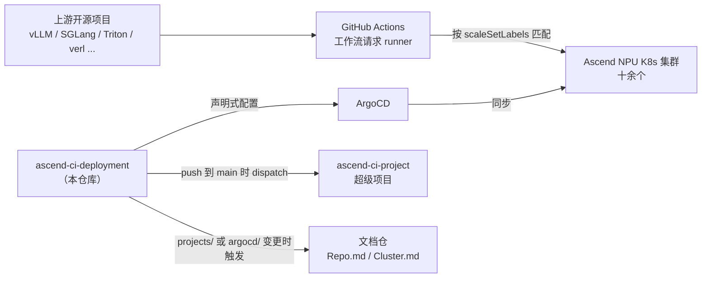

# ascend-ci-deployment 项目概述

## 1. 职责

在搭载华为 Ascend NPU 的 Kubernetes 集群上部署 GitHub Actions Runner Controller（ARC），让各组织和仓库能够接入 Ascend CI。

这是一个 **GitOps 配置仓库**，不含运行时业务代码。仓库里存放的是 K8s manifests、Helm values 和 Kustomize overlays，由 ArgoCD 读取并同步到目标集群，最终拉起 GitHub Actions 自托管 runner。

要解决的问题：Ascend CI 的 runner 分布在十余个集群、服务数十个上游开源项目（vLLM、SGLang、Triton、verl 等），每个项目对 NPU 型号和数量的需求各不相同。手工维护这些部署配置无法保证一致性，也无法追溯变更。把配置收敛到一个仓库并由 ArgoCD 声明式同步，变更即 PR，状态可追溯。

## 2. 定位

| 关系 | 对象 | 机制 |
|---|---|---|
| 上游 | 各开源项目的 GitHub 工作流 | 工作流声明 `runs-on` 标签，由本仓库部署的 runner 承接 |
| 下游 | Ascend NPU K8s 集群 | ArgoCD 从本仓库拉取配置并同步 |
| 归属 | `opensourceways/ascend-ci-project` | 作为子模块，push 到 `main` 时通过 `notify-superproject.yml` 向超级项目发 `submodule-updated` 事件 |
| 联动 | 文档仓 | `projects/` 或 `argocd/` 变更时，`notify-docs-refresh.yml` 触发文档仓刷新 `Repo.md` 与 `Cluster.md` |

## 3. 边界

以下事项看起来相关，但不由本仓库负责：

| 不负责 | 实际负责方 |
|---|---|
| ARC 控制器本身的代码实现 | 上游 `actions/actions-runner-controller`，本仓库只声明版本与 values |
| runner 容器镜像的构建 | 镜像由外部构建后推送到华为 SWR，本仓库只引用地址 |
| 调度算法 | 集群内的 `volcano` 与 `npu-scheduler`，本仓库只在 pod spec 里指定 `schedulerName` 与队列注解 |
| 密钥的存储与轮转 | Vault，本仓库只声明 `SecretDefinition` 指向 Vault 路径 |
| K8s 集群本身的创建与运维 | 集群管理方，本仓库假定集群已存在且 ArgoCD 已接入 |
| runner 的实际执行与日志 | GitHub Actions 平台与 runner pod 自身 |
| 跨集群网络互通 | Liqo（vendored 在 `manifests/liqo/`，第三方组件） |

## 4. 核心能力

| 能力 | 承载模块 |
|---|---|
| ARC 控制器部署 | `argocd/controllers/arc-controller-{cluster}.yaml` + `manifests/arc-controller-{version}/` |
| 活跃项目的 runner 部署 | `projects/{org}/{repo}/` |
| 低活跃项目的 runner 保留 | `other/{org}/{repo}/` |
| 每集群的 Application 编排 | `argocd/clusters/{cluster}/` |
| 共享基础设施组件 | `manifests/`（karmada-operator、liqo、buildkitd、git-cdn 等） |
| 集群监控 | `monitoring/`（Prometheus、Alertmanager、kube-state-metrics、node-exporter、pushgateway） |
| 配置结构自动校验 | `.github/workflows/ci-lint.yml` + `scripts/argocd-app-lint.sh` + `scripts/check-projects-coverage.py` |
| 部署文件自动生成 | `.claude/skills/arc-deploy/` |
| 镜像同步到内网 SWR | `.github/workflows/sync-images.yml`（每日 cron） |

规模参考：2224 个文件，覆盖 12 个活跃项目组织、十余个集群、354 个 Helm chart 实例。
