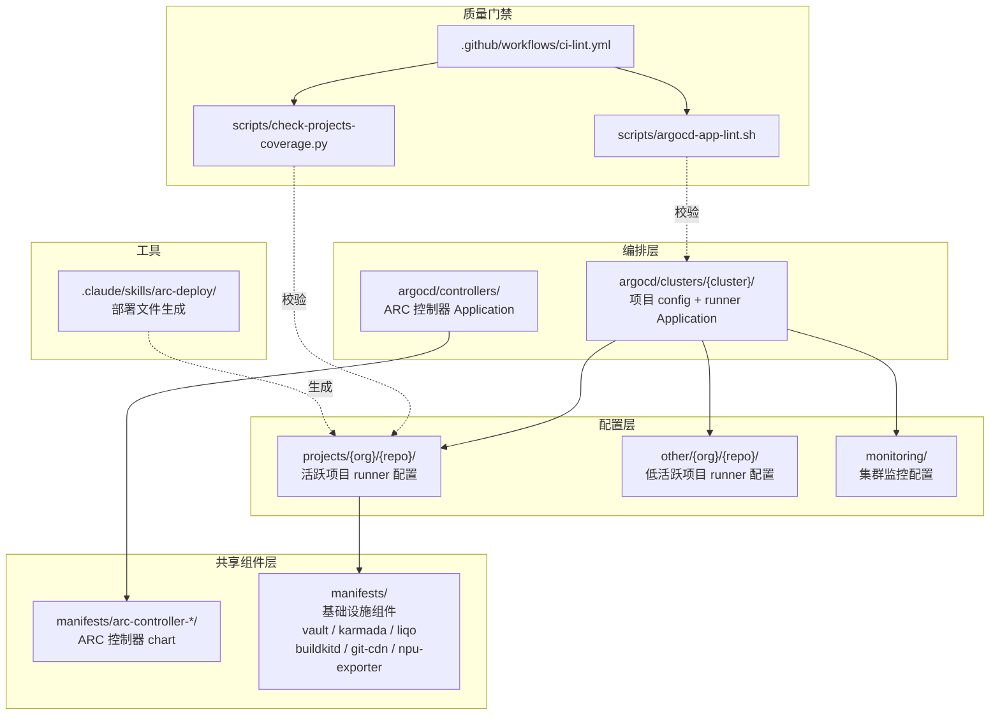
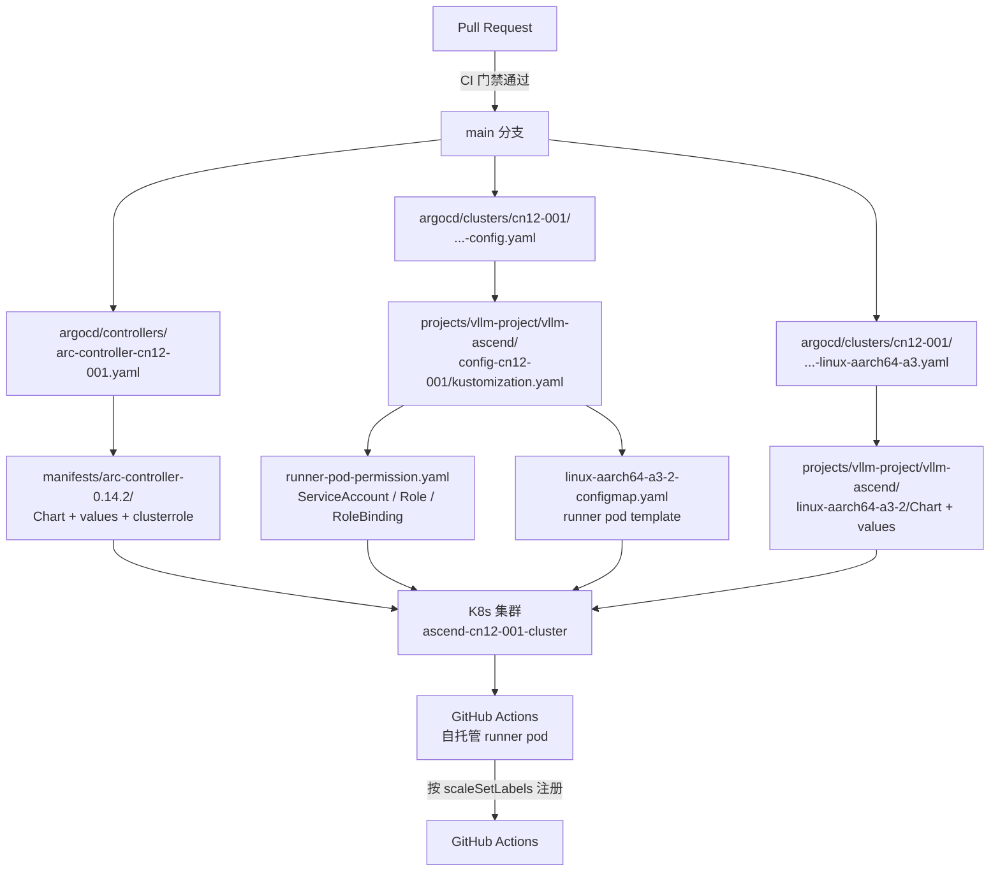

# ascend-ci-deployment 技术栈与架构设计

## 1. 语言与运行时

| 语言 | 负责部分 |
|---|---|
| YAML | 主体。K8s manifests、Helm values、Kustomize overlays、ArgoCD Application、CI 工作流 |
| Go template（`gotmpl`/`tpl`） | Helm chart 的 `templates/` 渲染 |
| Python | CI 校验脚本（`scripts/check-projects-coverage.py`）及其测试 |
| Shell | CI 校验脚本（`scripts/argocd-app-lint.sh`）、辅助脚本 |
| Markdown | 文档与 Claude Agent skill 定义 |

运行时要求：CI 作业统一在 `python:3.12` 容器内、`linux-amd64-cpu-1` runner 上执行。仓库本身无服务运行时——产物由 ArgoCD 消费。

## 2. 构建与依赖

无编译构建环节。「构建」等价于 Helm 依赖解析与 Kustomize 渲染，由 ArgoCD 在同步时完成。

### 核心依赖

| 组件 | 版本 | 声明位置 |
|---|---|---|
| `gha-runner-scale-set-controller` | 0.14.2 | `manifests/arc-controller-0.14.2/Chart.yaml` |
| `gha-runner-scale-set`（runner 侧） | 0.14.2 / 0.13.0 / 0.12.0 | 各 `{runner-variant}/Chart.yaml` |
| ARC 定制控制器镜像 | `swr.cn-southwest-2.myhuaweicloud.com/modelfoundry/gha-runner-scale-set-controller:0.14.201` | 各集群 `argocd/controllers/*.yaml` 的 inline helm values |
| `kube-prometheus-stack` | 85.1.3 | `monitoring/prometheus/Chart.yaml` |
| `liqo` / `liqo-crds` | 0.1.0（appVersion v1.2.0） | `manifests/liqo/liqo-1.2.0/Chart.yaml` |
| `karmada-operator` | 0.0.1 | `manifests/karmada-operator/Chart.yaml` |
| `secrets-manager` CRD | `secrets-manager.tuenti.io/v1alpha1` | 各 `SecretDefinition` 资源 |
| yamllint | `extends: default`，`line-length.max: 200` | `.yamllint` |

### 上游 chart 来源

依赖声明去重后只有 6 种，镜像仓库分两路：

| 仓库 | 用途 |
|---|---|
| `oci://ghcr.io/actions/actions-runner-controller-charts` | GitHub 官方源 |
| `oci://ghcr.nju.edu.cn/actions/actions-runner-controller-charts` | NJU 镜像源，用于网络受限环境 |

### ARC 版本分布

| 版本 | Chart 实例数 |
|---|---|
| 0.14.2 | 170 |
| 0.13.0 | 140 |
| 0.12.0 | 25 |
| 其他组件 | 19 |

集群与 ARC 版本对应：gy-004 / gy-005 / gy-006 / cn12-001 用 0.14.2；gy-003 / hk-001 / hk-ci / hb-003 / hb-003-verl / hidevlab-k8s / verl-suzhou / karmada-test 用 0.13.0。

## 3. 整体架构

分层职责：**编排层**声明「部署什么到哪个集群」，**配置层**定义「部署内容长什么样」，**共享组件层**提供被复用的 chart，**质量门禁**在 PR 阶段校验前三层的结构一致性。

规模：27 个集群目录、`projects/` 与 `other/` 各 12 个组织、354 个 chart 实例、31 个共享基础设施组件。

## 4. 调用链

以 `cn12-001` 集群上 `vllm-project/vllm-ascend` 项目为例的完整链路：

1. **CI 门禁**。PR 修改 `**.yaml`、`.yamllint` 或校验脚本时触发四个 job：`yamllint`、`argocd-app-lint`、`check-projects-coverage`、`check-scale-set-labels`。标题含 `[skip ci]` 可跳过。
2. **ARC 控制器部署**。`arc-controller-cn12-001.yaml` 把 ARC chart 同步到 `arc-systems` 命名空间，并通过 inline helm values 覆盖注入华为 SWR 定制镜像。chart 自身 `values.yaml` 用的是 NJU 默认镜像。
3. **Kustomize 配置同步**。config Application 指向 `config-cn12-001/kustomization.yaml`，聚合 namespace、存储、RBAC、密钥、Docker CLI installer 与 runner pod template。
4. **Runner Helm 部署**。runner Application 指向 `linux-aarch64-a3-2/`，chart 依赖上游 `gha-runner-scale-set 0.14.2`，values 设置 `scaleSetLabels: [linux-aarch64-a3-2, gy-005]` 与 NPU 相关的 pod 标签。
5. **落地集群**。ARC 控制器监听 GitHub 的 job 队列，按 `scaleSetLabels` 匹配后创建 ephemeral runner pod，pod 由 `volcano` 或 `npu-scheduler` 调度到有对应加速卡的节点（取决于该 runner 的 `schedulerName` 配置，详见第 6 节）。
6. **监控并行采集**。`monitoring/` 下的 Prometheus 通过基于文件的服务发现跨集群抓取指标，与部署链路解耦。

### runner pod 的 NPU 声明方式

NPU 需求通过 pod 标签表达，不是 `nodeSelector`：

| 标签 | 含义 |
|---|---|
| `ascend-ci.com/npu-resource-model` | NPU 型号，如 `ascend-1980` |
| `ascend-ci.com/npu-resource-domain` | 资源域，如 `huawei.com` |
| `ascend-ci.com/required-npu-count` | 单个 runner pod 需要的 NPU 张数 |

`values.yaml` 里的 `nodeSelector` 只用于架构筛选（如 `beta.kubernetes.io/arch: amd64`）。

## 5. Runner 机型

runner 目录名编码了机型信息：`linux-{arch}-{加速卡型号}-{数量}`。仓库共 329 个
runner chart 实例，归为以下机型族：

| 机型族 | 实例数 | 说明 |
|---|---|---|
| `linux-aarch64-a3` | 99 | Ascend A3，aarch64 |
| `linux-aarch64-a2` | 60 | Ascend A2，aarch64 |
| `linux-amd64-cpu` | 35 | 纯 CPU，x86_64 |
| `linux-aarch64-a2b3` | 33 | Ascend A2 B3 变体 |
| `linux-arm64-npu` | 16 | 早期 NPU 命名（ARC 0.12/0.13 时期） |
| `linux-aarch64-a2b4` | 11 | Ascend A2 B4 变体 |
| `linux-aarch64-cpu` | 10 | 纯 CPU，aarch64 |
| `linux-aarch64-310p` | 9 | Ascend 310P |
| `linux-aarch64-a5` | 8 | Ascend A5 |
| `linux-aarch64-a3-800t` | 8 | Ascend A3 800T 机型 |
| `linux-aarch64-a2b1` | 8 | Ascend A2 B1 变体 |
| `linux-arm64-cpu` | 7 | 纯 CPU，arm64 命名 |
| `linux-aarch64-nightly-a3` | 4 | A3 nightly 构建专用 |
| `linux-amd64-a5` | 3 | Ascend A5，x86_64 宿主 |

另有单实例的专用机型：`linux-amd64-vllm-a2`/`-a3`、`linux-amd64-sglang-a2`/`-a3`、
`linux-amd64-verl-a3`、`linux-amd64-sync-hk001`，以及虚拟化切分机型
`linux-aarch64-a2-5c8g-v-gy006`、`linux-aarch64-a2-10c16g-v-gy006`、
`linux-aarch64-a2b3-v-quarter`、`linux-aarch64-a2b3-v-half`（`-v-` 表示 vNPU 切分）。

数量后缀含义：`-0` 表示无加速卡（仅 CPU 调度），`-1`/`-2`/`-4`/`-8`/`-16` 表示
单 pod 占用的加速卡张数。

**注意区分**：`.github/workflows/ci-lint.yml` 中 `runs-on: linux-amd64-cpu-1` 是
执行 CI 校验作业的 runner，属于上述 `linux-amd64-cpu` 机型族的一个实例，不代表
本仓库部署的 runner 机型范围。

## 6. 调度机制

三种调度器并存，按 `schedulerName` 字段区分：

| 调度器 | 出现次数 | 主要位置 |
|---|---|---|
| `volcano` | 255 | 主要在 config overlay 的 pod template configmap（236 处） |
| `npu-scheduler` | 180 | 主要在 runner chart 的 `values.yaml`（178 处） |
| `runner-pod-npu-scheduler` | 22 | `values.yaml`（21 处） |
| `default-scheduler` | 2 | 显式指定默认调度器 |

未声明 `schedulerName` 的 runner（多为纯 CPU 机型）走 K8s 默认调度器。

### Volcano

`volcano` 是使用最多的调度器，承担批处理与队列管理。相关组件在
`manifests/volcano-controller-sh-001/`、`manifests/volcano-controller-sh-002/`、
`manifests/volcano-queue/`，共 287 个文件涉及 volcano 配置。

队列通过 `scheduling.volcano.sh/queue-name` 注解分配（64 处使用）：

| 队列 | 使用次数 |
|---|---|
| `vllm-queue` | 24 |
| `sglang-queue` | 16 |
| `vllm-test-queue` | 10 |
| `verl-queue` | 6 |
| `sglang-npu-cn12-queue` | 4 |
| `sgl-kernel-npu-cn12-queue` | 4 |

使用 volcano 最多的项目：`projects/vllm-project/vllm-ascend`（39 处）、
`other/ascend-gha-runners/vllm-ascend`（38 处）、`projects/sgl-project/sglang`（20 处）、
`other/nv-action/vllm-benchmarks`（14 处）、`projects/triton-lang/triton-ascend`（12 处）。

### npu-scheduler

负责 NPU 拓扑感知调度，配合 `ascend-ci.com/*` 系列 pod 标签工作。主要写在 runner
chart 的 `values.yaml` 中。

### 两层声明：这是约定，不是冲突

同一个 runner 的 `schedulerName` 在两处声明，且两处**故意不同**：

| 位置 | schedulerName | 作用对象 |
|---|---|---|
| `{runner-variant}/values.yaml` | `npu-scheduler` | Helm chart 渲染出的 listener / controller pod |
| `config-{cluster}/{runner}-configmap.yaml` | `volcano` | 实际执行 job 的 ephemeral runner pod |

在 124 对可比对的 runner 中，120 对是 `npu-scheduler → volcano`、4 对是
`volcano → volcano`，反向 0 例。方向完全一致，说明这是刻意的分层设计：控制面走
NPU 拓扑感知调度，数据面（真正跑 job 的 pod）走 volcano 的队列与批处理。

修改调度器时必须确认改的是哪一层 —— 改错层不会报错，但不会生效在预期的 pod 上。
