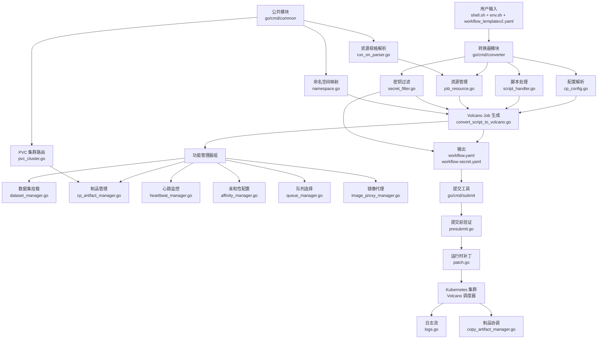
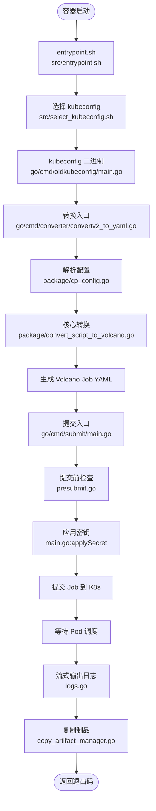

# CodeArts Workflow Image 技术栈文档

## 1. 语言与运行时

| 语言 | 版本 | 负责部分 | 声明位置 |
|------|------|----------|----------|
| Go | 1.24.2 | 转换器（converter）、提交工具（submit）、辅助工具（kubeconfig/envrender/ns/parser） | `go/go.mod` |
| Shell (Bash) | - | 容器入口点、工作流执行脚本、CI 检查脚本 | `Dockerfile`, `src/entrypoint.sh`, `src/unit.sh` |

**运行时要求**：
- 构建阶段：`golang:1.24-alpine`
- 运行阶段：`alpine:3.18` + `bash` + `kubectl`（版本从 https://dl.k8s.io/release/stable.txt 获取）

## 2. 构建与依赖

| 组件 | 版本 | 声明位置 |
|------|------|----------|
| go.yaml.in/yaml/v3 | v3.0.4 | `go/go.mod` (direct) |
| github.com/kr/pretty | v0.3.1 | `go/go.mod` (indirect) |
| github.com/rogpeppe/go-internal | v1.14.1 | `go/go.mod` (indirect) |
| gopkg.in/check.v1 | v1.0.0-20201130134442-10cb98267c6c | `go/go.mod` (indirect) |

**构建工具**：
- Docker multi-stage build（`Dockerfile`）
- Go 编译：`CGO_ENABLED=0`，生成静态二进制
- 构建产物：
  - `convert_to_yaml`（来源：`./cmd/converter`）
  - `kubeconfig`（来源：`./cmd/oldkubeconfig`，46 行，查找 kubeconfig.key 文件）
  - `submit`（来源：`./cmd/submit`）

**质量工具**（`AGENTS.md`, `.golangci.yml`）：
- golangci-lint（12 个启用的 linter，超时 5m，gocyclo 复杂度阈值 20）
- 测试覆盖率要求：>90% 路径覆盖

## 3. 整体架构

## 4. 调用链

**调用链说明**：

1. **容器入口**（`src/entrypoint.sh`）：设置 `BASH_ENV=/usr/local/bin/signal_forward.sh` 用于信号转发，启动工作流执行。

2. **kubeconfig 查找**（`src/select_kubeconfig.sh` 调用 `go/cmd/oldkubeconfig/main.go`）：通过 `findKubeconfigKeyFile` 函数查找 kubeconfig.key 文件名（46 行实现）。

3. **配置解析**（`go/cmd/converter/package/cp_config.go`）：读取 `workflow_templatev2.yaml`、`env.sh`、`shell.sh`，调用 `isConfigEnv()` 和 `isSystemEnv()` 分类环境变量。

4. **核心转换**（`go/cmd/converter/package/convert_script_to_volcano.go`）：调用 `ConvertScriptToVolcano`，接入 dataset_manager、heartbeat_manager、affinity_manager、queue_manager、image_proxy_manager 等功能管理器，生成 Volcano Job CRD。

5. **命名空间映射**（`go/cmd/common/namespace/namespace.go` 的 `GetNamespaceFromRepoName`）：将仓库名小写后与 17 个硬编码关键字（如 "ascend-op-plugin", "ascend-recsdk"）匹配，返回对应的命名空间常量，无匹配时默认 "argo"。

6. **提交前验证**（`go/cmd/submit/presubmit.go`）：检查 Job 规格，应用 patch.go 中的运行时补丁。

7. **Job 提交**（`go/cmd/submit/main.go`）：应用 `workflow-secret.yaml`（如有），提交 `workflow.yaml` 到 Kubernetes，等待 Karmada ResourceBinding 创建。

8. **日志与制品**（`go/cmd/submit/logs.go`，`copy_artifact_manager.go`）：流式获取容器日志，任务完成后复制制品到指定 PVC。

## 5. 运行载体

**容器镜像**：基于 `alpine:3.18`，包含 Go 编译的二进制、kubectl、bash、curl、gzip、jq。工作目录 `/workspace`，默认 KUBECONFIG 为 `/workspace/workflowtool/k8s-cluster-kubeconfig.yaml`。

**NPU 资源类型**（全仓实测分布）：
- `huawei.com/ascend-1980`：44 个配置
- `huawei.com/ascend-310`：19 个配置

**镜像仓库前缀**（全仓实测分布）：
- `swr.cn-southwest-2.myhuaweicloud.com`：172 个配置
- `swr.cn-north-4.myhuaweicloud.com`：24 个配置
- `swr.ap-southeast-1.myhuaweicloud.com`：2 个配置

**资源规格解析**（`go/cmd/common/run_on_parser.go`）：解析 `CP_runs_on` 环境变量（逗号分隔的 key=value 格式），提取 CPU、内存（支持 K/M/G/T 单位）、架构、NPU 芯片类型，支持多芯片组合（如 310P3）。

## 6. 调度与编排

**调度器**（全仓实测分布）：
- `default-scheduler`：6 个配置
- `volcano`：1 个配置
- 大部分配置未显式声明 `schedulerName`

**Volcano 队列选择**（`go/cmd/converter/package/queue_manager.go`）：根据 `RunOnSpec` 和 CPU 数量确定目标队列。队列配置位于 `configs/queues/`：
- `default.yaml`：默认队列
- `large-task-shared-queue.yaml`：大任务共享队列
- `shared-flexible-queue.yaml`：灵活共享队列

**亲和性配置**（`go/cmd/converter/package/affinity_manager.go`）：根据解析的 NPU 芯片类型（如 ascend-1980、ascend-310）构建 Kubernetes 节点亲和性规则，确保 Pod 调度到匹配的节点。

**传播策略**（`configs/propagation-policies/`）：使用 Karmada 多集群调度，策略包括：
- `default-volcano-global-dispatch-policy.yaml`：Volcano 全局调度策略
- `argo-policy.yaml`、`ragsdk-policy.yaml`：命名空间级策略

**心跳监控**（`go/cmd/converter/package/heartbeat_manager.go`）：为 Job 添加心跳 sidecar，当客户端断连时杀死 Pod。使用 cgroup-based 自跳过机制规避 CCE 环境中 `$$` 被 docker pause 进程覆盖的问题（来源：git commit `0d254d4`, `953a259`）。
