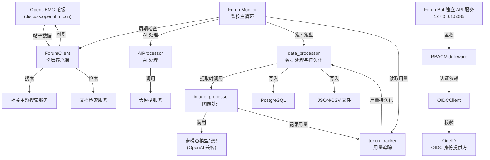
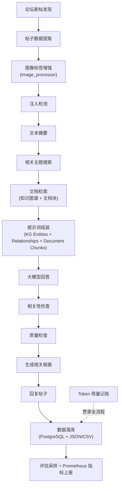
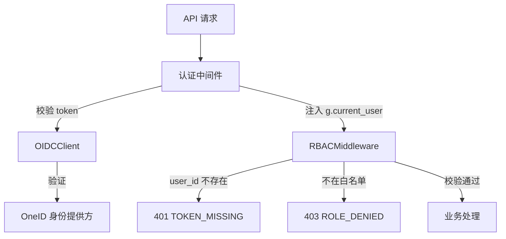

# ForumBot 项目架构文档

## 1. 项目定位

ForumBot 是一个面向 OpenUBMC 技术论坛（discuss.openubmc.cn）的自动化智能助手系统。它持续监控论坛新帖，通过检索增强生成（RAG）技术自动回复用户问题，同时具备知识上传管理能力。

**核心价值主张：**

- 自动监控论坛新帖，减少人工值守成本
- 结合知识图谱与文档检索，生成高质量的技术回复
- 多模态处理能力，能理解帖子中的截图与图片内容
- 完整的质量把关链路（注入检测、相关性检查、质量检查），确保回复可靠性
- 按主题粒度追踪模型调用开销，支撑成本管控

## 2. 架构设计

### 2.1 核心模块划分

| 模块 | 职责 | 文件路径 |
|------|------|----------|
| ForumMonitor | 论坛监控主循环，驱动新帖与预审帖的全流程处理 | `wiki/entities/forummonitor.md` |
| ForumClient | 论坛客户端，封装主题抓取、详情获取、回复、搜索与文档检索 | `wiki/entities/forumclient.md` |
| data_processor | 数据处理与持久化，DB+文件双写 | `wiki/entities/data-processor.md` |
| image_processor | 图像处理，为文本中的图片标签生成描述 | `wiki/entities/image-processor.md` |
| token_tracker | Token 用量追踪，按主题累计模型调用开销 | `wiki/entities/token-tracker.md` |
| api_main | 命令行入口，负责启动独立 API 服务 | `wiki/entities/api-main.md` |
| standalone_api | API 服务启动器 | `wiki/entities/standalone-api.md` |
| RBACMiddleware | 知识上传白名单鉴权中间件 | `wiki/entities/rbacmiddleware.md` |
| OIDCClient | OIDC 认证客户端，对接 OneID | `wiki/entities/oidcclient.md` |
| logging_config | 统一日志配置，导出 main_logger | `wiki/entities/logging-config.md` |

### 2.2 架构总览



### 2.3 数据流



## 3. 关键机制

### 3.1 论坛监控流水线

`ForumMonitor` 以 `while True` 主循环运行，按 `check_interval` 周期执行检查，处理链路为：

发现新帖 → 注入检测 → 摘要 → 搜索 → 检索 → 大模型回答 → 相关性/质量把关 → 回复 → 落库 → 评估采样 → 指标上报

（来源：`wiki/entities/forummonitor.md`）

### 3.2 检索增强生成（RAG）

提示词组装将三类检索上下文结构化编码：

1. **Entities(KG)** — 知识图谱实体
2. **Relationships(KG)** — 知识图谱关系
3. **Document Chunks(DC)** — 文档块

再追加实时搜索结果，统一填充进 `PROMPT_TEMPLATE`。

（来源：`wiki/concepts/检索上下文与提示词组装.md`）

### 3.3 相关链接生成策略

采用知识图谱链接优先、搜索结果补充的策略，使用投票阈值机制（`KG_VOTE_THRESHOLD=5`）筛选高质量链接，最终保留不超过 5 条。

（来源：`wiki/entities/forummonitor.md`）

### 3.4 图片标签提取与增强

通过正则提取 `[img: (...)]` 标签，按上下文切换提示词策略：
- `user_question`：逐字提取截图文字
- `best_answer`：总结关键技术信息

模型按 model1 → model2 → model3 故障转移调用。

（来源：`wiki/other/图片标签提取与增强机制.md`）

### 3.5 Token 用量追踪

以 `topic_id` 为聚合键的内存记账机制，全局单例模式，累加 `prompt_tokens`/`completion_tokens`/`total_tokens`/`model_calls` 四项指标，最终由 `data_processor` 通过 upsert 语义持久化到 `consume_tokens_topic` 表。

（来源：`wiki/concepts/token-用量追踪模型.md`）

### 3.6 数据持久化 — DB+文件双写

所有处理结果同时写入 PostgreSQL 与 JSON/CSV 文件。数据库保证结构化查询，文件保留原始快照便于调试。Token 用量采用 `ON CONFLICT DO UPDATE` 的 upsert 语义，增量去重通过加载已有 ID 集合实现。

（来源：`wiki/concepts/数据处理与持久化模型.md`）

### 3.7 认证与鉴权分层



认证（OIDC）负责"你是谁"，鉴权（白名单）负责"能否上传知识"，两层职责清晰分离。

（来源：`wiki/concepts/知识上传白名单鉴权模型.md`、`wiki/entities/rbacmiddleware.md`）

### 3.8 独立 API 服务部署

通过命令行参数（`--host`、`--port`、`--config`）灵活配置，启动流水线为：路径注入 → 参数解析 → 日志初始化 → 委托 `standalone_api` 启动服务。默认监听 `127.0.0.1:5085`。

（来源：`wiki/concepts/独立-api-服务部署模型.md`）

## 4. 目录结构

```
项目根目录/
├── api_main.py                # 独立 API 服务命令行入口
├── src/
│   ├── ForumBot/              # 核心业务包
│   │   ├── logging_config.py  # 统一日志配置，导出 main_logger
│   │   └── ...
│   ├── data_processor.py      # 数据处理与持久化模块
│   ├── token_tracker.py       # Token 用量追踪模块（全局单例）
│   ├── image_processor.py     # 图像处理模块（多模态描述生成）
│   ├── forum_client.py        # 论坛客户端（抓取/搜索/检索/回复）
│   ├── monitor.py             # ForumMonitor 论坛监控主循环
│   ├── standalone_api.py      # API 服务启动器
│   ├── rbac_middleware.py     # 知识上传白名单鉴权中间件
│   └── oidc_client.py         # OneID OIDC 认证客户端
├── config.yaml                # 应用配置文件（oidc/rbac/api/posts/search/retrieval 等段）
└── forum_data_dir/            # 文件落盘目录
    ├── search_results_topic_{id}_{ts}.json
    ├── retrieval_results_{ts}.json
    └── *.csv                  # 帖子数据 CSV
```

## 5. 外部依赖

| 外部系统 | 用途 | 来源 |
|----------|------|------|
| OpenUBMC 论坛 | 帖子内容来源与回复目标 | `wiki/entities/openubmc-论坛.md` |
| OneID | OIDC 身份提供方 | `wiki/entities/oneid.md` |
| 多模态模型服务 | 图片描述生成（OpenAI 兼容协议） | `wiki/entities/多模态模型服务.md` |
| 大模型服务 | 问答回复生成 | `wiki/entities/forummonitor.md` |
| 相关主题搜索服务 | 关键字搜索相关主题 | `wiki/entities/forumclient.md` |
| 文档检索服务 | RAG 文档块检索 | `wiki/entities/forumclient.md` |
| PostgreSQL | 结构化数据持久化 | `wiki/concepts/数据处理与持久化模型.md` |
| Prometheus | 监控指标上报 | `wiki/entities/forummonitor.md` |

## 6. 技术栈

- **语言**：Python
- **Web 框架**：Flask（推断自 `g.current_user`、视图装饰器等模式）
- **数据库**：PostgreSQL（psycopg2 驱动）
- **认证协议**：OIDC / OAuth2 授权码模式
- **模型接口**：OpenAI 兼容 API
- **监控**：Prometheus
- **论坛平台**：Discourse