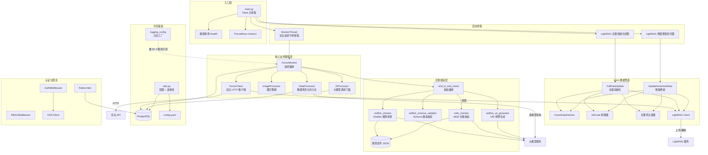
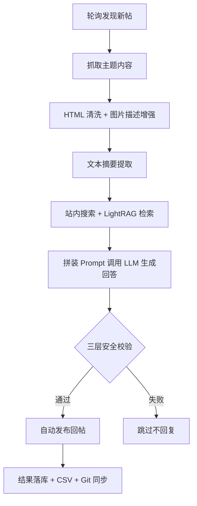
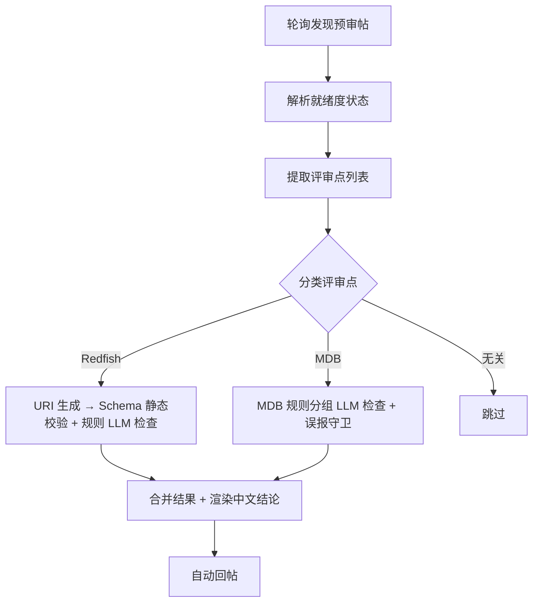
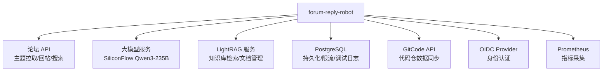

# forum-reply-robot 项目架构文档

## 1. 项目定位

**forum-reply-robot** 是一个自动监控论坛新帖并调用大模型智能回复的机器人服务。

**核心问题**：论坛技术问答需要人工值守和及时响应，同时针对 Redfish/MDB 规范的预审帖需要专业的合规性校验。

**核心价值主张**：
- 周期性轮询论坛发现新帖，经知识检索增强后调用 LLM 生成高质量回答并自动回帖
- 对预审标签帖执行 Redfish Schema 与 MDB 规则的结构化合规校验，输出专业审查意见
- 三层安全把关（提示注入检测、答案相关性校验、质量校验），校验失败默认不回复

**技术栈**：Python 3.9 / Flask / LangChain / OpenAI / PostgreSQL / LightRAG / Prometheus / Docker

---

## 2. 架构设计

### 2.1 核心模块划分

| 层次 | 模块 | 职责 |
|------|------|------|
| API 接入层 | `main.py`, `src/external_api_app.py`, `src/ForumBot/rag_api.py` | Flask 应用工厂、健康检查、Prometheus 指标、RAG API |
| 认证与访问控制 | `auth_middleware.py`, `rbac_middleware.py`, `oidc_client.py`, `rate_limiter.py` | OIDC 认证、RBAC 授权、基于 PostgreSQL 的限流 |
| 核心业务服务 | `monitor.py`, `ai_processor.py`, `forum_client.py`, `image_processor.py` | 论坛监控编排、大模型调用、论坛交互、图片理解 |
| 合规校验层 | `SchemaValidation/`, `MdbValidation/` | Redfish Schema 静态校验 + LLM 规则检查、MDB 合规校验 |
| RAG 数据管道 | `src/update_lightrag/` | LightRAG 知识库全量初始化与增量更新 |
| 共享工具与可观测 | `utils.py`, `logging_config.py`, `prometheus_metrics.py`, `token_tracker.py` | 连接池、日志、指标、token 统计 |
| 效果评测 | `src/evaluation/` | 离线评测数据集构建与 LLM-as-judge 基线跑分 |

### 2.2 架构流程图



### 2.3 数据流

**链路一：常规智能问答**



**链路二：AI 预审合规校验**



---

## 3. 关键机制

### 3.1 进程模型

`main()` 启动后：
1. 加载配置 → 校验 Schema/MDB 规则文件完整性
2. 主线程运行 Flask（健康检查 + Prometheus 指标）
3. 后台守护线程 1：`MonitorThread` 运行 `ForumMonitor` 阻塞式监控循环
4. 后台守护线程 2：LightRAG 全量初始化
5. 后台守护线程 3：`schedule` 驱动的增量更新定时器

守护线程在主线程退出时自动终止，无需进程管理器。

参考：`main.py`

### 3.2 多模型轮询与重试

`AIProcessor` 维护候选模型列表（`model_list`），按序尝试每个模型，遇到 `APIError` / `APITimeoutError` 自动切换下一个，实现 fallback 降级。业务层无需处理模型级异常。

参考：`src/ForumBot/ai_processor.py`

### 3.3 三层安全把关

1. **提示注入检测** — 检测用户输入是否包含注入攻击
2. **答案相关性校验** — 验证生成的回答是否与问题相关
3. **质量校验** — 评估回答的整体质量

任一层校验失败，默认不回复。

参考：`src/ForumBot/ai_processor.py`

### 3.4 规则外置（Rules-as-Data）

合规规则以 JSON 文件形式外置，直接拼入 LLM Prompt 供模型判定：
- Redfish 规则：17 条 `RULE-NNN`（`redfish_compliance_rules.json`）
- MDB 规则：v6.3（45 条）/ v6.5（26 条）并存，按版本切换

规则演进无需改代码，但需配套 JSON 修复与字段补全来应对 LLM 结构化输出的不稳定性。

参考：`src/ForumBot/SchemaValidation/SchemaFiles/redfish_compliance_rules.json`, `src/ForumBot/MdbValidation/MdbRuleFiles/`

### 3.5 误报守卫层（False Positive Guard）

MDB 检查器内置多个 `_has_refuted_*` 断言函数，用规则化的文本证据反驳 LLM 的错误结论：
- 缺失字段列 → 用正文表格内容反驳
- 缺失表格 → 匹配表头签名反驳
- 复位持久化矛盾 → 语义比对反驳
- 接口路径泛化 → 具体路径反驳

参考：`src/ForumBot/MdbValidation/mdb_checker.py`

### 3.6 静态后检查（Static Postcheck）

Redfish 检查器在 LLM 判定之外，补充确定性的静态类型一致性比对：从 Markdown/HTML 表格和 JSON Schema 片段中提取属性类型映射做交叉验证，纠正模型的漏判与误判。

参考：`src/ForumBot/SchemaValidation/redfish_checker.py`

### 3.7 RAG 知识库管道

- **全量初始化**：串联论坛 + GitCode 全量抓取 → 关键词过滤 → 多模态图片描述增强 → 上传 LightRAG
- **增量更新**：`schedule` 定时触发，按上次更新时间戳拉取增量数据
- **并发控制**：`LightRAGClient` 通过 `wait_for_pipeline_status_not_busy` 阻塞式轮询避免写入冲突

参考：`src/update_lightrag/full_data_init.py`, `src/update_lightrag/increment_date_update_timer.py`, `src/update_lightrag/lightrag_client.py`

### 3.8 模块级单例模式

`logging_config.py` 的 `main_logger` 和 `utils.py` 的数据库连接池利用 Python 模块首次 import 时执行顶层代码的特性，构成隐式单例，全局共享。

参考：`src/ForumBot/logging_config.py`, `src/utils.py`

### 3.9 可观测性

- Prometheus 指标：检索/生成/端到端延迟、空回复率、处理量
- Token 用量追踪：按模型维度累加，兼容多种 LLM SDK 响应格式
- Schema 调试日志：以 JSONB 形式将每个 topic 的处理全过程写入 PostgreSQL

参考：`src/ForumBot/prometheus_metrics.py`, `src/ForumBot/token_tracker.py`, `src/ForumBot/SchemaValidation/schema_debug_logger.py`

---

## 4. 目录结构

```
forum-reply-robot/
├── main.py                          # 服务主入口，Flask + 后台守护线程
├── config/
│   └── config.yaml                  # 运行时配置（大模型 API 凭据）
├── src/
│   ├── __init__.py
│   ├── utils.py                     # 配置加载、目录操作、PostgreSQL 连接池
│   ├── external_api_app.py          # 独立调试用 API 应用工厂
│   ├── ForumBot/
│   │   ├── __init__.py
│   │   ├── monitor.py              # 论坛监控主循环（业务编排中枢）
│   │   ├── ai_processor.py         # 大模型调用门面（摘要/检测/校验/重试）
│   │   ├── forum_client.py         # 论坛 HTTP 客户端
│   │   ├── data_processor.py       # 数据清洗与持久化
│   │   ├── image_processor.py      # 多模态图片描述增强
│   │   ├── logging_config.py       # 全局日志工厂（fan-in 最高，28 个模块引用）
│   │   ├── prometheus_metrics.py   # Prometheus 指标定义与更新
│   │   ├── token_tracker.py        # Token 用量累加器
│   │   ├── llm_token_usage.py      # Token 用量提取（兼容多 SDK）
│   │   ├── evaluation_hooks.py     # 评估埋点装饰器
│   │   ├── auth_middleware.py      # OIDC Bearer Token 认证
│   │   ├── rbac_middleware.py      # 用户白名单 RBAC
│   │   ├── oidc_client.py          # OIDC 协议客户端
│   │   ├── rate_limiter.py         # PostgreSQL 滑动窗口限流
│   │   ├── rag_api.py              # RAG API Blueprint
│   │   ├── standalone_api.py       # 独立问答 API 服务
│   │   ├── api_main.py             # 独立 API CLI 入口
│   │   ├── SchemaValidation/       # Redfish Schema 合规校验子系统
│   │   │   ├── end_to_end_check.py     # 校验编排层
│   │   │   ├── redfish_checker.py      # 规则批量 LLM 检查 + 静态后检查
│   │   │   ├── redfish_schema_validator.py  # JSON Schema 静态验证器
│   │   │   ├── redfish_uri_generator.py    # URI 样例 LLM 生成
│   │   │   ├── redfish_common.py       # 通用配置/工具/异常
│   │   │   ├── redfish_review_workflow.py  # 动态加载入口
│   │   │   ├── extract_reviews.py      # 评审点文本解析状态机
│   │   │   ├── schema_debug_logger.py  # 调试日志落库
│   │   │   └── SchemaFiles/
│   │   │       └── redfish_compliance_rules.json  # 17 条 Redfish 规则
│   │   └── MdbValidation/          # MDB 合规校验子系统
│   │       ├── mdb_checker.py          # MDB 规则 LLM 检查 + 误报守卫
│   │       ├── mdb_classifier.py       # MDB 相关性分类器
│   │       └── MdbRuleFiles/
│   │           ├── mdb_compliance_rules_v6.3.json  # 45 条规则
│   │           └── mdb_compliance_rules_v6.5.json  # 26 条规则
│   ├── update_lightrag/            # RAG 知识库数据管道
│   │   ├── full_data_init.py           # 全量初始化编排
│   │   ├── increment_date_update_timer.py  # 增量更新 + 定时调度
│   │   ├── forum_data_Fetcher.py       # 论坛数据抓取
│   │   ├── gitcode_client.py           # GitCode API 客户端
│   │   ├── gitode_full_fetcher.py      # GitCode 全量抓取
│   │   ├── gitcode_api_increment_fetcher.py  # GitCode 增量抓取
│   │   ├── lightrag_client.py          # LightRAG 服务客户端
│   │   ├── filter.py                   # 关键词过滤器
│   │   ├── image_processor.py          # 图片描述生成
│   │   └── update_time.py             # 时间戳读写
│   └── evaluation/                 # 离线效果评测
│       ├── build_dataset.py            # 评测集构建
│       ├── run_baseline.py             # LLM-as-judge 基线评估
│       └── templates.py                # 评分 Prompt 模板
├── Dockerfile                       # 单阶段容器构建（安全加固）
├── requirements.txt                 # 生产依赖（精确钉版本）
├── requirements-test.txt            # 测试依赖
├── requirements-eval.txt            # 评估依赖（占位）
├── pytest.ini                       # pytest 配置（禁用 asyncio 插件）
├── README.md                        # 项目主文档
└── CLAUDE.md                        # AI 协作工程约定
```

---

## 5. 外部依赖关系



---

## 6. 设计亮点与注意事项

**设计亮点**：
- 编排与执行分离：`monitor.py` 只做流程串联，具体能力下沉到专职模块
- 确定性校验补充概率性判定：静态后检查 + 误报守卫层修正 LLM 的不可靠输出
- 规则外置：合规标准随版本演进无需改代码
- 连接池集中管理：业务层只借还不创建

**注意事项**：
- `config.yaml` 中 `api_key` 明文存储，建议改用环境变量或密钥管理服务（参考：`config/config.yaml`）
- `standalone_api.py` 的 `/process_question` 接口无鉴权，直接暴露有被滥用风险（参考：`src/ForumBot/standalone_api.py`）
- 模块级全局变量持有连接池，调用方需成对使用 `get/release` 避免连接泄漏（参考：`src/utils.py`）