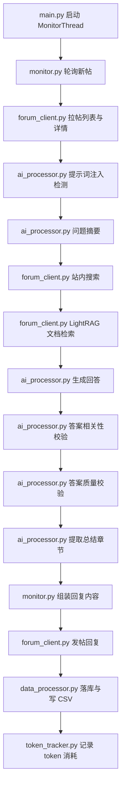
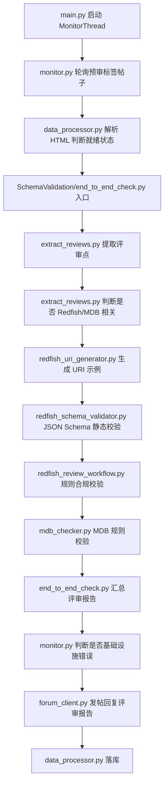
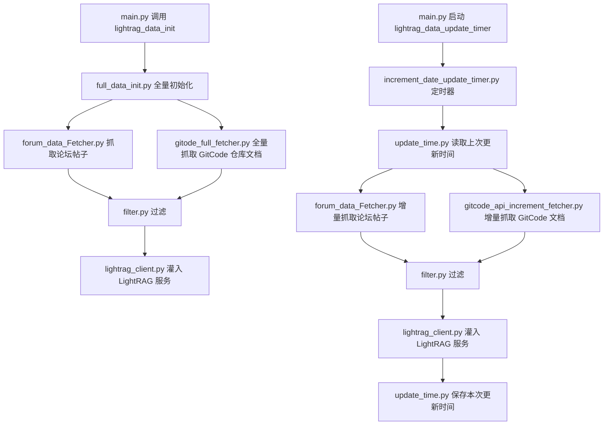

# 技术栈文档

## 1. 语言与运行时

**Python 3.10**（来源：`Dockerfile` 基础镜像 `python:3.10-slim`）

Python 3.10 负责全部业务逻辑，包括：
- 论坛 HTTP 客户端（拉帖、发帖、搜索）
- 大模型调用与答案生成
- Redfish/MDB 结构化校验
- LightRAG 知识库维护
- PostgreSQL 数据持久化
- Flask 健康检查服务

运行时环境变量（来源：`Dockerfile`）：
- `PYTHONDONTWRITEBYTECODE=1`：禁止生成 `.pyc` 字节码文件
- `PYTHONUNBUFFERED=1`：禁用输出缓冲，确保日志实时写出
- `PYTHONPATH=/app`：设置 Python 模块搜索路径

## 2. 构建与依赖

**构建工具**：Docker（来源：`Dockerfile`）

**包管理**：pip（来源：`requirements.txt`）

**关键依赖及版本**：

| 组件 | 版本 | 声明位置 |
|------|------|----------|
| openai | 1.109.1 | `requirements.txt` |
| langchain-openai | 0.3.35 | `requirements.txt` |
| langchain-core | 0.3.84 | `requirements.txt` |
| httpx | 0.28.1 | `requirements.txt` |
| requests | 2.33.0 | `requirements.txt` |
| beautifulsoup4 | 4.13.4 | `requirements.txt` |
| PyYAML | 6.0.2 | `requirements.txt` |
| pandas | 2.3.1 | `requirements.txt` |
| markdownify | >= 0.14 | `requirements.txt` |
| flask | 3.1.3 | `requirements.txt` |
| werkzeug | 3.1.6 | `requirements.txt` |
| pytz | 2025.2 | `requirements.txt` |
| psycopg2-binary | >= 2.9 | `requirements.txt` |
| python-json-logger | 3.0.0 | `requirements.txt` |
| python-dotenv | 1.2.1 | `requirements.txt` |
| retrying | 1.4.0 | `requirements.txt` |
| urllib3 | 2.6.3 | `requirements.txt` |
| schedule | 1.2.0 | `requirements.txt` |
| netifaces | 0.11.0 | `requirements.txt` |
| gitpython | 3.1.3 | `requirements.txt` |
| prometheus-client | 0.20.0 | `requirements.txt` |
| authlib | 1.3.1 | `requirements.txt` |
| cryptography | 42.0.8 | `requirements.txt` |

**构建期外部依赖**（来源：`Dockerfile`）：

1. Redfish Schema 文件：`git clone https://gitcode.com/Richardli25/Redfish_SchemaFiles.git` 到 `/app/src/ForumBot/SchemaValidation/SchemaFiles`
2. MDB 规则文件：`git clone https://gitcode.com/Richardli25/MDB_SchemaFiles.git` 到临时目录，再复制 `mdb_compliance_rules*.json` 到 `/app/src/ForumBot/MdbValidation/MdbRuleFiles/`
3. 缓存失效触发器：`ADD https://gitcode.com/Richardli25/Redfish_SchemaFiles.git/info/refs?service=git-upload-pack` 和 `ADD https://gitcode.com/Richardli25/MDB_SchemaFiles.git/info/refs?service=git-upload-pack`，使构建缓存随上游 HEAD 变化失效

## 3. 整体架构

```mermaid
flowchart TD
    main[main.py 生产入口] --> flask[Flask 健康检查服务]
    main --> monitor_thread[MonitorThread 守护线程]
    main --> lightrag_timer[LightRAG 定时器守护线程]
    
    monitor_thread --> monitor[ForumBot/monitor.py]
    monitor --> forum_client[ForumBot/forum_client.py]
    monitor --> ai_processor[ForumBot/ai_processor.py]
    monitor --> data_processor[ForumBot/data_processor.py]
    monitor --> schema_validation[ForumBot/SchemaValidation/]
    
    schema_validation --> end_to_end_check[end_to_end_check.py]
    schema_validation --> extract_reviews[extract_reviews.py]
    schema_validation --> redfish_schema_validator[redfish_schema_validator.py]
    schema_validation --> redfish_uri_generator[redfish_uri_generator.py]
    schema_validation --> redfish_review_workflow[redfish_review_workflow.py]
    schema_validation --> redfish_common[redfish_common.py]
    schema_validation --> schema_debug_logger[schema_debug_logger.py]
    schema_validation --> redfish_checker[redfish_checker.py]
    
    monitor --> mdb_validation[ForumBot/MdbValidation/]
    mdb_validation --> mdb_classifier[mdb_classifier.py]
    mdb_validation --> mdb_checker[mdb_checker.py]
    
    lightrag_timer --> update_lightrag[update_lightrag/]
    update_lightrag --> full_data_init[full_data_init.py]
    update_lightrag --> increment_date_update_timer[increment_date_update_timer.py]
    update_lightrag --> lightrag_client[lightrag_client.py]
    update_lightrag --> forum_data_Fetcher[forum_data_Fetcher.py]
    update_lightrag --> gitcode_client[gitcode_client.py]
    update_lightrag --> gitode_full_fetcher[gitode_full_fetcher.py]
    update_lightrag --> gitcode_api_increment_fetcher[gitcode_api_increment_fetcher.py]
    update_lightrag --> filter[filter.py]
    update_lightrag --> update_time[update_time.py]
    
    data_processor --> postgresql[(PostgreSQL)]
    data_processor --> csv[CSV 文件]
    
    main --> utils[utils.py]
    main --> logging_config[ForumBot/logging_config.py]
    monitor --> token_tracker[ForumBot/token_tracker.py]
    monitor --> image_processor[ForumBot/image_processor.py]
```

**模块依赖关系**（来源：`CLAUDE.md` 与代码结构）：

- `main.py` 是唯一生产入口，装配 Flask 服务、MonitorThread 守护线程、LightRAG 定时器守护线程
- `ForumBot/monitor.py` 是编排核心，跑轮询主循环，依赖 `forum_client`、`ai_processor`、`data_processor`
- `ForumBot/SchemaValidation/` 子包负责 Redfish 结构化校验，对外入口是 `end_to_end_check.py`
- `ForumBot/MdbValidation/` 子包负责 MDB 合规校验，为可选模块（缺失时降级跳过）
- `update_lightrag/` 子包负责知识库维护，全量初始化（`full_data_init.py`）+ 定时增量更新（`increment_date_update_timer.py`）

## 4. 调用链

### 常规问答回复链路

**逐步说明**：

1. `main.py` 启动 MonitorThread 守护线程，运行 `ForumMonitor.start()` 轮询循环
2. `monitor.py` 的 `_check_new_topics()` 调用 `forum_client.py` 拉取带指定标签/类别的新帖列表与详情
3. `ai_processor.py` 用随机字符串包裹用户输入，调用大模型做提示词注入检测
4. `ai_processor.py` 调用大模型生成问题摘要
5. `forum_client.py` 用摘要调用站内搜索服务，返回相关主题列表
6. `forum_client.py` 调用 LightRAG 服务做文档检索，返回检索结果
7. `ai_processor.py` 调用大模型生成正式回答（带重试退避）
8. `ai_processor.py` 调用大模型校验答案相关性（不相关则跳过回复）
9. `ai_processor.py` 调用大模型校验答案质量（不合格则跳过回复）
10. `ai_processor.py` 提取答案中的总结/结论章节
11. `monitor.py` 组装回复内容：摘出总结放折叠块外，完整解答放 `[details]` 折叠块，拼接「由 AI 生成，仅供参考」提示语
12. `forum_client.py` 调用论坛 API `POST /posts.json` 发帖回复
13. `data_processor.py` 将帖子信息、搜索结果、检索结果写入 PostgreSQL 与 CSV
14. `token_tracker.py` 全局单例按 topic_id 累计 token 消耗，最终由 `data_processor.py` 落库

### AI 预审回复链路

**逐步说明**：

1. `main.py` 启动 MonitorThread 守护线程
2. `monitor.py` 的 `_check_pre_audit_topics()` 轮询带预审标签/类别的帖子
3. `data_processor.py` 的 `parse_pre_audit_readiness()` 解析帖子 HTML，判断作者是否标记"准备好 AI 预审"
4. `SchemaValidation/end_to_end_check.py` 的 `run_schema_check()` 作为预审引擎对外入口
5. `extract_reviews.py` 调用大模型提取评审点，每个评审点包含标题、描述、代码示例
6. `extract_reviews.py` 调用大模型判断评审点是否与 Redfish/MDB 资源协作接口相关
7. `redfish_uri_generator.py` 为 Redfish 评审点生成 URI 返回体示例
8. `redfish_schema_validator.py` 用 JSON Schema 做静态校验
9. `redfish_review_workflow.py` 调用大模型按规则集 `REDFISH_COMPLIANCE_RULES` 做规则合规校验
10. `mdb_checker.py` 的 `MdbComplianceChecker` 调用大模型按 MDB 规则集校验
11. `end_to_end_check.py` 汇总所有评审点的校验结果，生成 Markdown 评审报告
12. `monitor.py` 调用 `is_infrastructure_error_text()` 判断评审报告是否为基础设施错误（超时、限流、空响应等），若是则拒绝发帖
13. `forum_client.py` 调用论坛 API `POST /posts.json` 发帖回复评审报告
14. `data_processor.py` 将预审记录写入 `pre_audit_processed_topics` 表

### 知识库维护链路

**逐步说明**：

1. `main.py` 启动时同步调用 `lightrag_data_init()`，失败则退出
2. `full_data_init.py` 的 `FullDataUpdate` 做全量初始化
3. `forum_data_Fetcher.py` 抓取论坛帖子数据作为知识源
4. `gitode_full_fetcher.py` 全量抓取 GitCode 仓库文档
5. `filter.py` 过滤数据
6. `lightrag_client.py` 与 LightRAG 服务交互，灌入知识库
7. `main.py` 启动定时器守护线程，运行 `lightrag_data_update_timer()`
8. `increment_date_update_timer.py` 的 `UpdateLightRAGTimer` 用 `schedule` 库每天 18:00 UTC（东八区凌晨 02:00）触发增量任务
9. `update_time.py` 的 `get_last_update_time()` 从数据库读取上次更新时间水位
10. `forum_data_Fetcher.py` 增量抓取上次更新时间后的论坛帖子
11. `gitcode_api_increment_fetcher.py` 增量抓取 GitCode 仓库文档变更
12. `filter.py` 过滤增量数据
13. `lightrag_client.py` 灌入 LightRAG 服务
14. `update_time.py` 的 `save_last_update_time()` 保存本次更新时间水位到数据库

## 5. 运行载体

**容器镜像**（来源：`Dockerfile`）：

- 基础镜像：`python:3.10-slim`
- 工作目录：`/app`
- 运行用户：非 root 用户 `appuser`（UID 1000，GID 1000）
- 暴露端口：`5000`（健康检查服务）、`5001`（输入中未提供端口 5001 的用途，需查阅源码确认）
- 启动命令：`python main.py`

**实例数量**：输入中未提供，需查阅部署配置确认

**节点规格/机型**：输入中未提供，需查阅部署配置确认

## 6. 调度与编排

### 内部调度

**进程结构**（来源：`CLAUDE.md`）：

主进程运行 Flask 应用，绑定到自动探测出的内网私有 IP（优先 `10.` 段，其次 `192.168.`）的 5000 端口，对外暴露健康检查接口（`/health`、`/health/detail`）。

业务逻辑跑在两个守护线程里：

1. **MonitorThread**（守护线程）：跑 `ForumMonitor.start()` 轮询循环，处理常规问答回复链路与 AI 预审回复链路
2. **LightRAG 定时器守护线程**：跑 `schedule` 调度器，每天 18:00 UTC 触发增量更新任务

**轮询间隔**（来源：`CLAUDE.md`）：输入中未提供轮询间隔的具体秒数，需查阅 `config/config.yaml` 的 `monitor` 段确认

**队列/优先级**：输入中未提供，需查阅源码确认

### 外部编排

输入中未提供外部编排器（如 Kubernetes、Docker Compose）的配置信息，需查阅部署配置确认
