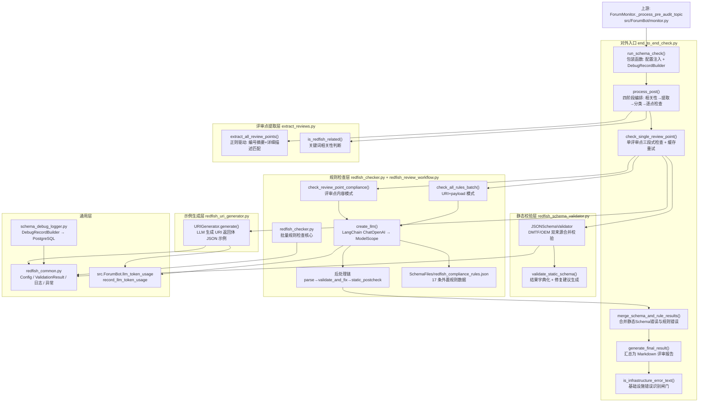

---
title: "Redfish 结构化评审引擎"
slug: "8-redfish-review-engine"
---

# Redfish 结构化评审引擎

> 本页深度剖析 `src/ForumBot/SchemaValidation/`——AI 预审链路中负责 **Redfish 接口结构化合规评审** 的完整子包。它把"一篇待评审的论坛预审帖"转化为"一份带逐条规则结论、Schema 溯源与修改建议的 Markdown 评审报告"，是典型的**确定性规则（Deterministic）+ 概率性 LLM（Probabilistic LLM）双引擎混合架构**。难度：Advanced。

---

## 1. 项目定位与核心价值

### 1.1 背景与痛点

在 `forum-reply-robot` 的 AI 预审链路中，论坛会出现一批打上"预审"标签的帖子：作者在帖子里给出**Redfish 接口设计评审点**（例如"新增 ThermalEquipment 资源"、"在 Managers 下扩展 EnergySavingService 属性"），期待评审方逐条给出合规结论与修改建议。这类评审与常规问答有着本质差异：它不要求"生成一段流畅的回答"，而要求**对照一份确定的规范清单（Redfish 命名规范、JSON Schema、URI 结构、枚举设计、HTTP 语义……）逐项给出可审计的通过/失败判定**。如果只把评审点直接丢给通用大模型自由发挥，会同时踩中三类坑：**漏检**（模型对 17 条规则不可能每次全部覆盖）、**误报**（把厂商自定义的合法扩展如 `vender`/`openUBMC` 误判为拼写错误）、**不可溯源**（结论无法指出依据了哪份 Schema 文件、命中了哪条规则）。`SchemaValidation` 子包正是为消解这三类痛点而生。

其核心价值可以拆成四点。第一，**双引擎校验**：`JSONSchemaValidator` 用确定性代码对 LLM 生成的 URI 返回体示例做 JSON Schema 静态校验（DMTF 官方 + rackmount OEM 双来源合并），`redfish_checker` 再用 LLM 按外置规则集做语义合规判断，两者结果合并进同一份 `error_details`，静态错与语义错互不掩盖。第二，**LLM 输出工程化后处理**：代码对模型输出施加了"规避词前置替换 → 占位符还原 → compliant/summary 一致性修复 → 正则静态补充检查"四道闸门，把模型的不稳定性压到最低。第三，**基础设施错误与真实评审结论的严格区分**：`is_infrastructure_error_text` 用关键词清单识别超时、限流、空响应等服务异常，一旦命中就拒绝发帖并触发分段重试，避免把"服务挂了"当作"评审不通过"发到论坛。第四，**全链路可溯源**：`schema_check_meta` 记录实际用于校验的 Schema 文件路径与来源分类（dmtf/oem/legacy），`schema_debug_logger` 把每个 topic 的全部中间产物与耗时落进 PostgreSQL `schema_debug_logs` 表。

Sources: [CLAUDE.md](CLAUDE.md#L97-L99), [end_to_end_check.py](src/ForumBot/SchemaValidation/end_to_end_check.py#L1-L17), [end_to_end_check.py](src/ForumBot/SchemaValidation/end_to_end_check.py#L57-L104)

### 1.2 核心特性展开

**特性一：四阶段编排管线。** `end_to_end_check.py` 的 `process_post` 把整篇帖子处理切成四步：① `is_post_relevant` 判断帖子是否与 Redfish/MDB 相关；② `extract_all_review_points` 用一组正则从 HTML/Markdown/纯文本中提取所有评审点；③ 逐评审点三路分类（mdb/redfish/other）；④ 按原始顺序对相关评审点逐个执行 `check_single_review_point` 的三段式检查（生成 URI 示例 → Schema 静态校验 → 规则合规校验）。这种"先全量提取、再分类、再逐点处理"的设计，与早期"提取即过滤"的版本相比，把**提取与分类解耦**，使得同一套提取器可以服务 Redfish 与 MDB 两套规则引擎。

**特性二：单次 API 调用批量检查全部规则。** `redfish_checker.py` 头部注释明确写着"批量优化版"：不再对每条规则单独发起 LLM 调用，而是把 17 条规则通过 `format_rules_for_batch` 序列化为文本、连同评审点内容拼进一条 prompt，一次调用返回全部规则的 JSON 数组结果。`check_all_rules` 只是向后兼容的旧函数名，内部直接转发到 `check_all_rules_batch`。这大幅削减了 API 调用次数与 token 成本，是该方法演进的直接动机。

**特性三：规则数据与 Prompt 代码解耦。** 规则集被从代码中剥离到 `SchemaFiles/redfish_compliance_rules.json`，顶层为数组，每条规则含 `id/category/severity/rule/check/rationale` 五个字段，共 17 条（RULE-001~RULE-017）。加载时做严格校验：必须是**非空 JSON 数组**、必须含 `id/rule/check` 三字段、`id` 不得重复，任一不满足直接抛异常——这条防线保证规则文件被误改时系统快速失败（fail fast）而不是带着残缺规则静默上线。规则文件由 Docker 构建期从 GitCode 远程拉取，不入本仓库，因此规则内容可独立于代码迭代。

**特性四：RULE-001 规避词的工程化对策。** 这是本包最精巧的设计之一：规则文档规定 `vender`、`Smnp`、`InterChassAuthentication` 等拼写是项目内合法的 vendor 变体，LLM 极易误报。代码的解法不是去改 Prompt（Prompt 已经很长），而是**在送 LLM 之前把规避词替换成规范写法**（`SubsystemVenderID → SubsystemVendorID`），再把 `openUBMC` 换成占位符 `XopenUBMCPlaceholderX`，模型检查完后再把占位符还原。这样既让 LLM 面对"干净"的文本，又保证最终结果不篡改原文。

**特性五：Schema 多来源解析与合并。** `JSONSchemaValidator` 不再只查单一目录，而是按 `dmtf/ → rackmount/jsonschemas/ → rackmount/oem/openubmc/ → rackmount/oem/openubmc/json_schema/` 的优先级顺序加载，同名文件后者覆盖前者；对 JsonSchemaFile 指针文件还会沿 `Location.Uri` 解析到真实定义（本地或 GitCode 远程），再与 DMTF 定义合并 properties 后统一校验，并把"入口文件/实际定义文件/来源分类"全部写进 `schema_check_meta` 供上层展示。

Sources: [end_to_end_check.py](src/ForumBot/SchemaValidation/end_to_end_check.py#L954-L1210), [redfish_checker.py](src/ForumBot/SchemaValidation/redfish_checker.py#L1-L4), [redfish_checker.py](src/ForumBot/SchemaValidation/redfish_checker.py#L29-L58), [redfish_checker.py](src/ForumBot/SchemaValidation/redfish_checker.py#L61-L86), [redfish_schema_validator.py](src/ForumBot/SchemaValidation/redfish_schema_validator.py#L107-L160)

### 1.3 设计哲学（Design Philosophy）

> 本子包的设计原则可以浓缩为三条：**确定性优先**（能用正则/JSON Schema 判定的事绝不让 LLM 做）、**外部失效可见**（服务错误绝不伪装成评审结论）、**可审计可重放**（每个中间产物都可落库回放）。

- **"人机分诊"**：`redfish_checker` 里既有 LLM 判断（`check_review_point_compliance`），也有大量纯正则的"静态补充检查"（`static_postcheck_rule001` 扫描表格类型列、`@data.id` 拼写、URI 路径段、缩写一致性等 9 类高频模式），`collect_static_review_point_type_mismatch_errors` 甚至把评审点里的 Markdown/HTML 表格类型列与内嵌 JSON Schema 的 `type` 做**确定性交叉比对**。这体现了一个成熟评审引擎的取舍：LLM 负责语义理解，正则负责确定性兜底。
- **"输入清洗-输出校验"闭环**：所有进入 LLM 的评审点文本先经 `preprocess_content_for_rule001` 清洗，所有返回结果先经 `parse_batch_check_result`（多策略 JSON 提取 + 修复）、再经 `validate_and_fix_results`（补齐缺失规则、修复 compliant 与 summary 的矛盾）、再经静态补充检查。模型输出的不可靠性被一层层工程手段围堵。
- **"评审结论与运维故障分离"**：`_is_api_error` 遍历 `uri_sample`/`schema_validation`/`rule_compliance` 三块结果，凡是命中基础设施错误关键词（超时、限流、429、空响应、`choices[0]` 缺失等）的，一律判定为"服务失败"而非"评审失败"，由 `process_post` 触发带缓存的重试，重试耗尽则 `ABORT` 整篇帖子并返回"请稍后重试"的统一文案。

Sources: [redfish_checker.py](src/ForumBot/SchemaValidation/redfish_checker.py#L515-L658), [redfish_checker.py](src/ForumBot/SchemaValidation/redfish_checker.py#L428-L512), [redfish_checker.py](src/ForumBot/SchemaValidation/redfish_checker.py#L1098-L1197), [end_to_end_check.py](src/ForumBot/SchemaValidation/end_to_end_check.py#L139-L176), [end_to_end_check.py](src/ForumBot/SchemaValidation/end_to_end_check.py#L1114-L1187)

---

## 2. 架构设计与模块划分

### 2.1 总体架构图

`SchemaValidation` 是一个**单入口、多能力层**的子包：对外只暴露 `run_schema_check` 一个函数（供 `ForumMonitor` 调用），内部按"相关性判断 → 评审点提取 → 三路分类 → 逐点三段式检查 → 报告汇总"组织。三段式检查内部又各自依赖 LLM 调用层（LangChain + ModelScope）与静态校验层（JSON Schema）。



Sources: [end_to_end_check.py](src/ForumBot/SchemaValidation/end_to_end_check.py#L31-L44), [end_to_end_check.py](src/ForumBot/SchemaValidation/end_to_end_check.py#L1213-L1301), [redfish_review_workflow.py](src/ForumBot/SchemaValidation/redfish_review_workflow.py#L36-L52)

### 2.2 各模块职责与实现细节

**① `end_to_end_check.py` — 编排中枢（约 1300 行）**

这是子包的"脸面"。`run_schema_check(title, user_question, topic_id, config, return_details)` 是唯一被外部调用的函数：它把 `config.yaml` 的 `schema_validation` 段灌入 `Config` 类、按 `pre_audit.readiness_field` 决定是否启用 debug 日志、创建 `DebugRecordBuilder` 上下文管理器，然后委托 `process_post` 干活，最后计算 `overall_pass` 并返回 Markdown 字符串或详情字典。`process_post` 内部维护一个 `_category_map`（以 `id(rp)` 为键）来**保持评审点在原帖中的顺序**，这对评审报告的阅读体验至关重要——MDB 与 Redfish 评审点交错出现时不会被打乱。Redfish 评审点的重试逻辑也在这里：最多 `Config.MAX_RETRY` 次，若失败阶段是"规则检查"则复用缓存的 URI 示例与 Schema 结果（`_cached_uri_sample` / `_cached_checks`），只重跑规则检查；若失败在 URI 生成阶段则整体重来。

Sources: [end_to_end_check.py](src/ForumBot/SchemaValidation/end_to_end_check.py#L466-L649), [end_to_end_check.py](src/ForumBot/SchemaValidation/end_to_end_check.py#L1075-L1187), [end_to_end_check.py](src/ForumBot/SchemaValidation/end_to_end_check.py#L1213-L1301)

**② `extract_reviews.py` — 评审点提取器（正则驱动）**

这是全包正则密度最高的文件。`extract_all_review_points` 按优先级尝试三条路径：**编号摘要+详细描述匹配**（`_extract_numbered_summary_review_points`：先抓 `## 评审点` 摘要列表里的编号项，再从 `详细描述` 章节按编号映射正文）、**单无编号评审点**（`_extract_single_unnumbered_review_point`）、**常规逐行扫描**。正则同时覆盖 Markdown 标题（`## 评审点1：xxx`）、粗体、纯文本与 HTML 标签（`<h2>`）。值得一提的细节：`_NUMBERED_ITEM_RE` 支持阿拉伯数字与中文数字（`一二三四五六七八九十`），`_normalize_num` 把中文编号归一化为阿拉伯数字用于摘要与详情的编号匹配；`_strip_template_sections` 会先截掉帖子底部的"评审结论/遗留问题"模板区域，防止把模板占位文本误当评审点正文；`is_design_template_guidance` 专门识别"具体格式参考下面的场景"这类引导说明并阻断其并入正文。`is_redfish_related` 只做关键词命中（`redfish` 大小写不敏感），过滤职责已上移到编排层。

Sources: [extract_reviews.py](src/ForumBot/SchemaValidation/extract_reviews.py#L8-L60), [extract_reviews.py](src/ForumBot/SchemaValidation/extract_reviews.py#L461-L554), [extract_reviews.py](src/ForumBot/SchemaValidation/extract_reviews.py#L66-L70)

**③ `redfish_schema_validator.py` — JSON Schema 静态校验器**

`JSONSchemaValidator` 的 `validate(uri, payload)` 是确定性校验的核心。它先从 `@odata.type`（如 `#Drive.v1_21_0.Drive`）解析出 `(base_type, full_type)`，然后**同时**从 DMTF 与 OEM 两个来源解析 schema：`_resolve_schema_from_dmtf` / `_resolve_schema_from_oem` 共享 `_build_schema_candidates` 的候选名构造（原名带版本 → 原名 → `Hw` 前缀带版本 → `Hw` 前缀），两来源的 properties 与 required **合并**后统一校验，任一侧缺失时给出中文明示（如"OEM 中不包含类型 X 的 schema"）。`_resolve_to_properties` 处理三类"间接 schema"：JsonSchemaFile 指针文件（沿 `Location.Uri` 解析到真实定义，支持本地与 GitCode 远程两种来源）、顶层 `$ref`、`anyOf`。属性级校验 `_validate_property` 实现类型白名单映射、可空类型列表、`enum` 枚举、对象/数组递归，并对 `Oem` 属性与 `@`/`#` 注解键做豁免跳过。`validate_static_schema` 是对外便捷封装，把结果整理成与规则检查一致的 `error_details.STATIC_VALIDATION` 结构，并用 `_generate_advice_from_error` 把类型/必填/null/schema 四类错误翻译成中文修复建议。

Sources: [redfish_schema_validator.py](src/ForumBot/SchemaValidation/redfish_schema_validator.py#L46-L79), [redfish_schema_validator.py](src/ForumBot/SchemaValidation/redfish_schema_validator.py#L838-L1024), [redfish_schema_validator.py](src/ForumBot/SchemaValidation/redfish_schema_validator.py#L261-L354), [redfish_schema_validator.py](src/ForumBot/SchemaValidation/redfish_schema_validator.py#L1055-L1186)

**④ `redfish_uri_generator.py` — URI 返回体示例生成器**

`URIGenerator.generate` 是 LLM 生成环节的起点：`build_prompt` 构造"你是一个 Redfish API 专家"提示词，要求模型严格按评审点表格中声明的属性类型生成 JSON 返回体（string 用引号、integer/number 用数值、array 必须是 `[...]`、object 必须是 `{...}`），并反复强调 `@odata.type`/`@odata.id` 的拼写（"odata 不是 odbtype"）。`_create_llm` 用自定义 `httpx.Client` 子类捕获响应状态码、内容长度与 JSON 键用于调试。`parse_json_from_response` 提供三级降级解析：直接 `json.loads` → 提取 ````json` 代码块 → 提取首个平衡花括号块。生成后的示例同时被 Schema 静态校验（第 2 步）和 URI+payload 规则检查（第 3 步）消费。

Sources: [redfish_uri_generator.py](src/ForumBot/SchemaValidation/redfish_uri_generator.py#L26-L98), [redfish_uri_generator.py](src/ForumBot/SchemaValidation/redfish_uri_generator.py#L99-L154), [redfish_uri_generator.py](src/ForumBot/SchemaValidation/redfish_uri_generator.py#L156-L259)

**⑤ `redfish_checker.py` + `redfish_review_workflow.py` — 规则检查引擎**

`redfish_review_workflow.py` 是**瘦再导出层**：它通过 `importlib.util.spec_from_file_location` 动态加载 `redfish_checker.py`，向上层只暴露 `REDFISH_COMPLIANCE_RULES`、`check_all_rules`、`check_review_point_compliance`、`apply_static_review_point_type_consistency_check`、`collect_static_review_point_type_mismatch_errors` 五个符号，形成一层解耦的"门面"。真正的引擎在 `redfish_checker.py`（约 1950 行），它提供两个检查入口：`check_review_point_compliance`（只基于评审点 title/content，无 URI 示例时使用）与 `check_all_rules_batch`（基于 URI + payload）。两者共享同一套"拼 prompt → `create_llm`（ChatOpenAI + ModelScope，temperature=0.1，max_tokens=262144）→ `llm.invoke` → `record_llm_token_usage` → `time.sleep(5)` 防限流 → `parse_batch_check_result` → `validate_and_fix_results` → 汇总"的流水线。后处理链尤其值得注意：`parse_batch_check_result` 通过 `extract_top_level_json_array`（对首 `[` 做配平扫描，正确处理嵌套）与 `repair_json_text`（去 BOM、弯引号、尾逗号）多策略尝试解析；`validate_and_fix_results` 会补齐 LLM 漏掉的规则为错误结果，并在 `advice is None` 且 summary 含"符合规范"等关键词时把 `compliant` 从 False 修正为 True，消除模型输出自相矛盾；`static_postcheck_rule001` 再对原文做 9 类正则扫描，把 LLM 漏检的 RULE-001 高频违规（表格类型列 `bool`/`Boolean`、`@data.id`、`Power. SetPsu`、URI 路径段小写、错误复数、拼写错误、缩写不一致等）强行追加为 findings 并翻转 compliant。

Sources: [redfish_review_workflow.py](src/ForumBot/SchemaValidation/redfish_review_workflow.py#L22-L52), [redfish_checker.py](src/ForumBot/SchemaValidation/redfish_checker.py#L661-L671), [redfish_checker.py](src/ForumBot/SchemaValidation/redfish_checker.py#L1012-L1128), [redfish_checker.py](src/ForumBot/SchemaValidation/redfish_checker.py#L1131-L1197), [redfish_checker.py](src/ForumBot/SchemaValidation/redfish_checker.py#L1709-L1944)

**⑥ `redfish_common.py` — 通用能力层**

提供 `Config`（从 `config.yaml` 的 `schema_validation` 段读取 `MODELSCOPE_*`、`SCHEMA_DIR`、`MAX_RETRY`/`RETRY_DELAY`、`DISABLE_FILE_OUTPUT` 等，且默认**关闭文件输出**、结果全在内存处理）、`setup_logger`（文件/控制台双 handler，并压制 urllib3/requests/langchain 等第三方日志噪音）、`ValidationResult`（`pass/fail/error/unknown` 四态结果基类）、以及 `RedfishError` 异常族（`SchemaValidationError`/`URIGenerationError`）。全包所有模块都从这里拿配置，是天然的依赖汇聚点。

Sources: [redfish_common.py](src/ForumBot/SchemaValidation/redfish_common.py#L25-L88), [redfish_common.py](src/ForumBot/SchemaValidation/redfish_common.py#L93-L142), [redfish_common.py](src/ForumBot/SchemaValidation/redfish_common.py#L306-L369)

**⑦ `schema_debug_logger.py` — 调试记录器**

试运行阶段的观测设施：`DebugRecordBuilder` 是累加器 + 上下文管理器，把相关性判断、评审点提取、过滤结果、每个评审点的检查结果（含 URI 示例、Schema 校验、规则校验、耗时）聚合成一条 JSON 记录，`finalize` 时写入 PostgreSQL `schema_debug_logs` 表（JSONB 列存全量记录，另有 `topic_id/title/overall_pass/error` 独立列）。设计上"**永远不抛异常**"：数据库不可达时静默降级为禁用，写入失败只记 warning 并 rollback，任何情况下都不拖垮主评审流程。

Sources: [schema_debug_logger.py](src/ForumBot/SchemaValidation/schema_debug_logger.py#L31-L64), [schema_debug_logger.py](src/ForumBot/SchemaValidation/schema_debug_logger.py#L67-L118), [schema_debug_logger.py](src/ForumBot/SchemaValidation/schema_debug_logger.py#L143-L259)

---

## 3. 技术栈与核心工作流

### 3.1 技术栈一览

| 层次 | 技术选型 | 承担职责 |
| --- | --- | --- |
| 语言/运行时 | Python 3.9（与全仓一致） | 全部校验逻辑 |
| LLM 接入 | `langchain-openai` 的 `ChatOpenAI` + ModelScope（`MODELSCOPE_BASE_URL`） | 规则合规判断、URI 示例生成 |
| HTTP | `httpx`（自定义 Client 捕获调试）、`urllib`（GitCode 远程 Schema 拉取） | 外部服务调用 |
| Schema 校验 | 自研 JSON Schema 引擎（非 jsonschema 库） | DMTF/OEM 属性级类型校验 |
| 数据库 | `psycopg2` → PostgreSQL `schema_debug_logs` 表 | 调试记录落库 |
| 数据源 | `SchemaFiles/`（DMTF + rackmount OEM，构建期远程拉取） | 静态校验依据 |
| 解析 | `beautifulsoup4`（HTML 表格/代码块提取）、内置 `re` | 表格-类型交叉检查、评审点提取 |

Sources: [redfish_checker.py](src/ForumBot/SchemaValidation/redfish_checker.py#L14-L20), [redfish_uri_generator.py](src/ForumBot/SchemaValidation/redfish_uri_generator.py#L12-L20), [redfish_schema_validator.py](src/ForumBot/SchemaValidation/redfish_schema_validator.py#L28-L43), [schema_debug_logger.py](src/ForumBot/SchemaValidation/schema_debug_logger.py#L18)

### 3.2 执行主链路：感知 → 提取 → 规划 → 执行 → 汇总

整条 AI 预审管线可以映射为五段式流水线：

1. **感知（Relevance）**：`is_post_relevant` 先问 MDB 分类器、再问 Redfish 关键词（`redfish/bmc/ipmi/dmtf/@odata.id/json-schema` 等），不相关直接跳过整篇帖子。
2. **提取（Extraction）**：`extract_all_review_points` 用正则把帖子拆成 `{title, content}` 评审点列表。
3. **规划（Planning）**：`classify_review_point` 逐点三路分类，MDB 走 `MdbComplianceChecker`，Redfish 走本引擎，其余跳过；按 `id(rp)` 保持原序。
4. **执行（Execution）**：对每个 Redfish 评审点跑 `check_single_review_point` 的三段式：① `URIGenerator.generate` 生成 URI 返回体示例；② `JSONSchemaValidator.validate` 做静态 Schema 校验；③ `check_review_point_compliance`（无 URI 时）或 `check_all_rules_batch`（有 URI 时）做规则校验，再 `merge_schema_and_rule_results` 合并结果。
5. **汇总（Reporting）**：`generate_final_result` 把每点的 Schema 状态（pass/skip/fail/error + 来源 meta）、规则结论（通过/不通过 + 失败明细）拼成 Markdown；`_judge_review_point_overall` 计算整体 pass/fail；`run_schema_check` 返回报告字符串。

其中"执行"阶段是双引擎的汇合点，核心接口如下表：

| 接口 | 所在文件 | 在流程中的作用 |
| --- | --- | --- |
| `run_schema_check(title, user_question, topic_id, config, return_details)` | end_to_end_check.py | 对外唯一入口，返回 Markdown 评审报告 |
| `process_post(...)` | end_to_end_check.py | 四阶段编排 + 逐点重试 + 汇总 |
| `check_single_review_point(...)` | end_to_end_check.py | 单评审点三段式检查，支持缓存重试 |
| `URIGenerator.generate(review_point, output_file, topic_id)` | redfish_uri_generator.py | 第①步：生成 URI 返回体 JSON 示例 |
| `JSONSchemaValidator.validate(uri, payload)` | redfish_schema_validator.py | 第②步：DMTF/OEM 双来源静态校验 |
| `check_review_point_compliance(...)` | redfish_checker.py | 第③步：仅凭评审点内容的规则检查 |
| `check_all_rules_batch(...)` | redfish_checker.py | 第③步：基于 URI+payload 的批量规则检查 |
| `merge_schema_and_rule_results(...)` | end_to_end_check.py | 把静态错误并入规则结果的 `STATIC_VALIDATION` |
| `is_infrastructure_error_text(text)` | end_to_end_check.py | 发帖闸门：识别服务异常，拒绝把故障当结论 |
| `DebugRecordBuilder` | schema_debug_logger.py | 全链路中间产物落库 |

Sources: [end_to_end_check.py](src/ForumBot/SchemaValidation/end_to_end_check.py#L215-L239), [end_to_end_check.py](src/ForumBot/SchemaValidation/end_to_end_check.py#L285-L313), [end_to_end_check.py](src/ForumBot/SchemaValidation/end_to_end_check.py#L466-L649), [end_to_end_check.py](src/ForumBot/SchemaValidation/end_to_end_check.py#L1213-L1301)

---

## 4. 典型代码示例

### 4.1 入口编排：`process_post` 对 Redfish 评审点的重试循环

下面的代码片段是"**执行**"阶段最核心的骨架：它对每个 Redfish 评审点最多重试 `MAX_RETRY` 次，且只在 API 级错误时重试——业务层面校验失败（如 Schema 不通过）不算错误、不重试；规则检查阶段失败时复用已成功的 URI 示例与 Schema 结果，只重跑失败的那一步。

```python
# end_to_end_check.py: process_post 内部（Redfish 评审点分支）
max_retry = Config.MAX_RETRY
retry_delay = Config.RETRY_DELAY
check_result = None
cached_uri_sample = None
cached_checks = None
for attempt in range(1, max_retry + 1):
    check_result = check_single_review_point(
        rp, schema_dir, output_dir, generate_uri,
        _cached_uri_sample=cached_uri_sample,
        _cached_checks=cached_checks,
        debug_record=debug_record, topic_id=topic_id
    )
    # 如果不是 API 级别错误，视为检查完成（无论成功或业务层面失败）
    is_api_err, error_msg, error_phase = _is_api_error(check_result)
    if not is_api_err:
        break
    # 缓存已成功的步骤结果，下次重试时跳过
    if error_phase != 'uri' and check_result.get('_uri_sample'):
        cached_uri_sample = check_result['_uri_sample']
        cached_checks = {k: v for k, v in check_result.get('checks', {}).items()
                         if k != 'rule_compliance'}
    else:
        # URI 生成阶段失败，需要完全重试
        cached_uri_sample = None
        cached_checks = None
    if attempt < max_retry:
        retry_from = "规则检查" if cached_uri_sample else "完整流程"
        logger.warning(f"[RETRY] 评审点 '{rp['title'][:30]}' 检查失败 (第{attempt}次)，"
                       f"{retry_delay}秒后重试（从{retry_from}开始）... 错误: {error_msg}")
        time.sleep(retry_delay)
```

Sources: [end_to_end_check.py](src/ForumBot/SchemaValidation/end_to_end_check.py#L1114-L1147)

### 4.2 双引擎合并：`merge_schema_and_rule_results`

静态校验与规则校验是两套独立结果，合并逻辑保证了 **Schema 的失败必定进入最终 error_details 且使整体 fail**，同时把 `schema_check_meta` 的溯源信息透传到规则结果，让上层 Markdown 能展示"依据了哪份 Schema 文件"。

```python
# end_to_end_check.py: merge_schema_and_rule_results
checks = result_dict.get('checks', {})
schema_validation = checks.get('schema_validation', {})
sch_meta = schema_validation.get("schema_check")
if sch_meta:
    rule_check_result["schema_check"] = sch_meta
schema_failed = schema_validation.get('result') == 'fail'
schema_skipped = schema_validation.get('result') == 'skip'
schema_fail_count = schema_validation.get('fail_count', 0)

error_details = rule_check_result.get('error_details', {})
static_validation = error_details.get('STATIC_VALIDATION', [])

if schema_failed and schema_fail_count > 0:
    for error in schema_validation.get('errors', []):
        err = error if isinstance(error, dict) else {"message": str(error)}
        static_validation.append({
            "rule": "[Schema] 模型静态检查",
            "message": f"{err.get('type', 'Error')}: {err.get('message', '...')}",
            "advice": generate_schema_advice_from_error(err),
        })
    error_details['STATIC_VALIDATION'] = static_validation
...
if schema_failed:
    rule_check_result['result'] = 'fail'
```

Sources: [end_to_end_check.py](src/ForumBot/SchemaValidation/end_to_end_check.py#L405-L463)

### 4.3 LLM 输出容错：多策略 JSON 提取

LLM 输出经常包裹代码围栏、夹杂说明文字、甚至带 BOM 与弯引号。`parse_batch_check_result` 的降级链是"LLM 工程化"的代表作：先尝试整体解析，失败则剥掉 ````json` 围栏，再对每个候选做配平提取 + 修复，全部失败才逐规则生成错误结果。

```python
# redfish_checker.py: parse_batch_check_result
cleaned_text = response_text.strip()
tried: List[str] = [cleaned_text]
fence = extract_markdown_json_fence(cleaned_text)
if fence:
    tried.append(fence)

for candidate in tried:
    parsed = _try_parse_rule_results(candidate, rules)
    if parsed is not None:
        return parsed

return [create_error_result(rule, f"Failed to parse response. "
        f"Response preview: {cleaned_text[:200]}...") for rule in rules]
```

Sources: [redfish_checker.py](src/ForumBot/SchemaValidation/redfish_checker.py#L1098-L1128), [redfish_checker.py](src/ForumBot/SchemaValidation/redfish_checker.py#L1012-L1095)

### 4.4 RULE-001 规避词前置替换

这是"输入清洗"的微观范例——把模型易误报的拼写变体在送检前归一化，用占位符保护项目专用词：

```python
# redfish_checker.py
RULE_001_PREPROCESS_REPLACEMENTS = [
    ("SubsystemVenderID", "SubsystemVendorID"),
    ("VenderID", "VendorID"),
    ("Vender", "Vendor"),
    ("vender", "vendor"),
    ("InterChassAuthentication", "InterChassisAuthentication"),
    ("Smnp", "Snmp"),
]
_OPENUBMC_PLACEHOLDER = "XopenUBMCPlaceholderX"

def preprocess_content_for_rule001(text: str) -> str:
    for old, new in RULE_001_PREPROCESS_REPLACEMENTS:
        text = text.replace(old, new)
    text = text.replace("openUBMC", _OPENUBMC_PLACEHOLDER)
    return text

def postprocess_results_for_rule001(results: List[Dict]) -> List[Dict]:
    raw = json.dumps(results, ensure_ascii=False)
    raw = raw.replace(_OPENUBMC_PLACEHOLDER, "openUBMC")
    return json.loads(raw)
```

Sources: [redfish_checker.py](src/ForumBot/SchemaValidation/redfish_checker.py#L61-L86), [redfish_checker.py](src/ForumBot/SchemaValidation/redfish_checker.py#L1735-L1737)

---

## 5. 学习与探索建议

### 5.1 新手路线（从"跑通"到"看懂"）

| 阅读目标 | 推荐路径 | 为什么从这里入手 |
| --- | --- | --- |
| 先看全局 | 本页 + [项目概览](1-project-overview.md) + [论坛监控与回复编排引擎](4-monitor-orchestrator.md) | 理解预审链路在整个机器人中的位置 |
| 跑通一次 | `end_to_end_check.py` 的 `run_schema_check` → `process_post` | 这是唯一入口，顺着调用栈就能走完全流程 |
| 看懂规则 | `SchemaFiles/redfish_compliance_rules.json` | 17 条规则的 `id/severity/rule/check/rationale` 是评审的"裁判标准" |
| 看懂静态校验 | `redfish_schema_validator.py` 的 `JSONSchemaValidator.validate` | 确定性引擎的代表，无 LLM 干扰，最容易独立理解 |

### 5.2 进阶路线（从"看懂"到"改造"）

| 探索主题 | 源码切入点 | 建议的实践任务 |
| --- | --- | --- |
| 规则引擎扩展 | 在 `redfish_compliance_rules.json` 增加一条 `RULE-018`，观察 `_load_compliance_rules` 的字段校验如何拦截残缺规则 | 体会"规则数据与代码解耦"的边界与校验防线 |
| LLM 输出工程化 | 逐步阅读 `parse_batch_check_result` → `validate_and_fix_results` → `static_postcheck_rule001` | 给 `repair_json_text` 增加一种新的 LLM 噪声修复规则，观察解析成功率变化 |
| 静态 Schema 溯源 | `_resolve_to_properties` → `_resolve_json_schema_file_pointer` → `_fetch_remote_schema` | 手写一个 JsonSchemaFile 指针文件，验证本地/远程两种解析路径与 `schema_check_meta` 输出 |
| 发帖闸门 | `is_infrastructure_error_text` + `_is_api_error` | 构造一个 `choices[0]` 缺失的假响应，验证 `process_post` 是否按预期触发分段重试 |
| 评审点提取 | `extract_reviews.py` 的三条提取路径 | 用带"编号摘要+详细描述"结构的帖子样本验证编号匹配的容错性（含中文数字） |

### 5.3 快速定位速查表

| 你想找的东西 | 精确路径 |
| --- | --- |
| 评审引擎唯一对外入口 | `src/ForumBot/SchemaValidation/end_to_end_check.py#L1213`（`run_schema_check`） |
| 四阶段编排主循环 | `src/ForumBot/SchemaValidation/end_to_end_check.py#L954`（`process_post`） |
| 单评审点三段式检查 | `src/ForumBot/SchemaValidation/end_to_end_check.py#L466`（`check_single_review_point`） |
| 静态 Schema 校验核心 | `src/ForumBot/SchemaValidation/redfish_schema_validator.py#L838`（`validate`） |
| 批量规则检查（LLM） | `src/ForumBot/SchemaValidation/redfish_checker.py#L1214`（`check_all_rules_batch`） |
| 评审点内容规则检查（LLM） | `src/ForumBot/SchemaValidation/redfish_checker.py#L1709`（`check_review_point_compliance`） |
| RULE-001 静态补充检查 | `src/ForumBot/SchemaValidation/redfish_checker.py#L515`（`static_postcheck_rule001`） |
| 表格-vs-Schema 类型交叉检查 | `src/ForumBot/SchemaValidation/redfish_checker.py#L428`（`collect_static_review_point_type_mismatch_errors`） |
| 评审点提取主函数 | `src/ForumBot/SchemaValidation/extract_reviews.py#L461`（`extract_all_review_points`） |
| 17 条合规规则数据 | `src/ForumBot/SchemaValidation/SchemaFiles/redfish_compliance_rules.json` |

---

## 6. 🔗 关联模块与上下游

- **上游调用方**：`src/ForumBot/monitor.py` 的 `_process_pre_audit_topic` 在预审就绪后调用 `run_schema_check`，并把返回的 Markdown 作为评审回复发布；`is_infrastructure_error_text` 的判定结果决定是否**拒绝发帖**。
- **同级依赖**：`src/ForumBot/llm_token_usage.py` 的 `record_llm_token_usage` 被 URI 生成与规则检查两处调用，按 `source` 标签（`pre_audit.redfish_uri_generation` / `pre_audit.redfish_rule_check` / `pre_audit.redfish_review_point_check`）归集 token 消耗。
- **同级互操作**：`src/ForumBot/MdbValidation/`（`mdb_classifier.is_mdb_related`、`mdb_checker.MdbComplianceChecker`）与本包在 `process_post` 的"三路分类"处互操作，两套引擎共用同一份评审点提取结果，且 MDB 失败只记日志不致命（可选降级）。

Sources: [CLAUDE.md](CLAUDE.md#L138-L140), [end_to_end_check.py](src/ForumBot/SchemaValidation/end_to_end_check.py#L191-L210), [end_to_end_check.py](src/ForumBot/SchemaValidation/end_to_end_check.py#L1062-L1113), [redfish_checker.py](src/ForumBot/SchemaValidation/redfish_checker.py#L1776)
