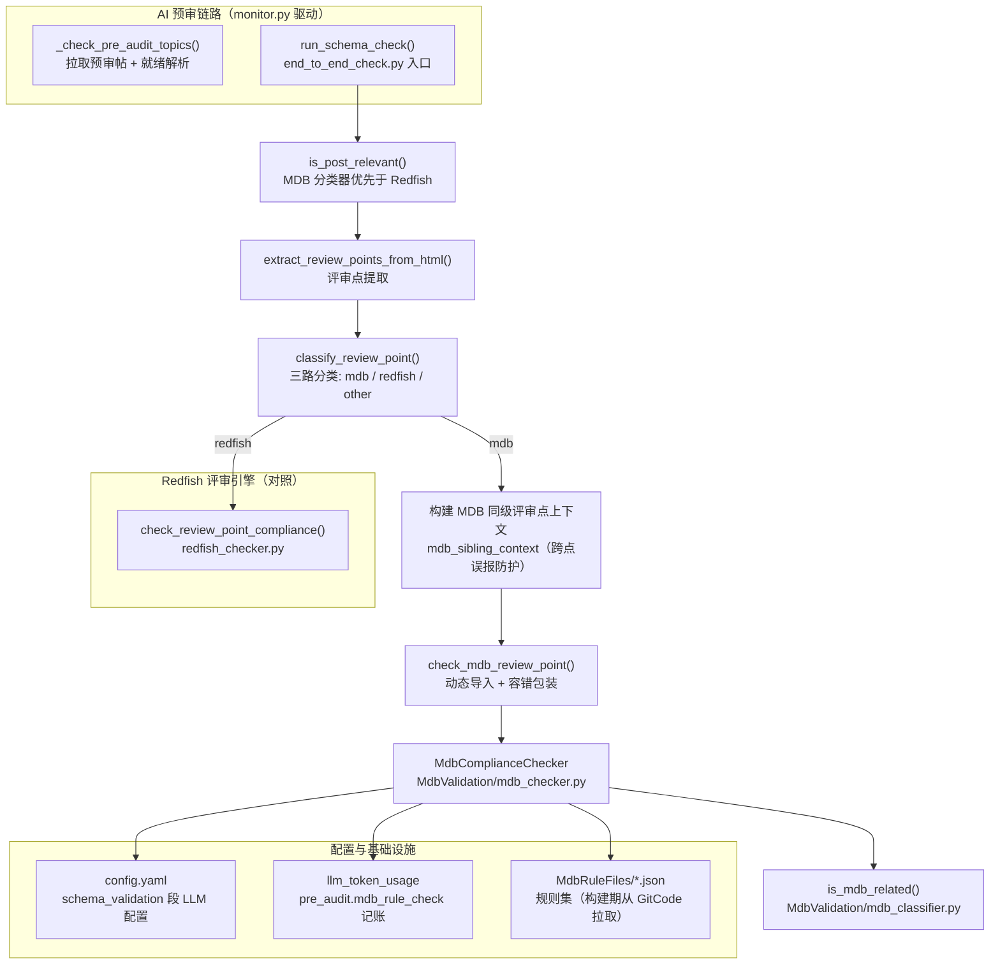
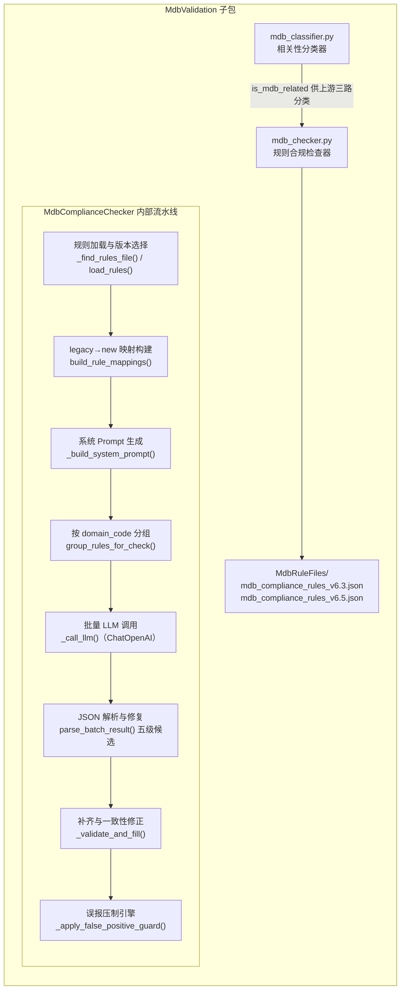
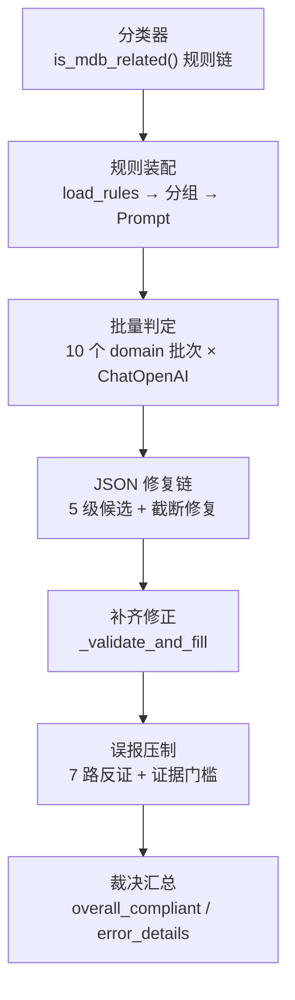

---
title: "MDB 资源协作接口合规校验"
slug: "9-mdb-compliance-engine"
section: "AI 预审合规评审"
difficulty: Advanced
---

# MDB 资源协作接口合规校验

## 1. 项目定位与核心价值

**MDB（BMC 资源协作接口，Management Data Bus resource collaboration interface）合规校验引擎**是论坛自动回复机器人 AI 预审链路中与 Redfish 评审引擎并列的第二个"结构化合规评审"子引擎。在 openUBMC 社区的工作流中，开发者通过论坛评审帖提交接口变更设计（新增/变更资源协作接口、路径、属性、方法、信号与错误消息），由 Interface SIG 依据三份核心规范进行人工评审：**申报模板（topic/3817，规定评审点编号与属性/方法/信号表的必填列）**、**设计合规性必检指南（topic/1862，规定 PascalCase 命名、单位后缀、emitsChangedSignal、enum/example/constraint、统一错误引擎、唯一 Id、标准接口继承）**、**废弃处理规范（topic/2087，规定 deprecated 关键字、废弃原因/替代、持久化场景禁删除）**。这套评审规则庞大且语义化——它不依赖机器可解析的 Schema 文件，而是对**作者撰写的自由 Markdown 正文**（含表格、列表、代码块）做逐条语义判定，人工评审成本极高且标准演进频繁（规则文件已迭代到 v6.5）。MDB 校验引擎的诞生正是为了把这一高成本、高知识密度的评审动作**自动化、可重复、可解释化**。

与同目录的 Redfish 评审引擎相比，两者的设计分界非常清晰：Redfish 接口定义有 D-Bus/JSON Schema 文件可做**确定性静态校验**（URI 生成、Schema 校验、规则合规），而 MDB 评审帖是自由文本，**没有权威 Schema 可供程序化比对**，因此 MDB 校验只能采取"**规则编码进 Prompt + 大模型语义判定 + 程序化后处理兜底**"的路线。这意味着该引擎的核心工程价值不在于"调用一次 LLM"，而在于围绕 LLM 构建的一整套**可靠性基础设施**：动态规则加载与 legacy ID 映射、按领域分组的批量 Prompt 稀释策略、抗 LLM 输出漂移的五级 JSON 解析修复链、缺失补齐与一致性修正、以及极其克制的**误报压制引擎**（用正则与正文反证抑制模型的无据断言）。这是一套典型的"LLM 作为不可靠执行器、程序作为可靠裁判"的混合架构。

> **设计哲学：从宽优先，宁可漏报不可误报。** 引擎的全部后处理逻辑都围绕一个目标——把"应该由 LLM 依据证据下结论"的判定权交还 LLM，而把"禁止无证据乱判"的约束交给程序。GENERAL_GUIDANCE 中明确要求"触发条件不满足直接判合规""判定不确定时倾向 compliant=true""仅评估写出的内容"；STRICT_EVIDENCE_GUIDANCE 更进一步，要求 `compliant=false` 必须能引用正文具体片段与位置。这一"反误报（FP）优先"的取舍贯穿了规则设计（大量 `**【豁免】**`、`**【不得判违规】**` 条款）与后处理实现（七路反证 + 证据门槛）。

引擎在系统内的定位是**可选能力而非硬依赖**：`main.py` 的启动预检 `check_mdb_rule_files()` 在 MdbRuleFiles 目录缺失或无规则 JSON 时只记录 warning 并返回 True（不阻断启动）；`end_to_end_check.py` 通过 `try/except ImportError` 动态导入 MDB 模块，导入失败时 `_is_mdb_related=None`、`MdbComplianceChecker=None`，整条 MDB 链路静默降级为"仅 Redfish 评审"。这一取舍与 Redfish Schema 文件"缺失即退出"的强校验形成鲜明对比——因为 MDB 校验是锦上添花的语义评审，而 Redfish 是社区契约的机器可验证基线。

Sources: [mdb_checker.py](src/ForumBot/MdbValidation/mdb_checker.py#L1-L7), [mdb_checker.py](src/ForumBot/MdbValidation/mdb_checker.py#L126-L234), [main.py](main.py#L277-L297), [end_to_end_check.py](src/ForumBot/SchemaValidation/end_to_end_check.py#L191-L198), [Dockerfile](Dockerfile#L76-L91)

---

## 2. 架构设计与模块划分

`src/ForumBot/MdbValidation/` 是一个极简但职责高度分层的子包：**两个 Python 模块（分类器 + 检查器）+ 一个规则文件目录（`MdbRuleFiles/`）**。`__init__.py` 只导出两个公共符号 `is_mdb_related` 与 `MdbComplianceChecker`，保持 API 面最小化。整个子包不依赖同级的 SchemaValidation 包（仅 `mdb_classifier` 引用了 `extract_reviews.is_design_template_guidance` 以剔除模板指引文本），由上游 `end_to_end_check.py` 作为唯一编排者注入配置。

### 2.1 模块在预审链路中的位置



**图中关键点解读：**

- **MDB 优先原则**：`is_post_relevant()` 先调用 MDB 分类器，若判定相关则直接返回 `True`（"MDB 相关"），不再进入 Redfish 判定；`classify_review_point()` 同样先问 MDB 再问 Redfish。这是刻意的优先级设计——一篇帖子可能同时提及 `bmc.kepler` 路径与 `redfish` 关键词，此时按 MDB 处理（集成测试 `test_mdb_takes_priority` 明确断言此行为）。
- **同级上下文**：当一篇帖子含多个 MDB 评审点时，`process_post()` 在 `end_to_end_check.py` L1062-1069 将它们拼接为 `mdb_sibling_context` 传给每个评审点的检查。这是**跨评审点误报防护**的输入——LLM 常把"评审点 1 已给出接口影响表，评审点 2 没重复"误判为缺表，同级上下文让后处理可以反证这类断言（见 2.3.4）。
- **配置复用**：`MdbComplianceChecker` 不从独立配置文件取 LLM 参数，而是复用 Redfish 引擎同款 `config['schema_validation']` 段（model / api_key / base_url / max_retry），与 `Config` 类（`redfish_common.py`）保持单一配置源。

Sources: [end_to_end_check.py](src/ForumBot/SchemaValidation/end_to_end_check.py#L215-L239), [end_to_end_check.py](src/ForumBot/SchemaValidation/end_to_end_check.py#L1062-L1069), [end_to_end_check.py](src/ForumBot/SchemaValidation/end_to_end_check.py#L1084-L1107), [tests/mdb_validation/test_mdb_integration.py](tests/mdb_validation/test_mdb_integration.py#L41-L47), [redfish_common.py](src/ForumBot/SchemaValidation/redfish_common.py#L25-L88)

### 2.2 子包内部结构



### 2.3 逐层拆解

#### 2.3.1 规则数据层：版本化 JSON 与自动选择

规则文件采用**带版本号的 JSON 数组**命名约定（`mdb_compliance_rules_v<major>[.<minor>].json`）。`_parse_version()` 用正则 `_v(\d+(?:\.\d+)?)\.json$` 提取浮点版本号，无版本号的后备文件返回 -1；`_find_rules_file()` 对 `MdbRuleFiles/` 目录下所有 `mdb_compliance_rules*.json` 按版本降序排序取最高者——因此当前仓库同时存在的 v6.3 与 v6.5 中，**v6.5（26 条合并版）会被自动选中**，无需任何配置开关。规则文件在 Docker 构建期从 GitCode 的 `MDB_SchemaFiles` 仓库拉取（Dockerfile L87-89 先删除本地旧文件再 clone 拷贝），保证线上规则与社区 SIG 最新定稿同步。

`load_rules()` 对规则做**防御性校验**：必须是非空 JSON 数组；每条规则必须含 `{id, category, severity, rule, check, rationale}` 六个必备字段；id 不得重复。这保证后续所有依赖 `r["id"]` 的逻辑（分组、补齐、排序）都不会遇到畸形输入。值得注意的演进是：v6.3 的 45 条规则（含大量 legacy `MDB-001`~`MDB-045`）在 v6.5 中被**按"同一语义问题不重复处罚"原则合并为 26 条**——例如 v6.5 的 `MDB-REVIEW-001` 合并了 v6.3 的 `MDB-001`（评审点编号）与 `MDB-040`（模板与文档结构），`MDB-PROPERTY-014` 合并了 `MDB-035` 与 `MDB-037`。每条规则的 `legacy_id` 字段记录了被合并的旧 ID 列表，这正是 `build_rule_mappings()` 动态构建 `legacy_to_new` 映射的数据来源。

Sources: [mdb_checker.py](src/ForumBot/MdbValidation/mdb_checker.py#L33-L64), [mdb_checker.py](src/ForumBot/MdbValidation/mdb_checker.py#L70-L114), [Dockerfile](Dockerfile#L76-L91), [mdb_compliance_rules_v6.5.json](src/ForumBot/MdbValidation/MdbRuleFiles/mdb_compliance_rules_v6.5.json#L1-L13)

#### 2.3.2 分类器：`mdb_classifier.py`

分类器解决"这篇帖子/这个评审点是不是 MDB 相关"的二分类问题，是预审链路**过滤无关帖子的第一道闸门**。其设计核心是**多级特征 + 上下文豁免**：

| 特征层级 | 关键词示例 | 判定强度 |
| --- | --- | --- |
| 强特征 | `资源协作`、`interface.schema`、`path.schema`、`bmc.kepler` | 出现即高度疑似 MDB |
| 弱特征 | `资源树` | 需与 `bmc.kepler`/`bmc.` 上下文共同出现才成立 |
| MDB 技术词 | `emitsChangedSignal`、`Persistency`、`bmc.studio`、`app.json`、`LuaModule` | 出现且无 Redfish 特征即判定 |
| Redfish 排除词 | `redfish`、`json-schema`、`odata`、`@odata` | 出现则压过技术词判定 |
| 北向关键词 | `ipmi`、`web接口`、`cli接口`、`/ui/rest/`、`/redfish/v1/` | 标题含之且无"资源协作"→ 判定非 MDB |

`is_mdb_related()` 是一个**带编号的规则链**（注释中明确标注 Rule 0 / 0.5 / 1 / 2 / 3 / 4）：先做北向意图预判（`_has_northbound_intent()`），再依强特征、弱特征+上下文、技术词的顺序命中即返回。其中体现设计巧思的是多处**负向豁免**：`bmc.kepler` 是 MDB 路径强特征，但如果上下文是纯北向（含 `/ui/rest/` 且无 `bmc.kepler` 路径）则拒绝；标题含"资源协作"但正文全是北向 URI 时也判非 MDB（`has_nb_uri and not has_mdb_path`）。这防止了"讨论 Redfish 的帖子因提到 MDB 字样而被误引流"。

前置清洗同样关键：`_strip_template_sections()` 在分类前**剔除帖子底部的模板区域**（评审结论、遗留问题之后的内容），并借助 `extract_reviews.is_design_template_guidance()` 逐行截断设计模板指引文本——因为模板占位词会污染特征统计；`normalize_content()` / `_HTMLStripper` 处理论坛正文常见的 HTML 形态（`<p>`、`<table>` 等），将 HTML 归一为纯文本后再做关键词匹配。

Sources: [mdb_classifier.py](src/ForumBot/MdbValidation/mdb_classifier.py#L19-L64), [mdb_classifier.py](src/ForumBot/MdbValidation/mdb_classifier.py#L70-L128), [mdb_classifier.py](src/ForumBot/MdbValidation/mdb_classifier.py#L134-L197), [mdb_classifier.py](src/ForumBot/MdbValidation/mdb_classifier.py#L203-L288)

#### 2.3.3 检查器 Prompt 工程：把"评审专家"编码进系统提示

`MdbComplianceChecker` 的 `BATCH_SYSTEM_PROMPT` 是整套引擎的知识核心，由五段拼接而成：

1. **角色设定**：资深 BMC 资源协作接口评审专家，熟悉三份 SIG 规范（topic/3817、1862、2087）。
2. **`LANGUAGE_REQUIREMENT`**（L119-124）：强制自然语言字段用简体中文，英文术语（`s`/`u`/`b` 签名、`emitsChangedSignal`、`MessageId`）保持原文。
3. **`GENERAL_GUIDANCE`**（L126-234）：最长的部分，内含检查总则、严重程度语义（shall 阻断 / should·may 仅警告）、**五条反误报通则**、D-Bus 类型签名速查表（把 `t` 解释为"文本"属于类型系统理解错误——这是针对 LLM 幻觉的显式纠偏）、列名同义词词典（`属性名称/属性名/Property` 等 22 组）、多评审点共享上下文豁免、列名/单元格容错规则、CSR 只读+持久化合理模式、**shall 级降级保护**（整体合理兜底：结构性边缘问题禁止判 shall）与评审点章节识别提示。
4. **`STRICT_EVIDENCE_GUIDANCE`**（L236-241）：`compliant=false` 必须有正文引用与位置，不得以"正文未提到"为证据。
5. **`OUTPUT_SPEC`**（L244-268）：只输出一个 JSON 数组，逐条规定 `rule_id/category/severity/compliant/summary/advice/findings` 字段与一致性约束（compliant=true 时 advice 必须为 null）。

Prompt 层还做了一件极易被忽视但工程价值极高的事：**`_build_system_prompt()` 在运行时把系统 Prompt 中出现的所有 legacy ID（`MDB-001` 等）替换为新 ID**（按旧 ID 长度降序替换，避免 `MDB-001` 部分匹配 `MDB-0010`）。这保证了 Prompt 中的示例编号与当前规则集永远一致，即使规则文件从 v6.3 升级到 v6.5，Prompt 文本也自动跟随。

Sources: [mdb_checker.py](src/ForumBot/MdbValidation/mdb_checker.py#L119-L124), [mdb_checker.py](src/ForumBot/MdbValidation/mdb_checker.py#L126-L234), [mdb_checker.py](src/ForumBot/MdbValidation/mdb_checker.py#L236-L285), [mdb_checker.py](src/ForumBot/MdbValidation/mdb_checker.py#L288-L294)

#### 2.3.4 可靠性层：JSON 解析修复链、补齐校验与误报压制引擎

这是 MDB 引擎区别于"裸调 LLM"的核心增量，也是测试覆盖最密集的部分（`tests/mdb_validation/test_mdb_checker.py` 近 700 行）。

**五级 JSON 解析候选链（`parse_batch_result`）**：LLM 输出不可信，引擎不依赖单一解析路径。候选按顺序生成：原始文本 → `_repair_json_text`（去 BOM、弯引号归一、循环删尾逗号）→ Markdown 围栏内提取（`_extract_markdown_fence`）→ 顶层数组提取（`_extract_top_level_json_array`，逐字符扫描括号深度、识别字符串转义）→ 截断数组修复（`_try_repair_truncated_array`，从末尾找最后一个完整 `}` 截断后补 `]`）。任一候选通过 `json.loads` 且为 list 即成功；全部失败时为每条规则生成 `_make_error_result`（`compliant=True` + `error` 标记），**失败默认合规**——再次体现从宽原则。

**补齐与一致性修正（`_validate_and_fill`）**：以规则集为唯一权威，逐条规则在 LLM 结果中查找 `rule_id`（支持 legacy_id 回退映射）；缺失的规则补 error 占位；强制 `compliant=False` 时必须有 summary 与 advice（缺省给默认文案）；`compliant=True` 时强制 `advice=None`。这保证了返回数组长度恒等于规则数、字段恒完备，下游报告渲染无需防御性判空。

**误报压制引擎（`_apply_false_positive_guard`）**：对每条 `compliant=False` 的结果依次执行七路反证判定，任一命中即翻转为合规并记录 `suppressed_reason`：

| 反证器 | 压制逻辑 | 对应抑制原因 |
| --- | --- | --- |
| 缺列反证 | 模型声称"缺少 X 列"，但正文（或同级上下文）实际出现该列名 | `missing_column_claim_refuted_by_body` |
| 缺表反证 | 模型声称"完全缺失属性表/方法表/信号表/影响表"，但正文含 ≥3 个表头组签名 | `missing_table_claim_refuted_by_body` |
| 复位持久化矛盾反证 | 模型把"Host/系统复位清零"误判为与"复位持久化"矛盾（BMC 复位清零除外） | `reset_persistence_domain_conflation` |
| 变更原因反证 | 模型声称"缺少变更原因"，但正文含"为了/防止/避免/用于"等理由词 | `change_rationale_present_in_body` |
| 接口路径层级矛盾反证 | 模型断言"接口名与实例路径层级矛盾"，但正文含 `bmc.kepler.` 与 `/bmc/kepler/` 具体实现 | `generic_interface_implemented_by_instance_path` |
| 枚举默认值越界反证 | 模型从状态码解释文本推断完整枚举，但正文未明确声明枚举 | `state_code_explanation_not_complete_enum` |
| 证据门槛兜底 | 所有 `compliant=False` 的 findings 中无一条具体证据（长度≥8 且非通用占位词） | `insufficient_concrete_evidence` |

其中缺列/缺表反证同时接受**同级上下文**（sibling_context）作为第二证据源，直接实现了 Prompt 中"多评审点共享上下文豁免"的机器化落地。整条链路结束后，`_check_review_point_grouped` 按规则原始 id 顺序重排结果、统计 `compliant_rules / failed_rules / warning_rules / overall_compliant / compliance_rate`，其中 `overall_compliant = (failed_rules == 0)`——**只有 shall 级别的不合规才阻断整体结论**。

Sources: [mdb_checker.py](src/ForumBot/MdbValidation/mdb_checker.py#L360-L497), [mdb_checker.py](src/ForumBot/MdbValidation/mdb_checker.py#L500-L564), [mdb_checker.py](src/ForumBot/MdbValidation/mdb_checker.py#L570-L896), [tests/mdb_validation/test_mdb_checker.py](tests/mdb_validation/test_mdb_checker.py#L270-L366)

---

## 3. 技术栈与核心工作流

### 3.1 技术栈

| 领域 | 选型 | 在本模块中的角色 |
| --- | --- | --- |
| 语言 | Python 3.9（`from __future__ import annotations` 保证 3.9 兼容） | 全部实现 |
| LLM 客户端 | `langchain_openai.ChatOpenAI` + `langchain_core.messages` | 系统/用户消息组装与 `invoke()` 调用（移植自旧 `openai.OpenAI`，去缓存） |
| 解析 | 标准库 `json` / `re` / `html.parser` | JSON 修复、版本解析、HTML→纯文本、特征匹配 |
| 配置 | 复用 `config.yaml` 的 `schema_validation` 段 | model / api_key / base_url / max_retry |
| 记账 | `llm_token_usage.record_llm_token_usage` | 以 `source="pre_audit.mdb_rule_check"` 入账 |
| 规则资产 | `MdbRuleFiles/*.json`（构建期 GitCode 拉取） | 规则集本体，非代码内置 |

### 3.2 执行主链路：感知 → 规划 → 判定 → 修复 → 裁决

MDB 检查的完整主链路可概括为**五段流水线**：

1. **感知（分类过滤）**：上游 `is_post_relevant()` / `classify_review_point()` 用 `is_mdb_related()` 把帖子/评审点分流为 mdb / redfish / other；MDB 判定优先。
2. **规划（规则装配）**：`MdbComplianceChecker.__init__` 加载最高版本规则 → 构建 `legacy_to_new` → 生成系统 Prompt；`check_review_point()` 入口对正文做 100 万字符截断保护（`_truncate` 取头尾各半拼接）。
3. **判定（分组批量调用）**：`group_rules_for_check()` 按 `domain_code` 把 26 条规则分为 REVIEW / RISK / NAMING / INTERFACE / PROPERTY / METHOD / SIGNAL / ERROR / CHANGE / KEYWORD 十个语义批次，逐批构造 `BATCH_USER_PROMPT` 调用 LLM（`temperature=0.0`、`max_tokens=200000`、`timeout=900`、按配置重试）——分组是**防 prompt 稀释**的关键：26 条规则一次性塞入会让每条规则的注意力被摊薄。
4. **修复（解析与补齐）**：每批返回的裸文本经五级解析候选链 → `_validate_and_fill` 补齐到与规则数等长。
5. **裁决（误报压制与汇总）**：`_apply_false_positive_guard` 七路反证 → 按原规则序重排 → 计算 `overall_compliant`（shall 清零才 pass）→ 组装与 Redfish `check_review_point_compliance()` 对齐的 `error_details`（`STATIC_VALIDATION / MODEL_VALIDATION / WARNING_DETAILS` 三段结构）→ `result="pass"|"fail"`。



### 3.3 核心类/接口在流程中的作用

| 类/函数 | 所在文件 | 流程角色 |
| --- | --- | --- |
| `is_mdb_related()` | `mdb_classifier.py` | 帖子/评审点 MDB 相关性判定（多级特征 + 北向豁免） |
| `MdbComplianceChecker` | `mdb_checker.py` | 检查器门面：装配规则与 LLM、调度分组批量、汇总结果 |
| `_check_review_point_grouped()` | `mdb_checker.py` | 分组批量检查 + 误报压制 + 统计（内部主流程） |
| `parse_batch_result()` | `mdb_checker.py` | LLM 裸输出 → 结构化结果（五级候选解析） |
| `_validate_and_fill()` | `mdb_checker.py` | 规则数对齐、legacy 回退、compliant/summary/advice 一致性 |
| `_apply_false_positive_guard()` | `mdb_checker.py` | 七路反证压制引擎 |
| `check_mdb_review_point()` | `end_to_end_check.py` | 上游编排入口：创建检查器、容错包装、挂到 `checks['rule_compliance']` |
| `record_llm_token_usage()` | `llm_token_usage.py` | token 入账（source=pre_audit.mdb_rule_check） |

**与 Redfish 检查器的对照**：`check_review_point()` 的返回结构刻意对齐 `redfish_checker.check_review_point_compliance()`（L1709 起）——同样产出 `total_checks_num / failed_checks_num / error_details / result`，`error_details` 同样分 `STATIC_VALIDATION / MODEL_VALIDATION / WARNING_DETAILS` 三段，只是 MDB 的 `STATIC_VALIDATION` 恒为空（MDB 没有静态 Schema 校验）。这意味着**下游报告渲染（`end_to_end_check.py` 的 Markdown 生成）可以对两类引擎用同一套消费代码**，是"对齐接口而非对齐实现"的复用典范。

Sources: [mdb_checker.py](src/ForumBot/MdbValidation/mdb_checker.py#L908-L954), [mdb_checker.py](src/ForumBot/MdbValidation/mdb_checker.py#L956-L1024), [mdb_checker.py](src/ForumBot/MdbValidation/mdb_checker.py#L1026-L1074), [redfish_checker.py](src/ForumBot/SchemaValidation/redfish_checker.py#L1709-L1800), [end_to_end_check.py](src/ForumBot/SchemaValidation/end_to_end_check.py#L242-L280)

---

## 4. 典型代码示例

### 4.1 检查器装配：LangChain 适配与规则装载

`MdbComplianceChecker.__init__` 是整条 MDB 链路的装配点——LLM 配置完全复用 `config['schema_validation']`，规则自动选最高版本，legacy 映射与系统 Prompt 在构造期一次性算好：

```python
sv_cfg = config.get('schema_validation', {})
self._model = sv_cfg.get('model', '')
self._llm = ChatOpenAI(
    model=self._model,
    api_key=sv_cfg.get('api_key', ''),
    base_url=sv_cfg.get('base_url', ''),
    temperature=0.0,
    max_tokens=200000,
    timeout=900,
    max_retries=int(sv_cfg.get('max_retry', 3)),
)
self._rules = load_rules()
mappings = build_rule_mappings(self._rules)
self._legacy_to_new = mappings["legacy_to_new"]
self._system_prompt = _build_system_prompt(self._legacy_to_new)
```

Sources: [mdb_checker.py](src/ForumBot/MdbValidation/mdb_checker.py#L908-L932)

### 4.2 分组批量检查骨架

`_check_review_point_grouped` 展示"分组 → 逐批调用 → 逐批解析 → 全局压制"的编排：

```python
batches = group_rules_for_check(rules) if self._rule_grouping else [("all", rules)]
for batch_idx, (group_name, group_rules) in enumerate(batches, 1):
    user_prompt = BATCH_USER_PROMPT.format(
        rules_text=format_rules_for_batch(group_rules),
        title=title or "(no title)",
        body=body_text,
        num_rules=len(group_rules),
    )
    try:
        raw = self._call_llm(self._system_prompt, user_prompt)
    except Exception as e:
        raw = ""
        group_errors.append({"group": group_name, "error": f"{type(e).__name__}:{e}"})
    parsed = parse_batch_result(raw, group_rules, self._legacy_to_new) if raw \
        else [_make_error_result(r, "empty") for r in group_rules]
    all_results.extend(parsed)

results = sorted(
    _apply_false_positive_guard(all_results, body_text, sibling_context),
    key=lambda r: order.get(r["rule_id"], 9999),
)
```

注意 `group_rules_for_check` 的排序是 `sorted(by_domain.items())`——批次顺序是稳定的（字典序），配合最终 `order` 重排，保证输出与规则文件顺序一致，报告可读性不受批次影响。

Sources: [mdb_checker.py](src/ForumBot/MdbValidation/mdb_checker.py#L956-L1001), [mdb_checker.py](src/ForumBot/MdbValidation/mdb_checker.py#L333-L354)

### 4.3 分类器决策链（节选）

`is_mdb_related()` 的规则链体现了"先排除北向、再逐级命中"的决策顺序：

```python
# Rule 1: 标题含强特征
for kw in _MDB_STRONG_KEYWORDS:
    if kw.lower() in title_lower:
        has_nb_uri = "/ui/rest/" in tech_lower or "/redfish/v1/" in tech_lower
        has_mdb_path = "bmc.kepler" in tech_lower
        if has_nb_uri and not has_mdb_path:
            return False, "标题含资源协作但内容纯北向接口（无bmc.kepler路径）"
        return True, f"标题含强特征: {kw}"

# Rule 3: 弱特征 + 上下文（"资源树" 需与 bmc. 路径共同出现）
for kw in _MDB_WEAK_KEYWORDS:
    if kw.lower() in tech_text_lower:
        if "bmc.kepler" in first_half or "bmc." in title_lower:
            ...
            return True, f"内容含弱特征+上下文: {kw} + bmc.kepler"
```

Sources: [mdb_classifier.py](src/ForumBot/MdbValidation/mdb_classifier.py#L247-L277)

---

## 5. 学习与探索建议

| 读者视角 | 建议路径 | 关联文档/源码 |
| --- | --- | --- |
| 想理解引擎在预审链路中的位置 | 先读本文 2.1 图，再对照 `end_to_end_check.py` 的 `is_post_relevant` / `classify_review_point` / `check_mdb_review_point` 三个编排函数 | [end_to_end_check.py](src/ForumBot/SchemaValidation/end_to_end_check.py#L215-L280) |
| 想理解规则集演进逻辑 | 对比 v6.3（45 条）与 v6.5（26 条）的 `legacy_id` 合并关系，理解"同一语义问题不重复处罚"的合并原则 | [mdb_compliance_rules_v6.3.json](src/ForumBot/MdbValidation/MdbRuleFiles/mdb_compliance_rules_v6.3.json), [mdb_compliance_rules_v6.5.json](src/ForumBot/MdbValidation/MdbRuleFiles/mdb_compliance_rules_v6.5.json) |
| 想深入 Prompt 工程 | 通读 `GENERAL_GUIDANCE` 的 DBus 签名速查表、列名同义词词典与 shall 级降级保护，这是语义评审准确率的真正来源 | [mdb_checker.py](src/ForumBot/MdbValidation/mdb_checker.py#L126-L234) |
| 想理解误报压制实现 | 从 `_apply_false_positive_guard` 的七路分支逐一对照 `_has_refuted_*` 反证函数，配合测试用例理解边界 | [mdb_checker.py](src/ForumBot/MdbValidation/mdb_checker.py#L798-L896), [test_mdb_checker.py](tests/mdb_validation/test_mdb_checker.py#L282-L366) |
| 想对比 Redfish 评审引擎 | 对照 `redfish_checker.check_review_point_compliance` 的 `error_details` 三段结构，理解"MDB 静态校验恒空、语义判定靠 LLM"的分工 | [redfish_checker.py](src/ForumBot/SchemaValidation/redfish_checker.py#L1709-L1800) |
| 想验证分类器边界行为 | 运行 `tests/mdb_validation/test_mdb_classifier.py`，重点看北向豁免与模板场景用例 | [test_mdb_classifier.py](tests/mdb_validation/test_mdb_classifier.py#L126-L302) |
| 想追踪 token 成本 | 在 `llm_token_usage.py` 中检索 `pre_audit.mdb_rule_check` 记账路径 | [llm_token_usage.py](src/ForumBot/llm_token_usage.py#L77-L93) |

---

## 🔗 关联模块与上下游

本模块是预审评审引擎（形态 C：局部模块）的左半翼，直接调用关系极为克制：

- **上游唯一编排者**：`src/ForumBot/SchemaValidation/end_to_end_check.py` —— `check_mdb_review_point()` 是唯一调用 `MdbComplianceChecker` 的入口，`is_post_relevant()` / `classify_review_point()` 唯一调用 `is_mdb_related`；它同时负责构建 `mdb_sibling_context` 并消费返回的 `error_details` 生成 Markdown 报告。MDB 与 Redfish 在报告层共用同一套消费结构。
- **下游共享基础设施**：`src/ForumBot/llm_token_usage.py`（token 入账）与 `config/config.yaml` 的 `schema_validation` 段（LLM 参数），与 Redfish 引擎共享同一配置源与记账通道。
- **横向对照**：`src/ForumBot/SchemaValidation/redfish_checker.py` 的 `check_review_point_compliance()` —— 返回结构对齐的兄弟引擎，阅读时可作对照理解"静态校验 vs 语义判定"的分工边界。

> 扩展阅读顺序建议：先读本文第 2.1 节图（定位）→ `end_to_end_check.py` 三编排函数（上游）→ 规则 JSON（知识资产）→ `mdb_checker.py` 后处理链（可靠性实现）。若想理解预审链路的整体编排（含就绪判定与基础设施异常防发帖），继续阅读同章节的《Redfish 结构化评审引擎》。
