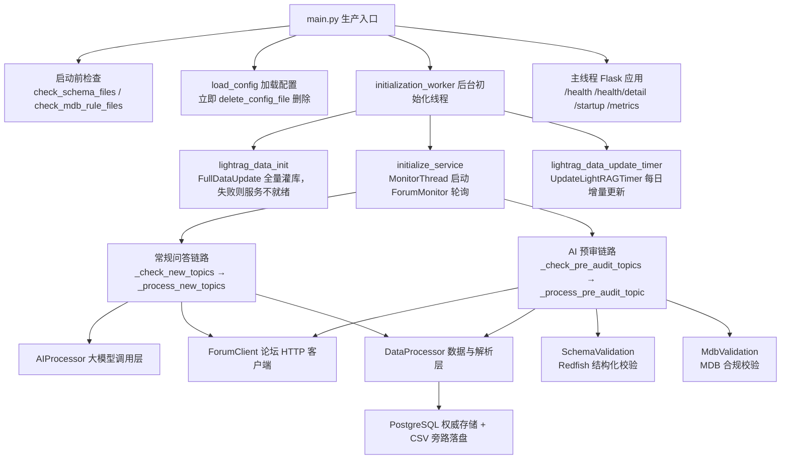
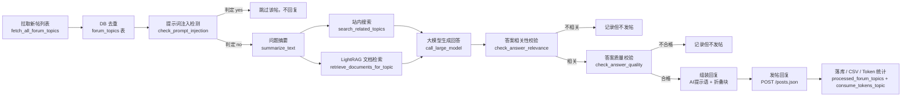
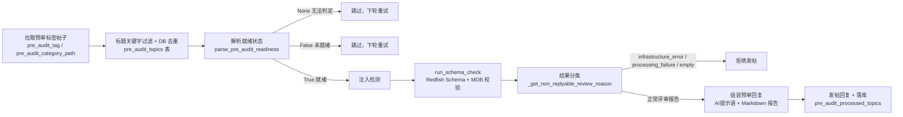

# 项目概览：论坛智能回复机器人

> 本文是整份知识库的**第一站**。它不逐行讲解某个函数，而是回答三个问题：**这个系统解决什么问题？它由哪些部件组成？代码从哪里开始读？** 读完本文后，你会掌握 `main.py` 的启动装配流程、`src/ForumBot/` 的三层能力模型、以及常规问答与 AI 预审两条处理链路的完整拓扑，为深入任意子模块建立全局坐标系。

---

## 1. 项目定位与核心价值

### 1.1 背景与痛点

`forum-reply-robot`（论坛回复机器人）是一个**常驻运行的自动化服务**：它周期性轮询外部论坛（Discourse 风格 API），发现带指定标签/类别的新帖后，调用大模型（OpenAI 兼容接口，实际常指向 SiliconFlow 等）生成回答并**自动发布回复**。同时，它维护一套基于 LightRAG 的检索增强（RAG）知识库，让回答能够引用站内相关主题与知识库文档。

这个项目诞生的背景是典型的"人肉运维"痛点：论坛中每天涌入大量技术问题帖，人工回复耗时且难以保证质量与时效；而涉及 Redfish 规范/MDB 资源协作的预审类帖子，又需要严格的**结构化合规评审**，普通问答式 AI 无法胜任。于是项目把两种截然不同的能力统一进一个进程：

1. **常规问答链路**——面向问题帖的"检索增强生成"（RAG）流水线，强调**答案相关性与质量把关**；
2. **AI 预审链路**——面向预审标签帖的"结构化合规校验"流水线，基于 Redfish JSON Schema 与 MDB 规则集产出**评审报告**。

两者共享同一套论坛客户端、数据持久化与安全防线，但处理逻辑完全独立。

Sources: [README.md](README.md#L1-L13), [CLAUDE.md](CLAUDE.md#L7-L15)

### 1.2 核心特性展开

- **新帖自动监控**：`ForumMonitor` 在守护线程中无限循环，按 `check_interval` 周期调用 `fetch_all_forum_topics()` 拉取帖子列表，再以数据库 `forum_topics` / `pre_audit_topics` 表为**去重权威**，只处理新出现的 topic_id。数据库连接失败时跳过当轮而非崩溃。

- **AI 智能回复**：对每个问题帖依次执行 摘要提取 → 站内搜索 + LightRAG 知识库检索 → 大模型生成回答 → 发帖回复。回复内容**一律带"由 AI 生成，仅供参考"提示语**，并将"总结/结论"摘出放在折叠块外、完整解答放入 `[details]` 折叠块，兼顾可读性与信息量。

- **AI 预审回复**：对预审标签帖子，先解析帖子 HTML 判断作者是否已标记"准备好 AI 预审"（`parse_pre_audit_readiness`），就绪后直接走 Redfish Schema + MDB 规则的结构化校验，把校验报告作为评审意见回复。校验过程中的基础设施异常（超时、限流、空响应）会被识别并**拒绝发帖**，避免把服务错误当成评审意见发出去。

- **安全防护三层把关**：提示词注入检测 → 答案相关性校验 → 答案质量校验，任一环节判定失败都**默认不回复**（从严默认）。用户输入在喂给大模型前会用随机 UUID/字符串包裹，缓解提示词注入。

- **知识库管理**：启动时全量初始化 LightRAG（失败则服务不进入就绪态），随后由定时器（默认每天 18:00 UTC）做增量更新，数据源包括论坛帖子与 GitCode 仓库文档。

- **可观测性与持久化**：PostgreSQL 保存处理记录与 token 消耗，CSV 并行落盘；Prometheus metrics、结构化 JSON 日志、`/health`、`/health/detail`、`/startup` 探针端点一应俱全。

Sources: [README.md](README.md#L5-L13), [CLAUDE.md](CLAUDE.md#L17-L25), [main.py](main.py#L163-L241)

### 1.3 设计哲学（Design Philosophy）

> 贯穿全项目的三条铁律：**逐帖容错**（单帖异常不影响其他帖）、**校验从严**（宁可不回复，不发布低质量/有风险内容）、**安全优先**（凭据即刻删除、输入随机包裹、容器非 root 加固）。

- **容错不是"吞错"，而是"降级不崩"**：`_process_new_topics` 对每个帖子包 `try/except continue`；大模型调用带重试退避；检索失败时用空字符串继续，仅当"搜索与检索都为空"才跳过该帖；数据库连接失败则整体跳过当轮。
- **数据库是唯一真相**：已处理 topic_id 记录在表内，CSV 只是旁路产物。去重、未处理补跑、token 统计全部以 DB 为准。
- **"胶水服务"的边界感**：所有外部端点与凭据集中在 `config/config.yaml`，加载后立即 `delete_config_file()` 删除文件，防止敏感信息长期落盘。

Sources: [CLAUDE.md](CLAUDE.md#L20-L25), [monitor.py](src/ForumBot/monitor.py#L292-L534), [main.py](main.py#L339-L345)

---

## 2. 架构设计与模块划分

### 2.1 进程模型总览

`main.py` 是**唯一生产入口**。主进程是一个 Flask 应用（仅暴露健康检查与指标接口），绑定自动探测的内网私有 IP 的 5000 端口；真正的业务逻辑跑在**两个守护线程**里：监控线程（`MonitorThread` → `ForumMonitor.start()` 轮询循环）与 LightRAG 增量更新定时器线程。初始化则在第三个后台线程（`initialization_worker`）中异步完成，避免阻塞 Flask 启动。



图中每个方框的职责如下：

- **启动前检查**：`check_schema_files()` 校验 `SchemaValidation/SchemaFiles` 目录存在且非空，**缺失则直接退出**（Schema 文件由 Docker 构建期从 GitCode 拉取，不入库）；`check_mdb_rule_files()` 校验 `MdbRuleFiles` 目录，但**缺失仅降级**（MDB 校验为可选能力）。
- **配置生命周期**：`load_config()` 从 YAML 读取全部运行参数（大模型、论坛、数据库、检索、轮询、路径等），随即 `delete_config_file()` 物理删除配置文件，防止明文凭据落盘；随后初始化数据库连接池（`init_db_connection_pool`，min=2 / max=10）。
- **后台初始化线程**：依次执行 LightRAG 全量灌库（失败 → `service_initialized=False`，探针返回 503）→ 启动监控线程（失败 → 不进入就绪态）→ 启动增量更新定时器（失败仅告警，不影响主服务）。三个步骤的失败等级刻意不同，体现"知识库缺失最严重、定时更新最轻微"的依赖优先级。
- **主线程 Flask**：`/health` 的"健康"判定依赖 `MonitorThread` 是否存活，因此**监控线程崩溃可被外部探针感知**，这是 Kubernetes 探针设计的基石。

Sources: [main.py](main.py#L30-L42), [main.py](main.py#L251-L297), [main.py](main.py#L300-L326), [main.py](main.py#L328-L424), [CLAUDE.md](CLAUDE.md#L42-L56)

### 2.2 模块职责矩阵

| 模块 | 职责 | 关键类/函数 |
|------|------|------------|
| `main.py` | 生产入口：装配线程、健康检查、Schema 目录校验、配置加载与删除 | `main()`、`initialization_worker()`、`MonitorThread` |
| `src/ForumBot/monitor.py` | **编排核心**：轮询主循环，串起两条链路；相关链接拼接、回复组装、落库 | `ForumMonitor`（`start` / `_check_new_topics` / `_process_new_topics` / `_check_pre_audit_topics` / `_process_pre_audit_topic` / `_generate_related_links`） |
| `src/ForumBot/forum_client.py` | 论坛 HTTP 客户端：拉帖、发帖、站内搜索、LightRAG 检索 | `ForumClient`（`fetch_all_forum_topics` / `reply_to_topic` / `search_related_topics` / `retrieve_documents_for_topic`） |
| `src/ForumBot/ai_processor.py` | 大模型调用层：摘要、注入检测、相关性/质量校验、生成回答、回答摘要 | `AIProcessor`（`summarize_text` / `check_prompt_injection` / `call_large_model` / `check_answer_relevance` / `check_answer_quality` / `summarize_answer`） |
| `src/ForumBot/data_processor.py` | 数据与解析层（约 1300 行）：PostgreSQL 建表/读写、CSV、HTML→Markdown、预审状态解析 | `DataProcessor`、模块级函数 `fetch_all_forum_topics` / `fetch_topic_details` / `parse_pre_audit_readiness` / `format_search_results_as_json` |
| `src/ForumBot/SchemaValidation/` | Redfish 结构化校验子包：评审点提取、JSON Schema 校验、URI 示例生成、评审报告 | `end_to_end_check.run_schema_check`、`redfish_schema_validator`、`redfish_review_workflow`、`redfish_uri_generator` |
| `src/ForumBot/MdbValidation/` | MDB 合规校验子包：评审点分类 + 大模型规则校验 | `mdb_classifier`、`MdbComplianceChecker` |
| `src/update_lightrag/` | 知识库维护：全量初始化 + 定时增量更新 | `FullDataUpdate`、`UpdateLightRAGTimer`、`UpdateIncrementData`、`LightRAGClient`、`ForumDataFetcher`、`GitCodeClient` |
| `src/evaluation/` | 离线评估：构建数据集、运行基线评估 | `build_dataset`、`run_baseline` |

Sources: [README.md](README.md#L56-L67), [CLAUDE.md](CLAUDE.md#L84-L117), [monitor.py](src/ForumBot/monitor.py#L41-L53)

### 2.3 两条核心处理链路

#### 链路一：常规问答回复链路



要点拆解：

- **去重以 DB 为权威**：`load_existing_data()` 读取 `forum_topics` 表已有 ID 集合，仅对 `topic['id'] not in existing_data` 的新帖拉详情、写 CSV、入 `forum_topics` 表，再进入处理阶段。数据库连接失败 → `existing_data is None` → 直接返回跳过当轮。
- **三层安全校验**：注入检测、相关性校验、质量校验依次执行；任一步骤返回非 "yes" 都会把答案与 token 用量记录到 `processed_forum_topics` 表后 `continue`，**绝不发出**。校验调用本身出错时同样从严默认。
- **检索容错**：检索接口异常时降级为 `{'related_docs': '', 'data': ''}`，仅当"搜索与检索都为空"才跳过回答；否则用空字符串继续生成。
- **回复组装**：`summarize_answer` 从完整答案中提取"总结/结论"章节，成功后格式为 `答案由AI生成，仅供参考：\n<总结>\n\n[details="点击此处查看详细分析解答"]\n<完整解答>\n[/details]`；失败则降级为纯提示语 + 全文。
- **相关链接生成**：`_generate_related_links` 融合 LightRAG 知识图谱链接（从 chunk 的 `file_path` 正则提取 topic_id，票数阈值 5、保留 4 条）与搜索结果链接（过滤含 "news" 的路径），去重后最多保留 5 条，按 知识图谱优先 → 搜索补充 → 双向再补充 的顺序填充。
- **评估旁路**：每处理完一个帖子，通过 `get_evaluation_context()` / `classify_question()` 收集检索延迟、生成延迟等样本，写入评估数据集并更新 Prometheus 指标——这是离线评估的数据来源。

Sources: [monitor.py](src/ForumBot/monitor.py#L77-L132), [monitor.py](src/ForumBot/monitor.py#L292-L534), [monitor.py](src/ForumBot/monitor.py#L135-L290), [CLAUDE.md](CLAUDE.md#L10-L13)

#### 链路二：AI 预审回复链路



要点拆解：

- **预审就绪状态解析**：从帖子 HTML（`post_stream.posts[0].cooked`）解析作者是否标记"准备好 AI 预审"，返回 `True` / `False` / `None` 三态；`None`（无法判定）与 `False` 都跳过，等待下一轮轮询。
- **不做搜索/检索**：预审链路直接走 `SchemaValidation.end_to_end_check.run_schema_check(title, user_question, topic_id, config)`，产出 Markdown 评审报告。这是与常规链路最本质的差异——预审是**规则驱动**而非检索增强。
- **不可发帖结果分类**：`_get_non_replyable_review_reason` 对返回文本做三路分类——`empty`（无评审点）、`infrastructure_error`（超时/限流/空响应等服务异常，`is_infrastructure_error_text` 判定）、`processing_failure`（"处理失败:"/"未知错误:" 前缀）。三者一律**拒绝发帖**，避免把服务错误当成评审意见发布。
- **发现与处理分离**：先写 `pre_audit_topics` 表（发现阶段去重），再写 `pre_audit_processed_topics` 表（处理阶段去重），保证注入判定失败/异常时也不会重复处理同一帖子。

Sources: [monitor.py](src/ForumBot/monitor.py#L536-L625), [monitor.py](src/ForumBot/monitor.py#L627-L721), [data_processor.py](src/ForumBot/data_processor.py#L350-L417), [CLAUDE.md](CLAUDE.md#L14-L15)

---

## 3. 技术栈与核心工作流

### 3.1 技术栈一览

| 领域 | 选型 | 用途 |
|------|------|------|
| 语言/运行时 | Python 3.9（Docker 基础镜像 `python:3.9-slim`） | 全栈实现 |
| 大模型 | `openai`（OpenAI 兼容，指向 SiliconFlow 等）、`langchain-openai` / `langchain-core` | 摘要、注入检测、答案生成与校验 |
| Web 服务 | `flask` + `werkzeug` | 仅健康检查与指标接口 |
| 数据库 | `psycopg[binary]`（PostgreSQL） | 去重、处理记录、token 统计 |
| 配置/日志 | `PyYAML`、`python-json-logger`、`python-dotenv` | 配置加载、结构化 JSON 日志（单文件 20MB 轮转、保留 4 份） |
| 调度/重试 | `schedule`、`retrying` | LightRAG 定时增量、LLM 重试退避 |
| 数据解析 | `beautifulsoup4`、`markdownify`、`pandas` | HTML→Markdown、表格转换、CSV |
| 可观测性 | `prometheus_client` | `/metrics` 指标暴露 |
| 其他 | `pytz`、`gitpython`、`netifaces` | 时区、GitCode 抓取、内网 IP 探测 |

Sources: [CLAUDE.md](CLAUDE.md#L29-L40), [README.md](README.md#L104-L107)

### 3.2 核心类在流程中的角色

| 核心类 | 所在文件 | 在流程中的角色 |
|--------|---------|---------------|
| `ForumMonitor` | `src/ForumBot/monitor.py` | **总调度**。`start()` 无限循环，每轮依次执行常规链路与预审链路；构造时注入三大能力层（`ForumClient` / `AIProcessor` / `DataProcessor`）并 `create_tables()` |
| `ForumClient` | `src/ForumBot/forum_client.py` | **对外 HTTP 出口**。拉帖列表、拉详情（委托给 `data_processor` 模块级函数）、`POST /posts.json` 发帖、站内搜索、LightRAG 检索（含 rerank 参数） |
| `AIProcessor` | `src/ForumBot/ai_processor.py` | **大模型封装**。主备双模型（`model_list` = [model2_name, model_name]）按序回退；所有 LLM 调用统一在此收敛 token 统计 |
| `DataProcessor` | `src/ForumBot/data_processor.py` | **数据与解析层**。建表（`create_tables`）、DB/CSV 读写、token 落库、HTML 解析、预审就绪解析 |
| `token_tracker` | `src/ForumBot/token_tracker.py` | 全局单例，按 topic_id 累计 prompt/completion/total token，最终由 `save_token_usage_to_db` 落库 |
| `FullDataUpdate` / `UpdateLightRAGTimer` / `UpdateIncrementData` | `src/update_lightrag/` | 知识库维护三件套：全量灌库、每日定时增量、单次增量执行 |
| `run_schema_check` / `is_infrastructure_error_text` | `src/ForumBot/SchemaValidation/end_to_end_check.py` | 预审链路的评审引擎入口与"基础设施异常文本"判定器 |

Sources: [monitor.py](src/ForumBot/monitor.py#L42-L53), [forum_client.py](src/ForumBot/forum_client.py#L15-L35), [ai_processor.py](src/ForumBot/ai_processor.py#L10-L20), [CLAUDE.md](CLAUDE.md#L84-L95)

### 3.3 主链路代码示例：从入口到装配

`main.py` 的核心价值在于**把三个异步生命周期编排在一起**。下面这段是最值得精读的装配代码——它展示了"配置即刻销毁"与"初始化异步化"两个设计决策：

```python
# main.py
def main():
    # 1. 启动前目录检查（SchemaFiles 缺失则致命，MdbRuleFiles 缺失仅降级）
    if not check_schema_files():
        logger.error("SchemaFiles 检查失败，应用退出")
        return
    check_mdb_rule_files()

    config = None
    try:
        from src.utils import load_config, delete_config_file, init_db_connection_pool
        config = load_config()
        # 2. 加载配置后立即删除，防止明文凭据长期落盘
        delete_config_file()
        # 3. 初始化数据库连接池（供 RAG API 使用）
        if db_config:
            if not init_db_connection_pool(db_config, min_connections=2, max_connections=10):
                logger.error("数据库连接池初始化失败，API服务可能无法正常工作")
    except Exception as e:
        logger.error(f"配置加载失败: {e}")

    # 4. 后台初始化线程（异步，不阻塞 Flask 启动）
    if config:
        init_thread = threading.Thread(
            target=initialization_worker, args=(config,), daemon=True
        )
        init_thread.start()

    # 5. 主线程跑 Flask，绑定内网私有 IP:5000
    bind_ip = get_best_private_ip()
    app.run(host=bind_ip, port=5000, debug=False)
```

对应的 `initialization_worker` 是"依赖优先级"的具象化——LightRAG 全量初始化失败会让服务保持未就绪（探针 503），而定时器失败仅告警：

```python
def initialization_worker(config):
    if not lightrag_data_init(config):      # 全量灌库失败 → 最严重
        service_initialized = False
        return
    if not initialize_service(config):      # 监控线程失败 → 次严重
        service_initialized = False
        return
    if not lightrag_data_update_timer(config):  # 定时器失败 → 可容忍
        logger.warning("LightRAG数据更新定时器启动失败，但不影响主服务")
```

Sources: [main.py](main.py#L300-L326), [main.py](main.py#L328-L424), [utils.py](src/utils.py#L121-L149), [utils.py](src/utils.py#L182-L216)

---

## 4. 学习与探索建议

### 4.1 推荐阅读路线（按主题）

| 目标读者 | 主题 | 推荐源码入口 | 说明 |
|---------|------|-------------|------|
| 想要跑通整体 | 启动装配 | `main.py` 全文 | 理解线程模型、探针、配置生命周期 |
| 关注问答链路 | 编排核心 | `src/ForumBot/monitor.py` 的 `_process_new_topics` | 三层校验的完整顺序与降级策略 |
| 关注预审链路 | 结构化校验 | `src/ForumBot/monitor.py` 的 `_process_pre_audit_topic` → `src/ForumBot/SchemaValidation/end_to_end_check.py` | 评审引擎入口与不可发帖判定 |
| 关注大模型层 | Prompt 与安全 | `src/ForumBot/ai_processor.py` | 注入检测的随机包裹技巧、主备模型回退 |
| 关注数据层 | 表结构与解析 | `src/ForumBot/data_processor.py` 的 `create_tables` / `parse_pre_audit_readiness` | DB 权威去重与 HTML 解析 |
| 关注知识库 | RAG 维护 | `src/update_lightrag/full_data_init.py`、`increment_date_update_timer.py` | 全量/增量灌库与水位管理 |
| 关注测试 | Mock 隔离 | `tests/conftest.py` | 模块级 dummy 机制，理解"如何不依赖外部服务测业务" |

### 4.2 三种阅读姿态

- **纵深阅读**：从 `ForumMonitor.start()` 出发，沿着 常规链路 → `AIProcessor` → `DataProcessor` 一路向下，把每个 `try/except` 分支的降级路径画出来——这个项目的"魂"全在异常路径里。
- **横向阅读**：对比两条链路的异同——它们共享 `ForumClient` 与 `DataProcessor`，但在"是否检索""是否做质量校验""失败如何处置"上刻意分化，理解这些分化的动机是理解整体设计的捷径。
- **逆向阅读**：从 `tests/conftest.py` 的 dummy mock 清单反推外部依赖清单，再对照 `CLAUDE.md` 的"外部依赖失败行为"表，可以快速建立系统的脆弱面地图。

Sources: [CLAUDE.md](CLAUDE.md#L121-L133), [tests/conftest.py](tests/conftest.py)

---

## 🧭 源码导航 (Codebase Map)

本页属于**全局概览（形态 A）**，以下路径是整个代码库的"骨架清单"：

- **生产入口**：`main.py` —— 装配线程、探针、Schema 检查、配置销毁
- **编排核心**：`src/ForumBot/monitor.py` —— `ForumMonitor` 轮询主循环与两条链路调度
- **论坛 HTTP 客户端**：`src/ForumBot/forum_client.py` —— `ForumClient`
- **大模型调用层**：`src/ForumBot/ai_processor.py` —— `AIProcessor`
- **数据与解析层**：`src/ForumBot/data_processor.py` —— `DataProcessor` 及模块级解析函数
- **预审评审引擎**：`src/ForumBot/SchemaValidation/end_to_end_check.py` —— `run_schema_check`
- **MDB 合规校验**：`src/ForumBot/MdbValidation/mdb_checker.py` —— `MdbComplianceChecker`
- **知识库维护**：`src/update_lightrag/` —— `FullDataUpdate` / `UpdateLightRAGTimer` / `LightRAGClient`
- **通用工具**：`src/utils.py` —— `load_config` / `delete_config_file` / `get_db_connection` / 连接池
- **测试基础设施**：`tests/conftest.py` —— 模块级外部依赖 mock

---

> 下一站建议：深入 `src/ForumBot/monitor.py` 的常规问答链路，或阅读《配置与启动流程》了解 `config.yaml` 的每个配置段如何驱动上述全部行为。
