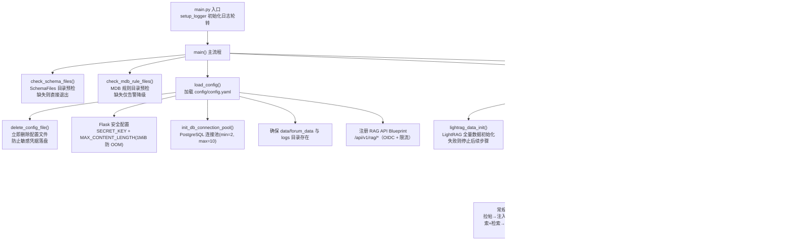

# 快速开始：环境搭建与首启

> 本文面向即将接手本仓库、需要在本地或容器中把它跑起来的开发者。你将沿着 `main.py` → `config/config.yaml` → `requirements.txt` 三条主线索，理解这个论坛 AI 机器人服务**从「进程启动」到「对外就绪」的完整引导链路**，以及每一步背后的设计取舍。

---

## 1. 项目定位与核心价值

**forum-reply-robot** 是一个「自动监控论坛新帖 → 调用大模型智能回复 → 结构化合规预审」的常驻服务。它不是一个单纯的 LLM 封装，而是一条完整的**生产级数据流水线**：周期性轮询 Discourse 风格论坛，对带指定标签/分类的新帖做提示词注入检测、问题摘要、站内搜索 + LightRAG 知识库检索，再经大模型生成回答，通过**注入检测 → 答案相关性校验 → 答案质量校验**三层把关后才允许自动发帖；对预审类帖子则执行 Redfish Schema + MDB 规则的**结构化合规校验**，把评审报告作为回复发布。

该项目要解决的痛点非常明确：**人工运维论坛的高成本与知识库沉淀的割裂**。若完全依赖人工，问题帖的回复时效与质量不可控；若只做"一问一答"的朴素机器人，则既无法复用历史知识，也无法在发布前对涉及硬件规范（Redfish）的帖子做合规校验，低质量或错误内容会直接暴露给用户。因此它把「知识沉淀（LightRAG 全量初始化 + 每日增量更新）」「智能应答（检索增强生成）」与「发布前校验（三层安全把关 + 结构化合规）」三者缝合进同一个常驻进程，并以 PostgreSQL 为**去重与审计的权威数据源**。

从工程角度，其核心价值在于**「可观测、可审计、可降级」的启动与运行哲学**：启动阶段对配置敏感信息即时销毁、对 Schema 文件做硬性预检、对 MDB 规则做软性降级；运行阶段通过 `/health`、`/startup`、`/metrics` 暴露细粒度健康状态；处理阶段对单帖异常逐条容错、对校验失败"宁可不回复"。这些约束从 `main()` 的第一行开始就在被严格执行。

Sources: [README.md](README.md#L1-L56), [main.py](main.py#L16-L27)

---

## 2. 架构设计与模块划分

### 2.1 启动引导架构（Boot Sequence）

`main.py` 是整个系统的**唯一生产入口**，它把"预检 → 配置加载 → 基础设施初始化 → 后台异步初始化 → Web 服务监听"编排成一条有明确失败边界的链路。关键设计是：**把重量级初始化（LightRAG 全量灌库、轮询线程、定时器）全部放进守护线程异步执行**，让 Flask 主线程立即开始监听，从而让 `/startup` 探针能对外表达"正在初始化"而非"连接被拒"。



### 2.2 各层职责与实现细节

**入口层（main.py）**：负责进程生命周期。它定义了 `MonitorThread`（守护线程包装器，主程序退出时自动回收）与三个全局状态变量 `service_initialized` / `monitor_instance` / `monitor_thread`，这些状态被 `/startup`、`/health`、`/health/detail` 三个探针消费，形成"初始化未完成 → 503，完成后 → 200"的就绪语义。

**配置层（config/config.yaml + src/utils.py）**：`load_config()` 用 PyYAML 读取 `config/config.yaml` 为字典后，**立刻调用 `delete_config_file()` 物理删除该文件**。这是刻意的安全设计——凭据只在内存中存活，避免长时间落盘。`main()` 随后从该字典提取 `flask_secret_key`（生产环境强制，缺失时仅在 `--debug` 或 `FLASK_DEBUG=1` 下允许降级默认值）与 `flask_max_content_length`（默认 1 MiB，配合 `@app.errorhandler(413)` 在读取完整请求体前拦截超大 payload，防 OOM）。

**基础设施层**：`init_db_connection_pool()` 基于 `psycopg2.pool.ThreadedConnectionPool` 建立 2~10 连接的线程安全池，被论坛去重、token 记录、限流计数共享；`setup_logger()` 使用 `RotatingFileHandler` 做 20MB×4 份的日志轮转，同时输出控制台与 `logs/main.log`。

**核心业务层（src/ForumBot/）**：`ForumMonitor` 是编排核心，`start()` 进入 `while True` 轮询循环，每轮执行 `_check_new_topics`（常规问答链路）与 `_check_pre_audit_topics`（预审链路），单帖异常用 try/except 逐条吞掉并 continue，保证"一帖失败不影响其他帖"。

**知识库层（src/update_lightrag/）**：`FullDataUpdate.update_full_data()` 仅在 LightRAG 为空时执行全量灌库（幂等检查），随后 `UpdateLightRAGTimer.run_scheduler()` 用 `schedule` 库注册每日 18:00（容器标准时间）的增量更新任务，增量任务先读水位再清目录，DB 不可达时抛 `UpdateTimeUnavailableError` 跳过本轮。

**API 层（rag_api.py）**：`RAGAPIController` 把 OIDC 认证（`auth_middleware.require_auth`）、用户级限流（`rate_limiter.rate_limit`）与 LightRAG 纯透传接口（`/retrieve`、`/documents/*`）封装成 Blueprint 挂载到主应用。

Sources: [main.py](main.py#L30-L123), [main.py](main.py#L251-L421), [src/utils.py](src/utils.py#L121-L149), [src/utils.py](src/utils.py#L182-L216), [src/ForumBot/logging_config.py](src/ForumBot/logging_config.py#L7-L49), [src/ForumBot/monitor.py](src/ForumBot/monitor.py#L41-L74), [src/update_lightrag/full_data_init.py](src/update_lightrag/full_data_init.py#L93-L127), [src/update_lightrag/increment_date_update_timer.py](src/update_lightrag/increment_date_update_timer.py#L204-L226), [src/ForumBot/rag_api.py](src/ForumBot/rag_api.py#L286-L294)

---

## 3. 技术栈与核心工作流

### 3.1 依赖分组总览

`requirements.txt` 采用**精确版本锁定**（`==`），按功能域清晰分组。读懂这张表就能预判系统的外部依赖拓扑：

| 功能域 | 关键包 | 在启动链路中的作用 |
|--------|--------|--------------------|
| **AI / 大模型** | `openai`、`langchain-openai`、`langchain-core`、`httpx`、`requests` | `AIProcessor` 调用 OpenAI 兼容接口（如 SiliconFlow）完成摘要、生成、注入检测、质量校验 |
| **数据处理** | `beautifulsoup4`、`PyYAML`、`pandas`、`markdownify` | 配置解析（PyYAML）、帖子 HTML 清洗与 Markdown 转换、CSV 落盘 |
| **Web 服务** | `flask`、`werkzeug` | 主应用 + 健康检查 + RAG API Blueprint |
| **数据库** | `psycopg2-binary` | PostgreSQL 连接池、去重表、token 记录、限流计数 |
| **日志** | `python-json-logger`、`python-dotenv` | 结构化日志与 env 加载 |
| **定时器** | `schedule` | 每日 LightRAG 增量更新调度 |
| **网络工具** | `netifaces` | `main()` 中枚举网卡以选定内网绑定 IP |
| **可观测性** | `prometheus-client` | `/metrics` 端点导出 Prometheus 指标 |
| **认证 / 安全** | `authlib`、`cryptography` | RAG API 的 OIDC 登录流与 token 加密 |

Sources: [requirements.txt](requirements.txt#L1-L50), [Dockerfile](Dockerfile#L30-L33)

### 3.2 启动主链路（感知 → 准备 → 就绪）

整个启动过程可抽象为**五阶段主链路**，`main()` 与后台线程共同完成：

| 阶段 | 执行者 | 关键动作 | 失败语义 |
|------|--------|----------|----------|
| **① 预检** | `main()` 同步 | SchemaFiles 目录硬校验（缺失退出）、MDB 规则软校验（缺失降级） | Schema 失败即 `return` 退出 |
| **② 配置装载** | `main()` 同步 | `load_config()` → `delete_config_file()` → 提取 SECRET_KEY / MAX_CONTENT_LENGTH | 失败则回退默认目录，不启动初始化线程 |
| **③ 基础设施** | `main()` 同步 | 数据库连接池、数据/日志目录、RAG Blueprint 注册、限流表创建 | 连接池失败仅告警 |
| **④ 后台初始化** | `initialization_worker` 守护线程 | LightRAG 全量 → ForumMonitor 线程 → 增量定时器（严格顺序） | ①②失败则 `service_initialized=False`，探针返回 503 |
| **⑤ Web 就绪** | Flask 主线程 | 绑定内网私有 IP:5000，暴露 4 个探针端点 | 服务始终监听，初始化状态由 `/startup` 表达 |

这里有一个值得细品的工程决策：**「先监听、后初始化」**。传统做法是初始化完成后才 `app.run()`，但本系统选择让 Flask 立即监听、用 `/startup` 返回 503 表达"尚未就绪"。这使得 Kubernetes `startupProbe` 可以优雅地等待初始化完成而不至于 kill 重启，同时 `/health` 在监控线程存活时返回 200——**把「进程活着」与「业务就绪」两个语义彻底分离**。

Sources: [main.py](main.py#L163-L234), [main.py](main.py#L300-L421), [tests/test_main_initialization.py](tests/test_main_initialization.py#L9-L105)

### 3.3 核心类在流程中的角色

| 核心类 | 所在文件 | 启动阶段中的角色 |
|--------|----------|------------------|
| `ForumMonitor` | `src/ForumBot/monitor.py` | 轮询编排核心，构造时创建数据库表，`start()` 进入主循环 |
| `FullDataUpdate` | `src/update_lightrag/full_data_init.py` | 首次启动时全量拉取论坛数据并灌入 LightRAG（幂等） |
| `UpdateLightRAGTimer` | `src/update_lightrag/increment_date_update_timer.py` | 注册每日增量更新调度任务 |
| `RAGAPIController` | `src/ForumBot/rag_api.py` | 创建并注册 RAG API Blueprint，装配 OIDC + 限流 |
| `RateLimiter` | `src/ForumBot/rate_limiter.py` | 基于 PostgreSQL 计数器的滑动窗口限流，`create_tables` 建表 |

Sources: [src/ForumBot/monitor.py](src/ForumBot/monitor.py#L41-L53), [src/update_lightrag/full_data_init.py](src/update_lightrag/full_data_init.py#L16-L27), [src/update_lightrag/increment_date_update_timer.py](src/update_lightrag/increment_date_update_timer.py#L204-L226), [src/ForumBot/rate_limiter.py](src/ForumBot/rate_limiter.py#L9-L38)

---

## 4. 典型代码示例（Showcase）

### 4.1 首启入口：配置装载与敏感信息即时销毁

`main()` 的前半段是本项目安全哲学的浓缩。注意 `load_config` 是在函数体内**延迟导入**的，且配置一经加载立即物理删除——凭据只在内存字典中存活：

```python
from src.utils import load_config, delete_config_file, init_db_connection_pool
config = load_config()
# 删除配置文件以防止敏感信息落盘
delete_config_file()

# 从 config.yaml 的 flask_secret_key 读取（部署链路：Vault → config.yaml）
flask_secret_key = config.get('flask_secret_key')
if flask_secret_key:
    app.config['SECRET_KEY'] = flask_secret_key
else:
    if '--debug' in sys.argv or os.environ.get('FLASK_DEBUG') == '1':
        app.config['SECRET_KEY'] = 'dev-secret-key-for-local-debug-only'
    else:
        logger.error("Flask SECRET_KEY 未设置，生产环境必须在 config.yaml 配置")

# 请求体上限，防止超大 JSON payload 导致 OOM
app.config['MAX_CONTENT_LENGTH'] = int(config.get('flask_max_content_length', 1024 * 1024))
```

Sources: [main.py](main.py#L339-L367)

### 4.2 后台初始化线程：严格的失败边界

`initialization_worker` 用**顺序短路**表达依赖关系——LightRAG 灌库失败则不再启动监控线程；监控线程失败则不再启动定时器；唯独定时器失败仅告警，因为它不是主链路必需件：

```python
def initialization_worker(config):
    global service_initialized
    logger.info("后台初始化线程启动...")
    try:
        if not lightrag_data_init(config):
            logger.error("LightRAG数据初始化失败，服务将保持未就绪状态")
            service_initialized = False
            return
        if not initialize_service(config):
            logger.error("服务初始化失败，服务将保持未就绪状态")
            service_initialized = False
            return
        if not lightrag_data_update_timer(config):
            logger.warning("LightRAG数据更新定时器启动失败，但不影响主服务")
        logger.info("后台初始化完成")
    except Exception as e:
        logger.error(f"后台初始化异常: {e}")
        service_initialized = False
```

Sources: [main.py](main.py#L300-L326)

### 4.3 最小配置形态

仓库中检入的 `config/config.yaml` 只是**最小示例**（仅 API 段），完整配置段（`posts` / `database` / `monitor` / `retrieval` / `lightrag_paths` / `paths` / `logging` / `timer` / `rate_limit` / `external_api` 等）由部署链路通过 Vault 注入，且该文件已被 `.gitignore` 忽略：

```yaml
api:
  base_url: 'https://api.siliconflow.cn/v1'
  api_key: '************************************'
  model_name: 'Qwen/Qwen3-235B-A22B-Instruct-2507'
```

Sources: [config/config.yaml](config/config.yaml#L1-L6), [README.md](README.md#L119-L150)

---

## 5. 学习与探索建议

| 你的目标 | 建议路径 | 关键文件 |
|----------|----------|----------|
| **把它跑起来** | 先读 README「快速开始」与「容器化部署」，用 Docker 构建避免手工拉 Schema 文件 | [README.md](README.md#L109-L181), [Dockerfile](Dockerfile#L1-L110) |
| **理解启动链路** | 沿着 `main()` → `initialization_worker` → 探针端点逐行走读，再配合初始化单测验证失败分支 | [main.py](main.py#L300-L421), [tests/test_main_initialization.py](tests/test_main_initialization.py) |
| **追常规问答链路** | 进入 `ForumMonitor._process_new_topics`，从注入检测到发帖的完整状态机 | [src/ForumBot/monitor.py](src/ForumBot/monitor.py#L292-L534) |
| **追 AI 预审链路** | 进入 `_process_pre_audit_topic` 与 `run_schema_check`，看结构化合规如何被组装成回复 | [src/ForumBot/monitor.py](src/ForumBot/monitor.py#L627-L720), [src/ForumBot/SchemaValidation/end_to_end_check.py](src/ForumBot/SchemaValidation/end_to_end_check.py) |
| **理解知识库维护** | 对照全量初始化与增量更新的水位线逻辑，看幂等与降级如何实现 | [src/update_lightrag/full_data_init.py](src/update_lightrag/full_data_init.py#L93-L127), [src/update_lightrag/increment_date_update_timer.py](src/update_lightrag/increment_date_update_timer.py#L159-L201) |
| **验证可观测性** | 启动后依次 curl `/startup`、`/health`、`/health/detail`、`/metrics`，观察初始化前后状态变化 | [main.py](main.py#L163-L241) |

---

## 🧭 源码导航 (Codebase Map)

- **主入口**：`main.py` — 生产进程入口，五阶段启动链路与 4 个探针端点（[main.py](main.py#L328-L421)）
- **配置装载**：`src/utils.py` — `load_config` / `delete_config_file` / `init_db_connection_pool`（[src/utils.py](src/utils.py#L121-L216)）
- **编排核心引擎**：`src/ForumBot/monitor.py` — `ForumMonitor` 轮询主循环（[src/ForumBot/monitor.py](src/ForumBot/monitor.py#L41-L74)）
- **知识库引擎**：`src/update_lightrag/full_data_init.py`（全量）与 `increment_date_update_timer.py`（增量）
- **对外 API**：`src/ForumBot/rag_api.py` — OIDC + 限流 + LightRAG 透传（[src/ForumBot/rag_api.py](src/ForumBot/rag_api.py#L14-L62)）
- **测试基线**：`tests/test_main_initialization.py` — 启动流程失败分支的行为契约
