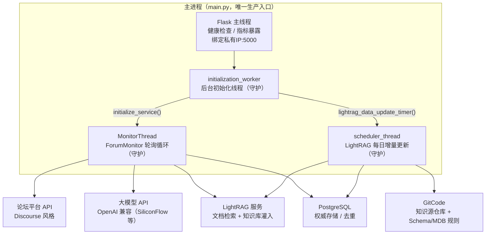
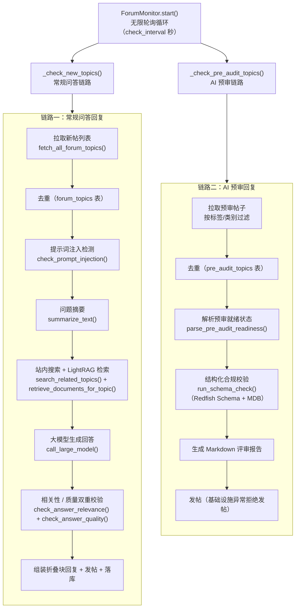

---
title: 核心架构：双链路进程模型
slug: 3-core-architecture
section: 入门指南
difficulty: Intermediate
---

# 核心架构：双链路进程模型

## 1. 项目定位与核心价值

**forum-reply-robot** 是一个面向论坛场景的**自动问答机器人服务**：它常驻运行，周期性轮询论坛，识别带特定标签/类别的新帖，调用大模型生成回答并自动发布，同时维护一套基于 LightRAG 的检索增强知识库（RAG）。从设计哲学上看，它并非一个"主动生成内容"的通用 Chatbot，而是一个**被动响应 + 主动维护**的胶水服务——论坛是触发源，大模型是决策引擎，LightRAG 是记忆体，PostgreSQL 是去重与审计的权威存储。这个定位决定了它的一切架构取舍：外部依赖极多（论坛 API、大模型、站内搜索、LightRAG、GitCode、PostgreSQL），因此系统必须围绕**容错**与**可观测性**来设计。

项目解决的痛点非常具体：在 Redfish 硬件规范文档社区等场景中，用户会持续在论坛提出大量问题，人工逐帖回复成本极高且质量不稳定。机器人需要在不干扰社区生态的前提下做到三点——**对普通问题给出有依据的 RAG 增强回答**、**对"预审"类帖子输出结构化合规评审意见（而非自由生成的回答）**、**对知识库做全量与增量的持续维护**。前两者构成了本文档标题中的"双链路"：常规问答回复链路与 AI 预审回复链路；后者是支撑前两者的第三条后台链路。

> **核心设计哲学：校验从严，宁缺毋滥。** 机器人被刻意设计为"可失败、但不可乱说话"——注入检测、相关性校验、质量校验任一环节出错都默认判为"不通过"，宁可跳过回复也不发布低质量或有害内容；预审链路中凡是识别为基础设施异常（超时、限流、空响应）的结果一律拒绝发帖，避免把服务错误当成评审意见发布出去。

这一"安全优先 + 逐帖容错"的取舍贯穿全部代码：单帖异常通过 `try/except continue` 隔离，绝不拖垮整轮轮询；数据库连接失败跳过当轮而非崩溃；用户输入在喂给大模型前用随机字符串包裹以缓解提示词注入；`config.yaml` 加载后立即删除以防敏感信息长期落盘。

Sources: [CLAUDE.md](CLAUDE.md#L5-L25), [README.md](README.md#L50-L54), [main.py](main.py#L342-L362)

---

## 2. 架构设计与模块划分

### 2.1 进程拓扑：一个主进程、三条守护线程

系统的进程模型极为精简——**只有一个生产入口 `main.py`，所有业务逻辑跑在同一进程内的多个守护线程中**。这并非粗放的"单进程跑一切"，而是一种经过考量的部署简化：外部探针（Kubernetes probe）只需感知一个端口，健康判定直接依赖监控线程的存活状态，从而把"业务线程是否活着"这一内部状态对外暴露为可观测信号。



**逐模块拆解：**

- **Flask 主线程**：`main()` 在完成目录与配置检查后，通过 `app.run(host=bind_ip, port=5000, debug=False)` 启动 Flask。它只承担四类 HTTP 端点——`/startup`（启动探针，就绪前返回 503）、`/health`（存活探针）、`/health/detail`（组件级详情，含 OIDC 与 LightRAG 状态）、`/metrics`（Prometheus 指标）。绑定地址由 `get_best_private_ip()` 自动探测：优先 `10.` 段内网 IP，其次 `192.168.` 段，回退到列表首项；探测逻辑同时具备 `netifaces` 与 `socket.getaddrinfo` 双实现，以应对环境差异。Flask 还被配置了 `MAX_CONTENT_LENGTH`（默认 1 MiB）以在读取完整请求体前拒绝超大 payload，防止 OOM。
- **initialization_worker 后台线程**：`main()` 在启动 Flask 前先创建该守护线程（`threading.Thread(target=initialization_worker, ...)`），将**重初始化**移出启动路径。它按严格顺序执行三个步骤：`lightrag_data_init()`（LightRAG 全量初始化）→ `initialize_service()`（创建 `ForumMonitor` 并启动 `MonitorThread`）→ `lightrag_data_update_timer()`（启动每日增量更新线程）。任一步失败都会将全局 `service_initialized` 置为 `False`，使 `/health` 与 `/startup` 持续返回 503，从而被外部探针感知。
- **MonitorThread（守护线程）**：`initialize_service()` 中创建 `ForumMonitor(config)` 实例后，将其包装进 `MonitorThread`（`threading.Thread` 子类，`daemon=True`）启动。线程体只是调用 `monitor.start()`，真正的业务逻辑在 `ForumMonitor.start()` 的无限轮询循环中——这是双链路编排的核心，见 2.2 节。
- **scheduler_thread（守护线程）**：`lightrag_data_update_timer()` 创建 `UpdateLightRAGTimer` 并在线程中运行 `run_scheduler()`。它使用 `schedule` 库注册"每天 18:00 UTC（东八区凌晨 02:00）"的增量更新任务，然后进入 `schedule.run_pending()` + `sleep(1)` 的空转循环。
- **RAG API Blueprint**：`main()` 在启动初始化线程前，若配置 `external_api.enabled` 为真，会调用 `create_rag_api_controller(config)` 创建控制器并 `app.register_blueprint(rag_api_bp)`，把 `/api/v1/rag/*` 路由挂到 5000 端口，同时预建限流表（`rate_limiter.create_tables`）。这使同一进程既能"读"知识库（问答链路检索），也能对外"写"知识库（RAG API）。

值得强调的是**启动顺序的刻意设计**：`initialization_worker` 中的全量初始化是**同步阻塞**的（`update_full_data()` 会一直轮询 LightRAG 直到全部文件处理完成），因此监控线程与增量定时线程一定在知识库就绪后才启动；而 Flask 主线程不等待任何初始化，始终先监听端口——服务"可探测但未就绪"的状态由 `/startup` 探针显式表达。

Sources: [main.py](main.py#L30-L42), [main.py](main.py#L101-L123), [main.py](main.py#L126-L139), [main.py](main.py#L142-L161), [main.py](main.py#L300-L327), [main.py](main.py#L328-L424), [CLAUDE.md](CLAUDE.md#L42-L56)

### 2.2 双链路业务编排：ForumMonitor 轮询循环

`ForumMonitor` 是整个业务编排的核心。它在构造时注入同一份 `config` 并装配三大能力层：`ForumClient`（论坛 HTTP 客户端）、`AIProcessor`（大模型调用层）、`DataProcessor`（数据与解析层），随后调用 `create_tables()` 完成建表。`start()` 是一个永不退出的 `while True` 循环：每轮依次执行 `_check_new_topics()` 与 `_check_pre_audit_topics()`，然后 `sleep(check_interval)`；捕获 `KeyboardInterrupt` 优雅退出，其余异常记录日志后继续下一轮。



**链路一：常规问答回复**。`_check_new_topics()` 先从 `DataProcessor` 加载已存在帖子 ID（内存 `set`），再调用 `fetch_all_forum_topics()` 拉取全量新帖列表，通过"ID 是否在集合中"完成去重（刻意只比较 ID，避免重复比较标签与时间）；随后逐帖获取详情、提取结构化数据、追加 CSV、写入 `forum_topics` 表。真正的智能处理在 `_process_new_topics()` 中逐帖串行完成：注入检测 → 摘要 → 站内搜索 + LightRAG 检索 → 大模型生成回答 → 相关性/质量双重校验 → 组装"AI 生成"提示语与 `[details]` 折叠块 → `reply_to_topic()` 发帖 → 检索结果、CSV、`processed_forum_topics`、token 用量、评估样本、Prometheus 指标全部落库。链路一中 `_generate_related_links()` 承担了"相关链接"的融合拼接：将 LightRAG 知识图谱链接与搜索结果链接去重合并、上限 5 条，并处理 `news` 路径过滤与多种 URL 形态的拼接规则。

**链路二：AI 预审回复**。`_check_pre_audit_topics()` 首先检查配置中是否定义了 `pre_audit_tag` 或 `pre_audit_category_path`——两者皆空则整条链路静默跳过，这是"按需激活"的配置驱动设计。激活后拉取预审帖子，先按标题过滤关键字，再以 `pre_audit_topics` 表去重；逐帖拉取详情后，用 `parse_pre_audit_readiness()` 解析帖子 HTML（`post_stream.posts[0].cooked`）判断作者是否标记"准备好 AI 预审"，返回 `True/False/None` 三态——`None` 表示无法判定直接跳过，`False` 表示下轮重试。就绪后调用 `run_schema_check()` 执行结构化合规校验（Redfish Schema + MDB 规则），把 Markdown 评审报告作为回复内容。链路二**刻意不做搜索/检索**，因为预审场景要求的是"确定性合规结论"而非自由生成。

Sources: [monitor.py](src/ForumBot/monitor.py#L41-L74), [monitor.py](src/ForumBot/monitor.py#L77-L132), [monitor.py](src/ForumBot/monitor.py#L292-L534), [monitor.py](src/ForumBot/monitor.py#L536-L625), [monitor.py](src/ForumBot/monitor.py#L627-L721), [CLAUDE.md](CLAUDE.md#L9-L18)

### 2.3 第三条后台链路：LightRAG 知识库维护

双链路是"消费"知识库的，而 `src/update_lightrag/` 是"生产"知识库的第三链路，包含**全量初始化**（`FullDataUpdate`）与**每日增量更新**（`UpdateLightRAGTimer` + `UpdateIncrementData`）两个阶段。

全量初始化 `update_full_data()` 的第一步是幂等守卫：若 LightRAG 服务已有数据则跳过灌库，仅幂等补种水位（`init_last_update_time`），这是为"升级场景"设计的自愈路径。随后清理本地目录、分页抓取全部论坛数据（`get_all_forum_data()`）、按配置决定是否同步 GitCode 仓库文档、保存更新时间水位、比对文件映射（`get_full_update_file()`）找出新增文件、过滤、处理图片、上传文档，最后**忙等** `is_all_file_processed()` 直到 LightRAG 处理完毕。

增量更新 `update_lightrag_task()` 遵循"**先读水位，再清目录**"的严格顺序：先检查 LightRAG 管道是否忙碌（忙则跳过本轮），再读上次更新时间（DB 不可达抛 `UpdateTimeUnavailableError` 跳过本轮，表空时内部幂等补种），水位读成功后才清空本地目录——避免"清空了目录却无法补数据"的中间态。随后抓取论坛增量帖（按 `bumped_at > last_update_time` 过滤）、比对 mapping 文件计算新增/删除文件 ID、删除 LightRAG 旧文档、过滤、处理图片、上传新文档。

Sources: [full_data_init.py](src/update_lightrag/full_data_init.py#L93-L127), [increment_date_update_timer.py](src/update_lightrag/increment_date_update_timer.py#L159-L201), [increment_date_update_timer.py](src/update_lightrag/increment_date_update_timer.py#L204-L226), [CLAUDE.md](CLAUDE.md#L105-L117)

---

## 3. 技术栈与核心工作流

### 3.1 技术栈全景

| 领域 | 选型 | 在架构中的角色 |
| --- | --- | --- |
| 语言/运行时 | Python 3.9（Docker 基础镜像 `python:3.9-slim`） | 全部业务代码 |
| Web 服务 | Flask + Werkzeug | 仅暴露健康检查、指标、RAG API，不承载业务 HTML |
| 大模型 | `openai`（OpenAI 兼容接口）、`langchain-openai` | 摘要、注入检测、相关性/质量校验、回答生成 |
| HTTP | `requests`、`httpx` | 论坛 API、站内搜索、LightRAG 检索 |
| 数据库 | `psycopg[binary]` + `ThreadedConnectionPool` | 权威存储、去重、token/评估审计 |
| 调度 | `schedule`、`retrying` | 每日增量更新、大模型调用重试退避 |
| 可观测 | `prometheus_client`、`python-json-logger` | 指标导出、结构化轮转日志 |
| 配置 | PyYAML + `load_config()` | 集中配置，加载后立即删除 |

### 3.2 常规问答链路：感知 → 规划 → 执行的完整流水线

链路一是一条典型的 **感知（perception）→ 规划（planning）→ 执行（execution）→ 沉淀（persistence）** 流水线：

1. **感知**：`fetch_all_forum_topics()` 拉取候选帖子列表，与 `forum_topics` 表比对去重，只保留新 ID。
2. **安全闸门**：`check_prompt_injection()` 用 16 位随机字符串包裹用户输入后交给大模型判断（`max_tokens=3, temperature=0.1`），主备模型逐一尝试，全部失败时**默认判定为注入**（返回 `"yes"`）。
3. **规划**：`summarize_text()` 生成不超过 100 字符的问题摘要；随后双路取证——`search_related_topics()` 站内搜索相关主题、`retrieve_documents_for_topic()` 向 LightRAG 查询相关文档（`top_k`/`chunk_top_k`/`enable_rerank` 均由配置控制）。
4. **执行**：`call_large_model()` 基于检索上下文生成回答（带重试与退避）。
5. **双闸门**：`check_answer_relevance()` 判断回答与搜索结果是否相关、`check_answer_quality()` 判断质量是否合格，任一不过则**不回复**，但仍会把回答、检索结果、token 用量、评估样本落库——这是"宁可不回复也要留痕"的审计设计。
6. **执行发布**：通过后 `summarize_answer()` 提取总结章节，组装"答案内容由AI生成，仅供参考"提示语 + `[details]` 折叠块，`reply_to_topic()` 调 `POST /posts.json` 发帖。
7. **沉淀**：检索结果、CSV、`processed_forum_topics` 表、`consume_tokens_topic`（token）、`save_evaluation_sample()`（评估样本）、`update_prometheus_metrics()` 全部写出。

### 3.3 AI 预审链路：配置驱动的结构化评审

预审链路的关键区别在于**它验证的不是"回答质量"，而是"帖子内容的合规性"**：

1. 配置激活检查：`pre_audit_tag` / `pre_audit_category_path` 均未配置则链路整体跳过。
2. 拉取与过滤：按预审标签/类别拉帖，标题过滤关键字剔除，`pre_audit_topics` 表去重。
3. 就绪判定：`parse_pre_audit_readiness()` 解析帖子 HTML 中作者是否标记"准备好"，三态处理（`True` 处理 / `False` 下轮重试 / `None` 跳过）。
4. 结构化校验：`run_schema_check()` 判断帖子是否与 Redfish/MDB 相关 → 提取评审点 → 三路分类（mdb/redfish/other）→ 逐点生成 URI 示例、JSON Schema 静态校验、规则合规校验 → 汇总 Markdown 报告。
5. 防误发闸门：`_get_non_replyable_review_reason()` 区分 `empty` / `infrastructure_error` / `processing_failure` 三类不可回复原因——**基础设施异常（`is_infrastructure_error_text()` 识别超时/限流/空响应）一律拒绝发帖**，避免把服务故障当作评审意见。
6. 发布与留痕：通过后直接发帖，并写入 `pre_audit_processed_topics` 表（注入攻击命中时也写入，避免重复检测）。

### 3.4 核心类/接口角色一览

| 类/接口 | 所在文件 | 在流程中的作用 |
| --- | --- | --- |
| `MonitorThread` | `main.py` | 守护线程包装器，线程体内运行 `ForumMonitor.start()` |
| `ForumMonitor` | `monitor.py` | **编排核心**：双链路轮询循环、相关链接拼接、回复组装、落库 |
| `ForumClient` | `forum_client.py` | 论坛 HTTP 客户端：拉帖、详情、搜索、LightRAG 检索、发帖 |
| `AIProcessor` | `ai_processor.py` | 大模型封装：摘要、注入检测、相关性/质量校验、生成回答 |
| `DataProcessor` | `data_processor.py` | 数据层：PostgreSQL/CSV 读写、HTML→Markdown、预审就绪解析 |
| `token_tracker` | `token_tracker.py` | 全局单例，按 topic_id 累计 token 用量 |
| `run_schema_check` | `SchemaValidation/end_to_end_check.py` | 预审链路入口：结构化合规校验入口 |
| `FullDataUpdate` | `update_lightrag/full_data_init.py` | 知识库全量初始化 |
| `UpdateLightRAGTimer` | `update_lightrag/increment_date_update_timer.py` | 每日增量更新调度器 |
| `load_config` / `delete_config_file` | `utils.py` | 配置加载与敏感信息即时删除 |

Sources: [ai_processor.py](src/ForumBot/ai_processor.py#L10-L154), [forum_client.py](src/ForumBot/forum_client.py#L15-L200), [CLAUDE.md](CLAUDE.md#L58-L66), [utils.py](src/utils.py#L121-L149)

---

## 4. 典型代码示例

### 4.1 入口装配：守护线程的创建与启动

`main()` 的尾部是进程模型的"点题之笔"——Flask 永不等待初始化，初始化线程异步推进，两个业务守护线程由它派生：

```python
init_thread = threading.Thread(target=initialization_worker, args=(config,), daemon=True)
init_thread.start()
logger.info("后台初始化线程已启动，Flask 应用开始监听")
...
bind_ip = get_best_private_ip()
app.run(host=bind_ip, port=5000, debug=False)
```

而 `initialization_worker` 内部严格串行地完成"知识库就绪 → 监控线程启动 → 增量定时器启动"：

```python
if not lightrag_data_init(config):
    service_initialized = False
    return
if not initialize_service(config):
    service_initialized = False
    return
if not lightrag_data_update_timer(config):
    logger.warning("LightRAG数据更新定时器启动失败，但不影响主服务")
```

Sources: [main.py](main.py#L300-L327), [main.py](main.py#L412-L421)

### 4.2 双链路的轮询骨架

`ForumMonitor.start()` 是两条链路的共同驱动器——每轮先常规后预审，任一链路异常都不中断循环：

```python
while True:
    try:
        self._check_new_topics(csv_file)      # 链路一：常规问答
        self._check_pre_audit_topics()        # 链路二：AI 预审
        time.sleep(check_interval)
    except KeyboardInterrupt:
        break
    except Exception as e:
        time.sleep(check_interval)            # 整轮异常也不崩溃，稍后重试
```

Sources: [monitor.py](src/ForumBot/monitor.py#L55-L74)

### 4.3 常规链路的"从严闸门"模式

`_process_new_topics()` 中，注入检测失败默认判为攻击；回答生成后必须同时通过相关性与质量双重校验才允许发帖，否则仅落库留痕：

```python
is_injection = self.ai_processor.check_prompt_injection(...)
if is_injection.lower() == 'yes':
    continue                                   # 疑似注入：跳过
...
is_relevant = self.ai_processor.check_answer_relevance(answer, context_data, topic_id)
is_qualified = self.ai_processor.check_answer_quality(answer, topic['title'], topic['user_question'], topic_id)
if is_relevant.lower() != 'yes' or is_qualified.lower() != 'yes':
    # 落库留痕（CSV、processed_forum_topics、token、评估样本）后 continue
```

Sources: [monitor.py](src/ForumBot/monitor.py#L292-L417)

---

## 5. 学习与探索建议

| 读者视角 | 建议路径 | 关联文档/源码 |
| --- | --- | --- |
| 想理解双链路差异 | 先读本页 2.2 节，再对照 `monitor.py` 中 `_check_new_topics` 与 `_check_pre_audit_topics` 的对称结构 | [monitor.py](src/ForumBot/monitor.py#L77-L132) 与 [monitor.py](src/ForumBot/monitor.py#L536-L625) |
| 想深入大模型调用细节 | 读 `ai_processor.py` 的注入检测与主备模型回退逻辑 | [ai_processor.py](src/ForumBot/ai_processor.py#L77-L154) |
| 想理解预审合规引擎 | 从 `run_schema_check` 入口进入 SchemaValidation 子包 | [end_to_end_check.py](src/ForumBot/SchemaValidation/end_to_end_check.py) |
| 想理解知识库维护 | 对照全量初始化与增量更新的"水位"设计 | [full_data_init.py](src/update_lightrag/full_data_init.py#L93-L127)、[increment_date_update_timer.py](src/update_lightrag/increment_date_update_timer.py#L159-L201) |
| 想理解数据权威性 | 从 `create_tables()` 看表结构设计，再到 `utils.py` 的连接池 | [data_processor.py](src/ForumBot/data_processor.py)、[utils.py](src/utils.py#L182-L216) |
| 想理解部署形态 | 读 Dockerfile 的 Schema 拉取与安全加固 | [Dockerfile](Dockerfile) |

---

## 🧭 源码导航 (Codebase Map)

- **核心引擎（编排）**：`src/ForumBot/monitor.py` —— `ForumMonitor` 双链路轮询循环，全项目心智入口。
- **主入口文件**：`main.py` —— 进程/线程装配、健康检查端点、目录与 Schema 校验、配置即时删除。
- **大模型调用层**：`src/ForumBot/ai_processor.py` —— `AIProcessor`，摘要/校验/生成全部 LLM 交互。
- **论坛客户端**：`src/ForumBot/forum_client.py` —— `ForumClient`，拉帖/发帖/搜索/检索。
- **数据与解析层**：`src/ForumBot/data_processor.py` —— PostgreSQL/CSV 读写、HTML 解析、预审就绪判定。
- **预审合规子包**：`src/ForumBot/SchemaValidation/`（入口 `end_to_end_check.py`）与 `src/ForumBot/MdbValidation/`。
- **知识库维护包**：`src/update_lightrag/`（`full_data_init.py`、`increment_date_update_timer.py`）。
- **公共工具**：`src/utils.py`（`load_config` / `delete_config_file` / 连接池）。
- **权威行为说明**：`CLAUDE.md`（双链路、进程结构、设计取舍的最新权威描述）。
