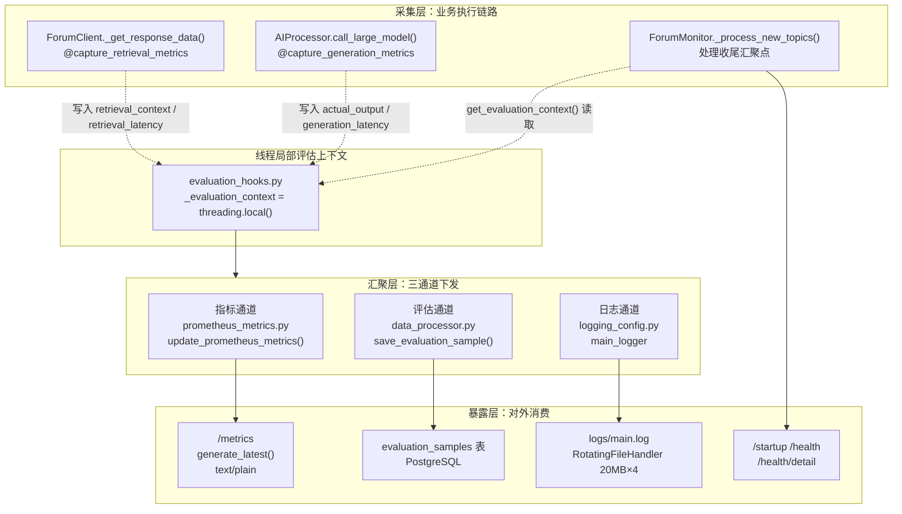
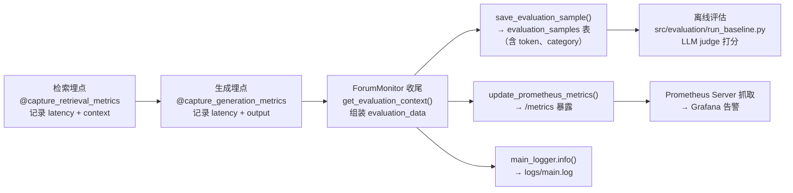

---
title: "可观测性：指标、日志与健康探针"
slug: "18-observability"
---

# 可观测性：指标、日志与健康探针

> 本页深度剖析 `forum-reply-robot` 的**可观测性三支柱**——Prometheus 指标（`prometheus_metrics.py`）、轮转日志（`logging_config.py`）、K8s 健康探针（`main.py`），以及它们共同的**数据采集源头** `evaluation_hooks.py`。难度：Intermediate。

---

## 1. 项目定位与核心价值

论坛智能回复机器人本质上是一个**无人值守的自动化进程**：它周期性轮询 Discourse 论坛、调用大模型生成回答、自主决定是否发布回帖。自动化程度越高，"系统是否在正常工作"这一问题就越难回答——因为错误不再由人工操作触发，而是静默地发生在凌晨三点的某次轮询里。该项目用一套分层明确的可观测性体系回答了三个递进的问题：**系统还活着吗（健康探针）？系统干得怎么样（指标）？系统内部发生了什么（日志）？** 三者不是并列的三个工具，而是一条从"数据采集（`evaluation_hooks`）→ 数据汇聚（Prometheus / PostgreSQL / 日志文件）→ 数据消费（Grafana 大盘 / 离线评估基线）"的完整管道。

其核心价值体现在三个层面。其一是**零侵入的埋点机制**：`evaluation_hooks.py` 以 `threading.local` + 装饰器模式包裹检索与生成两个关键节点，业务代码无需感知观测逻辑，埋点失败也绝不破坏业务主链路——这是可观测性工程中"监控与被监控解耦"的教科书式实现。其二是**指标口径与业务语义严格对齐**：Prometheus 指标并非笼统的"请求量/错误率"，而是直接映射到 RAG 问答管线的三个性能剖面——检索延迟、生成延迟、端到端延迟（后两者由检索+生成线性叠加得出），外加空回复率（Gauge）、召回文档数（Counter）、已处理帖数（Counter），使监控大盘可以直接回答"回答质量在退化吗"这类业务问题。其三是**三档健康探针语义分级**：`/startup` 只验证初始化是否完成（宽松）、`/health` 额外要求监控线程存活（严格）、`/health/detail` 进一步暴露 OIDC 与 LightRAG 两大下游依赖的配置状态——这种分级恰好对应 K8s `startupProbe` / `livenessProbe` / `readinessProbe` 的三种探测语义，让容器编排系统能够精确区分"还在启动"、"活着但不可用"与"一切正常"三种状态。

> 设计哲学：本项目把可观测性当作**一等公民**而非事后补丁。埋点装饰器、指标更新函数、评估样本落库三者共用同一个 `evaluation_data` 字典契约，保证"监控数据"与"评估数据"永远同源；而 `update_prometheus_metrics` 与 `save_evaluation_sample` 各自被 `try/except` 包裹并降级为 `logger.warning`，从架构上确保观测系统本身的故障不会反噬业务系统。

Sources: [prometheus_metrics.py](src/ForumBot/prometheus_metrics.py#L1-L70), [logging_config.py](src/ForumBot/logging_config.py#L7-L49), [evaluation_hooks.py](src/ForumBot/evaluation_hooks.py#L6-L52), [main.py](main.py#L163-L241)

---

## 2. 架构设计与模块划分

### 2.1 总体架构图

可观测性体系由三层构成：**采集层**（`evaluation_hooks` 的装饰器在 `ForumClient._get_response_data` 与 `AIProcessor.call_large_model` 处埋点，将数据写入线程局部上下文）、**汇聚层**（`ForumMonitor` 在处理收尾时统一读取上下文，同时驱动三条下游通道：`prometheus_metrics` 指标更新、`save_evaluation_sample` 评估样本落库、`main_logger` 日志输出）、**暴露层**（Flask 的 `/metrics`、`/health*` 端点与 `logs/main.log` 文件）。



Sources: [forum_client.py](src/ForumBot/forum_client.py#L166-L167), [ai_processor.py](src/ForumBot/ai_processor.py#L308-L309), [monitor.py](src/ForumBot/monitor.py#L386-L413), [main.py](main.py#L236-L241)

### 2.2 指标层：prometheus_metrics.py

`prometheus_metrics.py` 是全项目唯一的指标定义文件，基于 `prometheus-client==0.20.0`（见 `requirements.txt` 第 44 行）。模块在**导入时**即注册全部六个指标，并刻意用 `try/except ValueError` 包裹注册过程——这是对**进程重启后热加载**场景的防御：当 Uvicorn/gunicorn 等服务器以 `--reload` 模式重启 worker 时，模块可能被重复 import，而 Prometheus 客户端对同名指标的二次注册会抛出 `ValueError`，捕获后仅记录警告并复用已有指标对象，避免进程崩溃。其指标设计有三个值得注意的工程决策：

| 指标名 | 类型 | Buckets / 语义 | 业务含义 |
|--------|------|----------------|----------|
| `forum_retrieval_latency_seconds` | Histogram | `[0.5, 2.0, 10.0]` | LightRAG 检索耗时剖面，秒级 |
| `forum_generation_latency_seconds` | Histogram | `[5.0, 30.0, 120.0]` | 大模型生成耗时剖面，十秒~分钟级 |
| `forum_end_to_end_latency_seconds` | Histogram | `[10.0, 60.0, 300.0]` | 检索+生成的端到端耗时（由前两者相加） |
| `forum_empty_reply_rate` | Gauge | 0.0 / 1.0 | 当前样本是否为空回复，可聚合为百分比 |
| `forum_retrieval_doc_count` | Counter | 单调递增 | 每次检索召回文档数（按 context 结构计数） |
| `forum_processed_topic_count` | Counter | 单调递增 | 已处理帖子总数 |

**桶边界（buckets）本身就是领域知识的编码**。三个 Histogram 的桶数量级刻意拉开差距：检索通常应在 2 秒内完成（10 秒桶兜底超时场景），生成通常在 30 秒内完成（120 秒桶兜底 `timeout=600` 的重试场景），端到端则覆盖到 300 秒——这样的桶设计让 `histogram_quantile(0.9, ...)` 可以直接给出可告警的 SLO 判断，而不必依赖默认的线性桶浪费内存与精度。

`update_prometheus_metrics(evaluation_data)` 是唯一的更新入口，其语义是**"只观察正数、只递增计数、异常吞掉"**：延迟字段为 `None` 或 `<=0` 时不调用 `observe`（避免用 0 污染直方图分布）；`actual_output` 为空时 Gauge 置 `1.0`，否则置 `0.0`（空回复率的分子）；`retrieval_context` 按 `dict`（取 `values()` 长度）/ `list`（取长度）/ `str`（记 1）三种形态自适应计数；最后 `end_to_end = retrieval + generation` 并仅在大于 0 时观察。整个函数被最外层 `try/except` 兜底，任何异常都只写 `logger.warning` 而不向上抛出——**指标更新是"尽力而为"的旁路，绝不允许阻塞业务线程**。

Sources: [prometheus_metrics.py](src/ForumBot/prometheus_metrics.py#L4-L33), [prometheus_metrics.py](src/ForumBot/prometheus_metrics.py#L36-L70), [requirements.txt](requirements.txt#L43-L44)

### 2.3 日志层：logging_config.py

`logging_config.py` 提供了全局统一的日志工厂 `setup_logger(name, log_file, level, max_bytes=20MB, backup_count=4)`。其核心是**双处理器（dual-handler）架构**：所有 logger 同时挂载一个 `StreamHandler`（控制台）与一个 `RotatingFileHandler`（文件），前者用于容器 stdout 采集（`PYTHONUNBUFFERED=1` 保证日志实时冲刷到 Docker 日志驱动），后者用于落盘审计。文件处理器启用**大小轮转**：单文件超过 20MB 即滚动，保留最近 4 个备份（`main.log`、`main.log.1`…`main.log.4`），并显式声明 `encoding='utf-8'`——对中文论坛内容而言，缺省平台编码极易产生 `UnicodeEncodeError`，这里从日志配置层直接规避。

两个容易被忽略但至关重要的设计细节：其一是 `logger.propagate = False`，切断 logger 向 root logger 的冒泡，防止 Flask/Werkzeug 等框架日志与业务日志在 root 处重复叠加、也防止重复 handler 造成的行数翻倍；其二是模块导入时的**降级策略**——`setup_logger` 在模块顶部即被调用一次生成 `main_logger = setup_logger('AskRobotPOC', full_log_path)`（日志器名 `AskRobotPOC` 与项目代号一致），若 `load_config()` 失败或 `logging` 配置段缺失，则回退到默认 `logs/main.log`，保证**任何配置异常下日志通道都可用**。整个项目中 `main_logger` 被 `monitor.py`、`forum_client.py`、`ai_processor.py`、`prometheus_metrics.py`、`token_tracker.py` 等十余个模块以 `from .logging_config import main_logger as logger` 的方式共享——这是一条贯穿全项目的"单一日志通道"，任何模块的 `logger.info/error/warning` 最终都汇聚到同一份轮转文件，运维侧只需盯一个文件即可获得全局时间线。

> 设计哲学：日志是"最后一道可观测性网"。指标可能因聚合丢失细节、探针可能因过度简化误报，但日志永远保留最原始的真相。因此本项目对日志的可靠性要求最高——配置加载失败要降级、编码显式指定、轮转防止无限膨胀、`propagate=False` 防止污染。

Sources: [logging_config.py](src/ForumBot/logging_config.py#L7-L49), [logging_config.py](src/ForumBot/logging_config.py#L52-L70), [Dockerfile](Dockerfile#L8-L9)

### 2.4 健康探针层：main.py

健康探针是容器编排系统（K8s）与业务进程之间的**标准握手协议**。`main.py` 以 `service_initialized` 全局布尔量 + `monitor_instance` / `monitor_thread` 两个全局引用为核心状态，暴露三个探针端点，其严格性逐级递增：

| 端点 | 判定条件 | 200 语义 | 503 语义 | 对应 K8s 探针 |
|------|----------|----------|----------|---------------|
| `/startup` | 仅 `service_initialized` | 初始化完成 | 初始化中 | `startupProbe`（慢启动保护） |
| `/health` | `service_initialized` **且** `monitor_instance` **且** `monitor_thread.is_alive()` | 全链路健康 | 任一不满足 | `livenessProbe` / `readinessProbe` |
| `/health/detail` | 同上，另附 OIDC / LightRAG 配置状态 | 全组件正常 | 初始化失败或线程死亡 | 人工排障 / 运维大盘 |

`/startup` 与 `/health` 的严格性差异是刻意的：K8s 的 `startupProbe` 用于保护**启动缓慢**的容器（本项目的 `initialization_worker` 需要先全量灌入 LightRAG 知识库、再启动监控线程，可能耗时数分钟），此时如果直接上 `livenessProbe`，容器会被误判为 crash loop 而反复重启。`/startup` 只回答"初始化完成没有"，一旦返回 200，K8s 才切换到 `livenessProbe` 的严格检查——这在 `test_health_check.py` 中被显式断言为 `test_startup_less_strict_than_health`（同一 mock 下 `/startup` 返回 200 而 `/health` 返回 503）。`/health/detail` 则额外读取 `rag_api_controller.config` 中的 `oidc.client_id` 与 `retrieval.base_url`，将两大下游依赖的配置存在性暴露为 `oidc_service_status` / `lightrag_service_status`，并汇总成 `components` 子字典供自动化排障消费。

探针状态机的推进由**异步初始化**驱动：`main()` 只做配置加载、SchemaFiles/MdbRuleFiles 目录校验、`MAX_CONTENT_LENGTH` 设置（默认 1 MiB 防超大 payload OOM），随后立即启动 `initialization_worker` 守护线程——先 `lightrag_data_init()`（全量知识库灌入），再 `initialize_service()`（构造 `ForumMonitor` 并在线程内启动其无限轮询），最后 `lightrag_data_update_timer()`（启动每日增量更新调度器）。**任何一步失败都会把 `service_initialized` 置为 `False`**，使三个探针同时返回 503，形成"初始化未完成 → 容器不对外服务"的强一致语义。值得注意的是 Flask 应用**始终启动**（`app.run(host=bind_ip, port=5000)`），即使初始化失败探针也会响应 503 而不是连接拒绝——这保证了 K8s 能通过探针感知"进程活着但未就绪"，而非把进程消失误判为网络问题。绑定地址通过 `netifaces`/`socket` 双通道探测内网 IP，优先 `10.*` 再 `192.168.*`。

Sources: [main.py](main.py#L163-L179), [main.py](main.py#L181-L196), [main.py](main.py#L198-L234), [main.py](main.py#L300-L327), [main.py](main.py#L328-L421), [test_health_check.py](tests/test_health_check.py#L191-L207)

### 2.5 评估采集层：evaluation_hooks.py

`evaluation_hooks.py` 虽然只有 67 行，却是连接"业务执行"与"可观测/评估"的**枢纽**。其核心是模块级 `_evaluation_context = threading.local()`——Python 的 `threading.local` 为每个线程维护独立的属性空间，由于 `ForumMonitor` 运行在 `main.py` 创建的 `MonitorThread` 守护线程内，且预审与常规链路同线程串行执行，线程局部上下文天然保证了：**同一时刻只有一个 topic 的评估数据处于"活跃"状态，且不会被其他线程的并发埋点污染**。

两枚装饰器构成了采集骨架：

- **`@capture_retrieval_metrics`**：包裹 `ForumClient._get_response_data()`（其签名要求被装饰函数返回 `(related_docs, data)` 二元组）。正常路径记录 `retrieval_context`（召回文档）、`retrieval_latency`（耗时）、`retrieval_data`（原始检索数据）；异常路径先置空三个字段，再**重新执行原函数**——这是双保险设计：即使埋点代码本身抛错，业务检索仍会以原始路径再跑一次，保证观测失败零业务损失。
- **`@capture_generation_metrics`**：包裹 `AIProcessor.call_large_model()`，记录 `actual_output`（模型原始输出）与 `generation_latency`；异常路径同样置空上下文后**重新抛出**，让上层 `ForumMonitor` 的 `try/except` 继续按原有降级策略处理（生成失败时使用"抱歉，暂时无法生成回答。"兜底文本）。

此外，`classify_question(title, user_question)` 基于关键词规则把帖子归类为 `技术问题 / 使用问题 / 社区规则 / 其他`（含 `报错/error/api/代码` → 技术问题，含 `怎么/如何/安装/部署` → 使用问题，含 `规范/规则/pr/提交` → 社区规则），该分类与埋点数据一起写入 `evaluation_samples` 表，为离线评估提供了**维度切分**能力（例如按"技术问题"子集单独评估回答相关性）。

Sources: [evaluation_hooks.py](src/ForumBot/evaluation_hooks.py#L1-L10), [evaluation_hooks.py](src/ForumBot/evaluation_hooks.py#L13-L52), [evaluation_hooks.py](src/ForumBot/evaluation_hooks.py#L55-L67), [forum_client.py](src/ForumBot/forum_client.py#L166-L203), [ai_processor.py](src/ForumBot/ai_processor.py#L308-L356)

---

## 3. 技术栈与核心工作流

### 3.1 采集 → 汇聚 → 消费的主链路

每个 topic 的完整观测数据流如下——这是整条可观测性管道的"主动脉"：



链路的关键在于 `ForumMonitor._process_new_topics()` 中的**三个汇聚点**（对应"相关性不通过"、"质量不通过"、"正常回复"三条分支），它们的代码模式完全一致：先 `ctx = get_evaluation_context()`，再以 `getattr(ctx, field, default)` 容错读取四个字段组装 `evaluation_data`，随后依次调用 `save_evaluation_sample()` 与 `update_prometheus_metrics()`——**注意这里对 `threading.local` 属性的访问全部使用 `getattr` 带默认值**，意味着即使某枚装饰器因异常路径把字段置为 `None`，汇聚点也不会抛 `AttributeError`。`save_evaluation_sample()` 内部对 `retrieval_context` 先做 `_normalize_retrieval_context()` 规范化（统一为可 JSON 序列化的结构），再 `json.dumps(ensure_ascii=False)` 落库，配合 `prompt_tokens / completion_tokens`（来自 `token_tracker` 单例的进程内累计）与 `category`（来自 `classify_question`），构成一条**含延迟、含上下文、含成本、含标签**的完整评估记录。

Sources: [monitor.py](src/ForumBot/monitor.py#L386-L413), [monitor.py](src/ForumBot/monitor.py#L432-L459), [monitor.py](src/ForumBot/monitor.py#L502-L529), [data_processor.py](src/ForumBot/data_processor.py#L1195-L1245)

### 3.2 指标更新语义：从评估数据到 Prometheus 时间序列

`update_prometheus_metrics(evaluation_data)` 的字段映射是理解整个指标体系的关键——它把同一个 `evaluation_data` 字典**投影**到不同类型的 Prometheus 指标上：

| evaluation_data 字段 | 指标操作 | 说明 |
|----------------------|----------|------|
| `retrieval_latency`（>0） | `forum_retrieval_latency_seconds.observe()` | 观察直方图，记录一次检索耗时 |
| `generation_latency`（>0） | `forum_generation_latency_seconds.observe()` | 观察直方图，记录一次生成耗时 |
| `retrieval_latency + generation_latency`（>0） | `forum_end_to_end_latency_seconds.observe()` | 端到端延迟是**派生指标**，非独立埋点 |
| `actual_output` 为空 | `forum_empty_reply_rate.set(1.0)` | 空回复率分子；非空则 `set(0.0)` |
| `retrieval_context`（dict/list/str） | `forum_retrieval_doc_count.inc(n)` | 按结构类型计算召回文档数 |
| 恒增 | `forum_processed_topic_count.inc(1)` | 每处理一帖 +1 |

三个 Histogram 用 `observe`（观察）而非 `inc`（计数），因为它们承载的是**分布**而非总量——`prometheus-client` 会自动把观察值落入对应桶并累计 `_sum` / `_count`，供 PromQL 的 `histogram_quantile` 计算 P50/P90/P99。而 `forum_empty_reply_rate` 采用 `Gauge`（当前瞬时值 0/1）而非 Counter，是因为"空回复率"本质上是**比例信号**，Gauge 在抓取端用 `avg_over_time()` 即可得到任意窗口内的空回复占比，天然适合告警表达式（如"近 1 小时空回复率 > 5%"）。

Sources: [prometheus_metrics.py](src/ForumBot/prometheus_metrics.py#L36-L70), [test_prometheus_metrics.py](tests/test_prometheus_metrics.py#L6-L27)

### 3.3 核心模块职责速览

| 模块 / 接口 | 层角色 | 职责边界 | 关键公开面 |
|-------------|--------|----------|-----------|
| `evaluation_hooks.py` | 采集层 | 线程局部上下文、埋点装饰器、问题分类 | `get_evaluation_context` / `capture_retrieval_metrics` / `capture_generation_metrics` / `classify_question` |
| `prometheus_metrics.py` | 汇聚层（指标） | 指标注册（含重复注册防护）与更新 | `update_prometheus_metrics` 及六个指标对象 |
| `logging_config.py` | 汇聚层（日志） | 日志工厂、轮转、双 handler、降级 | `setup_logger` / `main_logger` |
| `main.py` | 暴露层 | Flask 服务、三档探针、`/metrics`、异步初始化 | `startup_check` / `health_check` / `detailed_health_check` / `metrics_endpoint` / `initialization_worker` |
| `data_processor.save_evaluation_sample` | 汇聚层（评估） | 评估样本 JSON 规范化与落库 | `save_evaluation_sample` / `_normalize_retrieval_context` |
| `token_tracker` | 支撑层 | 进程内 Token 计量（供评估样本与成本统计） | `add_usage` / `get_usage` / `reset_usage` |
| `run_baseline.py` | 消费层 | 离线 LLM judge 评估（消费评估样本） | `run_baseline_evaluation` / `llm_judge` |

Sources: [evaluation_hooks.py](src/ForumBot/evaluation_hooks.py#L6-L67), [prometheus_metrics.py](src/ForumBot/prometheus_metrics.py#L4-L70), [logging_config.py](src/ForumBot/logging_config.py#L7-L70), [main.py](main.py#L163-L241), [data_processor.py](src/ForumBot/data_processor.py#L1195-L1245), [token_tracker.py](src/ForumBot/token_tracker.py#L6-L60), [run_baseline.py](src/evaluation/run_baseline.py#L55-L88)

### 3.4 部署视角：探针在容器编排中的角色

`services.yaml` 中 `forum-reply-robot` 子服务声明了 `port: 5000` 与 `health_endpoint: /health`，这是预览环境探活的事实来源；Dockerfile `EXPOSE 5000 5001` 并注释"Flask应用需要监听端口提供健康检查服务"，点明了 5000 端口在容器中的首要职责正是探针服务。在实际 K8s 部署中，`startupProbe` 指向 `/startup`（容忍 LightRAG 全量灌入的数分钟启动期），`livenessProbe` 指向 `/health`（检测监控线程是否仍存活，死亡即重启容器），`readinessProbe` 可复用 `/health` 或 `/health/detail`（决定流量是否进入）。三档探针共享同一个 `service_initialized` 状态机，却因判定严格度不同而各司其职——这是"用最小的代码面覆盖最大的编排需求"的典型做法。

Sources: [services.yaml](.ai-flow/deploy/services.yaml#L10-L15), [Dockerfile](Dockerfile#L106-L110), [main.py](main.py#L181-L196)

---

## 4. 典型代码示例（Showcase）

### 4.1 指标注册：重复注册防护 + 领域化桶边界

```python
try:
    forum_retrieval_latency_seconds = Histogram(
        'forum_retrieval_latency_seconds',
        'LightRAG检索延迟（秒）',
        buckets=[0.5, 2.0, 10.0]
    )
    forum_end_to_end_latency_seconds = Histogram(
        'forum_end_to_end_latency_seconds',
        '端到端处理延迟（秒）',
        buckets=[10.0, 60.0, 300.0]
    )
    forum_empty_reply_rate = Gauge('forum_empty_reply_rate', '空回复率（%）')
    forum_processed_topic_count = Counter('forum_processed_topic_count', '已处理帖子总数')
except ValueError as e:
    logger.warning(f"Prometheus指标重复注册（重启场景）: {e}")
```

这段代码体现了两个工程决策：**桶边界按业务量级定制**（检索秒级、生成分钟级、端到端 5 分钟级），以及**`ValueError` 捕获保证热重载安全**——`--reload` 模式下 worker 重启导致的重复注册不会让进程崩溃。

Sources: [prometheus_metrics.py](src/ForumBot/prometheus_metrics.py#L4-L33)

### 4.2 指标更新：只观察正数、端到端派生、异常吞掉

```python
def update_prometheus_metrics(evaluation_data):
    try:
        retrieval_latency = evaluation_data.get('retrieval_latency', 0.0)
        if retrieval_latency is not None and retrieval_latency > 0:
            forum_retrieval_latency_seconds.observe(retrieval_latency)

        actual_output = evaluation_data.get('actual_output', '')
        forum_empty_reply_rate.set(1.0 if not actual_output else 0.0)

        retrieval_context = evaluation_data.get('retrieval_context')
        if retrieval_context:
            if isinstance(retrieval_context, dict):
                forum_retrieval_doc_count.inc(len(retrieval_context.values()))
            elif isinstance(retrieval_context, list):
                forum_retrieval_doc_count.inc(len(retrieval_context))

        forum_processed_topic_count.inc(1)

        r_lat = retrieval_latency if retrieval_latency is not None else 0.0
        g_lat = generation_latency if generation_latency is not None else 0.0
        end_to_end_latency = r_lat + g_lat
        if end_to_end_latency > 0:
            forum_end_to_end_latency_seconds.observe(end_to_end_latency)
    except Exception as e:
        logger.warning(f"更新Prometheus指标失败: {e}")
```

注意 `retrieval_context` 的**类型自适应计数**：字典按 `values()` 长度、列表按元素数、字符串按 1——这与 `_get_response_data` 返回的 `data` 结构（dict 形态的检索上下文）和 `format_search_results_as_json` 的 list 形态都兼容，是"上游数据结构多变、下游指标口径稳定"的适配层设计。

Sources: [prometheus_metrics.py](src/ForumBot/prometheus_metrics.py#L36-L70)

### 4.3 日志工厂：双 handler + 轮转 + 传播切断

```python
def setup_logger(name, log_file=None, level=logging.INFO, max_bytes=20 * 1024 * 1024, backup_count=4):
    formatter = logging.Formatter('%(asctime)s - %(name)s - %(levelname)s - %(message)s')
    logger = logging.getLogger(name)
    logger.setLevel(level)
    logger.propagate = False          # 切断向 root 冒泡，防重复行

    console_handler = logging.StreamHandler()
    console_handler.setFormatter(formatter)
    logger.addHandler(console_handler)

    if log_file:
        file_handler = RotatingFileHandler(log_file, maxBytes=max_bytes,
                                           backupCount=backup_count, encoding='utf-8')
        file_handler.setFormatter(formatter)
        logger.addHandler(file_handler)
    return logger
```

`propagate = False` 是本函数最容易被忽视但最关键的一行——没有它，`main_logger` 的每条日志会同时出现在业务文件、控制台以及 Flask/Werkzeug 的 root handler 中，造成日志行数翻倍与排障混淆。

Sources: [logging_config.py](src/ForumBot/logging_config.py#L7-L49)

### 4.4 埋点装饰器：观测失败零业务损失

```python
def capture_retrieval_metrics(func):
    @functools.wraps(func)
    def wrapper(*args, **kwargs):
        start_time = time.time()
        try:
            related_docs, data = func(*args, **kwargs)
            latency = time.time() - start_time
            ctx = get_evaluation_context()
            ctx.retrieval_context = related_docs
            ctx.retrieval_latency = latency
            ctx.retrieval_data = data
            return related_docs, data
        except Exception as e:
            logger.warning(f"数据采集钩子异常(检索节点): {e}")
            ctx = get_evaluation_context()
            ctx.retrieval_context = None
            ctx.retrieval_latency = None
            ctx.retrieval_data = None
            return func(*args, **kwargs)   # 双保险：埋点失败后重跑原函数
    return wrapper
```

`functools.wraps` 保留被装饰函数的元信息（利于调试与 Sphinx 文档生成）；异常分支的"置空 + 重跑"保证即使埋点本身有 bug，业务检索依然完成——这是可观测性代码**永远不能成为单点故障**原则的直接落地。

Sources: [evaluation_hooks.py](src/ForumBot/evaluation_hooks.py#L13-L32)

---

## 5. 学习与探索建议（Next Steps & Learning Path）

### 5.1 按"观测链路深度"推进的阅读路径

| 目标 | 建议动作 | 关联文件 |
|------|----------|----------|
| 打通"埋点→指标"全链路 | 先读本页 3.1 的链路图，再对照 `monitor.py` 三个汇聚点与 `prometheus_metrics.py` 的字段映射 | [monitor.py](src/ForumBot/monitor.py#L386-L413), [prometheus_metrics.py](src/ForumBot/prometheus_metrics.py#L36-L70) |
| 理解埋点为何零侵入 | 读两枚装饰器的异常分支，思考"置空 + 重跑"与"置空 + 重抛"的差异及各自适用场景 | [evaluation_hooks.py](src/ForumBot/evaluation_hooks.py#L13-L52) |
| 吃透三档探针语义 | 运行 `tests/test_health_check.py`，重点看 `TestStartupVsHealthBehavior` 对严格性差异的断言 | [test_health_check.py](tests/test_health_check.py#L191-L230), [main.py](main.py#L163-L234) |
| 研究指标口径的测试契约 | 读 `tests/test_prometheus_metrics.py` 的 14 个用例，它们穷举了 `None/0/空串/dict/list/str` 等边界输入 | [test_prometheus_metrics.py](tests/test_prometheus_metrics.py#L6-L304) |
| 打通"评估样本→离线基线" | 从 `save_evaluation_sample` 的字段出发，追踪 `evaluation_samples` 表如何被 `src/evaluation/` 的 LLM judge 消费 | [data_processor.py](src/ForumBot/data_processor.py#L1195-L1245), [run_baseline.py](src/evaluation/run_baseline.py#L55-L88) |
| 观察日志通道的全局性 | 全局搜索 `main_logger`，确认所有模块如何共享同一条日志通道与轮转文件 | [logging_config.py](src/ForumBot/logging_config.py#L52-L70) |

### 5.2 进阶探索问题

- **并发安全**：`evaluation_hooks` 用 `threading.local` 隔离上下文，但 `token_tracker` 是进程内普通 dict 单例——若未来引入多线程并发处理帖子，token 计数是否会串数据？指标对象的线程安全性由 prometheus-client 保证吗？
- **指标丢失窗口**：`update_prometheus_metrics` 只在"处理收尾"时调用——若某帖在处理中途抛异常（`continue` 之前），该帖的检索/生成延迟是否永久丢失？是否有必要在 `except` 分支也补发指标？
- **探针的活性盲区**：`/health` 只检查监控线程 `is_alive()`，但线程"活着"不等于"在干活"——若 `ForumMonitor.start()` 的轮询循环因内部异常长期空转（每次 sleep 后立即失败），探针仍返回 200，如何用"最后成功时间戳"类信号改进？
- **离线评估闭环**：`evaluation_samples` 表中的 `retrieval_context` 已含检索上下文，`run_baseline.py` 的 `ANSWER_RELEVANCY / FAITHFULNESS / CONTEXT_PRECISION` 三个 LLM judge 模板如何利用这些字段？评估得分是否会回流到监控大盘形成"质量 SLO"？

---

## 🔗 关联模块与上下游

本页为局部模块解读，以下列出与可观测性体系存在**直接调用关系**且应优先阅读的源码：

- [src/ForumBot/monitor.py](src/ForumBot/monitor.py) —— 可观测性数据的**汇聚中枢**：`_process_new_topics` 的三个收尾分支统一从 `get_evaluation_context()` 取数，驱动 `save_evaluation_sample()` 与 `update_prometheus_metrics()`；`main.py` 探针监控的 `ForumMonitor` 亦由此定义。
- [src/ForumBot/forum_client.py](src/ForumBot/forum_client.py) 与 [src/ForumBot/ai_processor.py](src/ForumBot/ai_processor.py) —— 两枚埋点装饰器的**宿主**：`_get_response_data` 被 `@capture_retrieval_metrics` 包裹、`call_large_model` 被 `@capture_generation_metrics` 包裹，是采集层数据的唯二来源。
- [src/ForumBot/data_processor.py](src/ForumBot/data_processor.py) —— 评估通道的**落库端**：`save_evaluation_sample`（含 `_normalize_retrieval_context` 规范化）把观测数据写入 `evaluation_samples` 表，供 [src/evaluation/](src/evaluation/) 离线评估消费。
