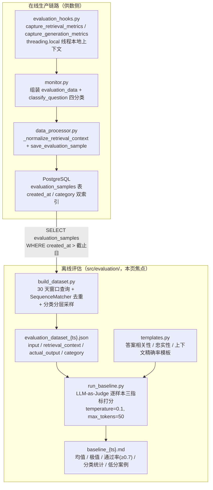
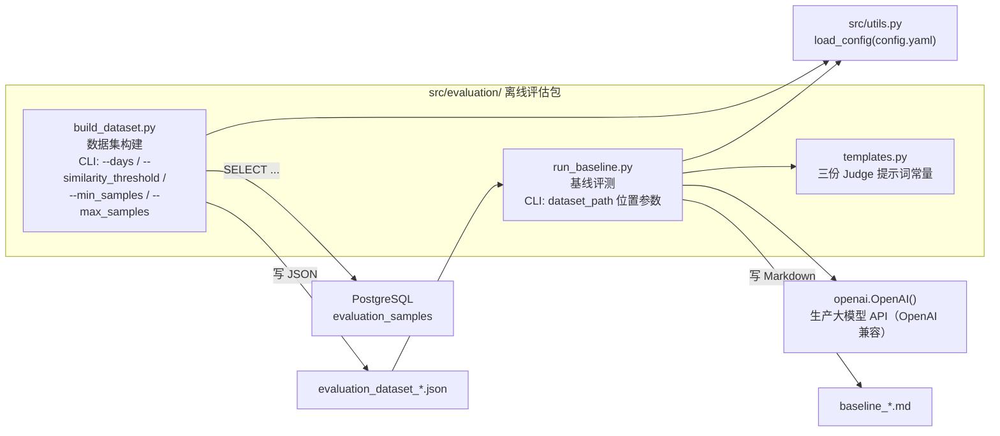
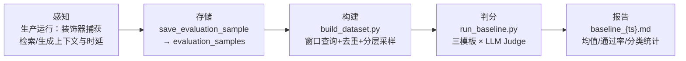

# 离线评估：数据集构建与质量基线

> **难度**：Intermediate ｜ **章节**：可观测性与评估
> **核心文件**：`src/evaluation/build_dataset.py` · `src/evaluation/run_baseline.py` · `src/evaluation/templates.py`
> **上游供数**：`src/ForumBot/evaluation_hooks.py` · `src/ForumBot/data_processor.py::save_evaluation_sample`

---

## 1. 项目定位与核心价值

`forum-reply-robot` 的常规问答链路本质上是一条 **RAG（检索增强生成）生产管线**：问题摘要 → 站内搜索 + LightRAG 文档检索 → 大模型生成回答 → 相关性/质量校验 → 发帖。生产侧虽然已经有 `check_answer_relevance` / `check_answer_quality` 两道**在线闸门**，但它们只回答"这一条回答能不能发出去"这一**布尔级**问题，回答不了三个更深层的质量问题：**检索到的上下文到底对回答有多大贡献**（检索是否精准）、**生成的回答是否忠实于检索上下文**（有没有编造）、**回答是否真正贴合用户问题**（是否答非所问）。在线校验的另一个结构性盲区是：被闸门拦截、从未发布到论坛的回答，恰恰是最值得分析的"错样本"，而它们在生产日志中往往一闪而过、没有沉淀。`src/evaluation/` 这个离线评估包就是为了补齐这两块拼图而生的——它把**生产流量中每一次检索/生成行为本身**沉淀为可回放的评估样本，再用一套零额外依赖的 **LLM-as-Judge** 基线打分器，把"回答质量"从布尔判断升级为可量化、可回归、可分门类的连续指标。

该模块的核心价值可以拆成三点。**其一，"零埋点"的评估数据来源**：生产链路在检索节点（`forum_client._get_response_data`）与生成节点（`ai_processor.call_large_model`）上各挂了一个装饰器（`capture_retrieval_metrics` / `capture_generation_metrics`），用 `threading.local` 把"这次检索检索到了什么、耗时多少""这次生成产出了什么、耗时多少"自动写入线程本地上下文；`monitor.py` 处理完每个帖子后把上下文取出，连同 Token 用量、问题分类一起由 `save_evaluation_sample` 落库到 `evaluation_samples` 表。评估数据是**生产行为的副产品**，不需要为评估单独造数据或加埋点——这是"可观测性反哺评估"这一设计哲学的落地。**其二，轻量级 LLM-as-Judge 基线**：`run_baseline.py` 复用生产大模型（同一份 `api.model_name` / `base_url`），通过三份精心设计的提示词模板分别对**答案相关性、忠实性、上下文精确率**三个 RAG 经典维度打分，无需引入 RAGAS 等重型评估框架，`requirements.txt` 中零新增依赖。**其三，分类分层与可复现性**：数据集构建按 `classify_question` 的四分类（技术问题/使用问题/社区规则/其他）做**分层采样**（每类下限保底、上限封顶），用 `SequenceMatcher` 相似度去重；数据集与评测报告都带时间戳落盘为 JSON/Markdown，使"换模型前 vs 换模型后"的回归对比成为可能。

Sources: [build_dataset.py](src/evaluation/build_dataset.py#L14-L122), [run_baseline.py](src/evaluation/run_baseline.py#L55-L220), [templates.py](src/evaluation/templates.py#L1-L38), [evaluation_hooks.py](src/ForumBot/evaluation_hooks.py#L6-L52), [monitor.py](src/ForumBot/monitor.py#L386-L529), [data_processor.py](src/ForumBot/data_processor.py#L1195-L1244)

---

## 2. 架构设计与模块划分

### 2.1 端到端评估闭环：从生产行为到质量基线

评估体系横跨"在线生产"与"离线评估"两个时区。在线侧，`evaluation_hooks` 的装饰器挂在两个热点方法上，把检索上下文、检索/生成时延、生成输出写入线程本地；`monitor.py` 在每条回答（无论是否通过校验门）处理完后的统一落点组装 `evaluation_data` 并调用 `save_evaluation_sample`；`DataProcessor` 负责把归一化后的检索上下文以 `JSONB` 形态存入 `evaluation_samples` 表（`created_at` 与 `category` 双索引）。离线侧，`build_dataset.py` 独立以 `psycopg2.connect` 直连数据库（**刻意绕过 `DataProcessor` 门面**，使评估工具与服务运行时解耦），按近 N 天窗口读取样本 → 相似度去重 → 分类分层采样 → 输出带时间戳的 JSON 数据集；`run_baseline.py` 消费该数据集，用 `templates.py` 的三份提示词驱动 LLM Judge 逐样本三连打分，最终聚合成 Markdown 基线报告。



**逐模块职责拆解：**

- **采集钩子层（evaluation_hooks.py）**：`_evaluation_context = threading.local()` 是线程隔离的上下文容器。`capture_retrieval_metrics` 包装 `forum_client._get_response_data`（返回 `(related_docs, data)` 二元组），成功时把 `retrieval_context / retrieval_latency / retrieval_data` 写入上下文；`capture_generation_metrics` 包装 `ai_processor.call_large_model`，捕获 `actual_output / generation_latency`。两个装饰器都遵循**失败不污染上下文**的纪律——异常时先将字段置 `None` 再按各自语义处理：检索装饰器会**再次调用原函数**（利用 `_get_response_data` 内部吞掉请求异常、返回 `(None, None)` 的特性，保证调用方总能拿到二元组，代价是异常路径下的一次重复请求）；生成装饰器则直接 `raise` 让上层走大模型失败降级逻辑。`tests/test_evaluation_hooks.py` 的 `test_thread_isolation` 专门验证了多线程下上下文互不串扰。
- **编排组装层（monitor.py）**：处理链路的三个出口（答案不相关、答案不合格、正常回复）都会先 `get_evaluation_context()` + `getattr(ctx, field, default)` 兜底取值，再 `classify_question(title, user_question)` 打分类标签，最后 `save_evaluation_sample` 落库。**关键设计**：被相关性/质量闸门拦截、从未发布的回答同样落库为样本——这让离线评估可以回看"被拦下的错答案"，为调校校验阈值提供证据。所有评估落库动作包在 `try/except` 中，失败仅记 `logger.warning`，延续"评估绝不能拖垮回复主链路"的逐帖容错哲学。
- **落库实现层（data_processor.py）**：`evaluation_samples` 表结构在 `create_tables()` 中与其他八张表一同幂等创建；`_normalize_retrieval_context` 把 dict/list/str 统一归一为**字符串列表**再 `json.dumps(ensure_ascii=False)` 写入 `JSONB` 列（空上下文写 `NULL`）；`save_evaluation_sample` 采用"按需建连、`finally` 关连、异常回滚"的短连接纪律。
- **数据集构建层（build_dataset.py）**：独立 CLI 脚本，`sys.path.insert` 后 `from utils import load_config` 读取数据库配置，直接 `psycopg2.connect` 查询近 N 天样本。去重采用 `difflib.SequenceMatcher` 的 `ratio()`（O(n²) 两两比对，阈值默认 0.9）；分层采样按 `min_samples` 保底、`max_samples` 封顶，`random.sample` 无放回抽取；`retrieval_context` 从库中读回时按 dict/str/list 三种形态还原。输出 `evaluation_dataset_{时间戳}.json`（`ensure_ascii=False` 保证中文可读）。
- **基线评测层（run_baseline.py）**：对每个样本依次构造三份 Judge 提示词（`templates.py`），`llm_judge` 以 `temperature=0.1`（低方差）、`max_tokens=50`（只许输出数字）调用生产模型，`extract_score` 用正则 `(\d+\.?\d*)` 抽取首个数字并做 **0-10 分制 → 0-1 分制**归一（>1.0 则除以 10）、[0,1] 截断、解析失败默认 0.5。聚合后输出报告：三指标各自的均值/最低/最高/通过率（阈值 0.7）、分类别均值、以及答案相关性 < 0.5 的典型低分案例。
- **提示词模板层（templates.py）**：三份模板采用统一的"Role / Background / Goals / OutputFormat"结构化风格，强制 Judge 只输出一个 0-1 数字；`{input}`、`{actual_output}`、`{retrieval_context}` 为格式化占位符，由 `run_baseline.py` 注入。

Sources: [evaluation_hooks.py](src/ForumBot/evaluation_hooks.py#L6-L52), [monitor.py](src/ForumBot/monitor.py#L386-L529), [data_processor.py](src/ForumBot/data_processor.py#L667-L691), [data_processor.py](src/ForumBot/data_processor.py#L1185-L1244), [build_dataset.py](src/evaluation/build_dataset.py#L14-L122), [run_baseline.py](src/evaluation/run_baseline.py#L18-L220), [templates.py](src/evaluation/templates.py#L1-L38)

### 2.2 离线评估包内部依赖拓扑

`src/evaluation/` 是一个**自包含、可独立运行**的包：`__init__.py` 为空（命名空间标记），三个模块之间只存在 `run_baseline.py → templates.py` 一条包内依赖；包外依赖被刻意压到最小——`utils.load_config`（配置读取）、`psycopg2`（直连库）、`openai`（Judge 调用）。这种"薄依赖 + CLI 入口"的形态让评估可以在任意时刻、任意机器上对历史样本重放。



**两个值得注意的架构取舍：**

1. **数据集构建绕过 `DataProcessor` 门面直连数据库**。`build_dataset.py` 没有走 `DataProcessor`（那需要先实例化一个绑定业务配置的对象），而是 `sys.path.insert` 后直接 `from utils import load_config` 拿 `config['database']` 建连。这让评估工具成为与业务运行时**零耦合**的只读消费者——`13-postgresql-storage.md` 将其描述为"写 → 存 → 读 → 评估"闭环的最末端。代价是：查询 SQL 与表结构在 `build_dataset.py` 与 `data_processor.py` 两处各写了一份（`evaluation_samples` 列名必须手工保持一致）。
2. **Judge 复用生产模型而非独立裁判模型**。`run_baseline.py` 从 `config['api']` 取 `model_name` / `base_url` / `api_key` 构造 `OpenAI` 客户端——也就是说"作答者"与"评分者"是同一个模型。这在零额外成本的同时引入了**自我评估偏差**的隐患（同模型更倾向于认可同类输出），属于典型的"轻量基线"取舍；若需要更严格的裁判，可把 `config['api']` 指向更强模型。

Sources: [build_dataset.py](src/evaluation/build_dataset.py#L1-L57), [build_dataset.py](src/evaluation/build_dataset.py#L125-L142), [run_baseline.py](src/evaluation/run_baseline.py#L55-L77), [run_baseline.py](src/evaluation/run_baseline.py#L223-L233), [__init__.py](src/evaluation/__init__.py)

---

## 3. 技术栈与核心工作流

### 3.1 技术栈清单

| 层次 | 技术/依赖 | 用途 | 版本约束 |
|------|-----------|------|----------|
| 语言/运行时 | Python 3.9 | 全仓统一运行时 | Docker `python:3.9-slim` |
| LLM 客户端 | `openai` | Judge 打分（OpenAI 兼容接口，指向生产模型） | `==1.109.1` |
| 数据库 | `psycopg2-binary` | 数据集构建直连 PostgreSQL | `>= 2.9` |
| 配置 | `PyYAML` + `src/utils.py::load_config` | 读取 `config/config.yaml`（database / api 段） | `==6.0.2` |
| 文本相似度 | `difflib.SequenceMatcher`（标准库） | 数据集去重的 `ratio()` 计算 | 零依赖 |
| 输出 | `json` / `datetime`（标准库） | 时间戳数据集与报告落盘 | 零依赖 |

> 设计亮点：**整个离线评估零新增第三方依赖**。三个 RAG 指标由"提示词模板 + 生产 LLM"手工实现，刻意不引入 RAGAS 之类的重型评估库——这正是 `requirements.txt` 中找不到任何评估框架的原因。

Sources: [requirements.txt](requirements.txt#L1-L8), [build_dataset.py](src/evaluation/build_dataset.py#L1-L7), [run_baseline.py](src/evaluation/run_baseline.py#L1-L15)

### 3.2 核心工作流：感知 → 存储 → 构建 → 判分 → 报告

整条评估流水线可抽象为五段式主链路，与在线 RAG 管线在"检索/生成"两个节点咬合：



**核心函数在流程中的角色：**

| 阶段 | 核心函数/对象 | 文件位置 | 在流程中的职责 |
|------|--------------|----------|----------------|
| 感知 | `capture_retrieval_metrics` / `capture_generation_metrics` | `evaluation_hooks.py#L13-L52` | 装饰生产热点方法，把上下文与延迟写入 `threading.local` |
| 感知 | `classify_question(title, question)` | `evaluation_hooks.py#L55-L67` | 关键词规则四分类，为分层采样与分类统计提供标签 |
| 存储 | `_normalize_retrieval_context` | `data_processor.py#L1185-L1193` | dict/list/str → 字符串列表，供 JSONB 序列化 |
| 存储 | `save_evaluation_sample(...)` | `data_processor.py#L1195-L1244` | 写入 `evaluation_samples`（含时延/Token/分类），异常回滚 |
| 构建 | `build_evaluation_dataset(...)` | `build_dataset.py#L14-L122` | 窗口查询 → 去重 → 分层采样 → 写 JSON 数据集 |
| 构建 | `similar(a, b)` | `build_dataset.py#L10-L11` | `SequenceMatcher` 相似度，去重判据 |
| 判分 | `normalize_retrieval_context(...)` | `run_baseline.py#L45-L52` | 数据集侧把上下文还原为字符串列表（支持嵌套 dict） |
| 判分 | `llm_judge(client, model, prompt)` | `run_baseline.py#L31-L42` | `temperature=0.1` + `max_tokens=50` 单次打分，失败返回 `None` |
| 判分 | `extract_score(response_text)` | `run_baseline.py#L18-L28` | 正则抽数、0-10 分制归一、[0,1] 截断、失败默认 0.5 |
| 报告 | `run_baseline_evaluation(...)` | `run_baseline.py#L55-L220` | 聚合三指标统计 + 分类统计 + 低分案例，写 Markdown |

Sources: [evaluation_hooks.py](src/ForumBot/evaluation_hooks.py#L13-L67), [data_processor.py](src/ForumBot/data_processor.py#L1185-L1244), [build_dataset.py](src/evaluation/build_dataset.py#L10-L122), [run_baseline.py](src/evaluation/run_baseline.py#L18-L220)

---

## 4. 典型代码示例

### 4.1 采集钩子：零侵入地记录检索/生成行为

`capture_retrieval_metrics` 是整条评估数据链的源头。它用装饰器模式包裹检索函数，并把结果存入线程本地上下文——**不修改任何业务代码**即完成观测：

```python
def capture_retrieval_metrics(func):
    @functools.wraps(func)
    def wrapper(*args, **kwargs):
        start_time = time.time()
        try:
            related_docs, data = func(*args, **kwargs)
            latency = time.time() - start_time
            ctx = get_evaluation_context()
            ctx.retrieval_context = related_docs
            ctx.retrieval_latency = latency
            ctx.retrieval_data = data
            return related_docs, data
        except Exception as e:
            logger.warning(f"数据采集钩子异常(检索节点): {e}")
            ctx = get_evaluation_context()
            ctx.retrieval_context = None
            ctx.retrieval_latency = None
            ctx.retrieval_data = None
            return func(*args, **kwargs)  # 再次调用，依赖 _get_response_data 内部吞异常
    return wrapper
```

Sources: [evaluation_hooks.py](src/ForumBot/evaluation_hooks.py#L13-L32), [forum_client.py](src/ForumBot/forum_client.py#L166-L203)

### 4.2 样本落库：上下文归一化 + 幂等写入

`save_evaluation_sample` 负责把线程上下文中的观测值固化到 `evaluation_samples`。注意 `_normalize_retrieval_context` 先把各种形态的检索上下文统一为字符串列表，再以 `JSONB` 序列化入库：

```python
def _normalize_retrieval_context(self, retrieval_context):
    if not retrieval_context:
        return None
    if isinstance(retrieval_context, str):
        return [retrieval_context]
    if isinstance(retrieval_context, (dict, list)):
        items = retrieval_context.values() if isinstance(retrieval_context, dict) else retrieval_context
        return [str(item) for item in items]
    return None

# save_evaluation_sample 中：
normalized_context = self._normalize_retrieval_context(retrieval_context)
cursor.execute("""
    INSERT INTO evaluation_samples (
        topic_id, input, retrieval_context, actual_output,
        retrieval_latency, generation_latency,
        prompt_tokens, completion_tokens, category
    ) VALUES (%s, %s, %s, %s, %s, %s, %s, %s, %s)
""", (
    topic_id, input_text,
    json.dumps(normalized_context, ensure_ascii=False) if normalized_context is not None else None,
    actual_output, retrieval_latency, generation_latency,
    prompt_tokens, completion_tokens, category
))
conn.commit()
```

Sources: [data_processor.py](src/ForumBot/data_processor.py#L1185-L1238)

### 4.3 分数抽取：把 LLM 输出归一为 0-1

`extract_score` 是本评估方案"轻量"的缩影——不依赖结构化输出解析，只靠一行正则 + 分制归一 + 截断兜底：

```python
def extract_score(response_text):
    try:
        match = re.search(r'(\d+\.?\d*)', response_text)
        if match:
            score = float(match.group(1))
            if score > 1.0:
                score = score / 10.0          # 兼容 0-10 分制
            return max(0.0, min(1.0, score))  # 截断到 [0,1]
    except Exception:
        pass
    return 0.5                                 # 解析失败的中立默认值
```

`tests/test_evaluation_run_baseline.py` 锁定其边界：`"8" → 0.8`（整数分制归一）、`"15" → 1.0`（越界截断）、`"invalid" → 0.5`（失败默认）、`"评分是 0.9" → 0.9`（文本包裹抽取）。

Sources: [run_baseline.py](src/evaluation/run_baseline.py#L18-L28), [test_evaluation_run_baseline.py](tests/test_evaluation_run_baseline.py#L247-L276)

### 4.4 数据集构建：去重 + 分层采样核心逻辑

```python
for cat, samples in categories.items():
    if len(samples) < min_samples_per_category:
        final_dataset.extend(samples)          # 样本不足：全量保留
    else:
        sampled_count = min(len(samples), max_samples_per_category)
        sampled = random.sample(samples, sampled_count)  # 每类封顶采样
        final_dataset.extend(sampled)
```

去重发生在分类之前：用 `SequenceMatcher` 与已见输入两两比对（默认阈值 0.9），重复输入直接丢弃；`retrieval_context` 按 dict/str/其他三种形态还原为列表。`tests/test_evaluation_build_dataset.py` 用三条 mock 数据断言去重后数据集长度 ≤ 2，并验证 `similar("Question A","Question A")==1.0`、相似文本落在 `0.8~1.0` 区间。

Sources: [build_dataset.py](src/evaluation/build_dataset.py#L63-L115), [test_evaluation_build_dataset.py](tests/test_evaluation_build_dataset.py#L55-L96), [test_evaluation_build_dataset.py](tests/test_evaluation_build_dataset.py#L124-L134)

---

## 5. 学习与探索建议

**初探路径（先跑通"感知 → 评估"闭环）：**

1. 读 `tests/test_evaluation_hooks.py` 的 `test_thread_isolation` 与两个异常用例——**装饰器的契约比注释更精确**：成功写入上下文、异常置 `None`、检索装饰器异常路径会二次调用原函数。这是理解"零埋点采集"的关键一步。
2. 在 `tests/test_evaluation_run_baseline.py` 中按 `TestExtractScore → TestNormalizeRetrievalContext → TestLLMJudge → TestRunBaselineEvaluation` 顺序读，把 `extract_score` 的边界行为、上下文归一化的 11 种形态、LLM 失败降级（报告出现"无有效评分"）全部锚定。
3. 用 mock 数据集实际执行一次 `run_baseline_evaluation`（`test_run_baseline_evaluation_success` 就是最小可运行样例），观察报告四个章节（三指标 + 分类统计）如何生成。

**攻坚路径（深入设计哲学与局限）：**

1. 沿 **`evaluation_hooks` 装饰器 → `monitor.py` 三处组装点（L386/L432/L502）→ `save_evaluation_sample` → `evaluation_samples` 表 → `build_dataset.py`** 追完整条数据链，重点思考：**为什么被校验闸门拒绝的回答也要落库**？这为"调校相关性/质量阈值"提供了什么证据价值？
2. 对比 `data_processor._normalize_retrieval_context` 与 `run_baseline.normalize_retrieval_context` 的差异（前者空值写 `NULL`、后者空值给 `[]` 并在提示词中显示"无检索上下文"），理解**存储侧与评估侧的归一化契约为何不能完全共享**。
3. 审视三处已知局限并尝试改进：`build_dataset` 的 O(n²) 去重在万级样本下的成本；`extract_score` 对"Judge 输出 0.5 分但实际想表达拒绝"无法区分；低分案例分析只取 `dataset[:10]` 的前 10 个样本（`run_baseline.py#L203`），大样本下覆盖不足。这些都是现成的进阶练习题。

**推荐阅读顺序表：**

| 优先级 | 文档/源码 | 目的 |
|---|---|---|
| P0 | `tests/test_evaluation_run_baseline.py` | 用测试锚定 Judge 打分与归一化契约 |
| P0 | `tests/test_evaluation_hooks.py` | 理解采集装饰器的线程隔离与异常语义 |
| P1 | [13-postgresql-storage.md](.open-zread/wiki/数据持久化/13-postgresql-storage.md) | `evaluation_samples` 表在九张业务表中的定位与索引设计 |
| P1 | `src/ForumBot/monitor.py#L386-L529` | 评估数据在回复链路三个出口的组装与落库时机 |
| P2 | [6-ai-answer-pipeline.md](.open-zread/wiki/论坛问答自动化/6-ai-answer-pipeline.md) | 上游 RAG 管线如何产出检索上下文与生成输出 |
| P2 | [18-observability.md](.open-zread/wiki/可观测性与评估/18-observability.md) | `evaluation_hooks` 与 Prometheus/日志共同构成的可观测面 |

---

## 🔗 关联模块与上下游

`src/evaluation/` 属于局部模块（形态 C：离线评估），与其存在**直接调用/数据依赖**关系的文件极为克制，仅下列三者：

- **[monitor.py](src/ForumBot/monitor.py#L386-L529)** —— 上游数据组装方。`ForumMonitor` 在处理链路的三个出口（不相关/不合格/正常回复）读取 `evaluation_hooks` 线程上下文、调用 `classify_question` 与 `save_evaluation_sample`，是评估样本的唯一生产触发点；理解"哪些回答会被落库"必须回到此文件。
- **[data_processor.py](src/ForumBot/data_processor.py#L1185-L1244)** —— 落库实现方。`save_evaluation_sample` 与 `_normalize_retrieval_context` 定义了 `evaluation_samples` 表的写入契约（列名、JSONB 序列化、空值语义），`build_dataset.py` 的查询 SQL 必须与其手工对齐。
- **[evaluation_hooks.py](src/ForumBot/evaluation_hooks.py#L6-L52)** —— 采集源头。`capture_retrieval_metrics` / `capture_generation_metrics` / `classify_question` 三个函数决定了"能评估到什么"——任何想扩展评估维度的改动（如新增捕获字段）都应从这里开始。
