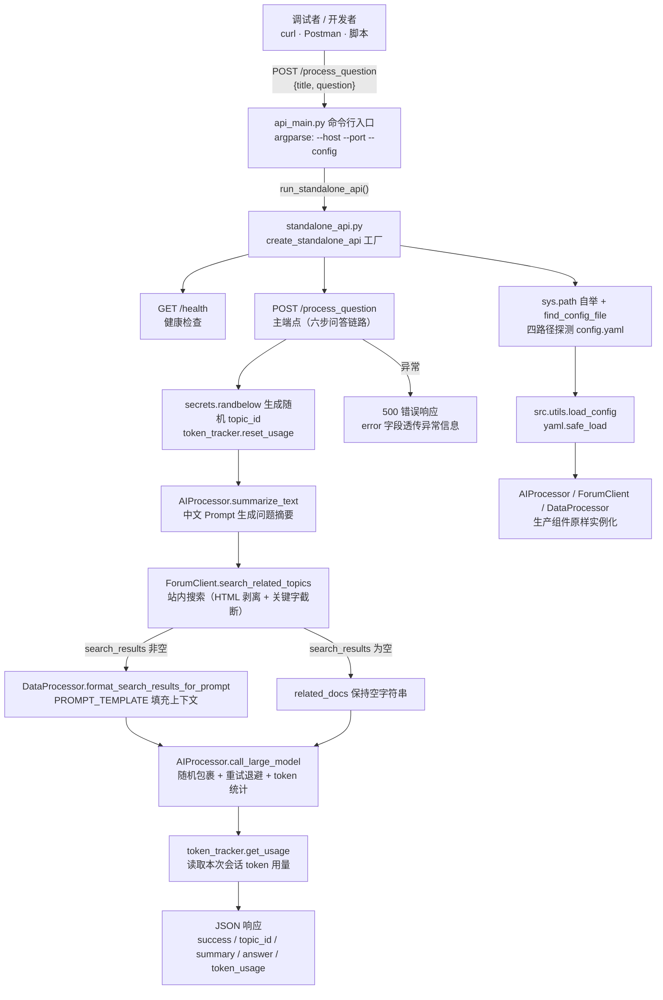
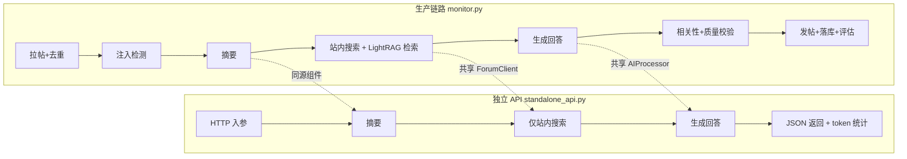
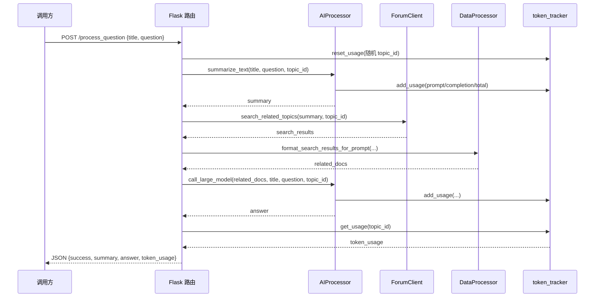

# 独立调试 API 服务

> 本文剖析 `src/ForumBot/standalone_api.py` 与 `src/ForumBot/api_main.py` 两个文件构成的**独立调试 API 服务**：一个不依赖论坛轮询、不落库、不发帖的"最小问答链路"HTTP 服务。它的价值不在于生产流量，而在于把整条 RAG 问答管线的**核心推理段**（摘要 → 站内搜索 → 大模型生成 → Token 统计）暴露成可手工调用的 HTTP 接口，让开发者绕开常驻服务的复杂副作用，单独验证与调优大模型行为。

---

## 1. 项目定位与核心价值

### 1.1 诞生背景与痛点

`forum-reply-robot` 的生产形态是一个**常驻守护服务**（`main.py`）：主线程跑 Flask 探针，后台线程负责论坛轮询、去重、LightRAG 初始化与定时增量更新。它的核心问答链路（`ForumMonitor._process_new_topics`）被层层包裹——拉帖列表、数据库去重、提示词注入检测、三层安全校验、发帖、落库、评估样本收集……这些环节让"模型到底答得好不好"这一最基本的问题变得难以独立回答：每一次完整验证都必须等待轮询周期、依赖论坛上有新帖、还要承受发帖与落库的副作用。

`standalone_api.py` 正是为解决这个痛点而生。它把生产链路中**从"拿到标题 + 问题文本"到"拿到模型回答"的那一段**单独抽出来，做成一个绑定 `127.0.0.1` 的 Flask 服务。开发者可以随时用一条 `curl` 命令向它投喂任意标题与问题，立刻获得摘要、站内搜索结果、模型回答与 Token 消耗——整个过程**零写操作**（不写 PostgreSQL、不发论坛帖子、不写 CSV），唯一的"状态"是进程内存中的 Token 计数器。这使大模型 Prompt 调优、摘要长度验证、搜索召回效果检查变成了可重复、可脚本化的实验过程。

与同属"周边工具"的 `src/external_api_app.py`（RAG 检索 API 的独立调试版，暴露 `/api/v1/rag/*`）相比，二者的分工清晰：`external_api_app.py` 调试的是**检索侧**（LightRAG 查询 + OIDC 鉴权 + 限流），`standalone_api.py` 调试的是**生成侧**（摘要 + 站内搜索 + 回答生成）。生产环境中两者都被吸收进 `main.py` 的 5000 端口，独立脚本仅保留本地开发价值。

Sources: [standalone_api.py](src/ForumBot/standalone_api.py#L1-L18), [api_main.py](src/ForumBot/api_main.py#L14-L33), [external_api_app.py](src/external_api_app.py#L12-L17), [main.py](main.py#L392-L421), [monitor.py](src/ForumBot/monitor.py#L292-L534)

### 1.2 核心特性展开

- **无副作用的最小问答链路**：`/process_question` 只做六步——校验入参、生成随机 `topic_id` 并重置 Token 统计、`AIProcessor.summarize_text` 生成摘要、`ForumClient.search_related_topics` 站内搜索、`AIProcessor.call_large_model` 生成回答、`token_tracker.get_usage` 汇总 Token 用量，最后整体以 JSON 返回。相比生产链路，它**刻意省略**了注入检测、LightRAG 文档检索、相关性/质量校验、发帖与落库，把调试关注点收敛到"输入 → 输出"本身。

- **完整复用生产组件**：三个核心组件（`AIProcessor`、`ForumClient`、`DataProcessor`）全部从 `src.ForumBot` 原样导入、原样实例化，不做任何 stub 或 mock。这保证调试环境与生产环境共享同一套 Prompt 模板（`PROMPT_TEMPLATE`）、同一个模型回退列表（`model_list = [model2_name, model_name]`）、同一种随机字符串防注入包裹技巧——**"调出来的效果就是线上效果"**是这套设计的第一原则。

- **随机 `topic_id` 驱动的会话隔离**：生产链路中 `topic_id` 来自论坛真实帖子 ID；独立 API 用 `secrets.randbelow(90000000) + 10000000` 生成 8 位随机整数模拟之。它不参与任何存储，只作为 `token_tracker` 的统计键与日志里的会话标识，让每次请求的 Token 消耗可独立追踪。

- **可参数化的命令行入口**：`api_main.py` 提供 `--host`（默认 `127.0.0.1`）、`--port`（默认 `5085`，刻意避开生产端口 5000）、`--config`（默认自动探测）三个参数，并捕获 `KeyboardInterrupt` 优雅退出，其余异常记录后结束进程。启动/停止都无需触碰生产进程。

- **配置多路径探测与路径自举**：`standalone_api.py` 在导入期就把项目根目录 `insert` 进 `sys.path`，`api_main.py` 又额外插入脚本所在目录与 `src` 目录；`find_config_file()` 则依次探测四个候选路径。这使得无论从仓库根目录、`src/ForumBot/` 还是任意工作目录启动，脚本都能定位到依赖包与 `config/config.yaml`，把"工具脚本的易用性"做到极致。

Sources: [standalone_api.py](src/ForumBot/standalone_api.py#L21-L38), [standalone_api.py](src/ForumBot/standalone_api.py#L62-L137), [ai_processor.py](src/ForumBot/ai_processor.py#L10-L20), [data_processor.py](src/ForumBot/data_processor.py#L1161-L1183)

### 1.3 设计哲学

> 生产链路解决"**把事做完且不出错**"，调试工具解决"**把事看透且可重复**"。独立 API 的全部取舍都围绕这两句展开。

- **调试最小化（Debug Minimalism）**：宁可少做，不可多做。检索、校验、发帖、落库这些"生产责任"全部砍掉，只保留不可再分的推理核心。这既降低了调试时的外部依赖（调试大模型回答不需要 LightRAG 在线），也把"回答不好"的归因空间从整条流水线缩小到"摘要质量 / 搜索召回 / 模型生成"三个环节。
- **无副作用优先（Side-Effect Free）**：进程内 `token_tracker` 字典是唯一可变状态，重启即清零；不触碰数据库连接、不发送论坛请求之外的任何写请求。这使调试过程天然可回放、可并发（不同 `topic_id` 互不干扰）。
- **同构复用而非另起炉灶（Reuse over Reimplement）**：整份代码几乎找不到一行重复的业务逻辑——它完全是由生产组件"装配"出来的薄壳（app 工厂 + 两个路由 + 一层参数化）。这暗示着一个架构判断：**问答核心链路天然适合从轮询驱动的批处理中剥离成请求驱动的服务形态**，独立 API 正是这一形态的最小证明。

Sources: [standalone_api.py](src/ForumBot/standalone_api.py#L41-L139), [token_tracker.py](src/ForumBot/token_tracker.py#L6-L60), [monitor.py](src/ForumBot/monitor.py#L292-L534)

---

## 2. 架构设计与模块划分

### 2.1 总体架构图

独立 API 服务由两个文件构成：`api_main.py`（薄 CLI 壳）→ `standalone_api.py`（Flask 工厂 + 两个端点），端点内部按顺序装配生产组件。下图展示完整拓扑：



Sources: [standalone_api.py](src/ForumBot/standalone_api.py#L41-L55), [standalone_api.py](src/ForumBot/standalone_api.py#L57-L60), [standalone_api.py](src/ForumBot/standalone_api.py#L62-L137), [api_main.py](src/ForumBot/api_main.py#L14-L33)

### 2.2 逐层详解

**CLI 入口层（`api_main.py`）**：`main()` 用 `argparse` 声明三个参数并给默认值，随后将参数原样透传给 `run_standalone_api`。它的特殊之处在于导入方式——`from standalone_api import run_standalone_api` 是**顶层模块导入**而非 `from src.ForumBot.standalone_api import ...`，因此必须依赖 `sys.path.insert(0, current_dir)` 把 `api_main.py` 所在目录（即 `src/ForumBot/`）暴露给解释器；同一文件又额外 `insert` 了 `current_dir/src`，构成"双保险"路径注入。`try/except` 只捕获 `KeyboardInterrupt` 与兜底 `Exception`，异常时不尝试任何恢复逻辑，符合"调试工具快速失败"的定位。

**App 工厂层（`standalone_api.py::create_standalone_api`）**：以 `config_file` 为唯一入参的 Flask 应用工厂。若未显式传入配置，调用 `find_config_file()` 从 `project_root/config/config.yaml`、`cwd/config/config.yaml`、`config/config.yaml`、`../config/config.yaml` 四个候选路径中探测，全部缺失则回退到项目根下的默认路径。配置加载后立即实例化 `AIProcessor`、`ForumClient`、`DataProcessor` 三个组件——注意这里**没有**调用 `DataProcessor.create_tables()`，也没有初始化数据库连接池，进一步印证"零持久化副作用"的设计。工厂返回的是完整可运行的 Flask app，由 `run_standalone_api` 或外部调用方决定监听地址。

**健康检查端点（`/health`）**：恒返回 `{'status': 'healthy', 'service': 'ForumBot Standalone API'}`，不检查任何组件存活状态。这与生产 `main.py` 的 `/health`（依赖 `MonitorThread` 存活）形成鲜明对比——调试服务没有需要探活的常驻后台线程，健康检查只服务于"服务是否起来"这一朴素目的。

**主处理端点（`/process_question`）**：这是整份代码的灵魂。其执行序列在 2.3 节详述。值得先点出的是它的**错误处理策略**：参数校验失败返回 `400` 并附中文错误文案；业务执行期任何异常都被捕获并返回 `500`，且把 `str(e)` 原样放入 `error` 字段——对调试者而言，异常详情比脱敏更重要。

**组件装配层（生产组件）**：`AIProcessor`（大模型封装，含主备双模型回退与 Token 统计收敛）、`ForumClient`（站内搜索 HTTP 客户端）、`DataProcessor`（`format_search_results_for_prompt` 负责把搜索结果拼进英文 `PROMPT_TEMPLATE`）、`token_tracker`（全局单例，按 `topic_id` 在内存中累计 `prompt_tokens` / `completion_tokens` / `total_tokens` / `model_calls`）。这四个组件与生产链路完全同源，是"调出的效果就是线上效果"的物理基础。

Sources: [api_main.py](src/ForumBot/api_main.py#L6-L12), [api_main.py](src/ForumBot/api_main.py#L14-L33), [standalone_api.py](src/ForumBot/standalone_api.py#L21-L38), [standalone_api.py](src/ForumBot/standalone_api.py#L45-L55), [standalone_api.py](src/ForumBot/standalone_api.py#L57-L60), [utils.py](src/utils.py#L121-L131), [token_tracker.py](src/ForumBot/token_tracker.py#L6-L60)

### 2.3 与生产链路的同构与分化

`standalone_api.py` 本质上是 `monitor.py::_process_new_topics` 的**降维复刻**。逐环节对比能清晰看到"保留什么、砍掉什么"：

| 处理环节 | 生产链路（`_process_new_topics`） | 独立 API（`/process_question`） | 差异动机 |
|---------|-------------------------------|-------------------------------|---------|
| 输入来源 | 轮询拉帖 + DB 去重 | HTTP JSON `{title, question}` | 调试需要即时、任意的输入 |
| `topic_id` | 论坛真实帖子 ID | `secrets` 随机 8 位整数 | 仅作 Token 统计键，无需真实 |
| 提示词注入检测 | ✅ `check_prompt_injection` | ❌ 省略 | 调试阶段无需安全拦截 |
| 问题摘要 | ✅ `summarize_text` | ✅ `summarize_text` | 核心环节，保留 |
| 站内搜索 | ✅ `search_related_topics` | ✅ `search_related_topics` | 核心环节，保留 |
| LightRAG 文档检索 | ✅ `retrieve_documents_for_topic` | ❌ 省略 | 检索属"检索侧"，由 `external_api_app.py` 覆盖 |
| 上下文格式化 | ✅ 正确解包 `(formatted_prompt, context_data)` | ⚠️ 未解包元组（见 3.5 节） | 实现差异，非刻意设计 |
| 相关性/质量校验 | ✅ 两道校验，失败不发帖 | ❌ 省略 | 调试关注生成本身 |
| 回答提示语 | 前缀 + `[details]` 折叠块 | 仅前缀"答案内容由AI生成，仅供参考" | 调试无需完整回复排版 |
| 发帖 | ✅ `reply_to_topic` → `POST /posts.json` | ❌ 省略 | 无副作用原则 |
| 落库/CSV/评估 | ✅ 全套持久化 | ❌ 仅内存 Token 统计 | 无副作用原则 |



这张对比揭示了一个重要事实：**独立 API 不是生产链路的替代品，而是它的"测试探针"**。它砍掉的全部是"写路径"与"防御路径"，保留的全部是"推理路径"。理解了这个分化，就理解了整个项目为什么在监控服务之外还需要这样一个旁路工具。

Sources: [monitor.py](src/ForumBot/monitor.py#L292-L534), [monitor.py](src/ForumBot/monitor.py#L305-L350), [monitor.py](src/ForumBot/monitor.py#L369-L470), [monitor.py](src/ForumBot/monitor.py#L485-L500), [standalone_api.py](src/ForumBot/standalone_api.py#L62-L137)

---

## 3. 技术栈与核心工作流

### 3.1 技术栈一览

| 领域 | 选型 | 在本服务中的角色 |
|------|------|----------------|
| Web 框架 | `flask==3.1.3`（`werkzeug==3.1.6`） | `Flask(__name__)` 应用工厂 + 两个路由 |
| 大模型调用 | `openai==1.109.1` | `AIProcessor` 内部 `client.chat.completions.create`（OpenAI 兼容接口） |
| HTTP 客户端 | `requests==2.32.5` | `ForumClient.search_related_topics` 调站内搜索服务 |
| 配置解析 | `PyYAML==6.0.2` | `load_config` → `yaml.safe_load` |
| 随机安全 | `secrets`（标准库） | 随机 `topic_id` 生成 |
| 日志 | `logging.handlers.RotatingFileHandler` | `main_logger`，20MB 轮转 × 4 份 |

Sources: [requirements.txt](requirements.txt#L4-L8), [requirements.txt](requirements.txt#L16-L18), [ai_processor.py](src/ForumBot/ai_processor.py#L1-L20), [logging_config.py](src/ForumBot/logging_config.py#L7-L49)

### 3.2 核心函数/类职责表

| 函数/类 | 所在文件 | 在本服务中的职责 |
|--------|---------|-----------------|
| `api_main.main()` | `api_main.py` | CLI 入口：解析 `--host/--port/--config`，透传并启动服务，异常兜底 |
| `create_standalone_api()` | `standalone_api.py` | Flask 应用工厂：配置探测、组件装配、路由注册 |
| `process_question()` | `standalone_api.py` | 主端点：串起六步问答链路并返回 JSON |
| `find_config_file()` | `standalone_api.py` | 四路径配置探测，返回存在的 YAML 路径 |
| `run_standalone_api()` | `standalone_api.py` | 启动入口：`app.run(host, port, debug=False)` |
| `AIProcessor` | `ai_processor.py` | 摘要生成（`summarize_text`）与回答生成（`call_large_model`），内部收敛 Token 统计 |
| `ForumClient` | `forum_client.py` | `search_related_topics`：站内搜索、HTML 标签剥离、关键字截断 |
| `DataProcessor` | `data_processor.py` | `format_search_results_for_prompt`：把搜索结果填充进英文 `PROMPT_TEMPLATE` |
| `token_tracker`（全局单例） | `token_tracker.py` | 按 `topic_id` 内存累计 Token 用量与模型调用次数 |

Sources: [standalone_api.py](src/ForumBot/standalone_api.py#L41-L150), [api_main.py](src/ForumBot/api_main.py#L14-L36), [ai_processor.py](src/ForumBot/ai_processor.py#L10-L75), [ai_processor.py](src/ForumBot/ai_processor.py#L308-L356), [forum_client.py](src/ForumBot/forum_client.py#L84-L137), [data_processor.py](src/ForumBot/data_processor.py#L1161-L1183), [token_tracker.py](src/ForumBot/token_tracker.py#L6-L60)

### 3.3 主链路执行流程

`/process_question` 的执行序列是一条**单向管道**，每一环的输出是下一环的输入：

1. **入参校验**：`request.get_json()` 为空 → `400`；`question` 字段缺失 → `400`。`title` 允许为空（`data.get('title', '')`）。
2. **会话初始化**：`secrets.randbelow(90000000) + 10000000` 生成 8 位随机 `topic_id`，`token_tracker.reset_usage()` 清零该键的统计，为本次请求建立独立的 Token 记账。
3. **摘要生成**：`AIProcessor.summarize_text(title, question, topic_id)` 用中文"论坛问题总结专家" Prompt 让模型输出不超过 100 字符的一句话摘要；返回后在 `summarize_text` 内部把 `response.usage` 累加进 `token_tracker`。
4. **站内搜索**：`ForumClient.search_related_topics(summary, topic_id)` 把摘要作为关键字 POST 给搜索服务；内部先按 `max_keyword_length` 截断超长关键字，再对每条结果的 `title`/`textContent` 做 HTML 标签剥离；异常时返回空列表。
5. **上下文装配**：初始 `retrieval_result = {'topic_id': ..., 'related_docs': ''}`；若搜索结果非空，调用 `DataProcessor.format_search_results_for_prompt` 把结果序列化成 `-----Search Result-----` 包裹的 JSON 块并填入英文 `PROMPT_TEMPLATE`（内含 Role/Goal/Response Rules 约束）；若为空则保持空字符串。
6. **回答生成**：`AIProcessor.call_large_model(related_docs, title, question, topic_id)` 把装配好的上下文作为 system prompt，将 `title:question` 用随机字符串包裹后作为 user 输入，调用大模型；内置 `max_retries=3` 的指数退避重试（`time.sleep(2 ** attempt)`），并把每次调用的 Token 用量写入 `token_tracker`。
7. **提示语与统计**：回答前加"答案内容由AI生成，仅供参考："前缀；`token_tracker.get_usage(topic_id)` 取出 `prompt_tokens/completion_tokens/total_tokens/model_calls`。
8. **响应**：返回 `{success: True, topic_id, summary, answer, token_usage}`；任意环节抛异常 → 捕获并返回 `500 + {success: False, error: str(e)}`。



Sources: [standalone_api.py](src/ForumBot/standalone_api.py#L62-L137), [ai_processor.py](src/ForumBot/ai_processor.py#L22-L75), [ai_processor.py](src/ForumBot/ai_processor.py#L308-L356), [forum_client.py](src/ForumBot/forum_client.py#L84-L137), [token_tracker.py](src/ForumBot/token_tracker.py#L13-L51)

### 3.4 入口级代码示例

**启动方式一：直接运行脚本**（`api_main.py` 封装了 CLI 参数）：

```bash
# 从项目根目录启动，默认 127.0.0.1:5085，自动探测 config.yaml
python src/ForumBot/api_main.py

# 指定监听地址、端口与配置文件
python src/ForumBot/api_main.py --host 0.0.0.0 --port 9000 --config /path/to/config.yaml
```

**启动方式二：脚本内直接运行**（`standalone_api.py` 的 `__main__` 块）：

```bash
python src/ForumBot/standalone_api.py
```

**调用示例**（健康检查 + 问答）：

```bash
# 健康检查
curl http://127.0.0.1:5085/health

# 投喂一个问题
curl -X POST http://127.0.0.1:5085/process_question \
  -H "Content-Type: application/json" \
  -d '{"title": "LightRAG 检索超时如何排查", "question": "调用 query 接口总是 600 秒超时，应该从哪里开始排查？"}'
```

**工厂函数的骨架**（`standalone_api.py`，最能体现"薄壳装配"哲学）：

```python
def create_standalone_api(config_file=None):
    app = Flask(__name__)
    if config_file is None:
        config_file = find_config_file()
    # 三个生产组件原样装配，零 stub
    config = load_config(config_file)
    ai_processor = AIProcessor(config)
    forum_client = ForumClient(config)
    data_processor = DataProcessor(config)
    # 路由注册与 process_question 六步链路 ...
    return app

def run_standalone_api(host='127.0.0.1', port=5085, config_file='config/config.yaml'):
    app = create_standalone_api(config_file)
    app.run(host=host, port=port, debug=False)
```

Sources: [standalone_api.py](src/ForumBot/standalone_api.py#L41-L55), [standalone_api.py](src/ForumBot/standalone_api.py#L141-L150), [standalone_api.py](src/ForumBot/standalone_api.py#L148-L150), [api_main.py](src/ForumBot/api_main.py#L14-L36)

### 3.5 已知实现差异与调试陷阱

**`format_search_results_for_prompt` 的返回值未解包**。`data_processor.py` 中该方法的签名是返回**二元组** `(formatted_prompt, context_data)`——第一个元素是完整填充后的 `PROMPT_TEMPLATE`（含英文 Role/Goal/Response Rules 与上下文），第二个是纯上下文文本。生产链路在 `monitor.py` 中这样消费：

```python
retrieval_result['related_docs'], context_data = self.data_processor.format_search_results_for_prompt(
    retrieval_result, search_results
)
```

而独立 API 中是这样：

```python
retrieval_result['related_docs'] = data_processor.format_search_results_for_prompt(
    retrieval_result, search_results
)
```

后果是 `retrieval_result['related_docs']` 实际拿到的是一个**元组**而非字符串。由于 `call_large_model` 内部通过 `f"{text}\n为了模型安全起见..."` 拼接 system prompt，f-string 会把元组渲染成 `"('formatted_prompt', 'context_data')"` 形式的 Python repr 字符串。这不会导致崩溃（f-string 对任意对象都宽容），但意味着：**(a)** 调试环境发送给大模型的 system prompt 比生产环境多了一层 Python 元组括号与引号包装；**(b)** 若搜索结果为空，`related_docs` 是 `''`（元组仅在有搜索结果时出现），两条路径的行为不一致。调试时若观察到"有搜索结果时回答异常、无搜索结果时正常"，应优先怀疑此处。

**缺少 LightRAG 检索导致的上下文单薄**。独立 API 只做站内搜索、不做 `retrieve_documents_for_topic`，因此注入 `PROMPT_TEMPLATE` 的只有 `-----Search Result-----` 块，没有 `Entities(KG)` / `Relationships(KG)` / `Document Chunks(DC)` 三段。这意味着在此调试出的回答质量**代表"无知识库检索"的下限**，不能直接等同于生产链路的上限——生产链路中知识图谱与文档块的增益无法在此复现。若要复现完整检索上下文，应使用 `src/external_api_app.py` 或直接打生产 5000 端口。

Sources: [data_processor.py](src/ForumBot/data_processor.py#L1161-L1183), [monitor.py](src/ForumBot/monitor.py#L339-L341), [standalone_api.py](src/ForumBot/standalone_api.py#L92-L113), [ai_processor.py](src/ForumBot/ai_processor.py#L313-L319), [external_api_app.py](src/external_api_app.py#L29-L33)

---

## 4. 学习与探索建议

| 目标 | 推荐路径 | 说明 |
|------|---------|------|
| 跑通调试链路 | `api_main.py` → `standalone_api.py` | 先理解薄壳如何装配三个生产组件 |
| 深挖摘要环节 | `ai_processor.py::summarize_text`（L22-L75） | 中文 Prompt 结构、`max_length` 截断、Token 统计入口 |
| 深挖生成环节 | `ai_processor.py::call_large_model`（L308-L356） | 随机包裹防注入、指数退避重试、`@capture_generation_metrics` |
| 对比生产链路 | `monitor.py::_process_new_topics`（L292-L534） | 逐环节对比 2.3 节表格，理解"砍掉什么"背后的动机 |
| 理解上下文装配 | `data_processor.py::format_search_results_for_prompt` + `PROMPT_TEMPLATE` | 3.5 节元组陷阱的根源，顺带理解英文模板设计 |
| 理解 Token 记账 | `token_tracker.py` 全文 | 内存统计的生命周期：reset → add → get |
| 对照"检索侧"调试工具 | `src/external_api_app.py` | 另一个独立调试服务，与生成侧工具形成完整调试矩阵 |

Sources: [ai_processor.py](src/ForumBot/ai_processor.py#L22-L75), [ai_processor.py](src/ForumBot/ai_processor.py#L308-L356), [data_processor.py](src/ForumBot/data_processor.py#L27-L66), [data_processor.py](src/ForumBot/data_processor.py#L1161-L1183), [monitor.py](src/ForumBot/monitor.py#L292-L534), [token_tracker.py](src/ForumBot/token_tracker.py#L6-L60), [external_api_app.py](src/external_api_app.py#L12-L108)

---

## 🔗 关联模块与上下游

本页属于**局部模块（形态 B/C/D）**，`standalone_api.py` / `api_main.py` 与以下源码存在直接调用关系：

- **上游生产组件（被实例化并调用）**：`src/ForumBot/ai_processor.py`（`AIProcessor`，摘要与生成）、`src/ForumBot/forum_client.py`（`ForumClient`，站内搜索）、`src/ForumBot/data_processor.py`（`DataProcessor`，上下文装配）、`src/ForumBot/token_tracker.py`（Token 统计）、`src/utils.py`（`load_config`）。这些是理解本服务行为的上游依赖。
- **同源生产链路（被降维复刻）**：`src/ForumBot/monitor.py` 的 `_process_new_topics`——独立 API 的六步链路正是从这段代码剥离而来，`format_search_results_for_prompt` 的解包差异也源于此处。
- **平行的"检索侧"调试工具**：`src/external_api_app.py`——同属"周边工具"，覆盖 LightRAG 检索与鉴权限流侧，与本站的"生成侧"调试互补。
- **配置契约**：`config/config.yaml` 的 `api` / `search` 段是服务运行的唯一配置来源，缺失时 `find_config_file` 会回退到默认路径并因 `load_config` 返回 `{}` 而在组件初始化时报错。
