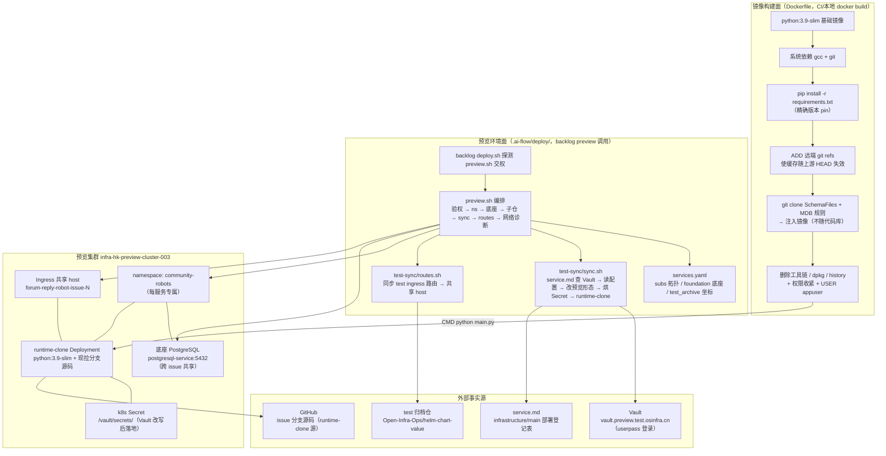
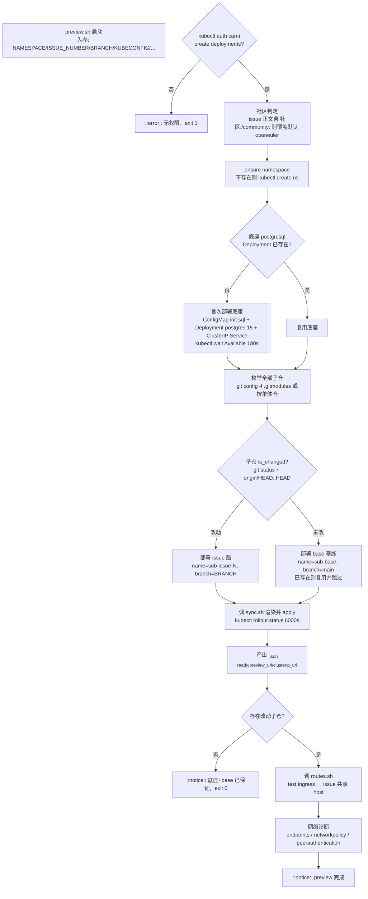

---
title: "容器化与预览环境部署"
slug: "21-container-deployment"
---

---

title: 容器化与预览环境部署
slug: 21-container-deployment
section: 周边工具与部署
difficulty: Intermediate
---

# 容器化与预览环境部署

## 1. 项目定位与核心价值

**forum-reply-robot** 是一个外部依赖极其密集的常驻服务：它要轮询 Discourse 风格论坛、调用 OpenAI 兼容的大模型 API、访问 LightRAG 知识库、读写 PostgreSQL、从 GitCode 拉取知识源与 Redfish Schema/MDB 规则文件。这类"胶水型"机器人一旦进入生产，它的可运行形态（镜像内容、启动顺序、配置来源、数据库地址）就与代码本身同等重要。本文档覆盖该项目的**两条交付/验证链路**：其一是根目录 `Dockerfile` 所定义的**容器镜像构建与加固**；其二是 `.ai-flow/deploy/` 目录下为 **backlog Workflow 的 preview（预览）阶段**准备的**独立预览环境编排脚本**。二者共同回答了同一个问题：这个"需要一大堆外部依赖才能跑起来"的机器人，如何被可复现地打包、安全地运行、并且在不污染测试/生产环境的前提下，为每次 issue 改动提供一个可点击访问的验收环境。

先看容器化的核心价值。`Dockerfile` 不是简单地把 `pip install -r requirements.txt` 塞进镜像，而是贯彻了三条设计哲学：

- **构建期做"重"事、运行期做"轻"事**：Redfish Schema 文件与 MDB 规则文件**刻意不进入代码仓库**（体积大、随上游演进），而是在镜像构建期通过 `git clone` 拉取并塞入镜像（[Dockerfile](Dockerfile#L77-L91)）；运行期应用只需 `python main.py` 一个命令。
- **最小攻击面 + 最小权限**：镜像基于 `python:3.9-slim`，安装完编译器后**立即删除 gcc/ld/binutils 等工具链**与 `dpkg` 包管理能力（[Dockerfile](Dockerfile#L35-L67)），并创建无 shell 的 `appuser`（uid/gid 1000）以非 root 运行（[Dockerfile](Dockerfile#L13-L14)）；`umask 0027`、关闭 shell history、目录权限收紧到 `700`、配置文件收紧到 `600`（[Dockerfile](Dockerfile#L17-L19)）。
- **配置即秘钥、用后即焚**：`main.py` 在启动时 `load_config()` 加载 `config/config.yaml` 后**立即 `delete_config_file()` 删除该文件**，防止明文凭据长期落盘（[main.py](main.py#L342-L346)）。镜像构建时把 `config/` 权限设为 `700`、文件设为 `600`，正是为配合这一"瞬时读取"模型。

再看预览环境的定位。`.ai-flow/deploy/` 是 opensourceways 开源基础设施（backlog Workflow）为每个仓库生成的部署钩子：当 backlog 的 `deploy.sh` 探测到本仓存在 `.ai-flow/deploy/preview.sh` 时，就把预览阶段交权给该脚本（[.ai-flow/deploy/README.md](.ai-flow/deploy/README.md#L3)）。它的设计目标不是"重新部署一个生产环境"，而是**用最小成本复刻一个"形似 test、实为隔离"的可验收环境**：同一个 issue 的多个改动子仓共享一个独立 namespace 与一个共享 host 域名（`forum-reply-robot-issue-<N>.preview.test.osinfra.cn`），数据库使用 namespace 内的**一次性底座 PostgreSQL**，配置来自 Vault 中的**真实 test 配置经改造后落地为 k8s Secret**（[.ai-flow/deploy/README.md](.ai-flow/deploy/README.md#L19-L24)）。最精妙的一点是**不构建镜像**：预览 pod 采用 runtime-clone 模式，容器启动时现场 `git clone` 该 issue 的真实 dev 分支源码、现场 `pip install`、现场 `python main.py`（[sync.sh](.ai-flow/deploy/test-sync/sync.sh#L186-L200)）。这使得预览环境既能忠实反映"这次改动"，又完全绕开了镜像仓库与 CI 构建链路，做到 issue 级隔离、分钟级拉起。

> **核心设计理念：测试形态是"源"，预览形态是"变形"。** 预览环境从不独立发明部署配置——它的全部输入（Vault path、namespace、镜像、路由）都从 `service.md` 与 test 归档仓库中"查表"而来，再套一层 test→preview 改写规则（DB 指向底座、域名替换、DEBUG 开关），本质上是**对真实部署形态的确定性投影**。这种"单一事实源 + 声明式变形"的思路，保证了预览环境永远与 test 环境同步演进，不会腐化成一套过时的孤岛。

Sources: [Dockerfile](Dockerfile#L1-L110), [.ai-flow/deploy/README.md](.ai-flow/deploy/README.md#L1-L47), [main.py](main.py#L328-L424), [CLAUDE.md](CLAUDE.md#L42-L56)

---

## 2. 架构设计与模块划分

### 2.1 部署拓扑总览

整个部署体系分为"镜像构建面"与"预览环境面"两条互相独立、又共享同一份运行契约（`main.py` + `config.yaml` + 5000 端口健康探针）的链路：



**逐模块拆解：**

- **Dockerfile（构建面）**：唯一生产入口 `main.py` 的容器化封装。构建期完成 Schema/MDB 规则注入与权限收紧，运行期只暴露 5000（主 Flask 健康/指标/RAG API）与 5001（预留端口）两个端口，以 `python main.py` 启动（[Dockerfile](Dockerfile#L107-L110)）。注意代码中主服务绑定 5000（[main.py](main.py#L420-L421)），独立调试 API 走 5085（[standalone_api.py](src/ForumBot/standalone_api.py#L141)），因此 5001 属于文档化预留端口。
- **preview.sh（编排入口）**：全流程的唯一调度者。它依次完成：kubectl 验权（`auth can-i`）→ 创建/复用 namespace → **ensure 底座 PostgreSQL**（幂等：已存在则复用）→ 枚举 `.gitmodules` 子仓或按单体仓库处理 → 对每个子仓判定"是否改动"（`git status --porcelain` + `origin/HEAD..HEAD` 提交差）→ 为改动子仓调 `sync.sh` 部署 issue 版、未改动子仓部署 base 基线 → 汇总 `ROUTE_MAP` 调 `routes.sh` → 输出网络诊断（endpoints/networkpolicy/peerauthentication）（[preview.sh](.ai-flow/deploy/preview.sh#L24-L30)）。它全篇使用 `set -uo pipefail` 且不 `set -e`，关键步骤失败只打印 `::error::`/`::warning::` 并继续，符合"预览环境尽力而为"的定位（[preview.sh](.ai-flow/deploy/preview.sh#L10)）。
- **services.yaml（声明式单一事实源）**：本 umbrella 下所有子仓如何串成完整业务的拓扑描述。三块结构：`subs`（子服务端口、健康端点、DB 名、可选的 `depends_on` 跨子仓调用与 `preview_disabled` 功能开关）、`foundation`（底座 PostgreSQL 的镜像/服务名/密码/初始化库名，preview.sh 据此 ensure）、`test_archive`（test 环境 ingress 路由归档的 repo/path/ref，routes.sh 据此拉取）（[services.yaml](.ai-flow/deploy/services.yaml#L9-L41)）。
- **test-sync/sync.sh（单子仓部署器）**：完成"查表→取数→变形→落地→拉起"五步。① 从 `infrastructure/main/service.md` 解析出 `(REPO, test, COMMUNITY)` 对应的 Vault path 与 test namespace；② 用 runner 提供的 `VAULT_USERNAME/PASSWORD` 走 **Vault userpass 登录**读真实配置（刻意不用 Vault Agent Injector，改为烘 k8s Secret）；③ 把 Vault 数据改造成预览形态（DB 块指向底座、域名替换、DEBUG 开关）；④ `kubectl create secret` 烘出 `<name>-config` 与 `<name>-clone` 两个 Secret；⑤ 渲染 Deployment（runtime-clone）+ Service + Ingress 并 apply，最后 `kubectl rollout restart` 强制老 pod 重挂新 Secret（[sync.sh](.ai-flow/deploy/test-sync/sync.sh#L31-L73)）。
- **test-sync/routes.sh（路由拓扑同步器）**：遍历 `ROUTE_MAP`，从 test 归档仓库逐个拉取 `ingress.yaml`，用 Python 改写：host 统一替换为 issue 共享 host、backend 指向预览 Deployment、去掉 `tls` 与 `backend-protocol` 注解、保留 path/rewrite，并将含正则字符的 path 自动转 `pathType: ImplementationSpecific` 并加 `use-regex: "true"` 注解（[routes.sh](.ai-flow/deploy/test-sync/routes.sh#L23-L67)）。

Sources: [preview.sh](.ai-flow/deploy/preview.sh#L1-L231), [services.yaml](.ai-flow/deploy/services.yaml#L1-L41), [sync.sh](.ai-flow/deploy/test-sync/sync.sh#L1-L260), [routes.sh](.ai-flow/deploy/test-sync/routes.sh#L1-L70)

### 2.2 preview.sh 编排工作流



关键设计点：

- **改动子仓 vs base 基线的双轨策略**（[preview.sh](.ai-flow/deploy/preview.sh#L146-L175)）：改动过的子仓以 `-issue-<N>` 命名、部署该 issue 的分支；未改动的子仓以 `-base` 命名、部署 `main` 分支——且**首次部署后跨 issue 复用**（`kubectl get deploy $name` 命中即跳过）。这使一个 issue 的预览环境天然形成"改动部分（新）+ 基线部分（复用）"的组合，大幅缩短拉起时间。
- **路由同步的"共享 host"模型**（[preview.sh](.ai-flow/deploy/preview.sh#L205-L221)）：`ROUTE_MAP`（`sub=backend;...`）在子仓循环中累积，最终交给 `routes.sh` 把所有 test 路由重定向到 `forum-reply-robot-issue-<N>.<domain>` 这一个 host 上——所有子仓的路由按 path 区分共享同一域名，方便评审人员一次访问整个服务的完整拓扑。
- **网络诊断作为收尾**（[preview.sh](.ai-flow/deploy/preview.sh#L223-L229)）：针对"pod 连底座 PostgreSQL 超时"这一高频故障，脚本最后主动 dump namespace labels、`postgresql-service` 的 endpoints、networkpolicy 与 Istio peerauthentication，把排查线索直接打到 CI 日志的 `::group::` 块中。

Sources: [preview.sh](.ai-flow/deploy/preview.sh#L42-L99), [preview.sh](.ai-flow/deploy/preview.sh#L132-L203), [preview.sh](.ai-flow/deploy/preview.sh#L205-L229)

---

## 3. 技术栈与核心工作流

### 3.1 技术栈一览

| 面 | 技术 | 用途 |
| --- | --- | --- |
| 镜像基础 | `python:3.9-slim` | 运行时，与 `requirements.txt` 声明的 Python 3.9 保持一致（[Dockerfile](Dockerfile#L1-L2)） |
| 依赖管理 | `requirements.txt` | 生产依赖**精确 pin 版本**（openai/flask/psycopg2 等），保证构建可复现 |
| 构建技巧 | `ADD <git refs url>` | 让构建缓存随上游 SchemaFiles HEAD 变化自动失效（[Dockerfile](Dockerfile#L77-L80)） |
| 运行时加固 | non-root + umask + 权限收紧 | 最小权限模型（[Dockerfile](Dockerfile#L13-L19)） |
| 配置事实源 | Vault（userpass）+ `service.md` | 预览环境配置的唯一来源（[sync.sh](.ai-flow/deploy/test-sync/sync.sh#L31-L73)） |
| 编排 | bash + Python（pyyaml 内嵌） | preview.sh/sync.sh/routes.sh 全脚本化，YAML 改写用内嵌 Python |
| 集群 | Kubernetes（kubectl）+ nginx-ingress | Deployment/Service/Secret/Ingress 全声明式 apply |
| 底座数据库 | `postgres:15` | 命名空间内一次性 PostgreSQL（[preview.sh](.ai-flow/deploy/preview.sh#L62-L88)） |

### 3.2 镜像构建主链路

```
docker build
 ├─ FROM python:3.9-slim                     # 精简运行时
 ├─ ENV PYTHONDONTWRITEBYTECODE / UNBUFFERED / PYTHONPATH=/app
 ├─ 创建 appuser(1000) + umask 0027 + 关闭 history
 ├─ apt-get install gcc git                  # 编译期依赖（psycopg2 需 gcc）
 ├─ pip install -r requirements.txt          # 精确版本
 ├─ 删除 gcc/ld/binutils/dpkg 等工具         # 瘦身 + 缩小攻击面
 ├─ COPY . .                                 # 代码进入
 ├─ mkdir data/forum_data logs lightrag_data/rag_data
 ├─ ADD 远端 git refs → git clone SchemaFiles / MDB 规则  # 外部依赖注入
 ├─ chmod 750/700/600 收紧权限               # config 600、数据目录 700
 ├─ USER appuser                             # 降权运行
 ├─ EXPOSE 5000 5001
 └─ CMD ["python", "main.py"]                # 生产入口
```

### 3.3 预览部署主链路

```
backlog preview 触发
 ├─ deploy.sh 探测到 preview.sh → 交权
 ├─ preview.sh：验权 → 建/复用 ns → ensure 底座 PostgreSQL
 ├─ 判定改动子仓（issue 版）vs 未改子仓（base 基线，跨 issue 复用）
 ├─ sync.sh（逐子仓）：
 │    ├─ service.md 查 (REPO, test, COMMUNITY) → vault path / test ns
 │    ├─ Vault userpass 登录 → 读真实配置
 │    ├─ 改预览形态：DB块→底座 / DEBUG=true / .test→.preview 域名
 │    ├─ 烘 k8s Secret（config + clone-token）挂 /vault/secrets/
 │    └─ runtime-clone：pod 启动时 clone issue 分支 → pip install → python main.py
 ├─ routes.sh：拉 test ingress.yaml → 改写 host/backend → apply 共享 host 路由
 └─ 网络诊断 + 输出 preview_url 到 CI 日志
```

### 3.4 三形态对比

| 维度 | 生产/测试（test） | 预览（preview） |
| --- | --- | --- |
| 集群 | infra-test-* | `infra-hk-preview-cluster-003` |
| namespace | service.md 固定值 | 服务专属 `community-robots` |
| 配置来源 | Vault Agent sidecar 注入 | runner userpass 读 Vault → 烘 k8s Secret 挂 `/vault/secrets/` |
| 数据库 | 华为云托管 PostgreSQL | 命名空间内底座 postgres:15（`postgresql-service.<ns>.svc.cluster.local:5432`） |
| 域名 | `*.test.osinfra.cn` | `*.preview.test.osinfra.cn` |
| 代码/镜像 | SWR 真实镜像 | runtime-clone：现拉 issue 分支源码，不构建镜像 |
| 生命周期 | 常驻 | 随 issue 创建/销毁，base 基线跨 issue 复用 |

Sources: [test-sync/README.md](.ai-flow/deploy/test-sync/README.md#L6-L15), [preview.sh](.ai-flow/deploy/preview.sh#L48-L99), [sync.sh](.ai-flow/deploy/test-sync/sync.sh#L186-L200)

### 3.5 test → preview 配置改造规则

| 配置块 | test 值 | 预览改造 |
| --- | --- | --- |
| DB `HOST` | 托管实例地址 | `postgresql-service.<ns>.svc.cluster.local` |
| DB `PORT` | 自定义 | `5432` |
| DB `USER` | 托管账号 | `postgres` |
| DB `PASSWORD` | Vault 托管密码 | 底座密码（`forum-reply-robot_preview_2026`） |
| DB `NAME` | 测试库名 | 底座库名 `forum_reply_robot`（下划线；连字符会报 `1049 Unknown database`） |
| app `DEBUG` | false | `true`（跳过 TLS PEM 校验） |
| app `IS_DELETE_CONFIG` | true | `false`（Secret 挂载为只读，删除文件会 OSError） |
| 域名 | `*.test.osinfra.cn` | `*.preview.test.osinfra.cn`（但保留 `lightrag-cn4.test.osinfra.cn` 等外部依赖域名） |

其中 DB 块改写是**全套字段替换**——`sync.sh` 的 `rewrite_secrets()` 优先用 PyYAML 解析 `database:` 顶层块后整体 update，PyYAML 不可用时才回退到正则（`^(\s*host\s*:)` 与嵌套 `database:` 的精确匹配），这直接呼应了 README 中"只改 host 不够"的坑（[sync.sh](.ai-flow/deploy/test-sync/sync.sh#L90-L105)）。`rewrite_config()` 则按行扫描配置，**显式豁免** `lightrag-cn4.test.osinfra.cn` 与含 `retrieval` 的行——因为 LightRAG 是已存在的独立测试环境服务，不允许被域名替换波及（[sync.sh](.ai-flow/deploy/test-sync/sync.sh#L106-L119)）。

Sources: [.ai-flow/deploy/README.md](.ai-flow/deploy/README.md#L26-L31), [sync.sh](.ai-flow/deploy/test-sync/sync.sh#L90-L119), [services.yaml](.ai-flow/deploy/services.yaml#L26-L33)

### 3.6 六坑速查（运维经验沉淀）

| # | 现象 | 根因与解法 |
| --- | --- | --- |
| 1 | Vault login 200 但 read 403 | policy 未授权读 `internal/data/infra-test/<svc>`，找 ops 加权限 |
| 2 | 老 pod 不更新 | Secret 变了但 Deployment 没变 → apply no-op；必须 `kubectl rollout restart` |
| 3 | nginx 正则 path 被拒 | `pathType: ImplementationSpecific` + 注解 `use-regex: "true"` |
| 4 | DB 连不上 | host/port/user/password/name 全套改写；`set -u` 下 `PG_PWD` 等变量要有默认值 |
| 5 | OSError: Read-only file system `/vault/secrets/config` | `IS_DELETE_CONFIG=false`（Secret 只读挂载） |
| 6 | `1049 Unknown database` | `DB.NAME` 必须用底座库名（连字符 vs 下划线） |

Sources: [.ai-flow/deploy/README.md](.ai-flow/deploy/README.md#L33-L47), [sync.sh](.ai-flow/deploy/test-sync/sync.sh#L256-L258)

---

## 4. 典型代码示例

### 4.1 Dockerfile 的构建缓存失效技巧

SchemaFiles 仓库不在本仓库中，若直接 `git clone`，Docker 会因该 RUN 层无变化而**长期复用旧缓存**，导致构建出的镜像永远拉到过期 Schema。解决方案是用 `ADD` 拉取远端 git refs 文件——refs 内容随上游 HEAD 变化，从而让该层缓存自动失效：

```dockerfile
# 通过 ADD 远端 git refs 让本步缓存随上游 HEAD 变化自动失效，
# 避免 Docker 复用旧的 git clone 层导致拉到过期的 SchemaFiles。
ADD https://gitcode.com/Richardli25/Redfish_SchemaFiles.git/info/refs?service=git-upload-pack /tmp/schemafiles-refs
ADD https://gitcode.com/Richardli25/MDB_SchemaFiles.git/info/refs?service=git-upload-pack /tmp/mdb_schemafiles-refs

RUN rm -rf /app/src/ForumBot/SchemaValidation/SchemaFiles && \
    git clone https://gitcode.com/Richardli25/Redfish_SchemaFiles.git /app/src/ForumBot/SchemaValidation/SchemaFiles && \
    rm -rf /app/src/ForumBot/SchemaValidation/SchemaFiles/.git && \
    ...
```

（[Dockerfile](Dockerfile#L77-L91)）同时删除 `.git` 目录避免把远端元数据带进镜像，并在 COPY 后先 `rm -rf` 目标目录——防止 COPY 带入的本地占位目录导致 `git clone` 因目录非空而失败。

### 4.2 runtime-clone：预览 pod 的启动命令

预览环境不构建镜像，Deployment 直接复用 `python:3.9-slim`，容器启动时现场解析并克隆 issue 真实分支：

```bash
command: [/bin/bash, -c]
args:
- |
  set -e
  apt-get update -qq && apt-get install -y -qq git gcc libpq-dev >/dev/null 2>&1 || true
  TOK="$(cat /run/secrets/clone/token 2>/dev/null || true)"
  CLONE_URL="https://x-access-token:${TOK}@${REPO_HOSTPATH}"
  # BRANCH 传入的是 issue-N 前缀，真实 dev 分支是 issue-N-from-<base>；
  # 用前缀匹配解析真实分支，解析不到才原样克隆。
  REF="$(git ls-remote --heads "$CLONE_URL" "refs/heads/${BRANCH}-from-*" 2>/dev/null | sed -E 's#.*refs/heads/##' | head -n 1 || true)"
  [ -z "$REF" ] && REF="$(git ls-remote --heads "$CLONE_URL" "refs/heads/${BRANCH}-impl*" 2>/dev/null | sed -E 's#.*refs/heads/##' | head -n 1 || true)"
  [ -z "$REF" ] && REF="$BRANCH"
  git clone --depth 1 --branch "$REF" "$CLONE_URL" /tmp/app
  cd /tmp/app
  cp /vault/secrets/config config/config.yaml
  pip install --no-cache-dir -r requirements.txt
  exec python main.py
```

（[sync.sh](.ai-flow/deploy/test-sync/sync.sh#L183-L200)）这段脚本揭示了预览环境的全部运行契约：**配置以文件形式从 Secret 拷入 `config/config.yaml`**（呼应 `main.py` 的 `load_config` 路径）、**clone token 通过 `clone-token` Secret 挂载**、**分支解析采用 `issue-N-from-*` / `issue-N-impl*` 前缀通配**。`readinessProbe` 的 `initialDelaySeconds: 600` 反映出对"冷启动 + 全量知识库初始化"耗时的现实妥协。

### 4.3 运行期权限加固

```dockerfile
RUN chmod -R 750 /app && \
    chmod -R 700 /app/config && \
    chmod -R 600 /app/config/config.yaml && \
    chmod -R 700 /app/data && \
    chmod -R 700 /app/data/forum_data && \
    chmod -R 700 /app/lightrag_data && \
    chmod -R 700 /app/lightrag_data/rag_data && \
    find /app/data/forum_data -type f -exec chmod 600 {} \; && \
    rm -rf /app/data/forum_data/lost+found

USER appuser
```

（[Dockerfile](Dockerfile#L93-L104)）镜像内目录权限呈"倒金字塔"：可执行代码 `750`（group 可读可执行但不可写）、运行数据 `700`、配置文件 `600`——即便容器被攻破，攻击者也难以改写代码或读取其他用户的敏感文件，配合 `USER appuser`（无 shell、非 root）构成纵深防御。

---

## 5. 学习与探索建议

### 5.1 从"部署"反推"运行时契约"

| 你想理解的东西 | 去读什么 | 为什么 |
| --- | --- | --- |
| 镜像启动后到底发生了什么 | [3-core-architecture.md](入门指南/3-core-architecture.md) + [main.py](main.py#L328-L424) | `CMD ["python", "main.py"]` 的完整生命周期：Schema 检查 → 配置即焚 → 后台初始化 → Flask 探针 |
| 为什么配置要"用后即焚" | [src/utils.py](src/utils.py#L121-L149) | `load_config()` 与 `delete_config_file()` 是实现"配置即秘钥"安全模型的地基 |
| 预览环境的 DB 块改写为何要"全套替换" | [13-postgresql-storage.md](数据持久化/13-postgresql-storage.md) + [src/utils.py](src/utils.py#L182-L216) | 连接池/直连都从 `config['database']` 读 host/port/database/user/password，任一字段不对即连不上 |
| 健康探针 `/health` 的判定语义 | [18-observability.md](可观测性与评估/18-observability.md) | 预览 Deployment 的 readinessProbe 与 `/health` 的 503/200 语义直接对应 |
| 预览环境里要跑的业务核心是什么 | [4-monitor-orchestrator.md](论坛问答自动化/4-monitor-orchestrator.md) | `ForumMonitor` 才是机器人真正的"心脏"，容器只是它的运行壳 |

### 5.2 给想要动手改部署的工程师

1. **想改镜像**：先理解 `requirements.txt` 的 pin 策略与"构建期注入 Schema/MDB"的取舍，再动 Dockerfile；改动后记得同步 `main.py` 里的 `check_schema_files()` 检查逻辑（[main.py](main.py#L251-L274)）。
2. **想加一个预览子仓**：在 `services.yaml` 的 `subs` 段补 `port` / `health_endpoint` / `db.name`，并在 `sync.sh` 的 `mapping` 中补齐 Vault key→文件名的映射（第一次跑看日志 `vault data keys:`）。
3. **想改预览路由**：改 `routes.sh` 的改写规则（正则 path、annotation 处理），但注意它从 test 归档仓拉源，改的是"变形层"而非"源"。

---

## 🔗 关联模块与上下游

本模块是**交付/验证面**，与业务运行时存在直接调用与契约耦合：

- **[main.py](main.py)**：`Dockerfile` 的 `CMD` 直接执行它；`delete_config_file()`（[main.py](main.py#L342-L346)）与预览环境的 `IS_DELETE_CONFIG=false` 开关构成一对"生产 vs 预览"的安全策略分歧——生产要删除、预览只读挂载必须保留。
- **[src/utils.py](src/utils.py)**：`load_config()`（[src/utils.py](src/utils.py#L121-L131)）是预览 pod 中 `cp /vault/secrets/config config/config.yaml` 的消费端；`init_db_connection_pool()`（[src/utils.py](src/utils.py#L182-L216)）是底座 PostgreSQL 改写规则的验证端。
- **[src/ForumBot/standalone_api.py](src/ForumBot/standalone_api.py)**：独立调试 API（5085 端口）与 Dockerfile `EXPOSE 5001` 一样属于"周边调试形态"，与本模块共同构成 [20-standalone-debug-api.md](周边工具与部署/20-standalone-debug-api.md) 所描述的调试/部署工具链。

> 一句话收束：**`Dockerfile` 定义了机器人"在生产里长什么样"，`.ai-flow/deploy/` 定义了机器人"在评审时怎么被看见"**——前者是构建与加固，后者是变形与投影，二者共享同一份运行契约（`main.py` + `config.yaml` + 5000 端口探针），并最终都在回答"外部依赖密集的胶水服务如何被可信地交付"。
