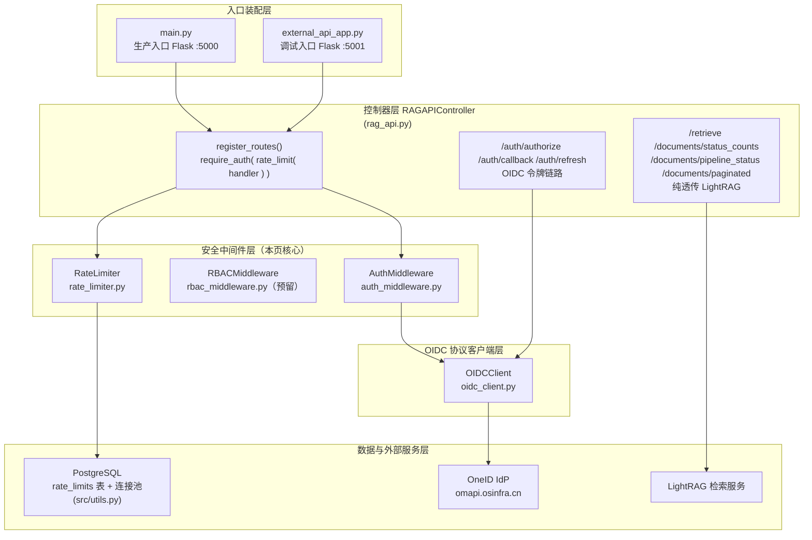
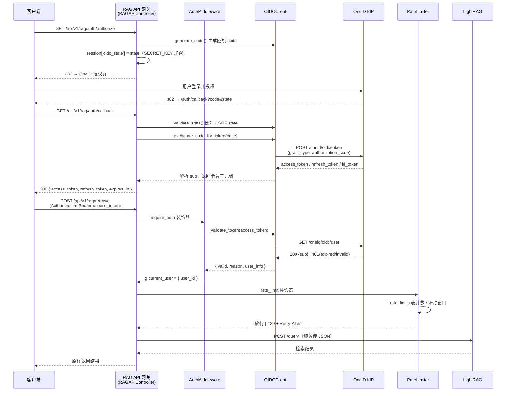

# API 访问安全：OIDC 认证与 RBAC

> 本文剖析 `src/ForumBot/` 下的安全防线四件套——**OIDC 认证客户端** (`oidc_client.py`)、**认证中间件** (`auth_middleware.py`)、**RBAC 白名单中间件** (`rbac_middleware.py`)、**PostgreSQL 滑动窗口限流器** (`rate_limiter.py`)，完整还原「OneID 授权码换取 Token → Bearer 校验 → 白名单授权 → 用户级限流」的分层防护链路，以及它们在 RAG 对外 API 网关（`/api/v1/rag/*`）上的装配方式。

---

## 1. 项目定位与核心价值

### 1.1 背景与痛点

`forum-reply-robot` 在主进程之外，还对外暴露了一套基于 **LightRAG** 的检索 API（`/api/v1/rag/*`），供上游系统查询知识库、查看文档管道状态。这套网关在架构上刻意做成**纯透传代理**：调用方提交的 JSON 原样转发给 LightRAG，响应原样返回，业务逻辑几乎为零。但也正因为它直连内部知识库、并且是公网可达（由 K8s Ingress / 反向代理承接），它必须解决四类安全诉求：

1. **身份可信**——网关不能信任调用方自报身份，必须让 Token 由统一的身份提供方（IdP）背书。项目选用组织内已有的 **OneID（OIDC 协议）** 作为唯一认证源，接入其 `/oneid/oidc/*` 端点，避免自建账号体系。
2. **失效可区分**——Bearer Token 一旦过期或失效，网关需要向客户端返回**可操作的错误码**（提示去刷新 vs. 重新登录），而不是笼统的 401。这要求认证链路能把「过期」与「无效」两类失败精确区分开。
3. **授权可收敛**——知识上传等写操作必须限定在授权用户范围内。项目采用**基于 `user_id` 白名单的粗粒度授权**（而非完整 RBAC 角色模型），把"谁能改知识库"收敛到配置里的一行数组。
4. **滥用可抑制**——透传网关天然容易被高频调用消耗上游资源，需要一个**用户维度的限流器**把每用户每小时请求数钉死在阈值内。

这四项诉求分别落到 `oidc_client.py` / `auth_middleware.py` / `rbac_middleware.py` / `rate_limiter.py` 四个文件，并由 `rag_api.py` 的 `RAGAPIController` 以「装饰器叠加」的方式统一装配。

Sources: [oidc_client.py](src/ForumBot/oidc_client.py#L10-L21), [rag_api.py](src/ForumBot/rag_api.py#L14-L62), [main.py](main.py#L392-L410)

### 1.2 核心特性

- **完整 OIDC 授权码流程**：`OIDCClient` 支持 `authorize`（构造授权 URL）→ `callback`（用 code 换 token）→ `refresh`（用 refresh_token 续期）三个环节，并内置 **state 防 CSRF**（`secrets.token_urlsafe(16)` 生成、Flask 加密签名 Session 存储、回调时比对）。
- **过期/无效双态识别**：认证中间件通过 `userinfo` 端点区分 `TOKEN_EXPIRED` 与 `TOKEN_INVALID`，后者依据 RFC 6750 的 `WWW-Authenticate` / `error_description` 是否含 `expired` 判定——这是本项目对外错误语义的一大亮点。
- **预览环境优雅降级**：当 `PREVIEW_ENV=true` 或配置仍是 `${...}` 占位符时，`OIDCClient` 自动改用测试凭据，不抛异常，保证 CI/预览环境可启动；生产环境则严格 `_validate_config`，缺任一关键字段直接 `ValueError`。
- **Token 不落库**：`callback` 与 `refresh` 都把新 Token 三元组**直接返回给调用方**，服务端不持久化 refresh_token（`_request_userinfo` / `exchange_code_for_token` 里可见大量"不落库"注释），把令牌的生命周期完全交给客户端，缩小服务端泄露面。
- **用户级滑动窗口限流**：`RateLimiter` 以 PostgreSQL `rate_limits` 表为计数存储，实现"窗口过期重置 + 阈值拦截 + `Retry-After` 提示"，并**故障放行**（DB 不可达时允许请求通过，保证可用性优先）。
- **RBAC 白名单授权**：`RBACMiddleware` 以 `rbac.knowledge_upload_users` 白名单控制知识上传权限，`str` 化比较兼容整型/字符串 user_id；当前在 RAG 网关中**处于预留状态**（知识上传端点已移除，见 §2.2.3 说明）。

Sources: [oidc_client.py](src/ForumBot/oidc_client.py#L38-L54), [oidc_client.py](src/ForumBot/oidc_client.py#L72-L92), [rate_limiter.py](src/ForumBot/rate_limiter.py#L40-L96), [rbac_middleware.py](src/ForumBot/rbac_middleware.py#L9-L25)

### 1.3 设计哲学

> 这套安全栈的设计主线可概括为三条铁律：**认证"每次实时校验"、授权"白名单默认拒绝"、限流"故障时放行"**——对可信度从严、对可用性从宽，各取所需。

- **认证用 userinfo 端点而非本地 JWT 验签**：网关在每次请求时都回源 OneID 的 `/user` 端点验证 access_token，换取"即时吊销"能力（JWT 本地验签无法感知 Token 已被撤销）；id_token 仅用于 callback 时快速取 `sub`，且**不校验签名**（`_decode_id_token` 只做 base64 解码），真正的权威判定始终落在 userinfo 上。
- **装饰器叠加而非过滤器**：`require_auth(rate_limit(handler))` 的写法把"身份"与"配额"解耦成可组合的横切关注点，`g.current_user` 作为请求上下文在层间传递，这与 Flask 的 `g` 机制天然契合。
- **失败模式的刻意取舍**：认证/RBAC **默认拒绝**（fail-closed），因为身份不确定时绝不能放行；限流 **默认放行**（fail-open），因为限流器故障不该拖垮正常业务。这一不对称设计值得在后续演进中保持清醒。

Sources: [auth_middleware.py](src/ForumBot/auth_middleware.py#L27-L52), [oidc_client.py](src/ForumBot/oidc_client.py#L232-L252), [rate_limiter.py](src/ForumBot/rate_limiter.py#L92-L94)

---

## 2. 架构设计与模块划分

### 2.1 总体架构与依赖图



### 2.2 各层模块职责详解

#### 2.2.1 OIDCClient —— OIDC 协议客户端（oidc_client.py）

`OIDCClient` 是安全栈里唯一直接与外部 IdP 通信的模块，负责把 OIDC 协议抽象成五个纯 Python 方法。其配置全部来自 `config.yaml` 的 `oidc` 段，部署链路为 **Vault → K8s Secret → cp 到 config.yaml**（类 docstring 明示）。

- **配置与降级**：`__init__` 读取 `client_id` / `client_secret` / `redirect_uri` 及三个端点 URL（均带默认值指向 `https://omapi.osinfra.cn/oneid/oidc/*`）。若 `PREVIEW_ENV=true` 或配置值是 `${...}` 占位符（未替换的模板变量），自动替换为 `preview-test-*` 测试凭据并打 warning；否则走 `_validate_config()`，缺 `client_id` / `client_secret` / `redirect_uri` 任一字段即抛 `ValueError`。这一设计让"本地/预览可跑、生产必校验"两种诉求并存于一个类。
- **CSRF 防护**：`generate_state()` 用 `secrets.token_urlsafe(16)` 生成不可预测的随机串，`validate_state()` 做严格相等比对；state 由 `rag_api.py` 存入 Flask Session（`SECRET_KEY` 加密签名，见 §2.2.5），回调时取出比对。
- **授权码换取 Token**：`exchange_code_for_token()` 以 `grant_type=authorization_code` POST 到 token 端点（30s 超时），成功返回 `access_token` / `refresh_token` / `expires_in` / `expires_at`，并优先从 `id_token` 解码取 `sub`（`_decode_id_token`，base64 解码 payload，不验签名），缺失时回退到 `_fetch_userinfo`。
- **刷新**：`refresh_access_token()` 以 `grant_type=refresh_token` 续期，支持"刷新令牌轮换"（`new_refresh_token = token_data.get('refresh_token', refresh_token)`），返回新三元组。
- **userinfo 校验与失效分类**：`validate_token()` → `_request_userinfo()` 携带 `Authorization: Bearer <token>` GET userinfo 端点；200 视为有效并返回 `user_info`，非 200 时由 `_classify_token_failure()` 依据 **RFC 6750 Bearer 错误语义**判断——`WWW-Authenticate` 头或响应体中的 `error_description` 含 `expired` 则归类为 `'expired'`，其余一律 `'invalid'`。这是整个 TOKEN_EXPIRED / TOKEN_INVALID 区分能力的源头。

Sources: [oidc_client.py](src/ForumBot/oidc_client.py#L10-L54), [oidc_client.py](src/ForumBot/oidc_client.py#L57-L105), [oidc_client.py](src/ForumBot/oidc_client.py#L107-L172), [oidc_client.py](src/ForumBot/oidc_client.py#L174-L230), [oidc_client.py](src/ForumBot/oidc_client.py#L232-L329)

#### 2.2.2 AuthMiddleware —— 认证中间件（auth_middleware.py）

`AuthMiddleware` 把"取 Token → 验证 → 注入请求上下文"封装为可复用的 `require_auth` 装饰器，是网关受保护端点的**第一道门**。

- **Token 提取**：`extract_token()` 只接受 `Bearer ` 前缀的 `Authorization` 头，其余格式一律视为缺失（测试明确覆盖 `Basic` 头返回 `None`）。
- **验证与分类**：`validate_token_via_userinfo()` 委托 `OIDCClient.validate_token()`，把结果归一化为 `{valid, reason, user_id}` 三元组：userinfo 成功且含 `sub` 才算通过；响应缺 `sub`、网络异常、无效 Token 统一归为 `invalid`，`expired` 原样透传。**注意**：该方法只把 `user_id` 带进下游，不携带任何角色/权限声明（测试 `test_validate_token_via_userinfo_returns_only_user_id` 显式断言 `'roles' not in result`）。
- **错误语义**：`require_auth` 返回三类 401 错误码——`TOKEN_MISSING`（无/格式错误头）、`TOKEN_EXPIRED`（提示用 refresh_token 刷新）、`TOKEN_INVALID`（提示重新 OneID 授权），并写入 `g.current_user = {'user_id': ...}` 供后续中间件与处理器读取。测试 `test_expired_and_invalid_codes_are_distinct` 专门锁死这两个错误码必须不同。

Sources: [auth_middleware.py](src/ForumBot/auth_middleware.py#L7-L52), [auth_middleware.py](src/ForumBot/auth_middleware.py#L54-L84), [test_auth_middleware.py](tests/test_auth_middleware.py#L107-L114), [test_auth_middleware.py](tests/test_auth_middleware.py#L204-L224)

#### 2.2.3 RBACMiddleware —— 白名单授权（rbac_middleware.py）

`RBACMiddleware` 提供 `require_upload_permission` 装饰器，控制**知识上传**这一写操作权限。它的实现是**最简 RBAC 形态**：没有角色-权限矩阵，只有一张 `rbac.knowledge_upload_users` 白名单（user_id 数组）。`check_upload_permission()` 把入参与白名单元素统一 `str()` 化后比对，天然兼容"配置里是字符串、`sub` 是数字/字符串"的异构情况；白名单为空或 user_id 缺失时**一律拒绝**（fail-closed）。

**需要特别说明的现状**：该中间件目前在**当前代码树中没有任何调用方**——`RAGAPIController` 已不再持有 `rbac_middleware` 属性，也不存在 `/knowledge/upload` 路由或 `knowledge_upload` 方法（测试 `test_no_rbac_middleware`、`test_register_routes_no_knowledge_upload`、`test_no_knowledge_upload_method` 逐一锁死了这些"已移除"的契约）。结合测试文件里完整的白名单用例（`tests/test_rbac_middleware.py`，覆盖成功/403/401 全路径），可以推断：**RBAC 层是为知识上传功能预留的安全组件，随上传能力一同被暂时摘下，但契约与测试保留完好**，未来恢复上传端点时可直接套用 `require_upload_permission`。

Sources: [rbac_middleware.py](src/ForumBot/rbac_middleware.py#L6-L47), [test_rag_api.py](tests/test_rag_api.py#L644-L647), [test_rag_api.py](tests/test_rag_api.py#L670-L678), [test_rag_api.py](tests/test_rag_api.py#L1069-L1072), [test_rbac_middleware.py](tests/test_rbac_middleware.py#L7-L128)

#### 2.2.4 RateLimiter —— PostgreSQL 滑动窗口限流（rate_limiter.py）

`RateLimiter` 是网关的**第二道门**（位于 `require_auth` 内层），以 PostgreSQL 为存储实现**用户级滑动窗口限流**，默认每用户每小时 100 次（`rate_limit.user_hourly_limit`，窗口 `window_seconds` 默认 3600）。

- **窗口模型**：`rate_limits` 表每用户一行，字段为 `user_id`(UNIQUE) / `request_count` / `window_start` / `updated_at`。`check_rate_limit()` 的三分支逻辑即滑动窗口的三个状态：① 窗口已过期（`now > window_start + window_seconds`）→ 重置计数为 1 并开启新窗口；② 窗口内计数已达阈值 → 返回 `False`（拦截）；③ 窗口内未达阈值 → 计数 +1 放行。首条记录则 `INSERT (user_id, 1, now, now)`。
- **连接管理**：默认从 `src/utils.py` 的 `ThreadedConnectionPool` 取连接（`get_db_connection_from_pool` / `release_db_connection_to_pool`），池不可用时回退直连并带 30s 兜底；`finally` 保证连接归还。
- **429 语义**：`rate_limit` 装饰器被拦截时，`get_retry_after()` 计算窗口剩余秒数，随 `429` 响应头 `Retry-After` 一并返回，客户端可据此退避。
- **匿名兜底**：装饰器在 `g.current_user` 缺失时回退到 `X-User-ID` 请求头，再退化为 `'anonymous'`——这使 `/auth/refresh` 这类"无需认证但需限流"的端点也能被保护。
- **表结构与启动**：`create_tables()` 幂等建表 + 建 `idx_rate_limits_user_id` 索引，在 `main.py` 注册 Blueprint 前调用。

Sources: [rate_limiter.py](src/ForumBot/rate_limiter.py#L9-L38), [rate_limiter.py](src/ForumBot/rate_limiter.py#L40-L96), [rate_limiter.py](src/ForumBot/rate_limiter.py#L98-L150), [rate_limiter.py](src/ForumBot/rate_limiter.py#L153-L195), [src/utils.py](src/utils.py#L182-L260)

#### 2.2.5 装配与加固层（main.py / external_api_app.py）

安全中间件本身不直接生效，由 Flask 应用装配。`main.py`（生产入口，5000 端口）在启动时完成四件事：从 `config.yaml` 读取 `flask_secret_key` 写入 `app.config['SECRET_KEY']`（OIDC state 所在的 Session 加密签名密钥，生产缺失时报错、调试模式才允许默认值）；设置 `MAX_CONTENT_LENGTH = 1 MiB`（超大 JSON payload 在读取前即被 413 拦截，防 OOM）；初始化数据库连接池；`create_rate_limit_tables(config)` 建表后注册 RAG API Blueprint。`external_api_app.py`（调试入口，5001 端口）额外提供 `@app.before_request enforce_https`（非 debug 强制 HTTPS，否则 403）与全套错误处理器（401/403/429/413/500 统一 JSON 语义）。`main.py` 还在加载配置后调用 `delete_config_file()` 删除含敏感信息的配置文件，防止凭据长期落盘。

Sources: [main.py](main.py#L340-L373), [main.py](main.py#L392-L410), [external_api_app.py](src/external_api_app.py#L19-L25), [external_api_app.py](src/external_api_app.py#L63-L106), [main.py](main.py#L339-L345)

---

## 3. 技术栈与核心工作流

### 3.1 认证主链路时序



整条链路可概括为 **OIDC 令牌获取（authorize/callback/refresh）→ 请求时认证（userinfo 回源）→ 配额控制（滑动窗口）→ 业务透传（LightRAG）**。其中「认证」与「配额」以装饰器嵌套方式在路由注册时静态确定，`g.current_user` 是层间唯一的身份载体。

### 3.2 核心类职责表

| 类 / 函数 | 文件 | 角色 | 关键输出 / 副作用 |
| --- | --- | --- | --- |
| `OIDCClient` | `oidc_client.py` | OIDC 协议客户端 | 授权 URL、令牌三元组、`{valid, reason, user_info}` |
| `AuthMiddleware.require_auth` | `auth_middleware.py` | 认证装饰器（fail-closed） | `g.current_user`；401×3 错误码 |
| `RBACMiddleware.require_upload_permission` | `rbac_middleware.py` | 白名单授权装饰器（预留） | 401/403 拒绝；`ROLE_DENIED` |
| `RateLimiter.rate_limit` | `rate_limiter.py` | 用户级限流装饰器（fail-open） | `rate_limits` 表读写；429 + `Retry-After` |
| `RateLimiter.create_tables` | `rate_limiter.py` | 幂等建表 | `rate_limits` 表 + 索引 |
| `RAGAPIController.register_routes` | `rag_api.py` | 路由装配 | 装饰器叠加的 7 条 `/api/v1/rag/*` 路由 |

### 3.3 错误语义矩阵

| 场景 | HTTP 状态码 | error 字段 | 触发点 |
| --- | --- | --- | --- |
| 缺少 / 非 Bearer 格式的 Authorization 头 | 401 | `TOKEN_MISSING` | `AuthMiddleware.require_auth` |
| access_token 已过期 | 401 | `TOKEN_EXPIRED` | `_classify_token_failure` 命中 `expired` |
| access_token 无效 / 伪造 / 网络异常 | 401 | `TOKEN_INVALID` | userinfo 失败且非过期 |
| 超出发言配额 | 429 | `RATE_LIMITED`（含 `Retry-After`） | `RateLimiter.rate_limit` |
| 非白名单用户写知识库 | 403 | `ROLE_DENIED` | `RBACMiddleware.require_upload_permission`（预留） |
| OIDC state 不匹配 | 400 | `INVALID_STATE` | `rag_api.auth_callback` |
| OneID 换 token 失败 | 500 | `OIDC_ERROR` | `rag_api.auth_callback` |
| 非 HTTPS（调试应用） | 403 | `HTTPS_REQUIRED` | `external_api_app.enforce_https` |
| 请求体超 1 MiB | 413 | `PAYLOAD_TOO_LARGE` | Flask `MAX_CONTENT_LENGTH` |

Sources: [rag_api.py](src/ForumBot/rag_api.py#L32-L62), [rag_api.py](src/ForumBot/rag_api.py#L64-L107), [auth_middleware.py](src/ForumBot/auth_middleware.py#L54-L84), [rate_limiter.py](src/ForumBot/rate_limiter.py#L128-L150), [external_api_app.py](src/external_api_app.py#L63-L98)

---

## 4. 典型代码示例

### 4.1 装饰器叠加：路由装配即安全策略声明

`register_routes()` 用一行装饰器表达"先认证、再限流、最后执行业务"的完整策略，`g.current_user` 由外层写入、由处理器读取：

```python
bp.route('/retrieve', methods=['POST'])(
    self.auth_middleware.require_auth(
        self.rate_limiter.rate_limit(self.retrieve)
    )
)
bp.route('/auth/refresh', methods=['POST'])(
    self.rate_limiter.rate_limit(self.refresh_token)  # 无需认证，但需限流
)
```

Sources: [rag_api.py](src/ForumBot/rag_api.py#L32-L62)

### 4.2 认证装饰器的三态判定

```python
def require_auth(self, f):
    @wraps(f)
    def decorated(*args, **kwargs):
        access_token = self.extract_token()
        if not access_token:
            return jsonify({'error': 'TOKEN_MISSING', ...}), 401
        result = self.validate_token_via_userinfo(access_token)
        if not result.get('valid'):
            if result.get('reason') == 'expired':
                return jsonify({'error': 'TOKEN_EXPIRED', ...}), 401
            return jsonify({'error': 'TOKEN_INVALID', ...}), 401
        g.current_user = {'user_id': result['user_id']}
        return f(*args, **kwargs)
    return decorated
```

Sources: [auth_middleware.py](src/ForumBot/auth_middleware.py#L54-L84)

### 4.3 失效分类：userinfo 回源 + RFC 6750 语义

```python
def _classify_token_failure(self, response):
    parts = [str(response.headers.get('WWW-Authenticate', '') or '')]
    body = response.json()
    parts += [str(body.get('error', '') or ''), str(body.get('error_description', '') or '')]
    if 'expired' in ' '.join(parts).lower():
        return 'expired'
    return 'invalid'
```

> 设计要点：不本地验签、每次回源 userinfo，既换取"即时吊销"，又让 TOKEN_EXPIRED 与 TOKEN_INVALID 的错误语义完全由 IdP 响应决定。

Sources: [oidc_client.py](src/ForumBot/oidc_client.py#L287-L313)

### 4.4 滑动窗口限流的状态机

```python
if stored_window_start and now > stored_window_start + timedelta(seconds=self.window_seconds):
    # 窗口已过期 → 重置计数，开启新窗口
    cursor.execute("UPDATE rate_limits SET request_count = 1, window_start = %s ...", (now, user_id))
    conn.commit(); return True
if request_count >= self.hourly_limit:
    # 命中阈值 → 拦截并计算 Retry-After
    retry_after = int((stored_window_start + timedelta(seconds=self.window_seconds) - now).total_seconds())
    return False
# 窗口内未达阈值 → 计数 +1
cursor.execute("UPDATE rate_limits SET request_count = request_count + 1 ...", (now, user_id))
conn.commit(); return True
```

Sources: [rate_limiter.py](src/ForumBot/rate_limiter.py#L60-L90)

### 4.5 白名单授权的类型宽容比较

```python
def check_upload_permission(self, user_id):
    if not user_id:
        return False
    if str(user_id) in [str(u) for u in self.knowledge_upload_users]:
        return True
    return False
```

`str()` 化比对让 OneID 返回的 `sub`（可能是数字或字符串）与配置中的元素（可能是字符串）天然互通；空 user_id 与空白名单均拒绝，保持 fail-closed。

Sources: [rbac_middleware.py](src/ForumBot/rbac_middleware.py#L14-L25)

---

## 5. 学习与探索建议

### 新手路径（先建立全局坐标系）

| 目标 | 建议阅读 | 说明 |
| --- | --- | --- |
| 搞清安全栈在哪个进程里跑 | `3-core-architecture.md` + [main.py](main.py#L340-L410) | 生产入口如何装配 SECRET_KEY / 限流表 / Blueprint |
| 看懂网关如何消费这些中间件 | `17-rag-api-gateway.md` + [rag_api.py](src/ForumBot/rag_api.py#L32-L62) | `require_auth(rate_limit(handler))` 的完整路由清单 |
| 理解限流表与连接池 | `13-postgresql-storage.md` + [rate_limiter.py](src/ForumBot/rate_limiter.py#L153-L195) | `rate_limits` 表结构与 `src/utils.py` 连接池 |

### 进阶路径（吃透安全语义）

| 目标 | 建议阅读 | 说明 |
| --- | --- | --- |
| 验证三态错误码契约 | [test_auth_middleware.py](tests/test_auth_middleware.py#L134-L224) | TOKEN_MISSING / EXPIRED / INVALID 的精确断言 |
| 复现 OIDC 全流程 | [test_oidc_client.py](tests/test_oidc_client.py) | 授权 URL 构造、code 换 token、refresh 续期 |
| 理解 RBAC 为何是"预留态" | [test_rag_api.py](tests/test_rag_api.py#L644-L678) + [test_rbac_middleware.py](tests/test_rbac_middleware.py) | 知识上传已摘除但白名单契约仍在 |
| 探究限流窗口语义 | [test_rate_limiter.py](tests/test_rate_limiter.py) | 首请求 / 窗口内 / 超限 / 过期重置全分支 |
| 了解纵深防御的其余拼图 | `16-ai-content-safety.md` + [test_request_size_limit.py](tests/test_request_size_limit.py) | 1 MiB 请求体上限、日志注入防护（CWE-117）与内容安全 |

---

## 🔗 关联模块与上下游

安全四件套属于**网关侧的局部横切层**，直接调用关系极其收敛：

- **上游装配方**：[rag_api.py](src/ForumBot/rag_api.py#L14-L62)（`RAGAPIController` 组合 `AuthMiddleware` / `RateLimiter` / `OIDCClient` 并注册路由）、[main.py](main.py#L340-L410)（SECRET_KEY / 限流建表 / Blueprint 注册）。
- **下游依赖方**：[src/utils.py](src/utils.py#L182-L260)（`RateLimiter` 依赖的连接池与 `ensure_database_exists`）、OneID IdP 与 LightRAG 服务（均为外部 HTTP 端点）。

> 进一步阅读请前往同章节的 `17-rag-api-gateway.md`（网关装配视角）与 `16-ai-content-safety.md`（内容安全防线）。
