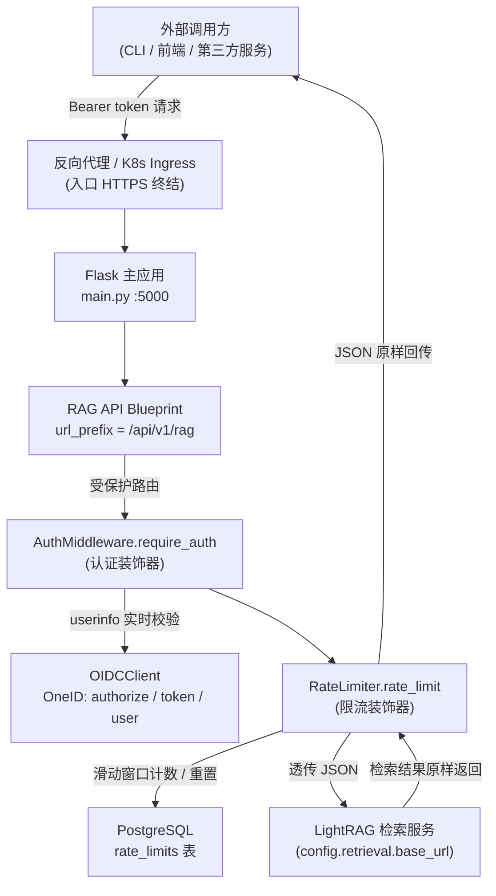
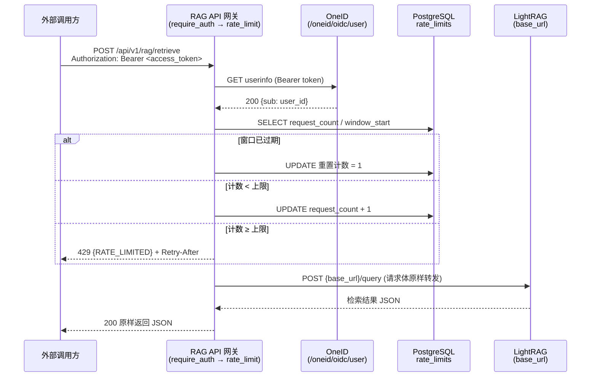
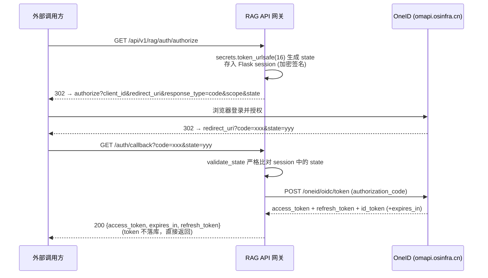

# 对外检索 API 网关（RAG API Gateway）

## 1. 项目定位与核心价值

### 1.1 诞生的背景与痛点

论坛回复机器人（ForumBot）的内核是一套基于 **LightRAG** 的知识检索与问答引擎：`update_lightrag` 子系统负责把论坛帖子、Redfish 校验报告等数据周期性灌入 LightRAG 索引，`ai_processor` 再基于检索结果生成回答。这套内部链路原本是"自产自用"的，但随着业务演进，外部调用方（第三方服务、前端控制台、自动化脚本）需要直接消费 LightRAG 的**检索结果**与**文档状态**——例如查询某篇文档是否已索引完成、统计各状态文档的数量、分页浏览知识库文件。若把这些调用方直接放行到 LightRAG 服务，会立刻暴露三组风险：**无认证**（任何人可探测知识库内容）、**无配额**（单个用户可无限量打爆检索接口）、**无边界**（超大请求体可直接耗尽网关内存触发 OOM）。本模块正是为此而生的**安全前置网关**。

其核心价值可概括为：**在不改动 LightRAG 内部实现的前提下，把"认证、授权、限流、边界防护"四件事全部收敛到一层薄薄的透传网关中**。网关对检索请求采用"纯透传"（pass-through）设计——调用方提交什么 JSON，就原样转发给 LightRAG，响应也原样返回，唯一被"加工"的是请求到达前经过的安全检查链。这种设计使安全策略与检索业务彻底解耦：日后 LightRAG 升级接口协议、增加检索参数，网关侧完全无需感知；反之，若要收紧限流阈值或切换身份提供方，也只需改动网关这一层。

> 设计哲学：**"网关只做横切关注点（cross-cutting concerns），业务语义交给下游"**。认证、限流、HTTPS、请求体上限是典型的横切关注点，它们与"如何检索"无关，因而被隔离在网关层；LightRAG 的查询语义则原样透传，不做过任何一层包装，避免"双重协议漂移"。

Sources: [rag_api.py](src/ForumBot/rag_api.py#L14-L62), [external_api_app.py](src/external_api_app.py#L12-L33), [lightrag_client.py](src/update_lightrag/lightrag_client.py#L9-L28)

### 1.2 核心特性清单

| 特性 | 实现位置 | 说明 |
| --- | --- | --- |
| **OIDC 授权码认证** | `RAGAPIController.authorize / auth_callback` | 对接 OneID（`omapi.osinfra.cn`），`/auth/authorize` 发起授权、`/auth/callback` 用 code 换 token，支持 `state` 防 CSRF |
| **Bearer Token 请求级校验** | `AuthMiddleware.require_auth` | 每个受保护接口实时调用 OneID userinfo 端点验 token，可区分 `TOKEN_MISSING / TOKEN_EXPIRED / TOKEN_INVALID` 三种失败语义 |
| **用户级滑动窗口限流** | `RateLimiter.rate_limit` | 基于 PostgreSQL `rate_limits` 表实现固定窗口计数，默认每用户每小时 100 次，超限返回 429 并携带 `Retry-After` |
| **纯透传检索** | `RAGAPIController.retrieve` | 请求体原样 POST 给 `{base_url}/query`，响应 JSON 原样回传，仅做日志审计 |
| **HTTPS 强制** | `external_api_app.enforce_https` | `before_request` 钩子，非 debug 模式下非 HTTPS 请求直接 403 |
| **请求体上限（防 OOM）** | `MAX_CONTENT_LENGTH` | 默认 1 MiB，Flask 在读取完整请求体前即返回 413，防止单次超大 JSON payload 耗尽内存 |
| **统一错误契约** | `errorhandler(401/403/429/413/500)` | 所有异常都收敛为 `{error, message}` 结构的 JSON，便于调用方统一解析 |
| **双部署形态** | `main.py` 与 `external_api_app.py` | 生产环境注册进主应用（5000 端口），`external_api_app` 仅供本地独立调试（默认 5001） |

Sources: [rag_api.py](src/ForumBot/rag_api.py#L32-L62), [auth_middleware.py](src/ForumBot/auth_middleware.py#L54-L84), [rate_limiter.py](src/ForumBot/rate_limiter.py#L128-L150), [external_api_app.py](src/external_api_app.py#L22-L71), [main.py](main.py#L364-L410)

---

## 2. 架构设计与模块划分

### 2.1 总体架构图



请求到达网关后，装饰器链 `require_auth(rate_limit(handler))` 是安全防线的主轴：**认证在外层、限流在内层**。认证失败直接 401 短路，限流失败直接 429 短路，只有两层都通过才进入真正的业务透传 handler。该顺序是刻意的——限流需要 `g.current_user.user_id` 作为计数键，而该字段正是由外层认证写入 Flask 请求上下文的，若限流在外层将无法区分用户身份。

Sources: [rag_api.py](src/ForumBot/rag_api.py#L40-L59), [auth_middleware.py](src/ForumBot/auth_middleware.py#L54-L84), [rate_limiter.py](src/ForumBot/rate_limiter.py#L128-L150)

### 2.2 模块职责分解

**① RAGAPIController —— 路由编排器（门面）**

`RAGAPIController` 是网关的唯一门面，构造时组装全部依赖：`OIDCClient`、`AuthMiddleware`、`RateLimiter`、`LightRAGClient` 以及从 `config['retrieval']` 读取的 `base_url` / `query_endpoint` / `verify_ssl`。它维护一个 `_bp` 属性持有 Blueprint，并通过 `register_routes()` 一次性把"认证 + 限流"装饰器粘合到各 handler 上。工厂函数 `create_rag_api_controller(config)` 返回 `(controller, blueprint)` 二元组，供主应用或调试应用注册。

一个值得注意的细节：`LightRAGClient` 在构造函数中被实例化，但 `retrieve` 并未使用它，而是直接用 `requests.post` 透传。这暴露了模块的演进痕迹——早期网关可能打算复用 `LightRAGClient` 的封装能力，最终却选择了更轻的裸 HTTP 透传（因为透传不需要任何解析/封装逻辑），`LightRAGClient` 便成了"保留的配置持有者"（其 `verify_ssl` / 分页大小解析逻辑仍与网关共享同一份 `retrieval` 配置段）。

Sources: [rag_api.py](src/ForumBot/rag_api.py#L14-L30), [rag_api.py](src/ForumBot/rag_api.py#L286-L294), [lightrag_client.py](src/update_lightrag/lightrag_client.py#L14-L28)

**② AuthMiddleware —— OIDC 认证中间件**

`AuthMiddleware` 只做两件事：从 `Authorization` 头提取 `Bearer` token（`extract_token`），以及调用 OneID userinfo 端点验证 token 并提取 `sub` 作为 `user_id`（`validate_token_via_userinfo`）。其关键设计在于**失败语义的精细化**：通过 `OIDCClient.validate_token` 返回的 `reason` 字段区分 `expired` 与 `invalid`，进而让调用方收到 `TOKEN_EXPIRED`（提示去刷新）或 `TOKEN_INVALID`（提示重新登录）两种不同错误。验证通过后，用户身份被写入 `g.current_user = {'user_id': ...}`，成为后续限流与审计日志的身份来源。

> 设计哲学：**验证选择"实时 userinfo 调用"而非"本地 JWT 解码"**。前者每次请求都会打到 OneID，换取的是令牌实时吊销能力（token 被撤销后立即失效），代价是增加了外部依赖的延迟与可用性耦合；后者虽快但无法感知吊销。该项目明确选择了前者，并配套了用户级限流来缓解其放大效应。

Sources: [auth_middleware.py](src/ForumBot/auth_middleware.py#L7-L52), [auth_middleware.py](src/ForumBot/auth_middleware.py#L54-L84), [oidc_client.py](src/ForumBot/oidc_client.py#L320-L329)

**③ RateLimiter —— PostgreSQL 滑动窗口限流器**

`RateLimiter` 以 `user_id` 为键、`rate_limits` 表为存储实现固定窗口限流：窗口期内计数达到 `hourly_limit`（默认 100）即拒绝，返回 429 并附带 `Retry-After` 头；窗口过期则重置计数。它的容错策略是 **fail-open**：数据库不可用时 `check_rate_limit` 返回 `True`（放行），避免限流器自身故障导致整个检索服务不可用——这是一种明确的可用性优先权衡，代价是极端故障场景下可能短暂失去限流保护。`create_tables()` 负责幂等建表与索引，由应用启动时调用。

Sources: [rate_limiter.py](src/ForumBot/rate_limiter.py#L9-L39), [rate_limiter.py](src/ForumBot/rate_limiter.py#L40-L96), [rate_limiter.py](src/ForumBot/rate_limiter.py#L128-L150), [rate_limiter.py](src/ForumBot/rate_limiter.py#L153-L195)

**④ OIDCClient —— OneID 协议客户端**

`OIDCClient` 封装了与 OneID 交互的全部协议细节：构造授权 URL、用授权码换 token、用 refresh_token 刷新、解码 id_token JWT、调用 userinfo 端点。其安全要点有二：一是 `generate_state()` 使用 `secrets.token_urlsafe(16)` 生成防 CSRF 的随机 state 并存入 Flask 加密签名的 session，回调时严格比对；二是 `_classify_token_failure()` 依据 RFC 6750 Bearer 错误约定，从 `WWW-Authenticate` 头与响应体的 `error_description` 中嗅探 `expired` 关键字来区分过期与无效。此外它还实现了**预览环境优雅降级**：当环境变量 `PREVIEW_ENV=true` 或配置为 `${...}` 占位符时，自动替换为测试凭据，避免本地/预览部署因缺少 Vault 注入的密钥而崩溃。

Sources: [oidc_client.py](src/ForumBot/oidc_client.py#L10-L55), [oidc_client.py](src/ForumBot/oidc_client.py#L72-L105), [oidc_client.py](src/ForumBot/oidc_client.py#L107-L172), [oidc_client.py](src/ForumBot/oidc_client.py#L287-L313)

### 2.3 路由清单（API 面）

| 方法与路径 | 认证 | 限流 | 职责 |
| --- | --- | --- | --- |
| `GET /api/v1/rag/auth/authorize` | 无 | 无 | 生成 state、构造 OneID 授权 URL、302 重定向 |
| `GET /api/v1/rag/auth/callback` | 无 | 无 | 校验 state、用 code 换 token、返回 `{access_token, expires_in, refresh_token}`（不落库） |
| `POST /api/v1/rag/auth/refresh` | 无 | ✅ | 用 refresh_token 换取新 token，失败返回 401 `TOKEN_EXPIRED` |
| `POST /api/v1/rag/retrieve` | ✅ | ✅ | 文档检索，透传 `{query, ...}` 给 `{base_url}/query` |
| `GET /api/v1/rag/documents/status_counts` | ✅ | ✅ | 文档状态计数，透传给 LightRAG |
| `GET /api/v1/rag/documents/pipeline_status` | ✅ | ✅ | 索引管道状态（busy/idle），透传给 LightRAG |
| `POST /api/v1/rag/documents/paginated` | ✅ | ✅ | 文档分页查询（LightRAG 要求 page_size ≥ 10），透传 |

三个"开放"路由（authorize / callback / refresh）不挂认证装饰器是协议使然——它们本身就是为了换取凭证而存在的；但 `refresh` 挂了限流，防止恶意刷 token 端点。所有业务路由统一为"认证 + 限流"双装饰器。

Sources: [rag_api.py](src/ForumBot/rag_api.py#L32-L62), [rag_api.py](src/ForumBot/rag_api.py#L64-L142), [lightrag_client.py](src/update_lightrag/lightrag_client.py#L10-L12)

---

## 3. 技术栈与核心工作流

### 3.1 技术栈速览

| 层次 | 技术 | 用途 |
| --- | --- | --- |
| Web 框架 | Flask（Blueprint 机制） | 路由注册、请求上下文 `g`、session 加密、错误处理器 |
| 身份认证 | OIDC 授权码模式（OneID） | 用户登录、令牌颁发；请求级 userinfo 实时校验 |
| 数据存储 | PostgreSQL + `psycopg2` 连接池 | 限流计数表 `rate_limits`；连接复用（`ThreadedConnectionPool`） |
| HTTP 客户端 | `requests`（同步） | 网关 → LightRAG 的透传转发（60s / 30s 超时） |
| 日志 | `logging` + `RotatingFileHandler` | 主日志与外部 API 日志，20MB 轮转 × 4 备份 |
| 部署形态 | 主应用内嵌 Blueprint + 独立调试 App | 生产 5000 端口（Ingress 保护），调试 5001 端口 |

Sources: [external_api_app.py](src/external_api_app.py#L1-L9), [utils.py](src/utils.py#L182-L261), [logging_config.py](src/ForumBot/logging_config.py#L7-L49)

### 3.2 主链路一：请求认证 → 限流 → 检索透传



**执行语义细节**：`require_auth` 将 `g.current_user` 注入上下文后，`rate_limit` 的装饰器从 `g.current_user.get('user_id')` 取身份（若没有则回退到 `X-User-ID` 头或 `'anonymous'`），以该身份查 `rate_limits` 表。透传 handler 内部对 LightRAG 的非 JSON 响应做了防御（`ValueError` 捕获后返回 500），并在日志中记录 `rag_input`（转义后的 query）与 `rag_retrieve_time`（毫秒时间戳），形成可审计的检索轨迹。

Sources: [rag_api.py](src/ForumBot/rag_api.py#L144-L187), [auth_middleware.py](src/ForumBot/auth_middleware.py#L54-L84), [rate_limiter.py](src/ForumBot/rate_limiter.py#L40-L96)

### 3.3 主链路二：OIDC 授权码换取令牌（一次性引导）



这条链路的关键约束是**令牌无状态化**：网关不在任何数据库落盘 token，回调拿到 token 后直接返回给调用方，由调用方自行保管并在后续请求中作为 Bearer 头携带。这使网关本身不承担令牌存储与轮换的合规负担，配合每次请求的 userinfo 实时校验，形成了"**一次性签发 + 逐请求验证**"的安全闭环。`/auth/refresh` 则复用 `OIDCClient.refresh_access_token` 完成令牌续期，同样不落库。

Sources: [rag_api.py](src/ForumBot/rag_api.py#L64-L142), [oidc_client.py](src/ForumBot/oidc_client.py#L72-L105), [oidc_client.py](src/ForumBot/oidc_client.py#L174-L230)

### 3.4 核心类职责对照表

| 类 / 工厂 | 所在文件 | 在流程中的角色 |
| --- | --- | --- |
| `RAGAPIController` | `rag_api.py` | 门面：组装依赖、注册路由、实现各 handler |
| `create_rag_api_controller()` | `rag_api.py` | 工厂：产出 `(controller, blueprint)` 供 App 注册 |
| `AuthMiddleware.require_auth` | `auth_middleware.py` | 认证装饰器：验 token → 写 `g.current_user` → 放行 |
| `RateLimiter.rate_limit` | `rate_limiter.py` | 限流装饰器：计数 / 429 拒绝 |
| `OIDCClient` | `oidc_client.py` | OneID 协议客户端：授权、换 token、刷新、userinfo 验证 |
| `LightRAGClient` | `lightrag_client.py` | 内部数据管线客户端（上传/删除/分页），与网关共享 `retrieval` 配置 |
| `create_app()` | `external_api_app.py` | 调试形态的 Flask App 工厂（含 HTTPS 强制与错误处理器） |
| `main.py` 集成段 | `main.py` | 生产形态：初始化连接池、建限流表、注册 Blueprint 到 5000 端口 |

Sources: [rag_api.py](src/ForumBot/rag_api.py#L14-L62), [external_api_app.py](src/external_api_app.py#L12-L108), [main.py](main.py#L393-L410)

---

## 4. 典型代码示例

### 4.1 装饰器链的声明式编排（网关的核心骨架）

```python
# src/ForumBot/rag_api.py
def register_routes(self):
    """注册所有路由"""
    bp = Blueprint('rag_api', __name__, url_prefix='/api/v1/rag')
    bp.route('/auth/authorize', methods=['GET'])(self.authorize)
    bp.route('/auth/callback', methods=['GET'])(self.auth_callback)
    bp.route('/auth/refresh', methods=['POST'])(
        self.rate_limiter.rate_limit(self.refresh_token)
    )
    bp.route('/retrieve', methods=['POST'])(
        self.auth_middleware.require_auth(
            self.rate_limiter.rate_limit(self.retrieve)
        )
    )
    # ...documents/status_counts / pipeline_status / paginated 同构
    self._bp = bp
    return bp
```

这段代码以函数式装饰器组合（而非 Flask 的 `@app.route` 注解）完成"认证 → 限流 → 业务"的管线声明，可读性极高：`require_auth` 包裹 `rate_limit` 包裹 handler，阅读顺序即执行顺序。这是本网关最值得借鉴的**安全管线可组合性**设计。

Sources: [rag_api.py](src/ForumBot/rag_api.py#L32-L62)

### 4.2 纯透传检索 handler

```python
# src/ForumBot/rag_api.py
def retrieve(self):
    """文档检索接口 - 纯透传：原样转发调用方 JSON 给 LightRAG，原样返回响应"""
    data = request.get_json(silent=True)
    if not data:
        return jsonify({'error': 'INVALID_REQUEST', ...}), 400

    try:
        url = f"{self.base_url}{self.query_endpoint}"
        response = requests.post(url, json=data, verify=self.verify_ssl, timeout=60)
        try:
            result = response.json()
            rag_input = str(data.get('query', '')).replace('\r', '\\r').replace('\n', '\\n')
            logger.info(f"rag_input:{rag_input} rag_retrieve_time:{int(time.time() * 1000)}")
            logger.info(f"Retrieved documents for user {g.current_user.get('user_id')}")
            return jsonify(result), response.status_code
        except ValueError:
            # LightRAG 返回非 JSON → 500 兜底
            ...
    except Exception as e:
        ...
```

透传实现刻意保持"零语义加工"：`json=data` 原样转发、`jsonify(result)` 原样回传、下游的 HTTP 状态码透传。日志侧则做了两处"净化"——query 中的 CR/LF 被转义防止日志注入，毫秒时间戳配合用户 ID 形成审计轨迹。

Sources: [rag_api.py](src/ForumBot/rag_api.py#L144-L187)

### 4.3 认证装饰器的失败语义区分

```python
# src/ForumBot/auth_middleware.py
def require_auth(self, f):
    @wraps(f)
    def decorated(*args, **kwargs):
        access_token = self.extract_token()
        if not access_token:
            return jsonify({'error': 'TOKEN_MISSING', ...}), 401

        result = self.validate_token_via_userinfo(access_token)
        if not result.get('valid'):
            if result.get('reason') == 'expired':
                return jsonify({'error': 'TOKEN_EXPIRED', ...}), 401
            return jsonify({'error': 'TOKEN_INVALID', ...}), 401

        g.current_user = {'user_id': result['user_id']}  # 身份注入，供限流/审计消费
        return f(*args, **kwargs)
    return decorated
```

注意 `g.current_user` 的注入时机在验证通过之后、业务函数之前——这正是限流器能拿到 `user_id` 的前提，也是两层装饰器顺序不可颠倒的根因。

Sources: [auth_middleware.py](src/ForumBot/auth_middleware.py#L54-L84)

### 4.4 限流器的滑动窗口计数核心

```python
# src/ForumBot/rate_limiter.py
if result:
    request_count, stored_window_start, updated_at = result
    # 窗口过期 → 重置为 1
    if stored_window_start and now > stored_window_start + timedelta(seconds=self.window_seconds):
        cursor.execute("""UPDATE rate_limits SET request_count = 1,
                          window_start = %s, updated_at = %s WHERE user_id = %s""",
                       (now, now, user_id))
        conn.commit()
        return True
    # 达到上限 → 拒绝
    if request_count >= self.hourly_limit:
        retry_after = int((stored_window_start + timedelta(seconds=self.window_seconds) - now).total_seconds())
        return False
    # 正常 → 计数 +1
    cursor.execute("""UPDATE rate_limits SET request_count = request_count + 1,
                      updated_at = %s WHERE user_id = %s""", (now, user_id))
    conn.commit()
    return True
```

该实现是**固定窗口**（fixed window）而非严格滑动窗口：以"窗口起点 + 时长"判定是否过期。它比滑动窗口实现简单得多，且天然支持在 429 时精确计算 `Retry-After`（窗口剩余秒数），适合"每小时 100 次"这类粗粒度配额场景。

Sources: [rate_limiter.py](src/ForumBot/rate_limiter.py#L60-L90)

### 4.5 生产形态的应用集成（main.py）

```python
# main.py —— 生产环境
external_api_enabled = config.get('external_api', {}).get('enabled', True)
if external_api_enabled:
    create_rate_limit_tables(config)                       # 1. 幂等建表
    rag_api_controller, rag_api_bp = create_rag_api_controller(config)  # 2. 创建控制器
    app.register_blueprint(rag_api_bp)                     # 3. 注册 Blueprint 到 5000 端口
    logger.info("RAG API 已注册到主应用（5000端口）")
```

与之对应，`external_api_app.py` 的 `create_app()` 是同一网关的独立调试镜像：额外加载 `MAX_CONTENT_LENGTH`、`enforce_https` 与全套错误处理器，并通过 `health/detail` 暴露 OIDC / LightRAG / 限流三个组件的配置状态，方便本地联调时一眼诊断。

Sources: [main.py](main.py#L393-L410), [external_api_app.py](src/external_api_app.py#L12-L108)

---

## 5. 学习与探索建议

### 5.1 按关注点规划的阅读路径

| 关注点 | 阅读内容 | 收获 |
| --- | --- | --- |
| **安全管线如何组装** | `rag_api.py` 的 `register_routes` + `auth_middleware.py` 的 `require_auth` | 理解装饰器组合即安全执行顺序 |
| **OIDC 协议细节** | `oidc_client.py` 全文 + RFC 6750 的 Bearer 错误约定 | 掌握授权码流、state 防 CSRF、expired/invalid 判别 |
| **限流与存储** | `rate_limiter.py` 全文 + `utils.py` 的 `init_db_connection_pool` | 掌握固定窗口限流的实现与连接池复用 |
| **透传语义与边界防护** | `rag_api.py` 的四个透传 handler + `external_api_app.py` 的 `MAX_CONTENT_LENGTH` / `enforce_https` | 理解网关的"零语义加工"与防 OOM 设计 |
| **生产部署形态** | `main.py` 的集成段与 `initialization_worker` | 理解网关如何与数据管线、监控、定时器共存于一个进程 |
| **上游数据管线（进阶）** | `lightrag_client.py` + `update_lightrag/full_data_init.py` | 理解"谁在向 LightRAG 写数据"，从而看懂网关只读接口的来源 |

### 5.2 给接手者的三个调试抓手

1. **限流未生效？** 先确认 `rate_limits` 表是否已由 `create_tables()` 创建，再检查连接池是否初始化（`utils.py:init_db_connection_pool`）；注意限流是 **fail-open** 的，数据库异常时会静默放行。
2. **401 语义不明确？** 看 `oidc_client.py:_classify_token_failure`——它从 `WWW-Authenticate` 头与 `error_description` 中嗅探 `expired` 关键字，OneID 若修改错误文案会直接影响此分支。
3. **想加新接口？** 复制 `retrieve` 的"认证 + 限流 + 透传"三段式即可，LightRAG 侧新增的只读端点只需在 `register_routes` 中挂一条新路由。

---

## 🔗 关联模块与上下游

本模块是"安全与访问控制"章节中的对外网关，直接调用关系高度收敛，仅列出最紧密的 1-3 个：

- **上游集成方**：[main.py](main.py#L393-L410) —— 生产环境下 Blueprint 的注册入口，决定了网关的生命周期与端口（5000）；调试形态见 [external_api_app.py](src/external_api_app.py#L12-L108)。
- **下游数据源**：[lightrag_client.py](src/update_lightrag/lightrag_client.py#L9-L28) —— 与网关共享同一 `retrieval` 配置段（`base_url` / `verify_ssl` / `paginated_page_size`），其 `/documents/paginated` 分页约束（page_size ≥ 10）直接约束了网关透传接口的调用方契约。
- **安全基础设施**：[oidc_client.py](src/ForumBot/oidc_client.py#L10-L55) 与 [rate_limiter.py](src/ForumBot/rate_limiter.py#L9-L39) —— 认证与限流两个横切能力的协议/存储实现，是网关安全性的物理载体。
