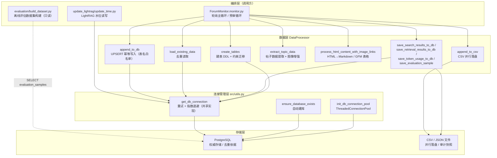
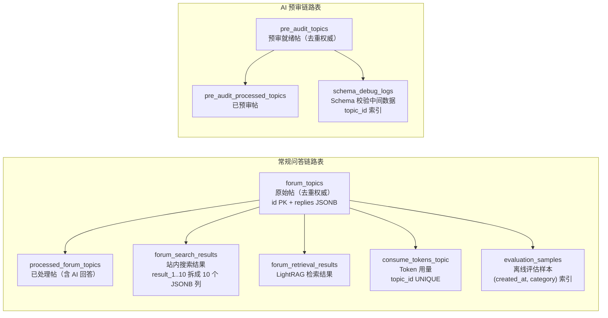

# PostgreSQL 权威存储与 CSV 落盘

> **难度**：Intermediate ｜ **章节**：数据持久化
> 本页剖析 `forum-reply-robot` 的**数据持久化层**：`src/ForumBot/data_processor.py` 与 `src/utils.py` 如何共同实现「PostgreSQL 权威存储 + CSV 并行落盘」的双写架构，以及它们如何支撑去重、处理记录、Token 计量与离线评估四条数据流。

---

## 1. 项目定位与核心价值

`forum-reply-robot` 是一个常驻后台的论坛自动回复机器人：它周期性轮询 Discourse 风格的论坛，发现带指定标签/分类的新帖，经过「提示词注入检测 → 问题摘要 → 站内搜索 + LightRAG 知识检索 → 大模型生成 → 相关性/质量校验 → 发帖回复」流水线后自动作答，另有一条面向预审标签帖子的结构化合规校验（Redfish Schema + MDB 规则）链路。这样一个**长期运行、逐轮增量处理、且涉及大模型调用成本计量**的服务，对数据层提出了三个硬性要求：**去重必须可靠**（同一帖子不能被重复处理两次）、**处理记录必须可审计**（每轮拉取了什么、检索到什么、消费了多少 Token 都要留痕）、**下游离线评估必须有样本**（评估数据集需要从生产流量中沉淀）。这三条诉求共同指向一个核心设计决策——**以 PostgreSQL 为权威数据源（System of Record），以 CSV/JSON 文件为并行审计副本**。

数据层在 README 中被明确定位为「数据持久化：PostgreSQL 存储处理记录、token 消耗；CSV 并行落盘」，`data_processor.py` 则被描述为「数据层：PostgreSQL/CSV 读写、HTML 解析、预审状态解析」。从实现上看，`DataProcessor` 是一个**面向数据库操作聚合的 Facade 类**：它不持有长连接（连接按需建立、用完即关），将连接获取/重试逻辑下沉到 `src/utils.py` 的共享实现 `get_db_connection`，自身专注于「表结构 DDL、UPSERT 写入、去重查询、帖子数据提取、HTML→Markdown 转换、CSV 落盘」这些纯粹的数据职责。这种分层让 `monitor.py`（编排层）可以完全屏蔽 SQL 细节，只调用语义化方法（`append_to_db`、`load_existing_data`、`save_token_usage_to_db` 等）。

其核心价值可以概括为三点：**第一，权威性与幂等性**——去重查询以数据库表为唯一真相（`forum_topics` / `pre_audit_topics`），写入统一使用 `ON CONFLICT (id) DO UPDATE` 的 UPSERT 语义，保证同一帖子无论被拉取多少次，最终状态一致；**第二，健壮性与安全**——数据库连接带指数退避重试，写入表名经过白名单校验，`processed_ids` 经过整数类型校验，从源头杜绝 SQL 注入；**第三，可观测与可评估**——搜索结果、检索结果、Token 用量、评估样本分别落表，形成从「拉取→处理→回答→计量→评估」的完整数据闭环，并配以 CSV 并行落盘作为审计快照。测试文件 `test_data_processor.py`、`test_data_processor_pre_audit.py` 共计数十个用例，专门锁定这些行为（JSONB 适配、UPSERT 参数、表名白名单拒绝、预审表建表等），进一步印证了该层的契约稳定性。

Sources: [README.md](README.md#L5-L14), [data_processor.py](src/ForumBot/data_processor.py#L417-L422), [utils.py](src/utils.py#L11-L45), [monitor.py](src/ForumBot/monitor.py#L41-L53), [test_data_processor.py](tests/test_data_processor.py), [test_data_processor_pre_audit.py](tests/test_data_processor_pre_audit.py)

---

## 2. 架构设计与模块划分

### 2.1 三层数据架构总览

整个持久化体系沿「编排层 → 数据层 → 连接管理层 → 存储层」四层展开。`monitor.py` 是唯一的写入口（离线评估 `build_dataset.py` 是只读消费方），它实例化 `DataProcessor` 并调用语义方法；`DataProcessor` 内部不直接 `psycopg2.connect`，而是委托 `src/utils.py::get_db_connection`（带重试与指数退避）；最终数据写入 PostgreSQL 各业务表，同时按需追加到 CSV/JSON 文件。`update_lightrag/update_time.py` 是 `get_db_connection` 的另一个独立调用方（维护 LightRAG 增量水位），体现了连接管理被抽为公共函数的复用价值。



**逐层职责拆解：**

- **编排层**：`ForumMonitor` 在 `__init__` 中一次性调用 `data_processor.create_tables()` 完成建表（幂等，仅启动时一次），随后每个轮询周期调用去重读取、数据提取、双写落库、Token 计量等方法。`_check_new_topics` 中有一个值得注意的容错策略：**`append_to_db` 返回 `False` 时直接 `return` 跳过本轮**，即「数据库写不进去就不继续处理」，这从代码层面强制了「DB 是权威」——绝不允许出现 DB 里没有记录而 CSV 里却有、导致下一轮重复处理的竞态。预审链路同样以 `append_to_db(..., 'pre_audit_topics')` 作为发现阶段去重关口。
- **数据层**：`DataProcessor` 实例化时仅保存 `config` 与 `ImageProcessor`，**不建立任何数据库连接**（`self.db_conn = None` 的注释直言「不再在初始化时建立数据库连接」），所有 DB 操作通过 `_get_db_connection()` 按需获取、`finally` 中 `_close_db_connection()` 释放——这是「短连接 + 每操作一连接」的模式，配合连接池（main.py 启动时初始化）应对多轮询并发。
- **连接管理层**：`get_db_connection(config, max_retries=3)` 是唯一共享的建连实现，失败时按 `2**attempt` 秒指数退避重试；`ensure_database_exists` 负责首启时若目标库不存在则自动 `CREATE DATABASE`；`init_db_connection_pool` 为 API 服务提供线程化连接池（RAG API 链路使用）。三个函数共同把「连接如何来」这一横切关注点从业务代码中剥离。
- **存储层**：PostgreSQL 承担去重、处理记录、计量、评估样本的权威存储；`data/forum_data` 目录下的 CSV（原始帖、已处理帖、回答帖）与 JSON（搜索/检索结果快照）是并行落盘副本，主要用于审计与离线分析。

Sources: [monitor.py](src/ForumBot/monitor.py#L41-L53), [monitor.py](src/ForumBot/monitor.py#L77-L132), [data_processor.py](src/ForumBot/data_processor.py#L417-L440), [utils.py](src/utils.py#L11-L45), [utils.py](src/utils.py#L48-L118), [utils.py](src/utils.py#L182-L216), [main.py](main.py#L369-L377), [build_dataset.py](src/evaluation/build_dataset.py#L14-L54)

### 2.2 表结构拓扑：九张业务表的分区布局

`create_tables()`（约 200 行）集中定义了全部 DDL，可清晰划分为**常规问答链路**与**AI 预审链路**两组，外加横切各链路的计量/评估表：



**设计细节与动机：**

1. **`forum_topics` 与 `processed_forum_topics` 同构不同义**：两张表列结构完全一致（`id/title/user_question/best_answer/tags/replies/created_at/llm_answer/summary_question`），但语义截然不同——前者是「发现即写入」的原始帖（去重关口），后者是「完成 AI 处理后才写入」的结果帖。`replies` 采用 `JSONB` 类型承载半结构化的楼层回复列表，配合模块顶部的 `psycopg2.extras.register_default_jsonb(globally=True)` 与 `register_adapter(dict, Json)`，让 Python 字典/列表可直接序列化入库。
2. **`forum_search_results` 的「10 列 JSONB」设计**：为了满足「结果展开成 10 个独立列、便于 SQL 侧逐列分析」的诉求，该表把最多 10 条搜索结果分别落到 `result_1`…`result_10` 十个 JSONB 列，不足 10 条用 `NULL` 填充；`append_to_db` 之外的 `save_search_results_to_db` 专司此表。
3. **`consume_tokens_topic` 的 UNIQUE 迁移**：该表 `topic_id` 声明了 `UNIQUE` 约束（每个帖子一行、可反复 UPSERT 累加），代码中通过查询 `pg_constraint` 判断旧版本表是否缺失该约束，缺失时先清理 `topic_id` 的重复行（保留 `MIN(id)`）再 `ALTER TABLE ADD CONSTRAINT`——一个典型的**生产环境在线迁移**范式。
4. **`evaluation_samples` 承载离线评估闭环**：`save_evaluation_sample` 将每帖的输入、检索上下文（经 `_normalize_retrieval_context` 归一化为字符串列表再 `json.dumps`）、实际输出、检索/生成时延、Token 用量与问题分类写入该表，`build_dataset.py` 随后按 `created_at` 近 30 天窗口读取并构建评估数据集——**评估体系直接复用生产数据流，无需额外埋点**。
5. **表所有权纪律**：`test_data_processor_pre_audit.py` 中有三个专门用例断言 `create_tables` **不得**创建或种子 `lightrag_update_time` 表——该表的所有权已收归 `update_lightrag/update_time.py`（单一所有者模式），避免全量初始化早于 `create_tables` 运行时因表不存在而丢失首启水位。这体现了模块间「谁建表谁负责」的清晰边界。

Sources: [data_processor.py](src/ForumBot/data_processor.py#L507-L700), [data_processor.py](src/ForumBot/data_processor.py#L16-L17), [data_processor.py](src/ForumBot/data_processor.py#L787-L844), [data_processor.py](src/ForumBot/data_processor.py#L880-L923), [data_processor.py](src/ForumBot/data_processor.py#L1195-L1245), [update_time.py](src/update_lightrag/update_time.py#L17-L32), [test_data_processor_pre_audit.py](tests/test_data_processor_pre_audit.py#L117-L173), [build_dataset.py](src/evaluation/build_dataset.py#L43-L54)

### 2.3 连接生命周期与安全防线

`DataProcessor` 采用**「按需建连、用完即关、失败即降级」**的连接纪律：每个 DB 方法开头 `_get_db_connection()` 判空（`None` 则记日志并返回空结果/`False`），主体 `try/except` 中执行 SQL，`finally` 中关连接。`get_db_connection` 的重试算法为 `time.sleep(2 ** attempt)`（0s → 2s → 4s），三次失败后返回 `None`。这一设计使 DB 抖动不会击穿整个轮询线程，而是**单轮跳过**、下轮自愈。

安全层面有三道防线值得单独强调：

- **表名白名单**：`append_to_db` 的 `valid_tables` 列表硬编码四个合法表名，表名不合法直接 `raise ValueError`，杜绝通过 `table_name` 参数注入 DDL。
- **参数化查询 + 类型校验**：`get_unprocessed_topics` 在拼接 `NOT IN (%s...)` 占位符前先断言 `processed_ids` 全为整数（`all(isinstance(id, int) ...)`），占位符数量由**已校验的整数列表**决定，SQL 中无任何用户可控字符串直接拼接。
- **UPSERT 幂等**：`append_to_db` 使用 `ON CONFLICT (id) DO UPDATE SET ...`，重复处理同一 `id` 时表现为「更新而非插入」，配合 `forum_topics.id INTEGER PRIMARY KEY`，从根本上消除了重复行。

Sources: [utils.py](src/utils.py#L11-L45), [data_processor.py](src/ForumBot/data_processor.py#L424-L440), [data_processor.py](src/ForumBot/data_processor.py#L468-L505), [data_processor.py](src/ForumBot/data_processor.py#L702-L785), [test_data_processor_pre_audit.py](tests/test_data_processor_pre_audit.py#L75-L77)

---

## 3. 技术栈与核心工作流

### 3.1 技术栈清单

| 技术/库 | 用途 | 关键代码位置 |
|---|---|---|
| `psycopg2` + `psycopg2.extras` | PostgreSQL 驱动、JSONB 适配器、`ThreadedConnectionPool` | [utils.py](src/utils.py#L6-L7), [data_processor.py](src/ForumBot/data_processor.py#L12-L17) |
| `psycopg2.pool` | 线程化连接池（RAG API 用） | [utils.py](src/utils.py#L182-L216) |
| `PyYAML` | 配置文件加载（加载后立即删除防泄密） | [utils.py](src/utils.py#L121-L149), [main.py](main.py#L342-L345) |
| `BeautifulSoup` / `markdownify` | 帖子 HTML→Markdown 语义转换、预审就绪状态解析 | [data_processor.py](src/ForumBot/data_processor.py#L8-L9) |
| `pandas` / `csv` | HTML 空值判断 / CSV 落盘 | [data_processor.py](src/ForumBot/data_processor.py#L19) |
| `requests` | 论坛拉取（分页、限速、SSL 校验） | [data_processor.py](src/ForumBot/data_processor.py#L69-L210) |

### 3.2 核心类与方法职责表

| 类 / 方法 | 所属文件 | 职责 | 调用方 |
|---|---|---|---|
| `DataProcessor.__init__` | data_processor.py | 持 config、惰性连接、初始化 ImageProcessor | monitor.py |
| `DataProcessor.create_tables` | data_processor.py | 九张表 DDL + 约束迁移 + 索引 | ForumMonitor.__init__ |
| `DataProcessor.append_to_db` | data_processor.py | 白名单校验 + 批量 UPSERT（replies 适配 JSONB） | monitor.py（三条链路） |
| `DataProcessor.load_existing_data` | data_processor.py | 读 `forum_topics` 全部 id 构建去重集合 | `_check_new_topics` |
| `DataProcessor.load_pre_audit_existing_data` | data_processor.py | 读 `pre_audit_topics` id 构建去重集合 | `_check_pre_audit_topics` |
| `DataProcessor.extract_topic_data` | data_processor.py | 从帖子详情提取九字段，HTML 转 Markdown，图像增强 | 两条链路 |
| `DataProcessor.append_to_csv` | data_processor.py | 追加 CSV（replies/tags 序列化），自动写表头 | `_check_new_topics` / 处理链路 |
| `DataProcessor.process_search_results` | data_processor.py | 搜索落库 + JSON 文件快照 | `_process_new_topics` |
| `DataProcessor.process_retrieval_results` | data_processor.py | 检索落库 + JSON 文件快照 | `_process_new_topics` |
| `DataProcessor.save_token_usage_to_db` | data_processor.py | Token 用量 UPSERT（每帖一行） | 处理/预审链路 |
| `DataProcessor.save_evaluation_sample` | data_processor.py | 评估样本落库（上下文归一化） | `_process_new_topics` |
| `parse_pre_audit_readiness` | data_processor.py | 从帖子 HTML 解析「是否准备好 AI 预审」 | `_check_pre_audit_topics` |
| `get_db_connection` | utils.py | 共享建连 + 指数退避重试 | DataProcessor / update_time.py |
| `ensure_database_exists` | utils.py | 目标库不存在则自动建库 | 部署引导 |

### 3.3 主链路执行流程（感知 → 规划 → 执行 → 沉淀）

常规问答链路中，数据层的调用时序如下（数字标注与代码行号对应）：

```
轮询周期 start()
  ├─ (1) load_existing_data()          # 读 DB forum_topics → 去重集合   [monitor.py L82]
  ├─ (2) fetch_all_forum_topics()      # 论坛拉新帖（标签/日期过滤）      [data_processor.py L100]
  ├─ (3) extract_topic_data()          # 提取九字段 + HTML→Markdown      [data_processor.py L996]
  ├─ (4) append_to_csv()               # 原始帖 CSV 并行落盘             [data_processor.py L1059]
  ├─ (5) append_to_db('forum_topics')  # 原始帖落库；失败则跳过本轮      [data_processor.py L702]
  └─ _process_new_topics()
       ├─ 注入检测 → 摘要
       ├─ (6) process_search_results() # 搜索结果 → DB + JSON            [data_processor.py L1113]
       ├─ (7) retrieve + format_search_results_for_prompt()  # 组装 KG/DC 上下文 [L1161]
       ├─ LLM 生成 → 相关性/质量校验
       ├─ (8) process_retrieval_results()  # 检索结果 → DB + JSON       [data_processor.py L1141]
       ├─ (9) append_to_csv(processed) + append_to_db('processed_forum_topics')
       ├─ (10) save_token_usage_to_db()    # 计量落库                   [data_processor.py L880]
       └─ (11) save_evaluation_sample()    # 评估样本落库               [data_processor.py L1195]
```

预审链路则精简为：`load_pre_audit_existing_data` → 拉帖 → `parse_pre_audit_readiness`（解析就绪状态）→ `extract_topic_data` → `append_to_db('pre_audit_topics')`（发现阶段去重）→ Schema/MDB 校验 → 发帖 → `append_to_csv` + `append_to_db('pre_audit_processed_topics')` + `save_token_usage_to_db`。

**设计哲学**：流程将「读（去重）→ 写（权威落库）→ 处理 → 回写」严格分离——**去重读与权威写在处理之前完成**，即使后续 AI 处理失败，帖子也已被 `forum_topics` 记录，不会在下一轮被重复拉取；而「结果写」放在处理完成之后，保证 `processed_forum_topics` 中的每一行都对应一条真正产出了回答的记录。这是典型的 **write-ahead 去重 + 处理后提交** 模式，兼顾了幂等性与数据完整性。

Sources: [monitor.py](src/ForumBot/monitor.py#L77-L132), [monitor.py](src/ForumBot/monitor.py#L292-L534), [monitor.py](src/ForumBot/monitor.py#L536-L625), [monitor.py](src/ForumBot/monitor.py#L627-L721), [data_processor.py](src/ForumBot/data_processor.py#L996-L1057)

---

## 4. 典型代码示例（Showcase）

### 4.1 权威写入：白名单 + 批量 UPSERT + JSONB 适配

`append_to_db` 是数据层的核心方法，浓缩了本页论述的三大安全/幂等设计。`replies` 字段的适配逻辑值得细看：**list 类型必须显式包装为 `psycopg2.extras.Json`**，否则 psycopg2 会把 Python list 误判为 PostgreSQL 数组类型（`text[]`）而非 JSONB——测试 `test_replies_list_wrapped_in_json` 正是锁定这一行为。

```python
valid_tables = ['forum_topics', 'processed_forum_topics', 'pre_audit_topics', 'pre_audit_processed_topics']
if table_name not in valid_tables:
    raise ValueError(f"Invalid table name: {table_name}")
...
for row in data:
    replies = row.get('replies', [])
    if isinstance(replies, list):
        replies = psycopg2.extras.Json(replies)   # list → Json() 显式转 JSONB
...
insert_query = (
    f"INSERT INTO {table_name} "
    "(id, title, user_question, best_answer, tags, replies, created_at, llm_answer, summary_question) "
    f"VALUES {values_placeholders} "
    "ON CONFLICT (id) "
    "DO UPDATE SET title = EXCLUDED.title, ..."
)
flat_values = []
for row in insert_data:
    flat_values.extend(row)
cursor.execute(insert_query, flat_values)
```

Sources: [data_processor.py](src/ForumBot/data_processor.py#L702-L785), [test_data_processor_pre_audit.py](tests/test_data_processor_pre_audit.py#L224-L262)

### 4.2 共享连接：指数退避重试

`get_db_connection` 是 `DataProcessor._get_db_connection` 与 `update_time.py` 共同委托的单一实现（docstring 明言「消除重复」），失败重试间隔呈 `2 ** attempt` 指数增长：

```python
for attempt in range(max_retries):
    try:
        db_config = config.get('database', {})
        conn = psycopg2.connect(
            host=db_config.get('host'), port=db_config.get('port', 5432),
            database=db_config.get('database'), user=db_config.get('user'),
            password=db_config.get('password'),
            sslmode=db_config.get('sslmode', 'prefer'))
        return conn
    except Exception as e:
        if attempt < max_retries - 1:
            time.sleep(2 ** attempt)
        else:
            return None
```

Sources: [utils.py](src/utils.py#L11-L45)

### 4.3 预审就绪状态解析：三种 DOM 策略 + 正则兜底

`parse_pre_audit_readiness` 体现了数据层对**异构论坛帖子模板**的宽容处理——同一字段可能以表格、标题+段落、纯文本三种形态出现，解析器按优先级逐级尝试，并规避「是/否」占位文本（负向先行断言 `(?![/／\w])`）：

```python
# 方式1：<tr><td>字段名</td><td>是</td></tr> 表格结构
for tr in soup.find_all('tr'):
    cells = tr.find_all(['td', 'th'])
    if len(cells) >= 2 and (core_field in cells[0].get_text(strip=True)):
        return cells[1].get_text(strip=True) == yes_value
# 方式2：<h2>字段</h2> 后跟兄弟节点中的独立值
# 方式3：全文本正则，匹配"字段名：是"且排除"是/否"占位
pattern = rf'{re.escape(core_field)}\s*[：:]*\s*(是|否)(?![/／\w])'
```

Sources: [data_processor.py](src/ForumBot/data_processor.py#L350-L414), [test_data_processor_pre_audit.py](tests/test_data_processor_pre_audit.py#L19-L50)

### 4.4 HTML→Markdown：保留语义标记与 GFM 表格

`process_html_content_with_image_links` 先把 `` 与 `lightbox` 链接替换为 `[img: (url)]` 文本占位（供后续 `ImageProcessor` 增强），再对 `<table>` 走自定义 GFM 转换（因为 `markdownify` 对表格支持不佳），最后统一交给 `markdownify` 转 Markdown——这是把「论坛富文本」无损降级为「LLM 友好文本」的关键管道：

```python
img.replace_with(f"[img: ({img_src})]")
for table in soup_copy.find_all('table'):
    markdown_table = _html_table_to_markdown(table)
    table.replace_with(NavigableString(markdown_table))
text_content = md(str(soup_copy), heading_style="ATX", bullets="-")
text_content = re.sub(r'\n{3,}', '\n\n', text_content).strip()
```

Sources: [data_processor.py](src/ForumBot/data_processor.py#L269-L347), [test_data_processor_pre_audit.py](tests/test_data_processor_pre_audit.py#L176-L218), [image_processor.py](src/ForumBot/image_processor.py#L119-L147)

---

## 5. 学习与探索建议

**新手路径（理解数据如何流动）：**

1. 从 **`tests/test_data_processor.py`** 与 **`tests/test_data_processor_pre_audit.py`** 入手——测试即契约，先用 mock 连接跑通 `append_to_db` / `create_tables` / `parse_pre_audit_readiness`，理解每个方法的输入输出。
2. 通读 **`monitor.py` 的 `_check_new_topics` 与 `_check_pre_audit_topics`**，用「(1)load → (2)fetch → (3)extract → (4)csv → (5)db」的编号法对照数据流，建立「DB 权威、CSV 审计、写失败跳轮」的心智模型。
3. 阅读 **`src/utils.py` 的 `get_db_connection` + `ensure_database_exists`**，理解连接重试与自动建库如何保障首启。

**进阶路径（深入设计哲学）：**

1. 精读 **`create_tables`（约 200 行）**，对照 2.2 节表拓扑图，重点推敲 `consume_tokens_topic` 的 `pg_constraint` 在线迁移为何要「先清理重复行再加约束」。
2. 追踪 **`test_data_processor_pre_audit.py` 中三条「表所有权」用例**（L117-L173），结合 `update_time.py` 的单一所有者模式，理解跨包 DDL 的所有权纪律如何避免首启水位丢失。
3. 串起评估闭环：从 `save_evaluation_sample` → `evaluation_samples` 表 → `build_dataset.py` 的 30 天窗口查询，理解生产数据如何反向滋养离线评估。

**推荐阅读顺序表：**

| 优先级 | 文档/源码 | 目的 |
|---|---|---|
| P0 | `tests/test_data_processor_pre_audit.py` | 用测试用例锚定数据层契约 |
| P0 | `src/ForumBot/monitor.py` | 唯一的调用方，数据流的真实时序 |
| P1 | `src/utils.py` | 连接管理、重试、连接池、自动建库 |
| P1 | `src/update_lightrag/update_time.py` | 共享 `get_db_connection` 的第二个调用方 + 表所有权范式 |
| P2 | `src/evaluation/build_dataset.py` | 数据持久化的下游消费者 |
| P2 | `tests/conftest.py` | mock 注入机制，理解测试为何无需真实 DB |

---

## 🔗 关联模块与上下游

`data_processor.py` 与 `utils.py` 属于局部模块（形态 C：数据持久化层），与其存在**直接调用关系**的源码文件极为克制，仅下列三者：

- **[monitor.py](src/ForumBot/monitor.py#L41-L534)** —— 唯一的生产写入口。`ForumMonitor` 在 `__init__` 调用 `create_tables()`，在 `_check_new_topics` / `_process_new_topics` / `_check_pre_audit_topics` / `_process_pre_audit_topic` 中调用 `DataProcessor` 的全部核心方法；`DataProcessor` 的所有数据库行为必须回到此文件验证真实语义。
- **[update_time.py](src/update_lightrag/update_time.py#L1-L231)** —— `src/utils.py::get_db_connection` 的第二个直接调用方（LightRAG 增量水位读写），与 `data_processor.py` 共享同一连接实现；其「表所有权收归本模块」的设计反向约束了 `create_tables` 的职责边界（不得触碰 `lightrag_update_time`）。
- **[build_dataset.py](src/evaluation/build_dataset.py#L14-L54)** —— 只读下游：直接以 `psycopg2.connect` 查询 `evaluation_samples` 表（`save_evaluation_sample` 写入的样本）构建离线评估数据集，构成「写 → 存 → 读 → 评估」闭环的最末端。

> 若需进一步理解上游数据如何进入本层，请阅读「论坛数据抓取」相关文档（`forum_client.py` 负责 HTTP 拉取，`data_processor.py` 负责解析与落库的分工）。
