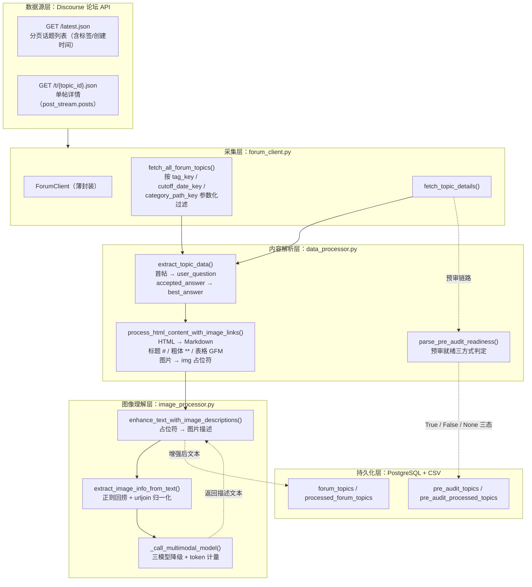
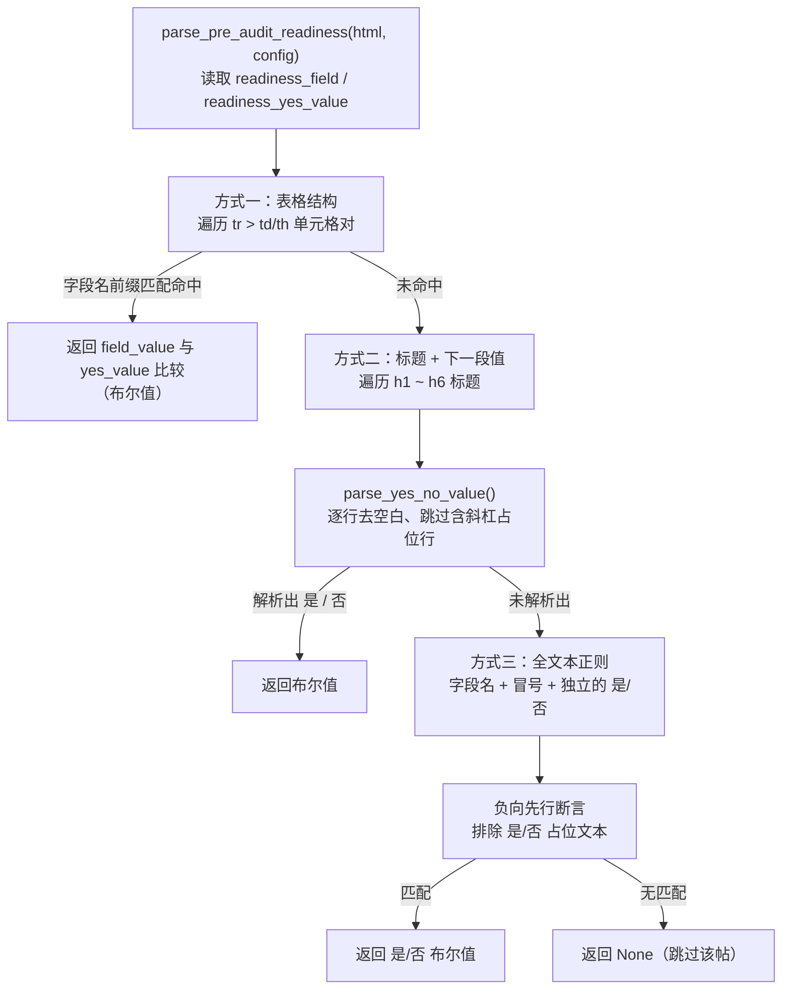
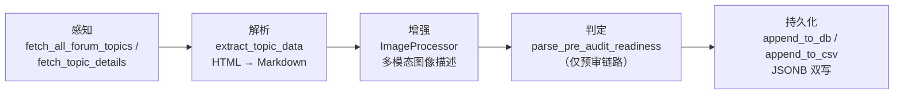

# 论坛内容解析与预审就绪判定

> 本页深度剖析 `src/ForumBot/data_processor.py` 中的**内容解析面**与 `src/ForumBot/image_processor.py` 的**图像理解面**，即整个论坛问答机器人的"数据摄入与语义规范化"层。难度：Intermediate。阅读本页前，建议先通读 [4-monitor-orchestrator.md](../论坛问答自动化/4-monitor-orchestrator.md) 以理解两条业务链路如何消费本层的产物。

---

## 1. 项目定位与核心价值

`DataProcessor` 在 wiki 的第 13 页（PostgreSQL 权威存储与 CSV 落盘）中已作为"持久化层"被整体介绍；本页则聚焦于它另一半、却同样关键的职责——**把 Discourse 论坛以 HTML 形态返回的帖子内容，转译成 LLM 可直接消费、图像可被视觉模型理解、预审闸门可机械判定的结构化中间表示**。Discourse 的帖子详情接口 `/t/{topic_id}.json` 中，每个帖子正文以 `post_stream.posts[].cooked` 字段携带**渲染后的 HTML**（`<h2>`、`<table>`、``、`<a class="lightbox">` 等），而非纯文本。若直接把这坨 HTML 塞给大模型，会出现三重灾难：表格与标题语义尽失（LLM 无法识别"评审点""属性签名"等结构化信息）、图片链接裸奔在文本流中（多模态信息完全丢失）、以及预审字段（"是否准备好AI预审（必选）"）被淹没在任意嵌套的标签里无法稳定提取。该模块正是为解决这三个痛点而生的"内容翻译器"。

其核心价值可以拆解为三点。其一是**语义保真的 HTML→Markdown 规范化**：`process_html_content_with_image_links()` 借助 BeautifulSoup 先做三类"定点手术"——`` 与 `lightbox` 链接替换为 `[img: (url)]` 占位符（保留图像在原文中的锚点位置）、`<table>` 替换为自定义 GFM Markdown 表格（含单元格转义、列宽补齐）、其余结构交给 `markdownify` 以 ATX 标题风格转 Markdown（`<h2>` → `##`、`<strong>` → `**`）。这一层决定了后续所有 LLM 消费文本的质量上限。其二是**视觉信号的二次增强**：`ImageProcessor` 用正则回捞 `[img: (url)]` 占位符，调用多模态大模型逐图生成文字描述，再把占位符替换为"图片描述"形式，使"纯文本 LLM"也能"看到"截图里的报错日志、配置界面与代码片段；用户头像等噪声图像则被特殊标记直接删除。其三是**预审就绪的三方式递进判定**：`parse_pre_audit_readiness()` 容忍 Discourse 表单 HTML 的多种结构变体（表格对 / 标题+段落 / 全文本冒号分隔），返回 `True / False / None` 三态，成为 AI 预审链路最重要的门控前置。

> 设计哲学：**"先规范化、后增强、再判定"的三级流水线**。规范化阶段只做无损的格式翻译（HTML→Markdown，语义不增不减），增强阶段才引入外部多模态模型（语义注入但可回退），判定阶段则只依赖纯规则（零模型调用、零幻觉）。把"贵"的视觉模型放在"必要"的环节，把"脆"的判定逻辑设计成"多路可回退"，是这一层最值得品味的工程取舍。

Sources: [data_processor.py](src/ForumBot/data_processor.py#L301-L347), [data_processor.py](src/ForumBot/data_processor.py#L350-L414), [image_processor.py](src/ForumBot/image_processor.py#L119-L147), [forum_client.py](src/ForumBot/forum_client.py#L5-L11)

---

## 2. 架构设计与模块划分

### 2.1 总体架构图

本层的输入是 Discourse API 的原始 JSON，输出是"已规范化的 Markdown 文本 + 图像视觉描述 + 预审就绪布尔判定"，最终汇入 PostgreSQL 与 CSV 双写。图像理解层被内容解析层**内嵌调用**（`extract_topic_data` 内部先做 HTML 转 Markdown，再对同一文本做图像描述增强），因此二者在依赖图上呈现为严格的"解析 → 增强"链式关系。



Sources: [data_processor.py](src/ForumBot/data_processor.py#L996-L1057), [data_processor.py](src/ForumBot/data_processor.py#L69-L97), [data_processor.py](src/ForumBot/data_processor.py#L100-L210), [monitor.py](src/ForumBot/monitor.py#L536-L625)

### 2.2 内容解析层：extract_topic_data 与 HTML 规范化

`extract_topic_data()` 是整个数据摄入的**语义编排函数**。它遍历每个帖子的详情 JSON，执行以下映射规则：

- **user_question**：取 `post_stream.posts[0]`（首帖）的 `cooked` 字段，先经 `process_html_content_with_image_links()` 转 Markdown，再交给 `image_processor.enhance_text_with_image_descriptions()` 做图像描述增强——首帖即"提问主体"，是后续注入检测、摘要、检索的全部素材。
- **best_answer**：遍历 `posts[1:]`，一旦发现 `post.get('accepted_answer', False)` 为真的帖子，其 `cooked` 内容即被记为最佳答案并 `break`（Discourse 的"已采纳回答"语义）；期间所有非空 `cooked` 内容按顺序累积为 `replies` 列表。
- **tags / created_at / title**：tags 从 dict 列表归一化为逗号分隔字符串，`llm_answer` 与 `summary_question` 预置为空串占位。

值得注意的细节是 `process_html_content_with_image_links()` 的**三层保护**：先用 `pd.isna(html_content)` 兼容 pandas 空值（`NaN`）；再复制一份 `soup`（`BeautifulSoup(str(soup), ...)`）避免原地修改污染原始对象；最后用 `re.sub(r'\n{3,}', '\n\n', ...)` 折叠多余空行，保证输出文本紧凑。表格处理被单独抽出为 `_html_table_to_markdown()`，它对每行 `tr` 提取非递归的 `th/td` 单元格、逐格转义管道符与反斜杠（`_escape_markdown_table_cell`）、按最长行补齐列宽并生成标准 GFM 表格——这是为了对抗 `markdownify` 对 `<table>` 的天生弱支持，确保 Redfish 评审帖中"属性签名 / 只读 / 属性描述"这类表格信息在 Markdown 化后仍然可被 LLM 结构性地读取。

Sources: [data_processor.py](src/ForumBot/data_processor.py#L996-L1057), [data_processor.py](src/ForumBot/data_processor.py#L301-L347), [data_processor.py](src/ForumBot/data_processor.py#L269-L298)

### 2.3 图像理解层：ImageProcessor 多模态增强

`ImageProcessor` 的定位是"**文本内图像的视觉翻译器**"，它围绕一个约定的占位符协议工作：上游 `process_html_content_with_image_links()` 把 `` 变为 `[img: (url)]`，本类则负责把这个协议闭环。`extract_image_info_from_text()` 用正则 `\[img: \((.*?)\)\]` 回捞所有占位符，并通过 `urljoin(base_url, match)` 把相对路径归一化为绝对 URL（默认基址 `https://discuss.openubmc.cn`，可配置覆盖）。

`process_image_content()` 的提示词**按上下文分化**：`user_question` 场景强调"提取截图中的文字信息，只保留来自截图的信息，不要总结或推测"（提问帖截图多为报错日志，需要忠实转录）；`best_answer` 场景则要求"分析技术内容、总结关键信息"（回答帖截图多为解决方案，需要提炼）。URL 中含 `user_avatar` 的图像直接返回哨兵值 `"USER_AVATAR"`，由 `enhance_text_with_image_descriptions()` 将对应占位符**整体删除**而非替换——头像对问答无信息价值，删除是最优策略。

模型调用层 `_call_multimodal_model()` 实现了一个**三模型降级链**：按 `config['image_processing']['model1/2/3']` 顺序依次尝试 `chat.completions.create`（OpenAI 兼容协议，消息体含 `text + image_url` 双模态内容），任一模型抛异常即记录日志并换下一个，最后一个也失败才向上抛出；每个成功响应若携带 `topic_id`，则通过模块级单例 `token_tracker.add_usage()` 精确计量该帖的视觉 token 消耗——这与 `ai_processor.py` 中文本 LLM 的计量走同一套账本。

Sources: [image_processor.py](src/ForumBot/image_processor.py#L10-L21), [image_processor.py](src/ForumBot/image_processor.py#L23-L44), [image_processor.py](src/ForumBot/image_processor.py#L46-L71), [image_processor.py](src/ForumBot/image_processor.py#L73-L117), [image_processor.py](src/ForumBot/image_processor.py#L119-L147)

### 2.4 预审就绪判定：三方式递进解析

`parse_pre_audit_readiness()` 是预审链路（`_check_pre_audit_topics`）的**第一道闸门**：只有帖子 HTML 中"是否准备好AI预审（必选）"字段解析为"是"，该帖才会进入 Redfish/MDB 结构化校验与回帖流程。字段名与"是"值均可配置（`pre_audit.readiness_field` / `pre_audit.readiness_yes_value`），并做了一次"去（必选）后缀"归一化得到 `core_field`，从而兼容带/不带"（必选）"两种写法。



三路策略的设计动机是对**不同发帖模板**的鲁棒性：方式一针对 Discourse 表单常用的 `table` 布局（`cells[0]` 为字段名、`cells[1]` 为值）；方式二针对 `<h2>字段</h2><p>…是…</p>` 的"标题+段落"模板，且遇到下一个标题即停止，避免越界读取无关字段；方式三则是最终兜底，用 `re.search` 匹配 `字段名\s*[：:]*\s*(是|否)`，其中负向先行断言 `(?![/／\w])` 是关键细节——它确保匹配到的是独立成值的"是/否"，而不是"是/否"这种含斜杠的占位说明。整个解析全程**不调用任何模型**，失败或异常统一返回 `None`（该帖被跳过，等待下轮），返回值三态在 `monitor.py` 中对应三种分支行为：`True` 继续处理、`False` 下轮重试、`None` 永久跳过。

Sources: [data_processor.py](src/ForumBot/data_processor.py#L350-L414), [monitor.py](src/ForumBot/monitor.py#L536-L625), [test_data_processor_pre_audit.py](tests/test_data_processor_pre_audit.py#L19-L87)

### 2.5 与知识库维护链路的解析对比（两条管线）

项目内存在**两条并行的帖子解析管线**，它们服务于不同的下游，形成鲜明的设计对照：

| 维度 | 论坛问答链路（本页，ForumBot） | 知识库维护链路（update_lightrag） |
|------|-------------------------------|-----------------------------------|
| 解析入口 | `DataProcessor.extract_topic_data()` | `ForumDataFetcher.extract_posts_data()` |
| HTML 策略 | BeautifulSoup 定点手术 + markdownify → **保留语义的 Markdown** | `soup.get_text()` → **纯文本**（丢弃标题/粗体/表格） |
| 图片处理 | `[img: (url)]` 占位 → 多模态描述 → 图片描述替换 | `update_lightrag/image_processor.py` 正则匹配原始图片 URL → 描述替换 |
| 头像过滤 | `USER_AVATAR` 哨兵删除 | 无 |
| token 计量 | 经 `token_tracker` 记账 | 无 |
| 目标消费者 | LLM 生成回答（需结构信息） | LightRAG 知识灌入（向量化，语义密度优先） |

这条对比揭示了本页模块的**不可替代性**：知识库管线只需要"可检索的文本"，所以用最廉价的 `get_text()`；而问答管线需要"可推理的结构化文本"，所以不惜引入多模态模型与 GFM 表格转换。同一个论坛数据源，因为下游消费方式不同，在两条管线中被翻译成两种完全不同粒度的中间表示——这是理解本模块设计边界的最佳切入点。

Sources: [forum_data_Fetcher.py](src/update_lightrag/forum_data_Fetcher.py#L32-L66), [image_processor.py](src/update_lightrag/image_processor.py#L75-L98)

---

## 3. 技术栈与核心工作流

### 3.1 技术栈总览

| 技术/库 | 在本模块中的角色 | 关键用法 |
|---------|-----------------|----------|
| `requests` | 论坛 API 拉取（详情 / 列表分页） | `timeout=30`、`verify_ssl` 可关、`request_delay` 限速 |
| `BeautifulSoup` (html.parser) | HTML 结构手术 | `find_all('tr')`、`replace_with(NavigableString(...))`、副本防污染 |
| `markdownify` | 通用 HTML→Markdown | `heading_style="ATX"`、`bullets="-"` |
| `re` | 占位符/字段提取 | `\[img: \((.*?)\)\]`、负向先行断言 `(?![/／\w])` |
| `pandas` | 空值兼容 | `pd.isna(html_content)` 判空 |
| `openai` (OpenAI 兼容) | 多模态图像理解 | `content=[{type:text},{type:image_url}]` |
| `pytz` | 时区归一化 | `pytz.utc.localize(cutoff_date)` |
| `psycopg2.extras` | JSONB 序列化 | `register_default_jsonb(globally=True)` |
| `urllib3` | 告警抑制 | `disable_warnings(InsecureRequestWarning)` |
| `token_tracker` | 视觉 token 计量 | 模块级单例 `add_usage(topic_id, ...)` |

Sources: [data_processor.py](src/ForumBot/data_processor.py#L1-L21), [image_processor.py](src/ForumBot/image_processor.py#L1-L8)

### 3.2 主链路工作流：感知 → 解析 → 增强 → 判定 → 持久化

本模块所处主链路可概括为五段流水，覆盖常规问答与预审两条业务线：



各阶段职责与降级语义：

| 阶段 | 代表函数 | 输入 → 输出 | 失败/降级策略 |
|------|----------|-------------|---------------|
| 感知 | `fetch_all_forum_topics` / `fetch_topic_details` | 配置参数 → 原始 JSON | 非 2xx 或请求异常记日志返回 `None`/空列表 |
| 解析 | `process_html_content_with_image_links` | `cooked` HTML → 规范 Markdown | `NaN`/非字符串原样返回；表格空行返回空串 |
| 结构化 | `extract_topic_data` | 详情 JSON → `{id, title, tags, user_question, best_answer, replies, ...}` | 无帖子内容跳过该帖；`accepted_answer` 缺失则 `best_answer` 为空 |
| 增强 | `enhance_text_with_image_descriptions` | Markdown → 含图片描述的 Markdown | 模型失败返回"图像内容分析失败"占位文本；头像整体删除 |
| 判定 | `parse_pre_audit_readiness` | 首帖 HTML → `True/False/None` | 解析异常返回 `None`（跳过该帖，不误判"是"） |
| 持久化 | `append_to_db` / `append_to_csv` | 结构化 dict → PostgreSQL/CSV | 表名白名单校验、`ON CONFLICT DO UPDATE` 幂等 upsert |

Sources: [data_processor.py](src/ForumBot/data_processor.py#L100-L210), [data_processor.py](src/ForumBot/data_processor.py#L702-L785), [data_processor.py](src/ForumBot/data_processor.py#L996-L1057), [monitor.py](src/ForumBot/monitor.py#L77-L132)

### 3.3 核心类/函数职责速览

| 符号 | 文件 | 职责边界 | 关键签名/行为 |
|------|------|----------|---------------|
| `DataProcessor.extract_topic_data` | data_processor.py | 帖子详情 → 结构化记录 | 首帖=提问、`accepted_answer`=最佳答案、内嵌调用图像增强 |
| `process_html_content_with_image_links` | data_processor.py（模块级） | HTML → 语义 Markdown | 图片/lightbox→占位符、表格→GFM、`markdownify` ATX |
| `_html_table_to_markdown` | data_processor.py（模块级） | 表格转 GFM | 单元格转义、列宽补齐、空表返回空串 |
| `parse_pre_audit_readiness` | data_processor.py（模块级） | 预审就绪三方式判定 | 表格对 / 标题+段 / 全文本正则，返回三态 |
| `fetch_all_forum_topics` | data_processor.py（模块级） | 分页拉取 + 标签/时间过滤 | 三个配置键均可参数化（支持预审专用键） |
| `ImageProcessor.extract_image_info_from_text` | image_processor.py | 回捞图片占位符 | 相对路径 `urljoin` 归一化，输出 `{url, original_tag}` |
| `ImageProcessor.process_image_content` | image_processor.py | 单图 → 文本描述 | 上下文分化提示词、`USER_AVATAR` 哨兵 |
| `ImageProcessor._call_multimodal_model` | image_processor.py | 三模型降级调用 | 失败换下一模型、`token_tracker` 记账 |
| `ImageProcessor.enhance_text_with_image_descriptions` | image_processor.py | 占位符 → 图片描述 | 头像删除、其余替换 |

Sources: [data_processor.py](src/ForumBot/data_processor.py#L417-L422), [data_processor.py](src/ForumBot/data_processor.py#L996-L1057), [image_processor.py](src/ForumBot/image_processor.py#L23-L147)

---

## 4. 典型代码示例（Showcase）

### 4.1 HTML → Markdown 规范化：先手术、再翻译

这段代码浓缩了本模块"定点手术 + 通用翻译"的核心理念——凡是 `markdownify` 处理不好的（图片、表格），先手工替换；凡是可以托管的（标题、列表、粗体），再交给通用库：

```python
def process_html_content_with_image_links(html_content):
    if pd.isna(html_content) or not isinstance(html_content, str):
        return html_content
    soup = BeautifulSoup(html_content, 'html.parser')
    soup_copy = BeautifulSoup(str(soup), 'html.parser')  # 副本，防污染

    # 1) 图片与 lightbox → 文本占位符（保留锚点位置）
    for img in soup_copy.find_all('img'):
        img_src = img.get('src')
        if img_src:
            img.replace_with(f"[img: ({img_src})]")
    for link in soup_copy.find_all('a', class_='lightbox'):
        href = link.get('href')
        if href:
            link.replace_with(f"[img: ({href})]")

    # 2) 表格 → 自定义 GFM Markdown（markdownify 的弱项）
    for table in soup_copy.find_all('table'):
        markdown_table = _html_table_to_markdown(table)
        table.replace_with(NavigableString(markdown_table))

    # 3) 其余结构交给 markdownify（ATX 标题 / 无序列表）
    text_content = md(str(soup_copy), heading_style="ATX", bullets="-")
    text_content = re.sub(r'\n{3,}', '\n\n', text_content).strip()
    return text_content
```

这段代码直接支撑了测试中"表格保持 GFM 格式""h2 标题保留 ## 标记""粗体保留 ** 标记"的断言，是整条问答链路文本质量的源头。

Sources: [data_processor.py](src/ForumBot/data_processor.py#L301-L347), [test_data_processor_pre_audit.py](tests/test_data_processor_pre_audit.py#L176-L218)

### 4.2 预审就绪判定：方式三（正则兜底）的精确性设计

方式三是三路解析中"含金量"最高的一路，其正则设计体现了对 Discourse 占位文本的深入理解——`（必选）是/否` 这种占位说明出现在标题行，若直接匹配"是/否"会得到错误判定，因此必须用负向先行断言排除：

```python
# 方式3：在所有文本中用正则查找（支持冒号分隔或换行分隔）
text = soup.get_text()
# 匹配模式：字段名后跟冒号或换行，然后是"是"或"否"
# 负向先行断言排除"是/否"等占位文本，确保匹配独立的值
pattern = rf'{re.escape(core_field)}\s*[：:]*\s*(是|否)(?![/／\w])'
match = re.search(pattern, text)
if match:
    return match.group(1) == yes_value
```

`core_field` 由配置字段名去掉"（必选）"后缀得到，`re.escape` 保证字段名中的任何正则元字符都被字面解释；`(?![/／\w])` 则确保"是/否"后的下一个字符不是斜杠（全角/半角）或单词字符——从而只匹配"是。"、"是\n"这类独立取值。此前的 `parse_yes_no_value()`（方式二内部）也做了同样的防御：逐行去除空白、跳过含 `/` 或 `／` 的行、剥掉反引号/星号/括号装饰后再与 `是/否` 比对。

Sources: [data_processor.py](src/ForumBot/data_processor.py#L363-L414), [test_data_processor_pre_audit.py](tests/test_data_processor_pre_audit.py#L24-L49)

### 4.3 图像描述增强：占位符闭环与头像过滤

`enhance_text_with_image_descriptions()` 是本模块与视觉模型之间的"协议兑现"：它把上游留下的 `[img: (url)]` 占位符替换为携带视觉语义的图片描述，同时用哨兵值优雅地处理噪声图像：

```python
for img_info in images:
    img_url = img_info['url']
    original_tag = img_info['original_tag']

    # 获取图像描述（内部走三模型降级链）
    description = self.process_image_content(img_url, context, topic_id)

    if description == "USER_AVATAR":
        # 用户头像：直接删除占位符（无信息价值）
        enhanced_text = enhanced_text.replace(original_tag, "")
    else:
        # 正常图像：占位符 → 携带描述的文本
        enhanced_description = f"[图片: {description}]"
        enhanced_text = enhanced_text.replace(original_tag, enhanced_description)
```

这段逻辑保证了两点：**文本长度与占位符一一对应**（每个 `[img: (...)]` 都会被恰好替换一次，不丢不重），以及**视觉成本被严格计量**（`process_image_content` 内部每成功一次调用即向 `token_tracker` 累加该 `topic_id` 的 prompt/completion/total token）。

Sources: [image_processor.py](src/ForumBot/image_processor.py#L119-L147), [image_processor.py](src/ForumBot/image_processor.py#L73-L117), [test_image_processor.py](tests/test_image_processor.py#L167-L204)

---

## 5. 学习与探索建议（Next Steps & Learning Path）

### 5.1 按"理解深度"推进的阅读路径

| 目标 | 建议动作 | 关联文件 |
|------|----------|----------|
| 理解解析层如何被消费 | 从 `_check_new_topics` 追踪 `extract_topic_data` → `append_to_db` 的调用链，看清"解析产物"如何成为 `forum_topics` 表的一行 | [monitor.py](src/ForumBot/monitor.py#L77-L132), [monitor.py](src/ForumBot/monitor.py#L611-L616) |
| 吃透预审就绪判定的调用方 | 阅读 `_check_pre_audit_topics` 的完整分支：`True` 继续 / `False` 重试 / `None` 跳过，以及 `pre_audit_tag` 等参数化键如何流入 `fetch_all_forum_topics` | [monitor.py](src/ForumBot/monitor.py#L536-L625), [test_data_processor_pre_audit.py](tests/test_data_processor_pre_audit.py#L90-L103) |
| 深挖多模态降级链 | 用 `test_call_multimodal_model_retry` 理解三模型切换的异常语义，并对比 `update_lightrag/image_processor.py` 的无计量版本 | [test_image_processor.py](tests/test_image_processor.py#L137-L165), [image_processor.py](src/update_lightrag/image_processor.py#L38-L73) |
| 对照另一条解析管线 | 对比 `forum_data_Fetcher.extract_posts_data`（纯文本）与本页 Markdown 规范化的差异，思考"下游决定中间表示粒度" | [forum_data_Fetcher.py](src/update_lightrag/forum_data_Fetcher.py#L32-L66) |
| 用测试反向理解契约 | 运行/阅读预审与图像处理单测，它们精确刻画了占位符协议、GFM 表格、三态判定的边界行为 | [test_data_processor_pre_audit.py](tests/test_data_processor_pre_audit.py), [test_image_processor.py](tests/test_image_processor.py) |
| 追踪视觉 token 的去向 | 从 `token_tracker.add_usage` 出发，看 `save_token_usage_to_db` 如何把视觉计量并入 `consume_tokens_topic` 表 | [token_tracker.py](src/ForumBot/token_tracker.py#L25-L40), [data_processor.py](src/ForumBot/data_processor.py#L880-L923) |

### 5.2 进阶探索问题

- **占位符协议的脆弱性**：`[img: (url)]` 与图片描述是两套私有约定。若某帖正文天然包含形如 `[img: (...)]` 的纯文本（而非 HTML 图片），`extract_image_info_from_text` 是否会误判？如何用原始 HTML 的 `src` 属性而非文本占位符来消除歧义？
- **判定的假阴性/假阳性**：`parse_pre_audit_readiness` 三路皆失败返回 `None` 意味着"永久跳过"。若论坛模板演化出第四种结构（如 `<input value="是">` 表单控件），`soup.get_text()` 仍能命中方式三吗？字段值带换行或全角冒号时正则是否失效？
- **视觉成本与质量权衡**：`USER_AVATAR` 哨兵只按 URL 子串判断。若 CDN 重写 URL 导致头像不再含 `user_avatar`，成本将如何失控？是否应引入白名单域名或尺寸启发式？
- **两条管线的语义一致性**：同一帖子在 ForumBot 被翻译成 Markdown、在 update_lightrag 被翻译成纯文本。若未来要让 LLM 回答引用"知识库中的表格数据"，两条管线的表示差异是否会成为对齐障碍？

---

## 🔗 关联模块与上下游

本页为局部模块解读，以下列出与"内容解析/图像理解"存在**直接调用关系**且应优先阅读的源码：

- [src/ForumBot/monitor.py](src/ForumBot/monitor.py) —— 唯一编排消费者：`_check_new_topics` 调用 `extract_topic_data`，`_check_pre_audit_topics` 调用 `parse_pre_audit_readiness`；本页所有解析产物都由它决定去向（落库 / 回复 / 跳过）。
- [src/ForumBot/forum_client.py](src/ForumBot/forum_client.py) —— 数据上游：`fetch_all_forum_topics` / `fetch_topic_details` 直接复用 `data_processor` 模块级函数，本页解析的 `cooked` HTML 全部来自此处。
- [src/update_lightrag/forum_data_Fetcher.py](src/update_lightrag/forum_data_Fetcher.py) —— 平行管线对照：同一数据源上的纯文本解析实现，用于理解"下游消费方式决定中间表示粒度"的设计分叉。
