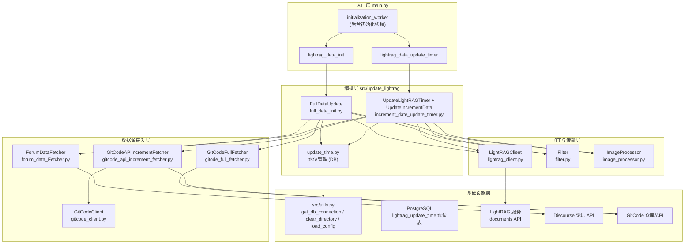
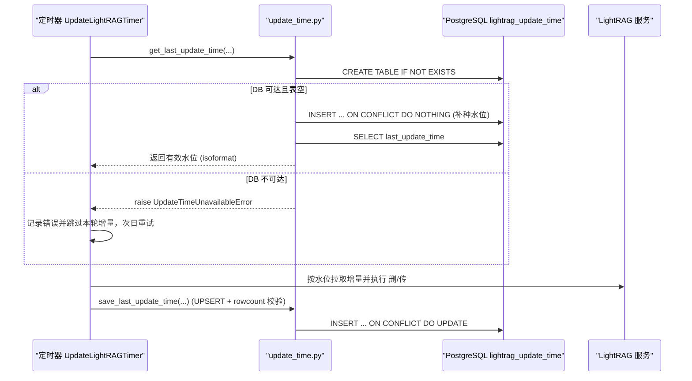
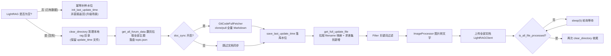
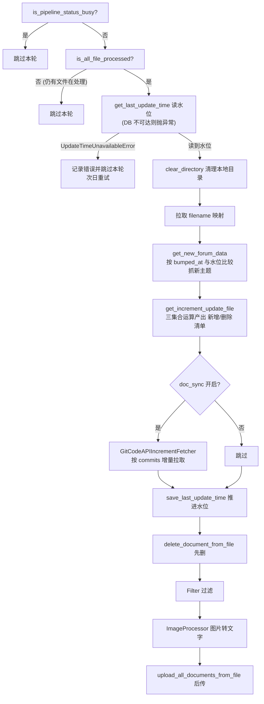

# 知识库全量初始化与增量更新

> 本文档深入剖析 `src/update_lightrag/` 子系统的三个核心文件——**全量初始化** (`full_data_init.py`)、**定时增量更新** (`increment_date_update_timer.py`)、**更新水位持久化** (`update_time.py`)，完整还原一套基于 Discourse 论坛 + GitCode 文档仓库 + LightRAG 向量服务构建的知识库「冷启动 → 持续保鲜」机制。

---

## 1. 项目定位与核心价值

### 1.1 背景与痛点

在开源硬件/固件生态（openUBMC）的社区运营场景中，知识沉淀通常分散在两类异构源头：**Discourse 技术论坛**（以「主题 + 帖子」形式承载问答、方案、排障记录）与 **GitCode 文档仓库**（以 Markdown 形式承载官方开发文档、架构说明）。若想构建一个可供 LLM 检索增强生成（RAG）使用的统一知识库，必须解决三个核心难题：

1. **异构数据归一化**——论坛数据是 JSON API 返回的半结构化数据，需要清洗 HTML、提取「问题 / 最佳答案 / 回复帖」结构；文档仓库则是散落的 Markdown 文件，两者最终都要变成 LightRAG 能消费的本地文件。
2. **全量与增量的双轨策略**——首次部署需要把全量历史数据灌入知识库（冷启动）；之后若每次运行都全量重灌，成本不可接受，必须依据**时间水位（watermark）**只拉取增量变更，并同步处理被删除/修改的文档。
3. **与外部服务的异步时序协调**——LightRAG 的文档上传是异步任务（上传返回 `track_id` 后由服务端后台索引），管道繁忙时删除/上传会互相干扰；而定时器在容器中每日执行，与全量初始化存在「表未建、水位未落库」的启动期竞态。

该子系统的核心价值，正在于用**「本地文件清单作为中间契约 + 数据库单行水位 + 管道忙碌自旋等待」**三件套，把上述复杂时序问题收敛为一个**幂等、可重试、失败安全**的数据管道。

### 1.2 核心特性

- **双轨数据管道**：`FullDataUpdate` 负责冷启动全量灌库（拉全量论坛 + GitCode clone + 全量上传）；`UpdateIncrementData` 负责每日增量保鲜（按 `bumped_at` 水位过滤主题 + GitCode API 提交比对 + 先删后传）。
- **DB 水位持久化**：`update_time.py` 将「上次更新时间」从易失的本地文件升级为 PostgreSQL 单行表 `lightrag_update_time`，并实现了**读路径自愈**（空表幂等补种再回读）与**失败即跳过**（DB 不可达时抛 `UpdateTimeUnavailableError`，宁缺毋滥）的双保险。
- **幂等设计贯穿始终**：`init_last_update_time` 仅在表空时种值、`ON CONFLICT DO NOTHING` 保证并发安全；`_save_mapping_to_file` 对 filename→id 映射采用「读旧档 → 合并 → 覆盖写」的增量合并策略。
- **管道冲突治理**：上传/删除前通过 `/documents/pipeline_status` 轮询等待管道空闲，避免与 LightRAG 异步索引管道互相踩踏。
- **内容增强链路**：图片经多模态模型转写为文本描述（`[图片: ...]`）、按关键词过滤无用文件，保证注入向量库的内容纯度。

Sources: [full_data_init.py](src/update_lightrag/full_data_init.py#L16-L27), [increment_date_update_timer.py](src/update_lightrag/increment_date_update_timer.py#L21-L28), [update_time.py](src/update_lightrag/update_time.py#L1-L14)

---

## 2. 架构设计与模块划分

### 2.1 总体架构与模块依赖图



**架构分层解读**：

- **入口层**：`main.py` 的 `initialization_worker` 是唯一驱动点，按严格顺序执行「LightRAG 数据初始化 → 服务初始化 → 定时器启动」。注意全量初始化**必须**先于定时器启动，这为 `update_time.py` 中「定时器在全量初始化返回成功后才启动，不存在与全量拉取并发」的推断提供了前提。
- **编排层**：`FullDataUpdate` 与 `UpdateIncrementData` 是两条数据管道的总指挥，它们**不直接访问任何数据源**，而是装配下层组件并以固定顺序编排调用；`update_time.py` 则作为独立的水位服务被两个编排器共同依赖。
- **数据源接入层**：分为论坛侧（`ForumDataFetcher`）与文档侧（全量走 `GitCodeFullFetcher` 的 Git clone/pull，增量走 `GitCodeAPIIncrementFetcher` + `GitCodeClient` 的 HTTP API）。两套 Git 策略的取舍，本质是「带宽换简单」与「API 换精准」的权衡。
- **加工与传输层**：`LightRAGClient` 封装全部 LightRAG REST 交互（上传/删除/分页查询/管道状态）；`Filter` 做关键词净化；`ImageProcessor` 用多模态模型把图片 URL 原位替换为文字描述。
- **基础设施层**：`src/utils.py` 提供 DB 连接（含重试指数退避）、目录清理、配置加载等公共能力，避免各模块重复造轮子。

Sources: [main.py](main.py#L300-L326), [full_data_init.py](src/update_lightrag/full_data_init.py#L16-L27), [increment_date_update_timer.py](src/update_lightrag/increment_date_update_timer.py#L204-L226), [utils.py](src/utils.py#L11-L45)

### 2.2 编排层详解：两条管道的分工

| 维度 | 全量初始化 `FullDataUpdate` | 增量更新 `UpdateIncrementData` |
|---|---|---|
| 触发时机 | 服务启动 `initialization_worker` 一次性执行 | `schedule` 每日 `18:00 UTC`（东八区 02:00） |
| 论坛数据获取 | 翻页拉取**全部**主题 | 依据水位过滤 `bumped_at > last_update_time` 的主题，遇早于水位即停 |
| 文档数据获取 | `GitPython` clone/pull 全量 Markdown | GitCode API 按提交时间增量比对 |
| 变更判定 | 文件夹 vs 映射文件求**差集**（只新增） | 三集合求**交集/差集**（同时产出新增与删除） |
| 上传策略 | 全量上传 | **先删后传**（先删 `delete_rag_files_id`，再传 `new_rag_files`） |
| 管道状态 | 轮询等待空闲后批量上传 | 入口先查 `is_pipeline_status_busy`，忙碌直接跳过本轮 |

Sources: [full_data_init.py](src/update_lightrag/full_data_init.py#L93-L127), [increment_date_update_timer.py](src/update_lightrag/increment_date_update_timer.py#L159-L201), [increment_date_update_timer.py](src/update_lightrag/increment_date_update_timer.py#L215-L226)

### 2.3 水位服务详解：`update_time.py` 的设计哲学

`update_time.py` 是本子系统中最「精致」的模块，其注释（docstring）本身就是一部设计文档。它的核心设计理念可以概括为三条：

> **设计理念一：表所有权收归单模块（Single Ownership）。**
> 全量初始化可能在 `ForumMonitor.create_tables` 之前运行，此时 `lightrag_update_time` 表尚不存在。因此读写路径都先调用 `_ensure_table()` 执行 `CREATE TABLE IF NOT EXISTS` 自建表，消除跨模块的启动时序耦合。

> **设计理念二：读路径自愈，但绝不回退假水位（Fail-safe, no silent fallback）。**
> 升级场景下，LightRAG 已有数据但水位未落库，定时任务首跑将读不到时间。`get_last_update_time` 在空表时**幂等补种**（种值 = `config['last_update_time']` 迁移水位或 `now()`）再回读，保证 DB 可达时必返回有效水位；但若 DB 连接失败/查询异常，则抛出 `UpdateTimeUnavailableError` 而非回退某个旧默认值——因为错误的老水位会触发大范围重复拉取，掩盖生产故障。

> **设计理念三：落库必校验影响行数（Verified Writes）。**
> `save_last_update_time` 的 UPSERT 用 `cursor.rowcount != 1` 作为成败判据并 `rollback`，杜绝「表存在但无 id=1 行时 0 行受影响却报成功」的静默数据丢失。



Sources: [update_time.py](src/update_lightrag/update_time.py#L17-L32), [update_time.py](src/update_lightrag/update_time.py#L95-L162), [update_time.py](src/update_lightrag/update_time.py#L165-L232), [increment_date_update_timer.py](src/update_lightrag/increment_date_update_timer.py#L173-L179)

### 2.4 加工与传输层的关键实现细节

- **`LightRAGClient`**：所有与 LightRAG 的交互都收敛于此。其中 `get_filename_id_mapping_from_lightrag` 通过 `/documents/paginated` 分页拉取全量文档并增量合并进本地 `files_id_mapping.json`；`is_all_file_processed` 检查 `status_counts` 中是否还有 `pending`/`processing`；`is_lightrag_empty` 用 `pagination.total_count == 0` 判定冷启动条件；`wait_for_pipeline_status_not_busy` 则在批量操作前自旋等待管道空闲。
- **`ForumDataFetcher`**：论坛 JSON 的清洗核心在 `extract_posts_data`——用 BeautifulSoup 剥离 HTML 为纯文本、规整多余换行、抽取外链，并保留 `topic_accepted_answer` / `accepted_answer` 标记以识别「最佳答案」。`get_one_topic_content` 将主题标题清洗为安全文件名（140 字符截断、非法字符替换为下划线），最终生成 `{safe_title}_{topic_id}_topic.json` 落盘。
- **`Filter` 与 `ImageProcessor`**：`Filter` 依据 `filter_keywords` 从 `new_rag_files` 清单中剔除含关键词的文件名；`ImageProcessor` 用 OpenAI 兼容接口的多模态模型链（`model1/2/3` 依次降级重试）把图片 URL 原位替换为 `[图片: 描述]`，使图片信息可被检索。

Sources: [lightrag_client.py](src/update_lightrag/lightrag_client.py#L221-L266), [lightrag_client.py](src/update_lightrag/lightrag_client.py#L268-L381), [forum_data_Fetcher.py](src/update_lightrag/forum_data_Fetcher.py#L32-L137), [filter.py](src/update_lightrag/filter.py#L8-L45), [image_processor.py](src/update_lightrag/image_processor.py#L38-L154)

---

## 3. 技术栈与核心工作流

### 3.1 技术栈一览

| 层次 | 技术选型 | 用途 |
|---|---|---|
| 调度 | `schedule` 库（进程内 cron） | 每日固定时刻触发增量任务 |
| 论坛数据源 | Discourse JSON API（`/latest.json`、`/t/{id}.json`）+ `requests` + `BeautifulSoup` | 拉取并清洗主题/帖子 |
| 文档数据源 | GitPython（全量 clone/pull）、GitCode API v5（增量 commits/compare/contents） | 同步 Markdown 文档 |
| 向量服务 | LightRAG REST API（`/documents/upload`、`/documents/delete_document`、`/documents/paginated`、`/documents/pipeline_status`） | 文档入库、删除、状态查询 |
| 图像增强 | OpenAI 兼容接口（多模态模型链） | 图片 → 文字描述 |
| 持久化 | PostgreSQL + `psycopg2`（含连接池） | 水位单行表、映射文件缓存 |
| 日志 | `RotatingFileHandler` 轮转日志 | 全链路可观测 |

Sources: [increment_date_update_timer.py](src/update_lightrag/increment_date_update_timer.py#L1-L17), [gitcode_client.py](src/update_lightrag/gitcode_client.py#L13-L26), [image_processor.py](src/update_lightrag/image_processor.py#L7-L19), [logging_config.py](src/ForumBot/logging_config.py#L7-L40)

### 3.2 全量初始化主链路（冷启动）



**关键细节**：全量路径的 `clear_directory` 传入 `update_time` 文件路径作为 `ignore_file`——因为 `clear_directory` 只删除非忽略文件，`update_time` 旧文件被跳过，但新版本中真正的水位已落库 DB，本地文件仅作兼容占位。`get_full_update_file` 内部先调用 `get_filename_id_mapping_from_lightrag` 拿到服务端全部文件的 id 映射，再通过「文件夹文件集合 − 映射文件集合」的差集运算定位新增文件并写入 `new_rag_files` 清单。

Sources: [full_data_init.py](src/update_lightrag/full_data_init.py#L93-L127), [full_data_init.py](src/update_lightrag/full_data_init.py#L45-L91), [utils.py](src/utils.py#L152-L166), [lightrag_client.py](src/update_lightrag/lightrag_client.py#L306-L338)

### 3.3 增量更新主链路（每日保鲜）



**核心算法：`get_increment_update_file` 的三集合运算**——这是增量系统最精妙的部分：

1. `folder_files`：本地 `rag_data_dir` 中现存的所有 `*topic.json` 文件（**增量抓取后**的新数据）；
2. `all_topic_file_names_set`：`get_all_forum_topics_name_file` 生成的「论坛当前全部主题文件名」清单；
3. `mapped_files`：LightRAG 服务端映射文件中所有 `*topic.json` 文件名。

则**待删除文件 = (folder_files ∩ mapped_files) ∪ (mapped_files − all_topic_file_names_set)**。前者是「已上传但本次没被抓取（可能已过期）」的文件，后者是「服务端有、但论坛已不存在」的孤儿文件——两者都映射回 id 写入 `delete_rag_files_id`，在 `update_lightrag_task` 中被 **先于** 上传执行，从而保证 LightRAG 侧与论坛现状最终一致。

Sources: [increment_date_update_timer.py](src/update_lightrag/increment_date_update_timer.py#L75-L157), [increment_date_update_timer.py](src/update_lightrag/increment_date_update_timer.py#L159-L201), [increment_date_update_timer.py](src/update_lightrag/increment_date_update_timer.py#L30-L73)

### 3.4 核心类在流程中的角色对照

| 核心类 | 所属文件 | 在流程中的角色 |
|---|---|---|
| `FullDataUpdate` | full_data_init.py | 冷启动总指挥：判空 → 清目录 → 拉全量 → 落水位 → 上传 → 轮询完成 |
| `UpdateIncrementData` | increment_date_update_timer.py | 增量总指挥：判管道 → 读水位 → 抓增量 → 三集合求差 → 先删后传 |
| `UpdateLightRAGTimer` | increment_date_update_timer.py | `schedule` 调度外壳，每日 `18:00 UTC` 触发 `update_lightrag_task` |
| `update_time` 模块函数 | update_time.py | 水位 CRUD：`save` / `init` / `get` + `_ensure_table` 表所有权 |
| `ForumDataFetcher` | forum_data_Fetcher.py | 论坛数据接入：翻页、HTML 清洗、topic.json 落盘 |
| `LightRAGClient` | lightrag_client.py | LightRAG 网关：上传/删除/分页映射/状态查询/管道等待 |
| `Filter` / `ImageProcessor` | filter.py / image_processor.py | 上游加工：关键词净化 + 图片多模态转写 |
| `GitCodeFullFetcher` | gitode_full_fetcher.py | 文档全量同步（GitPython clone/pull） |
| `GitCodeAPIIncrementFetcher` | gitcode_api_increment_fetcher.py | 文档增量同步（commits + compare + contents） |

Sources: [full_data_init.py](src/update_lightrag/full_data_init.py#L16-L27), [increment_date_update_timer.py](src/update_lightrag/increment_date_update_timer.py#L21-L28), [increment_date_update_timer.py](src/update_lightrag/increment_date_update_timer.py#L204-L226)

---

## 4. 典型代码示例

### 4.1 全量初始化主入口：`update_full_data`

```python
def update_full_data(self):
    logger.info("开始初始化LightRAG数据")
    # 检查LightRAG是否为空，若不为空则不进行初始化
    if not self.lightrag_client.is_lightrag_empty(self.config['retrieval']['base_url']):
        logger.info("LightRAG不为空，不进行初始化")
        # 升级场景：lightrag 已有数据但水位未落库（全量初始化提前返回、
        # 跳过了下方的 save_last_update_time）。此处幂等补种水位，使定时
        # 任务首跑即可读到上次更新时间，避免「读取不到上次更新时间」。
        init_last_update_time(self.config)
        return

    clear_directory(self.config['lightrag_paths']['lightrag_root_dir'],
                    self.config['lightrag_paths']['update_time'])
    self.get_all_forum_data()  # 获取所有论坛数据
    doc_sync_enabled = self.config.get('doc_sync')
    if doc_sync_enabled is True:
        logger.info("文档同步功能启用")
        self.git_fetcher.fetch_and_save_all_files()
    save_last_update_time(self.config['lightrag_paths']['update_time'], self.config)
    self.get_full_update_file()
    self.filter.filter_upload_files()
    self.image_processor.process_image_from_files(self.config['lightrag_paths']['new_rag_files'])
    self.lightrag_client.upload_all_documents_from_file(self.config['lightrag_paths']['new_rag_files'],
                                                        self.config['retrieval']['base_url'])
    while True:
        if self.lightrag_client.is_all_file_processed(self.config['retrieval']['base_url']):
            logger.info("所有文件处理完成")
            clear_directory(self.config['lightrag_paths']['lightrag_root_dir'],
                    self.config['lightrag_paths']['update_time'])
            break
        else:
            time.sleep(5)
```

这段代码展示了该系统的**门面式编排风格**：主流程不做任何数据操作，而是以固定的「判空 → 清理 → 拉取 → 落水位 → 生成清单 → 过滤 → 图片增强 → 上传 → 轮询确认」顺序调用装配好的组件，每个步骤的失败点都有明确的日志出口。

Sources: [full_data_init.py](src/update_lightrag/full_data_init.py#L93-L127)

### 4.2 增量更新的失败安全读取水位

```python
# 先读水位，再清目录：DB 不可用时直接跳过本轮，避免清空目录却无法补数据。
# 读路径自愈：表空时 get 内部幂等补种水位（config 迁移水位或 now()）再回读，
# 不再依赖 config['last_update_time'] 键（缺失即 KeyError）；DB 不可达则抛
# UpdateTimeUnavailableError 由下方跳过本轮、次日重试。
try:
    update_time = datetime.fromisoformat(
        get_last_update_time(self.config['lightrag_paths']['update_time'],
                             None, self.config))
except UpdateTimeUnavailableError as e:
    logger.error(f"{e}；跳过本轮增量更新，待下一轮重试")
    return

# 读水位成功后才清理文件夹（此前不清目录，避免清空后无法补数据）
clear_directory(self.config['lightrag_paths']['lightrag_root_dir'],
                self.config['lightrag_paths']['update_time'])
```

「**先读水位、再清目录**」的顺序是一个值得称道的健壮性设计：若 DB 不可用，宁可整轮跳过也**绝不**先清空本地目录——因为清空后再抓数据必然失败，会造成「本地数据已丢、服务端无法补数据」的最坏局面。

Sources: [increment_date_update_timer.py](src/update_lightrag/increment_date_update_timer.py#L169-L183)

### 4.3 水位的读路径自愈

```python
# 读路径自愈：空表对应「启动补种未落库」的升级场景缺陷目标。
# 此处幂等补种水位（种值与 init_last_update_time 完全一致：
# config 迁移水位 or now()）再回读，保证只要 DB 可达就必返回有效水位。
if not (result and result[0]):
    initial_value = config.get('last_update_time') or datetime.now(timezone.utc)
    logger.info("数据库中无更新时间记录，定时任务侧幂等自补种水位")
    cursor.execute("""
        INSERT INTO lightrag_update_time (id, last_update_time, updated_at)
        VALUES (1, %s, CURRENT_TIMESTAMP)
        ON CONFLICT (id) DO NOTHING
    """, (initial_value,))
    conn.commit()
    cursor.execute("""
        SELECT last_update_time FROM lightrag_update_time WHERE id = 1
    """)
    result = cursor.fetchone()
```

`get_last_update_time` 把「读」与「自愈补种」耦合进同一条路径，配合 `init_last_update_time` 的启动期补种，形成**双保险**：启动期 `init` 尽量提前落库；若因任何原因错过，定时任务首跑时 `get` 仍能自愈。两者种值表达式与幂等性完全一致（`config` 迁移水位 or `now()`），保证无论哪条路径先执行，最终水位语义不冲突。

Sources: [update_time.py](src/update_lightrag/update_time.py#L203-L220), [update_time.py](src/update_lightrag/update_time.py#L95-L119)

---

## 5. 学习与探索建议

### 5.1 按知识点推荐阅读路径

| 你的目标 | 建议切入的源码位置 | 配套理解 |
|---|---|---|
| 理解冷启动全链路 | `full_data_init.py` 的 `update_full_data` 与 `get_full_update_file` | 结合 `lightrag_client.py` 的 `is_lightrag_empty` / `get_filename_id_mapping_from_lightrag` / `is_all_file_processed` 对照阅读 |
| 理解增量算法 | `increment_date_update_timer.py` 的 `get_increment_update_file` | 重点推演三集合（`folder_files` / `all_topic_file_names_set` / `mapped_files`）的交差运算；配合 `forum_data_Fetcher.py` 的 `get_all_forum_topics_name_file` |
| 理解水位健壮性 | `update_time.py` 全文（仅 232 行，建议逐行精读） | 对照 `utils.py` 的 `get_db_connection`（重试退避）与 `main.py` 的 `initialization_worker`（时序前提） |
| 理解管道并发治理 | `lightrag_client.py` 的 `wait_for_pipeline_status_not_busy` / `is_pipeline_status_busy` | 结合 `delete_document_from_file` 与 `upload_all_documents_from_file` 中的调用点 |
| 理解文档双轨同步 | `gitode_full_fetcher.py` vs `gitcode_api_increment_fetcher.py` 对比阅读 | 注意全量用 Git 协议、增量用 HTTP API 的取舍动机 |
| 理解内容增强 | `image_processor.py` 的模型链降级逻辑 + `filter.py` | 观察 `new_rag_files` 清单如何在这两个模块间流转 |

### 5.2 进阶探索方向

- **时序推演题**：若 `ForumMonitor.create_tables` 未执行而全量初始化先跑，水位如何落库？（答案藏于 `_ensure_table` 与 `save_last_update_time` 的 UPSERT。）
- **并发安全题**：`init_last_update_time` 与 `get_last_update_time` 的补种并发执行时，`ON CONFLICT DO NOTHING` 如何保证只写入一行？
- **故障演练**：将 PostgreSQL 停掉后触发定时器，观察 `UpdateTimeUnavailableError` 如何让整轮任务优雅跳过而非破坏本地数据。

---

## 🔗 关联模块与上下游

本模块属于「知识库检索系统」的**数据写入侧**，与其存在直接调用关系的源码文件（保持克制，仅列最关键三个）：

- **[main.py](main.py#L126-L161)**：上游唯一驱动者——`lightrag_data_init` 与 `lightrag_data_update_timer` 分别实例化 `FullDataUpdate` 与 `UpdateLightRAGTimer`，并保证全量先于定时器启动的时序。
- **[src/utils.py](src/utils.py#L11-L45)**：基础设施依赖——`get_db_connection`（水位 DB 连接，含重试退避）、`clear_directory`（带 ignore_file 的目录清理）、`load_config` 均被三个核心文件共用。
- **[src/ForumBot/rag_api.py](src/ForumBot/rag_api.py#L8)**：同侧的**读取方**——直接 import `LightRAGClient` 暴露 RAG 查询 API，与本模块共享同一 LightRAG 服务实例的语义约定（`/documents/paginated` 等端点契约），是理解「写侧保鲜、读侧检索」闭环的下一站。
