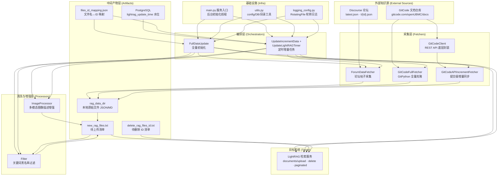
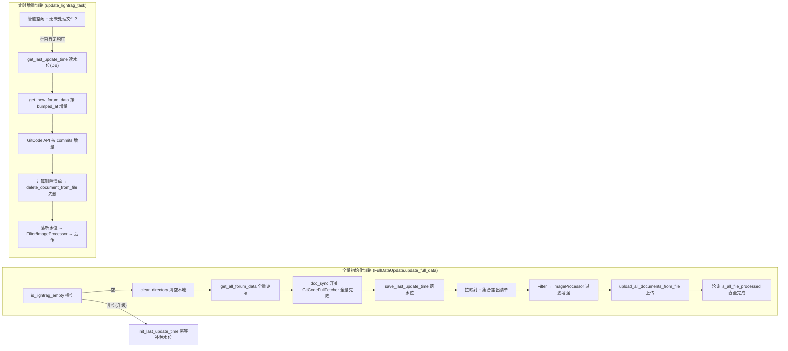

# 知识源采集与过滤管道

> **难度**: Intermediate · **章节**: 知识库检索系统
> **核心职责**: 从异构知识源（Discourse 技术论坛 + GitCode 文档仓库）持续采集原始内容，经清洗、过滤、多模态图像增强后，以「增量优先、全量兜底」的方式同步进 LightRAG 检索索引。

---

## 1. 项目定位与核心价值

### 1.1 诞生的背景与要解决的痛点

该管道是知识库检索系统（LightRAG）的**数据供给侧**。检索系统本身不产生内容，它依赖一套自动化管道将「人类撰写的问答」与「官方维护的技术文档」持续注入索引。这两类知识源的形态差异极大：论坛侧是 Discourse 风格的 JSON API（`latest.json` 分页列表 + 单帖 `t/{id}.json` 详情，正文为 HTML 渲染后的 `cooked` 字段）；文档侧是托管在 GitCode 上的 Markdown 仓库（`openUBMC/docs`）。若为两者各写一套一次性脚本，将面临以下结构性难题：

- **全量 vs 增量的双轨策略**：首次部署需要全量初始化，而日常运行只能基于时间水位做增量同步，否则会耗尽 API 配额并产生海量重复写入。
- **删除的闭环同步**：源端下线的帖子/文档，必须能定位其在 LightRAG 中的文件 ID 并删除，否则检索库会出现「幽灵条目」。
- **内容噪声**：论坛 HTML 正文含大量标签、链接、机器人自动回复（`api_username` 发布的无采纳回复需剔除）；文档目录中存在 `images` 等应跳过的黑名单目录。
- **多模态信息损失**：论坛帖子中的截图（错误日志、配置界面、代码片段）对检索语义至关重要，但纯文本索引无法理解图片——必须由多模态模型将图片转译为文字描述后再入索引。

### 1.2 核心特性与设计目标

该管道并非简单的一堆爬虫脚本，而是一个**「采集 — 落盘 — 清单化 — 过滤/增强 — 同步」的可编排数据流**。其核心特性可归纳为四点：

1. **统一文件名规约（Contract by Filename）**：无论来自论坛还是文档仓库，落盘文件都遵循可预测的命名规则——论坛文件为 `{安全标题}_{topic_id}_topic.json`，文档文件将 `docs/...` 路径中的 `/` 替换为 `_`。这一规约使得后续的映射、过滤、上传、删除全部可以围绕文件名进行集合运算，而无需维护复杂的元数据表。
2. **水位驱动的增量同步（Watermark-driven Increment）**：以 PostgreSQL 中的 `lightrag_update_time` 表为单一水位源，论坛侧用 `bumped_at` 字段与水位比较，文档侧用 `commits?since=` 接口获取水位之后的提交，再逐提交 diff 出变更文件。
3. **清单贯穿全流程（Manifest-driven Pipeline）**：`new_rag_files.txt`（待上传清单）与 `delete_rag_files_id.txt`（待删除 ID 清单）是管道各阶段的唯一输入输出契约——采集器产出文件并追加清单，过滤器改写清单，图像增强器按清单处理文件，最后上传器按清单提交。
4. **幂等与自愈（Idempotent & Self-healing）**：水位落库使用 UPSERT 并校验影响行数，读路径在空表时自动补种水位；图像处理配置了 3 个模型顺序 fallback；管道繁忙时增量任务主动跳过本轮。

> 设计理念：**「文件名即契约、清单即状态」**。管道刻意避免维护复杂的持久化索引，而是把中间状态暴露为磁盘上的清单文件——这让整条链路可以被任意重跑、被运维直接审视，也使得每个环节都能独立调试与回滚。

Sources: [full_data_init.py](src/update_lightrag/full_data_init.py#L93-L127), [increment_date_update_timer.py](src/update_lightrag/increment_date_update_timer.py#L159-L201), [forum_data_Fetcher.py](src/update_lightrag/forum_data_Fetcher.py#L32-L66), [gitcode_api_increment_fetcher.py](src/update_lightrag/gitcode_api_increment_fetcher.py#L22-L87)

---

## 2. 架构设计与模块划分

### 2.1 总体架构图



### 2.2 采集层（Fetchers）：四种采集器的分工

采集层是管道的「感官」。四个类分别覆盖**论坛全量/增量**与**文档全量/增量**两条正交轴：

| 采集器 | 目标源 | 协议/手段 | 触发方式 | 关键方法 |
|---|---|---|---|---|
| `ForumDataFetcher` | Discourse 论坛 | HTTP + BeautifulSoup | 全量 & 增量共用 | `fetch_one_page_data` / `get_one_topic_content` |
| `GitCodeFullFetcher` | GitCode 仓库 | GitPython（clone/pull） | 全量初始化 | `fetch_and_save_all_files` |
| `GitCodeClient` | GitCode 仓库 | REST API（Bearer Token） | 增量底层 | `get_commits_since` / `get_compare_files` |
| `GitCodeAPIIncrementFetcher` | GitCode 仓库 | REST API 组合 | 定时增量 | `get_updated_files_by_commits` |

**ForumDataFetcher** 是论坛数据的中枢。它先通过 `latest.json` 分页拉取话题列表，再对每个话题调用 `t/{id}.json` 获取完整帖子流（`post_stream`）。在 `extract_posts_data` 中，HTML 正文 `cooked` 被 BeautifulSoup 转为纯文本（并规整多余换行），帖子内的 `<a href>` 链接被追加为 `links:` 后缀；在 `get_one_topic_content` 中，问题帖与回复帖被拆分，且**剔除 `api_username` 发布的未采纳机器人回复**、标记 `is_solution` 的采纳答案并记录其 `post_url` 作为 `best_answer_url`。落盘 JSON 的 schema 为 `{topic_id, question, topic_user_name, best_answer_url, reply_posts}`。文件名由标题清洗（去非法字符、`/`→`_`、截断 140 字符）+ 话题 ID 组成，保证唯一且可排序。

**GitCodeFullFetcher** 采用 Git 协议做全量快照：首次 `git clone --depth=1`，之后 `git pull` 更新；`traverse_markdown_files` 递归遍历 `base_path`（默认 `docs/zh/development`）下的全部 `.md` 文件，并在遍历时**剪枝 `skip_dirs` 黑名单**（默认 `images`）。文件内容被复制到 `rag_data_dir`，文件名以 `docs` 开头的相对路径替换 `/` 为 `_`，与论坛文件名规约保持一致。任务结束后通过 `delete_directory` 删除临时克隆目录，避免磁盘膨胀。

**GitCodeClient** 是对 GitCode REST API 的最小封装（注释明确「只保留增量更新需要的方法」）：`get_commits_since` 将时间戳规范化为 ISO-8601 后分页拉取提交列表（`per_page=100`，缺页即停）；`get_compare_files` 使用 `compare/{base}...{head}` 接口获取两次提交间的文件 diff，**仅保留 `.md` 后缀文件**，并对 429 限流做「重试 2 次、退避 30 秒」的容错。文件内容接口则处理 base64 编码解码。

**GitCodeAPIIncrementFetcher** 是文档增量的编排者：拿到水位时间后，先取 `get_commits_since` 得到提交列表，对每个提交取其父提交 SHA 调用 `get_compare_files` 得到变更文件集，再按 `base_path` 前缀与 `skip_dirs` 二次过滤，最终把文件划分为 `updated_files` 与 `deleted_files` 两个集合。更新文件被拉取内容落盘并追加进 `new_rag_files`，删除文件则借助 `files_id_mapping` 把本地文件名映射为远端文档 ID 追加进 `delete_rag_files_id`。**注意其设计取舍**：它不依赖仓库历史深度，而是逐提交调用 diff 接口，因此可以在不保留本地 Git 历史的前提下精确对齐远端状态。

Sources: [forum_data_Fetcher.py](src/update_lightrag/forum_data_Fetcher.py#L9-L148), [gitode_full_fetcher.py](src/update_lightrag/gitode_full_fetcher.py#L12-L196), [gitcode_client.py](src/update_lightrag/gitcode_client.py#L13-L174), [gitcode_api_increment_fetcher.py](src/update_lightrag/gitcode_api_increment_fetcher.py#L12-L223)

### 2.3 清洗与增强层（Processors）：让原始内容「可检索」

**Filter（关键词黑名单过滤）** 是极简实现：读取 `new_rag_files.txt` 中的每一行文件名，若命中 `filter_keywords` 列表中的任意子串则从清单中剔除，其余写回原文件。它是**清单改写器**而非文件删除器——被过滤的文件仍留在 `rag_data_dir`，只是不再进入上传清单，从而实现「一次性屏蔽特定话题，事后可在配置中恢复」的可逆语义。

**ImageProcessor（多模态图像增强）** 是管道中唯一调用 LLM 能力的环节。其核心思路是**用正则 `https?://[^\s]+?\.(?:png|jpg|jpeg|gif|bmp|webp)` 从文本中提取图片 URL，将每个 URL 原位替换为 `[图片: {多模态描述}]`** 文本。描述由 `_call_multimodel_model` 生成：消息体为 text + image_url 组合，依次尝试 `model_list` 中配置的 3 个模型，前一个失败自动切下一个，全部失败则回退为原始 URL（保留图片，不阻断管道）。`process_image_content_from_json_file` 会就地改写 topic.json 的 `question` 与 `reply_posts[].text` 字段；`process_image_from_files` 则按 `new_rag_files` 清单只处理 `topic.json` 结尾的文件——这再次体现了「清单贯穿」的设计。

> 设计理念：**增强是幂等的文本改写**。ImageProcessor 不维护任何状态，对同一文件重复执行只会把已生成的 `[图片: ...]` 文本当作普通文本处理（正则只匹配裸 URL），因此管道重跑是安全的。

Sources: [filter.py](src/update_lightrag/filter.py#L4-L45), [image_processor.py](src/update_lightrag/image_processor.py#L7-L154)

### 2.4 编排层（Orchestrators）：全量与增量的两条主流程

**FullDataUpdate** 承载「首次全量初始化」：先检查 LightRAG 是否为空（`is_lightrag_empty`），非空则跳过初始化并幂等补种水位（升级场景）；为空则清空本地目录 → 全量拉论坛 → 按 `doc_sync` 开关决定是否全量克隆文档仓库 → 落水位 → 从 LightRAG 拉取文件名↔ID 映射 → 与本地目录做集合差（`compare_folder_with_mapping`）得到新增文件清单 → 过滤 → 图片增强 → 批量上传 → **轮询 `is_all_file_processed` 直至全部处理完成**，最后清理本地目录。

**UpdateIncrementData + UpdateLightRAGTimer** 承载「定时增量」：`schedule` 库按 `timer.schedule_interval` 配置每天触发。`update_lightrag_task` 的防抖前置检查有两个：管道状态忙（`is_pipeline_status_busy`）或存在未处理文件（`is_all_file_processed` 为 False）时直接跳过本轮。随后**先读水位再清目录**（DB 不可用时抛 `UpdateTimeUnavailableError` 跳过本轮，避免「清空目录却补不回数据」），然后增量拉论坛（按 `bumped_at > last_update_time` 过滤）、增量拉文档、落水位、**先删后传**、过滤、增强、上传。注意 `get_new_forum_data` 对置顶帖（`pinned`）的跳过处理，以及论坛与文档增量共用同一个水位时间戳。

Sources: [full_data_init.py](src/update_lightrag/full_data_init.py#L16-L127), [increment_date_update_timer.py](src/update_lightrag/increment_date_update_timer.py#L21-L226), [main.py](main.py#L126-L161)

### 2.5 中间产物层：管道状态的外化

| 产物 | 生成者 | 消费者 | 用途 |
|---|---|---|---|
| `rag_data_dir` 原始文件 | 四个采集器 | Filter / ImageProcessor / LightRAGClient | 统一的落盘目录，文件名即契约 |
| `new_rag_files.txt` | 采集器/`compare_folder_with_mapping` | Filter → ImageProcessor → 上传器 | 待上传清单，逐阶段改写 |
| `delete_rag_files_id.txt` | 增量采集器 / 集合差运算 | 删除器 | 待删除的远端文档 ID 清单 |
| `files_id_mapping.json` | `get_filename_id_mapping_from_lightrag` | 增量采集器 | 本地文件名 → 远端文档 ID 的桥 |
| `lightrag_update_time` 表 | `save_last_update_time` | `get_last_update_time` | 增量水位（PostgreSQL） |

`files_id_mapping.json` 的维护是一个亮点：`get_filename_id_mapping_from_lightrag` 通过 `/documents/paginated` 接口分页（`page_size` 从配置读取且强制下限 10）拉取全部文档，`extract_file_path_id_mapping` 提取 `file_path → id` 映射，`_save_mapping_to_file` 采用**「读旧映射 → 合并新映射 → 全量覆盖写」**策略——这使得 LightRAG 上已删除的文档 ID 不会残留在映射中，保证删除清单的准确性。

Sources: [lightrag_client.py](src/update_lightrag/lightrag_client.py#L186-L266), [full_data_init.py](src/update_lightrag/full_data_init.py#L45-L91), [update_time.py](src/update_lightrag/update_time.py#L17-L92)

---

## 3. 技术栈与核心工作流

### 3.1 技术栈全景

| 层次 | 技术/库 | 用途 | 代表性代码 |
|---|---|---|---|
| HTTP 客户端 | `requests` | 论坛/GitCode API/上传 | `requests.get(...)` |
| HTML 解析 | `BeautifulSoup` (bs4) | 论坛 `cooked` 正文清洗 | `soup.get_text()` |
| Git 操作 | `GitPython` (git) | 文档全量 clone/pull | `git.Repo.clone_from` |
| 数据库 | `psycopg2` | 水位持久化（PostgreSQL） | `cursor.execute(UPSERT)` |
| 多模态 LLM | `openai` SDK（SiliconFlow 兼容） | 图片→文字描述 | `client.chat.completions.create` |
| 定时调度 | `schedule` | 每日增量触发 | `schedule.every(n).day.at('18:00')` |
| 配置/日志 | `yaml` + 标准 `logging` | 配置装载、轮转日志 | `load_config` / `RotatingFileHandler` |

### 3.2 执行主链路：采集 → 落盘 → 清单化 → 过滤/增强 → 同步



**全量链路**的语义是「重建」：清空本地 → 全量拉取 → 生成清单 → 上传并**同步等待**处理完成。其成功判定不是「请求发出」，而是「LightRAG 侧 `status_counts` 中 pending/processing 均为 0」——`is_all_file_processed` 通过分页接口的 `status_counts` 字段判断。这保证初始化结束时索引一定是完整可查的。

**增量链路**的语义是「补丁」：先读水位确定增量边界，论坛侧以 `bumped_at`（Discourse 的活跃时间）为准，文档侧以 `commits?since=` 为准；计算出的删除清单**先执行删除**（因为被替换的旧版本必须让位），随后更新文件走与全量相同的过滤、增强、上传路径。`update_lightrag_task` 内 `save_last_update_time` 在水位推进后立即执行，即使后续上传失败，下一轮也会以新水位为基准——这是一种**at-most-once 语义**（可能漏拉，但绝不重复拉取），配合下一轮的完整 diff 补齐。

### 3.3 核心类在流程中的角色对照

| 核心类 | 所在文件 | 在流程中的角色 | 关键契约 |
|---|---|---|---|
| `ForumDataFetcher` | `forum_data_Fetcher.py` | 论坛源感知器，产出 topic.json | 文件名 `{title}_{id}_topic.json` |
| `GitCodeFullFetcher` | `gitode_full_fetcher.py` | 文档全量快照器 | 仅 `.md`、跳过 `skip_dirs` |
| `GitCodeClient` | `gitcode_client.py` | 文档增量 API 门面 | `since` 时间、429 退避 |
| `GitCodeAPIIncrementFetcher` | `gitcode_api_increment_fetcher.py` | 文档增量编排器 | 产出 新增/删除 双清单 |
| `Filter` | `filter.py` | 清单改写器（可逆屏蔽） | 命中关键词即剔除 |
| `ImageProcessor` | `image_processor.py` | 多模态增强器（幂等） | URL → `[图片: 描述]` |
| `FullDataUpdate` | `full_data_init.py` | 全量编排器 | 探空 → 重建 → 等待完成 |
| `UpdateIncrementData` | `increment_date_update_timer.py` | 增量编排器 | 防抖 → 读水位 → 先删后传 |
| `LightRAGClient` | `lightrag_client.py` | 目标系统客户端 | 上传/删除/映射/状态轮询 |
| `update_time` 模块 | `update_time.py` | 水位持久化（UPSERT 幂等） | 空表自愈补种 |

Sources: [increment_date_update_timer.py](src/update_lightrag/increment_date_update_timer.py#L159-L201), [lightrag_client.py](src/update_lightrag/lightrag_client.py#L46-L108), [lightrag_client.py](src/update_lightrag/lightrag_client.py#L268-L304), [update_time.py](src/update_lightrag/update_time.py#L165-L232)

---

## 4. 典型代码示例

### 4.1 全量初始化主流程（编排层的「总开关」）

`FullDataUpdate.update_full_data` 完整展示了「探空 → 清目录 → 双源采集 → 落水位 → 出清单 → 过滤增强 → 上传 → 等待」的八段式流程。注意两处关键判断：`doc_sync` 开关隔离文档仓库同步（论坛为强制同步项）；`is_all_file_processed` 用轮询而非盲目 sleep 来保证「初始化即就绪」。

```python
def update_full_data(self):
    if not self.lightrag_client.is_lightrag_empty(self.config['retrieval']['base_url']):
        # 升级场景：已有数据则跳过重建，仅幂等补种水位
        init_last_update_time(self.config)
        return

    clear_directory(self.config['lightrag_paths']['lightrag_root_dir'],
                    self.config['lightrag_paths']['update_time'])
    self.get_all_forum_data()                       # ① 论坛全量
    if self.config.get('doc_sync') is True:          # ② 文档全量（可开关）
        self.git_fetcher.fetch_and_save_all_files()
    save_last_update_time(self.config['lightrag_paths']['update_time'], self.config)  # ③ 落水位
    self.get_full_update_file()                     # ④ 集合差 → 新增清单
    self.filter.filter_upload_files()               # ⑤ 关键词过滤
    self.image_processor.process_image_from_files(...)  # ⑥ 图像增强
    self.lightrag_client.upload_all_documents_from_file(...)  # ⑦ 上传
    while True:                                     # ⑧ 等待全部处理完成
        if self.lightrag_client.is_all_file_processed(...):
            clear_directory(...); break
        time.sleep(5)
```

Sources: [full_data_init.py](src/update_lightrag/full_data_init.py#L93-L127)

### 4.2 增量删除/更新的清单生成（集合运算的威力）

增量侧用**三次集合运算**就完成了「需删除」「需更新」的判定：`folder_files & mapped_files`（本地与远端交集 → 更新候选）、`mapped_files - all_topic_file_names_set`（远端有但论坛已下线 → 删除候选），并集即为 `files_to_delete`，再通过 `file_mapping` 翻译成远端文档 ID 落盘。

```python
common_files = folder_files & mapped_files                  # 交集
files_only_in_mapping = mapped_files - all_topic_file_names_set  # 差集
files_to_delete = common_files | files_only_in_mapping      # 并集
for filename in files_to_delete:
    if filename in file_mapping:
        files_to_delete_ids.append(file_mapping[filename])  # 翻译为远端 ID
```

Sources: [increment_date_update_timer.py](src/update_lightrag/increment_date_update_timer.py#L118-L145)

### 4.3 水位的幂等落库（UPSERT + 影响行数校验）

`save_last_update_time` 是「可靠水位」的范式：先 `CREATE TABLE IF NOT EXISTS`（消除与监控建表流程的时序耦合），再 UPSERT 单行 `id=1`，最后用 `rowcount != 1` 校验真实影响行数并回滚——**杜绝「表存在但无行却报成功」的静默丢失**。读侧 `get_last_update_time` 在空表时幂等补种（种值取 config 迁移水位或 `now()`）再回读，DB 不可达则抛 `UpdateTimeUnavailableError` 由定时任务跳过本轮。

```python
cursor.execute("""
    INSERT INTO lightrag_update_time (id, last_update_time, updated_at)
    VALUES (1, %s, CURRENT_TIMESTAMP)
    ON CONFLICT (id) DO UPDATE
    SET last_update_time = EXCLUDED.last_update_time,
        updated_at = CURRENT_TIMESTAMP
""", (current_time,))
affected = cursor.rowcount
if affected != 1:
    conn.rollback()   # 未落库即回滚，绝不假报成功
```

Sources: [update_time.py](src/update_lightrag/update_time.py#L35-L92), [update_time.py](src/update_lightrag/update_time.py#L165-L232)

### 4.4 多模态图像增强（幂等的文本改写）

```python
image_pattern = r'https?://[^\s]+?\.(?:png|jpg|jpeg|gif|bmp|webp)'
image_urls = re.findall(image_pattern, text)
for img_url in image_urls:
    description = self.process_image_content(img_url)          # 多模型 fallback
    enhanced_text = enhanced_text.replace(
        img_url, f"[图片: {description}]")                      # 原位替换
```

Sources: [image_processor.py](src/update_lightrag/image_processor.py#L75-L98), [image_processor.py](src/update_lightrag/image_processor.py#L38-L73)

---

## 5. 学习与探索建议

以下按「先看编排、再看细节、最后看边界」的顺序给出阅读路径：

| 读者画像 | 建议阅读 | 目的 |
|---|---|---|
| 想快速建立全局认知 | `increment_date_update_timer.py` 的 `update_lightrag_task`（L159-L201）与 `full_data_init.py` 的 `update_full_data`（L93-L127） | 两条主链路的完整时序 |
| 想深入采集细节 | `forum_data_Fetcher.py` 的 `get_one_topic_content`（L68-L137）对照 `gitcode_api_increment_fetcher.py`（L159-L223） | 论坛与文档两种源的增量边界如何界定 |
| 想理解状态可靠性 | `update_time.py` 全文（L6-L232） | 水位 UPSERT、读路径自愈、异常语义 |
| 想理解目标系统契约 | `lightrag_client.py`（L30-L381） | LightRAG 的 upload/delete/paginated/status 接口 |
| 想改造管道（如新增知识源） | `filter.py`（L8-L45）+ `image_processor.py`（L75-L154） | 新源只需落盘到 `rag_data_dir` 并写清单，即可接入下游 |
| 想排查生产问题 | `utils.py` 的 `clear_directory`（L152-L166）、`get_db_connection`（L11-L45）与 `logging_config.py` | 目录清理边界与日志轮转机制 |

Sources: [main.py](main.py#L300-L327), [utils.py](src/utils.py#L11-L45), [logging_config.py](src/ForumBot/logging_config.py#L7-L70)

---

## 🔗 关联模块与上下游

该管道是局部模块（`src/update_lightrag/` 子包），与外部存在三处直接调用关系：

- **上游入口**：[main.py](main.py#L126-L161) 的 `lightrag_data_init` / `lightrag_data_update_timer` 在服务启动的后台初始化线程中实例化并驱动本管道（全量一次、增量定时循环）。
- **下游目标系统**：[lightrag_client.py](src/update_lightrag/lightrag_client.py#L9-L381) 是本管道唯一与 LightRAG 检索服务通信的出口，涵盖上传、删除、映射拉取与处理状态轮询；管道产出的 `rag_data_dir` 文件与两份清单即为其输入。
- **共享基础设施**：[utils.py](src/utils.py#L11-L45)（`get_db_connection`）与 [logging_config.py](src/ForumBot/logging_config.py#L52-L70)（`main_logger`）被管道内全部模块引用；其中 `get_db_connection` 也是监控侧 `DataProcessor` 的同一实现，属于跨模块共享的单一实现点。
