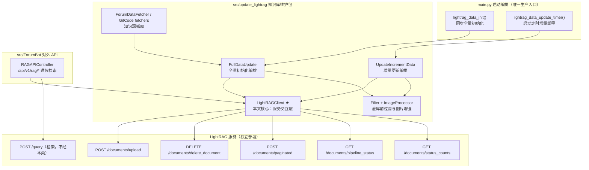

# LightRAG 服务交互层

> 本文解析 `src/update_lightrag/lightrag_client.py` 中的 `LightRAGClient` —— 整个 `forum-reply-robot` 与 **LightRAG 服务**之间唯一的文档管理交互入口。它是知识库维护链路（全量初始化 / 每日增量更新）与对外检索 API 共同依赖的传输层。

---

## 1. 项目定位与核心价值

`LightRAGClient` 是一个**无状态、纯 HTTP 封装的服务客户端**：它不承载任何业务编排逻辑，只负责把「上传文档、删除文档、查询文档状态、查询管道状态」这四类操作翻译成对 LightRAG 服务 REST 接口的请求，并在必要处叠加**协议约束、错误容忍与等待策略**。其诞生背景源于 `forum-reply-robot` 的三大诉求：

1. **知识库灌入**：论坛帖子（`ForumDataFetcher` 抓取为 `topic.json`）与 GitCode 仓库文档（`GitCodeFullFetcher` / `GitCodeAPIIncrementFetcher` 抓取为 Markdown）需要持续同步进 LightRAG 知识库，供问答链路做 RAG 检索增强。
2. **生命周期同步**：当帖子被删除、改名、归档时，LightRAG 上对应的历史文档必须被删除，否则知识库会携带"幽灵数据"污染检索结果——这要求客户端具备 `file_path → doc_id` 的映射能力。
3. **异步管道约束**：LightRAG 的文档处理是**异步流水线**（上传后进入 `pending → processing → completed` 状态），且**管道在忙碌时无法接受删除操作**。客户端必须感知这一状态机，否则会出现"删除被拒、上传半途、状态判断失误"等生产事故。

从设计哲学上看，该类的核心价值可归纳为四点：

- **收敛性（Single Choke Point）**：所有面向 LightRAG 文档管理接口的调用都被收敛进一个类，上层编排（`FullDataUpdate`、`UpdateIncrementData`）与对外 API（`RAGAPIController`）只需持有 `LightRAGClient` 实例，即可获得统一的端点拼接、`verify_ssl` 透传、超时与异常处理约定，而无需各自重复实现 HTTP 细节。
- **协议边界的显式建模**：类顶部以常量形式声明了 LightRAG 的硬性约束——`MIN_PAGE_SIZE = 10`（`/documents/paginated` 接口要求 `page_size >= 10`），并在 `_resolve_page_size()` 中对配置值做**解析、缺省回退、下界钳制**三重防护。这种"把外部系统的隐式约束变成代码中的显式不变量"的做法，是胶水服务最重要的可靠性来源。
- **状态机感知与自愈等待**：`wait_for_pipeline_status_not_busy()` 用 1 秒粒度的轮询把"管道忙碌"从偶发错误转化为"可等待的瞬时状态"，配合 `is_all_file_processed()` 对 `pending/processing` 状态的判定，使得全量初始化可以**同步阻塞直到数据全部就绪**，为后续的 `clear_directory` 清理提供安全前提。
- **本地映射缓存**：`get_filename_id_mapping_from_lightrag()` 将服务端的 `file_path → id` 全量映射持久化为本地 JSON（`files_id_mapping`），让增量更新可以在**不依赖服务端全量清单**的前提下完成"哪些文件需删除、哪些需新增"的集合运算。

Sources: [lightrag_client.py](src/update_lightrag/lightrag_client.py#L9-L28), [full_data_init.py](src/update_lightrag/full_data_init.py#L16-L27), [increment_date_update_timer.py](src/update_lightrag/increment_date_update_timer.py#L21-L28), [rag_api.py](src/ForumBot/rag_api.py#L14-L28), [README.md](README.md#L294-L307)

---

## 2. 架构设计与模块划分

### 2.1 模块在系统拓扑中的位置

`LightRAGClient` 处于"上层编排 / 对外 API"与"LightRAG 服务"之间的**传输适配层**。下图展示了它在本项目中的完整拓扑：



图中值得注意的两条边界：

- **灌入侧（write path）**：全量初始化与增量更新都通过 `LightRAGClient` 写 LightRAG，但**触发时序由上层编排控制**——全量在服务启动时同步执行（失败则服务保持未就绪），增量则由 `schedule` 定时器在守护线程中触发。`LightRAGClient` 不关心谁在调用、何时调用，只保证每一次调用都符合 LightRAG 的协议与状态约束。
- **检索侧（read path）**：对外检索（`POST /query`）**不经过** `LightRAGClient`，而是由 `RAGAPIController.retrieve()` 直接 `requests.post` 透传给 LightRAG。也就是说，`LightRAGClient` 的职责被刻意限定在"文档管理"而非"检索"——这是一个清晰的**关注点分离**设计：灌入侧的容错逻辑（管道等待、批量重试）与检索侧的纯透传语义互不耦合。

Sources: [lightrag_client.py](src/update_lightrag/lightrag_client.py#L30-L44), [rag_api.py](src/ForumBot/rag_api.py#L144-L187), [full_data_init.py](src/update_lightrag/full_data_init.py#L93-L127), [increment_date_update_timer.py](src/update_lightrag/increment_date_update_timer.py#L159-L201), [main.py](main.py#L126-L161)

### 2.2 `LightRAGClient` 内部方法分组

类内部共 13 个方法 + 2 个常量，可按职责划分为四个能力组：

```mermaid
flowchart LR
    subgraph G1["① 文档生命周期（写路径）"]
        A1["upload_document<br/>multipart 单文件上传"]
        A2["upload_all_documents_from_file<br/>文件清单批量上传"]
        A3["delete_document<br/>按 doc_id 删除"]
        A4["delete_document_from_file<br/>ID 清单批量删除"]
    end

    subgraph G2["② 状态感知（异步管道）"]
        B1["is_all_file_processed<br/>status_counts 判定"]
        B2["is_lightrag_empty<br/>total_count 判定"]
        B3["is_pipeline_status_busy<br/>busy 判定"]
        B4["wait_for_pipeline_status_not_busy<br/>1s 轮询等待"]
    end

    subgraph G3["③ 映射维护（file_path ↔ id）"]
        C1["extract_file_path_id_mapping<br/>响应 → 映射字典"]
        C2["_save_mapping_to_file<br/>合并写本地 JSON"]
        C3["get_filename_id_mapping_from_lightrag<br/>分页全量拉取"]
    end

    subgraph G4["④ 初始化与常量"]
        D1["_resolve_page_size<br/>page_size ≥ 10 钳制"]
        D2["MIN/DEFAULT_PAGE_SIZE<br/>协议边界常量"]
    end

    G1 --> G2
    G2 --> G1
    G3 --> G2
    D1 --> G3
    D1 --> G2
```



#### ① 文档生命周期管理（写路径）

- **`upload_document(file_path, api_url, api_key=None)`**：核心上传原语。以 `multipart/form-data` 形式向 `{api_url}/documents/upload` 提交单个文件，可选携带 `X-API-Key` 请求头；返回服务端 JSON（含 `status` 与 `track_id`）。这是全链路中唯一真正"触碰文件内容"的方法，其 `with open(file_path, 'rb')` 保证了文件句柄的及时释放。
- **`upload_all_documents_from_file(file_list_path, api_url, api_key=None)`**：批量上传编排。首先调用 `wait_for_pipeline_status_not_busy()` 确保管道空闲，然后逐行读取文件清单（每行一个相对路径），拼接出 `rag_data_dir/{file_path}` 的完整路径后逐个上传，每个文件之间 `time.sleep(0.1)` 限速，最后汇总 `success / failed / error` 三态计数并记录日志。它把"单文件失败不影响其他文件"的**逐项容错**策略固化为默认行为——单文件异常被捕获为 `error` 状态而非中断整个批次。
- **`delete_document(doc_id, api_url, api_key=None)`**：删除原语。以 `DELETE` 方法携带 JSON body（`doc_ids` 数组 + `delete_file: False`）调用 `/documents/delete_document`。注意它**不删除服务端物理文件**，只删除索引记录——这是刻意的保守设计，避免误删原始语料。
- **`delete_document_from_file(file_list_ids, api_url, api_key=None)`**：批量删除编排，与批量上传对称。逐条调用 `wait_for_pipeline_status_not_busy()`（删除与上传共享同一管道约束），以 `deletion_started` 作为成功判据。

#### ② 状态感知（异步管道）

- **`is_all_file_processed()`**：读取 `/documents/paginated` 响应的 `status_counts` 字段，只要存在 `pending > 0` 或 `processing > 0` 即返回 `False`，否则 `True`；异常时返回 `None`（三态语义：`True` 完成 / `False` 未完成 / `None` 不可判定）。全量初始化用它做**同步等待循环**（每 5 秒重查）。
- **`is_lightrag_empty()`**：从 `pagination.total_count` 判断知识库是否为空，是全量初始化"是否跳过"的守卫条件。
- **`is_pipeline_status_busy()`**：`GET /documents/pipeline_status`，取响应的 `busy` 布尔值；异常返回 `None`。
- **`wait_for_pipeline_status_not_busy()`**：**忙碌自旋**。当查询失败（`None`）或忙碌（`True`）时均 `sleep(1)` 重试，空闲则立即返回。该方法是"把外部异步管道的瞬时性内化为客户端等待语义"的关键，也是上传/删除操作正确性的前提。

#### ③ 映射维护（file_path ↔ id）

- **`extract_file_path_id_mapping(json_data)`**：纯函数式解析，从 `/documents/paginated` 响应的 `documents` 数组提取 `{file_path: id}` 字典，缺字段的条目被静默跳过。
- **`_save_mapping_to_file(mapping)`**：读-合并-覆盖三步写入本地 JSON。先读旧映射（文件不存在则视为空），`update()` 合并后全量覆盖写回，`ensure_ascii=False` 保留中文路径。合并而非覆盖意味着**增量分页拉取可多次调用而不丢旧数据**。
- **`get_filename_id_mapping_from_lightrag(base_url, limit=50)`**：分页全量同步入口。以 `page` 从 1 递增、`page_size` 用 `limit`（注意：这里用的是参数 `limit` 而非 `self.page_size`，两者默认值不同——前者 50、后者 10），循环请求 `/documents/paginated`，每页提取映射并落盘，直到 `current_page >= total_pages` 退出。它是增量更新"删除判定"的数据基础。

#### ④ 初始化与协议常量

- **`_resolve_page_size()`**：从 `config['retrieval']['paginated_page_size']` 读取分页大小，`int()` 转换失败回退默认值 10，并强制 `>= MIN_PAGE_SIZE`。这一钳制避免了"配置了 1 却触发 LightRAG 400 错误"的边界事故，也被测试文件（`tests/test_lightrag_client.py`）专门覆盖。

Sources: [lightrag_client.py](src/update_lightrag/lightrag_client.py#L10-L12), [lightrag_client.py](src/update_lightrag/lightrag_client.py#L19-L28), [lightrag_client.py](src/update_lightrag/lightrag_client.py#L30-L44), [lightrag_client.py](src/update_lightrag/lightrag_client.py#L46-L108), [lightrag_client.py](src/update_lightrag/lightrag_client.py#L110-L184), [lightrag_client.py](src/update_lightrag/lightrag_client.py#L186-L266), [lightrag_client.py](src/update_lightrag/lightrag_client.py#L268-L381), [test_lightrag_client.py](tests/test_lightrag_client.py#L36-L94)

### 2.3 设计哲学：为什么是"同步阻塞"而非"任务队列"

一个值得展开的设计判断是：`LightRAGClient` 采用**调用方线程内同步阻塞**的交互模型，而非引入独立任务队列。全量初始化中，`update_full_data()` 在 `while True` 循环里以 5 秒间隔轮询 `is_all_file_processed()`，直到全部就绪才清理本地目录——这意味着主线程（实际是 `initialization_worker` 守护线程）会为一次全量灌库阻塞数分钟。这种设计在吞吐上不优雅，但对本场景是**正确的取舍**：

- 全量初始化发生在**服务就绪之前**（`main.py` 中 `lightrag_data_init()` 失败则 `service_initialized = False`，K8s 就绪探针保持 503），阻塞正是"就绪门禁"的组成部分；
- 增量更新虽在定时线程中，但**先查管道忙碌再决定是否跳过**（`update_lightrag_task` 开头），天然避免了与全量初始化的并发冲突；
- 目录清理（`clear_directory`）必须在"数据已全部灌入"之后执行，否则会删掉尚未上传的文件——同步等待是这一安全前置的唯一简单可靠实现。

简言之，该客户端选择了**用线程阻塞换取状态一致性**，把"异步服务"伪装成"同步调用"，从而让上层编排逻辑保持线性可读。

Sources: [full_data_init.py](src/update_lightrag/full_data_init.py#L93-L127), [increment_date_update_timer.py](src/update_lightrag/increment_date_update_timer.py#L159-L167), [main.py](main.py#L300-L326)

---

## 3. 技术栈与核心工作流

### 3.1 技术栈

| 技术/库 | 在本模块中的角色 | 说明 |
| --- | --- | --- |
| Python 3.9+ | 运行环境 | 项目统一运行时，`Dockerfile` 基于 `python:3.9-slim` |
| `requests` | HTTP 客户端 | 唯一的对外通信手段：`requests.post` / `requests.delete`，全部显式传 `timeout=10` 与 `verify` |
| `json`（stdlib） | 序列化 | 请求体构造与响应解析；本地映射文件读写 |
| `http.client.responses` | 备用导入 | 顶层 `from http.client import responses` 在当前版本中未被使用，属于遗留导入 |
| `src.ForumBot.logging_config.main_logger` | 日志 | 统一的 `main_logger`，支持文件轮转（20MB × 4） |
| `pytest` + `unittest.mock` | 测试 | `tests/test_lightrag_client.py` 以 `patch` 方式 mock 掉 `requests`，验证请求参数与三态返回值 |

配置契约：客户端只依赖 `config['retrieval']`（`base_url` / `verify_ssl` / `paginated_page_size`）与 `config['lightrag_paths']`（`rag_data_dir` / `files_id_mapping`）两个配置段；`api_url` 参数由调用方从 `config['retrieval']['base_url']` 显式传入，客户端**不自行读取**（除 `is_lightrag_empty` 直接读 `self.config['retrieval']['base_url']` 这一处不对称）。

Sources: [lightrag_client.py](src/update_lightrag/lightrag_client.py#L1-L8), [lightrag_client.py](src/update_lightrag/lightrag_client.py#L306-L321), [README.md](README.md#L29-L40), [CLAUDE.md](CLAUDE.md#L29-L41)

### 3.2 核心工作流一：全量初始化（启动时）

```
main() → initialization_worker() → lightrag_data_init()
  → FullDataUpdate.update_full_data()
      ├─ is_lightrag_empty() ?      # 知识库非空 → 补种水位后提前返回（升级场景）
      ├─ clear_directory()          # 清空本地 rag_data_dir
      ├─ 抓取论坛/ GitCode 文档     # → topic.json / *.md
      ├─ get_filename_id_mapping_from_lightrag()   # 拉取旧映射（若知识库曾被清空则为空）
      ├─ Filter.filter_upload_files()              # 关键词过滤
      ├─ ImageProcessor.process_image_from_files() # 图片→文本描述增强
      ├─ upload_all_documents_from_file()          # ★ 批量上传（先等管道空闲）
      └─ while not is_all_file_processed(): sleep(5)   # ★ 同步等待全部就绪
```

在该流程中，`LightRAGClient` 承担了四个关键节点：**空库守卫**（`is_lightrag_empty`）、**映射预热**（`get_filename_id_mapping_from_lightrag`）、**批量灌入**（`upload_all_documents_from_file`）与**就绪轮询**（`is_all_file_processed`）。全量初始化以"知识库为空"为前提，因此映射预热在此时通常返回空集，其主要价值体现在**升级场景**：若 LightRAG 已有历史数据（非空），`update_full_data` 提前返回，仅调用 `init_last_update_time` 补种水位，不会破坏既有知识库。

Sources: [full_data_init.py](src/update_lightrag/full_data_init.py#L93-L127), [full_data_init.py](src/update_lightrag/full_data_init.py#L84-L91), [main.py](main.py#L126-L139)

### 3.3 核心工作流二：增量更新（每日定时）

```
UpdateLightRAGTimer.run_scheduler()   # schedule：每天 18:00 UTC（≈东八区 02:00）
  → UpdateIncrementData.update_lightrag_task()
      ├─ is_pipeline_status_busy() ?     # 忙碌 → 跳过本轮
      ├─ is_all_file_processed() ?       # 未完成 → 跳过本轮
      ├─ get_last_update_time()          # 读 DB 水位（不可用则抛异常跳过）
      ├─ clear_directory()               # 清空本地目录
      ├─ get_filename_id_mapping_from_lightrag()   # ★ 刷新 file_path→id 映射
      ├─ 抓取增量论坛/ GitCode 数据
      ├─ get_increment_update_file()     # 集合运算：算出差集（需删除的文件 ID）
      ├─ delete_document_from_file()     # ★ 先删（逐条等管道空闲）
      ├─ Filter + ImageProcessor         # 预处理
      └─ upload_all_documents_from_file()# ★ 后传（等管道空闲）
```

增量更新的**删除-上传次序**（先删后传）是刻意的：若先上传新文件再删除旧文件，会导致短窗口内知识库同时存在新旧两版文档，检索可能命中过时内容；而 `delete_document_from_file` 内部每条删除前都等待管道空闲，则保证了删除请求不会被忙碌管道拒绝。映射文件（`files_id_mapping`）在这里是**集合运算的权威输入**——`get_increment_update_file` 以它为基准计算"mapping 中有但当前帖子清单中无"的文件并取其 ID 写入删除清单。

Sources: [increment_date_update_timer.py](src/update_lightrag/increment_date_update_timer.py#L159-L201), [increment_date_update_timer.py](src/update_lightrag/increment_date_update_timer.py#L75-L157), [increment_date_update_timer.py](src/update_lightrag/increment_date_update_timer.py#L204-L227)

### 3.4 核心工作流三：对外检索透传（read path）

```
客户端 → POST /api/v1/rag/retrieve → RAGAPIController.retrieve()
  → requests.post(base_url + /query, json=原始请求体)   # 纯透传，不经过 LightRAGClient
  → 原样返回 LightRAG 响应 + 状态码
```

`RAGAPIController` 虽然构造了 `LightRAGClient` 实例，但 `retrieve()` 并未使用它——检索走独立的直连透传（`timeout=60`）。`LightRAGClient` 在此处的实际作用是被 `/api/v1/rag/documents/status_counts`、`/documents/pipeline_status`、`/documents/paginated` 三个**管理面接口**复用：它们用 `is_*` 类逻辑为前端/运维提供知识库健康视图。这一设计再次印证了 2.1 节的边界结论：**检索与文档管理是两个正交的交互面**，`LightRAGClient` 只负责后者。

Sources: [rag_api.py](src/ForumBot/rag_api.py#L32-L62), [rag_api.py](src/ForumBot/rag_api.py#L144-L187), [rag_api.py](src/ForumBot/rag_api.py#L189-L283)

### 3.5 核心方法速查表

| 方法 | 传输方式 | 目标端点 | 成功判据 | 失败语义 | 使用场景 |
| --- | --- | --- | --- | --- | --- |
| `upload_document` | POST multipart | `/documents/upload` | `status == "success"` | 抛异常 / 非 success | 单文件灌入 |
| `upload_all_documents_from_file` | POST multipart ×N | `/documents/upload` | 逐文件三态汇总 | 单文件 error 不中断 | 全量 / 增量批量灌入 |
| `delete_document` | DELETE + JSON body | `/documents/delete_document` | `status == "deletion_started"` | 抛异常 | 单文档删除 |
| `delete_document_from_file` | DELETE ×N | `/documents/delete_document` | 逐条三态汇总 | 单条 error 不中断 | 增量删除 |
| `get_filename_id_mapping_from_lightrag` | POST JSON | `/documents/paginated` | 分页全量拉取完毕 | 异常 raise | 映射预热 / 刷新 |
| `is_all_file_processed` | POST JSON | `/documents/paginated` | `status_counts` 无 pending/processing | 返回 `None` | 就绪轮询 |
| `is_lightrag_empty` | POST JSON | `/documents/paginated` | `total_count == 0` | 返回 `None` | 空库守卫 |
| `is_pipeline_status_busy` | GET | `/documents/pipeline_status` | `busy == False` | 返回 `None` | 管道守卫 |
| `wait_for_pipeline_status_not_busy` | GET 轮询 | `/documents/pipeline_status` | 管道空闲 | 查询失败则持续重试 | 写操作前置 |

Sources: [lightrag_client.py](src/update_lightrag/lightrag_client.py#L30-L381)

---

## 4. 典型代码示例

### 4.1 上传原语：协议细节的封装

```python
def upload_document(self, file_path, api_url, api_key=None):
    """
    上传文档到LightRAG系统
    """
    url = f"{api_url}/documents/upload"

    headers = {}
    if api_key:
        headers["X-API-Key"] = api_key

    with open(file_path, 'rb') as file:
        files = {'file': file}
        response = requests.post(url, files=files, headers=headers, timeout=10, verify=self.verify_ssl)

    return response.json()
```

该方法的封装粒度值得学习：**端点拼接、可选鉴权头、文件流打开、超时与 SSL 校验、JSON 解析**全部收敛于此。调用方（批量上传）只需关心 `status`/`track_id` 字段，无需理解 multipart 协议。`verify=self.verify_ssl` 来自构造时的配置解析，允许在内网环境关闭 TLS 校验。

Sources: [lightrag_client.py](src/update_lightrag/lightrag_client.py#L30-L44)

### 4.2 管道自旋等待：状态机的客户端化

```python
def wait_for_pipeline_status_not_busy(self, api_url, api_key=None):
    logger.info("检查管道状态是否空闲...")
    while True:
        is_busy = self.is_pipeline_status_busy(api_url, api_key)
        if is_busy is None:          # 查询失败
            logger.warning("无法获取管道状态，等待1秒后重试")
            time.sleep(1)
        elif is_busy:                # 管道忙碌
            logger.info("管道正忙，等待1秒后重试...")
            time.sleep(1)
        else:                        # 管道空闲
            logger.info("管道已空闲，开始执行操作")
            break
```

此模式把**三态返回值**（`None` / `True` / `False`）转化为统一的自旋语义：查询失败与忙碌同样"等 1 秒再试"，直至空闲。它隐含一个工程判断——LightRAG 管道状态短暂不可读（服务重启、负载高峰）不应被当作致命错误，而应视为可恢复的瞬时状态。测试通过 `mock_is_busy.side_effect = [True, False]` 验证了"等待一次后放行"的行为。

Sources: [lightrag_client.py](src/update_lightrag/lightrag_client.py#L366-L381), [test_lightrag_client.py](tests/test_lightrag_client.py#L349-L369)

### 4.3 分页映射同步：增量更新的数据地基

```python
def get_filename_id_mapping_from_lightrag(self, base_url, limit=50):
    page = 1
    while True:
        payload = {"page": page, "page_size": limit}
        response = requests.post(f"{base_url}/documents/paginated", json=payload,
                                 timeout=10, verify=self.verify_ssl)
        response.raise_for_status()
        result = response.json()

        mapping = self.extract_file_path_id_mapping(result)
        self._save_mapping_to_file(mapping)          # 每页即合并落盘

        pagination = result.get('pagination', {})
        current_page = pagination.get('page', 1)
        total_pages = pagination.get('total_pages', 1)
        if current_page >= total_pages:
            break
        page += 1
```

其稳健性体现在两点：**逐页落盘**（即使后续页失败，已拉取页的映射也已持久化）与**异常即 raise**（网络错误 / JSON 解析错误都被捕获后记录并向上抛出，由调用方决定是否终止整轮更新）。这形成了"数据落地冗余 + 失败快速失败"的组合，与批量上传的"逐项容错"形成互补——映射拉取属于**强一致性前置**，不可静默吞错，否则增量删除可能基于不完整映射误删文件。

Sources: [lightrag_client.py](src/update_lightrag/lightrag_client.py#L221-L266), [lightrag_client.py](src/update_lightrag/lightrag_client.py#L186-L219)

### 4.4 可观察的两处实现细节（客观提示）

1. `is_pipeline_status_busy` 方法体中部存在 `api_key = None` 的**参数遮蔽赋值**（L347），使该方法实际永远不携带 `X-API-Key` 头——当前版本中函数签名虽保留 `api_key` 参数，但传入值会被覆写。若未来 LightRAG 对管理接口启用鉴权，需移除该赋值。
2. `delete_document_from_file` 循环内 `if i <= len(file_ids):` 为**恒真条件**（`i` 从 1 递增至 `len`），属于冗余分支，不影响正确性但可读性可优化。

这两处不影响当前功能，但为接手者提供了明确的后续演进点。

Sources: [lightrag_client.py](src/update_lightrag/lightrag_client.py#L340-L364), [lightrag_client.py](src/update_lightrag/lightrag_client.py#L147-L173)

---

## 5. 学习与探索建议

`LightRAGClient` 是理解本仓库"知识库检索系统"的最佳切入点之一：它只有 382 行、无继承、依赖面窄，却完整呈现了**外部服务适配层**应有的全部要素。以下是基于本项目全局大纲的阅读路径：

| 你的目标 | 建议行动 | 对应源码/文档 |
| --- | --- | --- |
| 理解客户端如何被全量链路驱动 | 阅读 `FullDataUpdate.update_full_data`，跟踪 `is_lightrag_empty → get_filename_id_mapping_from_lightrag → upload_all_documents_from_file → is_all_file_processed` 的调用顺序 | [full_data_init.py](src/update_lightrag/full_data_init.py#L93-L127) |
| 理解增量删除的映射算法 | 阅读 `UpdateIncrementData.get_increment_update_file`，观察 `files_id_mapping` 与帖子清单的集合差运算如何产出删除 ID | [increment_date_update_timer.py](src/update_lightrag/increment_date_update_timer.py#L75-L157) |
| 理解检索侧与灌入侧的边界 | 阅读 `RAGAPIController.retrieve`（纯透传）并对比 `LightRAGClient`（文档管理），体会关注点分离 | [rag_api.py](src/ForumBot/rag_api.py#L144-L187) |
| 深入知识源抓取 | 阅读 `ForumDataFetcher` 的 `topic.json` 生成逻辑（文件名规范直接决定映射键） | [forum_data_Fetcher.py](src/update_lightrag/forum_data_Fetcher.py#L68-L137) |
| 掌握更新水位语义 | 阅读 `update_time.py` 的 `save/get/init_last_update_time`，理解增量更新如何避免重复拉取 | [update_time.py](src/update_lightrag/update_time.py#L35-L231) |
| 用测试理解契约 | 运行 `pytest tests/test_lightrag_client.py`，重点看 page_size 钳制与三态返回值的 mock 断言 | [test_lightrag_client.py](tests/test_lightrag_client.py#L1-L369) |
| 从启动编排视角收束全貌 | 阅读 `main.py` 的 `lightrag_data_init` / `lightrag_data_update_timer` / `initialization_worker`，理解就绪门禁 | [main.py](main.py#L126-L161), [main.py](main.py#L300-L326) |

---

## 🔗 关联模块与上下游

与 `LightRAGClient` 存在**直接调用关系**的源码（建议按序阅读）：

1. **上游编排 A（全量初始化）**：[full_data_init.py](src/update_lightrag/full_data_init.py#L93-L127) —— `FullDataUpdate` 在 `update_full_data` 中调用客户端的空库守卫、映射预热、批量上传与就绪轮询，是写路径的完整时序模板。
2. **上游编排 B（增量更新）**：[increment_date_update_timer.py](src/update_lightrag/increment_date_update_timer.py#L159-L201) —— `UpdateIncrementData.update_lightrag_task` 以"先查管道 → 刷新映射 → 先删后传"的方式复用同一客户端，是并发安全的参照实现。
3. **下游/旁路（对外 API）**：[rag_api.py](src/ForumBot/rag_api.py#L14-L62) —— `RAGAPIController` 持有客户端实例用于文档状态面接口，同时以直连透传方式承担检索面，是理解灌入/检索边界的关键对照文件。
