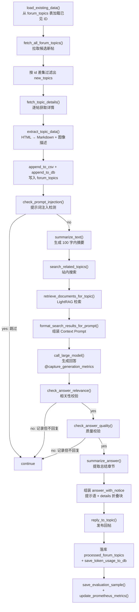
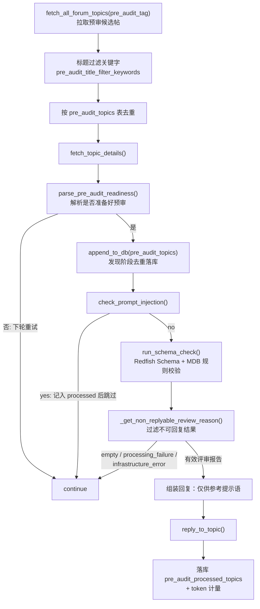

# 论坛监控与回复编排引擎

> 本页深度剖析 `src/ForumBot/monitor.py` 与 `src/ForumBot/evaluation_hooks.py`，即整个论坛问答自动化机器人的**编排核心（Orchestrator）**与**可观测性钩子（Observability Hooks）**。难度：Advanced。

---

## 1. 项目定位与核心价值

`ForumMonitor` 是 `forum-reply-robot` 项目中承上启下的"大脑"。它在 `src/ForumBot/monitor.py` 中定义，负责把三个看似独立的子系统——论坛 HTTP 客户端（`ForumClient`）、大模型调用层（`AIProcessor`）、数据持久化层（`DataProcessor`）——编排成两条自洽的自动化业务链路。该项目解决的核心痛点是：**面向企业级论坛（基于 Discourse 协议）的问答场景中，人工逐帖审阅与回复成本极高，且回复质量依赖回答者对企业知识库（Redfish Schema 规范、MDB 资源协作接口规则、内部文档）的熟悉程度，难以规模化**。引擎通过周期性轮询、AI 摘要、站内搜索 + LightRAG 知识检索、LLM 生成、多层校验、自动发帖这一完整管线，将"发现新帖 → 产出高质量回答 → 发布回帖"全流程无人值守化。

其核心价值在于三点。其一是**双链路编排**：除常规的"问题 → 回答"问答链路外，还实现了一条完全独立的"AI 预审链路"——针对打上预审标签的帖子，先解析其 HTML 中"是否准备好 AI 预审"的就绪字段，再调用 `SchemaValidation` 子包执行 Redfish Schema + MDB 规则的结构化合规校验，把**评审报告**而非自由生成的回答作为回帖内容。其二是**从严的发布闸门（Release Gate）**：生成内容只有依次通过提示词注入检测、答案相关性校验、答案质量校验后才会被发布，任何一步校验失败都默认"不回复"并落库留痕，从架构上杜绝低质量或越权内容污染论坛。其三是**全链路可观测性**：`evaluation_hooks.py` 以 `threading.local` + 装饰器模式，在检索与生成两个关键节点零侵入地采集延迟与上下文，配合 `token_tracker` 的 Token 计量、Prometheus 指标导出与 `evaluation_samples` 评估样本落库，使每一次自动回复都可被审计、可被离线评估、可被监控告警。

> 设计哲学：`ForumMonitor` 不是"功能实现者"，而是"流程协调者"。它本身不含任何 HTTP 细节、不含任何 Prompt 文本、不含任何 SQL，只负责**决定做什么、按什么顺序做、失败后如何降级**。这种分层使得论坛协议（`forum_client.py`）、模型能力（`ai_processor.py`）、存储实现（`data_processor.py`）各自可独立演进与测试。

Sources: [monitor.py](src/ForumBot/monitor.py#L41-L53), [README.md](README.md#L5-L14), [evaluation_hooks.py](src/ForumBot/evaluation_hooks.py#L1-L10)

---

## 2. 架构设计与模块划分

### 2.1 总体架构图

`ForumMonitor` 在初始化时聚合三大依赖（`ForumClient`、`AIProcessor`、`DataProcessor`），并触发一次建表（`create_tables`）。随后由 `start()` 进入无限轮询，每个周期依次执行常规链路与预审链路；两条链路共享相同的"落库 + 评估 + 指标"收尾管线。

```mermaid
flowchart TB
    subgraph ENTRY["入口层 (main.py)"]
        M["main.py: initialization_worker"]
        TH["MonitorThread<br/>(daemon thread)"]
    end

    FM["ForumMonitor<br/>src/ForumBot/monitor.py"]

    subgraph CORE["编排核心"]
        START["start()<br/>无限轮询 while True"]
        CN["_check_new_topics()<br/>常规问答链路"]
        PA["_check_pre_audit_topics()<br/>AI 预审链路"]
        LINK["_generate_related_links()<br/>相关链接编排"]
    end

    subgraph CLIENT["论坛交互层"]
        FC["ForumClient"]
        F1["fetch_all_forum_topics()"]
        F2["fetch_topic_details()"]
        F3["search_related_topics()<br/>站内搜索"]
        F4["retrieve_documents_for_topic()<br/>LightRAG 检索"]
        F5["reply_to_topic()<br/>发布回帖"]
    end

    subgraph AI["AI 能力层"]
        AIP["AIProcessor"]
        A1["check_prompt_injection()"]
        A2["summarize_text()"]
        A3["call_large_model()<br/>@capture_generation_metrics"]
        A4["check_answer_relevance()"]
        A5["check_answer_quality()"]
        A6["summarize_answer()"]
    end

    subgraph DATA["数据持久化层"]
        DP["DataProcessor"]
        D1["extract_topic_data()"]
        D2["append_to_db() / append_to_csv()"]
        D3["save_token_usage_to_db()"]
        D4["save_evaluation_sample()"]
        D5["parse_pre_audit_readiness()"]
    end

    subgraph OBS["可观测层"]
        EH["evaluation_hooks.py<br/>threading.local 上下文"]
        TT["token_tracker<br/>模块级单例"]
        PM["prometheus_metrics.py"]
        SC["SchemaValidation/<br/>end_to_end_check.py"]
    end

    M --> TH --> FM
    FM --> START
    START --> CN
    START --> PA
    CN --> LINK
    CN --> CLIENT
    CN --> AI
    CN --> DATA
    PA --> SC
    PA --> DATA
    A3 -. "写入上下文" .-> EH
    F4 -. "被装饰器包裹" .-> EH
    AI -. "每次调用累加" .-> TT
    CN -. "读取评估上下文" .-> EH
    CN -. "更新指标" .-> PM
    CN -. "写入评估样本" .-> D4
```



Sources: [monitor.py](src/ForumBot/monitor.py#L41-L53), [main.py](main.py#L101-L123), [main.py](main.py#L30-L42)

### 2.2 编排核心：ForumMonitor

`ForumMonitor` 的构造器支持两种配置注入方式：传入已加载的 `config` 字典，或从 `config/config.yaml` 加载。它随后依次实例化三个核心协作者，并在启动时调用 `data_processor.create_tables()` 一次性建齐全部数据库表（`forum_topics`、`processed_forum_topics`、`forum_search_results`、`forum_retrieval_results`、`consume_tokens_topic`、`pre_audit_topics`、`pre_audit_processed_topics`、`schema_debug_logs`、`evaluation_samples` 等九张表，其中还包含对 `consume_tokens_topic.topic_id` 的 UNIQUE 约束迁移逻辑）。**表结构即业务状态机的持久化形态**：`forum_topics` 记录"发现过"的帖子，`processed_forum_topics` 记录"已回复"的帖子，二者差集理论上代表"发现但未回复"的帖子（相关代码段被注释保留，作为可恢复的增量处理预案）。

`start()` 是主循环：捕获 `KeyboardInterrupt` 优雅退出，其余异常记录日志后继续睡眠重试，保证监控进程在单轮故障下不会整体崩溃。每轮先做常规链路 `_check_new_topics()`，再做预审链路 `_check_pre_audit_topics()`。

Sources: [monitor.py](src/ForumBot/monitor.py#L41-L74), [data_processor.py](src/ForumBot/data_processor.py#L507-L700)

### 2.3 双链路并行：常规问答与 AI 预审

两条链路在去重、注入检测、落库流程上高度对称，但在"如何产生回答"上截然不同：

| 维度 | 常规问答链路 `_process_new_topics` | AI 预审链路 `_process_pre_audit_topic` |
|------|-----------------------------------|----------------------------------------|
| 触发源 | `monitor.required_tag` / 分类路径下的新帖 | `monitor.pre_audit_tag` / `pre_audit_category_path` 下的新帖 |
| 就绪门控 | 无（发现即处理） | `parse_pre_audit_readiness()` 解析帖子 HTML 中"是否准备好AI预审（必选）"字段 |
| 知识获取 | 站内搜索 + LightRAG 文档检索 | 无检索，直接结构化校验 |
| 回答生成 | 摘要 → LLM 生成自由文本回答 | `run_schema_check()` 产出 Redfish/MDB 合规评审报告 |
| 质量闸门 | 注入检测 + 相关性校验 + 质量校验 | 注入检测 + `_get_non_replyable_review_reason()` 过滤基础设施错误 |
| 回答形态 | 摘要 + `[details]` 折叠块 | 结构化 Markdown 评审报告 + "仅供参考"提示语 |

预审链路的就绪判定是一个值得关注的解析器：`parse_pre_audit_readiness()` 采用**三方式递进解析**——先在 HTML 表格结构中按"字段名/值"匹配，再支持"标题 + 下一段值"模板，最后退化到全文本正则匹配（负向先行断言排除"是/否"占位文本）。这种设计容忍 Discourse 帖子 HTML 结构的多样变化，返回 `True`（是）/ `False`（否）/ `None`（未找到）三态：`False` 的帖子下轮重试，`None` 的帖子直接跳过。

Sources: [monitor.py](src/ForumBot/monitor.py#L536-L625), [monitor.py](src/ForumBot/monitor.py#L627-L720), [data_processor.py](src/ForumBot/data_processor.py#L350-L414)

### 2.4 可观测性钩子：evaluation_hooks

`evaluation_hooks.py` 是整个引擎"可审计性"的基石，其设计精妙之处在于**零侵入的埋点**：

- **线程局部上下文**：模块级 `_evaluation_context = threading.local()`，配合 `get_evaluation_context()` 返回。由于 `main.py` 中监控器运行在独立的 `MonitorThread` 守护线程内，`threading.local` 天然隔离了不同线程的数据，避免并发污染。
- **检索埋点装饰器 `@capture_retrieval_metrics`**：包裹 `ForumClient._get_response_data()`，在函数正常返回时把 `(related_docs, data)` 与耗时写入上下文的 `retrieval_context / retrieval_latency / retrieval_data`；异常时置空上下文并重新执行原函数，保证埋点失败绝不破坏业务。
- **生成埋点装饰器 `@capture_generation_metrics`**：包裹 `AIProcessor.call_large_model()`，记录 `actual_output / generation_latency`。
- **问题分类器 `classify_question()`**：基于关键词规则将帖子归类为 `技术问题 / 使用问题 / 社区规则 / 其他`，作为评估样本的标签维度（例如含 `报错/error/接口/api/代码` → 技术问题；含 `怎么/如何/教程/安装` → 使用问题；含 `规范/规则/pr/提交` → 社区规则）。

这两枚装饰器是"监控"与"被监控"解耦的范本：`ForumMonitor` 无需关心埋点细节，只需在处理收尾时从 `get_evaluation_context()` 统一取数，喂给 `save_evaluation_sample()` 与 `update_prometheus_metrics()`。

Sources: [evaluation_hooks.py](src/ForumBot/evaluation_hooks.py#L6-L52), [evaluation_hooks.py](src/ForumBot/evaluation_hooks.py#L55-L67), [forum_client.py](src/ForumBot/forum_client.py#L166-L167), [ai_processor.py](src/ForumBot/ai_processor.py#L308-L309)

### 2.5 数据持久化与 Token 计量

`DataProcessor` 采用**按需建连**模式（`_get_db_connection` 委托给 `src/utils.py` 的 `get_db_connection`，带指数退避重试），不再在构造器持有长连接。写路径统一遵循 **PostgreSQL 与 CSV 双写**原则：`append_to_db()` 对表名做白名单校验防 SQL 注入，`ON CONFLICT (id) DO UPDATE` 实现幂等 upsert；`append_to_csv()` 则按 `forum_data_dir` 落盘原始 JSON 数据（搜索结果、检索结果均按时间戳命名）。

Token 计量由模块级单例 `token_tracker` 承担：`AIProcessor` 每次 LLM 调用后调用 `add_usage()` 累加 `prompt_tokens / completion_tokens / total_tokens / model_calls`，`ForumMonitor` 在每帖处理完毕时 `get_usage()` 并 `save_token_usage_to_db()` 持久化。预审链路还额外做了 `reset_usage()` 以保证统计口径干净。

Sources: [data_processor.py](src/ForumBot/data_processor.py#L417-L429), [data_processor.py](src/ForumBot/data_processor.py#L702-L785), [data_processor.py](src/ForumBot/data_processor.py#L880-L923), [token_tracker.py](src/ForumBot/token_tracker.py#L6-L60), [utils.py](src/utils.py#L11-L45)

---

## 3. 技术栈与核心工作流

### 3.1 常规问答回复主链路

`_check_new_topics()` → `_process_new_topics()` 是引擎最重要的一条执行路径，其状态机如下：



各阶段职责与实现细节：

| 阶段 | 调用 | 关键实现 | 降级策略 |
|------|------|----------|----------|
| 拉取与去重 | `_check_new_topics` | 仅按 ID 差集判断新帖，不重复比较标签/时间 | DB 连接失败直接跳过本轮 |
| 详情提取 | `extract_topic_data` | 首帖为 `user_question`，后续帖遍历找 `accepted_answer`；HTML 经 `process_html_content_with_image_links` 转 Markdown 并嵌入 `[img: (...)]` 图片链接，再经 `ImageProcessor.enhance_text_with_image_descriptions` 做图像描述增强 | 无内容帖跳过 |
| 注入检测 | `check_prompt_injection` | 用 16 位随机字符串**包裹**用户输入，`max_tokens=3, temperature=0.1`，双模型降级（`model_list` 依次尝试），出错默认判 `yes` | 判为注入即跳过且不回复 |
| 摘要 | `summarize_text` | 角色化 Prompt 约束"一句话、≤100 字符、无标点"，超长截断 | 失败返回"摘要生成失败" |
| 检索 | `_get_response_data` | 同时请求 `{query_endpoint}` 与 `/data` 两个端点，返回 prompt 与上下文数据 | 异常返回空串，若检索与搜索皆空则跳过 |
| 生成 | `call_large_model` | 系统提示含检索上下文并追加随机串防注入，`timeout=600`，指数退避重试 3 次 | 超时/服务错误返回"处理失败: ..."或"未知错误: ..." |
| 校验 | `check_answer_relevance` / `check_answer_quality` | 均为"是/否"二元判定，`max_tokens=3`；质量校验在系统提示中内置"无法回答/抱歉/不知道"等反例 | 出错默认 `no`（不发布） |
| 发布 | `reply_to_topic` | 向 `{base_url}/posts.json` POST，携带 `Api-Key`/`Api-Username` 头 | 失败记录日志，不阻断后续帖子 |

**安全防护细节**：`call_large_model` 与 `check_prompt_injection` 都采用"随机字符串封装"技巧——把用户输入夹在随机 token 之间，降低模型被注入指令劫持的概率；`max_tokens=3` 强制校验器只能输出短答案。整条链路对每个 `topic` 用 `try/except continue` 包裹，单帖失败不影响批处理（README 中的"逐帖容错"原则在代码层面落地）。

Sources: [monitor.py](src/ForumBot/monitor.py#L77-L132), [monitor.py](src/ForumBot/monitor.py#L292-L534), [ai_processor.py](src/ForumBot/ai_processor.py#L77-L154), [ai_processor.py](src/ForumBot/ai_processor.py#L308-L356), [forum_client.py](src/ForumBot/forum_client.py#L84-L203), [data_processor.py](src/ForumBot/data_processor.py#L996-L1057)

### 3.2 AI 预审主链路

预审链路在 `_check_pre_audit_topics()` 与 `_process_pre_audit_topic()` 中实现，状态机如下：



其中 `_get_non_replyable_review_reason()` 是预审链路独有的**最后一道安全闸门**：它基于 `is_infrastructure_error_text()`（对 `INFRASTRUCTURE_ERROR_KEYWORDS` 与 `INTERNAL_VALIDATION_ERROR_KEYWORDS` 两组关键词做子串匹配，涵盖 `timeout / 429 / quota / service unavailable / empty response / 无法解析引用` 等 30 余种基础设施与内部校验错误）识别"服务故障而非真实评审意见"，防止把 LLM 服务超时报错当作合规结论发布到论坛。空结果、处理失败、基础设施错误三类均不回复，其中后两者会记录到 `pre_audit_processed_topics` 表避免重复处理。`run_schema_check()` 包装的 `process_post()` 内部执行四步：帖子相关性判定（Redfish/MDB）→ 提取评审点 → 三路分类（mdb/redfish/other）→ 逐评审点执行 URI 生成、Schema 静态验证与规则合规性检查（含按阶段缓存结果的智能重试），最终产出 Markdown 评审报告。

Sources: [monitor.py](src/ForumBot/monitor.py#L24-L39), [monitor.py](src/ForumBot/monitor.py#L536-L625), [monitor.py](src/ForumBot/monitor.py#L627-L720), [end_to_end_check.py](src/ForumBot/SchemaValidation/end_to_end_check.py#L57-L104), [end_to_end_check.py](src/ForumBot/SchemaValidation/end_to_end_check.py#L954-L1210), [end_to_end_check.py](src/ForumBot/SchemaValidation/end_to_end_check.py#L1213-L1300)

### 3.3 相关链接编排：_generate_related_links

`_generate_related_links()` 体现了一种"**链接供给侧调度**"的算法思想。它需要从两个来源——知识图谱（KG）与站内搜索——中挑选出最多 5 条相关链接，规则如下：

1. **KG 优先**：从检索结果 `data.chunks` 中解析 `file_path` 里的 `_(\d+)(?:_topic)?\.json` 提取 topic_id（过滤 `<10` 的噪声 ID），最多取 `KG_HIGH_VOTE_MIN_COUNT=4` 条，构造 `{forum_base_url}/t/topic/{id}`。
2. **搜索补充**：对搜索结果过滤掉含 `news` 的路径，按优先级拼接 URL——`/t/topic/*` 拼接论坛域名、`http*` 原样保留、其余拼接文档域名（空格编码为 `%20`），同时用 `added_topic_ids` 集合做跨来源去重。
3. **两级兜底**：若不足 5 条，先从搜索结果全集补足（容忍与 KG 重复的链接），再从 KG 链接补足，最终 `all_links[:MAX_LINKS]` 截断并格式化为 `1. url` 编号列表。

该函数的常数级阈值（`KG_VOTE_THRESHOLD / KG_HIGH_VOTE_MIN_COUNT / KG_TOP_COUNT_IF_LOW_VOTE / MAX_LINKS / MAX_SEARCH_RESULTS`）集中声明在模块顶部，便于调参。它回答了"**回答中应该附哪些证据链接**"这一 RAG 落地中的关键工程问题：先给高置信的知识图谱证据，再以搜索结果为兜底，宁可重复也不留空缺。

Sources: [monitor.py](src/ForumBot/monitor.py#L17-L21), [monitor.py](src/ForumBot/monitor.py#L135-L290)

### 3.4 核心类职责速览

| 类 / 单例 | 文件 | 职责边界 | 关键公开面 |
|-----------|------|----------|-----------|
| `ForumMonitor` | monitor.py | 流程编排、链接生成、回复组装、收尾落库 | `start` / `_check_new_topics` / `_process_new_topics` / `_check_pre_audit_topics` / `_process_pre_audit_topic` / `_generate_related_links` |
| `ForumClient` | forum_client.py | 论坛协议（拉帖/详情/搜索/检索/回帖） | `fetch_all_forum_topics` / `fetch_topic_details` / `search_related_topics` / `retrieve_documents_for_topic` / `reply_to_topic` |
| `AIProcessor` | ai_processor.py | 一切 LLM 交互（摘要/注入/生成/双校验/总结） | `summarize_text` / `check_prompt_injection` / `call_large_model` / `check_answer_relevance` / `check_answer_quality` / `summarize_answer` |
| `DataProcessor` | data_processor.py | PostgreSQL/CSV 读写、HTML 解析、预审就绪解析、评估样本落库 | `create_tables` / `append_to_db` / `append_to_csv` / `extract_topic_data` / `save_evaluation_sample` / `parse_pre_audit_readiness` |
| `token_tracker` | token_tracker.py | 进程内 Token 计量单例 | `add_usage` / `get_usage` / `reset_usage` |
| `evaluation_hooks` | evaluation_hooks.py | 线程局部评估上下文 + 埋点装饰器 + 问题分类 | `get_evaluation_context` / `capture_retrieval_metrics` / `capture_generation_metrics` / `classify_question` |
| `prometheus_metrics` | prometheus_metrics.py | 指标定义与更新（延迟直方图、空回复率、计数） | `update_prometheus_metrics` |
| `run_schema_check` | SchemaValidation/end_to_end_check.py | 结构化合规校验入口（Redfish + MDB） | `run_schema_check` / `is_infrastructure_error_text` |

Sources: [monitor.py](src/ForumBot/monitor.py#L1-L21), [forum_client.py](src/ForumBot/forum_client.py#L15-L17), [ai_processor.py](src/ForumBot/ai_processor.py#L10-L20), [data_processor.py](src/ForumBot/data_processor.py#L417-L422), [prometheus_metrics.py](src/ForumBot/prometheus_metrics.py#L1-L70)

---

## 4. 典型代码示例（Showcase）

### 4.1 主循环：极简而健壮的轮询骨架

`start()` 是全引擎的入口，展示了"异常不致死、轮询永续"的工程取舍：

```python
def start(self):
    csv_file = self.config['paths']['csv_file']
    check_interval = self.config['monitor']['check_interval']
    while True:
        try:
            self._check_new_topics(csv_file)
            self._check_pre_audit_topics()
            time.sleep(check_interval)
        except KeyboardInterrupt:
            logger.info("\n监控任务已停止")
            break
        except Exception as e:
            logger.error(f"监控过程中发生错误: {e}")
            time.sleep(check_interval)
```

每轮先处理常规问答，再处理预审；任一链路抛出异常只记日志并等下一轮重试，`KeyboardInterrupt` 是唯一受控退出路径。

Sources: [monitor.py](src/ForumBot/monitor.py#L55-L74)

### 4.2 回答组装：notice + details 折叠块

回复内容不是裸的 LLM 输出，而是经过三层包装的"合规化文本"——免责声明、摘要引导、全文折叠：

```python
if not answer_summary or answer_summary == "总结答案失败" or len(answer_summary) < 10:
    answer_with_notice = "答案内容由AI生成，仅供参考：\n"  + answer + "\n\n"
else:
    answer_with_notice = "答案内容由AI生成，仅供参考：\n" + answer_summary + "\n\n[details=\"点击此处查看详细分析解答\"]\n" + answer  + "\n[/details]"
```

这里 `answer_summary` 由 `summarize_answer()` 从回答中"原样提取"总结/解决方案章节而来；若提取失败或过短，则退化为仅含免责声明的完整回答。

Sources: [monitor.py](src/ForumBot/monitor.py#L465-L472), [ai_processor.py](src/ForumBot/ai_processor.py#L358-L388)

### 4.3 埋点装饰器：零侵入的延迟采集

这是 `evaluation_hooks.py` 的精髓——一个 20 行的装饰器即完成检索延迟、上下文、文档数的全量采集：

```python
def capture_retrieval_metrics(func):
    @functools.wraps(func)
    def wrapper(*args, **kwargs):
        start_time = time.time()
        try:
            related_docs, data = func(*args, **kwargs)
            latency = time.time() - start_time
            ctx = get_evaluation_context()
            ctx.retrieval_context = related_docs
            ctx.retrieval_latency = latency
            ctx.retrieval_data = data
            return related_docs, data
        except Exception as e:
            logger.warning(f"数据采集钩子异常(检索节点): {e}")
            ctx = get_evaluation_context()
            ctx.retrieval_context = None
            ctx.retrieval_latency = None
            ctx.retrieval_data = None
            return func(*args, **kwargs)
    return wrapper
```

注意异常分支的双保险：先置空上下文，再重试执行原函数（若原函数是幂等的只读检索则安全）。`functools.wraps` 保证被装饰函数的元信息不丢失，利于调试与文档生成。

Sources: [evaluation_hooks.py](src/ForumBot/evaluation_hooks.py#L13-L32)

---

## 5. 学习与探索建议（Next Steps & Learning Path）

### 5.1 按"链路深度"推进的阅读路径

| 目标 | 建议动作 | 关联文件 |
|------|----------|----------|
| 理解引擎如何被拉起 | 从 `main.py` 的 `initialization_worker` 追踪 `ForumMonitor` 的构造与线程启动 | [main.py](main.py#L101-L123), [main.py](main.py#L300-L327) |
| 吃透常规问答管线 | 对照 3.1 的状态机逐行阅读 `_process_new_topics`，特别关注两段"不回复"分支的评估收尾 | [monitor.py](src/ForumBot/monitor.py#L292-L534) |
| 深挖检索与 Prompt 组装 | 阅读 `_get_response_data` 与 `format_search_results_for_prompt`，理解 KG/DC/搜索结果如何拼进 `PROMPT_TEMPLATE` | [forum_client.py](src/ForumBot/forum_client.py#L139-L203), [data_processor.py](src/ForumBot/data_processor.py#L1161-L1183) |
| 研究结构化校验引擎 | 从 `run_schema_check` 深入 `process_post` 的四步流程与按阶段缓存的重试机制 | [end_to_end_check.py](src/ForumBot/SchemaValidation/end_to_end_check.py#L1213-L1300), [end_to_end_check.py](src/ForumBot/SchemaValidation/end_to_end_check.py#L954-L1210) |
| 验证评估/指标闭环 | 阅读 `save_evaluation_sample` 与 `update_prometheus_metrics`，理解评价样本与监控指标的字段映射 | [data_processor.py](src/ForumBot/data_processor.py#L1195-L1244), [prometheus_metrics.py](src/ForumBot/prometheus_metrics.py#L36-L70) |
| 用测试反向理解契约 | 运行/阅读预审链路与钩子的单测，它们精确刻画了各阶段的边界行为 | [test_monitor_pre_audit.py](tests/test_monitor_pre_audit.py), [test_evaluation_hooks.py](tests/test_evaluation_hooks.py) |

### 5.2 进阶探索问题

- **幂等性**：`append_to_db` 的 `ON CONFLICT DO UPDATE` 如何保证重复处理同一帖子时不产生脏数据？预审链路"发现落库"与"处理落库"两张表的分工逻辑是什么？
- **并发模型**：`MonitorThread` 是守护线程，`evaluation_hooks` 用 `threading.local` 隔离上下文——若未来引入多线程并发处理帖子，现有 `token_tracker` 单例与 DB 连接模式是否安全？
- **失败语义**：常规链路中"相关性/质量校验失败"仍会写入 `processed_forum_topics`，而预审链路"基础设施错误"也写入 processed——两者对"该帖是否值得重试"的语义有何差异？
- **可观测性闭环**：从 `get_evaluation_context()` 到 `evaluation_samples` 表再到 `src/evaluation/run_baseline.py`，评估数据如何被离线基线复用？

---

## 🔗 关联模块与上下游

本页为局部模块解读，以下列出与 `ForumMonitor` 存在**直接调用关系**且应优先阅读的源码：

- [src/ForumBot/forum_client.py](src/ForumBot/forum_client.py) —— 论坛协议层：`ForumMonitor` 所有 `fetch_* / search_* / reply_*` 调用的落点；其中 `_get_response_data` 被检索埋点装饰器包裹。
- [src/ForumBot/ai_processor.py](src/ForumBot/ai_processor.py) —— AI 能力层：`call_large_model` 被生成埋点装饰器包裹，与 `evaluation_hooks` 构成"生成节点观测"闭环。
- [src/ForumBot/data_processor.py](src/ForumBot/data_processor.py) —— 持久化层：`create_tables` 定义引擎所需的全部表结构，`save_evaluation_sample` 消费钩子采集的上下文。
- [src/ForumBot/SchemaValidation/end_to_end_check.py](src/ForumBot/SchemaValidation/end_to_end_check.py) —— 预审链路的结构化校验引擎，`run_schema_check` 与 `is_infrastructure_error_text` 是 `_process_pre_audit_topic` 的直接依赖。
