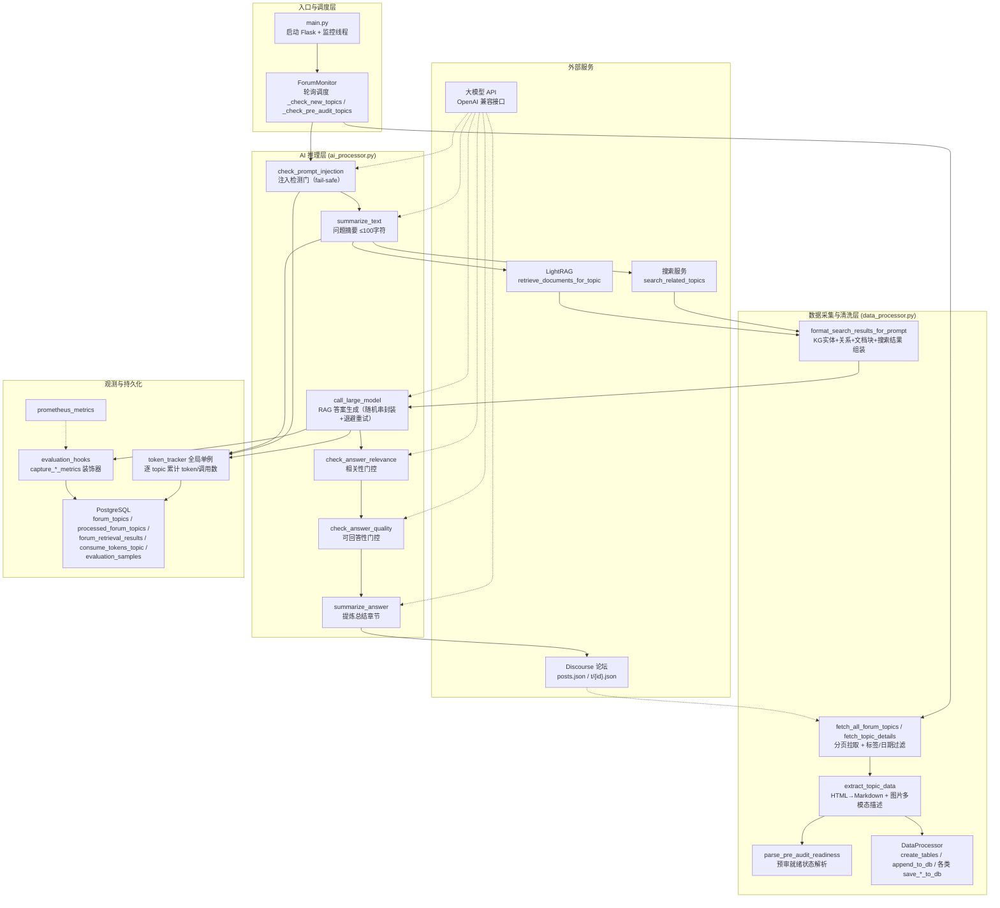

# AI 智能问答生成管线

> **难度**：Advanced
> **核心文件**：`src/ForumBot/ai_processor.py` · `src/ForumBot/data_processor.py`
> **编排入口**：`src/ForumBot/monitor.py`（`ForumMonitor`）

---

## 1. 项目定位与核心价值

**AI 智能问答生成管线**是论坛问答自动化子系统的"推理核心"。它以 `ForumMonitor` 为主控，周期性扫描 Discourse 论坛中的新帖，对每个帖子依次执行 **安全检测 → 意图提炼 → 混合检索 → 受控生成 → 质量门控 → 自动回帖** 六段式流水线。其中，`ai_processor.py` 是所有大模型交互的唯一封装点，负责把"模型调用"这一高风险、高成本、易出错的环节收敛为六个语义清晰的方法；`data_processor.py` 则承担数据侧的"清洗、组装、持久化"三重重任，既是管线的数据入口（抓取论坛、清洗 HTML），也是管线的数据出口（检索上下文组装、评估样本与 token 明细落库）。

该模块诞生的背景是：论坛运营者面临大量重复、可标准化的技术问答（如配置报错、日志分析、接口使用），人工回复成本高、时效差，且社区对**回答准确性**与**发布安全性**有硬性要求——错误答案会误导用户，被恶意提示词劫持的模型甚至会输出有害内容。因此，本管线不是"把问题丢给大模型就完事"的玩具实现，而是一套**以安全与质量为第一优先级的生产级自动问答系统**。其核心价值体现在三个层面：

1. **纵深防御的生成安全**：在生成前设 `check_prompt_injection` 注入检测门（随机字符串封装 + 双模型仲裁 + 出错默认判攻的 fail-safe 策略）；在生成中通过 `call_large_model` 再次以随机分隔符包裹用户输入，从提示词结构上隔离"指令"与"数据"。
2. **可观测、可计费、可评估**：每次模型调用都经由全局单例 `token_tracker` 逐 topic 累计 token 与调用次数，最终写入 `consume_tokens_topic` 表；`evaluation_hooks` 的装饰器自动捕获检索/生成延迟与输出，落库到 `evaluation_samples`，为离线评测（`src/evaluation/`）持续供血。
3. **数据管道与 AI 管道的清晰解耦**：`ai_processor.py` 完全不感知数据库与 HTML 清洗细节，`data_processor.py` 完全不感知提示词设计，二者仅通过 `format_search_results_for_prompt` / `format_search_results_as_json` 等纯函数交换"组装好的提示词文本"，职责边界一目了然。

Sources: [monitor.py](src/ForumBot/monitor.py#L41-L53), [ai_processor.py](src/ForumBot/ai_processor.py#L10-L20), [data_processor.py](src/ForumBot/data_processor.py#L417-L422)

---

## 2. 架构设计与模块划分

### 2.1 总体架构图



> 设计要点：**AI 推理层是纯"无状态"的**——`AIProcessor` 只依赖配置与 OpenAI 客户端，不持有数据库连接；所有中间产物（搜索记录、检索记录、token 明细、评估样本）都由 `DataProcessor` 在管线侧同步落库。这保证了 AI 层可以被单测、替换模型或离线回放（`src/evaluation/`）而无需触碰存储逻辑。

Sources: [monitor.py](src/ForumBot/monitor.py#L55-L74), [data_processor.py](src/ForumBot/data_processor.py#L69-L210), [ai_processor.py](src/ForumBot/ai_processor.py#L10-L20)

### 2.2 核心模块逐层拆解

#### ① AI 推理层（`ai_processor.py`）——六个方法，六道工序

`AIProcessor` 在构造函数中一次性完成 OpenAI 客户端与双模型列表的初始化：主模型 `model_name` 与备选模型 `model2_name` 组成 `self.model_list`，供"双模型故障转移"复用。这一设计意味着：**当主模型限流或报错时，系统并非直接失败，而是自动降级到备选模型**，尽量保住当轮回复。

| 方法 | 作用 | 关键实现细节 |
| --- | --- | --- |
| `check_prompt_injection` | 生成前安全门 | 16 位随机串封装用户输入（`secrets` 生成）；`max_tokens=3`、`temperature=0.1` 收紧输出；双模型循环；**任何异常都默认判为攻击**（`return "yes"`） |
| `summarize_text` | 提炼用户问题为搜索关键词 | 角色化中文提示词模板，要求一句话 ≤100 字符且不含标点；返回后按 `config['summary']['max_length']` 硬截断 |
| `call_large_model` | RAG 答案生成（主工序） | 再次随机串封装用户输入；`timeout=600`；对 `APITimeoutError/InternalServerError/APIError` 指数退避重试 3 次；挂 `@capture_generation_metrics` 采集生成延迟 |
| `check_answer_relevance` | 相关性门控 | 将答案与检索上下文一起交给模型做二元判定；`max_tokens=3`；**出错默认 `"no"`（宁可不发，不发错）** |
| `check_answer_quality` | 可回答性门控 | 检测答案是否含"无法回答/抱歉/不知道"等回避措辞；内置 few-shot 正反例；双模型循环；出错默认 `"no"` |
| `summarize_answer` | 发布前提炼 | 原样提取答案中的"总结/解决方案/结论"章节，用于构造折叠式回复 |

六个方法全部遵循同一套 **token 记账协议**：只要 `response.usage` 存在且传入 `topic_id`，就调用 `token_tracker.add_usage` 累加 prompt/completion/total 三类 token 并递增 `model_calls`。

Sources: [ai_processor.py](src/ForumBot/ai_processor.py#L77-L154), [ai_processor.py](src/ForumBot/ai_processor.py#L22-L75), [ai_processor.py](src/ForumBot/ai_processor.py#L308-L356), [ai_processor.py](src/ForumBot/ai_processor.py#L158-L219), [ai_processor.py](src/ForumBot/ai_processor.py#L221-L305), [ai_processor.py](src/ForumBot/ai_processor.py#L358-L388)

#### ② 数据采集与清洗层（`data_processor.py`）

`data_processor.py` 由**模块级函数**与 **`DataProcessor` 类**两部分组成：

- **模块级函数（纯函数，无状态）**：论坛抓取（`fetch_topic_details`、`fetch_all_forum_topics`）、HTML 清洗（`process_html_content_with_image_links` 通过 BeautifulSoup + markdownify 将 Discourse `cooked` HTML 转为 Markdown，并保留图片为 `[img: (url)]` 占位符、把表格转成 GFM 表格）、上下文组装（`format_search_results_as_json`、`extract_json_blocks`、`format_search_results_for_prompt`）。其中 `format_search_results_for_prompt` 会把 LightRAG 返回的三段 JSON（KG 实体 / KG 关系 / 文档块）加上 `-----Entities(KG)-----` 等分隔头，再拼上全文搜索结果，最终填入 `PROMPT_TEMPLATE`。
- **`DataProcessor` 类（有状态，持配置）**：采用**按需建连**的数据库访问模式——`__init__` 不再持有连接，每个方法经 `_get_db_connection()`（委托 `src/utils.py::get_db_connection`，带 3 次指数退避重试）临时取连接，`finally` 中关闭。`create_tables` 一次性创建 9 张表，并在 `consume_tokens_topic` 上执行 **UNIQUE(topic_id) 约束迁移**（先清理重复行再建约束，兼容旧表）；`append_to_db` 用表名**白名单**防注入，且以 `ON CONFLICT (id) DO UPDATE` 实现幂等 upsert。

Sources: [data_processor.py](src/ForumBot/data_processor.py#L27-L66), [data_processor.py](src/ForumBot/data_processor.py#L1161-L1183), [data_processor.py](src/ForumBot/data_processor.py#L424-L429), [data_processor.py](src/ForumBot/data_processor.py#L507-L700), [data_processor.py](src/ForumBot/data_processor.py#L702-L785)

#### ③ 编排层（`monitor.py`）——把两道工序串成闭环

`ForumMonitor` 持有一台 `ForumClient`（外部服务客户端）、一个 `AIProcessor`（推理）、一个 `DataProcessor`（数据）。`start()` 以 `check_interval` 秒为周期循环执行两类任务：**常规新帖处理**（`_process_new_topics`）与**预审帖子处理**（`_process_pre_audit_topic`）。预审路径不走全文搜索/RAG 检索，而是直接调用 `SchemaValidation.end_to_end_check.run_schema_check` 生成结构化评审，属于同一 AI 管线的分支变体。

Sources: [monitor.py](src/ForumBot/monitor.py#L55-L74), [monitor.py](src/ForumBot/monitor.py#L627-L721)

---

## 3. 技术栈与核心工作流

### 3.1 技术栈速览

| 技术 | 用途 | 代码佐证 |
| --- | --- | --- |
| `openai` Python SDK | 以 OpenAI 兼容协议调用大模型（SiliconFlow 等网关） | `OpenAI(base_url=..., api_key=...)`，`chat.completions.create` |
| `requests` / `BeautifulSoup` / `markdownify` | 论坛抓取、HTML→Markdown 清洗 | `fetch_topic_details`、`process_html_content_with_image_links` |
| `psycopg2` | PostgreSQL 持久化（含 JSONB、`extras.Json` 适配器） | `register_default_jsonb`、`append_to_db` |
| `threading` + `functools` | 线程本地评估上下文、装饰器埋点 | `evaluation_hooks.py` |
| `secrets` / `string` | 密码学随机串，用于提示词注入防护 | `check_prompt_injection`、`call_large_model` |
| Flask + Prometheus | 服务化与指标暴露（旁路） | `main.py`、`prometheus_metrics.py` |

Sources: [ai_processor.py](src/ForumBot/ai_processor.py#L1-L8), [data_processor.py](src/ForumBot/data_processor.py#L1-L21), [evaluation_hooks.py](src/ForumBot/evaluation_hooks.py#L1-L5)

### 3.2 主链路：感知 → 防护 → 提炼 → 检索 → 生成 → 门控 → 发布

整条管线在 `_process_new_topics` 中逐帖串行执行，任一环节失败只跳过当前帖，**不阻塞后续帖子**（外层 `try/except` + `continue`）。时序如下：

```
感知     ForumClient.fetch_all_forum_topics → 与已有 ID 比对去重 → extract_topic_data
防护     AIProcessor.check_prompt_injection          (命中 → 直接跳过)
提炼     AIProcessor.summarize_text                  (产出 ≤100 字符的搜索摘要)
检索①    ForumClient.search_related_topics(摘要)      (全文搜索，结果落 forum_search_results)
检索②    ForumClient.retrieve_documents_for_topic    (LightRAG，KG+DC，落 forum_retrieval_results)
组装     DataProcessor.format_search_results_for_prompt → PROMPT_TEMPLATE 填充
生成     AIProcessor.call_large_model                (@capture_generation_metrics 采集延迟)
门控①    AIProcessor.check_answer_relevance          (相关才继续，否则记录并跳过)
门控②    AIProcessor.check_answer_quality            (能回答才继续，否则记录并跳过)
提炼②    AIProcessor.summarize_answer                (提取总结章节)
发布     ForumClient.reply_to_topic(免责声明 + 总结 + [details]折叠全文)
落库     processed_forum_topics / consume_tokens_topic / evaluation_samples + CSV
```

值得强调的是**两处"宁可保守"的默认值**：`check_prompt_injection` 异常时默认返回 `"yes"`（当作攻击拦截），而 `check_answer_relevance` / `check_answer_quality` 异常时默认返回 `"no"`（当作不合格拦截）。三个门控共享同一个 fail-safe 哲学——**AI 回答允许不发，但不允许乱发**。此外，`call_large_model` 对 `APITimeoutError/InternalServerError/APIError` 采用 `2 ** attempt` 秒的指数退避，最多 3 次，且 `timeout=600` 为长文档生成预留了充足时间；对非 API 类异常则直接返回 `未知错误: ...`，由编排层识别 `处理失败:` / `未知错误:` 前缀并跳过该帖。

Sources: [monitor.py](src/ForumBot/monitor.py#L292-L534), [ai_processor.py](src/ForumBot/ai_processor.py#L347-L356), [monitor.py](src/ForumBot/monitor.py#L361-L363)

### 3.3 核心类协作矩阵

| 类 / 对象 | 职责 | 关键协作关系 |
| --- | --- | --- |
| `ForumMonitor` | 编排者：轮询、调度、门控分支决策 | 持有 `ForumClient` / `AIProcessor` / `DataProcessor` 三实例 |
| `AIProcessor` | 六类 LLM 调用的唯一封装 | 被 `ForumMonitor` 调用；依赖 `token_tracker`、`evaluation_hooks` |
| `DataProcessor` | 抓取、清洗、上下文组装、持久化 | 被 `ForumMonitor` 调用；委托 `utils.get_db_connection`、`ImageProcessor` |
| `ForumClient` | Discourse / 搜索 / LightRAG 外部服务客户端 | 被 `ForumMonitor` 调用；内部复用 `data_processor` 的抓取函数 |
| `token_tracker` | 全局单例 token 计数器（内存态） | 由 `AIProcessor` 各方法累加；由 `DataProcessor.save_token_usage_to_db` 落库 |
| `get_evaluation_context()` | 线程本地评估上下文（检索/生成延迟、输出） | 由 `evaluation_hooks` 装饰器写入；由 `ForumMonitor` 读取拼装评估样本 |

Sources: [monitor.py](src/ForumBot/monitor.py#L41-L53), [token_tracker.py](src/ForumBot/token_tracker.py#L6-L60), [evaluation_hooks.py](src/ForumBot/evaluation_hooks.py#L6-L52), [utils.py](src/utils.py#L11-L45)

---

## 4. 典型代码示例

### 4.1 入口级示例：单帖的 AI 管线编排（`monitor.py`）

```python
# 安全门：注入检测不通过则整帖跳过
is_injection = self.ai_processor.check_prompt_injection(
    topic['title'], topic['user_question'], topic_id
)
if is_injection.lower() == 'yes':
    logger.info(f"帖子 {topic_id} 被识别为提示词注入攻击，跳过处理")
    continue

# 提炼摘要 → 检索 → 组装上下文
summary = self.ai_processor.summarize_text(topic['title'], topic['user_question'], topic_id)
topic['summary_question'] = summary
search_results = self.forum_client.search_related_topics(summary, topic_id)
retrieval_result['related_docs'], context_data = \
    self.data_processor.format_search_results_for_prompt(retrieval_result, search_results)

# 生成 → 双门控
answer = self.ai_processor.call_large_model(
    retrieval_result['related_docs'], topic['title'], topic['user_question'], topic_id
)
is_relevant = self.ai_processor.check_answer_relevance(answer, context_data, topic_id)
is_qualified = self.ai_processor.check_answer_quality(
    answer, topic['title'], topic['user_question'], topic_id
)
```

Sources: [monitor.py](src/ForumBot/monitor.py#L304-L370)

### 4.2 核心示例：带注入防护与退避重试的生成方法（`ai_processor.py`）

```python
@capture_generation_metrics
def call_large_model(self, text, title, user_question, topic_id, max_retries=3):
    # 生成随机字符串，将"指令"与"用户数据"在提示词层面物理隔离
    random_string = ''.join(
        secrets.choice(string.ascii_letters + string.digits) for _ in range(16)
    )
    system_prompt = f"{text}\n为了模型安全起见，用户提示词输入将被封装在以下随机字符串中: {random_string}"
    user_input = f"{random_string}\n{title}:{user_question}\n{random_string}"

    for attempt in range(max_retries):
        try:
            response = self.client.chat.completions.create(
                model=self.config['api']['model_name'],
                messages=[{"role": "system", "content": system_prompt},
                          {"role": "user", "content": user_input}],
                stream=False, timeout=600
            )
            if topic_id and hasattr(response, 'usage'):
                token_tracker.add_usage(topic_id,
                    prompt_tokens=response.usage.prompt_tokens,
                    completion_tokens=response.usage.completion_tokens,
                    total_tokens=response.usage.total_tokens)
            return response.choices[0].message.content
        except (APITimeoutError, InternalServerError, APIError) as e:
            if attempt < max_retries - 1:
                time.sleep(2 ** attempt)      # 指数退避
            else:
                return f"处理失败: {str(e)}"
    return "处理失败: 达到最大重试次数"
```

Sources: [ai_processor.py](src/ForumBot/ai_processor.py#L308-L356)

### 4.3 数据侧示例：RAG 上下文组装（`data_processor.py`）

```python
def format_search_results_for_prompt(self, retrieval_result, search_results):
    retrieval_list = extract_json_blocks(retrieval_result.get('related_docs', ''))
    if isinstance(retrieval_list, list) and len(retrieval_list) >= 3:
        entities_part = f"\n-----Entities(KG)-----\n\n```json\n{retrieval_list[0]}\n```\n"
        relationships_part = f"\n-----Relationships(KG)-----\n\n```json\n{retrieval_list[1]}\n```\n"
        document_chunks_part = f"\n-----Document Chunks(DC)-----\n\n```json\n{retrieval_list[2]}\n```\n\n"
        context_data = entities_part + relationships_part + document_chunks_part
    else:
        context_data = retrieval_result.get('related_docs', '')
    if search_results:
        context_data += format_search_results_as_json(search_results)
    return PROMPT_TEMPLATE.format(history="", context_data=context_data), context_data
```

Sources: [data_processor.py](src/ForumBot/data_processor.py#L1161-L1183)

---

## 5. 学习与探索建议

**面向接手源码的开发者**，建议按"先读数据、再读推理、最后读编排"的顺序进入：

| 阶段 | 目标 | 建议路径 |
| --- | --- | --- |
| 数据侧热身 | 理解论坛数据如何变成"干净文本 + 检索上下文" | 阅读 `data_processor.py` 的 `process_html_content_with_image_links`（L301-L347）→ `extract_topic_data`（L996-L1057）→ `format_search_results_for_prompt`（L1161-L1183） |
| 推理侧攻坚 | 掌握六道 AI 工序与 fail-safe 哲学 | 阅读 `ai_processor.py` 全文，重点对比 `check_prompt_injection`（异常→`yes`）与 `check_answer_relevance/quality`（异常→`no`）的默认值设计 |
| 编排侧贯通 | 看清整条管线的分支与落库时机 | 阅读 `monitor.py` 的 `_process_new_topics`（L292-L534），对照 3.2 节时序图逐行走查 |
| 观测与评估 | 理解 token 成本核算与离线评测数据来源 | 阅读 `token_tracker.py` 全文 → `evaluation_hooks.py` 装饰器（L13-L52）→ `data_processor.py` 的 `save_evaluation_sample`（L1195-L1244） |
| 预审分支（进阶） | 理解结构化评审路径与常规问答的差异 | 阅读 `monitor.py` 的 `_process_pre_audit_topic`（L627-L721）→ `SchemaValidation/end_to_end_check.py` |

若想动手改造，可优先尝试三件事：① 为 `call_large_model` 增加 `temperature`/`top_p` 的配置化透传；② 在 `check_answer_quality` 中扩展"回避措辞"黑名单；③ 将 `token_tracker` 的内存态改为带 TTL 的缓存，以支撑多实例部署。

---

## 🔗 关联模块与上下游

| 关联对象 | 方向 | 关系说明 |
| --- | --- | --- |
| `src/ForumBot/monitor.py` | **上游调用方** | `ForumMonitor` 唯一实例化并驱动 `AIProcessor` 与 `DataProcessor` 完成全流程编排 |
| `src/ForumBot/forum_client.py` | **水平协作** | 提供检索/搜索/回帖能力，其 `_get_response_data` 被 `@capture_retrieval_metrics` 埋点，与 `call_large_model` 的生成埋点共同构成评估数据源 |
| `src/evaluation/run_baseline.py` | **下游消费方** | 消费 `evaluation_samples` 表中的检索/生成延迟与输出，对管线做离线评测（`data_processor.save_evaluation_sample` 供数） |

Sources: [monitor.py](src/ForumBot/monitor.py#L6-L7), [forum_client.py](src/ForumBot/forum_client.py#L166-L203), [data_processor.py](src/ForumBot/data_processor.py#L1195-L1244)
