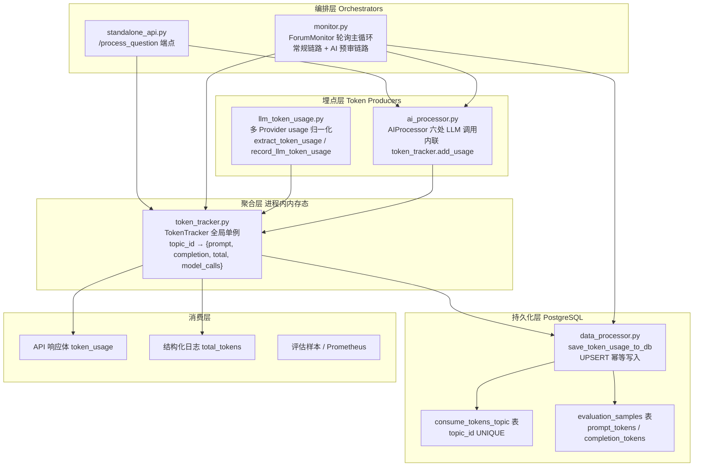
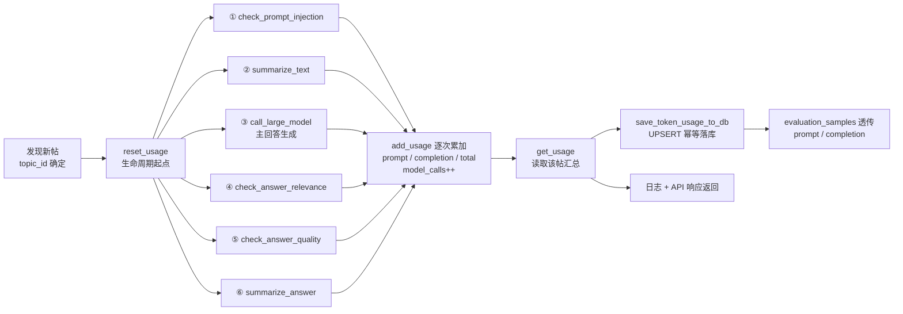

# Token 消耗追踪与成本核算

> **难度**: Intermediate ｜ **章节**: 论坛问答自动化
> **核心文件**: `src/ForumBot/token_tracker.py` · `src/ForumBot/llm_token_usage.py`

---

## 1. 项目定位与核心价值 (Detailed Overview)

### 1.1 背景与痛点

ForumBot 的问答自动化并非"一次调用大模型"那么简单。在**常规问答链路**中，单个帖子从被监控发现到最终回复，需要依次经过**提示词注入检测 → 问题摘要 → 检索上下文组装 → 大模型生成回答 → 答案相关性校验 → 答案质量校验 → 回答总结**等多道 LLM 调用（`src/ForumBot/monitor.py` 的 `_process_new_topics` 完整编排了这条流水线）。每一道调用都会消耗模型计费 token，且不同调用点的模型型号、输入长度差异巨大——注入检测与质量校验往往只输出 `yes/no`（`max_tokens=3`），而生成回答的上下文可能包含整段知识图谱与文档分片。若不做细粒度统计，运维方将完全无法回答"**处理一个帖子到底花了多少钱**"这一基本成本问题。

此外，项目的模型接入并非单一形态：既有 OpenAI 原生 SDK 返回的 `response.usage`（`prompt_tokens` / `completion_tokens` / `total_tokens` 命名），也存在 LangChain 包装后的 `usage_metadata`（`input_tokens` / `output_tokens` 命名）等异构结构。如果埋点代码直接 `response.usage.prompt_tokens` 硬编码取值，一旦后端切换或响应结构变化就会静默丢数。因此项目需要**一层与 Provider 无关的归一化适配**，将各种响应形态统一映射为 `{prompt_tokens, completion_tokens, total_tokens}` 三元组。

### 1.2 核心价值与设计取向

该子系统的设计取向可以概括为三个关键词：**按帖子粒度聚合（per-topic aggregation）**、**内存先行 + 落库兜底（in-memory first, persist later）**、**幂等可重跑（idempotent upsert）**。

- **按帖子粒度聚合**：所有统计都以 `topic_id` 为唯一主键，天然回答"这一个帖子消耗了多少 token、触发了多少次模型调用"。这与监控主循环"逐帖容错处理"（单帖异常不影响其他帖子）的哲学保持一致——统计粒度与业务处理粒度严格对齐。
- **内存先行 + 落库兜底**：`TokenTracker` 是进程内单例，一次 `add_usage` 仅是内存字典累加，不触发任何 I/O；只有当一个帖子的完整处理流程结束（或中途失败被捕获）后，才通过 `DataProcessor.save_token_usage_to_db` 一次性 UPSERT 到 PostgreSQL 的 `consume_tokens_topic` 表。这种设计将高频累加（每帖多次）与低频持久化（每帖一次）解耦，避免为每次模型调用都写库。
- **幂等可重跑**：数据库表以 `topic_id` 为 `UNIQUE` 约束，落库采用 `ON CONFLICT (topic_id) DO UPDATE`，即使同一帖子被重复处理（如监控重启、人工重跑），也不会产生重复成本记录，只会覆盖为最新汇总值。

需要指出的是：系统记录的是**原始 token 计数**，并未内置"单价 × 数量"的金额换算。成本核算发生在消费侧——`monitor.py` 和 `standalone_api.py` 拿到 `total_tokens` 后结合 `model_calls`、模型型号与外部计费表自行换算金额。这是将"计量（metering）"与"计价（billing）"分离的务实做法，便于适配不同供应商的阶梯计价策略。

Sources: [monitor.py](src/ForumBot/monitor.py#L292-L534), [standalone_api.py](src/ForumBot/standalone_api.py#L76-L130), [data_processor.py](src/ForumBot/data_processor.py#L880-L923), [README.md](README.md#L10-L13)

---

## 2. 架构设计与模块划分 (Architecture & Modules)

### 2.1 模块拓扑总览

Token 统计系统横跨五个层次：**编排层**（谁发起处理）→ **埋点层**（谁产生数据）→ **聚合层**（内存态记账本）→ **持久化层**（PostgreSQL 落库）→ **消费层**（API 响应 / 日志 / 评估样本 / 可观测性）。其中本页面的两个核心文件分别承担**聚合层**（`token_tracker.py`）与**适配层**（`llm_token_usage.py`，属于埋点层的统一入口）。



> 上图虚线划分了"谁产生、谁聚合、谁落库、谁消费"四个职责边界。**聚合层是唯一写入点**，所有 LLM 调用（无论经由 `ai_processor.py` 内联埋点还是 `record_llm_token_usage` 统一入口）最终都汇聚到同一个 `token_tracker` 单例。

### 2.2 聚合层：`TokenTracker`（token_tracker.py）

`TokenTracker` 是一个极简的**内存记账本**：以 `topic_id` 为键，维护四个计数器。其数据契约如下：

| 字段 | 语义 | 来源 |
|------|------|------|
| `prompt_tokens` | 输入（提示词侧）token 累计 | Provider usage 或累加 |
| `completion_tokens` | 输出（生成侧）token 累计 | Provider usage 或累加 |
| `total_tokens` | 总 token 累计 | Provider usage 或 prompt+completion 求和 |
| `model_calls` | 该帖子触发的模型调用次数 | 每次 `add_usage` 自增 |

四个方法各司其职：

- **`reset_usage(topic_id)`**：为指定帖子初始化一条零值记录并覆盖旧值，返回前打印 `"已重置topic {topic_id} 的token统计"`。**它是"每帖一次"的生命周期起点**——`standalone_api.py` 在收到用户问题生成随机 `topic_id` 后立即调用；AI 预审链路在开始处理前也调用。
- **`add_usage(topic_id, prompt_tokens, completion_tokens, total_tokens)`**：核心累加器。若键不存在则**惰性自动初始化**（调用自身 `reset_usage`），随后将三项 token 数值累加并使 `model_calls += 1`。调用方即使忘记 reset 也不会 KeyError——这是对生产健壮性的显式让步。
- **`get_usage(topic_id)`**：**安全读取**——键不存在时返回一个全零 dict 而非抛异常或返回 `None`，避免下游 `token_usage['total_tokens']` 直接解引用崩溃。这一细节被 `monitor.py` 和 `standalone_api.py` 多处依赖。
- **`get_all_usage()`**：返回整个记账本快照，用于批量导出/调试。

模块底部通过 `token_tracker = TokenTracker()` 暴露**模块级单例**，所有业务模块 `from .token_tracker import token_tracker` 共享同一实例。单例意味着统计生命周期与进程生命周期绑定：**进程重启即清零**，因此必须依赖持久化层兜底。

Sources: [token_tracker.py](src/ForumBot/token_tracker.py#L6-L60)

### 2.3 适配层：`llm_token_usage.py`（多 Provider 归一化）

该模块解决"**同一个响应对象，如何在不同 Provider 结构下都能取到 token 数值**"的适配问题，内部是三层递进的防御式工具链：

1. **取值原语**：`_read_value(source, key)` 同时兼容 `dict`（`Mapping.get`）与任意对象（`getattr`），即"鸭子类型"读取；`_coerce_int(value)` 将任意值安全转 `int`，对 `None` / `TypeError` / `ValueError` 一律返回 `None`，绝不抛出。
2. **单对象提取**：`_extract_from_usage_object(usage)` 对单个 usage 对象做**双命名归一化**——优先读 OpenAI 风格 `prompt_tokens` / `completion_tokens`，缺失时回退 Anthropic/LangChain 风格 `input_tokens` / `output_tokens`；`total_tokens` 缺失时用 `prompt + completion` 兜底求和；三项全缺则返回 `None` 表示"不可识别"。
3. **多级兜底提取**：`extract_token_usage(response)` 按固定优先级扫描响应对象中所有可能的 usage 落点，命中即返回：

| 优先级 | 落点路径 | 典型来源 |
|--------|----------|----------|
| 1 | `response.usage` | OpenAI / 兼容 SDK 原生响应 |
| 2 | `response.usage_metadata` | LangChain 包装消息 |
| 3 | `response.response_metadata.token_usage` / `.usage` | LangChain `AIMessage` |
| 4 | `response.llm_output.token_usage` | LangChain `LLMResult` |

最外层入口 **`record_llm_token_usage(topic_id, response, source="llm")`** 将"提取 + 入账"封装为一步：`topic_id` 为空直接短路返回；提取失败打印 `"未返回可识别的token usage"` 告警并返回 `None`（**丢数不崩溃**，成本数据缺失以日志暴露）；提取成功则调用全局 `token_tracker.add_usage` 入账并回传 usage 供调用方复用。

Sources: [llm_token_usage.py](src/ForumBot/llm_token_usage.py#L10-L93)

### 2.4 埋点层：`ai_processor.py` 的内联埋点

`AIProcessor` 的 **6 处 LLM 调用点全部直接内联 `token_tracker.add_usage(...)`**，形成一条与调用一一对应的埋点带：

| # | 方法 | 埋点行 | 调用目的 | 输出规模 |
|---|------|--------|----------|----------|
| 1 | `summarize_text` | L63-L70 | 问题摘要（一句话 ≤100 字符） | 短 |
| 2 | `check_prompt_injection` | L132-L139 | 提示词注入检测 `yes/no` | `max_tokens=3` |
| 3 | `check_answer_relevance` | L204-L211 | 答案相关性校验 `yes/no` | `max_tokens=3` |
| 4 | `check_answer_quality` | L283-L290 | 答案质量校验 `yes/no` | `max_tokens=3` |
| 5 | `call_large_model` | L338-L345 | 主回答生成（最长上下文） | 长 |
| 6 | `summarize_answer` | L376-L383 | 回答折叠摘要提取 | 中 |

所有埋点采用同一防御模式：先 `hasattr(response, 'usage')` 判断，再对 `response.usage` 的每个属性单独 `hasattr` 兜底，取不到即填 `0`。**注意埋点是"账先记、值后查"**——`add_usage` 在调用点同步执行，而 `model_calls` 的语义是"每成功执行一次 `add_usage` 即 +1"。

> **设计观察（双轨埋点）**：`ai_processor.py` 的内联 `add_usage` 与 `llm_token_usage.py` 的 `record_llm_token_usage` 构成"两条入账路径"。前者已深度接入生产、后者目前主要被测试直接引用。前者更"直给"、后者更"健壮且归一化"。从演进角度，`record_llm_token_usage` 是更可维护的统一入口——新接入的 Provider 或新调用点应优先走它，避免 6 处内联埋点的重复防御代码继续蔓延。

Sources: [ai_processor.py](src/ForumBot/ai_processor.py#L51-L70), [ai_processor.py](src/ForumBot/ai_processor.py#L119-L139), [ai_processor.py](src/ForumBot/ai_processor.py#L193-L211), [ai_processor.py](src/ForumBot/ai_processor.py#L265-L290), [ai_processor.py](src/ForumBot/ai_processor.py#L322-L345), [ai_processor.py](src/ForumBot/ai_processor.py#L367-L383)

### 2.5 持久化层：`data_processor.py` 的建表与 UPSERT

持久化由 `DataProcessor` 承担两个职责：

**建表与迁移**（`create_tables`）：`consume_tokens_topic` 表结构为 `topic_id INTEGER UNIQUE` + 三个 token 计数器 + `model_calls` + `created_at`。特别值得关注的是**在线迁移逻辑**：建表后通过 `pg_constraint` 检查 `UNIQUE` 约束是否存在，若旧版本表缺约束，则先删除同一 `topic_id` 的重复行（保留 `MIN(id)` 最早一条），再 `ALTER TABLE ... ADD CONSTRAINT` 补上。这是对历史脏数据的显式治理。

**幂等写入**（`save_token_usage_to_db`）：对 `topic_id` 做 `ON CONFLICT (topic_id) DO UPDATE SET ...` 的 UPSERT，将内存汇总值整体覆盖并刷新 `created_at`。配合 `get_usage` 返回全零 dict 的设计，即使某帖一次 LLM 调用都没成功，也会写入一条全零记录，保证"处理过的帖子必有成本账"。

此外，评估体系中的 `evaluation_samples` 表也冗余了 `prompt_tokens` / `completion_tokens` 字段（`monitor.py` 在 `save_evaluation_sample` 时从 `token_usage` 透传），使得离线评估报告能够按 token 成本维度分析回答质量。

Sources: [data_processor.py](src/ForumBot/data_processor.py#L580-L615), [data_processor.py](src/ForumBot/data_processor.py#L880-L923), [data_processor.py](src/ForumBot/data_processor.py#L667-L681), [monitor.py](src/ForumBot/monitor.py#L395-L406)

### 2.6 消费层：日志 / API 响应 / 可观测性

- **结构化日志**：`monitor.py` 在每帖处理完成时打印 `"帖子 {topic_id} 回复内容已生成(Token使用: 总计{total_tokens})"`，运维可直接 grep 日志做粗粒度成本核对。
- **API 响应体**：`standalone_api.py` 的 `/process_question` 将 `token_usage` 作为独立字段随回答一起返回，前端/调用方无需再查库即可拿到本帖子成本。
- **可观测性**：`prometheus_metrics.py` 当前登记了延迟、召回文档数、处理帖子数等指标，**尚未登记 token 计数器**——这属于成本可观测性的一个明确的扩展点（可新增 `Counter` 类型指标如 `forum_prompt_tokens_total` / `forum_completion_tokens_total`）。

Sources: [monitor.py](src/ForumBot/monitor.py#L473-L475), [standalone_api.py](src/ForumBot/standalone_api.py#L118-L130), [prometheus_metrics.py](src/ForumBot/prometheus_metrics.py#L4-L33)

---

## 3. 技术栈与核心工作流 (Tech Stack & Workflow)

### 3.1 技术栈构成

| 层次 | 技术 | 说明 |
|------|------|------|
| LLM 客户端 | `openai` SDK | `OpenAI(base_url, api_key)`，兼容第三方网关 |
| 聚合容器 | 纯 Python `dict` | 无第三方依赖，进程内存态 |
| 归一化工具 | 标准库 `collections.abc.Mapping` / `typing` | 鸭子类型读取 + 安全类型转换 |
| 持久化 | `psycopg2` + PostgreSQL | `JSONB` 注册、`ON CONFLICT` UPSERT、`pg_constraint` 迁移 |
| 日志 | `logging` + `RotatingFileHandler` | `main_logger` 全局实例，20MB 轮转 × 4 备份 |
| 测试 | `pytest` | `tests/test_token_tracker.py`、`tests/test_llm_token_usage.py` |

### 3.2 单帖 Token 生命周期（核心工作流）

Token 统计贯穿"感知 → 规划 → 执行 → 校验 → 落账"全链路：



**关键流程要点**：

1. **起点差异**：`standalone_api.py` 用 `secrets.randbelow` 生成随机 `topic_id` 并显式 `reset_usage`；`monitor.py` 常规链路用真实论坛帖子 ID 且**不显式 reset**（新帖子 ID 天然不存在于记账本，`add_usage` 惰性初始化即可）；AI 预审链路用 `str(topic_id)` 字符串键并显式 reset（防御旧数据残留）。
2. **记账时机**：每处 LLM 调用在拿到 `response` 后**同步入账**，因此中途某帖被判定"注入攻击跳过处理"或"大模型处理失败跳过回复"时，已消耗的 token 依然被正确累加，不会被漏记。
3. **落账时机**：仅在帖子处理流程结束（正常回复 / 校验不过 / 预审不可回复）后调用一次 `save_token_usage_to_db`。`_process_pre_audit_topic` 甚至用局部闭包 `_get_token_usage` / `_save_current_token_usage` 包装，确保异常路径（`finally` 前）也能尽量入账。
4. **成本换算**：`total_tokens × 单价` 的换算不在系统内完成——`model_calls` 字段提供了"调用次数"维度，配合日志中的模型名（`model2_name` / `model_name` 双模型回退）即可在外部复算精确成本。

Sources: [standalone_api.py](src/ForumBot/standalone_api.py#L76-L80), [monitor.py](src/ForumBot/monitor.py#L305-L384), [monitor.py](src/ForumBot/monitor.py#L635-L711), [ai_processor.py](src/ForumBot/ai_processor.py#L17-L20)

---

## 4. 典型代码示例 (Showcase)

### 4.1 惰性累加：账本的容错哲学

```python
# src/ForumBot/token_tracker.py
def add_usage(self, topic_id, prompt_tokens=0, completion_tokens=0, total_tokens=0):
    # 键不存在时自动初始化，调用方无需显式 reset 也不会 KeyError
    if topic_id not in self.token_usage:
        self.reset_usage(topic_id)

    self.token_usage[topic_id]['prompt_tokens'] += prompt_tokens
    self.token_usage[topic_id]['completion_tokens'] += completion_tokens
    self.token_usage[topic_id]['total_tokens'] += total_tokens
    self.token_usage[topic_id]['model_calls'] += 1
```

`get_usage` 的零值兜底与之呼应——"**宁可给全零账，也不让下游解引用崩溃**"是这套记账本贯穿始终的容错设计。

Sources: [token_tracker.py](src/ForumBot/token_tracker.py#L25-L51)

### 4.2 双命名归一化：Provider 无关的提取

```python
# src/ForumBot/llm_token_usage.py
prompt_tokens = _coerce_int(_read_value(usage, "prompt_tokens"))
if prompt_tokens is None:
    prompt_tokens = _coerce_int(_read_value(usage, "input_tokens"))  # Anthropic 命名

total_tokens = _coerce_int(_read_value(usage, "total_tokens"))
if total_tokens is None and prompt_tokens is not None and completion_tokens is not None:
    total_tokens = prompt_tokens + completion_tokens  # 缺失时求和兜底
```

`extract_token_usage` 的多级扫描（`usage` → `usage_metadata` → `response_metadata.token_usage/usage` → `llm_output.token_usage`）把"响应结构不确定"这一现实彻底封装，调用方只需关心标准三元组。

Sources: [llm_token_usage.py](src/ForumBot/llm_token_usage.py#L27-L74)

### 4.3 幂等落库：可重跑的成本账

```sql
-- src/ForumBot/data_processor.py save_token_usage_to_db 核心 SQL
INSERT INTO consume_tokens_topic
(topic_id, prompt_tokens, completion_tokens, total_tokens, model_calls)
VALUES (%s, %s, %s, %s, %s)
ON CONFLICT (topic_id)
DO UPDATE SET
    prompt_tokens = EXCLUDED.prompt_tokens,
    completion_tokens = EXCLUDED.completion_tokens,
    total_tokens = EXCLUDED.total_tokens,
    model_calls = EXCLUDED.model_calls,
    created_at = CURRENT_TIMESTAMP
```

配合 `create_tables` 中对旧表缺 `UNIQUE` 约束的在线迁移（先清重后加约束），该设计保证了监控重启、人工重跑场景下成本账始终是"一帖一行、覆盖式更新"。

Sources: [data_processor.py](src/ForumBot/data_processor.py#L593-L615), [data_processor.py](src/ForumBot/data_processor.py#L900-L914)

---

## 5. 学习与探索建议 (Next Steps & Learning Path)

### 新手路线：先建立"记账本"心智模型

1. 通读 `token_tracker.py` 全文（61 行），在脑中模拟：同一 `topic_id` 连续 3 次 `add_usage` 后，`get_usage` 返回什么？
2. 运行 `pytest tests/test_token_tracker.py -v` 与 `pytest tests/test_llm_token_usage.py -v`，用测试用例验证你对"累加语义"与"多级提取优先级"的理解。
3. 阅读 `standalone_api.py` 的 `/process_question`，观察 `reset_usage → 多步处理 → get_usage → 返回` 的完整闭环——这是最短的端到端 Token 记账样例。

### 进阶路线：沿埋点带与落库链深挖

| 目标 | 建议阅读 | 关注点 |
|------|----------|--------|
| 理解埋点全貌 | [ai_processor.py](src/ForumBot/ai_processor.py#L63-L70) 与其余 5 处埋点 | 6 处 `add_usage` 的防御式 `hasattr` 模式；为何主回答调用（`call_large_model`）是最重要的成本大头 |
| 理解编排消费 | [monitor.py](src/ForumBot/monitor.py#L373-L384) 与 [monitor.py](src/ForumBot/monitor.py#L635-L711) | `get_usage` 的三处调用时机；预审链路为何用字符串键 + 显式 reset + 闭包兜底落账 |
| 理解持久化与迁移 | [data_processor.py](src/ForumBot/data_processor.py#L580-L615) | `consume_tokens_topic` 建表 + `pg_constraint` 在线补约束迁移 |
| 理解评估联动 | [data_processor.py](src/ForumBot/data_processor.py#L1195-L1244) | `evaluation_samples` 表如何透传 `prompt_tokens` / `completion_tokens`，支撑按成本维度的质量分析 |

### 挑战建议

- **统一埋点入口**：将 `ai_processor.py` 的 6 处内联 `add_usage` 重构为统一走 `record_llm_token_usage`，消除重复防御代码，并为新 Provider 接入提供唯一适配点。
- **成本可观测性补全**：在 `prometheus_metrics.py` 新增 `forum_prompt_tokens_total` / `forum_completion_tokens_total` 等 `Counter` 指标，让成本进入 Grafana 大盘。
- **金额核算层**：在消费侧（日志或 API 响应）加入"模型型号 × 单价"换算，将 `total_tokens` 转化为人民币/美元成本字段。

---

## 🔗 关联模块与上下游

本页面为**局部模块**解读，与以下源码文件存在直接调用关系（1-3 个核心关联）：

- [src/ForumBot/ai_processor.py](src/ForumBot/ai_processor.py) —— **下游生产者**：6 处 LLM 调用点直接 `token_tracker.add_usage` 入账，是 token 数据的唯一生产源。
- [src/ForumBot/monitor.py](src/ForumBot/monitor.py) 与 [src/ForumBot/standalone_api.py](src/ForumBot/standalone_api.py) —— **上游编排者**：负责 `reset_usage` / `get_usage` 生命周期管理与消费。
- [src/ForumBot/data_processor.py](src/ForumBot/data_processor.py) —— **持久化下游**：`save_token_usage_to_db` 将聚合结果 UPSERT 至 `consume_tokens_topic` 表。
