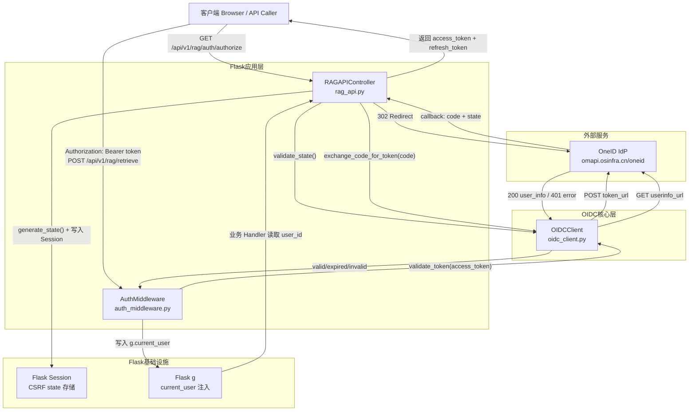
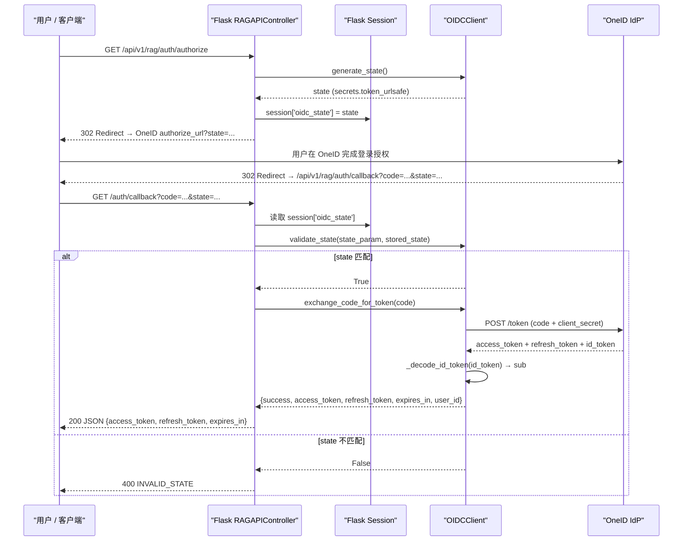
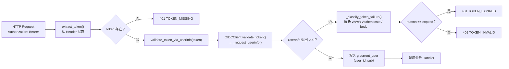

# OIDC 身份认证：授权码流程与 Token 校验

## 1. 项目定位与核心价值

### 背景与痛点

ForumBot 作为一个面向外部用户提供 RAG 检索与文档管理能力的服务，其 HTTP API 层面临一个典型的身份认证难题：如何在不引入私有账号体系的前提下，安全可靠地鉴别请求者身份？早期版本若直接暴露接口而不做认证，任何拥有 URL 的人都可以无限制地发起检索请求或触发文档管道操作，存在严重的资源滥用和数据泄露风险。

该项目选择接入 **OneID**（即 `omapi.osinfra.cn/oneid`）——一套符合 OpenID Connect（OIDC）规范的统一身份提供商（Identity Provider），将复杂的用户账户管理、密码存储、MFA 等职责全部外包给 IdP，让 ForumBot 自身只负责"验证令牌合法性"这一件事。这种职责分离的设计，既降低了安全漏洞风险，也使 ForumBot 能够轻松复用组织内已有的用户体系。

### 核心特性

**授权码流程（Authorization Code Flow）**是 OIDC 中最安全的授权模式。ForumBot 的实现完整覆盖了该流程的三个阶段：用户授权跳转、授权码换取 Token、以及 Token 的持续校验与刷新。其中，CSRF 防护通过 `state` 参数 + Flask Session 绑定机制实现；Token 的用户身份提取支持优先解码 `id_token` 中的 `sub` 字段，回退时调用 UserInfo 端点兜底，确保在不同 IdP 响应格式下均能稳定提取用户标识。

**Token 校验分层**是该实现另一个值得关注的设计点。系统对 Token 失效原因做了精细划分：`TOKEN_MISSING`（请求头缺失）、`TOKEN_EXPIRED`（令牌已过期，可刷新恢复）、`TOKEN_INVALID`（令牌无效或被篡改，需重新授权），三种错误码对应不同的客户端恢复策略，避免将所有 401 错误一刀切地要求用户重新登录，提升了 API 的可用性。`OIDCClient._classify_token_failure()` 通过解析 RFC 6750 Bearer 错误响应头及响应体中的 `error_description` 字段来区分这两类失效，语义精确。

Sources: [oidc_client.py](src/ForumBot/oidc_client.py#L1-L50), [auth_middleware.py](src/ForumBot/auth_middleware.py#L1-L20)

---

## 2. 架构设计与模块划分

### 模块依赖全景图



### 核心层职责解析

| 模块 | 类 / 函数 | 核心职责 |
|---|---|---|
| `oidc_client.py` | `OIDCClient` | OIDC 协议的完整实现：URL 构造、授权码兑换、Token 刷新、id_token 解码、UserInfo 查询、失效分类 |
| `auth_middleware.py` | `AuthMiddleware` | Flask 请求层的认证拦截：Bearer Token 提取、委托 OIDCClient 校验、结果注入 `g.current_user`、分层 HTTP 错误响应 |
| `rag_api.py` | `RAGAPIController` | 路由编排层：将 `AuthMiddleware.require_auth` 作为装饰器叠加在业务路由上，同时承载 `/auth/authorize`、`/auth/callback`、`/auth/refresh` 三个授权流程端点 |
| `external_api_app.py` | `create_app` | Flask 应用工厂：装配 `SECRET_KEY`（Session 加密依赖）、注册 RAG API Blueprint，并配置全局 HTTPS 强制跳转与错误处理器 |

**`OIDCClient`** 是整个认证体系的核心引擎。它被设计为无状态的协议客户端，不持有任何用户 Session 状态，仅负责与 OneID 端点通信。配置上支持预览环境优雅降级（`PREVIEW_ENV=true` 或配置值含 `${...}` 占位符时自动切换测试配置），避免 CI/CD 预览环境因缺少真实 OIDC 密钥而启动失败。

**`AuthMiddleware`** 则是 Flask 层的门卫。其 `require_auth` 方法返回一个标准的 `@wraps` 装饰器，可以透明地叠加在任意路由 Handler 上，不侵入业务逻辑。认证成功后，用户身份通过 `g.current_user = {'user_id': ...}` 注入到 Flask 请求上下文，下游 Handler（以及 `RBACMiddleware`、`RateLimiter`）直接从 `g` 中读取，形成清晰的流水线。

Sources: [oidc_client.py](src/ForumBot/oidc_client.py#L25-L55), [auth_middleware.py](src/ForumBot/auth_middleware.py#L54-L84), [rag_api.py](src/ForumBot/rag_api.py#L32-L62), [external_api_app.py](src/external_api_app.py#L12-L28)

---

## 3. 技术栈与核心工作流

### 授权码流程完整链路



### Token 校验链路

每次受保护 API 被调用时，`AuthMiddleware.require_auth` 装饰器触发如下校验链路：



### 核心接口一览

| HTTP 端点 | 方法 | 认证要求 | 说明 |
|---|---|---|---|
| `/api/v1/rag/auth/authorize` | GET | 无 | 生成 state，重定向至 OneID 授权页 |
| `/api/v1/rag/auth/callback` | GET | 无 | 接收授权码，完成 Token 兑换，返回令牌给客户端 |
| `/api/v1/rag/auth/refresh` | POST | 无（携带 refresh_token） | 使用 refresh_token 换取新 access_token |
| `/api/v1/rag/retrieve` | POST | `require_auth` | 检索接口，透传至 LightRAG，需有效 Bearer Token |
| `/api/v1/rag/documents/*` | GET/POST | `require_auth` | 文档状态/分页查询，需有效 Bearer Token |

Sources: [rag_api.py](src/ForumBot/rag_api.py#L64-L142), [auth_middleware.py](src/ForumBot/auth_middleware.py#L27-L52), [oidc_client.py](src/ForumBot/oidc_client.py#L254-L329)

---

## 4. 典型代码示例

### CSRF State 防护：生成与校验

`generate_state()` 使用 Python 标准库 `secrets` 模块，产出加密安全的随机字符串，写入 Flask 已加密签名的 Session，回调时严格比对，杜绝攻击者伪造回调请求：

```python
# oidc_client.py - OIDCClient.generate_state()
def generate_state(self):
    return secrets.token_urlsafe(16)

# rag_api.py - RAGAPIController.authorize()
def authorize(self):
    state = self.oidc_client.generate_state()
    session['oidc_state'] = state          # 写入加密 Session
    auth_url = self.oidc_client.get_authorization_url(state)
    return redirect(auth_url)

# rag_api.py - RAGAPIController.auth_callback()
def auth_callback(self):
    state_param = request.args.get('state')
    stored_state = session.get('oidc_state')   # 从 Session 读取
    if not self.oidc_client.validate_state(state_param, stored_state):
        return jsonify({'error': 'INVALID_STATE', ...}), 400
```

Sources: [oidc_client.py](src/ForumBot/oidc_client.py#L72-L92), [rag_api.py](src/ForumBot/rag_api.py#L64-L87)

### Token 失效原因精细分类

`_classify_token_failure()` 遵循 RFC 6750，优先解析 `WWW-Authenticate` 响应头，其次检查响应体的 `error`/`error_description` 字段，只要任意字段包含 `"expired"` 即判定为过期，否则视为无效：

```python
# oidc_client.py - OIDCClient._classify_token_failure()
def _classify_token_failure(self, response):
    parts = []
    try:
        parts.append(str(response.headers.get('WWW-Authenticate', '') or ''))
    except Exception:
        pass
    try:
        body = response.json()
        if isinstance(body, dict):
            parts.append(str(body.get('error', '') or ''))
            parts.append(str(body.get('error_description', '') or ''))
    except Exception:
        ...
    if 'expired' in ' '.join(parts).lower():
        return 'expired'
    return 'invalid'
```

Sources: [oidc_client.py](src/ForumBot/oidc_client.py#L287-L313)

### `require_auth` 装饰器：三路分叉的 401 响应

```python
# auth_middleware.py - AuthMiddleware.require_auth()
def require_auth(self, f):
    @wraps(f)
    def decorated(*args, **kwargs):
        access_token = self.extract_token()
        if not access_token:
            return jsonify({'error': 'TOKEN_MISSING', ...}), 401

        result = self.validate_token_via_userinfo(access_token)
        if not result.get('valid'):
            if result.get('reason') == 'expired':
                return jsonify({'error': 'TOKEN_EXPIRED', ...}), 401
            return jsonify({'error': 'TOKEN_INVALID', ...}), 401

        g.current_user = {'user_id': result['user_id']}  # 注入请求上下文
        return f(*args, **kwargs)
    return decorated
```

Sources: [auth_middleware.py](src/ForumBot/auth_middleware.py#L54-L84)

### 预览环境优雅降级

```python
# oidc_client.py - OIDCClient.__init__()
is_preview_env = os.environ.get('PREVIEW_ENV') == 'true' or \
                (self.client_id and self.client_id.startswith('${') and self.client_id.endswith('}'))

if is_preview_env:
    if not self.client_id or self.client_id.startswith('${'):
        self.client_id = 'preview-test-client-id'
        logger.warning("预览环境：OIDC client_id 使用测试配置")
    # ... client_secret, redirect_uri 同理
else:
    self._validate_config()  # 非预览环境严格校验，缺配置直接抛 ValueError
```

Sources: [oidc_client.py](src/ForumBot/oidc_client.py#L38-L54)

---

## 5. 配置参考

OIDC 所有配置统一在 `config.yaml` 的 `oidc` 段声明，通过 Vault → K8s Secret → cp 到 `config.yaml` 的部署链路注入：

| 配置键 | 默认值 | 说明 |
|---|---|---|
| `oidc.client_id` | 无（必填） | OIDC 客户端 ID |
| `oidc.client_secret` | 无（必填） | OIDC 客户端密钥 |
| `oidc.redirect_uri` | 无（必填） | 授权回调地址（测试/生产不同） |
| `oidc.authorize_url` | `https://omapi.osinfra.cn/oneid/oidc/authorize` | 授权端点 |
| `oidc.token_url` | `https://omapi.osinfra.cn/oneid/oidc/token` | Token 端点 |
| `oidc.userinfo_url` | `https://omapi.osinfra.cn/oneid/oidc/user` | UserInfo 端点 |
| `oidc.scope` | `openid profile` | 请求的权限范围 |
| `flask_secret_key` | `dev-secret-key-change-in-production` | Flask Session 加密密钥（**生产必须更换**） |

> **注意**：`flask_secret_key` 是 Flask Session 安全的基础。`oidc_state` 写入 Session 后由 Flask 用该密钥签名，确保攻击者无法伪造 Session 内容绕过 CSRF 校验。生产环境必须通过 Vault 注入强随机密钥。

Sources: [oidc_client.py](src/ForumBot/oidc_client.py#L25-L55), [external_api_app.py](src/external_api_app.py#L19-L20)

---

## 6. 学习与探索建议

### 纵向深入：认证与鉴权全链路

| 探索方向 | 目标文件 | 关注点 |
|---|---|---|
| **Token 校验核心逻辑** | [`src/ForumBot/oidc_client.py#L254-L329`](src/ForumBot/oidc_client.py) | `_request_userinfo` → `_classify_token_failure` → `validate_token` 的完整调用链，理解 RFC 6750 错误分类机制 |
| **中间件装饰器组合** | [`src/ForumBot/rag_api.py#L32-L62`](src/ForumBot/rag_api.py) | `require_auth` + `rate_limit` 的双层装饰器叠加顺序，理解 Flask 中间件的组合模式 |
| **用户身份下游消费** | [`src/ForumBot/rbac_middleware.py`](src/ForumBot/rbac_middleware.py) | `g.current_user` 在 `RBACMiddleware.require_upload_permission` 中的消费方式，理解 OIDC 认证如何驱动 RBAC 鉴权 |
| **限流与身份绑定** | [`src/ForumBot/rate_limiter.py`](src/ForumBot/rate_limiter.py) | 限流计数器以 `user_id` 为 key，依赖 `g.current_user` 注入，理解认证 → 鉴权 → 限流的三层防护流水线 |
| **Flask 应用工厂** | [`src/external_api_app.py`](src/external_api_app.py) | `SECRET_KEY` 的装配、Blueprint 注册顺序、全局 HTTPS 强制中间件，理解 Flask 应用级安全配置 |
| **主应用集成点** | [`main.py#L378-L397`](main.py) | `external_api.enabled` 控制 RAG Blueprint 的动态注册，理解生产/调试双部署模式 |

### 横向扩展：协议与安全基础

| 主题 | 参考 |
|---|---|
| **RFC 6749** OAuth 2.0 授权码流程 | 对照 `exchange_code_for_token` 理解 `grant_type=authorization_code` 的标准参数 |
| **RFC 6750** Bearer Token 错误响应 | 对照 `_classify_token_failure` 理解 `WWW-Authenticate` 头部格式与 `error`/`error_description` 语义 |
| **OpenID Connect Core 1.0** | 对照 `_decode_id_token` 理解 JWT id_token 结构与 `sub` claim 的标准定义 |

---

## 🔗 关联模块与上下游

| 角色 | 文件 | 与本模块的关系 |
|---|---|---|
| **直接消费者** | [`src/ForumBot/rag_api.py`](src/ForumBot/rag_api.py) | 实例化 `OIDCClient` 与 `AuthMiddleware`，编排授权流程端点，将 `require_auth` 叠加到业务路由 |
| **下游权限层** | [`src/ForumBot/rbac_middleware.py`](src/ForumBot/rbac_middleware.py) | 读取 `g.current_user.user_id`（由 `AuthMiddleware` 注入）执行白名单鉴权，属于认证成功后的第二道防线 |
| **应用工厂** | [`src/external_api_app.py`](src/external_api_app.py) | 装配 Flask `SECRET_KEY`（Session 安全基础），注册 Blueprint，配置全局 HTTPS 强制 |
