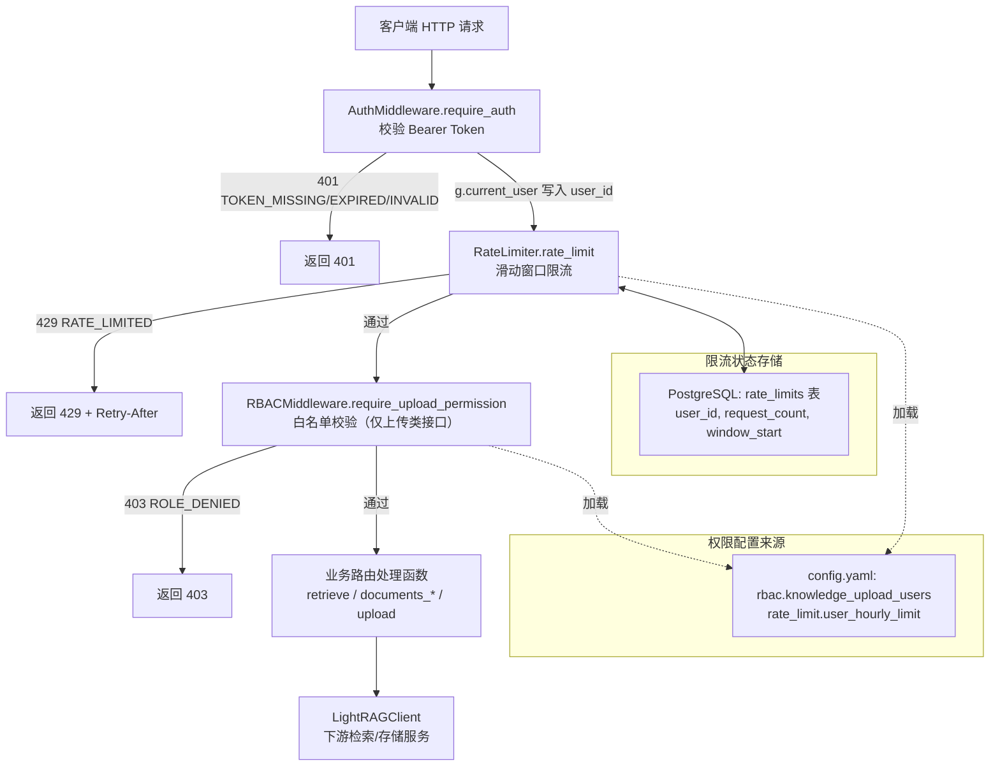

## 项目定位与核心价值

在 ForumBot 的 API 安全体系中，认证（Authentication）只解决了"你是谁"的问题，而 **RBAC 权限控制**与 **API 限流** 共同解决了"你能做什么"与"你能做多少"这两个更细粒度的治理问题。这两个模块并非孤立存在，而是作为 `AuthMiddleware` 之后的第二、第三道防线，以 Flask 装饰器链的形式叠加在业务路由之上，构成了一套典型的分层防护体系：认证 → 鉴权 → 限流 → 业务逻辑。

`RBACMiddleware`（位于 `rbac_middleware.py`）承担的职责相对克制：它并未实现工业级的角色-权限矩阵（Role-Based Access Control 的完整语义），而是针对项目中**唯一一个高敏感操作——知识库上传**，实现了一套基于白名单的 `user_id` 准入判断。这种"轻量 RBAC"的设计取舍是合理的：项目的业务面窄，只有"能否上传知识"这一个需要区分角色的场景，因此没有必要引入完整的角色-权限-资源三元模型，白名单机制以最低的复杂度满足了业务需求，也降低了后续维护和审计的成本。

`RateLimiter`（位于 `rate_limiter.py`）则解决了另一个维度的问题：即使是已认证、已授权的用户，也不能无限制地消耗后端资源（尤其是下游的 LightRAG 检索服务和数据库连接池）。它采用**基于 PostgreSQL 计数器的滑动窗口限流算法**，将限流状态持久化在数据库而非进程内存中，这个设计决策直接决定了该限流器天然支持**多实例部署下的全局限流**——因为 Flask 应用可能以多进程（如 Gunicorn worker）或多副本（如 Kubernetes Pod）形式运行，若使用内存计数器，每个进程会各自维护独立的配额，导致总限流阈值被成倍突破。将状态外置到共享数据库，是分布式系统中实现一致性限流的标准解法之一。

Sources: [rbac_middleware.py](src/ForumBot/rbac_middleware.py#L1-L48), [rate_limiter.py](src/ForumBot/rate_limiter.py#L1-L195)

## 架构设计与模块划分

RBAC 与限流两个中间件都遵循同一种结构范式：一个持有配置状态的类，暴露一个业务判断方法（`check_*`），再包装一层 Flask 装饰器（`require_*` / `rate_limit`）用于路由绑定。它们与 `AuthMiddleware`（认证层）共同挂载在 `rag_api.py` 的蓝图路由上，形成职责单一、可自由组合的中间件链。



**AuthMiddleware（认证层）**：作为整条防护链的第一环，通过 OneID OIDC 的 userinfo 端点校验 `Authorization: Bearer <token>`，成功后将 `user_id` 写入 Flask 请求上下文 `g.current_user`，供后续所有中间件消费。它区分 `TOKEN_MISSING`（头缺失）、`TOKEN_EXPIRED`（已过期）、`TOKEN_INVALID`（伪造或格式错误）三种失败态，均返回 401 但携带不同错误码，方便前端做差异化的重试/重新登录逻辑。

**RateLimiter（限流层）**：从 `g.current_user` 或请求头 `X-User-ID` 中取出用户标识后，查询 PostgreSQL 中 `rate_limits` 表的计数器记录，判断该用户在当前滑动窗口内的请求数是否超限。超限则返回 429 并附带 `Retry-After` 头，告知客户端需等待的具体秒数。

**RBACMiddleware（鉴权层）**：仅挂载在知识上传相关的敏感路由上，检查 `g.current_user.user_id` 是否命中配置文件中的白名单 `rbac.knowledge_upload_users`。未认证时返回 401 `TOKEN_MISSING`，已认证但不在白名单则返回 403 `ROLE_DENIED`。

Sources: [rag_api.py](src/ForumBot/rag_api.py#L1-L62), [auth_middleware.py](src/ForumBot/auth_middleware.py#L1-L85), [rbac_middleware.py](src/ForumBot/rbac_middleware.py#L27-L47), [rate_limiter.py](src/ForumBot/rate_limiter.py#L128-L150)

### 限流算法的状态机细节

`check_rate_limit` 方法的核心逻辑是一个围绕 `window_start` 时间戳的三分支状态机，理解这个状态机是理解整个限流器行为的关键：

| 状态 | 触发条件 | 处理动作 |
|---|---|---|
| **首次请求** | 查询无记录（`fetchone()` 返回 `None`） | `INSERT` 新记录，`request_count=1`，`window_start=now` |
| **窗口已过期** | `now > window_start + window_seconds` | `UPDATE` 重置 `request_count=1`，`window_start=now`（开启新窗口） |
| **窗口内未超限** | `request_count < hourly_limit` | `UPDATE request_count = request_count + 1` |
| **窗口内已超限** | `request_count >= hourly_limit` | 不写库，直接返回 `False`，并可通过 `get_retry_after` 计算剩余等待时间 |

值得注意的设计细节是**故障降级策略（Fail-Open）**：无论是数据库连接池获取失败，还是 SQL 执行过程中抛出异常，`check_rate_limit` 都会在 `except` 分支中返回 `True`（放行请求）而非拒绝。这是一种典型的可用性优先设计——限流器本身的故障不应成为压垮整个业务链路的单点故障；相应地，`get_db_connection` 在从连接池取不到连接时，还会尝试直接用 `psycopg2.connect` 兜底创建一次性连接，进一步降低因连接池瞬时耗尽而误判限流的概率。这种取舍意味着在数据库不可用的极端场景下，限流功能会短暂失效，团队需要权衡这是否符合业务对"宁可放行、不可错杀"的容忍度。

Sources: [rate_limiter.py](src/ForumBot/rate_limiter.py#L40-L96)

### 白名单准入的比较逻辑

`RBACMiddleware.check_upload_permission` 在做匹配时，将白名单列表与传入的 `user_id` 均转换为字符串再比较（`str(user_id) in [str(u) for u in self.knowledge_upload_users]`），这一处理保证了配置文件中数字型 ID（如 `139`）与运行时字符串型 ID（OIDC `sub` claim 通常是字符串）不会因类型不一致而误判为不在白名单内，从测试用例 `test_check_upload_permission_whitelist_user_int` 也可以看出这是一个明确设计（而非偶然）的兼容处理。

Sources: [rbac_middleware.py](src/ForumBot/rbac_middleware.py#L14-L25), [test_rbac_middleware.py](tests/test_rbac_middleware.py#L37-L38)

## 技术栈与核心工作流

整条请求链路依托 **Flask 装饰器的组合式包装**实现关注点分离，`rag_api.py` 中的 `register_routes` 方法清晰地展示了中间件的叠加顺序：

```python
bp.route('/retrieve', methods=['POST'])(
    self.auth_middleware.require_auth(
        self.rate_limiter.rate_limit(self.retrieve)
    )
)
```

这种写法是 Python 装饰器"由内向外执行、由外向内包裹"特性的直接运用：`require_auth` 在最外层先执行，认证失败则请求根本不会触及限流逻辑；只有认证通过后，才会进入 `rate_limit` 的计数检查；最终才调用真正的业务函数 `retrieve`。这种顺序编排本身就体现了一种安全设计哲学——**代价越低、越应该前置**：拒绝一个无效 token 的成本远低于查一次数据库计数器，因此认证永远排在限流之前。

值得指出的是，当前代码中 `RBACMiddleware.require_upload_permission` 并未在 `rag_api.py` 的路由表中被实际挂载（该文件目前暴露的接口是 OIDC 授权、token 刷新、检索、文档状态查询，均为 `rate_limit` + `require_auth` 组合，未见知识上传路由）。这意味着 RBAC 模块目前更像是为即将上线的知识上传接口预先准备好的权限组件，其装饰器用法与测试覆盖已经完备，接入方式与 `require_auth`/`rate_limit` 完全一致，只需在对应路由上追加一层包裹即可启用。

| 中间件 | 核心方法 | 依赖配置项 | 失败响应码 | 状态存储 |
|---|---|---|---|---|
| AuthMiddleware | `require_auth` | OIDC 相关配置 | 401 | 无状态（每次远程校验） |
| RateLimiter | `rate_limit` | `rate_limit.user_hourly_limit`, `rate_limit.window_seconds` | 429 | PostgreSQL `rate_limits` 表 |
| RBACMiddleware | `require_upload_permission` | `rbac.knowledge_upload_users` | 401 / 403 | 无状态（内存白名单） |

Sources: [rag_api.py](src/ForumBot/rag_api.py#L32-L62), [rbac_middleware.py](src/ForumBot/rbac_middleware.py#L1-L48), [rate_limiter.py](src/ForumBot/rate_limiter.py#L128-L150)

### 数据表结构与生命周期管理

`rate_limits` 表的建表逻辑封装在 `create_tables` 函数中，它并不假设数据库已经准备就绪，而是先调用 `ensure_database_exists` 兜底创建目标数据库（解决 `database does not exist` 类初始化问题），再执行 `CREATE TABLE IF NOT EXISTS`，并对 `user_id` 建立唯一约束与索引，保证同一用户不会因并发请求产生重复计数行：

```sql
CREATE TABLE IF NOT EXISTS rate_limits (
    id SERIAL PRIMARY KEY,
    user_id VARCHAR(255) NOT NULL UNIQUE,
    request_count INTEGER DEFAULT 0,
    window_start TIMESTAMP,
    updated_at TIMESTAMP DEFAULT CURRENT_TIMESTAMP
)
```

这里存在一个值得关注的并发风险点：`check_rate_limit` 中的"查询-判断-更新"三步操作并未包裹在显式事务隔离级别或使用 `SELECT ... FOR UPDATE` 行锁，在高并发场景下同一用户的两个并发请求可能同时读到同一份 `request_count`，都判断为未超限后各自 `+1`，从而导致实际放行的请求数略微超过 `hourly_limit`（竞态条件）。这是一个典型的"最终一致但非强一致"的限流实现，对于该项目"每用户每小时 100 次"这种较为宽松的阈值场景，轻微超限的影响可以接受，但如果未来限流阈值收紧到强一致性要求较高的场景，需要考虑引入 `SELECT FOR UPDATE` 或者迁移到 Redis 的原子 `INCR` + `EXPIRE` 方案。

Sources: [rate_limiter.py](src/ForumBot/rate_limiter.py#L153-L195), [utils.py](src/utils.py#L10-L50)

## 典型代码示例

限流装饰器对匿名用户的兜底处理，体现了该限流器"宁可按 IP/匿名标识限流，也不让未认证请求绕过限流"的思路：

```python
def rate_limit(self, f):
    """限流装饰器"""
    @wraps(f)
    def decorated(*args, **kwargs):
        if hasattr(g, 'current_user'):
            user_id = g.current_user.get('user_id')
        else:
            user_id = request.headers.get('X-User-ID', 'anonymous')

        if not self.check_rate_limit(user_id):
            retry_after = self.get_retry_after(user_id)
            response = jsonify({
                'error': 'RATE_LIMITED',
                'message': '请求频率超限，请稍后重试（每用户每小时 100 次）'
            })
            response.status_code = 429
            response.headers['Retry-After'] = str(retry_after)
            return response

        return f(*args, **kwargs)
    return decorated
```

需要注意的是，若 `require_auth` 未先执行（例如某个路由只挂了 `rate_limit` 而没挂 `require_auth`，如 `/auth/refresh` 接口），`g.current_user` 不存在时会退化为读取 `X-User-ID` 头，若该头也缺失则统一归为字符串 `'anonymous'` 这一个"用户"，意味着所有匿名请求会共享同一份限流配额——这是刻意的保守设计，防止未认证接口被无限刷量，但也意味着匿名场景下的限流粒度是全局而非按来源区分的。

Sources: [rate_limiter.py](src/ForumBot/rate_limiter.py#L128-L150), [rag_api.py](src/ForumBot/rag_api.py#L36-L39)

## 学习与探索建议

| 关注点 | 建议阅读路径 | 说明 |
|---|---|---|
| 认证与鉴权链路的完整拼装 | [rag_api.py](src/ForumBot/rag_api.py) 的 `register_routes` | 观察 `require_auth` / `rate_limit` / (未来的) `require_upload_permission` 三者的装饰器组合顺序 |
| OIDC 认证细节 | [auth_middleware.py](src/ForumBot/auth_middleware.py), [oidc_client.py](src/ForumBot/oidc_client.py) | 理解 `g.current_user` 的来源，是 RBAC 与限流判断用户身份的前提 |
| 数据库连接池实现 | [utils.py](src/utils.py) 中的 `get_db_connection_from_pool` / `ensure_database_exists` | 限流器状态持久化的底层依赖 |
| 限流并发安全的改进方向 | 结合本篇"数据表结构与生命周期管理"一节 | 若需强一致限流，可评估引入行锁或迁移至 Redis 原子计数 |
| 单元测试范式参考 | [test_rate_limiter.py](tests/test_rate_limiter.py), [test_rbac_middleware.py](tests/test_rbac_middleware.py) | 两个中间件均通过 mock 数据库/连接池验证各分支状态机，是理解边界条件的最快路径 |

## 🔗 关联模块与上下游

- [rag_api.py](src/ForumBot/rag_api.py) — 实际挂载 `RateLimiter.rate_limit` 与 `AuthMiddleware.require_auth` 的路由层，是两个中间件唯一的调用入口
- [auth_middleware.py](src/ForumBot/auth_middleware.py) — 上游认证中间件，负责填充 `g.current_user`，RBAC 与限流均依赖其产出的用户身份
- [utils.py](src/utils.py) — 提供 `get_db_connection_from_pool` / `release_db_connection_to_pool` / `ensure_database_exists`，是 `RateLimiter` 持久化层的直接依赖
