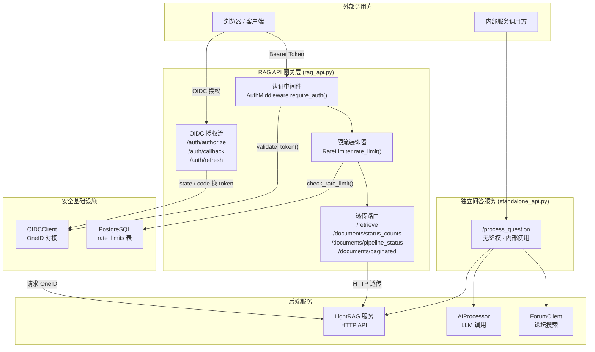
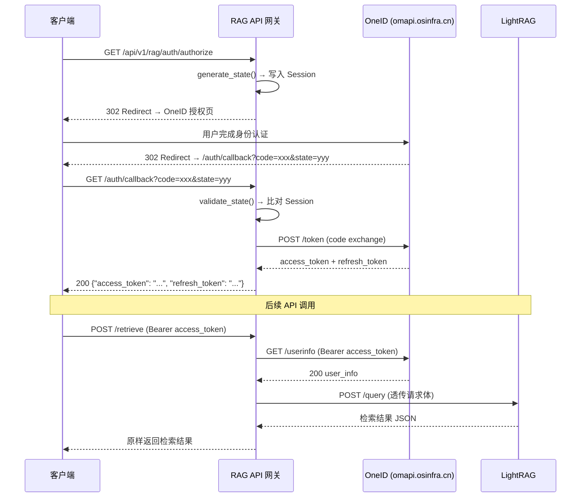

# RAG 对外 API：检索与文档状态接口

## 1. 项目定位与核心价值

### 背景与痛点

ForumBot 的核心能力依赖 LightRAG 作为后端知识检索引擎。然而，LightRAG 本身是一个内部服务，直接对外暴露将面临若干工程问题：其一，LightRAG 没有原生的用户身份认证机制，任何调用方都可以无限制地发起检索请求；其二，检索接口是计算密集型操作，若不加速率管控，单个恶意客户端可轻易耗尽后端资源；其三，调用方的多样性（浏览器、内部服务、管理面板）要求 API 网关具备标准的 OAuth2/OIDC 流程，而不是临时的密钥认证。

`rag_api.py` 正是为解决上述问题而生的**安全代理层（Secure Proxy Layer）**。它并不在 LightRAG 之上叠加业务逻辑，而是严格遵循"最小职责"原则：在请求进入之前完成身份核验与限流决策，随后将请求**原样透传（pass-through）**给 LightRAG，并将响应原样回传给调用方。这一设计哲学使得 LightRAG 与 API 网关之间的耦合度极低——当 LightRAG 的接口规格发生变化时，网关层几乎无需修改。

与此同时，`standalone_api.py` 作为一个**轻量级独立服务**存在。它面向的场景是：在不经过 OIDC 认证的内部开发或测试环境中，直接暴露一个无鉴权的问答端点。这两个模块代表了同一系统的两种不同暴露策略——一种面向生产（有鉴权），一种面向内部（无鉴权），在架构上形成了清晰的职责分层。

### 核心特性展开

**RAGAPIController（`rag_api.py`）** 的设计围绕三个核心能力展开：

第一，**OIDC 标准授权流程**。控制器内置了完整的 Authorization Code Flow：`/auth/authorize` 触发授权跳转，`/auth/callback` 完成 code 换 token，`/auth/refresh` 支持无感知刷新。整个流程对接的是企业内部的 OneID 服务（`omapi.osinfra.cn`），并使用 `secrets.token_urlsafe(16)` 生成 CSRF 防护用的 `state` 参数，存储于 Flask Session（已加密签名）。

第二，**请求级认证装饰器链**。每个受保护路由均被 `auth_middleware.require_auth` 与 `rate_limiter.rate_limit` 两层装饰器包裹。装饰器链的执行顺序是：先鉴权（提取并通过 OneID UserInfo 端点验证 Bearer Token，区分 `TOKEN_MISSING`、`TOKEN_EXPIRED`、`TOKEN_INVALID` 三种失败模式），再限流（基于 PostgreSQL 的滑动窗口计数器，默认每用户每小时 100 次）。这两层关注点完全解耦，彼此独立可替换。

第三，**纯透传的业务接口**。`retrieve`、`documents_status_counts`、`documents_pipeline_status`、`documents_paginated` 四个业务接口均采用"纯透传"策略：网关不解析、不变换业务 payload，只做请求转发和错误包装。这意味着 LightRAG 的响应结构对外部调用方完全透明，网关层仅充当身份与速率的"关卡"。

Sources: [rag_api.py](src/ForumBot/rag_api.py#L1-L62), [standalone_api.py](src/ForumBot/standalone_api.py#L1-L50)

---

## 2. 架构设计与模块划分

### 宏观拓扑图



### 各核心模块职责详解

**RAGAPIController** 是整个 RAG API 的控制中枢。它在 `__init__` 阶段即完成所有依赖的实例化（`OIDCClient`、`AuthMiddleware`、`RateLimiter`、`LightRAGClient`），并从 config 的 `retrieval` 段读取后端服务地址（`base_url`、`query_endpoint`、`verify_ssl`）。`register_routes()` 方法动态构建 Flask Blueprint，将每条路由与其对应的装饰器链绑定，最终返回 Blueprint 供上层 Flask App 注册。这种"工厂方法"模式使得控制器本身可独立测试，无需真实 Flask 上下文。

**AuthMiddleware** 的设计核心是"在线验证而非本地验证"。它不依赖 JWT 签名本地验签，而是每次请求都调用 OneID 的 `/userinfo` 端点，以端点可达性作为 Token 有效性的唯一权威来源。这规避了 JWT 本地验签在密钥轮换期间可能出现的短暂窗口期问题。验证结果通过 Flask `g` 对象（`g.current_user`）在请求上下文中传递给后续业务处理函数，实现了身份信息的"请求内共享"。

**RateLimiter** 采用基于 PostgreSQL 的**滑动窗口**算法。每个用户在 `rate_limits` 表中维护一条记录（`user_id`、`request_count`、`window_start`、`updated_at`）。每次请求到达时，检查当前时间是否已超出 `window_start + window_seconds`——若超出则重置计数器（新窗口开始）；若未超出则检查计数是否达到阈值（默认 100）。超限时响应 `429 Too Many Requests` 并在 `Retry-After` 响应头中告知等待时长，符合 HTTP 规范。连接管理通过连接池（`get_db_connection_from_pool`）实现，`finally` 块确保连接必然归还，防止连接泄漏。

**OIDCClient** 封装了与 OneID 的全部 OIDC 交互：授权 URL 构造、授权码换 Token（`exchange_code_for_token`）、Token 刷新（`refresh_access_token`）、UserInfo 查询（`_request_userinfo`）。值得关注的是 `_classify_token_failure` 方法——它通过解析 `WWW-Authenticate` 头和响应 body 中的 `error_description` 字段，依据 RFC 6750 规范区分 `expired`（Token 过期）与 `invalid`（Token 无效/伪造），为上层中间件提供精细化的错误分类能力。此外，该客户端通过检测 `PREVIEW_ENV` 环境变量或 `${...}` 占位符格式实现预览环境优雅降级，无需在 CI/CD 环境中提供真实的 OIDC 凭据。

**standalone_api.py** 的定位是"去鉴权的完整问答管道"。它集成了 `AIProcessor`（摘要生成 + LLM 调用）、`ForumClient`（论坛相关主题搜索）、`DataProcessor`（格式化检索结果）三个核心组件，构成一条完整的 RAG 问答链路。每次请求使用 `secrets.randbelow` 生成 8 位随机 `topic_id`，全程串联 Token 使用量统计。

Sources: [rag_api.py](src/ForumBot/rag_api.py#L14-L62), [auth_middleware.py](src/ForumBot/auth_middleware.py#L1-L85), [rate_limiter.py](src/ForumBot/rate_limiter.py#L9-L96), [oidc_client.py](src/ForumBot/oidc_client.py#L10-L55)

---

## 3. 技术栈与核心工作流

### 受保护接口的请求处理链路

```
客户端携带 Bearer Token 发起请求
        │
        ▼
[AuthMiddleware.require_auth]
  ├─ 提取 Authorization header
  ├─ 调用 OIDCClient.validate_token()
  │       └─ 发起 GET /userinfo → OneID
  │           ├─ 200 OK → valid, 写入 g.current_user
  │           ├─ 401 + "expired" → TOKEN_EXPIRED
  │           └─ 其他 → TOKEN_INVALID
        │
        ▼（鉴权通过）
[RateLimiter.rate_limit]
  ├─ 查询 rate_limits 表
  ├─ 检查滑动窗口计数
  ├─ 未超限 → 计数 +1，放行
  └─ 超限 → 429 + Retry-After
        │
        ▼（限流通过）
[业务处理函数]
  └─ HTTP 透传 → LightRAG 服务
        │
        ▼
  原样返回 LightRAG 响应 JSON + 状态码
```

### 核心类与接口速查表

| 类 / 函数 | 所在文件 | 核心职责 |
|---|---|---|
| `RAGAPIController` | `rag_api.py` | 路由注册中枢，持有所有依赖实例 |
| `AuthMiddleware.require_auth()` | `auth_middleware.py` | 鉴权装饰器，区分三种 Token 失败模式 |
| `RateLimiter.rate_limit()` | `rate_limiter.py` | 滑动窗口限流装饰器，基于 PostgreSQL |
| `OIDCClient.validate_token()` | `oidc_client.py` | 在线验证 Token，返回 valid/reason/user_info |
| `OIDCClient._classify_token_failure()` | `oidc_client.py` | RFC 6750 规范解析 Token 失败原因 |
| `RAGAPIController.retrieve()` | `rag_api.py` | POST /retrieve 纯透传检索 |
| `RAGAPIController.documents_status_counts()` | `rag_api.py` | GET 文档状态计数透传 |
| `RAGAPIController.documents_pipeline_status()` | `rag_api.py` | GET 管道状态透传 |
| `RAGAPIController.documents_paginated()` | `rag_api.py` | POST 文档分页查询透传 |
| `create_standalone_api()` | `standalone_api.py` | Flask App 工厂，构建无鉴权问答服务 |

### OIDC 授权流程时序



Sources: [rag_api.py](src/ForumBot/rag_api.py#L64-L143), [auth_middleware.py](src/ForumBot/auth_middleware.py#L54-L84), [rate_limiter.py](src/ForumBot/rate_limiter.py#L40-L96), [oidc_client.py](src/ForumBot/oidc_client.py#L286-L329)

---

## 4. 典型代码示例

### 路由注册：装饰器链的绑定方式

`register_routes()` 展示了如何将鉴权与限流装饰器链式绑定到业务函数上——注意装饰器的包裹顺序（先 `auth_middleware`，后 `rate_limiter`）决定了执行优先级：

```python
# src/ForumBot/rag_api.py#L40-L58
bp.route('/retrieve', methods=['POST'])(
    self.auth_middleware.require_auth(
        self.rate_limiter.rate_limit(self.retrieve)
    )
)
bp.route('/documents/status_counts', methods=['GET'])(
    self.auth_middleware.require_auth(
        self.rate_limiter.rate_limit(self.documents_status_counts)
    )
)
```

### 纯透传模式的实现

`retrieve()` 方法体现了"零业务侵入"透传设计——接收调用方 JSON，原封不动地 POST 给 LightRAG，再将 LightRAG 的 JSON 响应连同状态码一起返回：

```python
# src/ForumBot/rag_api.py#L144-L187
def retrieve(self):
    data = request.get_json(silent=True)
    # ...参数校验...
    url = f"{self.base_url}{self.query_endpoint}"
    response = requests.post(url, json=data, verify=self.verify_ssl, timeout=60)
    result = response.json()
    # 仅记录日志，不修改响应
    logger.info(f"Retrieved documents for user {g.current_user.get('user_id')}")
    return jsonify(result), response.status_code
```

### standalone_api 的完整问答链路

```python
# src/ForumBot/standalone_api.py#L62-L130
# 1. 生成唯一 topic_id（防止冲突）
topic_id = secrets.randbelow(90000000) + 10000000

# 2. LLM 摘要 → 3. 论坛搜索 → 4. 格式化上下文
summary = ai_processor.summarize_text(title, user_question, topic_id_str)
search_results = forum_client.search_related_topics(summary, topic_id_str)

# 5. 带检索上下文的 LLM 生成
answer = ai_processor.call_large_model(
    retrieval_result['related_docs'], title, user_question, topic_id_str
)

# 6. 返回结果 + Token 使用统计
return jsonify({
    'success': True,
    'answer': answer_with_notice,
    'token_usage': token_usage
})
```

Sources: [rag_api.py](src/ForumBot/rag_api.py#L32-L62), [rag_api.py](src/ForumBot/rag_api.py#L144-L187), [standalone_api.py](src/ForumBot/standalone_api.py#L62-L130)

---

## 5. 学习与探索建议

### 纵向深潜路径

| 探索方向 | 目标文件 | 关键切入点 |
|---|---|---|
| OIDC 认证底层细节 | `src/ForumBot/oidc_client.py` | `_request_userinfo()`、`_classify_token_failure()` — RFC 6750 Token 失败分类逻辑 |
| 限流持久化机制 | `src/ForumBot/rate_limiter.py` | `check_rate_limit()` — 滑动窗口 SQL 事务与连接池交互 |
| 鉴权中间件装饰器模式 | `src/ForumBot/auth_middleware.py` | `require_auth()` — `g.current_user` 的请求上下文注入方式 |
| LightRAG 客户端能力全貌 | `src/update_lightrag/lightrag_client.py` | `get_filename_id_mapping_from_lightrag()`、`wait_for_pipeline_status_not_busy()` |
| 独立问答服务完整链路 | `src/ForumBot/standalone_api.py` | `process_question()` — 摘要→搜索→生成的完整 RAG pipeline |
| Token 用量追踪机制 | `src/ForumBot/token_tracker.py` | `reset_usage()`、`get_usage()` — 与 topic_id 的绑定方式 |

### 横向关联模块

> 若要理解 RAG API 网关在整个系统中的上下游位置：

- **上游（触发者）**：任何需要通过 OIDC 认证访问 LightRAG 检索能力的客户端，入口为 `/api/v1/rag/auth/authorize`
- **下游（被代理者）**：LightRAG HTTP 服务，地址由 `config.yaml` 的 `retrieval.base_url` 配置项决定
- **平行服务**：`standalone_api.py` 构成独立的内部问答通道，绕过 OIDC，直连 `AIProcessor` + `ForumClient`

---

## 🔗 关联模块与上下游

- [`src/ForumBot/auth_middleware.py`](src/ForumBot/auth_middleware.py) — `require_auth` 装饰器的具体实现，`rag_api.py` 中每条受保护路由的直接依赖
- [`src/ForumBot/oidc_client.py`](src/ForumBot/oidc_client.py) — OneID OIDC 协议对接层，`AuthMiddleware` 的唯一 Token 验证后端
- [`src/update_lightrag/lightrag_client.py`](src/update_lightrag/lightrag_client.py) — LightRAG 后端的完整 HTTP 客户端封装，透传路由最终调用的服务端
