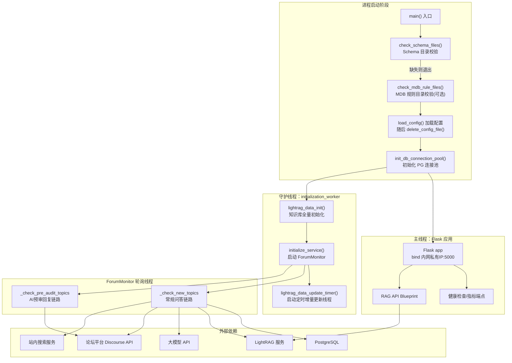

# 项目概览：Forum Reply Robot

## 1. 项目定位与核心价值

Forum Reply Robot（论坛回复机器人）是一套面向技术社区/工单论坛场景设计的**自动化问答与合规审核服务**。它诞生的背景很直接：技术论坛每天会产生大量重复性提问和需要走标准流程审核的"预审"帖子，人工逐帖跟进既耗时又容易漏单，而简单的关键词匹配机器人又无法理解帖子的真实语义，无法给出有说服力的回答。该项目试图用**大模型 + 检索增强（RAG）+ 结构化规则校验**的组合，让机器人既能"看懂"用户在问什么，又能"查得到"权威资料，还能在涉及硬件规范合规审查这类高风险场景下给出**有据可查、格式统一**的评审报告，而不是简单地"AI 生成一段话就发出去"。

从代码结构可以看出，项目并不是一个玩具级的 Demo，而是按生产可用标准搭建的服务：它有独立的健康检查/启动探针（供 Kubernetes 探活）、Prometheus 指标导出、结构化日志轮转、PostgreSQL 持久化去重、以及针对敏感配置文件"用后即焚"的安全处理。其核心特性可以概括为两条并行的业务链路——**常规问答回复**和**AI 预审回复**——外加一套贯穿全程的**知识库自维护机制**（LightRAG 全量初始化 + 每日增量更新），使得机器人回答的知识来源始终保持与论坛及外部知识源同步，而不是依赖一次性训练数据。此外，项目在"AI 生成内容上线前"这一环节做了较重的工程投入：提示词注入检测、答案相关性校验、答案质量校验三层把关，任何一层校验失败或异常都默认判定为不合格，宁可不回复，这体现出一种**保守优先、安全优先**的产品设计哲学，避免机器人在无人监督的情况下发布低质量甚至有害内容。

Sources: [README.md](README.md#L1-L14), [main.py](main.py#L320-L408)

## 2. 架构设计与模块划分

整个服务是一个**单进程多线程**的 Flask 应用：主线程负责对外暴露 HTTP 探活/指标接口并长期阻塞在 `app.run()`，而真正的业务轮询、知识库维护则被拆分为若干守护线程在后台运行。这种设计使得 Kubernetes 等编排系统可以通过标准的 HTTP 探针管理容器生命周期，同时业务逻辑的启动失败不会导致整个容器直接崩溃退出，而是反映为健康检查失败，便于运维层面观测与告警。



从图中可以看到，项目按职责被清晰地划分为几层：

**入口与生命周期管理层**（`main.py`）承担了服务自检、配置装载、依赖初始化编排的职责。它首先做两项"防御式"目录检查——`check_schema_files()` 确认 Redfish Schema 文件已经在构建期正确拉取（缺失则直接退出，因为预审链路强依赖这些规则），`check_mdb_rule_files()` 检查 MDB 合规规则文件（缺失时降级跳过而非致命）。随后加载 `config.yaml`，并立即调用 `delete_config_file()` 把配置文件从磁盘删除，这是一个非常值得注意的安全设计：配置里含有大模型 API Key、数据库密码、论坛 API Key 等明文凭据，一旦服务把配置读进内存，就不再需要磁盘上的副本，及时删除能显著缩小凭据泄露的攻击面。

Sources: [main.py](main.py#L243-L289), [main.py](main.py#L320-L376)

**业务编排核心**（`src/ForumBot/monitor.py` 的 `ForumMonitor` 类）是整个机器人的"大脑"。它在构造函数中组装了 `ForumClient`（论坛 HTTP 客户端）、`AIProcessor`（大模型调用层）、`DataProcessor`（数据持久化与解析层）三大依赖，并在 `start()` 方法中跑一个无限循环：每隔 `check_interval` 秒依次执行 `_check_new_topics()`（常规问答）和 `_check_pre_audit_topics()`（AI 预审），循环体外包了一层 `try/except`，保证轮询过程中的异常不会打断整个监控循环，这是"逐帖容错、单点故障不传播"设计原则在主循环层面的体现。

Sources: [monitor.py](src/ForumBot/monitor.py#L1-L61), [monitor.py](src/ForumBot/monitor.py#L62-L80)

**知识库维护层**（`src/update_lightrag/`）独立于主业务轮询之外运行，包含 `full_data_init.py`（全量初始化，服务启动时执行一次）和 `increment_date_update_timer.py`（定时增量更新，用独立守护线程按 `schedule` 库的调度跑每日任务）。这一层还配套了 `gitcode_client.py`、`gitcode_api_increment_fetcher.py`、`gitode_full_fetcher.py` 等一组数据抓取器，说明知识库的原始素材部分来自 GitCode 仓库（比如规范文档、历史工单），部分来自论坛历史帖子（`forum_data_Fetcher.py`），经过 `filter.py` 过滤和 `image_processor.py` 处理图片后灌入 `lightrag_client.py` 封装的 LightRAG 服务。

Sources: [main.py](main.py#L125-L161), [main.py](main.py#L2-L4)

**对外 API 层**（`src/ForumBot/rag_api.py` 及其依赖的 `auth_middleware.py`、`oidc_client.py`、`rate_limiter.py`）是一套独立于论坛轮询之外的 HTTP API，以 Flask Blueprint 的形式挂载在同一个 5000 端口下的 `/api/v1/rag/*` 路径。`RAGAPIController` 在构造时组装了 OIDC 客户端（用于第三方系统的身份认证）、限流器（基于数据库表实现速率限制）、以及 LightRAG 客户端，对外暴露检索、鉴权回调、Token 刷新等接口，使得该服务不仅是一个"论坛机器人"，也承担了向外部系统开放 RAG 检索能力的网关角色。

Sources: [rag_api.py](src/ForumBot/rag_api.py#L1-L40), [main.py](main.py#L380-L397)

## 3. 技术栈与核心工作流

项目基于 **Python 3.9+**，Web 框架为 **Flask 3.1**，大模型调用通过 **openai / langchain-openai** SDK 对接任意 OpenAI 兼容接口（比如 SiliconFlow），数据持久化用 **psycopg2 + PostgreSQL**，定时任务用 **schedule** 库，可观测性依赖 **prometheus-client** 和 **python-json-logger**，鉴权部分引入了 **authlib**（OIDC）和 **cryptography**（Token 加密）。这套选型偏向"轻量、成熟、少自造轮子"，没有引入重型的任务队列或消息中间件，轮询与定时任务全部用标准库 `threading` + `schedule` 实现，这对于中等规模的论坛监控场景是合理的权衡：避免了引入 Celery/RabbitMQ 等基础设施的运维成本，同时通过守护线程 + 异常兜底保证了基本的健壮性。

Sources: [requirements.txt](requirements.txt#L1-L50)

核心处理主链路可以概括为"拉取 → 去重 → 理解 → 检索 → 生成 → 校验 → 发布"七步，常规问答与 AI 预审两条链路在前两步共享逻辑，之后分叉：

| 阶段 | 常规问答回复链路 | AI 预审回复链路 |
|------|------|------|
| 拉取新帖 | `ForumMonitor._check_new_topics()` 调用 `ForumClient` 拉取带指定标签的新帖 | `ForumMonitor._check_pre_audit_topics()` 拉取预审标签帖子 |
| 去重 | 查询 `forum_topics` 表判断 topic_id 是否已处理 | 查询 `pre_audit_topics` 表 |
| 理解 | `AIProcessor` 做提示词注入检测 + 问题摘要提取 | `data_processor.parse_pre_audit_readiness()` 解析就绪状态 |
| 检索/校验 | 站内搜索 + LightRAG 文档检索获取上下文 | `SchemaValidation.end_to_end_check.run_schema_check()` 执行 Redfish Schema 校验 + MDB 规则校验 |
| 生成 | 大模型基于上下文生成回答 | 生成结构化 Markdown 评审报告 |
| 校验 | 答案相关性校验 → 答案质量校验，任一失败则不回复 | 校验结果即报告本身，无需额外相关性校验 |
| 发布 | 组装含折叠块的回复，调用 `ForumClient` 发帖，落库 + 写 CSV | 调用 `ForumClient` 发帖，落库 |

这张表格里最值得展开的是**用户输入的安全处理**：帖子正文在送入大模型之前，会被一段随机生成的 UUID 字符串包裹起来，这是一种简单但有效的提示词注入防御手段——通过给用户输入加上不可预测的边界标记，让大模型更容易区分"系统指令"和"用户可能试图伪装成指令的内容"。同时，注入检测、相关性校验、质量校验这三层把关都遵循"失败即拒绝"的从严策略：只要模型判断为疑似注入，或者答案与问题不相关，或者质量不达标，机器人就默认不回复，而不是"退而求其次"发一个可能有问题的答案。这种设计相较于"尽力回复"的策略牺牲了一部分响应率，换来的是内容质量的下限保障，符合企业级技术论坛对权威性的要求。

Sources: [README.md](README.md#L31-L55), [monitor.py](src/ForumBot/monitor.py#L11-L16)

## 4. 典型代码示例

`main.py` 中的 `initialization_worker()` 集中体现了该项目"先让 Flask 立起来，再异步完成重量级初始化"的设计取舍——LightRAG 全量数据初始化可能耗时较长，如果放在主线程同步执行，会让容器的启动探针长期得不到响应而被判定为启动失败：

```python
def initialization_worker(config):
    """后台初始化线程：在 Flask 启动后异步完成初始化"""
    global service_initialized

    try:
        if not lightrag_data_init(config):
            service_initialized = False
            return

        if not initialize_service(config):
            service_initialized = False
            return

        if not lightrag_data_update_timer(config):
            logger.warning("LightRAG数据更新定时器启动失败，但不影响主服务")
    except Exception as e:
        logger.error(f"后台初始化异常: {e}")
        service_initialized = False
```

配合 `/startup` 探针的实现，Kubernetes 的 `startupProbe` 会持续轮询该接口，直到 `service_initialized` 变为 `True` 才认为容器启动完成，期间不会因为容器"看起来卡住"而被误杀。

```python
@app.route('/startup', methods=['GET'])
def startup_check():
    if service_initialized:
        return jsonify({"status": "ready", ...}), 200
    else:
        return jsonify({"status": "not_ready", ...}), 503
```

Sources: [main.py](main.py#L292-L318), [main.py](main.py#L163-L179)

## 5. 学习与探索建议

| 阶段 | 建议阅读顺序 | 关注点 |
|------|------|------|
| 入门 | `README.md` → `main.py` | 先建立"进程如何启动、健康检查如何工作"的整体心智模型 |
| 进阶 | `src/ForumBot/monitor.py` | 理解两条核心业务链路（常规问答 / AI 预审）的编排逻辑与容错策略 |
| 进阶 | `src/ForumBot/ai_processor.py` | 深入大模型调用层：注入检测、摘要、相关性/质量校验的具体 Prompt 设计 |
| 进阶 | `src/ForumBot/data_processor.py` | 了解 PostgreSQL 表结构设计、CSV 落盘、预审状态解析规则 |
| 深入 | `src/ForumBot/SchemaValidation/`、`src/ForumBot/MdbValidation/` | 结构化合规校验的规则引擎实现，理解 Redfish Schema 与 MDB 规则如何驱动评审报告生成 |
| 深入 | `src/update_lightrag/` | 知识库全量初始化与增量更新的数据抓取、过滤、灌入流程 |
| 扩展 | `src/ForumBot/rag_api.py`、`auth_middleware.py`、`oidc_client.py` | 对外 RAG API 网关的鉴权、限流实现 |
| 运维 | `tests/conftest.py`、`.ai-flow/deploy/` | 测试基础设施的 mock 机制，以及 Kubernetes 预览环境部署编排 |

## 🧭 源码导航 (Codebase Map)

- **主入口**：[main.py](main.py) —— 服务生命周期、健康检查、探针端点的唯一入口
- **业务编排核心**：[src/ForumBot/monitor.py](src/ForumBot/monitor.py) —— `ForumMonitor` 类，两条核心链路的调度中枢
- **大模型调用层**：[src/ForumBot/ai_processor.py](src/ForumBot/ai_processor.py) —— 摘要、注入检测、相关性/质量校验、回答生成
- **数据持久层**：[src/ForumBot/data_processor.py](src/ForumBot/data_processor.py) —— PostgreSQL/CSV 读写、HTML 解析、预审状态解析
- **论坛客户端**：[src/ForumBot/forum_client.py](src/ForumBot/forum_client.py) —— 拉帖/发帖/搜索/检索的 HTTP 封装
- **对外 API 网关**：[src/ForumBot/rag_api.py](src/ForumBot/rag_api.py) —— `/api/v1/rag/*` Blueprint
- **知识库维护包**：[src/update_lightrag/](src/update_lightrag) —— 全量初始化 + 定时增量更新
- **通用工具**：[src/utils.py](src/utils.py) —— 配置加载/删除、数据库连接池初始化
- **合规校验子包**：[src/ForumBot/SchemaValidation/](src/ForumBot/SchemaValidation)、[src/ForumBot/MdbValidation/](src/ForumBot/MdbValidation)
