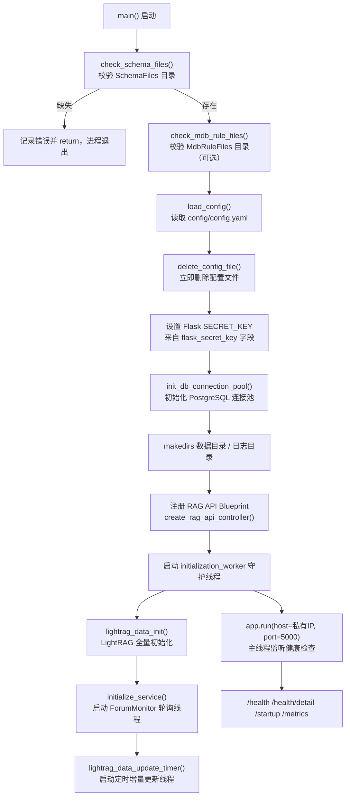

# 快速开始：配置与启动

## 项目定位与核心价值

forum-reply-robot 是一个常驻运行的自动化论坛问答机器人服务，其核心使命是周期性轮询论坛新帖，结合大模型与 LightRAG 知识库对问题帖生成智能回复，并对特定标签的"预审"帖执行结构化合规校验。对于希望接手这套代码的开发者而言，理解"如何跑起来"是理解整个系统运行时拓扑的第一步——因为这个项目并非一个简单的脚本，而是一个**单进程内编排多个守护线程**的服务：Flask 主线程负责暴露健康检查接口，两个业务守护线程分别跑轮询主循环和 LightRAG 定时更新任务。启动流程本身就折射出整个架构的设计取舍。

从工程实践角度看，该项目的启动链路承载了几个关键的运维与安全考量：其一，配置文件 `config/config.yaml` 集中了所有外部依赖（大模型 API、论坛 API、数据库、LightRAG 服务等）的连接信息与凭据，加载后会被立即从磁盘删除，避免明文密钥长期落盘；其二，启动前会先校验 Redfish/MDB 的 Schema 文件是否已就位，这类文件体量较大且更新频繁，因此选择在 Docker 构建期从远程仓库拉取而非纳入代码库，主程序仅做存在性校验；其三，主服务（业务轮询与知识库初始化）与健康检查接口（Flask）解耦到不同线程，即使业务初始化耗时较长（LightRAG 全量灌库可能耗时数分钟），Flask 也能第一时间起来响应 Kubernetes 的 `startupProbe`，只是通过 `/startup` 返回 503 表明"尚未就绪"，从而避免容器被误杀。

Sources: [main.py](main.py#L320-L411), [CLAUDE.md](CLAUDE.md#L44-L58)

## 架构设计与模块划分

启动阶段涉及的核心角色可以归纳为：配置加载器（`src/utils.py`）、日志系统（`src/ForumBot/logging_config.py`）、主入口装配线（`main.py`）三者的协作。下图描述了从进程启动到服务对外可用的完整时序与模块依赖：



**入口装配（`main.py`）** 是整个启动链路的调度者，它不包含具体业务逻辑，只负责按顺序检查前置条件、加载配置、初始化各子系统并把控制权交给 Flask 的事件循环。其设计哲学是"快速失败于致命依赖，容忍降级于非致命依赖"：Schema 文件缺失直接 `return` 退出进程（因为预审链路完全依赖它），而 MDB 规则文件缺失仅记录警告继续运行（因为 MDB 校验是可选功能）。同样的容错分级也体现在配置加载失败的分支上——`main()` 用 `try/except` 包裹配置相关逻辑，一旦异常就退化为使用默认目录（`data/forum_data`、`logs`）继续启动，而不是让整个进程崩溃。

**配置与工具层（`src/utils.py`）** 提供了两个贯穿启动流程的关键函数：`load_config()` 用 `yaml.safe_load` 读取配置并在异常时返回空字典而非抛出异常，这个"静默降级"的设计使得上层调用者（`main.py`、`logging_config.py` 等）可以统一用 `config.get(...)` 安全取值而不必层层套 `try/except`；`delete_config_file()` 则是安全设计的落地点，加载完成后立即调用它把 `config/config.yaml` 从磁盘删除，配合 Dockerfile 中对 `config.yaml` 设置的 `chmod 600` 权限，构成"最短暴露窗口"的纵深防御。此外该文件还提供了数据库连接池的生命周期管理函数族（`init_db_connection_pool` / `get_db_connection_from_pool` / `release_db_connection_to_pool` / `close_db_connection_pool`），底层基于 `psycopg2.pool.ThreadedConnectionPool`，在 `main()` 中读取 `config['database']` 后统一初始化一次，供后续 `DataProcessor` 等模块复用连接。

**日志系统（`logging_config.py`）** 在模块导入时就会尝试调用 `load_config()` 读取 `logging.log_dir` / `logging.main_log_file` 段来构造主日志记录器 `main_logger`，若配置加载失败则退化为硬编码的 `logs/main.log`。这意味着日志系统的初始化时机早于 `main()` 函数体的执行（发生在 `import` 语句阶段），是启动链路中一个隐蔽但重要的旁路依赖。

Sources: [main.py](main.py#L320-L411), [src/utils.py](src/utils.py#L83-L112), [src/ForumBot/logging_config.py](src/ForumBot/logging_config.py#L1-L70)

## 技术栈与核心工作流

启动流程本质上是一条"检查 → 加载 → 装配 → 分叉"的执行主链路。下表梳理了各阶段涉及的核心函数及其在整体工作流中的作用：

| 阶段 | 关键函数/类 | 所在文件 | 作用 |
| --- | --- | --- | --- |
| 前置校验 | `check_schema_files` / `check_mdb_rule_files` | main.py | 确认 Redfish/MDB Schema 目录已由构建期拉取到位 |
| 配置加载 | `load_config` | src/utils.py | 读取 YAML 配置为字典，失败时返回 `{}` |
| 敏感信息清理 | `delete_config_file` | src/utils.py | 加载后立即删除配置文件，防止落盘 |
| 密钥装配 | `app.config['SECRET_KEY']` | main.py | 从 `flask_secret_key` 字段读取，用于 OIDC session 加密 |
| 数据库池 | `init_db_connection_pool` | src/utils.py | 基于 `ThreadedConnectionPool` 建立最小/最大连接数的池 |
| RAG API 注册 | `create_rag_api_controller` | src/ForumBot/rag_api.py | 按 `external_api.enabled` 决定是否挂载 `/api/v1/rag/*` Blueprint |
| 后台初始化 | `initialization_worker` | main.py | 守护线程内串行执行知识库初始化、监控启动、定时器启动 |
| 轮询编排 | `ForumMonitor` | src/ForumBot/monitor.py | 常驻轮询循环，读取 `config['monitor']['check_interval']` 等段 |
| 对外探针 | `/health` `/startup` `/metrics` | main.py | Kubernetes 存活/就绪探针与 Prometheus 指标出口 |

值得注意的是，`initialize_service()`、`lightrag_data_init()`、`lightrag_data_update_timer()` 三者并非并行触发，而是在同一个 `initialization_worker` 守护线程内**顺序执行**：只有 LightRAG 全量初始化成功后才会启动 `ForumMonitor` 轮询线程，这是因为常规问答链路依赖 LightRAG 检索能力，若知识库未就绪就开始回复问题会导致检索结果为空、答案质量下降。而这个顺序链条与对外的 Flask 主线程是并行的——`app.run()` 在初始化线程启动之后立即执行，因此服务进程能第一时间响应探针请求，只是 `/health` 会在 `monitor_thread` 真正跑起来之前持续返回 503。

Sources: [main.py](main.py#L101-L162), [main.py](main.py#L292-L411)

## 典型代码示例

### 配置文件结构（`config/config.yaml`）

仓库内的 `config.yaml` 是一份脱敏后的示例，真实部署时需要按 README 描述的各配置段补全：

```yaml
# config.yaml
# API配置
api:
  base_url: 'https://api.siliconflow.cn/v1'
  api_key: '************************************'
  model_name: 'Qwen/Qwen3-235B-A22B-Instruct-2507'
```

除了 `api` 段外，实际生产配置还需要 `posts`（论坛发帖 API）、`database`（PostgreSQL 连接，含 `sslmode`）、`monitor`（轮询间隔 `check_interval`、标签/类别、预审字段）、`paths`（`csv_file` / `processed_csv_file` / `answer_csv_file` / `forum_data_dir`）、`search`（站内搜索）、`retrieval`（LightRAG 检索）、`links`（拼接链接用的 base url）、`schema_validation`（Redfish/MDB 校验模型）、`git`（CSV 同步用，当前已停用调用）、`flask_secret_key`（Flask session 密钥）等字段。`monitor.py` 中对 `self.config['paths']['csv_file']` 等的直接下标访问意味着这些字段是**强制必填**的，缺失会在运行期抛出 `KeyError` 而非静默降级，这与 `load_config` 本身"宽容失败"的风格形成对比，属于有意为之的设计——路径类配置缺失应该立刻暴露问题而不是悄悄退化。

Sources: [config/config.yaml](config/config.yaml), [src/ForumBot/monitor.py](src/ForumBot/monitor.py#L66-L67), [src/ForumBot/monitor.py](src/ForumBot/monitor.py#L303-L305)

### 启动入口的密钥与连接池装配

```python
config = load_config()
# 删除配置文件以防止敏感信息落盘
delete_config_file()

flask_secret_key = config.get('flask_secret_key')
if flask_secret_key:
    app.config['SECRET_KEY'] = flask_secret_key
    logger.info("Flask SECRET_KEY 已从 config.yaml 加载")
else:
    if '--debug' in sys.argv or os.environ.get('FLASK_DEBUG') == '1':
        app.config['SECRET_KEY'] = 'dev-secret-key-for-local-debug-only'
        logger.warning("Flask SECRET_KEY 使用调试默认值...")
    else:
        logger.error("Flask SECRET_KEY 未设置，生产环境必须配置...")

db_config = config.get('database', {})
if db_config:
    init_db_connection_pool(db_config, min_connections=2, max_connections=10)
```

这段代码体现了一个值得留意的安全细节：生产环境下若 `flask_secret_key` 缺失，程序**不会退出**，而只是记录错误并继续运行——代价是依赖 session 的 OIDC 认证功能会不可用，其他功能（如轮询回复）不受影响。这是"部分降级优于整体宕机"设计原则的又一体现。

> 启动脚手架的核心理念是：致命依赖（Schema 文件、LightRAG 初始化）快速失败退出，非致命依赖（MDB 规则、SECRET_KEY、数据库池）尽量降级运行并大声记录日志，把决策权交给运维人员而非静默吞掉问题。

Sources: [main.py](main.py#L332-L361)

## 启动步骤清单

结合 README 与源码校验逻辑，实际启动一个开发环境需要按以下顺序准备：

1. **安装依赖**：`pip install -r requirements.txt`（Python 3.9+，依赖版本已在 `requirements.txt` 中精确锁定）。
2. **准备 `config/config.yaml`**：填写 `api`、`posts`、`database`、`monitor`、`search`、`retrieval`、`paths` 等段。该文件已被 `.gitignore` 忽略，且启动后会被自动删除，本地调试建议保留一份备份。
3. **拉取 Schema 文件**：`git clone <SchemaFiles仓库> src/ForumBot/SchemaValidation/SchemaFiles`，缺失会导致 `check_schema_files()` 校验失败进而直接退出进程；MDB 规则文件（`MdbRuleFiles`）同理但为可选。
4. **准备 PostgreSQL**：确保 `database` 配置段指向的实例可达，`init_db_connection_pool` 会在启动阶段建立 2~10 个连接的线程池。
5. **启动服务**：`python main.py`，进程会绑定自动探测到的内网私有 IP（优先 `10.` 段，其次 `192.168.` 段）的 5000 端口。
6. **验证健康状态**：访问 `GET /startup` 确认初始化完成（未完成返回 503），随后 `GET /health` 与 `GET /health/detail` 可查看监控线程与 OIDC/LightRAG 组件的详细状态。

Sources: [README.md](README.md#L109-L182), [main.py](main.py#L243-L289), [main.py](main.py#L406-L408)

## 学习与探索建议

| 阶段 | 建议阅读内容 | 目标 |
| --- | --- | --- |
| 入门 | `main.py` 全文 + `src/utils.py` | 理解进程启动顺序、配置生命周期与安全清理机制 |
| 入门 | `config/config.yaml` + README「快速开始」章节 | 掌握每个配置段对应哪个业务子系统 |
| 进阶 | `src/ForumBot/monitor.py` 的 `ForumMonitor.__init__` 与 `start()` | 理解轮询主循环如何消费 `initialize_service()` 启动的守护线程 |
| 进阶 | `src/update_lightrag/full_data_init.py` 与 `increment_date_update_timer.py` | 理解知识库初始化与定时增量更新的调度逻辑 |
| 进阶 | `Dockerfile` | 理解 Schema/MDB 规则文件在容器构建期如何被拉取、以及非 root 加固策略 |
| 深入 | `src/ForumBot/rag_api.py` 与 `create_rag_api_controller` | 理解 `external_api.enabled` 控制的独立 RAG API Blueprint 注册流程 |

## 🔗 关联模块与上下游

- [main.py](main.py) — 启动入口，直接调用 `src/utils.py` 的配置与连接池函数，并装配 `ForumMonitor`、`FullDataUpdate`、`UpdateLightRAGTimer`
- [src/ForumBot/logging_config.py](src/ForumBot/logging_config.py) — 在模块导入阶段即依赖 `src/utils.load_config()` 构造主日志记录器
- [src/ForumBot/monitor.py](src/ForumBot/monitor.py) — 启动流程中被 `initialize_service()` 实例化并放入守护线程运行的编排核心
