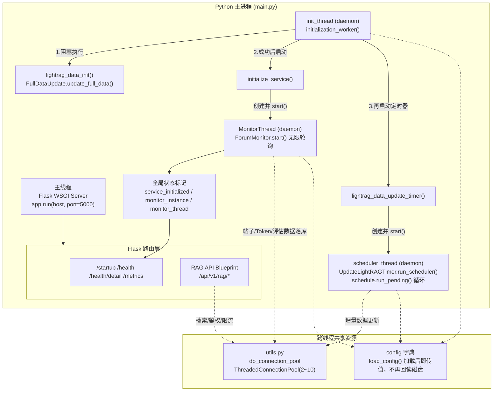

## 项目定位与核心价值

本项目是一个面向论坛场景的 AI 智能问答与知识库自动运维系统，其核心诉求是"用一个长期在线的单体服务，同时承担三件互不相同但又相互依赖的工作"：对外提供 HTTP 检索 API、对内驱动论坛帖子的自动巡检与回复、以及周期性地维护底层 LightRAG 知识库的数据新鲜度。这类系统的痛点在于，如果把这三件事拆成三个独立的微服务部署，会带来配置管理、数据库连接、进程编排上的额外运维复杂度；但如果全部塞进同一个同步流程，又会导致"长耗时的数据初始化"与"必须尽快响应的健康检查/API 请求"互相阻塞。项目给出的答案是**单进程、多线程的常驻服务模型**：以 Flask 作为唯一的对外入口和进程生命周期载体，把耗时的初始化与轮询任务全部下沉到后台守护线程（daemon thread）中异步执行，主线程只负责尽快把 HTTP 服务端口监听起来，从而让 Kubernetes 探针可以第一时间探测到进程存活，而不必等待重型的知识库初始化完成。

这种架构的核心价值体现在两个层面。第一是**启动可用性与初始化解耦**：`main()` 中会先做好目录、日志、密钥、数据库连接池等轻量准备，随后立即 `app.run()` 把 Flask 端口打开；真正耗时的 LightRAG 全量数据初始化、论坛监控循环、增量更新调度器，都被封装成一个 `initialization_worker` 后台线程异步跑起来。第二是**运行期的职责隔离与资源共享**：三条并行工作线（论坛监控线程、LightRAG 定时更新线程、Flask 请求处理线程）各自独立运行、互不阻塞，但共享同一份配置对象和同一个数据库连接池（`ThreadedConnectionPool`），既避免了连接风暴，也保证了状态的一致性。整个进程通过一组无锁的全局布尔/对象变量（`service_initialized`、`monitor_instance`、`monitor_thread`）向外暴露自身的健康状态，供 `/startup`、`/health`、`/health/detail` 等 Kubernetes 探针端点读取，这也是该架构在云原生环境下能够被优雅编排（滚动升级、自动重启）的关键设计。

Sources: [main.py](main.py#L1-L30), [main.py](main.py#L292-L319)

## 架构设计与模块划分

从进程拓朴的角度看，系统运行时呈现为"一个 Python 进程内的四条并发执行线"，它们通过全局配置对象和数据库连接池耦合，但通过独立的线程边界实现故障隔离——任一后台线程的异常都不会直接拖垮 Flask 主线程对外服务的能力（daemon 线程异常会被各自的 `try/except` 捕获并记录日志，不会向上抛出终止进程）。



**主线程（Flask WSGI Server）**：整个进程的生命周期锚点。`main()` 完成配置加载、密钥装配、连接池初始化之后，调用 `app.run(host=bind_ip, port=5000, debug=False)` 阻塞在事件循环上，对外暴露健康检查族路由和 RAG API Blueprint。它不做任何重业务逻辑，只做路由分发和状态查询，这保证了即使后台初始化仍在进行，Kubernetes 也能拿到明确的"未就绪"响应而不是连接超时。

Sources: [main.py](main.py#L163-L241), [main.py](main.py#L406-L408)

**初始化守护线程（init_thread）**：由 `main()` 在完成基础目录/密钥/连接池准备后 `threading.Thread(target=initialization_worker, args=(config,), daemon=True)` 启动，是整个后台工作流的"总调度者"。它按顺序串行执行三步：LightRAG 全量数据初始化 → 论坛监控服务初始化（内部再拉起监控线程）→ 启动 LightRAG 增量更新定时器（内部再拉起调度线程）。任何一步失败都会将 `service_initialized` 置为 `False` 并提前返回，从而让健康检查准确反映初始化受阻的事实。

Sources: [main.py](main.py#L292-L319), [main.py](main.py#L378-L404)

**论坛监控线程（MonitorThread → ForumMonitor）**：`MonitorThread` 是对 `threading.Thread` 的一层薄封装，`daemon = True` 意味着主进程退出时它会被无条件终止，无需额外清理逻辑。其 `run()` 方法直接调用 `ForumMonitor.start()`，后者是一个 `while True` 无限轮询循环：按配置的 `check_interval` 周期性调用 `_check_new_topics()`（发现新帖 → AI 摘要 → 检索 → 大模型生成回答 → 质量/相关性校验 → 回复论坛 → 落库）以及 `_check_pre_audit_topics()`（走独立的 Schema 校验预审通道）。循环体内对所有业务异常都做了 `except Exception` 兜底并 `time.sleep(check_interval)` 后继续，只有 `KeyboardInterrupt` 才会真正跳出循环，这种设计保证了监控线程具备极强的自愈能力，单次处理失败不会导致整条监控管线停摆。

Sources: [monitor.py](src/ForumBot/monitor.py#L44-L81), [monitor.py](src/ForumBot/monitor.py#L84-L139)

**LightRAG 增量更新调度线程（scheduler_thread → UpdateLightRAGTimer）**：由 `lightrag_data_update_timer()` 创建，内部依赖第三方 `schedule` 库实现"每天固定时刻触发一次"的调度语义（`schedule.every(schedule_interval).day.at('18:00')`），线程体是一个 `while True: schedule.run_pending(); time.sleep(1)` 的轻量心跳循环。它与论坛监控线程是完全独立的并发执行体，二者不共享锁，仅通过各自读取同一份 `config` 字典和同一个数据库连接池产生间接耦合。

Sources: [increment_date_update_timer.py](src/update_lightrag/increment_date_update_timer.py#L193-L216)

**共享基础设施层（utils.py）**：为多线程模型提供了两个关键的公共能力。其一是**数据库连接池**：`init_db_connection_pool()` 基于 `psycopg2.pool.ThreadedConnectionPool` 构建一个线程安全的连接池（默认 2~10 条连接），`get_db_connection_from_pool()` / `release_db_connection_to_pool()` 成对使用，保证 Flask 请求线程、监控线程、调度线程可以并发安全地借还连接而不产生连接泄漏或竞争。其二是**数据库存在性自愈**：`ensure_database_exists()` 在业务代码建表前先连接到 `postgres` 系统库探测目标库是否存在，不存在则自动 `CREATE DATABASE`，这一层防御逻辑消解了"首次部署时目标库尚未创建"这一常见的运维踩坑点。

Sources: [utils.py](src/utils.py#L10-L80), [utils.py](src/utils.py#L141-L237)

## 技术栈与核心工作流

| 层次 | 关键技术/类 | 职责说明 |
|---|---|---|
| Web 框架 | `Flask` (`app = Flask(__name__)`) | 承载健康检查探针路由与 RAG API Blueprint，是进程对外的唯一网络入口 |
| 并发模型 | `threading.Thread` + `daemon=True` | 通过守护线程实现"初始化/轮询/调度"与"HTTP 服务"的解耦，异常不外溢、主进程退出时自动回收 |
| 数据库并发 | `psycopg2.pool.ThreadedConnectionPool` | 为多线程环境提供线程安全的连接借还语义，避免每次操作都新建连接 |
| 定时调度 | `schedule` 库 | 声明式地表达"每天 18:00（UTC，对应东八区凌晨 02:00）执行一次"的增量更新节奏 |
| 日志基础设施 | `logging_config.setup_logger` (`RotatingFileHandler`) | 为主进程与各子模块提供带轮转能力的独立日志通道，防止单文件无限增长 |
| 网络自适应 | `netifaces` / `ipaddress` | 启动时自动探测本机私有 IP 并绑定 Flask 监听地址，适配容器网络环境 |

核心执行主链路可以概括为"**启动探测 → 异步初始化 → 三线并行 → 状态可观测**"：

1. **启动探测**：`main()` 先做 Schema/MDB 规则文件的存在性校验（`check_schema_files` / `check_mdb_rule_files`），确保依赖资源已就位，这是一种"快速失败优于运行时崩溃"的设计取向。
2. **异步初始化**：配置加载完毕、密钥与连接池准备就绪后，`initialization_worker` 被丢进后台线程执行，主线程不等待它完成即进入 `app.run()`。
3. **三线并行**：`initialization_worker` 内部依次拉起 `MonitorThread`（论坛问答自动化）与调度线程（知识库增量刷新），三者（Flask 请求处理线程池、监控线程、调度线程）从此各自独立运转。
4. **状态可观测**：三条线程运行期间只通过写入全局变量的方式向健康检查路由暴露状态，读写双方靠 Python GIL 保证简单赋值操作的原子性，无需显式加锁。

Sources: [main.py](main.py#L320-L408), [main.py](main.py#L163-L235)

## 典型代码示例

`main()` 中的这段代码是整套多线程模型的枢载点：先无阻塞地把后台初始化线程丢出去，再立即把 Flask 服务端口撑起来。

```python
# main.py
if config:
    ...
    init_thread = threading.Thread(target=initialization_worker, args=(config,), daemon=True)
    init_thread.start()
    logger.info("后台初始化线程已启动，Flask 应用开始监听")
else:
    logger.error("配置加载失败，无法启动初始化线程")
    service_initialized = False

# 启动Flask应用（始终启动，即使初始化失败）
bind_ip = get_best_private_ip()
app.run(host=bind_ip, port=5000, debug=False)
```

而 `ForumMonitor.start()` 则展示了后台监控线程"永不崩溃"的容错哲学——外层 `while True` 配合逐层 `try/except`，让单轮处理失败仅表现为一次日志告警和一次休眠重试：

```python
# src/ForumBot/monitor.py
def start(self):
    csv_file = self.config['paths']['csv_file']
    check_interval = self.config['monitor']['check_interval']
    while True:
        try:
            self._check_new_topics(csv_file)
            self._check_pre_audit_topics()
            time.sleep(check_interval)
        except KeyboardInterrupt:
            break
        except Exception as e:
            logger.error(f"监控过程中发生错误: {e}")
            time.sleep(check_interval)
```

Sources: [main.py](main.py#L378-L408), [monitor.py](src/ForumBot/monitor.py#L62-L81)

## 学习与探索建议

| 阶段 | 建议阅读顺序 | 关注点 |
|---|---|---|
| 新手 | `main.py` → `src/ForumBot/logging_config.py` → `src/utils.py` | 先看清进程如何启动、如何配置日志、连接池如何初始化，建立"一个进程三条线"的全局心智模型 |
| 新手 | `src/ForumBot/monitor.py` 的 `start()` / `_check_new_topics()` | 理解论坛问答自动化主循环的容错设计与数据流转顺序（发现→摘要→检索→生成→审核→回复→落库） |
| 进阶 | `src/update_lightrag/increment_date_update_timer.py` | 理解 `schedule` 库如何驱动定时任务线程，以及 `UpdateIncrementData.update_lightrag_task` 如何与 LightRAG 服务的管道状态（pipeline busy）联动，避免重复触发 |
| 进阶 | `src/ForumBot/rag_api.py` + `src/ForumBot/rate_limiter.py` | 理解 Flask Blueprint 如何与 OIDC 鉴权、用户级限流装饰器组合，构成对外检索 API 的请求处理链 |
| 深入 | `src/utils.py` 的连接池实现 + `ensure_database_exists` | 理解多线程环境下数据库连接的生命周期管理与自愈式建库策略，这是排查连接泄漏/耗尽问题的关键切入点 |

## 🧭 源码导航 (Codebase Map)

- **主入口 / 进程编排**：[main.py](main.py) —— Flask 应用创建、健康检查探针、初始化调度线程的启动逻辑均在此
- **论坛自动问答核心引擎**：[src/ForumBot/monitor.py](src/ForumBot/monitor.py) —— 论坛帖子监控、AI 处理、预审通道的全部业务编排
- **公共基础设施**：[src/utils.py](src/utils.py) —— 数据库连接池、配置加载、目录清理等跨模块复用能力
- **知识库增量更新引擎**：[src/update_lightrag/increment_date_update_timer.py](src/update_lightrag/increment_date_update_timer.py) —— LightRAG 数据定时刷新的调度线程实现
- **日志基础设施**：[src/ForumBot/logging_config.py](src/ForumBot/logging_config.py) —— 全局统一的日志轮转配置
- **对外 API 层**：[src/ForumBot/rag_api.py](src/ForumBot/rag_api.py)、[src/ForumBot/rate_limiter.py](src/ForumBot/rate_limiter.py) —— RAG 检索接口的鉴权与限流实现
