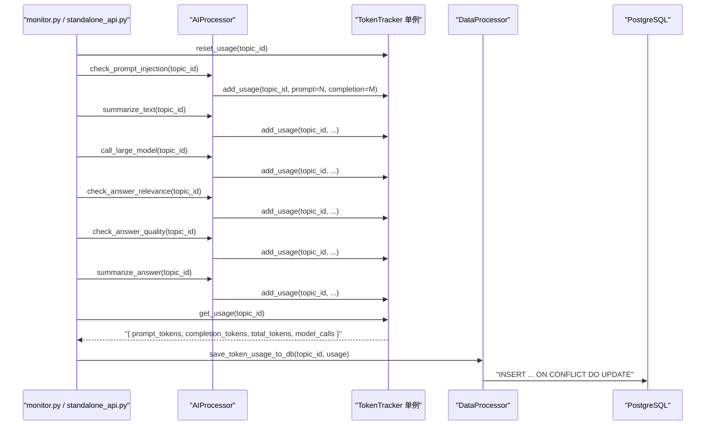

# Token 用量追踪：全链路 LLM 消耗统计

## 项目定位与核心价值

ForumBot 在处理单个论坛帖子的完整生命周期内，会连续触发多次 LLM 调用：提示词注入检测、问题摘要、主答案生成、答案相关性校验、答案质量评估、答案摘要提炼——乃至多模态图像描述分析和 Redfish/MDB 合规预审中的若干专项校验。每一次 OpenAI API 调用都会消耗 Prompt Token 与 Completion Token，且各调用之间的消耗量级差异悬殊（安全检测可能只有几个 token，而完整答案生成则可能高达数万）。如果没有一套统一的计量基础设施，则无法在事后对单个帖子的全链路 LLM 消耗进行溯源，也无法量化各子功能的成本占比，更无法将消耗数据与评估质量指标联动分析。

Token 追踪子系统正是为了填补这一监控盲区而设计的。它以**帖子 ID（topic_id）为计量颗粒度**，对每个帖子在整个处理流水线中积累的 prompt_tokens、completion_tokens、total_tokens 以及 model_calls 次数进行实时累加，并在帖子处理完毕后持久化到 PostgreSQL 的 `consume_tokens_topic` 表。设计上刻意保持轻量：整个计量核心只有一个纯 Python 字典，无任何外部依赖，运行时开销极低。

该子系统由两个文件构成明确的双层职责分工：`token_tracker.py` 提供有状态的累加存储与查询接口，`llm_token_usage.py` 提供无状态的响应体解析与标准化适配层。前者是"账本"，后者是"记账员"。这种分离使得解析逻辑可以被独立测试，而不依赖任何进程级全局状态。

Sources: [token_tracker.py](src/ForumBot/token_tracker.py#L1-L61), [llm_token_usage.py](src/ForumBot/llm_token_usage.py#L1-L94)

---

## 架构设计与模块划分

### 整体拓扑

```mermaid
flowchart TD
    subgraph 调用方层
        A["AIProcessor\n(ai_processor.py)"]
        B["ImageProcessor\n(image_processor.py)"]
        C["RedfishUriGenerator\n(redfish_uri_generator.py)"]
        D["MdbComplianceChecker\n(mdb_checker.py)"]
    end

    subgraph 适配层
        E["llm_token_usage.py\nextract_token_usage()\nrecord_llm_token_usage()"]
    end

    subgraph 核心计量层
        F["token_tracker.py\nTokenTracker 单例\nadd_usage() / get_usage() / reset_usage()"]
    end

    subgraph 消费方层
        G["monitor.py\n_process_new_topics()\n_process_pre_audit_topic()"]
        H["standalone_api.py\nprocess_question()"]
        I["DataProcessor\nsave_token_usage_to_db()"]
        J["PostgreSQL\nconsume_tokens_topic 表"]
    end

    A -- "直接调用 add_usage()" --> F
    B -- "直接调用 add_usage()" --> F
    C -- "调用 record_llm_token_usage()" --> E
    D -- "调用 record_llm_token_usage()" --> E
    E -- "调用 add_usage()" --> F
    G -- "get_usage() / reset_usage()" --> F
    H -- "reset_usage() / get_usage()" --> F
    G --> I
    H -- "token_usage 内联在 API 响应里" --> 调用方层
    I --> J
```



### 核心计量层：`TokenTracker`

`TokenTracker` 是整个子系统的有状态核心，以模块级单例 `token_tracker` 形式存在（`token_tracker.py` 最后一行 `token_tracker = TokenTracker()`）。其内部状态是一个嵌套字典 `self.token_usage`，key 为 `topic_id`（可以是整数或字符串），value 为包含 `prompt_tokens`、`completion_tokens`、`total_tokens`、`model_calls` 四个字段的统计快照。

`add_usage()` 是最高频调用的方法，每次 LLM 调用成功返回后立即触发。它具备**惰性初始化**能力——若 `topic_id` 尚未存在于字典中，则在内部调用 `reset_usage()` 完成初始化，避免调用方在每次使用前手动判断。`get_usage()` 对不存在的 topic_id 返回全零快照而非抛出 `KeyError`，保证了消费方（monitor、standalone_api）读取时永远不会因 key 缺失而崩溃。

`reset_usage()` 的设计语义是**处理周期边界的清零**：`standalone_api.py` 在每次新请求到达时首先调用它，`monitor.py` 的预审流程在开始处理每个新帖子前也会调用它（带 `hasattr` 检测以兼容未升级版本）。这保证了不同帖子的统计数据相互隔离，不会因全局单例而发生串扰。

Sources: [token_tracker.py](src/ForumBot/token_tracker.py#L6-L60), [standalone_api.py](src/ForumBot/standalone_api.py#L78-L80), [monitor.py](src/ForumBot/monitor.py#L814-L816)

### 适配层：`llm_token_usage.py`

不同 LLM 客户端（OpenAI SDK 直连、LangChain `ChatOpenAI`）返回的响应对象结构存在差异。OpenAI SDK 的响应对象通过 `response.usage.prompt_tokens` 暴露用量；LangChain 的消息对象则可能通过 `response.usage_metadata`（含 `input_tokens`/`output_tokens`）或 `response.response_metadata.token_usage` 或 `response.llm_output.token_usage` 来暴露用量，且字段名也不一致（`input_tokens` vs `prompt_tokens`）。

`llm_token_usage.py` 构建了一条**优先级瀑布探针链**来屏蔽这种多样性：

| 探针顺序 | 路径 | 适用客户端 |
|---|---|---|
| 1 | `response.usage` | OpenAI SDK 直连 |
| 2 | `response.usage_metadata` | LangChain ChatOpenAI |
| 3 | `response.response_metadata.token_usage` | LangChain 部分版本 |
| 4 | `response.response_metadata.usage` | 兼容备用 |
| 5 | `response.llm_output.token_usage` | LangChain 旧版 |

`_read_value()` 同时兼容 `Mapping`（字典）和普通对象（通过 `getattr`），`_coerce_int()` 对各类数值做安全类型转换。`_extract_from_usage_object()` 还处理了字段别名：若 `prompt_tokens` 为 None 则 fallback 到 `input_tokens`，`completion_tokens` fallback 到 `output_tokens`；若 `total_tokens` 缺失则由前两者相加推算。

`record_llm_token_usage()` 是对外的最终入口，它在提取成功后直接调用全局 `token_tracker.add_usage()`，并在 LangChain 调用路径（`redfish_uri_generator.py`、`mdb_checker.py`）中通过 `source` 参数记录调用来源，便于日志定位。

Sources: [llm_token_usage.py](src/ForumBot/llm_token_usage.py#L10-L94), [redfish_uri_generator.py](src/ForumBot/SchemaValidation/redfish_uri_generator.py#L19-L211), [mdb_checker.py](src/ForumBot/MdbValidation/mdb_checker.py#L917-L944)

---

## 技术栈与核心工作流

### 两条接入路径

项目中存在两种向 `TokenTracker` 写入数据的路径，分别对应不同的 LLM 客户端：

**路径 A：OpenAI SDK 直接写入**（`ai_processor.py`、`image_processor.py`）

`AIProcessor` 和 `ImageProcessor` 均通过 OpenAI SDK 直接调用 `client.chat.completions.create()`，返回对象具有确定性的 `response.usage` 属性。这两个模块在每次调用结束后直接读取 `response.usage.prompt_tokens` 等字段并调用 `token_tracker.add_usage()`，无需经过适配层。

**路径 B：LangChain 适配写入**（`redfish_uri_generator.py`、`mdb_checker.py`）

合规预审子系统使用 LangChain 的 `ChatOpenAI` 客户端（`llm.invoke(messages)`），返回 `AIMessage` 对象，其用量字段位于 `usage_metadata` 或 `response_metadata` 中。这两个模块在调用后通过 `record_llm_token_usage(topic_id, response, source=...)` 将响应传给适配层解析后写入。

### 完整处理周期时序



处理周期的边界是明确的：以 `reset_usage` 开始，以 `get_usage` + `save_token_usage_to_db` 结束。单次帖子处理中，`model_calls` 字段天然记录了本次处理累计调用模型的次数，是成本归因的直接依据。

### 持久化层：`consume_tokens_topic` 表

`DataProcessor.save_token_usage_to_db()` 使用 PostgreSQL 的 `INSERT ... ON CONFLICT (topic_id) DO UPDATE` 语义（upsert），保证同一 `topic_id` 多次写入时取最新统计值覆盖而非追加重复行。表结构中 `topic_id` 列上有 `UNIQUE` 约束，`data_processor.py` 在初始化时还包含了一段数据库迁移逻辑：若检测到旧版本表缺少该约束，则自动清理重复行并补加约束，保证前向兼容。

| 字段 | 类型 | 语义 |
|---|---|---|
| `topic_id` | INTEGER UNIQUE | 帖子唯一标识，跨进程去重键 |
| `prompt_tokens` | INTEGER | 本次帖子全链路输入 token 累计 |
| `completion_tokens` | INTEGER | 全链路输出 token 累计 |
| `total_tokens` | INTEGER | 两者之和（或由 API 直接返回） |
| `model_calls` | INTEGER | 本次帖子触发模型调用的总次数 |
| `created_at` | TIMESTAMP | 最后一次写入时间（upsert 时刷新） |

Sources: [data_processor.py](src/ForumBot/data_processor.py#L601-L636), [data_processor.py](src/ForumBot/data_processor.py#L901-L941)

---

## 典型代码示例

### `ai_processor.py` 中的直接写入模式

`AIProcessor` 的每个 LLM 调用方法内部均遵循同一固定模式：

```python
# src/ForumBot/ai_processor.py（示例取自 call_large_model，其余方法同构）
response = self.client.chat.completions.create(
    model=self.config['api']['model_name'],
    messages=[...],
    stream=False,
    timeout=600
)
# 守卫：只在 topic_id 有效且 response 确实携带 usage 字段时才写入
if topic_id and hasattr(response, 'usage'):
    token_tracker.add_usage(
        topic_id,
        prompt_tokens=response.usage.prompt_tokens if hasattr(response.usage, 'prompt_tokens') else 0,
        completion_tokens=response.usage.completion_tokens if hasattr(response.usage, 'completion_tokens') else 0,
        total_tokens=response.usage.total_tokens if hasattr(response.usage, 'total_tokens') else 0
    )
```

双重 `hasattr` 守卫确保在 API 异常或 mock 对象情形下不会抛出 `AttributeError`，这是 `ai_processor.py` 中六处写入点共同遵守的防御性编码约定。

Sources: [ai_processor.py](src/ForumBot/ai_processor.py#L337-L345)

### `llm_token_usage.py` 中的多客户端兼容提取

```python
def extract_token_usage(response: Any) -> Optional[dict[str, int]]:
    # 优先级 1：OpenAI SDK response.usage
    direct_usage = _extract_from_usage_object(_read_value(response, "usage"))
    if direct_usage:
        return direct_usage

    # 优先级 2：LangChain usage_metadata（input_tokens / output_tokens）
    usage_metadata = _extract_from_usage_object(_read_value(response, "usage_metadata"))
    if usage_metadata:
        return usage_metadata

    # 优先级 3-4：response_metadata 下的 token_usage 或 usage
    response_metadata = _read_value(response, "response_metadata")
    for key in ("token_usage", "usage"):
        metadata_usage = _extract_from_usage_object(_read_value(response_metadata, key))
        if metadata_usage:
            return metadata_usage

    # 优先级 5：LangChain 旧版 llm_output.token_usage
    llm_output = _read_value(response, "llm_output")
    llm_usage = _extract_from_usage_object(_read_value(llm_output, "token_usage"))
    if llm_usage:
        return llm_usage

    return None
```

Sources: [llm_token_usage.py](src/ForumBot/llm_token_usage.py#L53-L74)

### `standalone_api.py` 中的完整计量闭环

```python
# 边界开始：重置该请求的计量账本
token_tracker.reset_usage(topic_id_str)

# ... 触发若干 LLM 调用（summarize_text, call_large_model 等）...

# 边界结束：读取累计值并内联到 API 响应
token_usage = token_tracker.get_usage(topic_id_str)
return jsonify({
    'success': True,
    'topic_id': topic_id,
    'answer': answer_with_notice,
    'token_usage': token_usage          # 直接对外暴露，调用方可做计费或监控
})
```

这一闭环模式在 `standalone_api.py` 的 `/process_question` 端点中完整体现：reset → LLM calls → get → expose。

Sources: [standalone_api.py](src/ForumBot/standalone_api.py#L79-L130)

---

## 设计哲学速记

> **以 topic_id 为计量单元，而非以调用为计量单元。** 单次帖子处理可能触发 3-7 次 LLM 调用，不同帖子处理路径长度不同（被安全检测拦截的帖子只消耗 1 次调用，完整处理的帖子消耗 6+ 次）。以 topic 为颗粒度的统计使"每帖成本"成为一个可量化的业务指标，而以调用为颗粒度的统计则难以与业务语义对齐。

> **全局单例 + 显式重置，而非请求范围的上下文传递。** 未采用 `contextvars` 或请求级上下文对象，而是用一个进程级字典搭配显式 `reset_usage` 来实现隔离。这在单进程串行处理模式下足够正确，代价是若未来引入并发处理，需要对写操作加锁或切换为请求级实例。

---

## 学习与探索建议

| 探索方向 | 目标文件 | 切入点 |
|---|---|---|
| 理解 token 如何从 API 响应中被提取 | [llm_token_usage.py](src/ForumBot/llm_token_usage.py) | `_extract_from_usage_object()` 的瀑布逻辑与字段别名处理 |
| 跟踪 OpenAI SDK 路径的全部写入点 | [ai_processor.py](src/ForumBot/ai_processor.py) | 搜索 `token_tracker.add_usage` 的 6 处调用（L64, L133, L205, L284, L339, L377） |
| 跟踪 LangChain 路径的写入点 | [mdb_checker.py](src/ForumBot/MdbValidation/mdb_checker.py#L943), [redfish_uri_generator.py](src/ForumBot/SchemaValidation/redfish_uri_generator.py#L211) | `record_llm_token_usage()` 调用处 |
| 理解数据库持久化结构与迁移逻辑 | [data_processor.py](src/ForumBot/data_processor.py#L601-L636) | `CREATE TABLE consume_tokens_topic` 及 `UNIQUE` 约束迁移段 |
| 理解"处理周期边界"的完整闭环 | [standalone_api.py](src/ForumBot/standalone_api.py#L79-L130) | `reset_usage` → LLM calls → `get_usage` → API 响应 |
| 理解 monitor 主流程中的 token 消费 | [monitor.py](src/ForumBot/monitor.py#L299-L544) | `_process_new_topics()` 与 `_process_pre_audit_topic()` 中的 `get_usage` / `save_token_usage_to_db` 调用 |
| 单元测试覆盖范围 | [test_token_tracker.py](tests/test_token_tracker.py), [test_llm_token_usage.py](tests/test_llm_token_usage.py) | `TokenTracker` 的状态隔离测试；LangChain `usage_metadata` / `response_metadata` 解析路径的集成测试 |

## 🔗 关联模块与上下游

- **上游写入方**：[ai_processor.py](src/ForumBot/ai_processor.py)（OpenAI SDK 直接写入，覆盖最多调用点）、[mdb_checker.py](src/ForumBot/MdbValidation/mdb_checker.py)（LangChain 路径经由适配层写入）
- **下游消费方**：[data_processor.py](src/ForumBot/data_processor.py)（`save_token_usage_to_db()` 负责将内存统计持久化到 PostgreSQL）
- **协调者**：[monitor.py](src/ForumBot/monitor.py)（驱动 reset → accumulate → persist 的完整生命周期）
