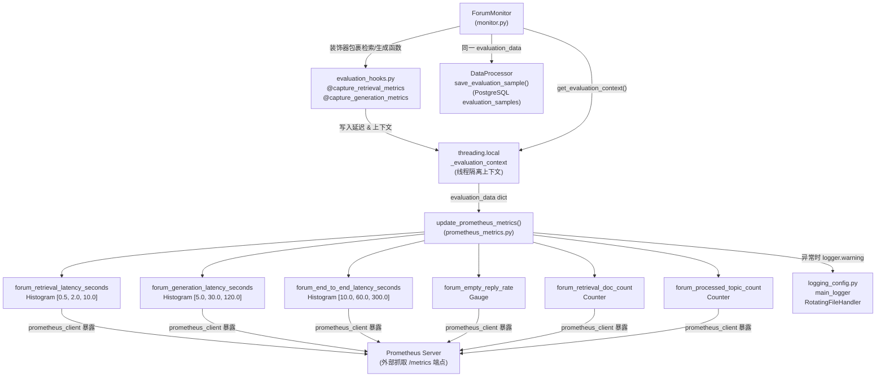

# Prometheus 指标：健康检查与业务埋点

## 1. 项目定位与核心价值

### 背景与痛点

ForumBot 是一个以异步批处理模式运行的 AI 论坛回复机器人，其核心链路由**检索（LightRAG）→ 生成（LLM）→ 回复（Forum API）**三段串联构成。与典型 Web 服务不同，该系统没有同步请求-响应模型，无法依赖 HTTP 状态码或 APM 探针天然捕获延迟分布；同时，LLM 调用天然带有极高方差——检索耗时可能在毫秒级，而生成耗时可能拉伸至分钟级——若没有专门的打点机制，运维人员在面对"机器人沉默"或"回复质量下降"等问题时几乎无从定位。

另一个关键痛点是**空回复**问题。当 LLM 因 token 限制、网络超时或提示词命中安全过滤而返回空字符串时，系统仍会正常写库、记 CSV，日志中不会出现异常——唯一能无声察觉这一退化信号的，正是专门埋设的 `forum_empty_reply_rate` 指标。

正是为了解决上述在纯日志方案中无法高效量化的问题，该模块引入了 `prometheus-client` 并在每个 topic 处理完毕后精确上报一组业务指标。

### 核心特性

**指标体系与业务语义对齐**：`prometheus_metrics.py` 没有照搬通用框架的"请求数/错误数/延迟"三板斧，而是完全按照 ForumBot 的 RAG 链路语义命名和设计每一个指标。`forum_retrieval_latency_seconds` 对应 LightRAG 检索阶段，`forum_generation_latency_seconds` 对应 LLM 生成阶段，二者之和构成 `forum_end_to_end_latency_seconds`，三条 Histogram 共同还原了一次完整 topic 处理的时间剖面。`forum_retrieval_doc_count` 则量化了知识库的"召回深度"，可与延迟指标联动分析召回数量对生成质量的影响。

**防御性设计贯穿始终**：从模块级的指标注册（包裹在 `try/except ValueError` 中应对进程热重启场景），到 `update_prometheus_metrics` 函数内部对每一个字段的 `None` 值与类型的显式校验，再到函数外层 `try/except Exception` 托底——整个模块确保任何情况下指标上报的失败都不会传播为业务异常，对主链路完全透明。

**轻量日志系统的统一出口**：`logging_config.py` 提供了贯穿全项目的单一日志记录器 `main_logger`，通过 `RotatingFileHandler` 实现大文件自动切割（默认 20 MB / 4 备份），并在模块导入阶段即完成初始化，使得所有子模块只需 `from .logging_config import main_logger as logger` 即可接入统一的日志流。两个模块共同构成了 ForumBot 的可观测性底座。

Sources: [prometheus_metrics.py](src/ForumBot/prometheus_metrics.py#L1-L70), [logging_config.py](src/ForumBot/logging_config.py#L1-L70), [requirements.txt](requirements.txt#L43-L44)

---

## 2. 架构设计与模块划分

### 整体可观测性拓扑



### 各模块职责详解

**`logging_config.py` — 全局日志单例**

该模块在被 `import` 时立即执行模块级代码：尝试调用 `load_config()` 读取 YAML 配置中的 `logging.log_dir` 和 `logging.main_log_file` 字段，若成功则以 `RotatingFileHandler`（最大 20 MB，保留 4 个备份）加控制台双 Handler 的方式构建 `main_logger`；若配置加载失败则静默降级为 `logs/main.log` 默认路径。`logger.propagate = False` 的设置阻断了日志向 root logger 的传播，避免在多模块同时使用时产生重复输出。

这种"模块级单例"模式意味着 `main_logger` 的初始化时机早于任何函数调用，发生在 Python 解释器执行 `import` 语句阶段。全项目至少 20 个模块均通过 `from .logging_config import main_logger as logger` 引用同一实例，形成了统一的日志出口。

Sources: [logging_config.py](src/ForumBot/logging_config.py#L7-L70)

**`evaluation_hooks.py` — 非侵入式指标采集层**

该模块提供两个装饰器 `@capture_retrieval_metrics` 和 `@capture_generation_metrics`，分别在检索函数和生成函数执行前后自动打时间戳，并将延迟与结果写入 `threading.local` 对象 `_evaluation_context`。这一设计的核心价值在于**零侵入**：被装饰的检索/生成函数不需要修改任何签名，数据采集逻辑与业务逻辑完全解耦。`threading.local` 保证了多线程场景下各 topic 处理上下文的隔离。

当装饰器内部发生异常时，行为有微妙差异：`capture_retrieval_metrics` 将 context 字段置 `None` 后**继续执行原函数**（降级但不中断），而 `capture_generation_metrics` 置 `None` 后**重新抛出异常**（生成失败不可忽略）。

Sources: [evaluation_hooks.py](src/ForumBot/evaluation_hooks.py#L1-L67)

**`prometheus_metrics.py` — 指标定义与上报**

该模块在导入时注册 6 个 Prometheus 指标对象（全局变量），并提供唯一的公共函数 `update_prometheus_metrics(evaluation_data)`，由 `monitor.py` 在每个 topic 处理完毕后调用。指标注册阶段同样用 `try/except ValueError` 保护，应对进程在同一 Python 进程内热重启（如测试框架多次 import）时 `prometheus_client` 抛出的重复注册异常。

Sources: [prometheus_metrics.py](src/ForumBot/prometheus_metrics.py#L1-L70)

---

## 3. 技术栈与核心工作流

### 依赖栈

| 层次 | 组件 | 版本/说明 |
|------|------|-----------|
| 指标采集 | `prometheus-client` | 0.20.0，Python 官方 Prometheus 客户端 |
| 日志框架 | Python `logging` 标准库 | `RotatingFileHandler` 实现轮转 |
| 日志扩展 | `python-json-logger` | 3.0.0，JSON 格式化（已声明依赖，供扩展使用） |
| 线程隔离 | `threading.local` | 标准库，保证上下文按线程隔离 |
| 配置读取 | `load_config()` (src/utils.py) | YAML 配置统一入口 |

### 单次 Topic 处理的指标上报主链路

```
ForumMonitor.process_topics()
│
├─ 检索阶段（被 @capture_retrieval_metrics 装饰）
│   └─ 写入 _evaluation_context.retrieval_context / retrieval_latency
│
├─ 生成阶段（被 @capture_generation_metrics 装饰）
│   └─ 写入 _evaluation_context.actual_output / generation_latency
│
├─ 回复发送 / 落库 / CSV 写入
│
├─ get_evaluation_context()  →  组装 evaluation_data dict
│
├─ DataProcessor.save_evaluation_sample()  →  写入 PostgreSQL evaluation_samples 表
│
└─ update_prometheus_metrics(evaluation_data)  →  上报 6 个 Prometheus 指标
```

monitor.py 中，该调用出现在三处决策分支的末尾：答案被判定为**不相关**时、答案被判定为**质量不达标**时、以及**正常回复成功**时。这意味着无论 topic 走哪条出口路径，指标上报都会被触发，确保了 `forum_processed_topic_count` 计数的完整性。

Sources: [monitor.py](src/ForumBot/monitor.py#L393-L536), [evaluation_hooks.py](src/ForumBot/evaluation_hooks.py#L13-L52)

### `update_prometheus_metrics` 内部执行逻辑

```python
def update_prometheus_metrics(evaluation_data):
    try:
        # 1. 检索延迟：仅在 > 0 时 observe（过滤零值/None）
        retrieval_latency = evaluation_data.get('retrieval_latency', 0.0)
        if retrieval_latency is not None and retrieval_latency > 0:
            forum_retrieval_latency_seconds.observe(retrieval_latency)

        # 2. 生成延迟：同上逻辑
        generation_latency = evaluation_data.get('generation_latency', 0.0)
        if generation_latency is not None and generation_latency > 0:
            forum_generation_latency_seconds.observe(generation_latency)

        # 3. 空回复率：Gauge，非空=0.0，空=1.0（逐 topic 刷新，非累计）
        actual_output = evaluation_data.get('actual_output', '')
        forum_empty_reply_rate.set(0.0 if actual_output else 1.0)

        # 4. 检索文档数：支持 dict / list / str 三种上游格式
        retrieval_context = evaluation_data.get('retrieval_context')
        if retrieval_context:
            if isinstance(retrieval_context, dict):
                forum_retrieval_doc_count.inc(len(retrieval_context.values()))
            elif isinstance(retrieval_context, list):
                forum_retrieval_doc_count.inc(len(retrieval_context))
            elif isinstance(retrieval_context, str) and retrieval_context:
                forum_retrieval_doc_count.inc(1)

        # 5. 已处理帖子数：无条件 +1
        forum_processed_topic_count.inc(1)

        # 6. 端到端延迟：两段之和，仅在 > 0 时 observe
        end_to_end_latency = (r_lat) + (g_lat)
        if end_to_end_latency > 0:
            forum_end_to_end_latency_seconds.observe(end_to_end_latency)

    except Exception as e:
        logger.warning(f"更新Prometheus指标失败: {e}")
```

Sources: [prometheus_metrics.py](src/ForumBot/prometheus_metrics.py#L36-L70)

---

## 4. 指标设计深度解析

### 六个指标的完整规格

| 指标名 | 类型 | Bucket / 说明 | 业务含义 |
|--------|------|---------------|----------|
| `forum_retrieval_latency_seconds` | Histogram | `[0.5, 2.0, 10.0]` | LightRAG 检索阶段耗时；bucket 上界 10s 对应检索超时边界 |
| `forum_generation_latency_seconds` | Histogram | `[5.0, 30.0, 120.0]` | LLM 生成阶段耗时；120s 对应大模型生成的超时容忍上限 |
| `forum_end_to_end_latency_seconds` | Histogram | `[10.0, 60.0, 300.0]` | 两阶段之和；300s（5 分钟）为端到端 SLA 告警阈值的合理上界 |
| `forum_empty_reply_rate` | Gauge | 0.0 / 1.0 | **非累计比率**：最近一次处理结果是否为空；适合做 Alertmanager 连续触发告警 |
| `forum_retrieval_doc_count` | Counter | 单调递增 | 累计召回文档总数；可用 `rate()` 计算单位时间召回量，与延迟联动分析 |
| `forum_processed_topic_count` | Counter | 单调递增 | 处理帖子总数；可用 `rate()` 计算系统吞吐量 |

### Histogram Bucket 选取的设计逻辑

三条 Histogram 的 bucket 边界呈指数级放大，体现了 RAG 链路各阶段天然的耗时量级差异：

- **检索层（0.5s / 2s / 10s）**：LightRAG 的图谱检索在本地或近端运行，正常路径应在 2s 内完成；10s 以上属于明显异常，需要告警。
- **生成层（5s / 30s / 120s）**：远端 LLM API 的生成时间受 token 数量和服务负载影响极大，30s 是可接受的正常上限，120s 触顶意味着网络超时或模型过载。
- **端到端（10s / 60s / 300s）**：两段叠加，60s 以内属于可接受范围，超过 300s 基本意味着流程卡死。

> 这一 bucket 设计是对 LLM 工程现实的直接映射：AI 系统的延迟分布极度非正态，标准 [0.1, 0.5, 1.0] 的 Web bucket 在此完全失效。

Sources: [prometheus_metrics.py](src/ForumBot/prometheus_metrics.py#L4-L19)

### `forum_empty_reply_rate` 的 Gauge 语义

值得注意的是，`forum_empty_reply_rate` 被定义为 `Gauge` 而非 `Counter`。这意味着它的值会在每次 topic 处理后被**覆写**（`set(0.0)` 或 `set(1.0)`），而非累加。其语义是"**最近一次处理是否产生了空回复**"，而非历史空回复率的百分比（名字中的"rate"在此有一定歧义）。在 Prometheus 查询层面，可以通过 `avg_over_time(forum_empty_reply_rate[5m])` 来近似计算滑动窗口内的空回复比例。

Sources: [prometheus_metrics.py](src/ForumBot/prometheus_metrics.py#L20-L23), [prometheus_metrics.py](src/ForumBot/prometheus_metrics.py#L46-L50)

---

## 5. 典型代码：日志系统初始化的隐蔽时序

`logging_config.py` 的一个关键设计特征是**副作用发生在 import 阶段**，而非在某个显式初始化函数中：

```python
# logging_config.py — 模块级执行代码（第53-70行）
try:
    config = load_config()
    log_dir = config.get('logging', {}).get('log_dir', 'logs')
    main_log_file = config.get('logging', {}).get('main_log_file', 'main.log')
    os.makedirs(log_dir, exist_ok=True)
    full_log_path = os.path.join(log_dir, main_log_file)
    main_logger = setup_logger('AskRobotPOC', full_log_path,
                               max_bytes=20*1024*1024, backup_count=4)
except Exception as e:
    print(f"加载日志配置失败: {e}")
    # 降级：使用硬编码默认路径
    log_dir = 'logs'
    os.makedirs(log_dir, exist_ok=True)
    full_log_path = os.path.join(log_dir, 'main.log')
    main_logger = setup_logger('AskRobotPOC', full_log_path)
```

这一模式的实际效果是：任何 `import src.ForumBot.logging_config` 或 `from .logging_config import main_logger` 都会触发目录创建和文件句柄打开。在测试环境中若未配置 YAML 文件，系统会静默降级并打印一条 `print()` 输出（而非 `logger.warning()`，因为此时 logger 尚未构建）。

Sources: [logging_config.py](src/ForumBot/logging_config.py#L52-L70)

---

## 6. 测试覆盖策略

`tests/test_prometheus_metrics.py` 通过 `unittest.mock.patch` 完整 mock 掉所有 6 个 Prometheus 指标对象，对 `update_prometheus_metrics` 进行纯行为测试：

| 测试用例 | 验证重点 |
|---------|---------|
| `with_retrieval_latency` | 仅检索延迟有值时，生成延迟不被 observe |
| `with_empty_output` | `actual_output=''` 时 `forum_empty_reply_rate.set(1.0)` |
| `with_string_context` | `retrieval_context` 为字符串时 `forum_retrieval_doc_count.inc(1)` |
| `with_dict_retrieval_context` | dict 格式按 `len(values())` 计数 |
| `with_none_latencies` | 双 None 延迟时三条 Histogram 均不被 observe |
| `with_exception` | 非法类型（如字符串延迟）触发 `logger.warning`，不抛异常 |
| `with_empty_dict_retrieval_context` | 空 dict 时 `inc(0)` 仍被调用（边界行为验证）|

测试策略的核心是将指标对象完全替换为 Mock，从而使测试本身不依赖 Prometheus 进程或注册表状态，可在任意隔离环境中运行。

Sources: [tests/test_prometheus_metrics.py](tests/test_prometheus_metrics.py#L1-L304)

---

## 7. 学习与探索建议

### 上下游关联模块

| 方向 | 文件 | 关注点 |
|------|------|--------|
| 指标的数据来源 | [evaluation_hooks.py](src/ForumBot/evaluation_hooks.py) | `@capture_retrieval_metrics` / `@capture_generation_metrics` 装饰器如何通过 `threading.local` 将延迟注入上下文 |
| 指标的调用位置 | [monitor.py](src/ForumBot/monitor.py#L393-L540) | `update_prometheus_metrics` 在三条出口分支（不相关/不合格/正常回复）中的对称调用模式 |
| 评估数据的持久化 | [data_processor.py](src/ForumBot/data_processor.py#L1216-L1265) | `save_evaluation_sample()` 将同一 `evaluation_data` 落入 PostgreSQL `evaluation_samples` 表，与 Prometheus 指标形成双写 |

### 深挖方向

- **指标暴露端点缺失**：当前代码库中未发现 `start_http_server()` 或 `make_wsgi_app()` 的调用，意味着 `/metrics` 端点的暴露机制可能在 Flask 应用层（`api_main.py` / `standalone_api.py`）或外部 sidecar 中配置，值得追踪。
- **`forum_empty_reply_rate` 的告警设计**：由于该 Gauge 是单次覆写而非滑动窗口，建议在 Alertmanager 规则中配合 `for: 3m`（持续触发）而非瞬间触发，避免偶发空回复产生误报。
- **Histogram 精度扩展**：当前三段延迟共用 3 个 bucket，在生产负载增大后可考虑使用 `prometheus_client` 的 `Summary` 类型或扩展 bucket 列表以获得更精细的百分位数分布。

---

## 🔗 关联模块与上下游

- **直接调用方**：[monitor.py](src/ForumBot/monitor.py#L16-L17) — `from .prometheus_metrics import update_prometheus_metrics`，在 topic 处理三条出口均调用
- **数据采集依赖**：[evaluation_hooks.py](src/ForumBot/evaluation_hooks.py) — 提供 `_evaluation_context`（`threading.local`）以及 `get_evaluation_context()` 读取接口，是 `evaluation_data` dict 的数据来源
- **日志依赖**：[logging_config.py](src/ForumBot/logging_config.py) — `prometheus_metrics.py` 第 2 行直接 `from .logging_config import main_logger as logger`，用于指标上报失败时的降级告警
