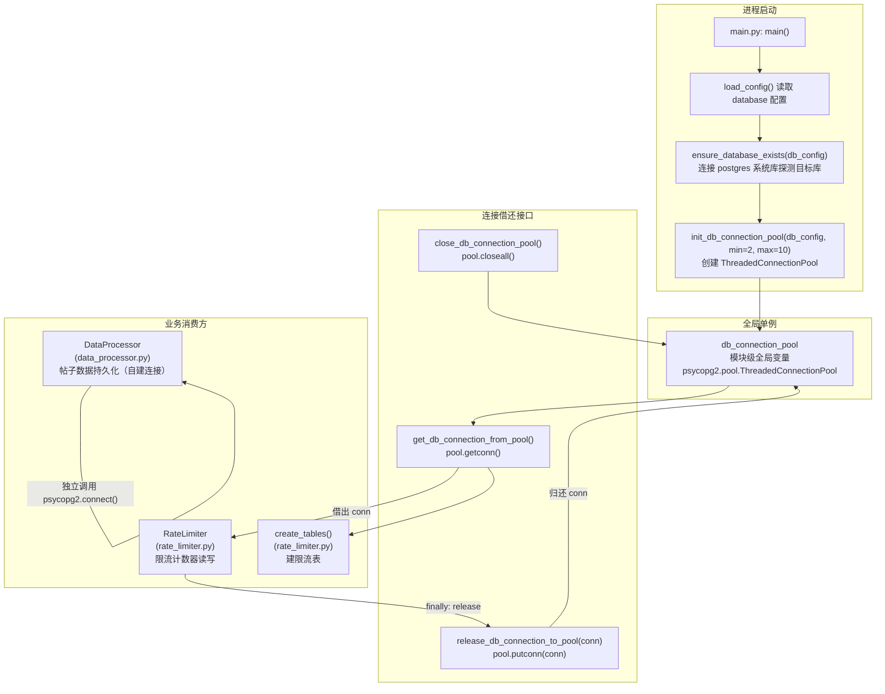

# PostgreSQL 连接池：线程安全持久化基础设施

## 项目定位与核心价值

### 问题背景：多线程环境下的连接资源争夺

ForumBot 在运行期同时存在三条并行工作线：Flask 请求处理线程（处理 `/api/v1/rag/*` 的实时用户请求）、论坛监控线程（`ForumMonitor` 定期轮询论坛新帖并写入 PostgreSQL）以及 LightRAG 增量更新调度线程（将处理后的帖子向量化存储）。这三条线都需要对同一个 PostgreSQL 实例执行读写操作。

朴素的实现方式是"用时建连、用完即关"——每次数据库操作都执行 `psycopg2.connect(...)` 和 `conn.close()`。这一模式在单线程脚本中毫无问题，但在多线程 Web 服务场景下会产生两个严重缺陷：其一是**连接建立的高延迟**，PostgreSQL 的 TCP 握手 + 认证 + SSL 协商耗时约数十毫秒，在高频请求路径上会显著拖慢响应；其二是**连接风暴风险**，若某一时刻多个线程同时发起连接请求，PostgreSQL 服务端的 `max_connections` 配额极易被瞬间耗尽，导致后续连接全部抛出 `OperationalError: FATAL: remaining connection slots are reserved for non-replication superuser connections`。

数据库连接池（Connection Pool）正是解决上述痛点而生的标准基础设施组件。它在进程启动时预先建立若干条物理连接并缓存在内存中，业务代码向池子"借"连接、用完"还"回去，复用物理连接而非每次重建，从而将连接建立的开销分摊到进程整个生命周期，同时以最大连接数为硬性上限保护数据库服务端不被压垮。

### 设计选型：`psycopg2.pool.ThreadedConnectionPool`

该项目的连接池方案封装在 `src/utils.py` 的四个公共函数中，底层选用了 `psycopg2` 原生提供的 `ThreadedConnectionPool`，而非 SQLAlchemy 的连接池或第三方库（如 `pgbouncer`）。这一选型具有明确的工程考量：

1. **零额外依赖**：`psycopg2` 本身已是项目的核心数据库驱动，`pool` 模块内置其中，无需引入任何新依赖。
2. **线程安全语义**：`ThreadedConnectionPool` 的 `getconn()` 与 `putconn()` 均在内部持有 `threading.Lock`，保证多线程并发借还连接时不会产生竞态条件，这与项目的多线程架构高度匹配。
3. **简洁的生命周期管理**：四个函数（`init` → `get` → `release` → `close`）对应连接池从诞生到销毁的完整生命周期，职责单一、易于测试。

此外，`src/utils.py` 还内置了 `ensure_database_exists()` 函数，用于在连接池初始化之前自动探测并创建目标数据库，构成了**自愈式建库**能力，彻底消解了首次部署时"目标库不存在"这一常见运维陷阱。

Sources: [utils.py](src/utils.py#L141-L237), [rate_limiter.py](src/ForumBot/rate_limiter.py#L1-L7)

---

## 架构设计与模块划分

### 整体拓扑



### 核心层职责解析

**全局单例层（`db_connection_pool`，`src/utils.py:141`）**

`db_connection_pool` 是一个声明在模块顶层的全局变量，初始值为 `None`。这一设计使得连接池在进程中天然是单例的——无论哪个模块 `from src.utils import get_db_connection_from_pool`，都是在操作同一个物理池对象。模块级全局变量的可见范围即进程级，不需要任何单例模式的额外封装，是 Python 惯用的轻量实现。

**初始化层（`init_db_connection_pool`，`src/utils.py:144-178`）**

该函数在 `main()` 的启动序列中被调用一次。它从 `db_config` 字典中提取 `host`、`port`、`database`、`user`、`password`、`sslmode` 六个参数，以 `min_connections=2, max_connections=10` 的默认区间（调用方在 `main.py:359` 传入这两个值）构建 `ThreadedConnectionPool`。若创建失败，函数返回 `False`，`main()` 会记录错误日志但**不会退出进程**——这是一个有意为之的容错设计：API 服务仍然可以响应健康探针，避免 Kubernetes 在连接池初始化暂时失败时无限重启 Pod。

**借还层（`get_db_connection_from_pool` / `release_db_connection_to_pool`，`src/utils.py:181-222`）**

`get_db_connection_from_pool()` 调用 `pool.getconn()`，若连接池未初始化或 `getconn` 抛出异常，均返回 `None`，调用方需自行检查返回值。`release_db_connection_to_pool(conn)` 调用 `pool.putconn(conn)` 归还连接；当 `putconn` 本身失败时，函数会 fallback 调用 `conn.close()` 直接关闭连接以防泄漏——这个 fallback 路径是防御性编程的典型体现。

**数据库存在性自愈层（`ensure_database_exists`，`src/utils.py:10-80`）**

这是整个基础设施最具"运维友好性"的一段代码。函数先以 `database='postgres'`（PostgreSQL 的默认管理库）建立管理员连接，执行 `SELECT 1 FROM pg_database WHERE datname = %s` 参数化查询探测目标库；若不存在，则执行 `CREATE DATABASE "{target_db}"`（注意使用了双引号以支持含特殊字符的库名）并设置 `autocommit = True`（DDL 操作不允许在事务中执行）。整个函数无论成功失败都会在 `finally` 块中关闭管理员连接，不会泄漏连接。

Sources: [utils.py](src/utils.py#L10-L80), [utils.py](src/utils.py#L141-L237), [main.py](main.py#L334-L360)

---

## 技术栈与核心工作流

### 启动时序：连接池的生命周期

| 阶段 | 调用位置 | 执行内容 |
|------|----------|----------|
| **1. 配置加载** | `main.py:335` | `load_config()` 从 `config/config.yaml` 读取 `database` 节点 |
| **2. 配置擦除** | `main.py:337` | `delete_config_file()` 立即删除 `config.yaml`，防止凭证落盘 |
| **3. 数据库自愈** | `rate_limiter.create_tables():158` | `ensure_database_exists(db_config)` 自动建库 |
| **4. 连接池初始化** | `main.py:359` | `init_db_connection_pool(db_config, min=2, max=10)` |
| **5. 建限流表** | `main.py:385` | `create_rate_limit_tables(config)` 依赖已初始化的连接池 |
| **6. 运行期借还** | `rate_limiter.py:22,96,126` | `get_db_connection_from_pool()` + `finally: release_db_connection_to_pool()` |
| **7. 进程退出** | 暂无显式调用 | `close_db_connection_pool()` 提供关闭接口，当前未注册 atexit |

### 两种连接获取模式的并存

值得注意的是，该项目存在两种并行的数据库连接获取模式，分别对应不同的使用场景：

**模式一：连接池模式（`RateLimiter`，`src/ForumBot/rate_limiter.py`）**

`RateLimiter.get_db_connection()` 优先调用 `get_db_connection_from_pool()`；若连接池返回 `None`（池未初始化或连接耗尽），则 fallback 到 `psycopg2.connect()` 新建一条临时连接。这种"池优先 + 直连兜底"的模式保证了限流功能在连接池异常时仍能降级运行，但代价是 fallback 路径下的临时连接不会被归还到池中，调用方需在 `finally` 中通过 `release_db_connection_to_pool()` 处理（`release` 函数本身会安全跳过 `None` 连接池的情况，最终仍会 `putconn` 或 `close`）。

**模式二：按需直连模式（`DataProcessor`，`src/ForumBot/data_processor.py`）**

`DataProcessor` 未使用连接池，而是通过 `_get_db_connection()` 在每次操作时独立建立一条带**指数退避重试**（最多 3 次，退避间隔 `2^attempt` 秒）的直连。每个方法（`get_processed_topic_ids`、`append_to_db`、`save_token_usage_to_db` 等）都遵循"借连 → 操作 → `finally: _close_db_connection`"的三段式结构。这一模式的优点是不依赖全局连接池状态、连接隔离性更强；代价是无法复用物理连接，在高并发场景下效率低于连接池模式。

两种模式的并存反映了该项目在不同功能模块演进阶段中不同的工程决策——`RateLimiter` 是后期添加的、面向实时请求路径的组件，对连接延迟更敏感，因此使用了连接池；`DataProcessor` 是早期的后台批处理模块，其操作频率远低于请求级别，直连模式的开销可以接受。

Sources: [rate_limiter.py](src/ForumBot/rate_limiter.py#L20-L38), [rate_limiter.py](src/ForumBot/rate_limiter.py#L92-L96), [data_processor.py](src/ForumBot/data_processor.py#L424-L450)

---

## 典型代码解析

### 连接池完整生命周期

```python
# src/utils.py — 全局单例
db_connection_pool = None  # 模块级，进程内唯一

def init_db_connection_pool(db_config, min_connections=2, max_connections=10):
    global db_connection_pool
    try:
        db_connection_pool = pool.ThreadedConnectionPool(
            min_connections,
            max_connections,
            host=db_config.get('host'),
            port=db_config.get('port'),
            database=db_config.get('database'),
            user=db_config.get('user'),
            password=db_config.get('password'),
            sslmode=db_config.get('sslmode', 'prefer')
        )
        return True
    except Exception as e:
        db_connection_pool = None
        return False

def get_db_connection_from_pool():
    global db_connection_pool
    if not db_connection_pool:
        return None
    try:
        return db_connection_pool.getconn()
    except Exception:
        return None

def release_db_connection_to_pool(conn):
    global db_connection_pool
    if not db_connection_pool:
        return
    if conn:
        try:
            db_connection_pool.putconn(conn)
        except Exception:
            try:
                conn.close()  # fallback：直接关闭防止泄漏
            except Exception:
                pass
```

Sources: [utils.py](src/utils.py#L141-L222)

### RateLimiter 的连接借还模式

```python
# src/ForumBot/rate_limiter.py — 池优先 + 直连兜底
def check_rate_limit(self, user_id):
    conn = self.get_db_connection()  # 优先从池获取
    if not conn:
        return True  # 获取失败时放行，保证服务可用性优先
    try:
        cursor = conn.cursor()
        # ... 滑动窗口限流逻辑 ...
        conn.commit()
        return True
    except Exception as e:
        logger.error(f"Rate limit check failed: {e}")
        return True  # 异常时同样放行
    finally:
        release_db_connection_to_pool(conn)  # 无论成功失败，必须归还
```

`finally` 块中的 `release_db_connection_to_pool(conn)` 是这一模式的核心纪律。无论业务逻辑成功、失败还是抛出异常，连接都必须被归还到池中，否则池中可用连接数会持续减少直至耗尽。

Sources: [rate_limiter.py](src/ForumBot/rate_limiter.py#L40-L96)

### DataProcessor 的指数退避重连

```python
# src/ForumBot/data_processor.py — 按需直连 + 指数退避
def _get_db_connection(self, max_retries=3):
    for attempt in range(max_retries):
        try:
            conn = psycopg2.connect(**db_params)
            return conn
        except Exception as e:
            logger.warning(f"数据库连接失败 (尝试 {attempt + 1}/{max_retries}): {e}")
            if attempt < max_retries - 1:
                time.sleep(2 ** attempt)  # 0s → 1s → 2s 指数退避
            else:
                logger.error("数据库连接在 3 次尝试后仍然失败")
                return None
    return None
```

Sources: [data_processor.py](src/ForumBot/data_processor.py#L424-L450)

### `ensure_database_exists` 的自愈逻辑

```python
# src/utils.py — 通过系统库 postgres 自动建库
def ensure_database_exists(db_config):
    admin_conn = None
    try:
        admin_conn = psycopg2.connect(
            ...
            database='postgres',  # 连接系统库，不依赖目标库存在
            ...
        )
        admin_conn.autocommit = True  # DDL 不可在事务中执行
        cursor = admin_conn.cursor()

        cursor.execute(
            "SELECT 1 FROM pg_database WHERE datname = %s",
            (target_db,)  # 参数化查询，防注入
        )
        if cursor.fetchone():
            return True  # 已存在，直接返回

        cursor.execute(f'CREATE DATABASE "{target_db}"')  # 不存在，自动创建
        return True
    except psycopg2.OperationalError as e:
        # 特殊处理：若 postgres 库本身也不存在，做二次尝试
        ...
    finally:
        if admin_conn:
            admin_conn.close()  # 管理连接必须关闭，不进入业务连接池
```

Sources: [utils.py](src/utils.py#L10-L80)

---

## 可观测性维度：连接池状态的间接暴露

当前实现中，连接池本身没有直接向 Prometheus 或 `/health/detail` 端点暴露连接数指标（如活跃连接数、等待队列长度）。健康检查端点 `/health` 和 `/health/detail` 的判断依据是 `service_initialized`、`monitor_instance`、`monitor_thread.is_alive()` 等上层业务状态变量，而非数据库连接池的内部状态。

这意味着在连接池静默耗尽（所有连接均被借出且未归还）的场景下，健康探针仍可能返回 `200 healthy`，而实际的数据库操作已全部在 `get_db_connection_from_pool()` 处返回 `None`。这是当前架构在可观测性层面的一个值得关注的盲点，生产环境中建议通过 `psycopg2.pool.ThreadedConnectionPool._pool` 的长度周期性上报活跃连接数指标。

Sources: [main.py](main.py#L181-L234), [utils.py](src/utils.py#L181-L200)

---

## 数据库表体系与迁移策略

连接池之上，`DataProcessor.create_tables()` 负责在系统启动时幂等地创建所有业务表。该方法使用 `CREATE TABLE IF NOT EXISTS` 语义，可重复执行不会报错。更值得关注的是其内置的**在线迁移**逻辑：对于 `consume_tokens_topic` 表，代码会查询 `pg_constraint` 系统表检测 `topic_id` 列的 UNIQUE 约束是否存在；若不存在（说明是从旧版本升级而来），则先执行去重 DELETE、再 ALTER TABLE 添加约束，实现了无需停机的结构迁移。

```sql
-- 探测约束存在性（src/ForumBot/data_processor.py:616-620）
SELECT conname FROM pg_constraint
WHERE conrelid = 'consume_tokens_topic'::regclass
AND contype = 'u' AND conname = 'consume_tokens_topic_topic_id_key'
```

Sources: [data_processor.py](src/ForumBot/data_processor.py#L528-L721)

---

## 测试覆盖策略

`tests/test_utils.py` 中的 `TestDBConnectionPool` 类对连接池四个函数的所有边界路径做了系统性覆盖，包括：初始化成功/失败、从池获取连接成功/池为 None/池内部异常、归还连接成功/池为 None 时的 no-op 语义、归还失败时的 `close()` fallback、关闭池成功/失败后全局变量重置为 `None`。

测试层面的关键挑战是 `psycopg2` 的隔离：`tests/conftest.py` 在 `psycopg2` 未安装时通过 `types.ModuleType` 动态注入 `DummyThreadedConnectionPool` stub，使 CI 环境无需真实 PostgreSQL 实例即可验证连接池的状态机逻辑。

Sources: [tests/test_utils.py](tests/test_utils.py#L265-L405), [tests/conftest.py](tests/conftest.py#L18-L51)

---

## 🧭 源码导航 (Codebase Map)

| 路径 | 职责 |
|------|------|
| [`src/utils.py`](src/utils.py) | 连接池核心引擎：`ensure_database_exists` / `init_db_connection_pool` / `get_db_connection_from_pool` / `release_db_connection_to_pool` / `close_db_connection_pool` |
| [`src/ForumBot/rate_limiter.py`](src/ForumBot/rate_limiter.py) | 连接池的唯一实际消费方，展示了"池优先 + 直连兜底 + finally 归还"的完整使用范式 |
| [`src/ForumBot/data_processor.py`](src/ForumBot/data_processor.py) | 并行存在的直连模式，展示了指数退避重连与业务表幂等建表 + 在线迁移策略 |
| [`main.py`](main.py#L334-L360) | 连接池生命周期的起点，展示了启动序列中配置加载 → 凭证擦除 → 连接池初始化的顺序依赖 |
| [`tests/test_utils.py`](tests/test_utils.py#L265-L405) | `TestDBConnectionPool` — 状态机边界路径的系统测试，包含 fallback close 路径验证 |
| [`tests/conftest.py`](tests/conftest.py#L18-L51) | `DummyThreadedConnectionPool` stub 注入，解决无 PostgreSQL 环境下的 CI 测试隔离问题 |
