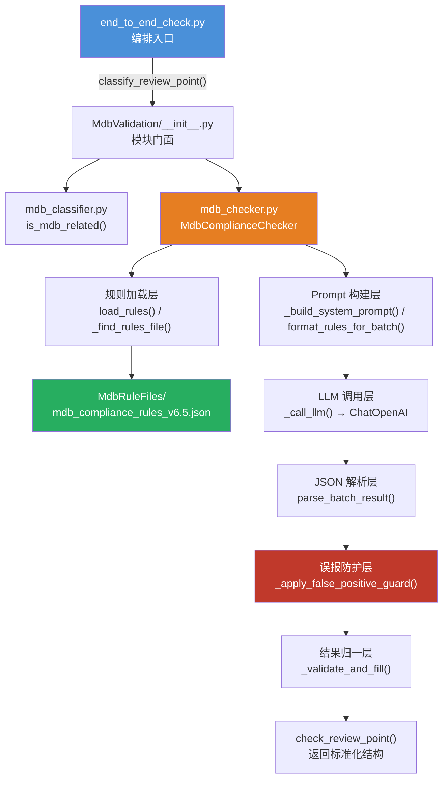
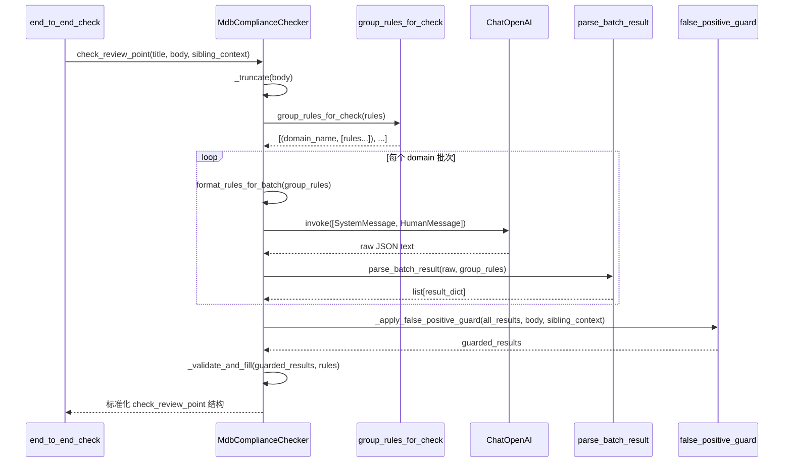

# MDB 合规校验：LLM 驱动规则批处理

## 1. 项目定位与核心价值

### 背景与痛点

openUBMC 论坛的 Interface SIG 是 BMC 固件领域核心接口标准的守护者，其评审帖承载着资源协作接口（MDB Interface）的新增、变更与废弃申报。这类评审涉及三套核心规范的交叉校验：申报模板（topic/3817）、设计合规性必检指南（topic/1862）和废弃处理规范（topic/2087）。随着评审帖数量的爆炸式增长，人工逐条核查规则的效率成为瓶颈——每篇帖子需要对照数十条规则逐一判断，且规则版本迭代频繁，旧版规则 ID（legacy_id）与新版规则 ID 并存，维护成本极高。

`mdb_checker.py` 正是在这一背景下诞生的自动化合规引擎。它从原有独立项目 `mdb_interface_compliance_check/compliance_checker.py` 移植而来，核心改造方向有两个：一是将底层 LLM 调用从原生 `openai.OpenAI` 替换为 LangChain `ChatOpenAI`，使其与整个 ForumBot 基础设施的 LangChain 生态对齐；二是彻底去除缓存机制，以保证每次评审都能基于最新状态做出判断，杜绝缓存脏数据引发的漏检。

### 核心特性

**规则驱动、版本自适应**是该模块最鲜明的设计哲学。规则不内嵌在代码中，而是存储于 `MdbRuleFiles/` 目录下的 JSON 文件。系统启动时，`_find_rules_file()` 函数自动扫描目录，通过正则提取文件名中的版本号（支持 `v6`、`v6.1`、`v10.3` 等整数/小数格式），始终选取版本号最高的规则文件加载，无需任何代码变更即可完成规则升级。与此同时，`build_rule_mappings()` 动态构建旧规则 ID 到新 ID 的映射表（`legacy_to_new`），确保 LLM 返回了旧格式 rule_id 时也能被正确识别和归档。

**多层误报防护机制**是该模块在工程落地中最具价值的创新。LLM 在合规判定任务中存在若干系统性误报模式：声称某列缺失而列其实已存在、将系统/设备复位清零误判为复位持久化矛盾、把状态码解释说明误读为完整枚举声明等。`_apply_false_positive_guard()` 函数形成了一道后置防护网，通过文本分析将这些可被机械推翻的误判一一识别并压制，同时记录 `suppressed_reason` 字段供调试追溯。当 LLM 的证据质量不足（`evidence` 过短或使用"未提供"、"missing"等泛化表述）时，`_has_concrete_evidence()` 函数会触发"从宽原则"，强制将该条判定翻转为合规。

Sources: [mdb_checker.py](src/ForumBot/MdbValidation/mdb_checker.py#L1-L7), [mdb_checker.py](src/ForumBot/MdbValidation/mdb_checker.py#L36-L65), [mdb_checker.py](src/ForumBot/MdbValidation/mdb_checker.py#L798-L896)

---

## 2. 架构设计与模块划分

### 整体架构图



### 各层职责详解

| 层次 | 核心函数/类 | 职责 |
|---|---|---|
| **相关性分类层** | `is_mdb_related()` in `mdb_classifier.py` | 五级规则决策树，判定评审点是否属于 MDB 资源协作接口范畴，输出 `(bool, reason)` |
| **规则加载层** | `load_rules()`, `_find_rules_file()` | 版本自适应加载 JSON 规则文件，做字段校验和 ID 去重，构建 legacy_id 映射 |
| **Prompt 构建层** | `_build_system_prompt()`, `format_rules_for_batch()`, `group_rules_for_check()` | 按 `domain_code` 分组规则，将规则文本注入用户 Prompt；系统 Prompt 包含完整的语言要求、反误报通则、DBus 类型速查表等上下文约束 |
| **LLM 调用层** | `MdbComplianceChecker._call_llm()` | 组装 LangChain `[SystemMessage, HumanMessage]`，调用 `ChatOpenAI.invoke()`，记录 Token 用量 |
| **JSON 解析层** | `parse_batch_result()` 及系列 `_repair_*` 函数 | 多候选策略解析 LLM 输出：原始文本 → 修复文本 → Markdown 围栏提取 → 顶层数组提取 → 截断修复，任一策略成功即返回 |
| **误报防护层** | `_apply_false_positive_guard()` | 7 类误报模式检测与压制，记录 `suppressed_reason` |
| **结果归一层** | `_validate_and_fill()` | 对照完整规则集补齐缺失条目，修正 `compliant/advice` 一致性约束 |
| **接口归一层** | `check_review_point()` | 将内部 `_check_review_point_grouped()` 结果转换为与 Redfish 模块对齐的标准结构 |

Sources: [mdb_checker.py](src/ForumBot/MdbValidation/mdb_checker.py#L333-L338), [mdb_checker.py](src/ForumBot/MdbValidation/mdb_checker.py#L902-L932), [mdb_classifier.py](src/ForumBot/MdbValidation/mdb_classifier.py#L194-L279), [__init__.py](src/ForumBot/MdbValidation/__init__.py)

---

## 3. 技术栈与核心工作流

### 技术选型

| 组件 | 选型 | 说明 |
|---|---|---|
| LLM 框架 | `langchain_openai.ChatOpenAI` | 统一 ForumBot 基础设施，支持 `temperature=0.0` 确定性输出 |
| 配置读取 | `config.yaml` 的 `schema_validation` 段 | 与 Redfish 校验器共用同一配置段，`model`/`api_key`/`base_url`/`max_retry` |
| 规则存储 | JSON 数组文件 | 字段：`id, category, severity, rule, check, rationale, domain_code, legacy_id` |
| Token 计量 | `record_llm_token_usage()` | 统一用量审计，`source="pre_audit.mdb_rule_check"` |
| 严重程度 | `shall`（阻断） / `should`/`may`（警告） | `is_blocking_severity()` 以集合判断，`must` 兼容旧规则也视为阻断 |

### 执行主链路



### 分批策略的设计动机

`group_rules_for_check()` 按 `domain_code` 字段将规则集拆分成语义内聚的批次（如 `REVIEW`、`NAMING`、`ATTR`、`PATH` 等），每个批次独立调用一次 LLM。这一设计的核心动机是**减少 prompt 稀释**：若将数十条来自不同语义域的规则混入同一个 prompt，LLM 注意力会分散，导致跨域规则的检查精度下降。拆批后每次调用的规则集更聚焦，可显著提升单批次的判断准确率，代价是总调用次数增加，但由于采用 `temperature=0.0`，结果确定性仍有保障。

Sources: [mdb_checker.py](src/ForumBot/MdbValidation/mdb_checker.py#L333-L354), [mdb_checker.py](src/ForumBot/MdbValidation/mdb_checker.py#L956-L1024), [end_to_end_check.py](src/ForumBot/SchemaValidation/end_to_end_check.py#L1059-L1113)

---

## 4. 典型代码示例

### 4.1 规则版本自适应加载

```python
def _find_rules_file() -> Path:
    """查找规则 JSON 文件（自动选择最高版本）。"""
    candidates = sorted(
        RULES_DIR.glob("mdb_compliance_rules*.json"),
        key=lambda p: _parse_version(p.name),
        reverse=True,
    )
    if candidates:
        best = candidates[0]
        logger.info("[MDB] 自动选择规则文件: %s (版本 %.1f)", best.name, _parse_version(best.name))
        return best
    raise FileNotFoundError(f"MdbRuleFiles 目录中未找到规则文件：{RULES_DIR}")
```

`_parse_version()` 用正则 `_v(\d+(?:\.\d+)?)\.json$` 提取版本号，将 `v6.5` 解析为浮点 `6.5`，无版本号的文件返回 `-1`，确保优先级排序语义清晰。

Sources: [mdb_checker.py](src/ForumBot/MdbValidation/mdb_checker.py#L36-L65)

### 4.2 JSON 多策略修复解析

LLM 输出 JSON 时存在若干常见缺陷，`parse_batch_result()` 构建了一个候选修复管线：

```python
candidates: list[str] = [cleaned, _repair_json_text(cleaned)]
fence = _extract_markdown_fence(cleaned)        # 处理 ```json ... ``` 围栏
if fence:
    candidates.extend([fence, _repair_json_text(fence)])
extracted = _extract_top_level_json_array(cleaned)  # 括号深度匹配提取
if extracted:
    candidates.extend([extracted, _repair_json_text(extracted)])
```

`_repair_json_text()` 处理 BOM 符号、弯引号替换、尾逗号清除三类问题；`_try_repair_truncated_array()` 通过反向扫描找到最后一个完整的 `}` 对象，截断后补 `]` 闭合，应对 LLM max_tokens 截断场景。

Sources: [mdb_checker.py](src/ForumBot/MdbValidation/mdb_checker.py#L360-L497)

### 4.3 误报防护：缺失列声明反驳

```python
def _has_refuted_missing_column_claim(result: dict, body: str) -> bool:
    claimed_columns = _extract_claimed_missing_columns(result)
    if not claimed_columns:
        return False
    return any(_body_contains_column(body, column) for column in claimed_columns)
```

`_extract_claimed_missing_columns()` 通过正则从 summary/advice/findings 中提取 LLM 声称缺失的列名（如"缺少「访问权限」列"），再用 `_body_contains_column()` 对评审帖原文做紧凑化（去除空白）的包含检测。若原文实际包含该列，则判定为误报，将 `compliant` 强制翻转为 `True` 并记录 `suppressed_reason: "missing_column_claim_refuted_by_body"`。

Sources: [mdb_checker.py](src/ForumBot/MdbValidation/mdb_checker.py#L611-L634), [mdb_checker.py](src/ForumBot/MdbValidation/mdb_checker.py#L799-L815)

### 4.4 标准化输出结构（与 Redfish 对齐）

```python
return {
    "total_checks_num": mdb_result["total_rules"],
    "failed_checks_num": mdb_result["failed_rules"],
    "error_details": {
        "STATIC_VALIDATION": [],
        "MODEL_VALIDATION": model_validation,   # shall 级失败项
        "WARNING_DETAILS": warning_details,     # should/may 级警告项
    },
    "result": "pass" if mdb_result["overall_compliant"] else "fail",
    "overall_compliant": mdb_result["overall_compliant"],
    "compliance_rate": mdb_result["compliance_rate"],
}
```

`check_review_point()` 的返回结构与 `redfish_checker.check_review_point_compliance()` 保持字段对齐，使 `end_to_end_check.py` 的报告生成层（`generate_final_result()`）能以统一逻辑渲染 MDB 和 Redfish 两类评审点，无需分支处理。

Sources: [mdb_checker.py](src/ForumBot/MdbValidation/mdb_checker.py#L1026-L1074)

---

## 5. 系统 Prompt 的工程化设计

系统 Prompt 是该模块的"隐式规则引擎"，其内容在代码中通过常量拼接构建，并非运行时动态生成，这使得 Prompt 内容可被版本管理、审查和测试。

`BATCH_SYSTEM_PROMPT` 由五个模块化常量拼接而成：

| 常量 | 作用 |
|---|---|
| `LANGUAGE_REQUIREMENT` | 强制所有自然语言字段输出简体中文，英文术语保持原文 |
| `GENERAL_GUIDANCE` | 反误报通则：触发条件不满足直接判合规、模板占位符豁免、从宽原则、DBus 类型速查表、列名同义词词典、CSR 属性只读与持久化合理模式说明 |
| `STRICT_EVIDENCE_GUIDANCE` | 严格证据门槛：只有能引用到具体原文片段才能判违规 |
| `OUTPUT_SPEC` | 输出格式约束：纯 JSON 数组、字段必含列表、`compliant/summary/advice` 一致性约束 |
| LLM 角色描述 | BMC 资源协作接口评审专家身份定位，三份核心规范背景知识 |

`_build_system_prompt()` 在初始化时还会将系统 Prompt 中残存的旧版规则 ID（legacy_id）替换为新版 ID，保证 Prompt 内容与当前规则文件版本一致。

Sources: [mdb_checker.py](src/ForumBot/MdbValidation/mdb_checker.py#L119-L285), [mdb_checker.py](src/ForumBot/MdbValidation/mdb_checker.py#L288-L294)

---

## 6. 误报防护层的七类场景

`_apply_false_positive_guard()` 串联了以下七个具体误报场景的检测函数，每个场景均有对应的单元测试覆盖：

| 误报类型 | 检测函数 | 抑制原因标记 |
|---|---|---|
| LLM 声称某列缺失，但列实际存在于正文 | `_has_refuted_missing_column_claim` | `missing_column_claim_refuted_by_body` |
| LLM 声称某列缺失，但列存在于同帖其他评审点 | `_has_refuted_missing_column_claim` + sibling_context | `missing_column_claim_refuted_by_sibling_context` |
| LLM 声称表格整体缺失，但表头特征可在正文匹配 | `_has_refuted_missing_table_claim` | `missing_table_claim_refuted_by_body` |
| 将系统/NPU/设备复位清零误判为复位持久化矛盾 | `_has_refuted_reset_persistence_contradiction_claim` | `reset_persistence_domain_conflation` |
| 声称缺少变更原因，但正文已含场景/原因关键词 | `_has_refuted_missing_change_rationale_claim` | `change_rationale_present_in_body` |
| 将通用接口名与具体实例路径判为层级矛盾 | `_has_refuted_generic_interface_path_claim` | `generic_interface_implemented_by_instance_path` |
| 将状态码解释说明误读为完整枚举，进而判默认值越界 | `_has_refuted_inferred_enum_default_claim` | `state_code_explanation_not_complete_enum` |
| 缺乏具体证据（evidence 过短或泛化） | `_has_concrete_evidence` | `insufficient_concrete_evidence` |

注意：复位持久化矛盾的抑制存在一个重要豁免——若正文明确出现"BMC 复位"后清零，则说明该矛盾属于复位持久化的定义域内（BMC 复位后应保持持久化值不变），不予抑制，维持 `compliant=False`。

Sources: [mdb_checker.py](src/ForumBot/MdbValidation/mdb_checker.py#L570-L896), [test_mdb_checker.py](tests/mdb_validation/test_mdb_checker.py#L301-L533)

---

## 7. 与上下游的集成关系

### 上游调用链

`end_to_end_check.py` 在帖子处理的第 3、4 步调用 MDB 模块：

1. `classify_review_point()` → 调用 `is_mdb_related()`，对每个评审点做三路分类（`mdb` / `redfish` / `other`）
2. `check_mdb_review_point()` → 实例化 `MdbComplianceChecker(config, topic_id)`，调用 `check_review_point(title, body, sibling_context)`

值得注意的是，`end_to_end_check.py` 对 MDB 模块采用**动态导入**策略（`sys.path.insert + try/except ImportError`），若模块不可用则优雅降级，返回 `{"error": "MdbValidation 模块未加载"}`，不影响 Redfish 检查流程的正常运行。

### sibling_context 的跨评审点防护

当一篇帖子包含多个 MDB 评审点时，`end_to_end_check.py` 会将所有 MDB 评审点的正文拼接为 `mdb_sibling_context`，随检查调用一并传入。这一机制允许误报防护层在检查单个评审点时，参考同帖其他评审点的内容来反驳"列缺失"或"表格缺失"类声明——因为接口影响表等公共结构通常只在第一个评审点中给出，后续评审点无需重复。

Sources: [end_to_end_check.py](src/ForumBot/SchemaValidation/end_to_end_check.py#L191-L198), [end_to_end_check.py](src/ForumBot/SchemaValidation/end_to_end_check.py#L1059-L1113), [end_to_end_check.py](src/ForumBot/SchemaValidation/end_to_end_check.py#L242-L280)

---

## 🔗 关联模块与上下游

| 文件 | 关系说明 |
|---|---|
| [`src/ForumBot/MdbValidation/mdb_classifier.py`](src/ForumBot/MdbValidation/mdb_classifier.py) | 直接上游：提供 `is_mdb_related()` 相关性判断，`mdb_checker.py` 的门面模块 `__init__.py` 将两者共同导出 |
| [`src/ForumBot/SchemaValidation/end_to_end_check.py`](src/ForumBot/SchemaValidation/end_to_end_check.py#L191-L280) | 直接调用方：动态导入 `MdbComplianceChecker`，在 `process_post()` 四步流程中调用 `check_mdb_review_point()` |
| [`src/ForumBot/MdbValidation/MdbRuleFiles/mdb_compliance_rules_v6.5.json`](src/ForumBot/MdbValidation/MdbRuleFiles/mdb_compliance_rules_v6.5.json) | 规则数据源：当前最高版本规则文件，定义 `domain_code` 分组和 `legacy_id` 映射 |
