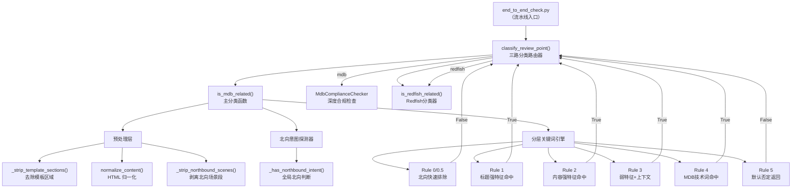
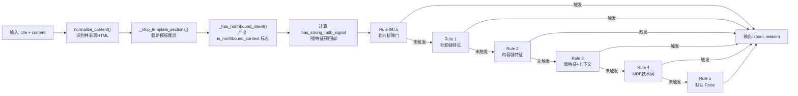

# MDB 内容分类：帖子相关性判断器

## 项目定位与核心价值

### 诞生背景与解决的痛点

在 openUBMC 论坛的 Interface SIG 评审流程中，机器人需要对每一篇进入的评审帖做出一个关键的前置决策：**这篇帖子究竟是 MDB 资源协作接口的评审，还是 Redfish 北向接口的评审，抑或与技术接口完全无关？** 这个判断直接决定了后续将调用哪条校验流水线。

错误的分类代价极高。若将一篇北向 Redfish 评审帖误分类为 MDB，则会驱动 `MdbComplianceChecker` 对其进行 MDB 规则核查，产生大量无意义的误报；反之，若将一篇真正的 MDB 资源协作接口评审帖漏判，则它将完全跳过合规检查，成为监管盲区。更糟糕的是，论坛帖子本身具有高度的内容混杂性——同一篇帖子中可能同时出现 `bmc.kepler` 路径引用（MDB 特征）和 `/redfish/v1/` URI（Redfish 特征），单纯的关键词匹配极易在这类混合文本中翻车。

`mdb_classifier.py` 正是为解决这一前置路由问题而生。该模块从原始的 `mdb_interface_compliance_check` 项目移植而来，在移植过程中被重新设计为一个**纯函数式、无副作用、可独立测试的分类引擎**，以便嵌入到更大的 `end_to_end_check.py` 检查流水线中使用。

### 核心特性展开

该分类器的核心设计哲学是**分层证据权重体系**（Layered Evidence Weighting）。它并非简单的关键词命中即返回，而是将所有判断依据按照**信号强度**划分为四个层级：强特征关键词（`_MDB_STRONG_KEYWORDS`）、需上下文验证的弱特征词（`_MDB_WEAK_KEYWORDS`）、MDB 专有技术词（`_MDB_TECHNICAL_KEYWORDS`），以及用于排除的 Redfish 反向信号词（`_REDFISH_EXCLUDE_KEYWORDS`）。每一层命中的含义和置信度不同，触发条件也不同。这种分层设计将分类器从脆弱的布尔匹配升级为具有语义感知能力的判断引擎。

另一个值得关注的特性是**北向接口优先排除（Northbound-First Exclusion）**机制。分类器在任何肯定性判断之前，率先执行两条否定性规则（Rule 0 和 Rule 0.5），专门针对那些以北向接口（IPMI、WebREST、Redfish）为主题的评审点进行提前剔除。这体现了一种防御性分类（Defensive Classification）思路——在嘈杂输入中，明确拒绝比模糊接受更为安全。此外，分类器还内置了 HTML 归一化预处理能力（`normalize_content`），能够自动识别并剥离帖子中的 HTML 标签，确保关键词匹配始终在纯文本层面进行，彻底消除富文本格式对匹配结果的干扰。

Sources: [mdb_classifier.py](src/ForumBot/MdbValidation/mdb_classifier.py#L1-L60), [end_to_end_check.py](src/ForumBot/SchemaValidation/end_to_end_check.py#L191-L239)

---

## 架构设计与模块划分

### 模块拓扑图



### 各层/模块职责解析

**预处理层（Preprocessing Layer）**

该层由三个独立的文本清洗函数组成，是分类器可靠运行的基础保障。

- `normalize_content()` 是对外暴露的统一归一化入口。它调用 `looks_like_html()` 进行启发式 HTML 检测（检测 `<p>`、`<div>`、`<br>`、HTML 实体等特征标记），若判断为 HTML，则驱动 `_HTMLStripper` 进行结构感知的去标签处理——`_HTMLStripper` 继承自标准库 `HTMLParser`，并通过重写 `handle_starttag` / `handle_endtag` 在块级标签（div、p、li、table 等）边界处插入换行符，保留了文本的逻辑段落结构，避免去标签后内容粘连。

- `_strip_template_sections()` 负责去除帖子底部的固定模板区域。论坛评审帖通常以"评审结论"和"遗留问题"两个固定章节结尾，这两个区域的内容是复制自模板的通用文字，而非作者实际撰写的技术内容。若不剥除这部分，模板中可能出现的"资源协作"等词汇会产生假阳性。

- `_strip_northbound_scenes()` 的粒度更精细，它在评审点内容层面扫描以"场景 N："开头的段落，若该场景段落同时包含北向接口关键词，则将整个场景段落剔除。这处理了"一个评审点同时描述多个场景，其中部分场景是北向接口"的混合文本情形。

Sources: [mdb_classifier.py](src/ForumBot/MdbValidation/mdb_classifier.py#L66-L188)

**北向意图探测器（Northbound Intent Detector）**

`_has_northbound_intent()` 函数是分层判断的先行侦察。它在正式的 MDB 相关性评分之前，独立地对整篇评审内容进行北向接口意图评估，并将评估结果（`is_northbound_context`）作为上下文标志传递给后续各规则层，用于抑制在北向上下文中出现的 MDB 相关词汇。

该函数的判断逻辑具有明确的优先级：首先，若内容含有"资源协作"则直接判否（MDB 协同标记的存在说明这不是纯北向帖子）；其次，若标题包含北向关键词则判是；再次，若内容中出现两个或以上北向关键词，或出现 `/redfish/v1/`、`/ui/rest/` 这类北向 URI 特征路径，则判是。这种多重证据设计使得单一词汇出现不足以触发北向判定，有效降低了误判率。

Sources: [mdb_classifier.py](src/ForumBot/MdbValidation/mdb_classifier.py#L98-L119)

**分层关键词引擎（Layered Keyword Engine）**

这是 `is_mdb_related()` 函数的核心决策树，由五层按序执行的规则构成，具有短路求值语义——任意规则命中即立刻返回，不再执行后续规则。

| 规则编号 | 名称 | 触发条件 | 返回值 |
|---------|------|---------|--------|
| Rule 0 | 北向标题快速排除 | 标题含北向关键词且不含"资源协作"，且无强 MDB 信号 | `(False, 原因)` |
| Rule 0.5 | 北向主语快速排除 | 标题前30字符以 redfish/webrest/ui/rest 开头，且无强 MDB 信号和 MDB 主动短语 | `(False, 原因)` |
| Rule 1 | 标题强特征命中 | 标题含 `_MDB_STRONG_KEYWORDS`（附加：内容纯北向URI且无bmc.kepler时仍排除） | `(True, 原因)` |
| Rule 2 | 内容强特征命中 | 技术内容含 `_MDB_STRONG_KEYWORDS`（`bmc.kepler` 在北向上下文中受抑制） | `(True, 原因)` |
| Rule 3 | 弱特征+上下文 | 内容含弱特征词且内容前半段出现 `bmc.kepler` 或标题含 `bmc.`（排除纯北向上下文） | `(True, 原因)` |
| Rule 4 | MDB 技术词命中 | 内容含 `_MDB_TECHNICAL_KEYWORDS`，且非北向上下文，且无 Redfish 排除词 | `(True, 原因)` |
| Rule 5 | 默认否定 | 前四层均未命中 | `(False, "未检测到...")` |

Sources: [mdb_classifier.py](src/ForumBot/MdbValidation/mdb_classifier.py#L194-L279)

---

## 技术栈与核心工作流

### 执行主链路

整个分类器的执行链路可以描述为：**文本归一化 → 模板剥离 → 北向意图预判 → 分层规则顺序匹配 → 返回二元判断结果（bool, reason_str）**。



### 调用方上游：`end_to_end_check.py` 的三路分类路由

`mdb_classifier.py` 对外暴露的核心接口 `is_mdb_related()` 被 `end_to_end_check.py` 通过动态 `sys.path` 注入的方式导入，并在两个位置使用：

**`is_post_relevant()`**：帖子级粗筛。先调用 `is_mdb_related()`，若 MDB 相关则直接返回 True；否则继续调用 Redfish 分类器。这实现了 MDB 优先于 Redfish 的判断顺序。

**`classify_review_point()`**：评审点级精分。对单个评审点进行三路分类，返回 `'mdb'`、`'redfish'` 或 `'other'` 字符串标签，该标签直接决定调用 `check_mdb_review_point()` 还是 Redfish 校验流水线。

```python
# end_to_end_check.py 中的三路路由核心逻辑
def classify_review_point(title: str, content: str) -> str:
    if _is_mdb_related is not None:
        mdb_related, _ = _is_mdb_related(title, content)
        if mdb_related:
            return 'mdb'                   # → MdbComplianceChecker
    if is_redfish_related(title, content):
        return 'redfish'                   # → Redfish 校验链
    return 'other'                         # → 跳过
```

Sources: [end_to_end_check.py](src/ForumBot/SchemaValidation/end_to_end_check.py#L191-L239)

### 关键词词典设计

分类器维护了四张相互独立、语义互补的关键词词典：

```python
# 强特征：几乎只出现在 MDB 帖子中，命中即高置信度
_MDB_STRONG_KEYWORDS  = ["资源协作", "interface.schema", "path.schema", "bmc.kepler"]

# 弱特征：需结合 bmc. 路径上下文才能确认
_MDB_WEAK_KEYWORDS    = ["资源树"]

# MDB 专有技术词：在 Redfish 帖子中极少出现
_MDB_TECHNICAL_KEYWORDS = ["emitsChangedSignal", "Persistency", "bmc.studio",
                            "app.json", "mdb_app", "LuaModule"]

# 排除词：出现则倾向 Redfish，抑制 MDB 技术词的触发
_REDFISH_EXCLUDE_KEYWORDS = ["redfish", "json-schema", "json schema", "odata", "@odata"]
```

这种设计避免了维护一张单一巨型词表，不同权重的词汇被隔离在各自词典中，职责清晰，也便于日后针对特定词类单独扩充。

Sources: [mdb_classifier.py](src/ForumBot/MdbValidation/mdb_classifier.py#L14-L56)

---

## 典型代码示例

### 核心函数调用示例

`is_mdb_related()` 的接口极为简洁，输入标题与内容字符串，返回 `(bool, str)` 二元组：

```python
from src.ForumBot.MdbValidation.mdb_classifier import is_mdb_related, normalize_content

# 案例 1：强特征命中
title = "新增资源协作接口属性"
content = "路径为 bmc.kepler.Systems.Storage.StorageConfig，新增属性 Enabled（类型 b）"
related, reason = is_mdb_related(title, content)
# → (True, "标题含强特征: 资源协作")

# 案例 2：北向排除
title = "Redfish接口新增属性"
content = "内部路径参考 bmc.kepler.xxx.yyy"
related, reason = is_mdb_related(title, content)
# → (False, "评审点标题以北向接口为主语: Redfish接口新增属性设计")

# 案例 3：HTML 内容归一化
raw_html = "<p>新增<strong>资源协作</strong>路径</p>"
plain = normalize_content(raw_html)  # → "新增资源协作路径"
related, reason = is_mdb_related("标题", plain)
# → (True, "内容含强特征: 资源协作")
```

### Rule 3 弱特征上下文验证的精妙设计

Rule 3 是分类器中逻辑最为复杂的规则，值得单独展示：

```python
# mdb_classifier.py L257-L268
for kw in _MDB_WEAK_KEYWORDS:          # kw = "资源树"
    if kw.lower() in tech_text_lower:
        half_len = len(tech_text_lower) // 2
        first_half = tech_text_lower[:half_len]
        # 弱特征必须与 bmc. 路径共现才能触发
        if "bmc.kepler" in first_half or "bmc." in title_lower:
            combined = title_lower + " " + tech_text_lower
            has_coop = "资源协作" in combined
            nb_in_context = any(nb in combined for nb in ["redfish", "/ui/rest/", "webrest"])
            # 北向信号存在且没有协作信号时，跳过（不判为 MDB）
            if nb_in_context and not has_coop:
                continue
            return True, f"内容含弱特征+上下文: {kw} + bmc.kepler"
```

该规则的设计核心在于**前半段锚定（First-Half Anchoring）**：仅检查技术内容的前半部分是否出现 `bmc.kepler`，而非全文。这基于一个领域假设：真正的 MDB 评审帖通常在正文前半部分即会给出接口路径，若 `bmc.kepler` 仅出现在末尾（如模板引用或补充说明），则弱特征"资源树"在缺乏上文锚定的情况下不足以构成 MDB 判定依据。

Sources: [mdb_classifier.py](src/ForumBot/MdbValidation/mdb_classifier.py#L257-L268)

---

## 学习与探索建议

### 纵向深入路径

| 方向 | 推荐源文件 | 核心问题 |
|------|-----------|---------|
| 分类结果如何驱动下游校验 | [`end_to_end_check.py`](src/ForumBot/SchemaValidation/end_to_end_check.py#L215-L280) | `classify_review_point()` 三路路由 → `check_mdb_review_point()` 调用链 |
| MDB 规则内容本身 | [`MdbRuleFiles/mdb_compliance_rules_v6.5.json`](src/ForumBot/MdbValidation/MdbRuleFiles/mdb_compliance_rules_v6.5.json) | 规则 ID、category、severity 字段结构，理解被分类后的检查目标 |
| 下游深度合规引擎 | [`mdb_checker.py`](src/ForumBot/MdbValidation/mdb_checker.py#L902-L975) | `MdbComplianceChecker.check_review_point()` 如何调用 LangChain LLM 逐规则判定 |
| 分类器全量行为验证 | [`tests/mdb_validation/test_mdb_classifier.py`](tests/mdb_validation/test_mdb_classifier.py#L125-L303) | 完整的 `TestIsMdbRelated` 测试集，覆盖所有规则分支的边界 case |
| 与 Redfish 分类器的对称关系 | [`redfish_review_workflow.py`](src/ForumBot/SchemaValidation/redfish_review_workflow.py) | 理解 MDB 分类器作为 Redfish 流水线的对称组件是如何被协调的 |

### 关键边界 Case 速查

以下是测试集中揭示的若干反直觉边界场景，对理解分类器设计意图最有价值：

- **`bmc.kepler` 在北向标题下不触发 MDB**：`Redfish新增接口属性` + 正文含 `bmc.kepler.xxx` → `False`（Rule 0.5 先行排除）
- **强 MDB 信号可以解救北向标题帖**：`支持北向接口进行内部通信管理` + 正文含 `新增资源协作路径 /bmc/kepler/...` → `True`（`has_strong_mdb_signal` 抑制了 Rule 0）
- **标题含"资源协作"但内容纯北向URI**：`资源协作接口设计` + 正文含 `/ui/rest/` 和 `/redfish/v1/`（无 `bmc.kepler`）→ `False`（Rule 1 内部的反向校验）
- **模板区域的关键词不参与判断**：正文后半段"评审结论"之后出现"资源协作"→ `False`（`_strip_template_sections` 已截断）

Sources: [test_mdb_classifier.py](tests/mdb_validation/test_mdb_classifier.py#L183-L303)

---

## 🔗 关联模块与上下游

- **直接调用方**：[`end_to_end_check.py`](src/ForumBot/SchemaValidation/end_to_end_check.py#L191-L239) — 通过动态路径注入导入，是分类器唯一的生产侧消费者
- **下游被路由目标**：[`mdb_checker.py`](src/ForumBot/MdbValidation/mdb_checker.py) — `is_mdb_related()` 返回 True 后，`MdbComplianceChecker` 接管执行深度 LLM 规则校验
- **模块公共接口**：[`MdbValidation/__init__.py`](src/ForumBot/MdbValidation/__init__.py) — 将 `is_mdb_related` 和 `MdbComplianceChecker` 统一对外导出
