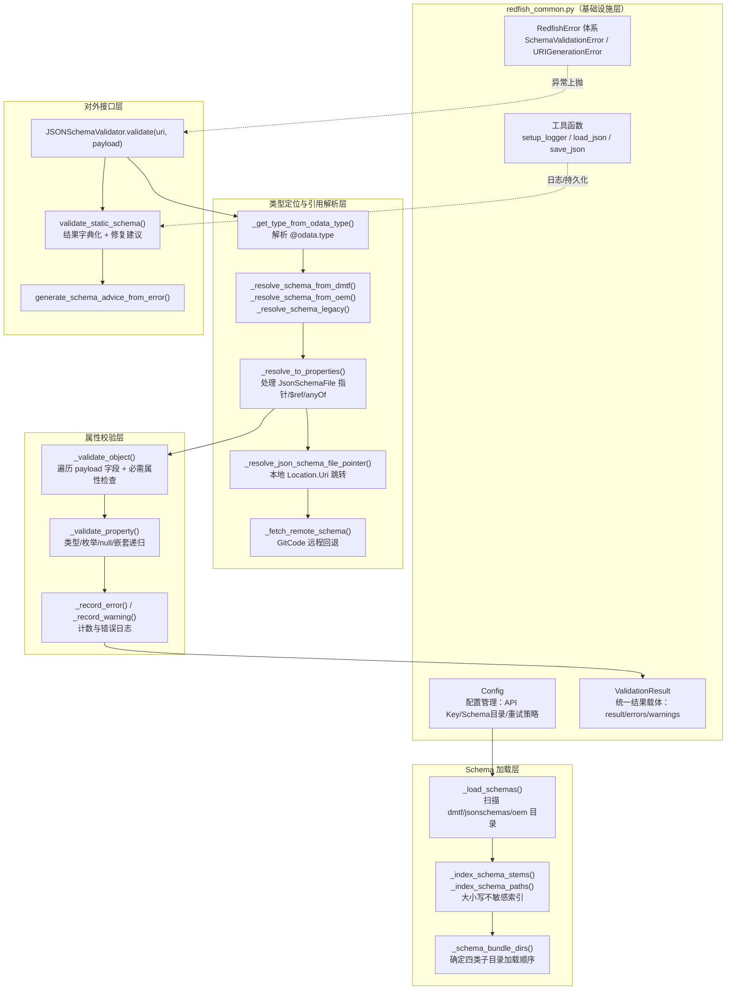

# Redfish Schema 验证：OData 属性校验引擎

## 1. 项目定位与核心价值

Redfish 是 DMTF 定义的服务器管理接口标准，其资源模型通过 JSON Schema 严格约束每个资源类型（如 `Drive`、`Chassis`、`NtpService`）应具备哪些属性、属性的数据类型、是否可为 `null`、是否必需等。在 `ForumBot` 项目的合规校验场景中，社区帖子里经常会出现开发者贴出的 Redfish 接口返回体（payload），审核者需要判断这个 payload 是否"长得像"一个合法的 Redfish 资源。`redfish_schema_validator.py` 正是为了自动化完成这件事而存在的核心引擎：给定一段 JSON payload 和一个 Schema 文件目录，它能够定位该 payload 对应的官方 DMTF Schema 与厂商（OEM，此处特指 openUBMC/rackmount）自定义 Schema，将两者的属性定义合并，然后逐字段递归比对，最终产出结构化的通过/失败/警告结果。

这一模块的设计难点不在于"如何比较两个 JSON"，而在于**如何在混乱、异构、指针层层跳转的 Redfish Schema 生态中，稳定地找到"真正可用于校验的属性定义"**。Redfish 官方 Schema 分为 `csdl`（元数据）与 `json-schema`（JSON Schema）两条线，而 JSON Schema 内部又存在大量 `JsonSchemaFile` 指针文件——这类文件本身不包含 `properties`，只是指向另一个物理文件的 `Location.Uri`。此外 openUBMC/rackmount 项目又在 DMTF 官方 Schema 之上叠加了一层 OEM 扩展 Schema，两者需要合并校验而非互相替代。`redfish_schema_validator.py` 通过分层目录约定（`dmtf/`、`rackmount/jsonschemas/`、`rackmount/oem/openubmc[/json_schema]/`）、`$ref`/`anyOf`/指针的多级解析，以及本地缺失时的 GitCode 远程回退机制，把这套复杂的资源定位逻辑封装成一个统一的 `validate(uri, payload)` 调用，使上层调用者（`end_to_end_check.py`）无需关心 Schema 到底藏在哪个文件、哪个字段里。

其核心价值可以概括为三点：第一，**来源无感的属性校验**——调用方只需传入 `@odata.type` 携带的资源类型即可，验证器自动完成 DMTF/OEM 双来源查找与合并；第二，**溯源可追踪**——每一次校验都会记录 `schema_check_meta`，明确指出这次校验实际依据的是哪个物理 Schema 文件，是本地文件还是远程 GitCode 仓库的内容，这对审核结果的可信度至关重要；第三，**优雅降级**——当 Schema 缺失、指针无法解析、或校验字段为空时，结果被标记为 `skip` 而非武断地判定失败，避免因基础设施缺陷误伤合规的 payload。

Sources: [redfish_schema_validator.py](src/ForumBot/SchemaValidation/redfish_schema_validator.py#L1-L45)

## 2. 架构设计与模块划分

`redfish_schema_validator.py` 与其配套的基础设施模块 `redfish_common.py` 共同构成"合规校验子系统"中 Schema 校验能力的底层实现。`redfish_common.py` 扮演**横切关注点提供者**的角色：它定义了全局配置类 `Config`（从 `config.yaml` 的 `schema_validation` 段加载 API Key、Schema 目录、重试策略等）、通用的日志/文件/字符串工具函数，以及贯穿整个子系统的异常体系（`RedfishError` → `SchemaValidationError` / `URIGenerationError`）和统一结果载体 `ValidationResult`。这种设计让 `redfish_schema_validator.py`、`redfish_uri_generator.py`、`redfish_checker.py` 等多个脚本可以共享同一套配置与错误处理语义，避免各脚本各写一套日志格式或结果结构。

`redfish_schema_validator.py` 本身则聚焦于**单一职责**：加载 Schema 文件、解析类型到 Schema 定义、执行属性级递归校验。其内部按照"加载 → 定位 → 解析 → 校验 → 生成建议"五个阶段组织代码，各阶段之间通过 `JSONSchemaValidator` 实例的私有方法串联，最终通过 `validate()` 和便捷函数 `validate_static_schema()` 对外暴露。



- **配置管理层（`Config`）**：`Config` 类以类属性形式承载全局状态，`configure_from_dict` 从 `config.yaml` 的 `schema_validation` 段动态覆盖默认值，包括 `SCHEMA_DIR`（Schema 文件根目录）、`DISABLE_FILE_OUTPUT`（默认禁用磁盘输出、结果全部驻留内存）、`MAX_RETRY`/`RETRY_DELAY` 等。这种"类属性即全局单例"的写法避免了在多脚本间传递配置对象的麻烦，但也意味着配置是进程级共享的，调用顺序上必须先 `configure_from_dict` 再实例化各类校验器。

  Sources: [redfish_common.py](src/ForumBot/SchemaValidation/redfish_common.py#L25-L88)

- **Schema 加载层**：`JSONSchemaValidator.__init__` 接收一个 `schema_directory` 根路径，并划分出四类子目录：`dmtf/`（DMTF 官方 Schema）、`rackmount/jsonschemas/`（指针目标等杂项）、`rackmount/oem/openubmc/` 与其 `json_schema/` 子目录（OEM 自定义，后者存在时覆盖前者）。`_load_schemas()` 会遍历这些目录下所有 `*.json`（跳过 `info.json`），将文件内容以 `stem` 为键存入 `self._schemas`，并把每个文件里的 `definitions` 汇总进 `self._definitions` 供后续 `$ref` 解析使用。`_index_schema_stems` 与 `_index_schema_paths` 分别为 DMTF 与 OEM 目录建立"小写文件名 → 实际 stem/路径"的索引，从而实现大小写不敏感查找。

  Sources: [redfish_schema_validator.py](src/ForumBot/SchemaValidation/redfish_schema_validator.py#L46-L161)

- **类型定位与引用解析层**：这是整个模块最复杂的部分。`_get_type_from_odata_type` 把 payload 中的 `@odata.type`（如 `#Drive.v1_21_0.Drive`）拆解为 `base_type`（`Drive`）与 `full_type`（`Drive.v1_21_0`）。随后 `_resolve_schema_from_dmtf` / `_resolve_schema_from_oem` / `_resolve_schema_legacy` 三个方法分别独立地在各自目录中查找匹配文件，并且都通过 `_build_schema_candidates` 构造出"带版本 → 不带版本 → Hw 前缀带版本 → Hw 前缀不带版本"的候选名序列，用来兼容 openUBMC 里常见的 `HwXxx` 命名前缀约定。找到的原始 Schema 未必直接含有 `properties`，可能是一个 `JsonSchemaFile` 指针文档（仅含 `Location`/`Schema` 字段），此时 `_resolve_to_properties` 会调用 `_resolve_json_schema_file_pointer` 沿着 `Location.Uri` 跳转到目标文件，从其 `definitions` 中取出 `Schema` 字段对应的实体定义；若本地目录中找不到跳转目标，则退化为 `_fetch_remote_schema` 向 GitCode 上的 openUBMC rackmount 仓库发起一次性 HTTPS 请求获取远程定义。整个解析链条还需处理顶层 `$ref` 与 `anyOf` 结构。

  Sources: [redfish_schema_validator.py](src/ForumBot/SchemaValidation/redfish_schema_validator.py#L177-L423), [redfish_schema_validator.py](src/ForumBot/SchemaValidation/redfish_schema_validator.py#L556-L680)

- **属性校验层**：`_validate_object` 与 `_validate_property` 构成一对相互递归的核心校验函数。`_validate_object` 遍历 payload 的每个字段，跳过 OEM 扩展（当 `no_oem=True`）与以 `@`/`#` 开头的 OData 注解字段，然后针对每个字段调用 `_validate_property` 做具体类型判定；同时检查 Schema 声明的 `required` 列表是否在 payload 中全部出现。`_validate_property` 内部处理了 `$ref` 解析、`type` 为列表时的 nullable 判定、`enum` 枚举值校验、五种基础类型（`string`/`integer`/`number`/`boolean`/`object`/`array`）的类型检查，并对 `object` 与 `array` 类型分别递归进入 `_validate_object` 或逐元素递归 `_validate_property`，从而支持任意深度的嵌套资源结构。

  Sources: [redfish_schema_validator.py](src/ForumBot/SchemaValidation/redfish_schema_validator.py#L704-L836)

- **对外接口层**：`validate(uri, payload)` 是驱动整个流程的入口方法，`validate_static_schema()` 则是面向脚本调用者的便捷封装，把 `JSONSchemaValidator` 的内部状态（错误/警告列表、计数、`schema_check_meta`）转换为标准化的结果字典，并调用 `_generate_advice_from_error` 为每条错误生成人类可读的修复建议。

  Sources: [redfish_schema_validator.py](src/ForumBot/SchemaValidation/redfish_schema_validator.py#L1055-L1194)

## 3. 技术栈与核心工作流

该模块是纯 Python 标准库实现（`json`、`pathlib`、`urllib.request`），未依赖任何第三方 JSON Schema 校验库（如 `jsonschema`），这是一个值得注意的设计选择：作者选择自行实现一套**轻量、面向 Redfish 场景定制**的递归校验器，而非引入通用 Schema 校验框架。这样做的好处是可以精确控制"跳过 OEM 属性""跳过注解字段""DMTF+OEM 合并校验"这类 Redfish 特有语义，避免通用库的泛化开销和边界情况处理成本；代价是需要自行维护类型检查、`$ref` 解析、`anyOf` 处理等本应由标准库承担的能力。

核心执行主链路可以概括为"**类型解析 → 双源定位 → 指针/引用展开 → 属性合并 → 递归校验 → 结果归约**"六个环节：

| 阶段 | 核心方法 | 职责说明 |
|---|---|---|
| 类型解析 | `_get_type_from_odata_type` | 从 payload 的 `@odata.type` 提取 `base_type` 与 `full_type`（带版本号） |
| 双源定位 | `_resolve_schema_from_dmtf` / `_resolve_schema_from_oem` | 分别在 DMTF 官方目录与 OEM 目录中查找同类型 Schema 文件，二者互不排斥、都会被查找 |
| 指针/引用展开 | `_resolve_to_properties` | 处理 `JsonSchemaFile` 指针跳转、顶层 `$ref`、`anyOf` 分支，最终得到含 `properties`/`required` 的可用 Schema |
| 属性合并 | `validate()` 内的合并逻辑 | 将 DMTF 与 OEM 两侧解析出的 `properties`/`required` 字典合并为 `merged_props`/`merged_required` |
| 递归校验 | `_validate_object` / `_validate_property` | 对 payload 逐字段执行类型/枚举/null/嵌套校验，累计 `pass/warn/fail/skip` 计数 |
| 结果归约 | `validate()` 末尾判定逻辑 | 依据计数决定最终 `result`（`pass`/`fail`/`skip`/`error`），并汇总 `validation_summary_zh` 溯源说明 |

其中"双源定位 + 属性合并"是该验证器区别于通用 JSON Schema 校验器的核心设计哲学：

> Redfish 生态中，一个资源类型的完整属性集合往往由 DMTF 官方基础定义与厂商 OEM 扩展共同构成。若只校验其中一侧，either 会因为 OEM 独有字段被误判为"未知属性"警告，either 会漏掉 DMTF 强制的必需属性检查。因此 `validate()` 方法特意设计为：只要任一侧找到 Schema 就继续，两侧都存在时合并两者的 `properties` 与 `required`，只有两侧都缺失时才整体降级为 `skip`。

Sources: [redfish_schema_validator.py](src/ForumBot/SchemaValidation/redfish_schema_validator.py#L838-L1024)

在结果状态机上，`validate()` 区分了四种终态：

| 状态 | 触发条件 | 语义 |
|---|---|---|
| `error` | payload 非 dict，或缺失 `@odata.type`，或无法提取类型名 | 输入本身不构成合法的 Redfish 资源，属于结构性错误 |
| `skip` | DMTF 与 OEM 均未找到 Schema（且 legacy 回退也失败），或解析后属性为空，或校验计数全为 0 | 基础设施缺陷（Schema 缺失/指针无法解析），不应算作合规失败 |
| `fail` | 存在至少一次属性校验失败（`_fail_count > 0`） | payload 确实违反了 Schema 约束 |
| `pass` | 有实质性校验发生且零失败 | payload 通过全部属性校验 |

这种四态设计避免了"Schema 文件缺失"与"payload 真的不合规"被混为一谈，这在合规审核场景中非常关键——审核机器人不应该因为自己的 Schema 库不完整就武断地判定用户的接口设计错误。

Sources: [redfish_schema_validator.py](src/ForumBot/SchemaValidation/redfish_schema_validator.py#L867-L1024)

## 4. 典型代码示例

以下展示了该模块在 `end_to_end_check.py` 中的典型调用方式，体现了"实例化一次、单次调用 `validate`、透传 `schema_check_meta` 溯源信息"的标准用法：

```python
from redfish_schema_validator import JSONSchemaValidator, generate_schema_advice_from_error

validator = JSONSchemaValidator(schema_dir, no_oem=False)
result = validator.validate(
    uri_sample.get("@odata.id", "/redfish/v1"),
    uri_sample
)

# result.result 可能为 pass / fail / skip / error
# validator.schema_check_meta 记录了本次校验实际依据的物理 Schema 文件来源
return {
    "result": result.result,
    "fail_count": validator.fail_count,
    "errors": validator.errors,
    "schema_check": dict(validator.schema_check_meta),
}
```

Sources: [end_to_end_check.py](src/ForumBot/SchemaValidation/end_to_end_check.py#L351-L402)

再来看内部的属性递归校验逻辑，可以看出它如何用一个统一的 `type_checks` 字典完成六种基础类型判定，同时对 `object`/`array` 做递归下钻：

```python
type_checks = {
    "string": lambda v: isinstance(v, str),
    "integer": lambda v: isinstance(v, int) and not isinstance(v, bool),
    "number": lambda v: isinstance(v, (int, float)) and not isinstance(v, bool),
    "boolean": lambda v: isinstance(v, bool),
    "object": lambda v: isinstance(v, dict),
    "array": lambda v: isinstance(v, list),
}

if prop_type in type_checks:
    if type_checks[prop_type](prop_value):
        self._pass_count += 1
    else:
        error_msg = (
            f"Property Type Error: Property '{prop_path}' is expected to be "
            f"{prop_type}, but found '{type(prop_value).__name__}'."
        )
        self._record_error("Property Type Error", error_msg, prop_path)
        return

if prop_type == "object":
    nested_schema = prop_schema.get("properties", {})
    required_props = prop_schema.get("required", [])
    self._validate_object(prop_value, nested_schema, required_props, prop_path)
elif prop_type == "array":
    items_schema = prop_schema.get("items", {})
    if items_schema and isinstance(prop_value, list):
        for i, item in enumerate(prop_value):
            self._validate_property(str(i), item, items_schema, f"{prop_path}/{i}")
```

值得注意 `integer`/`number` 的类型判定特意排除了 `bool`（`isinstance(v, int) and not isinstance(v, bool)`），这是因为 Python 中 `bool` 是 `int` 的子类，若不特殊处理，`True`/`False` 会被误判为合法的整数属性值，这是一个容易被忽视但在实际校验中很常见的边界问题。

Sources: [redfish_schema_validator.py](src/ForumBot/SchemaValidation/redfish_schema_validator.py#L769-L801)

## 5. 学习与探索建议

| 目标读者 | 建议阅读路径 | 关注点 |
|---|---|---|
| 初次接触本模块者 | 先读 `redfish_common.py` 的 `Config`/`ValidationResult` | 理解全局配置来源与统一结果结构，是后续所有校验逻辑的公共基础 |
| 想理解"Schema 到底存在哪"的开发者 | `_schema_bundle_dirs` → `_load_schemas` → `_resolve_schema_from_dmtf`/`_resolve_schema_from_oem` | 掌握 dmtf/rackmount/oem 三类子目录的加载顺序与覆盖规则 |
| 想理解指针跳转机制的开发者 | `_is_json_schema_file_pointer` → `_resolve_json_schema_file_pointer` → `_fetch_remote_schema` | 理解 `JsonSchemaFile` 指针文档的本地/远程双重解析路径 |
| 想扩展校验规则的开发者 | `_validate_property` / `_validate_object` | 这是新增字段级校验逻辑（如格式校验、正则约束）的落点 |
| 想接入上层业务的开发者 | `end_to_end_check.py` 中的 `validate_uri_sample` / `merge_schema_and_rule_results` | 理解 Schema 校验结果如何与 LLM 规则检查结果（`redfish_checker.py`）合并进最终的合规报告 |

## 🔗 关联模块与上下游

- [redfish_common.py](src/ForumBot/SchemaValidation/redfish_common.py) — 提供 `Config`、`ValidationResult`、异常体系，是本模块的直接依赖基础设施。
- [end_to_end_check.py](src/ForumBot/SchemaValidation/end_to_end_check.py) — 本模块的核心调用方，通过 `validate_uri_sample` 将 Schema 校验结果与 `redfish_checker.py` 的 LLM 规则检查结果合并为最终审核报告。
- [redfish_uri_generator.py](src/ForumBot/SchemaValidation/redfish_uri_generator.py) — 上游数据来源，通过 LLM 生成待校验的 URI 示例 payload，作为 `JSONSchemaValidator.validate()` 的输入。
