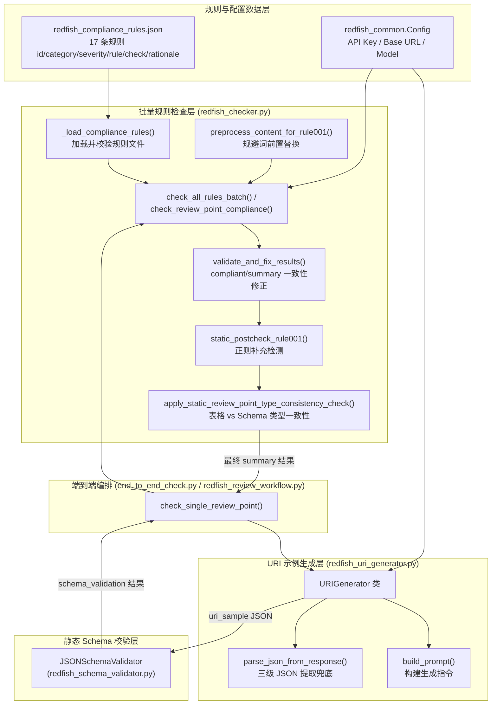

# Redfish 合规规则：LLM 批量规则检查器

## 1. 项目定位与核心价值

Redfish 是 DMTF 制定的服务器管理接口规范，覆盖属性命名、URI 结构、数据类型、枚举语义、权限标注等数十条细粒度约束。在实际论坛评审场景中，评审点（review point）往往是一段自然语言 + Markdown 表格混合的资源描述，既没有可执行的 JSON Schema，也没有现成的接口响应体可供静态校验。若要对这类"半结构化文本"做合规审查，传统的 JSON Schema 校验器无能为力——它只能校验已经成型的 JSON 数据，却无法判断一段中文描述里的属性名是否符合 PascalCase，或者一张表格里的"数据类型"列是否用了非法的中文词汇。`redfish_checker.py` 正是为解决这一痛点而生：它把 17 条 Redfish 合规规则批量打包，一次性交给 LLM 去对照评审点原文进行逐条审查，用一次 API 调用取代逐规则的多次调用，同时用正则表达式补齐 LLM 容易漏检的高频模式。

该模块的核心价值有两层。第一层是**批量化**：早期版本很可能对每条规则单独调用一次模型（文件头部注释"批量优化版"印证了这一演进），而当前实现把全部规则的 `rule`、`check`、`rationale` 拼接进同一个 prompt，通过 `format_rules_for_batch` 序列化后一次性提交，将 API 调用次数从 O(规则数) 降为 O(1)，显著降低延迟和成本。第二层是**规则职责的显式切割**：规则集中存在天然的重叠地带（比如 URI 里的大小写问题既可能被误判为 URI 结构问题，也可能被误判为命名规范问题），`redfish_checker.py` 用极其详尽的 prompt 工程（RULE-001 与 RULE-004 之间几千字的"绝对禁区"表格）在语言模型层面强行划定边界，避免同一处缺陷被多条规则重复或矛盾地判定。与之配套的 `redfish_uri_generator.py` 则承担另一半职责：把评审点描述的资源"实例化"成一份符合 Redfish 结构的 JSON 响应体示例，供后续 Schema 静态校验和规则检查使用，形成"评审点 → URI 示例 → Schema 校验 + 规则检查"的完整审计链路。

Sources: [redfish_checker.py](src/ForumBot/SchemaValidation/redfish_checker.py#L1-L26), [redfish_uri_generator.py](src/ForumBot/SchemaValidation/redfish_uri_generator.py#L1-L27)

## 2. 架构设计与模块划分

整个合规校验子系统由五个协作角色组成：规则数据源（外置 JSON）、URI 生成器、Schema 静态校验器、批量规则检查器、以及负责串联它们的端到端检测脚本。`redfish_checker.py` 与 `redfish_uri_generator.py` 是其中承担"生成"与"检查"两大职责的核心模块。



**规则数据层**：合规规则不再硬编码于 Python 中，而是外置为 `SchemaFiles/redfish_compliance_rules.json`，由 `_load_compliance_rules()` 在模块加载时读取并做结构校验（必须是非空数组，每条规则必须含 `id/rule/check` 字段，`id` 不得重复）。这一设计实现了"prompt 逻辑（代码）"与"规则内容（数据）"的解耦，规则的增删改不需要改动 Python 代码，只需维护 JSON 文件。

Sources: [redfish_checker.py](src/ForumBot/SchemaValidation/redfish_checker.py#L22-L58), [redfish_compliance_rules.json](src/ForumBot/SchemaValidation/SchemaFiles/redfish_compliance_rules.json#L1-L138)

**URI 示例生成层**：`URIGenerator` 类接收一个评审点（`title` + `content`），通过 `build_prompt()` 构造一段详细的生成指令——明确要求区分 `object`/`array`/`string`/`integer` 等类型、强调 `@odata.context`/`@odata.id`/`@odata.type` 的拼写正确性，然后调用 `ChatOpenAI` 生成 JSON 响应体示例。生成后的 JSON 会被喂给下游的 `JSONSchemaValidator` 做静态 Schema 比对，也会作为 `payload` 传入 `check_all_rules_batch()` 走"基于响应体"的规则检查路径。

Sources: [redfish_uri_generator.py](src/ForumBot/SchemaValidation/redfish_uri_generator.py#L26-L98), [redfish_uri_generator.py](src/ForumBot/SchemaValidation/redfish_uri_generator.py#L99-L154)

**批量规则检查层**：这是全文档的核心，它对外提供两条并行的检查路径——`check_all_rules_batch()`（面向 URI + payload 的传统检查）和 `check_review_point_compliance()`（面向评审点原始文本的检查，**不依赖**生成的 URI 示例）。两条路径共享同一套 `BATCH_CHECK_SYSTEM_PROMPT` / `CHECK_REVIEW_POINT_SYSTEM_PROMPT` 提示词体系、同一套结果解析与修正管线。

Sources: [redfish_checker.py](src/ForumBot/SchemaValidation/redfish_checker.py#L1214-L1250), [redfish_checker.py](src/ForumBot/SchemaValidation/redfish_checker.py#L1709-L1730)

**编排层**：`redfish_review_workflow.py` 用 `importlib.util` 动态加载 `redfish_checker.py`（而非常规 import），再由 `end_to_end_check.py` 的 `check_single_review_point()` 统一调度"生成 URI → Schema 校验 → 规则检查 → 结果合并"的完整流程。这种动态加载方式的好处是可以将 `SchemaValidation` 目录当作一个独立可执行单元，避免包路径依赖问题；代价是失去了静态类型检查与 IDE 跳转的便利。

Sources: [redfish_review_workflow.py](src/ForumBot/SchemaValidation/redfish_review_workflow.py#L1-L53), [end_to_end_check.py](src/ForumBot/SchemaValidation/end_to_end_check.py#L500-L649)

## 3. 技术栈与核心工作流

技术栈上，该子系统基于 **LangChain + ChatOpenAI**（对接 ModelScope 兼容 OpenAI 协议的模型服务）完成两类 LLM 调用：一是生成 URI 示例（`URIGenerator.generate`），二是批量规则检查（`check_all_rules_batch` / `check_review_point_compliance`）。所有 LLM 调用都通过 `record_llm_token_usage()` 记录 token 消耗，便于成本追踪。

核心链路可以概括为"生成 → 校验 → 检查 → 合并 → 静态补丁"五个阶段：

| 阶段 | 关键函数/类 | 职责 |
|------|------------|------|
| 1. URI 示例生成 | `URIGenerator.generate()` | 依据评审点描述生成符合 Redfish 结构的 JSON 响应体，内置三级 JSON 解析兜底（直接解析 → 提取代码块 → 提取首个花括号块） |
| 2. Schema 静态校验 | `JSONSchemaValidator`（外部模块） | 将生成的 JSON 与 DMTF/OEM 官方 Schema 比对，产出 `schema_validation` 结果 |
| 3. 批量规则检查 | `check_all_rules_batch()` / `check_review_point_compliance()` | 一次 LLM 调用批量核验全部规则，返回 JSON 数组形式的逐条结果 |
| 4. 结果解析与修正 | `parse_batch_check_result()`, `validate_and_fix_results()` | 解析容错（顶层数组配平提取、BOM/弯引号/尾逗号修复）、修正 `compliant` 与 `summary` 语义不一致 |
| 5. 静态补充检查 | `static_postcheck_rule001()`, `apply_static_review_point_type_consistency_check()` | 用确定性正则规则捕捉 LLM 高频漏检模式，补充/纠正 LLM 输出 |

其中第 5 阶段体现了这个模块的一个重要设计哲学：**不完全信任 LLM 的判断**。RULE-001（命名规范）历史上被证明是 LLM 最容易漏检的规则类别，因此代码用一整套正则表达式模式库（`_TABLE_TYPE_PATTERNS`、`_KNOWN_TYPOS`、`_URI_LOWERCASE_WHITELIST`、`_ABBREV_PAIRS` 等）对评审点原文做二次扫描，一旦发现表格类型列写成 `Bool`/`String`、`@odata.id` 被拼成 `@data.id`、Action 名称点号后带空格等高频错误模式，就强制把对应规则的 `compliant` 改写为 `False` 并补充具体的 `findings`/`advice`。这是一种"LLM 判断 + 规则引擎兜底"的混合校验架构，而不是单纯依赖大模型的一次性输出。

Sources: [redfish_checker.py](src/ForumBot/SchemaValidation/redfish_checker.py#L61-L212), [redfish_checker.py](src/ForumBot/SchemaValidation/redfish_checker.py#L515-L658), [redfish_checker.py](src/ForumBot/SchemaValidation/redfish_checker.py#L1012-L1058)

另一个值得展开的设计点是**规则职责的显式边界化**。RULE-001（命名规范）与 RULE-004（URI 资源连通性）在语义上极易混淆——两者都可能"看到"同一个 URI 字符串。`BATCH_CHECK_SYSTEM_PROMPT` 中专门用一张对照表格反复强调"RULE-004 只检查格式结构问题（缺少 v1 层级、分隔符错误），绝不检查大小写/复数/拼写"，并给出大量"新增资源豁免"判例（含"新增""添加""扩展"等关键词触发豁免）。这种做法本质上是把领域专家的判断规则以自然语言约束的形式编码进 prompt，属于 LLM 时代特有的"规则工程"而非传统代码逻辑，理解这部分内容对于后续维护规则集、新增规则类别至关重要。

Sources: [redfish_checker.py](src/ForumBot/SchemaValidation/redfish_checker.py#L753-L845)

RULE-001 还有一个更细节的处理：某些历史遗留的"规避词"（如 `SubsystemVenderID`、`Smnp`、`openUBMC`）在规范上属于允许例外，但如果直接把原文交给 LLM，模型可能仍会误判为拼写错误。为此代码在送入 LLM 前先用 `preprocess_content_for_rule001()` 把这些词替换为规范写法（`openUBMC` 替换为占位符 `XopenUBMCPlaceholderX` 以避免与其他替换规则冲突），检查完成后再用 `postprocess_results_for_rule001()` 把占位符还原。这是一种"预处理屏蔽已知误报源，事后还原原始措辞"的工程技巧，避免了在 prompt 里堆砌更多例外说明。

Sources: [redfish_checker.py](src/ForumBot/SchemaValidation/redfish_checker.py#L61-L87), [redfish_checker.py](src/ForumBot/SchemaValidation/redfish_checker.py#L1735-L1737), [redfish_checker.py](src/ForumBot/SchemaValidation/redfish_checker.py#L1796-L1797)

## 4. 典型代码示例

### 4.1 批量规则检查的调用入口

`check_review_point_compliance()` 是面向纯文本评审点的检查入口，不依赖 URI 示例，是"评审点内容合规性"这条检查链路的核心：

```python
def check_review_point_compliance(
    rules: List[Dict],
    review_point_title: str,
    review_point_content: str,
    model: str = None,
    save_result: bool = False,
    topic_id: Optional[str] = None,
) -> Dict:
    # RULE-001 前置替换：将已知规避词替换为规范写法，仅影响送入 LLM 的副本
    llm_title = preprocess_content_for_rule001(review_point_title)
    llm_content = preprocess_content_for_rule001(review_point_content)

    rules_text = format_rules_for_batch(rules)
    llm = create_llm(model=model, temperature=0.1)
    # 直接拼接完整 prompt 字符串，规避 ChatPromptTemplate 对 {} 的占位符解析冲突
    full_prompt = CHECK_REVIEW_POINT_SYSTEM_PROMPT + "..." + rules_text + "..." + str(llm_content)

    response_message = llm.invoke(full_prompt)
    record_llm_token_usage(topic_id, response_message, source="pre_audit.redfish_review_point_check")
    results = parse_batch_check_result(response_message.content, rules)

    results = postprocess_results_for_rule001(results)
    results = validate_and_fix_results(results, rules)
    results = static_postcheck_rule001(results, review_point_title, review_point_content)
    ...
```

这里有一个容易被忽视但很关键的实现细节：prompt 是通过普通字符串拼接（`+`）而非 `ChatPromptTemplate.format()` 构造的。注释明确写道这是为了"避免 ChatPromptTemplate 的占位符解析问题"——因为规则文本和评审点内容中本身包含大量花括号（JSON 示例、正则片段），如果走模板引擎的占位符替换逻辑，会与这些花括号发生解析冲突。`format_rules_for_batch()` 内部也对规则文本做了 `{` → `{{`、`}` → `}}` 的转义，这是与该问题配套的处理。

Sources: [redfish_checker.py](src/ForumBot/SchemaValidation/redfish_checker.py#L1709-L1803), [redfish_checker.py](src/ForumBot/SchemaValidation/redfish_checker.py#L987-L1009)

### 4.2 URI 生成的三级 JSON 解析兜底

LLM 输出不总是干净的 JSON，`parse_json_from_response()` 依次尝试三种提取策略：

```python
def parse_json_from_response(self, response: str) -> Optional[Dict[str, Any]]:
    try:
        return json.loads(response)          # 策略1：直接解析
    except json.JSONDecodeError:
        pass
    json_match = re.search(r'```(?:json)?\s*(\{.*?\})\s*```', response, re.DOTALL)
    if json_match:                            # 策略2：提取 markdown 代码块
        try:
            return json.loads(json_match.group(1))
        except json.JSONDecodeError:
            pass
    brace_match = re.search(r'\{[^{}]*(?:\{[^{}]*\}[^{}]*)*\}', response, re.DOTALL)
    if brace_match:                           # 策略3：提取首个花括号包围块（支持一层嵌套）
        try:
            return json.loads(brace_match.group(0))
        except json.JSONDecodeError:
            pass
    return None
```

`redfish_checker.py` 中的 `extract_top_level_json_array()` 则实现了更严谨的版本——通过维护括号深度和字符串引号状态逐字符扫描，找到与首个 `[` 精确配平的顶层数组子串，避免简单的 `rfind` 在嵌套 JSON 场景下截断失败。两者共同体现了这个系统对"LLM 输出不可信"这一现实的工程化应对。

Sources: [redfish_uri_generator.py](src/ForumBot/SchemaValidation/redfish_uri_generator.py#L156-L188), [redfish_checker.py](src/ForumBot/SchemaValidation/redfish_checker.py#L1012-L1041)

### 4.3 表格类型与 Schema 类型的静态一致性核查

`collect_static_review_point_type_mismatch_errors()` 是一段完全不依赖 LLM 的确定性检查逻辑，分别从评审点文本中提取"表格声明的属性类型"（`_extract_table_type_map`，同时支持 Markdown 表格与 HTML `<table>`）和"内嵌 JSON Schema 声明的属性类型"（`_extract_schema_type_map`），做同名属性的类型比对，一旦发现不一致（如表格写 `integer` 但 Schema 写 `string`）即生成一条 `RULE-010` 违规记录，追加进最终结果的 `error_details.STATIC_VALIDATION`。这是典型的"规则引擎补充 LLM 语义理解不足"的例子——类型比对属于结构化字符串匹配问题，用正则和字典查找比让 LLM 从头到尾读表格更可靠、更省 token。

Sources: [redfish_checker.py](src/ForumBot/SchemaValidation/redfish_checker.py#L261-L512)

## 5. 学习与探索建议

| 目标 | 建议阅读路径 |
|------|------------|
| 理解规则集的完整语义边界 | 先读 `SchemaFiles/redfish_compliance_rules.json` 全部 17 条规则的 `check` 字段，再对照 `redfish_checker.py` 中 `BATCH_CHECK_SYSTEM_PROMPT`/`CHECK_REVIEW_POINT_SYSTEM_PROMPT` 里对应规则的补充说明，二者是"数据"与"提示词强化"的两层叠加 |
| 理解 URI 生成如何衔接后续校验 | 跟踪 `URIGenerator.generate()` 的返回值如何被 `end_to_end_check.py` 的 `check_single_review_point()` 传入 `validate_uri_sample()`（Schema 校验）与 `check_all_rules()`（规则检查） |
| 排查 LLM 输出解析失败问题 | 重点看 `parse_batch_check_result()` → `_try_parse_rule_results()` → `repair_json_text()` 这条容错链，理解 BOM/弯引号/尾逗号的修复逻辑 |
| 扩展一条新规则 | 在 `redfish_compliance_rules.json` 追加规则对象（含 `id/category/severity/rule/check/rationale`），若该规则存在与既有规则的语义重叠，需在 prompt 中补充类似 RULE-001/RULE-004 的职责边界说明，并考虑是否需要在 `static_postcheck_*` 中加正则兜底 |
| 理解静态规则引擎与 LLM 判断的分工 | 对比 `static_postcheck_rule001()`（RULE-001 静态补丁）与 `collect_static_review_point_type_mismatch_errors()`（RULE-010 静态补丁）两套确定性检查，体会"哪些问题适合交给正则，哪些必须依赖语言模型语义理解" |

## 🔗 关联模块与上下游

- [redfish_common.py](src/ForumBot/SchemaValidation/redfish_common.py) — 提供 `Config`（API Key/Base URL/Model 配置来源）、`save_json`、异常类 `URIGenerationError`，是 `redfish_checker.py` 与 `redfish_uri_generator.py` 共同依赖的基础设施层。
- [redfish_review_workflow.py](src/ForumBot/SchemaValidation/redfish_review_workflow.py) — 通过 `importlib` 动态加载 `redfish_checker.py`，向上层 `end_to_end_check.py` 转发 `check_review_point_compliance`、`check_all_rules` 等接口，是本模块对外暴露的唯一正式入口。
- [end_to_end_check.py](src/ForumBot/SchemaValidation/end_to_end_check.py) — 端到端编排脚本，在 `check_single_review_point()` 中依次调用 `URIGenerator`、`JSONSchemaValidator`（`redfish_schema_validator.py`）与本文档描述的批量规则检查器，并将三者结果合并为最终审查报告。
- [llm_token_usage.py](src/ForumBot/llm_token_usage.py) — 每次 LLM 调用后由 `record_llm_token_usage()` 记录 token 消耗，串联进全局的 `token_tracker`。
