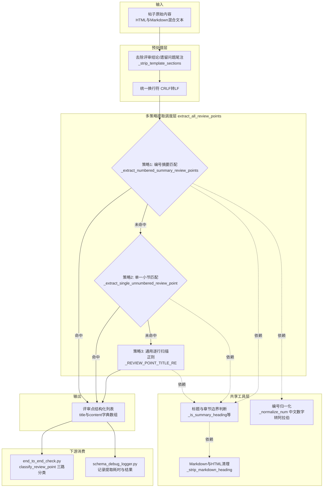

## 项目定位与核心价值

在 Redfish/MDB 合规校验流水线中，最先要解决的并非"如何校验"，而是"从哪里校验"。论坛帖子作为设计评审的载体，其内容形态极其自由：有人用 Markdown 标题写评审点，有人用粗体加冒号，有人先列一份编号摘要再在下方展开详细描述，甚至混杂着 HTML 标签、模板化的"评审结论"和"遗留问题"尾注。如果校验流水线直接对整篇帖子文本做规则检查，会把背景介绍、遗留问题讨论都当成待审查内容，产生大量误报和噪音。`extract_reviews.py` 承担的正是这个"结构化切分"的前置职责：把一篇非结构化的自然语言帖子，解析成一组语义完整的 `{"title": "评审点N：xxx", "content": "正文"}` 字典列表，供后续的 Redfish/MDB 分类器和规则引擎逐一处理。

该模块的注释明确标注"移植自 mdb_interface 项目"，并强调了一个关键的架构决策：**提取与分类解耦**。早期版本可能在提取阶段就顺带做了 Redfish 相关性过滤，但当前版本的 `extract_all_review_points` 只负责识别评审点的边界并切分文本，不做任何领域相关性判断；`is_redfish_related` 被保留为一个独立的纯关键词匹配函数，真正的三路分类（MDB / Redfish / 其他）交给 `end_to_end_check.py` 中的 `classify_review_point` 完成。这种分层使得提取逻辑可以独立于业务分类规则演进——无论未来新增多少种业务类型的评审点，文本切分算法本身不需要改动。为了保证这套复杂的正则和状态机在生产环境中可追溯、可回放，`schema_debug_logger.py` 提供了一套轻量级的中间产物记录机制，把每个 topic 处理过程中"提取到了哪些评审点""过滤后哪些归为 Redfish/非 Redfish""每一步耗时多少"等数据写入 PostgreSQL 的 `schema_debug_logs` 表，作为试运行阶段排查提取准确率问题的第一手证据。

Sources: [extract_reviews.py](src/ForumBot/SchemaValidation/extract_reviews.py#L1-L5), [end_to_end_check.py](src/ForumBot/SchemaValidation/end_to_end_check.py#L229-L239), [schema_debug_logger.py](src/ForumBot/SchemaValidation/schema_debug_logger.py#L1-L9)

## 架构设计与模块划分

`extract_reviews.py` 内部并非单一算法，而是一条**按优先级尝试的多策略提取管道**：先尝试结构最规整的"编号摘要 + 详细描述"双段匹配，失败则退化到"单一评审点小节"匹配，最后兜底为逐行扫描的通用正则匹配。三种策略共享一套正则常量和辅助工具函数（标题清理、章节边界判断、编号归一化等），形成了"工具函数层 → 专用提取策略层 → 主调度函数层"的三层结构。



**预处理层**首先调用 `_strip_template_sections`，在文本中查找"评审结论""遗留问题"等模板化关键词并截断其后的内容，避免这些收尾性文字被误判为评审点正文。随后统一处理 Windows/Mac 风格的换行符，确保后续所有基于行的正则匹配行为一致。

Sources: [extract_reviews.py](src/ForumBot/SchemaValidation/extract_reviews.py#L73-L79), [extract_reviews.py](src/ForumBot/SchemaValidation/extract_reviews.py#L444-L445)

**策略调度层**是 `extract_all_review_points` 函数体现的核心设计哲学：按"结构确定性"从高到低尝试三种提取方式，一旦某个策略命中非空结果就立即返回，不再继续尝试后续策略。这种"短路优先级链"避免了不同策略之间产生冲突或重复提取，同时保证了对结构化程度较高的帖子能优先走精确匹配路径。

第一策略 `_extract_numbered_summary_review_points` 针对的是形如"## 评审点\n1. xxx\n2. yyy"的摘要列表格式：它先定位到"评审点"标题所在的章节，然后逐行匹配 `_NUMBERED_ITEM_RE`（阿拉伯数字或中文数字 + 顿号/点号），把每一项收编为一个候选评审点，并记录该摘要小节内跟随的补充说明作为初始 content。真正的正文内容则由配套的 `_collect_detail_sections` 从后续的"详细描述"章节中按编号提取，通过 `_normalize_num` 把中文数字（一二三...）与阿拉伯数字统一映射后再做 key 匹配合并；如果详细描述区域没有按编号切分小节（即只有一段共享文字），则退化为 `_collect_shared_detail_content` 把整个详细描述区域作为所有评审点共享的补充内容。

第二策略 `_extract_single_unnumbered_review_point` 处理的是"帖子里只有一个评审点，且连编号都省略"的最简形态：如果检测到详细描述区域内并没有出现任何形如"评审点N"的子标题（通过 `_detail_contains_review_point_titles` 判断），就把整段摘要和详细描述拼接成单一评审点，标题取自摘要首行（超过 80 字符会截断并加省略号）。

第三策略是兜底的逐行状态机扫描：以 `_REVIEW_POINT_TITLE_RE`（匹配"评审点1：""决策点2、""review point 3."等各种编号+分隔符组合）或 `_UNNUMBERED_REVIEW_POINT_RE`（匹配无编号的"评审点：标题"格式）逐行探测标题起点，一旦命中且该行确实是"标题起始行"（以 `#`、`**`、"评审点"、`<h` 等标志开头），便持续吞入后续行直到遇到下一个评审点标题、遇到二级以下标题、遇到章节分隔符（`_is_section_break`）或遇到三个以上连字符的分隔线为止，构成该评审点的正文区间。

Sources: [extract_reviews.py](src/ForumBot/SchemaValidation/extract_reviews.py#L183-L260), [extract_reviews.py](src/ForumBot/SchemaValidation/extract_reviews.py#L289-L336), [extract_reviews.py](src/ForumBot/SchemaValidation/extract_reviews.py#L359-L424), [extract_reviews.py](src/ForumBot/SchemaValidation/extract_reviews.py#L430-L516)

**共享工具层**是三种策略共用的基础设施，体现了模块对"章节语义"的统一建模：`_is_summary_heading` 和 `_is_detail_heading` 分别识别"评审点摘要"标题与"详细描述"标题的多种措辞变体（中英文、带 Markdown 标记与否）；`_is_section_break` 依赖一个预先枚举的章节名集合 `_SECTION_BREAKS`（背景、整体方案、评审依据、遗留问题等），用于判断当前是否已经越过了评审点内容的边界，是所有提取路径通用的"止损阀"；`_strip_markdown_heading` 则统一清理标题装饰符（`#`、`>`、HTML 标签、空链接、粗体标记），把带格式的标题还原为纯文本，供正则匹配和展示使用。

Sources: [extract_reviews.py](src/ForumBot/SchemaValidation/extract_reviews.py#L82-L136), [extract_reviews.py](src/ForumBot/SchemaValidation/extract_reviews.py#L33-L60)

## 技术栈与核心工作流

从执行链路看，评审点提取处于整个端到端检测流程的第二环节：**帖子相关性判断 → 评审点提取 → 评审点分类 → 逐点合规校验**。`end_to_end_check.py` 通过 `importlib.util.spec_from_file_location` 动态加载 `extract_reviews.py`（而非常规 import），这是该子系统内多个模块共用的加载方式，目的是避免 SchemaValidation 目录内部模块相互引用时产生包路径歧义。加载后暴露出的 `extract_all_review_points`（新接口）与 `extract_review_points_from_html`（向后兼容接口，内部直接转发到前者）、`is_redfish_related` 三个符号被绑定到 `end_to_end_check` 模块级变量，供 `process_post` 主流程调用。

| 环节 | 承担函数 | 职责说明 |
|---|---|---|
| 帖子级相关性判断 | `is_post_relevant` (end_to_end_check.py) | 判断整篇帖子是否与 MDB 或 Redfish 相关，不相关则跳过提取，节省算力 |
| 评审点提取 | `extract_all_review_points` (extract_reviews.py) | 本文档核心：把帖子正文切分为若干 `{title, content}` 评审点 |
| 评审点分类 | `classify_review_point` (end_to_end_check.py) | 对每个评审点做 MDB/Redfish/其他三路分类，复用 `is_redfish_related` |
| 逐点合规校验 | `check_single_review_point` / `check_mdb_review_point` | 针对分类结果分别调用 Schema 校验器或 MDB 校验器 |
| 过程可观测性 | `DebugRecordBuilder` (schema_debug_logger.py) | 记录提取结果、分类结果、每个评审点检查的中间数据与耗时 |

`process_post` 函数中 `debug_record.set_review_points(review_points, duration)` 这一行调用，直接把 `extract_all_review_points` 返回的完整列表和耗时记录下来；紧接着 `debug_record.set_filter_result(redfish_points, other_points, ...)` 记录分类结果。这两处调用共同构成了提取环节的可观测性锚点——当线上出现提取遗漏或误分类问题时，可以直接从 `schema_debug_logs` 表的 JSONB 字段中回放 `steps.extract_review_points.review_points` 数组，逐条比对提取结果与原文。

Sources: [end_to_end_check.py](src/ForumBot/SchemaValidation/end_to_end_check.py#L183-L189), [end_to_end_check.py](src/ForumBot/SchemaValidation/end_to_end_check.py#L1014-L1048)

`DebugRecordBuilder` 本身是一个"累加器 + 上下文管理器"模式的实现：构造时初始化一份带 `steps` 嵌套结构的字典骨架（`redfish_relevance` / `extract_review_points` / `filter_review_points` / `check_review_points` 四个槽位），处理过程中通过 `set_relevance`、`set_review_points`、`set_filter_result`、`add_review_point_check` 等方法逐步填充；退出 `with` 块时无论是否异常都会自动调用 `finalize`，把异常信息也记录进 `error` 字段后写入数据库。其设计哲学是**永不因调试记录而影响主流程**——`write_debug_record` 内部所有异常都被捕获并降级为 warning 日志，数据库不可达时 `init_debug_logger` 会静默将 `_disabled` 置为 `True`，后续所有写入调用直接短路返回。这种"旁路可观测性不侵入主链路"的设计，使得该 debug 系统可以安全地在生产环境按需开关（由 `config['pre_audit']['readiness_field']` 是否非空控制）。

Sources: [schema_debug_logger.py](src/ForumBot/SchemaValidation/schema_debug_logger.py#L31-L64), [schema_debug_logger.py](src/ForumBot/SchemaValidation/schema_debug_logger.py#L143-L259), [end_to_end_check.py](src/ForumBot/SchemaValidation/end_to_end_check.py#L1242-L1245)

## 典型代码示例

以下是 `extract_all_review_points` 的调度主体，直观展示了"三级策略短路优先"的实现方式：

```python
def extract_all_review_points(content):
    content = _strip_template_sections(content)
    content = content.replace("\r\n", "\n").replace("\r", "\n")

    # 优先尝试编号摘要+详细描述匹配
    numbered_summary_points = _extract_numbered_summary_review_points(content)
    if numbered_summary_points:
        return numbered_summary_points

    single_unnumbered_point = _extract_single_unnumbered_review_point(content)
    if single_unnumbered_point:
        return single_unnumbered_point

    # 常规评审点提取（支持编号和无编号格式）
    lines = content.split("\n")
    points = []
    # ... 逐行状态机扫描 ...
    return points
```

配套的调试记录写法（在 `run_schema_check` 中）展示了 debug builder 如何以上下文管理器包裹整个处理链路，即便发生异常也能保证记录被落盘：

```python
with DebugRecordBuilder(topic_id, title) as debug_record:
    result = process_post(
        title=title,
        content=user_question,
        ...
        debug_record=debug_record if _debug_enabled else None,
        config=config,
    )
    debug_record.finalize(
        final_result_preview=result.get('final_result', '')[:500],
        overall_pass=overall_pass
    )
```

Sources: [extract_reviews.py](src/ForumBot/SchemaValidation/extract_reviews.py#L430-L456), [end_to_end_check.py](src/ForumBot/SchemaValidation/end_to_end_check.py#L1250-L1276)

## 学习与探索建议

| 目标 | 建议阅读路径 |
|---|---|
| 理解评审点提取的正则细节 | 精读 `extract_reviews.py` 中 `_REVIEW_POINT_TITLE_RE`、`_NUMBERED_ITEM_RE` 等正则常量定义（文件头部 L10-L60），配合三种策略函数逐行跟踪一份真实帖子文本 |
| 理解提取结果如何被消费 | 追踪 `end_to_end_check.py` 的 `process_post` 函数，重点看 `extract_all_review_points` 调用后紧跟的 `classify_review_point` 三路分类逻辑 |
| 理解 MDB / Redfish 分类边界 | 参考 `MdbValidation/mdb_classifier.py` 中 `is_mdb_related` 的实现，与本模块的 `is_redfish_related` 形成对照 |
| 排查线上提取异常 | 查询 PostgreSQL `schema_debug_logs` 表，按 `topic_id` 过滤，检视 JSONB 字段 `record->'steps'->'extract_review_points'` |
| 理解 Schema/URI 后续校验 | 顺着 `check_single_review_point` 深入 `redfish_uri_generator.py`（URI 示例生成）与 `redfish_schema_validator.py`（Schema 静态校验） |

## 🔗 关联模块与上下游

- [end_to_end_check.py](src/ForumBot/SchemaValidation/end_to_end_check.py) — 动态加载本模块并驱动 `process_post` 主流程，是评审点提取结果的直接消费者
- [redfish_review_workflow.py](src/ForumBot/SchemaValidation/redfish_review_workflow.py) — 承接分类后的 Redfish 评审点，进行规则合规性检查
- [MdbValidation/mdb_classifier.py](src/ForumBot/MdbValidation/mdb_classifier.py) — 与本模块的 `is_redfish_related` 并列，构成三路分类的另一支判定逻辑
