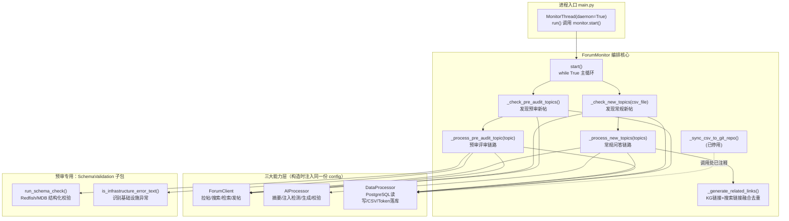

## 项目定位与核心价值

`ForumMonitor`（`src/ForumBot/monitor.py`）是 forum-reply-robot 服务的**编排核心**，它把整个自动回复系统的能力层（论坛客户端、大模型处理器、数据处理器、Schema 校验引擎）粘合成一条可以永续运行的后台轮询任务。整个 forum-reply-robot 项目的诞生背景，是社区论坛人工运营团队无法及时消化海量技术提问和资料合规审查请求——运营需要一个能 7x24 不间断巡检新帖、理解问题语义、检索知识库、生成有依据的回答并自动发帖的系统，同时又不能牺牲内容质量与安全性（避免误发、避免被提示词注入攻击操纵、避免把服务异常当成正式回答发出去）。`ForumMonitor` 正是承担这一“无人值守巡检 + 决策 + 执行”职责的中枢：它本身不直接实现搜索、大模型调用或数据库访问的细节，而是持有 `ForumClient`、`AIProcessor`、`DataProcessor` 三个能力层的实例，在一个不停歇的 `while True` 循环里按固定节拍调度它们，将“发现新帖 → 判断意图 → 检索证据 → 生成回答 → 质量把关 → 发帖 → 落库”这条链路编织成一个具备强容错能力的状态机。

该模块的核心价值体现在两个维度上。第一是**双链路解耦设计**：常规问答链路（`_check_new_topics` → `_process_new_topics`）面向普通技术提问，走“摘要 - 搜索 - 检索 - 生成 - 校验”的完整 RAG 流程；预审链路（`_check_pre_audit_topics` → `_process_pre_audit_topic`）面向 Redfish/MDB 规范合规评审场景，完全绕开检索与生成式问答，直接调用结构化 Schema 校验引擎产出评审报告。两条链路共享同一个轮询节拍与同一套异常处理哲学，但业务语义、触发条件（标签/类别路径）和产出物（自由文本回答 vs 结构化评审报告）截然不同，`ForumMonitor` 通过方法级别的拆分而不是继承或策略模式来实现这种解耦，体现了“过程式编排优先于抽象设计”的工程取向——在这种高度依赖外部系统、失败模式繁多的胶水服务里，清晰直白的顺序代码比精巧的抽象更容易排障。第二是**以数据库为权威的幂等保障与逐帖容错**：每一轮巡检都以 `forum_topics` / `pre_audit_topics` 表中已记录的 topic_id 集合为基准做增量发现，任意一帖处理失败都被局部 `try/except` 兜底后 `continue`，绝不会因为单帖异常（大模型超时、检索失败、发帖 API 出错）而让整轮巡检甚至整个后台线程崩溃。

Sources: [monitor.py](src/ForumBot/monitor.py#L44-L82), [CLAUDE.md](CLAUDE.md#L7-L27)

## 架构设计与模块划分

`ForumMonitor` 处于整个应用调用链的编排层，向下依赖三大能力层，向上被 `main.py` 中的守护线程驱动。其内部又可以拆分为“主循环调度”“常规问答处理”“预审处理”“辅助工具（链接生成、Git 同步）”四个职责区块。



**主循环调度层（`start`）**：这是整个模块唯一暴露给外部（`MonitorThread`）的入口方法，职责仅有三件事：读取轮询间隔配置、无限循环、按顺序调用两条链路的“发现”方法并在循环体外层兜底所有非中断异常。它不关心具体的业务细节，只保证节拍稳定和异常不会击穿循环边界。

**常规发现与处理（`_check_new_topics` / `_process_new_topics`）**：前者做增量发现——拉取数据库已有 ID 集合，与论坛全量帖子列表比对，得到新帖后拉详情、写 CSV、写库；后者是完整的 RAG 问答流水线，按顺序执行注入检测、摘要生成、站内搜索、LightRAG 文档检索、大模型生成、相关性/质量双重校验、答案摘要折叠、发帖回复、结果落库与评估样本采集。

**预审发现与处理（`_check_pre_audit_topics` / `_process_pre_audit_topic`）**：前者的发现逻辑比常规链路多了一层“标题关键字过滤”和“基于表单字段的就绪状态判断”（`parse_pre_audit_readiness`），只有作者在帖子里明确标记“是否准备好AI预审”为“是”的帖子才会进入处理；后者完全不做检索和生成式问答，直接调用 `SchemaValidation.end_to_end_check.run_schema_check` 产出结构化评审报告，并用 `is_infrastructure_error_text` 甄别出服务异常文本以拒绝发帖。

**辅助工具层（`_generate_related_links` / `_sync_csv_to_git_repo`）**：前者负责把 LightRAG 知识图谱返回的关联主题链接与站内搜索结果链接合并、去重、按优先级截断到 5 条，拼接成回复正文末尾的“相关链接”区块；后者是一套完整但已在调用处注释掉的 Git 同步逻辑（fetch → reset --hard → add → commit → push），代码仍保留在模块中，属于历史遗留但未被移除的停用功能。

Sources: [monitor.py](src/ForumBot/monitor.py#L1-L82), [monitor.py](src/ForumBot/monitor.py#L546-L706), [CLAUDE.md](CLAUDE.md#L44-L58)

## 技术栈与核心工作流

`ForumMonitor` 本身是纯 Python 逻辑，不直接依赖任何 Web 框架或 ORM；它通过构造函数注入的方式持有三个协作对象，三者共享同一份从 `config/config.yaml` 加载的配置字典，这种“显式依赖注入 + 共享配置”的模式让整个编排层在测试时可以被轻松 mock（参见 `tests/test_monitor_pre_audit.py` 中用 `ForumMonitor.__new__` 绕过 `__init__` 直接注入 mock 依赖的做法）。

| 核心组件 | 类型 | 在主链路中的角色 |
| --- | --- | --- |
| `ForumClient` | 协作对象 | 封装论坛 HTTP API：拉帖列表/详情、站内搜索、LightRAG 检索、发帖回复 |
| `AIProcessor` | 协作对象 | 封装所有大模型调用：摘要、注入检测、生成回答、相关性/质量校验、答案总结 |
| `DataProcessor` | 协作对象 | 封装 PostgreSQL 读写、CSV 落盘、token 用量与评估样本持久化 |
| `token_tracker` | 全局单例 | 跨函数调用按 topic_id 累计 prompt/completion/total token，供落库使用 |
| `run_schema_check` / `is_infrastructure_error_text` | 模块函数（`SchemaValidation`） | 预审链路的核心校验入口与基础设施异常识别器 |
| `get_evaluation_context` / `classify_question` | 模块函数（`evaluation_hooks`） | 采集检索/生成延迟与上下文，为离线评估与 Prometheus 指标提供数据 |

主循环的执行主链路可以概括为“**感知 → 判别 → 生成 → 校验 → 执行 → 持久化**”六个阶段。以常规问答链路为例：`_check_new_topics` 承担感知阶段，通过数据库权威去重找出真正的新帖；`_process_new_topics` 内部先用 `check_prompt_injection` 完成安全判别（注入攻击直接跳过），再依次调用 `summarize_text`、`search_related_topics`、`retrieve_documents_for_topic` 完成证据收集，`call_large_model` 完成生成，`check_answer_relevance` 与 `check_answer_quality` 构成双重质量闸门——只要任一项判定不通过，就不会进入发帖环节，而是把处理记录和 token 消耗原样落库后 `continue` 到下一帖，这体现了“**默认从严**”的安全取向：宁可漏答，不可错答。通过质量闸门后，答案会被 `summarize_answer` 提炼出结论段落，与完整解答一起拼装进 `[details]` 折叠块，最后调用 `reply_to_topic` 发帖，并把处理结果、token 用量、评估样本三份数据分别写入不同的持久化目标。

预审链路的主链路更短：`_check_pre_audit_topics` 感知阶段除了数据库去重，还叠加了标题关键字过滤与表单就绪状态解析两层判别；一旦判定就绪，`_process_pre_audit_topic` 先做与常规链路相同的注入检测，随后直接调用 `run_schema_check` 完成“生成”与“校验”合一的结构化评审，产出的 Markdown 报告会先经过 `_get_non_replyable_review_reason` 的三态判断（空结果 / 处理失败 / 基础设施错误），只有确认是有效评审结论才会拼接提示语后发帖。

```python
# monitor.py 核心：常规问答链路的双重质量闸门（节选）
is_relevant = self.ai_processor.check_answer_relevance(answer, context_data, topic_id)
is_qualified = self.ai_processor.check_answer_quality(answer, topic['title'], topic['user_question'], topic_id)
if is_relevant.lower() != 'yes':
    # 不相关：记录处理结果与token消耗，但不发帖，直接 continue
    ...
    continue
if is_qualified.lower() != 'yes':
    # 不合格：同样落库不发帖
    ...
    continue
```

```python
# monitor.py 核心：预审链路的三态不可回复判断（节选）
non_replyable_reason = _get_non_replyable_review_reason(answer)
if non_replyable_reason == "processing_failure":
    # 大模型处理失败：仅记录token，不写入processed表，下轮可重试
    ...
if non_replyable_reason == "infrastructure_error":
    # 服务基础设施异常：写入processed表避免重复检测，但拒绝发帖
    ...
if non_replyable_reason == "empty":
    # 无评审点：写入processed表，拒绝发帖
    ...
```

Sources: [monitor.py](src/ForumBot/monitor.py#L299-L544), [monitor.py](src/ForumBot/monitor.py#L798-L892), [monitor.py](src/ForumBot/monitor.py#L27-L42), [ai_processor.py](src/ForumBot/ai_processor.py#L1-L20), [evaluation_hooks.py](src/ForumBot/evaluation_hooks.py#L1-L60)

## 关键设计细节剖析

### 主循环的容错哲学

`start()` 方法的结构极其朴素，却是整个后台服务可靠性的基石：

```python
while True:
    try:
        self._check_new_topics(csv_file)
        self._check_pre_audit_topics()
        time.sleep(check_interval)
    except KeyboardInterrupt:
        break
    except Exception as e:
        logger.error(f"监控过程中发生错误: {e}")
        time.sleep(check_interval)
```

外层 `try/except Exception` 兜底意味着即便某一轮巡检遭遇了未被内部逻辑捕获的异常（例如数据库连接池耗尽、配置字段缺失导致的 `KeyError`），循环本身也不会终止，只会记录错误并按原节拍继续尝试。唯有 `KeyboardInterrupt`（通常用于本地调试时手动中断）才会真正跳出循环。这一设计与 `main.py` 中 `MonitorThread` 的 `daemon=True` 及健康检查探针形成互补：健康检查判定“健康”的标准是 `monitor_thread.is_alive()`，只要线程存活，即使内部某一轮巡检抛出了异常，探针依然汇报健康——因为异常已被 `start()` 内部消化，不会传导到线程层面。这意味着监控线程的“存活”与“单轮巡检是否成功”被有意解耦，探针只能感知线程级崩溃，无法感知业务级失败，运营需要依赖日志或 Prometheus 指标来捕捉后者。

Sources: [monitor.py](src/ForumBot/monitor.py#L62-L81), [main.py](main.py#L30-L43), [main.py](main.py#L181-L196)

### 增量发现的数据库权威原则

`_check_new_topics` 与 `_check_pre_audit_topics` 都不依赖内存状态或时间窗口做去重，而是每轮重新查询数据库中已记录的 topic_id 集合（`load_existing_data` / `load_pre_audit_existing_data`），与论坛接口返回的全量帖子列表做差集运算。这一设计的直接后果是：即便服务重启、内存状态丢失，去重逻辑也不会产生重复处理或漏处理；而一旦数据库连接失败，两个方法都会记录警告并直接 `return`，把当前轮次完全跳过而不是尝试用陈旧或空的状态继续跑，避免了“误判所有帖子都是新帖”导致的重复发帖风险。

```python
existing_data = self.data_processor.load_existing_data(csv_file)
if existing_data is None:
    logger.warning("数据库连接失败，无法加载已存在的帖子数据，跳过当前轮次。")
    return
```

Sources: [monitor.py](src/ForumBot/monitor.py#L84-L139), [monitor.py](src/ForumBot/monitor.py#L707-L753), [data_processor.py](src/ForumBot/data_processor.py#L947-L988)

### 逐帖容错与评估数据的旁路采集

`_process_new_topics` 用一个 `for` 循环遍历所有新帖，循环体内部包了一整层 `try/except Exception: continue`，任何一帖在摘要、搜索、检索、生成、校验、发帖任一环节抛出异常，都只会记录日志并跳到下一帖，不影响批次内其他帖子的处理。与此同时，无论答案最终是否合格、是否成功发帖，模块都会通过 `get_evaluation_context()` 获取线程本地存储的检索/生成延迟与上下文，结合 `classify_question` 对问题做类别打标，写入评估样本表并同步更新 Prometheus 指标——这套“旁路采集”逻辑被 `capture_retrieval_metrics` 与 `capture_generation_metrics` 两个装饰器（定义于 `evaluation_hooks.py`）无侵入地挂在 `ForumClient.retrieve_documents_for_topic` 和 `AIProcessor.call_large_model` 上，`ForumMonitor` 只负责在流程末尾读取这份上下文并落库，不参与采集本身，保持了编排层的职责纯粹性。

Sources: [monitor.py](src/ForumBot/monitor.py#L299-L316), [monitor.py](src/ForumBot/monitor.py#L392-L420), [monitor.py](src/ForumBot/monitor.py#L541-L544), [evaluation_hooks.py](src/ForumBot/evaluation_hooks.py#L1-L52)

### 相关链接生成的多级降级策略

`_generate_related_links` 是模块中逻辑密度最高的辅助方法，它试图从两个异构来源（LightRAG 知识图谱检索出的文档块、站内搜索结果）中拼出最多 5 条高质量相关链接，并通过 `KG_HIGH_VOTE_MIN_COUNT`、`MAX_SEARCH_RESULTS`、`MAX_LINKS` 等模块级常量控制配额。其核心策略是四级递进式填充：优先取知识图谱链接，其次用搜索结果补足到 5 条，若仍不足则放宽搜索结果的去重限制二次补充，最后才允许从知识图谱链接中重复取用——这种“先精确去重、逐级放宽约束”的填充算法保证了在证据稀缺时也能尽量凑够展示位，而不会让回复正文显得空洞。

Sources: [monitor.py](src/ForumBot/monitor.py#L19-L24), [monitor.py](src/ForumBot/monitor.py#L142-L297)

## 学习与探索建议

| 阅读对象 | 建议路径 | 目的 |
| --- | --- | --- |
| 常规问答链路细节 | `src/ForumBot/ai_processor.py`（摘要/注入检测/生成/校验的 prompt 设计与主备模型回退） | 理解 `_process_new_topics` 中每一次 `self.ai_processor.xxx()` 调用背后的实际大模型交互逻辑 |
| 预审评审引擎 | `src/ForumBot/SchemaValidation/end_to_end_check.py` 的 `run_schema_check`、`process_post`、`is_infrastructure_error_text` | 理解 `_process_pre_audit_topic` 调用的黑盒内部是如何做 Redfish/MDB 结构化校验的 |
| 数据持久化细节 | `src/ForumBot/data_processor.py` 的 `create_tables`、`append_to_db`、`load_existing_data`、`save_evaluation_sample` | 理解 `ForumMonitor` 落库调用背后对应的表结构与 SQL 逻辑 |
| 论坛/检索 HTTP 交互 | `src/ForumBot/forum_client.py` 的 `fetch_all_forum_topics`、`retrieve_documents_for_topic`、`reply_to_topic` | 理解 `_check_new_topics` 与 `_process_new_topics` 中每一次外部 API 调用的请求/响应格式 |
| 进程装配与健康检查 | `main.py` 的 `MonitorThread`、`initialize_service`、`/health` 路由 | 理解 `ForumMonitor.start()` 是如何被包装成守护线程并对外暴露存活状态的 |
| 测试用例参考 | `tests/test_monitor_pre_audit.py` | 学习如何用 `ForumMonitor.__new__` 绕过构造函数注入 mock 依赖来单测编排逻辑 |

## 🔗 关联模块与上下游

- `src/ForumBot/forum_client.py` — `ForumMonitor` 在两条链路的发现与处理阶段都直接调用其 `fetch_all_forum_topics`、`fetch_topic_details`、`search_related_topics`、`retrieve_documents_for_topic`、`reply_to_topic` 方法。
- `src/ForumBot/ai_processor.py` — 常规问答链路的注入检测、摘要、生成、相关性/质量校验全部委托给此模块的 `AIProcessor` 实例。
- `src/ForumBot/SchemaValidation/end_to_end_check.py` — 预审链路的核心校验入口 `run_schema_check` 与异常识别函数 `is_infrastructure_error_text` 均在此定义，被 `_process_pre_audit_topic` 直接调用。
- `main.py` — `ForumMonitor` 的唯一生产环境调用方，通过 `MonitorThread` 守护线程驱动其 `start()` 方法，并以线程存活状态驱动 `/health` 健康检查。
