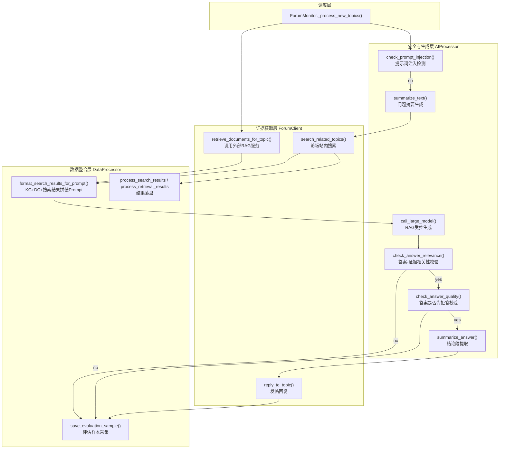

## 项目定位与核心价值

论坛自动化运营的核心难点并不在于"调用一次大模型生成文字"，而在于如何在**准确性、安全性与可追溯性**三者之间取得平衡。用户在论坛发帖提问后，机器人若直接把问题丢给 LLM 自由发挥，极易产生"幻觉"式的错误回答，进而损害社区信任；但如果完全依赖静态 FAQ 匹配，又无法覆盖长尾问题。ForumBot 的问答链路正是为了解决这一矛盾而设计：它把**检索增强生成（RAG）**作为主干范式，将"论坛站内搜索"和"外部知识库检索服务"两路证据源并联汇入大模型的上下文窗口，强制模型"只能基于给定材料回答"，从而在开放域问答与事实可控之间找到了工程上的折中点。

这条链路的调度中枢位于 `ForumMonitor._process_new_topics`，它按照"防注入 → 摘要 → 检索 → 生成 → 双重质检 → 摘要封装 → 发布 → 持久化/评估埋点"的顺序串联三个职责分明的组件：`ForumClient` 负责一切网络 I/O（论坛 API、外部搜索引擎、RAG 检索服务），`AIProcessor` 封装所有与大模型对话的 Prompt 工程与安全校验逻辑，`DataProcessor` 承担数据清洗、格式转换与数据库落盘。三者互不感知对方的内部实现，只通过普通 Python 字典和字符串交换数据，这种"贫血对象 + 胖调度器"的分层方式虽不追求学院派的整洁架构，但换来了极高的可调试性——任何一步出错都能在 `monitor.py` 的 try/except 中被单独捕获并降级处理，不会导致整条流水线中断。

Sources: [monitor.py](src/ForumBot/monitor.py#L299-L544)

## 架构设计与模块划分

整条问答链路可以视为一个"证据收集 - 证据融合 - 受控生成 - 事后质检"的四段式流水线。下图刻画了三大组件之间的调用关系与数据流向：



**调度层（`ForumMonitor`）** 是整条链路的状态机与容错边界。它不做任何业务判断，只负责按固定顺序调用下游方法，并在每一个可能失败的环节（检索异常、模型异常、答案为空）插入 `try/except` 与提前 `continue`，确保单个帖子的失败不会波及批处理中的其他帖子。

Sources: [monitor.py](src/ForumBot/monitor.py#L299-L544)

**证据获取层（`ForumClient`）** 提供两条并行的证据通道。`search_related_topics` 面向论坛自身的全文搜索引擎，按摘要关键字取回站内相关帖子并清洗 HTML 标签；`retrieve_documents_for_topic` 则通过内部方法 `_get_response_data` 向外部 RAG 检索服务（`config['retrieval']['base_url']`）发起两次 POST 请求——一次取 `response`（用于生成 Prompt 的检索结果，通常是 Markdown 格式的 KG+DC 混合文本），一次取 `/data` 端点的结构化 `chunks` 数据（用于后续从文件路径中提取 topic_id 生成"相关链接"）。这一双请求设计牺牲了一定的网络开销，换来了"既要人类可读的引用文本，又要机器可解析的元数据"两种诉求的同时满足。

Sources: [forum_client.py](src/ForumBot/forum_client.py#L84-L204)

**数据整合层（`DataProcessor`）** 中最关键的是 `format_search_results_for_prompt`。它先用正则从 RAG 服务返回的 `related_docs` 文本中提取三个 ```json 代码块（对应 Entities/KG、Relationships/KG、Document Chunks/DC），分别打上小节标题后拼接成 `context_data`；再将论坛站内搜索结果通过 `format_search_results_as_json` 转成统一的 JSON Schema 追加进去；最后套入模块顶部定义的 `PROMPT_TEMPLATE`，生成最终喂给大模型的完整提示词。这个模板本身就是一份"防幻觉宣言"：它用编号规则明确要求模型"仅使用 Context 中的信息"、"找不到答案时应声明信息不足而非猜测"，并强制输出语言为中文、禁止输出 Mermaid/PlantUML 等图表语言（因为论坛回帖渲染不支持）。

Sources: [data_processor.py](src/ForumBot/data_processor.py#L27-L66), [data_processor.py](src/ForumBot/data_processor.py#L1182-L1204), [data_processor.py](src/ForumBot/data_processor.py#L213-L266)

**安全与生成层（`AIProcessor`）** 则是整条链路里 Prompt 工程密度最高的部分，下一节详细展开。

## 技术栈与核心工作流

该链路的技术栈没有引入任何 LangChain/LlamaIndex 之类的 RAG 框架，而是直接基于官方 `openai` SDK 手写 Prompt 与重试逻辑，数据库侧使用 `psycopg2` 直连 PostgreSQL。这种"轻框架、重手工 Prompt"的选择在中小型论坛机器人场景下换来了逻辑透明和调试成本低的收益，代价是每新增一种校验都要手写一套系统提示词模板与重试循环。

下表梳理了主链路中各核心方法的角色与实现细节：

| 阶段 | 核心方法 | 所在文件 | 关键设计点 |
|---|---|---|---|
| 注入防御 | `check_prompt_injection` | ai_processor.py | 用随机 16 位字符串把用户输入"包裹"起来喂给模型，防止用户输入内容被误解析为系统指令；`max_tokens=3` 强制只输出 yes/no；双模型（`model2_name`→`model_name`）容灾重试 |
| 问题摘要 | `summarize_text` | ai_processor.py | 单轮对话生成不超过 `max_length` 字符的一句话摘要，用于驱动后续的站内搜索关键字 |
| 站内检索 | `search_related_topics` | forum_client.py | 关键字超长自动截断，返回结果统一去除 HTML 标签 |
| 外部 RAG 检索 | `retrieve_documents_for_topic` / `_get_response_data` | forum_client.py | 用 `@capture_retrieval_metrics` 装饰器自动记录检索延迟与上下文，写入线程局部变量供评估管道读取 |
| Prompt 融合 | `format_search_results_for_prompt` | data_processor.py | 将 KG 三元组、Document Chunks、站内搜索结果统一拼装进 `PROMPT_TEMPLATE` |
| 受控生成 | `call_large_model` | ai_processor.py | 系统提示词与用户输入均使用随机字符串封装防注入；带指数退避的 3 次重试；`@capture_generation_metrics` 记录生成延迟与实际输出 |
| 相关性校验 | `check_answer_relevance` | ai_processor.py | 判断生成答案是否确实基于检索到的 `context_data`，避免模型答非所问 |
| 质量校验（拒答检测） | `check_answer_quality` | ai_processor.py | 检测答案中是否包含"无法回答/抱歉/不知道"等拒答措辞，双模型容灾 |
| 结论摘要 | `summarize_answer` | ai_processor.py | 从长答案中原样抽取"总结/解决方案/结论"章节，用于折叠展示的摘要部分 |
| 发布回复 | `reply_to_topic` | forum_client.py | 通过论坛 Discourse 风格的 `posts.json` API 携带 `Api-Key`/`Api-Username` 头部完成回帖 |
| 落盘与评估 | `process_retrieval_results` / `append_to_db` / `save_evaluation_sample` | data_processor.py | 结构化写入 PostgreSQL，同时为离线评估（DeepEval 类指标）保留检索延迟、生成延迟、token 消耗等维度 |

工作流的容错哲学体现在 `_process_new_topics` 里三处"提前退出但仍落盘"的分支：当答案被判定为不相关（`is_relevant != 'yes'`）或不合格（`is_qualified != 'yes'`）时，机器人**不会回帖**，但仍会把该次尝试的答案、token 消耗、评估样本写入数据库并更新 Prometheus 指标——这使得运营者可以事后审查"模型生成了但被拦下的答案"，用于持续调优 Prompt 而不会误发劣质内容到生产论坛。

Sources: [monitor.py](src/ForumBot/monitor.py#L360-L469), [evaluation_hooks.py](src/ForumBot/evaluation_hooks.py#L13-L52)

## 典型代码示例

`_get_response_data` 是外部 RAG 服务的唯一网络出口，其"双请求换双数据形态"的设计是理解检索层的关键：

```python
@capture_retrieval_metrics
def _get_response_data(self, query):
    url = f"{base_url}{endpoint}"
    url_data = f"{base_url}{endpoint}/data"
    payload = {
        "query": query,
        "only_need_prompt": only_need_prompt,
        "only_need_context": only_need_context,
        "top_k": self.config['retrieval']['top_k'],
        "chunk_top_k": self.config['retrieval']['chunk_top_k'],
        "enable_rerank": self.config['retrieval']['enable_rerank'],
    }
    response = requests.post(url, json=payload, verify=verify_ssl, timeout=600)
    result = response.json()
    response_data = requests.post(url_data, json=payload, verify=verify_ssl, timeout=600)
    result_data = response_data.json()
    return result.get("response"), result_data
```

`response` 字段是可直接嵌入 Prompt 的文本（供 `format_search_results_for_prompt` 提取 KG/DC 三元组），`result_data` 则是结构化的 `chunks` 列表（供 `monitor._generate_related_links` 从 `file_path` 中反解析出原始 `topic_id`，生成"相关链接"区块）。`@capture_retrieval_metrics` 装饰器在不侵入业务逻辑的前提下，把检索耗时和检索上下文写入线程局部的 `_evaluation_context`，供最终的 `save_evaluation_sample` 统一收集，这是一种典型的"AOP 式可观测性注入"手法。

Sources: [forum_client.py](src/ForumBot/forum_client.py#L166-L204), [monitor.py](src/ForumBot/monitor.py#L142-L297)

## 学习与探索建议

| 关注点 | 建议阅读路径 | 说明 |
|---|---|---|
| Prompt 防注入手法 | `ai_processor.py` 中所有以随机字符串包裹用户输入的方法（`check_prompt_injection` / `call_large_model`） | 理解"随机分隔符隔离用户输入"这一轻量级防注入范式的适用边界 |
| RAG 上下文拼装规则 | `data_processor.py` 的 `PROMPT_TEMPLATE`、`format_search_results_for_prompt`、`extract_json_blocks` | 掌握 KG/DC/搜索结果三路证据如何合并进单一 Prompt |
| 质检与拒答闭环 | `monitor.py` 的 `_process_new_topics` 中 `is_relevant`/`is_qualified` 两个分支 | 学习"生成后仍需二次校验才能发布"的质量门设计 |
| 可观测性埋点 | `evaluation_hooks.py`、`token_tracker.py`、`prometheus_metrics.py` | 理解装饰器式指标采集与线程局部上下文传递的组合方式 |
| 预审变体链路 | `monitor.py` 的 `_process_pre_audit_topic` 与 `SchemaValidation/end_to_end_check.py` | 同一套组件如何被复用出"结构化评审报告"的另一种业务形态 |

## 🔗 关联模块与上下游

- [monitor.py](src/ForumBot/monitor.py) —— 该链路的唯一调用方与状态机，`ForumMonitor._process_new_topics` 是理解整条流水线执行顺序的最佳入口。
- [token_tracker.py](src/ForumBot/token_tracker.py) —— 被 `AIProcessor` 每次模型调用后写入，为链路提供 token 成本核算。
- [evaluation_hooks.py](src/ForumBot/evaluation_hooks.py) —— 通过装饰器无侵入采集检索/生成延迟，是 `save_evaluation_sample` 数据的直接上游。
