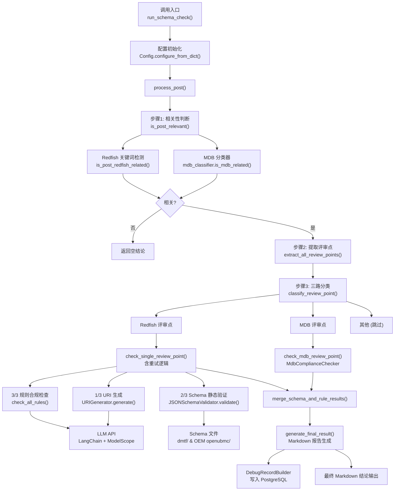

# AI 预审链路：结构化合规评审

## 1. 项目定位与核心价值

### 诞生背景与痛点

在大型嵌入式服务器管理领域，Redfish 是由 DMTF（分布式管理任务组）制定的 RESTful 接口规范，覆盖资源 URI 结构、JSON Schema 属性命名、枚举类型设计、数据类型约束等数十条强制规则。工程团队在提交接口设计评审时，往往在论坛帖子中以自然语言散文加 Markdown 表格的方式描述"评审点"，内容覆盖新增/修改的资源路径、属性定义和示例 JSON。

传统流程依赖人工专家逐条比对 Redfish 规范文档，不仅耗时（单帖可能含数十个评审点），而且审查质量因人而异。常见的漏检场景包括：类型列大写拼写（`Boolean` 代替 `boolean`）、URI 路径段首字母未 PascalCase、属性名缩写不一致、`@odata.id` 被误写为 `@data.id` 等，这些细节在视觉上极难察觉，却会导致下游 Schema 解析失败。

**该模块的核心价值在于：将人工专家审查流程完整数字化**。它接收一篇原始论坛帖子（HTML 格式），在不依赖任何外部预处理的前提下，完成从"帖子相关性判断"到"逐评审点三路分类"、"URI 示例生成"、"JSON Schema 静态验证"、"LLM 批量规则合规性检查"的全链路自动化，最终输出结构化的 Markdown 格式评审结论。

### 核心特性展开

该引擎围绕两大技术支柱构建：**静态验证（Schema-based）** 与 **语义验证（LLM-based）**。静态验证通过 `JSONSchemaValidator` 对 LLM 生成的 URI 示例 JSON 执行离线 Schema 校验，同时兼容 DMTF 官方 Schema 和厂商 OEM Schema（`dmtf/` 与 `rackmount/oem/openubmc/json_schema/` 双源），属性类型不匹配、必填字段缺失等结构性问题可在无网络调用的情况下精确定位到字段级别。语义验证则利用 LangChain + ModelScope 大模型 API，将所有合规规则一次性打包进 prompt（批量模式，单次 API 调用覆盖全部 `REDFISH_COMPLIANCE_RULES`），对评审点内容或 URI 示例 JSON 进行语义层面的逐规则核查，输出结构化 JSON 数组，其中每一条均包含 `compliant`、`summary`、`advice` 等字段。

在鲁棒性设计上，系统内置两层防御机制。第一层是**基础设施错误识别**：`is_infrastructure_error_text()` 函数维护了涵盖超时、限流、空响应、网关错误等数十种关键词的枚举表，确保 API 临时不可用时不会将错误文本当作真实审查结论输出到帖子。第二层是**智能重试**：`process_post()` 对每个 Redfish 评审点最多重试 `Config.MAX_RETRY`（默认 3）次，且重试时会区分"URI 生成阶段失败"与"规则检查阶段失败"，通过 `_cached_uri_sample` / `_cached_checks` 复用已成功的中间结果，避免重复调用 LLM 生成 URI。

Sources: [end_to_end_check.py](src/ForumBot/SchemaValidation/end_to_end_check.py#L57-L104), [end_to_end_check.py](src/ForumBot/SchemaValidation/end_to_end_check.py#L1116-L1187)

---

## 2. 架构设计与模块划分

### 整体架构图



Sources: [end_to_end_check.py](src/ForumBot/SchemaValidation/end_to_end_check.py#L954-L1210), [end_to_end_check.py](src/ForumBot/SchemaValidation/end_to_end_check.py#L1213-L1300)

---

### 各核心模块职责详解

| 模块文件 | 核心类/函数 | 职责描述 |
|---------|------------|---------|
| `end_to_end_check.py` | `run_schema_check()`, `process_post()`, `check_single_review_point()` | **主链路编排器**。接收帖子输入，按四步顺序调度所有子模块，聚合结果，生成最终 Markdown 报告 |
| `redfish_review_workflow.py` | 动态导入薄再导出层 | **依赖注入桥接器**。通过 `importlib.util` 动态加载 `redfish_checker`，向上层暴露 `REDFISH_COMPLIANCE_RULES`、`check_all_rules`、`check_review_point_compliance` 等符号，实现模块间的运行时解耦 |
| `redfish_checker.py` | `check_all_rules_batch()`, `check_review_point_compliance()`, `apply_static_review_point_type_consistency_check()` | **LLM 规则引擎**。维护合规规则集（外置 JSON），构造批量检查 prompt，调用 LLM，解析并修复 JSON 输出 |
| `redfish_uri_generator.py` | `URIGenerator.generate()` | **URI 示例生成器**。通过 LLM 根据评审点描述生成符合 Redfish 规范的 JSON 响应体示例（含 `@odata.id`, `@odata.type` 等必要字段） |
| `redfish_schema_validator.py` | `JSONSchemaValidator.validate()` | **离线 Schema 校验器**。解析 DMTF 及 OEM JSON Schema 文件，对生成的 URI 示例执行属性类型校验、必填字段检查，输出带来源追踪的结构化结果 |
| `extract_reviews.py` | `extract_all_review_points()`, `is_redfish_related()` | **评审点解析器**。通过正则表达式解析 HTML/Markdown 原文，支持编号/无编号/中文数字多种格式的评审点提取 |
| `redfish_common.py` | `Config`, `ValidationResult`, `URIGenerationError` | **公共基础设施**。集中管理配置（API Key、Schema 目录、重试策略），提供日志、文件 I/O、错误类型定义 |
| `schema_debug_logger.py` | `DebugRecordBuilder`, `init_debug_logger()` | **可观测性探针**。将每个 topic 的完整中间产物（含各步耗时、URI 示例、Schema 校验结果）异步写入 PostgreSQL `schema_debug_logs` 表，用于试运行阶段的质量回归 |

Sources: [redfish_review_workflow.py](src/ForumBot/SchemaValidation/redfish_review_workflow.py#L1-L53), [redfish_checker.py](src/ForumBot/SchemaValidation/redfish_checker.py#L1-L58), [redfish_common.py](src/ForumBot/SchemaValidation/redfish_common.py#L25-L89)

---

### 动态导入设计哲学

`redfish_review_workflow.py` 是本系统中一个值得关注的架构细节。它并非实现任何业务逻辑，而是纯粹作为**运行时桥接层**存在：

```python
spec = importlib.util.spec_from_file_location(
    "redfish_checker", str(_SCHEMA_VALIDATION_DIR / "redfish_checker.py")
)
redfish_checker_module = importlib.util.module_from_spec(spec)
spec.loader.exec_module(redfish_checker_module)

REDFISH_COMPLIANCE_RULES = redfish_checker_module.REDFISH_COMPLIANCE_RULES
check_all_rules = redfish_checker_module.check_all_rules
check_review_point_compliance = redfish_checker_module.check_review_point_compliance
```

这一设计的意图是：在 `SchemaValidation` 目录被作为独立脚本运行或被父包以不同路径引入时，避免 Python 相对导入的路径歧义问题。`end_to_end_check.py` 同样采用相同模式导入 `extract_reviews` 和 `redfish_review_workflow`，整套链路在 `sys.path` 操控 + `importlib` 动态加载的组合下实现了跨调用方式的兼容性。

Sources: [redfish_review_workflow.py](src/ForumBot/SchemaValidation/redfish_review_workflow.py#L36-L51), [end_to_end_check.py](src/ForumBot/SchemaValidation/end_to_end_check.py#L184-L210)

---

## 3. 技术栈与核心工作流

### 执行主链路

整条链路的主入口是 `run_schema_check()`，它是供上层主应用调用的门面函数（Facade），内部依次执行以下 4 个编排阶段：

**阶段 1 — 相关性筛选**

`is_post_relevant()` 实现三路判断：优先调用 `mdb_classifier.is_mdb_related()` 检测是否属于 MDB 资源协作接口帖子；若否，再执行 `is_post_redfish_related()` 进行关键词扫描（`redfish`、`bmc`、`@odata.id` 等）。帖子若与两者均无关，立即短路返回，不进入后续高成本 LLM 调用。

**阶段 2 — 评审点提取**

`extract_all_review_points()` 基于多层正则规则解析原始 HTML，支持"评审点N："、中文数字编号、Markdown heading 等多种格式，返回 `[{"title": ..., "content": ...}]` 列表。

**阶段 3 — 三路分类**

`classify_review_point()` 对每个评审点独立分类为 `mdb` / `redfish` / `other`。分类基于与阶段 1 相同的分类器，但粒度降至评审点级别。分类结果维护在 `_category_map` 字典中（key 为 `id(rp)` 对象标识），保证多次遍历时顺序一致。

**阶段 4 — 逐评审点检查（含重试）**

按原始帖子顺序遍历 MDB + Redfish 两类评审点，MDB 评审点走 `check_mdb_review_point()` 分支，Redfish 评审点走 `check_single_review_point()` 的三子步骤：

```
URI 生成 (LLM)  →  Schema 静态验证 (本地)  →  规则合规检查 (LLM)
     ↓                      ↓                        ↓
 uri_sample             schema_validation         rule_compliance
```

Sources: [end_to_end_check.py](src/ForumBot/SchemaValidation/end_to_end_check.py#L996-L1057), [end_to_end_check.py](src/ForumBot/SchemaValidation/end_to_end_check.py#L466-L649)

---

### check_single_review_point 子步骤详解

```python
# 子步骤 1/3：LLM 生成 URI JSON 示例
generator = URIGenerator()
uri_sample = generator.generate(review_point, uri_sample_file, topic_id=topic_id)

# 子步骤 2/3：本地 Schema 静态验证
schema_result = validate_uri_sample(uri_sample, schema_dir)

# 子步骤 3/3：LLM 批量规则合规检查
rule_check_result = check_all_rules(
    rules=REDFISH_COMPLIANCE_RULES,
    uri=uri, payload=uri_sample,
    resource_type=resource_type,
    model=DEFAULT_MODEL,
    save_result=False,
    topic_id=topic_id
)
```

子步骤 2 和 3 的结果通过 `merge_schema_and_rule_results()` 合并：Schema 验证失败的字段级错误会被注入 `error_details['STATIC_VALIDATION']` 列表，Schema 跳过（定义文件缺失）则写入 `error_details['WARNING_DETAILS']`，最终统一由 `generate_final_result()` 渲染为 Markdown。

Sources: [end_to_end_check.py](src/ForumBot/SchemaValidation/end_to_end_check.py#L509-L649), [end_to_end_check.py](src/ForumBot/SchemaValidation/end_to_end_check.py#L405-L463)

---

### LLM 规则引擎的批量化设计

`redfish_checker.py` 中的 `check_all_rules_batch()` 是系统中最关键的性能优化点。早期实现为每条规则单独发起一次 LLM API 调用，在规则数量达到十余条时，单个评审点的检查时延会累积至分钟级别。批量化重构后，所有规则通过 `format_rules_for_batch()` 序列化为文本块，一次性注入 `BATCH_CHECK_SYSTEM_PROMPT`，单次 `llm.invoke(full_prompt)` 返回完整的 JSON 数组，响应经 `parse_batch_check_result()` 反序列化后再经 `validate_and_fix_results()` 修复 LLM 输出中 `compliant` 与 `summary` 不一致的边界情况。

`check_all_rules` 函数名通过别名指向 `check_all_rules_batch`，保证了旧调用方无需修改签名：

```python
def check_all_rules(*args, **kwargs):
    """检查所有规则（向后兼容接口，内部使用批量实现）"""
    return check_all_rules_batch(*args, **kwargs)
```

Sources: [redfish_checker.py](src/ForumBot/SchemaValidation/redfish_checker.py#L1214-L1316), [redfish_checker.py](src/ForumBot/SchemaValidation/redfish_checker.py#L1948-L1951)

---

### 合规规则的数据驱动架构

规则数据与检查逻辑完全解耦。`REDFISH_COMPLIANCE_RULES` 从 `SchemaFiles/redfish_compliance_rules.json` 外置文件加载，每条规则包含 `id`（如 `RULE-001`）、`category`、`severity`（`must`/`should`/`may`）、`rule`、`check`、`rationale` 字段。`_load_compliance_rules()` 在模块加载时执行完整性校验（必填字段、id 唯一性），确保规则文件损坏时快速失败而非运行时静默出错。

这一设计使规则的增删改无需触碰任何 Python 代码，符合开闭原则（OCP）。

Sources: [redfish_checker.py](src/ForumBot/SchemaValidation/redfish_checker.py#L26-L58)

---

### Schema 验证的双源策略

`JSONSchemaValidator` 在初始化时同时建立 DMTF 标准 Schema 目录（`SchemaFiles/dmtf/`）和 OEM 扩展 Schema 目录（`SchemaFiles/rackmount/oem/openubmc/json_schema/`）的查找路径，优先在本地文件中解析 `@odata.type` 对应的 Schema 定义，若两处均缺失则降级为 `skip` 状态并输出可读警告（提示用户检查 `SchemaFiles/dmtf` 或 OEM 子目录是否包含该资源类型的实际 JSON Schema 定义文件）。验证元数据通过 `schema_check_meta` 字典向上层透传，包含 `dmtf_schema_found`、`oem_schema_found`、`validated_sources`、`entry_schema_path_relative` 等字段，供 Markdown 报告中的 Schema 来源说明环节使用。

Sources: [redfish_schema_validator.py](src/ForumBot/SchemaValidation/redfish_schema_validator.py#L28-L60), [end_to_end_check.py](src/ForumBot/SchemaValidation/end_to_end_check.py#L356-L403)

---

## 4. 典型代码示例

### 公开门面调用

```python
# 供主应用（ForumBot）调用
from end_to_end_check import run_schema_check

result = run_schema_check(
    title="[评审] Managers 下新增 EnergySavingService 资源",
    user_question=html_content,       # 原始帖子 HTML
    topic_id="12345",
    config={
        "schema_validation": {
            "api_key": "...",
            "base_url": "https://api-inference.modelscope.cn/v1",
            "model":    "Qwen/Qwen2.5-72B-Instruct",
            "max_retry": 3,
            "retry_delay": 5,
        },
        "pre_audit": {"readiness_field": "is_ready"},
        "database": {"host": "localhost", "port": 5432, ...}
    },
    return_details=True   # 返回统计数据
)

# result["final_result"] 是 Markdown 格式的评审结论
# result["redfish_review_points"] / result["mdb_review_points"] 是分类统计
```

Sources: [end_to_end_check.py](src/ForumBot/SchemaValidation/end_to_end_check.py#L1213-L1300)

---

### 基础设施错误过滤机制

```python
INFRASTRUCTURE_ERROR_KEYWORDS = (
    "request timed out", "rate limit", "quota", "429",
    "service unavailable", "empty response",
    "规则检查服务调用失败", "空响应", ...
)

def is_infrastructure_error_text(value: Any) -> bool:
    text = str(value or "").lower()
    return any(keyword in text for keyword in INFRASTRUCTURE_ERROR_KEYWORDS) \
        or any(keyword in text for keyword in INTERNAL_VALIDATION_ERROR_KEYWORDS)
```

该函数在 `_is_api_error()` 中被调用，对 `uri_sample`、`schema_validation`、`rule_compliance` 三个检查阶段的输出分别扫描，一旦命中则触发重试或提前终止，绝不将错误文本作为审查结论写回论坛帖子。

Sources: [end_to_end_check.py](src/ForumBot/SchemaValidation/end_to_end_check.py#L57-L170)

---

### 整体判定逻辑

```python
def _judge_review_point_overall(rp: Dict[str, Any]) -> str:
    checks = rp.get('checks', {})
    uri_check = checks.get('uri_sample', {})
    if uri_check.get('status') in ('failed', 'error'):
        return 'fail'
    schema = checks.get('schema_validation', {})
    if schema.get('result') in ('fail', 'error'):  # skip → pass（文件缺失非评审点问题）
        return 'fail'
    rule = checks.get('rule_compliance', {})
    if 'error' in rule or rule.get('result') == 'fail':
        return 'fail'
    if 'overall_compliant' in rule and not rule['overall_compliant']:
        return 'fail'
    return 'pass'
```

值得注意的是：Schema 验证的 `skip` 状态被有意处理为 `pass`——Schema 文件缺失属于平台侧环境问题，而非评审点本身的设计缺陷，此处的策略选择体现了对误报率的主动控制。

Sources: [end_to_end_check.py](src/ForumBot/SchemaValidation/end_to_end_check.py#L837-L864)

---

## 5. 学习与探索建议

### 从外围到核心的阅读路径

| 优先级 | 目标文件 | 切入点 | 理由 |
|--------|---------|--------|------|
| 1 | `redfish_common.py` | `Config` 类 / `ValidationResult` 类 | 理解整套链路的配置驱动逻辑和数据结构基础，成本最低 |
| 2 | `end_to_end_check.py` | `run_schema_check()` → `process_post()` | 掌握四步编排主链路，可在此处加断点追踪完整数据流 |
| 3 | `redfish_checker.py` | `check_all_rules_batch()` / `CHECK_REVIEW_POINT_SYSTEM_PROMPT` | 深入 LLM prompt 工程，理解规则如何被序列化注入 prompt 以及结果如何解析修复 |
| 4 | `redfish_schema_validator.py` | `JSONSchemaValidator.validate()` | 理解 DMTF + OEM 双源 Schema 解析逻辑，尤其是指针文件（JsonSchemaFile）与实际定义文件的区分 |
| 5 | `SchemaFiles/redfish_compliance_rules.json` | 全量规则数据 | 数据驱动架构的核心，直接决定哪些 Redfish 规范被检查 |
| 6 | `extract_reviews.py` | `_REVIEW_POINT_TITLE_RE` / `extract_all_review_points()` | 了解正则多模式匹配如何应对论坛帖子格式多样性 |
| 7 | `schema_debug_logger.py` | `DebugRecordBuilder` 上下文管理器 | 理解试运行阶段的可观测性设计及 PostgreSQL 写入降级策略 |

### 关键调试入口

- **模拟单帖完整链路**：直接调用 `run_schema_check(title, html, topic_id, config, return_details=True)`，观察 `result["final_result"]` 的 Markdown 输出及各计数字段
- **隔离 LLM 合规检查**：直接调用 `check_review_point_compliance(REDFISH_COMPLIANCE_RULES, title, content, model=...)` 可跳过 URI 生成和 Schema 验证，快速验证规则引擎行为
- **隔离 Schema 验证**：构造一个含 `@odata.id` 和 `@odata.type` 的测试 JSON，调用 `validate_uri_sample(json_dict, schema_dir)` 单独验证 Schema 校验路径
- **规则文件热更新**：修改 `SchemaFiles/redfish_compliance_rules.json` 后重启进程，`_load_compliance_rules()` 会在模块加载时重新解析，无需改动任何 Python 代码

---

## 🔗 关联模块与上下游

- **上游调用方**：`src/ForumBot/` 主应用模块通过 `run_schema_check()` 调用本链路，`config.yaml` 的 `schema_validation` 节提供所有运行时配置
- **MDB 并行链路**：`src/ForumBot/MdbValidation/mdb_checker.py` — `MdbComplianceChecker` 与 Redfish 链路并行执行，共享 `classify_review_point()` 的分发逻辑
- **Token 用量记录**：`src/ForumBot/llm_token_usage.py` — `record_llm_token_usage()` 在 URI 生成和规则检查两处 LLM 调用后被调用，为成本分析提供数据

Sources: [end_to_end_check.py](src/ForumBot/SchemaValidation/end_to_end_check.py#L191-L199), [redfish_checker.py](src/ForumBot/SchemaValidation/redfish_checker.py#L15-L16), [redfish_uri_generator.py](src/ForumBot/SchemaValidation/redfish_uri_generator.py#L19)
