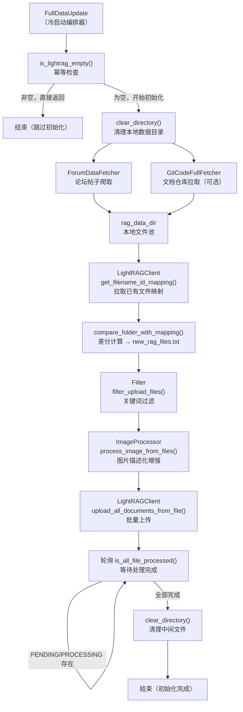

# 知识库全量初始化：冷启动数据导入

## 1. 项目定位与核心价值

### 背景与痛点

任何基于 RAG（Retrieval-Augmented Generation）的智能问答系统，在正式上线前都必须面对一个"冷启动"难题：知识库是空的，但系统需要在第一次运行时就具备完整的知识储备。对于一个面向开源社区论坛的 AI 回复机器人而言，这一挑战更为突出——数据来源不止一处，既有论坛中积累多年的历史帖子（问答结构化数据），也有存放于 Git 仓库中的官方技术文档（Markdown 格式）。若手工导入，既耗时耗力，又容易引入人为错误；若无有效幂等保护，每次重启都可能触发重复导入，污染知识图谱。

该模块正是为了彻底解决上述问题而生。`FullDataUpdate` 提供了一套**幂等安全的全量冷启动流程**：在系统初次部署或知识库被清空后，以全自动方式从论坛 API 与 Git 仓库中拉取全部历史数据，经过预处理（图片描述化、关键词过滤）后，批量导入 LightRAG 知识图谱服务，并在导入完成后自动清理本地中间文件。**系统核心保证是：若 LightRAG 已有数据，整个流程会直接跳过**，从而实现幂等语义。

### 核心特性解析

**双数据源统一接入**是该模块最突出的架构亮点。论坛帖子数据（`ForumDataFetcher`）通过 Discourse 论坛 REST API 逐页爬取，提取问题、最优解答、回复帖子等结构化字段，序列化为 `{title}_{id}_topic.json` 格式落盘；Git 文档数据（`GitCodeFullFetcher`）则通过 `GitPython` 库直接 clone/pull 官方文档仓库，遍历指定 `base_path` 下的所有 Markdown 文件并将其平铺保存为带路径前缀的文件名（如 `docs_zh_development_install.md`）。两类数据最终统一汇集至 `rag_data_dir` 目录，形成一个扁平化的文件池，供后续流程统一消费。

**多模态内容增强**体现了该模块对数据质量的深度重视。论坛帖子中普遍夹杂截图（错误日志截图、配置界面截图等），若直接将图片 URL 写入知识库，LightRAG 在图谱构建阶段将无法理解其语义内容。`ImageProcessor` 在文件上传前调用多模态大模型，对 `topic.json` 中所有匹配到图片 URL 的内容进行逐一描述化处理，将 `https://...screenshot.png` 替换为 `[图片: 包含错误日志 'XYZ'，配置项显示...]` 这类富文本描述，大幅提升知识图谱的检索精度与语义完整性。

Sources: [full_data_init.py](src/update_lightrag/full_data_init.py#L93-L123), [forum_data_Fetcher.py](src/update_lightrag/forum_data_Fetcher.py#L1-L50), [gitode_full_fetcher.py](src/update_lightrag/gitode_full_fetcher.py#L143-L196), [image_processor.py](src/update_lightrag/image_processor.py#L75-L98)

---

## 2. 架构设计与模块划分

### 整体架构拓扑



### 模块职责详解

| 模块类 | 源文件 | 核心职责 |
|---|---|---|
| `FullDataUpdate` | `full_data_init.py` | 冷启动总编排器，串联所有子模块，保障幂等语义 |
| `ForumDataFetcher` | `forum_data_Fetcher.py` | Discourse 论坛 REST API 分页爬取，结构化帖子数据落盘 |
| `GitCodeFullFetcher` | `gitode_full_fetcher.py` | GitPython clone/pull 官方文档仓库，遍历 Markdown 文件 |
| `LightRAGClient` | `lightrag_client.py` | LightRAG HTTP API 封装：上传、删除、分页查询、状态轮询 |
| `Filter` | `filter.py` | 基于配置关键词过滤待上传文件列表 |
| `ImageProcessor` | `image_processor.py` | 多模态模型调用，将图片 URL 替换为语义文本描述 |
| `save_last_update_time` | `update_time.py` | 将当前 UTC 时间写入时间戳文件，供增量更新基准使用 |
| `clear_directory` | `utils.py` | 清空目录中所有文件（保留目录结构，跳过时间戳文件） |

**`FullDataUpdate`（编排器）** 是整个冷启动流程的"指挥中枢"。其构造函数接受一个 `config` 字典（支持外部注入，也可从 `config.yaml` 自动加载），并实例化所有子模块。`update_full_data()` 方法定义了完整的执行序列，是整个冷启动的唯一公共入口，其设计遵循"失败快速、幂等安全"原则。

**`ForumDataFetcher`（论坛数据采集器）** 通过分页拉取论坛的 `/latest.json` 端点，逐页迭代所有话题，再对每个话题调用 `/t/{id}.json` 获取完整帖子流。特别值得关注的是其**帖子过滤逻辑**：机器人自身发表的非解决方案回复会被剔除（`post['user_name'] == config['posts']['api_username'] and not post['is_solution']`），避免 AI 自身的历史回复污染知识语料；同时，帖子中的 HTML 内容通过 `BeautifulSoup` 解析纯文本，并提取所有超链接作为补充信息字段。

**`GitCodeFullFetcher`（文档仓库拉取器）** 的设计采用"本地缓存复用"策略：若 `gitcode_docs_repo/` 目录已存在，执行 `git pull`；否则执行 `git clone --depth 1`（浅克隆，仅获取最新快照，避免拉取完整历史）。文件命名规则将相对路径中的 `/` 替换为 `_`（如 `docs/zh/development/install.md` → `docs_zh_development_install.md`），以保持文件池内的命名唯一性。拉取并保存完成后，调用 `delete_directory()` 删除本地克隆目录，及时释放磁盘空间。

Sources: [full_data_init.py](src/update_lightrag/full_data_init.py#L16-L27), [forum_data_Fetcher.py](src/update_lightrag/forum_data_Fetcher.py#L68-L136), [gitode_full_fetcher.py](src/update_lightrag/gitode_full_fetcher.py#L32-L61), [filter.py](src/update_lightrag/filter.py#L1-L45), [lightrag_client.py](src/update_lightrag/lightrag_client.py#L306-L338), [utils.py](src/utils.py#L114-L138)

---

## 3. 技术栈与核心工作流

### 执行主链路（冷启动七步流水线）

```
幂等检查 → 环境清理 → 数据采集（论坛 + 文档）→ 差分计算 → 内容预处理 → 批量上传 → 状态轮询
```

以下是 `update_full_data()` 方法中每一步的详细解析：

**步骤 1：幂等门控（is_lightrag_empty）**

调用 `LightRAGClient.is_lightrag_empty()` 向 `/documents/paginated` 发送 POST 请求，读取响应中 `pagination.total_count` 字段。若值为非零，说明知识库已有数据，方法直接 `return`，整个冷启动流程终止。这是系统防止重复导入的核心保障。

**步骤 2：本地环境清理（clear_directory）**

在数据采集前调用 `clear_directory(lightrag_root_dir, update_time)`，递归清除所有本地中间文件，但跳过时间戳文件（`update_time` 所指向的文件）。这确保了即使上次运行异常中断留下了脏数据，本次也能从干净状态开始。

**步骤 3a：论坛数据全量爬取（ForumDataFetcher）**

`get_all_forum_data()` 以 `page=0` 开始进入无限循环，每次调用 `extract_one_page_topic_data(page)` 获取一页话题并逐个 fetch 详情，直到某页返回空列表为止。每两次话题 API 请求之间有 0.5 秒的主动限速（`time.sleep(0.5)`），避免触发论坛的反爬机制。

**步骤 3b：Git 文档同步（GitCodeFullFetcher，可选）**

仅在 `config.doc_sync == True` 时触发。`fetch_and_save_all_files()` 内部先执行 `clone_or_pull_repo()` 同步仓库，再调用 `traverse_markdown_files(base_path)` 遍历指定路径下的所有 `.md` 文件（跳过 `skip_dirs` 中配置的目录，默认为 `['images']`），最后逐文件调用 `get_file_path()` 将内容写入 `rag_data_dir`。

**步骤 4：差分计算（compare_folder_with_mapping）**

`get_full_update_file()` 首先调用 `LightRAGClient.get_filename_id_mapping_from_lightrag()` 拉取 LightRAG 中已有的文件名→ID 映射并持久化到本地 JSON 文件（`files_id_mapping`）。然后 `compare_folder_with_mapping()` 对本地文件池（`rag_data_dir`）与该映射文件做集合差运算（`folder_files - mapped_files`），将结果（即真正需要上传的新文件列表）写入 `new_rag_files.txt`。在冷启动场景下，映射文件为空，因此全部本地文件都会进入待上传列表。

**步骤 5：内容预处理（Filter + ImageProcessor）**

- `Filter.filter_upload_files()` 读取 `new_rag_files.txt`，按 `config.filter_keywords` 中配置的关键词过滤掉不应导入的文件，将结果写回同一文件。
- `ImageProcessor.process_image_from_files()` 读取 `new_rag_files.txt`，对其中所有 `*_topic.json` 文件逐一调用多模态模型，将帖子内容中出现的图片 URL 替换为 AI 生成的语义描述。该步骤仅处理 `topic.json` 而非 Markdown 文件，因为 Markdown 文档通常不含外部图片。

**步骤 6：批量上传（LightRAGClient.upload_all_documents_from_file）**

上传前首先调用 `wait_for_pipeline_status_not_busy()` 等待 LightRAG 索引管道空闲（轮询 `/documents/pipeline_status` 的 `busy` 字段）。确认空闲后，逐文件调用 `/documents/upload` 接口上传，每次请求后有 0.1 秒间隔。每个成功上传的文件会返回 `track_id` 用于后续状态跟踪。

**步骤 7：完成轮询与清理**

上传完毕后，系统进入轮询循环，每 5 秒调用一次 `is_all_file_processed()`，检查 `/documents/paginated` 响应中 `status_counts` 的 `pending` 和 `processing` 计数是否均为 0。确认所有文档建图完成后，再次调用 `clear_directory()` 清理本地中间文件，流程结束。

Sources: [full_data_init.py](src/update_lightrag/full_data_init.py#L93-L123), [lightrag_client.py](src/update_lightrag/lightrag_client.py#L268-L304), [lightrag_client.py](src/update_lightrag/lightrag_client.py#L366-L382), [forum_data_Fetcher.py](src/update_lightrag/forum_data_Fetcher.py#L139-L148), [gitode_full_fetcher.py](src/update_lightrag/gitode_full_fetcher.py#L143-L196)

---

## 4. 典型代码示例

### 冷启动主入口：幂等门控 + 七步流水线

```python
# src/update_lightrag/full_data_init.py  L93-L123
def update_full_data(self):
    logger.info("开始初始化LightRAG数据")
    # 步骤1：幂等门控 - LightRAG非空则直接跳过
    if not self.lightrag_client.is_lightrag_empty(self.config['retrieval']['base_url']):
        logger.info("LightRAG不为空，不进行初始化")
        return

    # 步骤2：环境清理（保留时间戳文件）
    clear_directory(self.config['lightrag_paths']['lightrag_root_dir'],
                    self.config['lightrag_paths']['update_time'])

    # 步骤3a：论坛数据全量爬取
    self.get_all_forum_data()

    # 步骤3b：可选 Git 文档同步
    if self.config.get('doc_sync') is True:
        self.git_fetcher.fetch_and_save_all_files()

    # 步骤4：保存时间戳 + 差分计算
    save_last_update_time(self.config['lightrag_paths']['update_time'])
    self.get_full_update_file()

    # 步骤5：关键词过滤 + 图片描述化
    self.filter.filter_upload_files()
    self.image_processor.process_image_from_files(
        self.config['lightrag_paths']['new_rag_files']
    )

    # 步骤6：批量上传
    self.lightrag_client.upload_all_documents_from_file(
        self.config['lightrag_paths']['new_rag_files'],
        self.config['retrieval']['base_url']
    )

    # 步骤7：轮询等待处理完成，然后清理
    while True:
        if self.lightrag_client.is_all_file_processed(self.config['retrieval']['base_url']):
            logger.info("所有文件处理完成")
            clear_directory(self.config['lightrag_paths']['lightrag_root_dir'],
                            self.config['lightrag_paths']['update_time'])
            break
        else:
            time.sleep(5)
```

### 帖子数据结构化：过滤机器人自身回复

```python
# src/update_lightrag/forum_data_Fetcher.py  L107-L115
for post in posts[1:] if len(posts) > 1 else []:
    # 跳过机器人自身发的非解决方案帖
    if post['user_name'] == self.config['posts']['api_username'] and not post['is_solution']:
        continue
    if post['is_solution']:
        best_answer_url = post['post_url']
    reply_posts.append(post)
```

### Git 文档浅克隆策略

```python
# src/update_lightrag/gitode_full_fetcher.py  L47-L55
git.Repo.clone_from(
    self.git_repo_url,
    self.local_repo_dir,
    branch=self.branch,
    depth=1   # 浅克隆，只拉取最新快照
)
```

Sources: [full_data_init.py](src/update_lightrag/full_data_init.py#L93-L123), [forum_data_Fetcher.py](src/update_lightrag/forum_data_Fetcher.py#L107-L115), [gitode_full_fetcher.py](src/update_lightrag/gitode_full_fetcher.py#L47-L55)

---

## 5. 关键设计决策剖析

### 幂等保护：以远端状态为唯一真相

> 冷启动的最大风险不是"漏导"，而是"重导"。一旦 LightRAG 知识图谱中出现重复文档，实体关系的提取与推理都会受到噪声污染。

该系统选择**以远端 LightRAG 的实际状态作为幂等判断依据**，而非依赖本地标志位文件或数据库记录。`is_lightrag_empty()` 直接查询 `/documents/paginated` 的 `total_count`，确保即使本地状态文件丢失或被重置，系统也能正确判断是否需要执行初始化。

### 差分上传：增量思维嵌入全量流程

尽管 `update_full_data` 名为"全量"初始化，其内部的 `compare_folder_with_mapping()` 实际引入了差分上传的逻辑。该方法对比本地文件池与 LightRAG 当前持有的文件名映射，**只上传 LightRAG 中尚不存在的文件**。这一设计使得即便在冷启动流程异常中断（如网络超时）后重新触发，系统也只会补传尚未成功入库的文件，而不会对已完成处理的文件重复操作。

### 管道状态感知：避免上传竞争

LightRAG 的文档索引管道在处理文档时处于"忙碌"状态，此时发起删除操作或高并发上传可能导致数据不一致。`wait_for_pipeline_status_not_busy()` 在每次批量上传前主动查询管道状态，轮询直至 `busy == false` 才开始提交文件，是一种主动式背压（Backpressure）控制机制。

Sources: [lightrag_client.py](src/update_lightrag/lightrag_client.py#L306-L332), [full_data_init.py](src/update_lightrag/full_data_init.py#L45-L91), [lightrag_client.py](src/update_lightrag/lightrag_client.py#L366-L382)

---

## 6. 学习与探索建议

### 执行路径纵向追踪

| 方向 | 关联文件 | 核心关注点 |
|---|---|---|
| 增量更新机制 | `src/update_lightrag/gitcode_api_increment_fetcher.py` | 全量 vs 增量的策略差异，时间戳基准的使用方式 |
| 增量定时调度 | `src/update_lightrag/increment_date_update_timer.py` | 定时器如何触发增量更新，与全量初始化的互斥逻辑 |
| LightRAG API 全貌 | `src/update_lightrag/lightrag_client.py` | 删除文档、分页查询、管道状态等完整 API 封装 |
| 配置驱动架构 | `config/config.yaml` | `lightrag_paths`、`doc_sync`、`filter_keywords`、`gitcode` 等关键配置项的完整结构 |
| 图片预处理细节 | `src/update_lightrag/image_processor.py` | 多模态模型 fallback 链路（model1 → model2 → model3）的容错机制 |

### 纵向延伸：全量 → 增量的数据流闭环

冷启动完成后，`update_time.py` 中写入的 UTC 时间戳成为增量更新的起点基准。完整理解该系统数据流的正确顺序是：

1. **冷启动（本模块）** → 建立初始知识图谱
2. **增量 API 拉取** (`gitcode_api_increment_fetcher.py`) → 基于时间戳差量同步新增数据
3. **定时调度器** (`increment_date_update_timer.py`) → 周期性驱动增量更新，形成持续同步闭环

Sources: [update_time.py](src/update_lightrag/update_time.py#L4-L14), [lightrag_client.py](src/update_lightrag/lightrag_client.py#L221-L266)

---

## 🔗 关联模块与上下游

- **直接下游（增量更新基准）**：[`increment_date_update_timer.py`](src/update_lightrag/increment_date_update_timer.py) — 冷启动写入的时间戳文件是增量定时器的起始锚点
- **共享客户端层**：[`lightrag_client.py`](src/update_lightrag/lightrag_client.py) — 全量与增量流程共用同一 LightRAG HTTP 客户端封装，包含所有 API 调用的实现细节
- **数据消费端（推理层）**：[`src/ForumBot/`](src/ForumBot/) — 冷启动完成后，ForumBot 才能从 LightRAG 检索到有效知识用于生成回复
