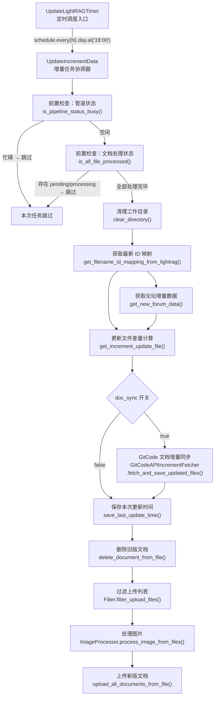
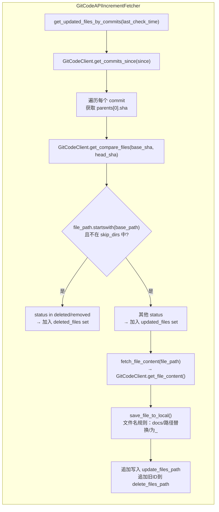

# 知识库增量更新：定时调度器与差量同步

## 1. 项目定位与核心价值

### 痛点背景

在持续运营的社区问答机器人场景中，知识库（LightRAG）面临的最大挑战不是初始化——而是**长期维护**。论坛帖子每天都在更新，官方文档仓库也持续产生提交（commit），如果每次都执行全量重建，代价高昂：全量向量化所有文档意味着大量 API 调用开销、等待 LightRAG 管道重新处理所有文件，以及服务在此期间的可用性下降。

该模块正是为解决上述痛点而生：**以"上次更新时间"为锚点，只拉取、处理、同步自该时间点以来真正发生变更的内容**，将每次同步的计算量从全量规模压缩到差量规模。其增量边界不是文件级别的"全部重新上传"，而是精确到 Git commit 粒度的文件变更列表，以及论坛 topic 的 `bumped_at` 时间戳比较。

### 核心特性

**双数据源增量同步**：该模块同时处理两类内容——来自 Discourse 论坛的帖子数据，以及来自 GitCode 代码托管平台的官方文档 Markdown 文件。两者使用同一个时间锚点（`last_update_time`）作为增量边界，形成统一的调度闭环。论坛侧通过分页遍历并比较 `bumped_at` 字段决定是否处理某个 topic；文档侧则调用 GitCode Commits API，逐提交对比父子 SHA，通过 Compare API 精确获取每次提交的文件变更列表，区分新增/修改与删除操作。

**管道状态感知的幂等调度**：调度器在每次触发更新任务前，会主动查询 LightRAG 的管道状态（`/documents/pipeline_status`）和文档处理状态（`/documents/paginated` 的 `status_counts`）。若管道处于忙碌或存在 `pending`/`processing` 状态的文档，则本次任务直接跳过，不产生任何副作用。这使得调度任务具备天然的幂等性保障，不会因重叠执行导致数据错乱。

**先删后增的原子操作语义**：对于已被修改的文档，系统执行的是"先将旧版本 ID 写入删除列表 → 删除远端旧文档 → 上传新版本"的操作序列，而非直接覆盖。这与 LightRAG 对文档管理的 API 语义完全对齐——LightRAG 通过文档 ID 管理文档生命周期，同一文件的新版本必须以新 ID 注册。`files_id_mapping` 文件（JSON 格式）在此充当本地的"文档注册表"，记录文件名到 LightRAG 文档 ID 的映射关系。

Sources: [increment_date_update_timer.py](src/update_lightrag/increment_date_update_timer.py#L158-L191), [gitcode_api_increment_fetcher.py](src/update_lightrag/gitcode_api_increment_fetcher.py#L1-L10)

---

## 2. 架构设计与模块划分

### 2.1 总体架构图



### 2.2 GitCode 增量抓取子流程



### 2.3 各模块职责详解

| 模块 / 类 | 文件 | 核心职责 |
|---|---|---|
| `UpdateLightRAGTimer` | `increment_date_update_timer.py` | 调度器容器，持有 `schedule` job，管理 `run_scheduler()` 主循环 |
| `UpdateIncrementData` | `increment_date_update_timer.py` | 增量任务协调器，编排完整的更新流水线，聚合所有下游服务的调用 |
| `GitCodeAPIIncrementFetcher` | `gitcode_api_increment_fetcher.py` | 基于 GitCode API 的文档增量抓取器，负责 commit 遍历、文件过滤、本地落盘 |
| `GitCodeClient` | `gitcode_client.py` | GitCode REST API 的底层 HTTP 客户端，封装认证、限速重试、分页、base64 解码 |
| `LightRAGClient` | `lightrag_client.py` | LightRAG 服务的 HTTP 客户端，提供上传、删除、ID 映射同步、管道状态查询接口 |
| `update_time` 模块 | `update_time.py` | 最小化的时间戳持久化工具，负责将 UTC 时间写入/读取文本文件 |
| `ForumDataFetcher` | `forum_data_Fetcher.py` | 论坛数据抓取器，按页拉取 topic 列表，按时间戳过滤后拉取 topic 详情 |
| `Filter` | `filter.py` | 上传前过滤器，清洗 new_rag_files 列表中不符合条件的文件 |
| `ImageProcessor` | `image_processor.py` | 图片处理器，替换或提取文档中的图片引用 |

**`UpdateLightRAGTimer`** 是整个子系统的外部接入点。它持有一个 `schedule` library 的 job 对象，在 `run_scheduler()` 中进入 `while True` 轮询循环，每秒调用一次 `schedule.run_pending()`。调度周期通过配置项 `timer.schedule_interval` 控制（单位：天），触发时间硬编码为容器内标准时间 `18:00`（对应东八区次日凌晨 02:00）。这种设计将"何时执行"与"执行什么"完全解耦。

**`UpdateIncrementData`** 是真正执行业务逻辑的协调器。它并不直接处理任何 HTTP 请求或文件 IO，而是将工作委派给 `ForumDataFetcher`、`GitCodeAPIIncrementFetcher`、`LightRAGClient` 等专项子服务，自身只负责编排调用顺序、传递配置参数、处理分支控制（如 `doc_sync` 开关）。

Sources: [increment_date_update_timer.py](src/update_lightrag/increment_date_update_timer.py#L193-L215), [increment_date_update_timer.py](src/update_lightrag/increment_date_update_timer.py#L20-L30), [gitcode_api_increment_fetcher.py](src/update_lightrag/gitcode_api_increment_fetcher.py#L12-L20), [gitcode_client.py](src/update_lightrag/gitcode_client.py#L13-L27)

---

## 3. 技术栈与核心工作流

### 3.1 技术栈

| 技术/库 | 用途 |
|---|---|
| `schedule` | 轻量级 Python 定时任务调度，`every(N).day.at('HH:MM').do(fn)` 接口 |
| `requests` | 同步 HTTP 客户端，用于调用 GitCode API 与 LightRAG API |
| `base64` | 解码 GitCode API 返回的 base64 编码文件内容 |
| `datetime` / `timezone` | UTC 时间戳的序列化与反序列化，确保跨时区一致性 |
| `json` | `files_id_mapping` 的持久化格式，支持增量 merge 写入 |
| `set` 运算 | 利用集合交集/差集计算需删除/新增的文档 ID 列表 |

### 3.2 `update_lightrag_task()` 主流水线详解

`update_lightrag_task()` 是整个增量更新的核心执行单元，每次调度触发时被调用一次。其执行链路如下：

**阶段一：前置守卫（Guard）**

任务开始前执行两个独立的管道状态检查：
1. `is_pipeline_status_busy()` — 调用 `/documents/pipeline_status` 端点，若 `busy == True` 则直接返回。
2. `is_all_file_processed()` — 调用 `/documents/paginated`，检查 `status_counts` 中是否存在 `pending` 或 `processing` 条目。

两个检查均通过后，才进入实际数据处理阶段。这保证了调度任务不会在 LightRAG 正处于向量化处理中时注入新的变更，避免状态竞争。

**阶段二：工作目录清理与 ID 映射刷新**

调用 `clear_directory(lightrag_root_dir, update_time_file)` 清空工作目录中的所有文件，但**跳过 `update_time` 时间戳文件**（该文件是时间锚点，不能清除）。随后调用 `get_filename_id_mapping_from_lightrag()` 从 LightRAG 服务端分页拉取所有文档的 `file_path → id` 映射并与本地 JSON 文件 merge，确保本次删除操作使用的 ID 是最新的。

**阶段三：双源增量数据获取**

以 `get_last_update_time()` 读取的时间戳为边界，并行逻辑上分两路：
- **论坛侧**：`get_new_forum_data(update_time)` 分页拉取 topic 列表，当某 topic 的 `bumped_at <= last_update_time` 时立即停止翻页（利用论坛 API 按时间倒序的特性做早停优化）。
- **GitCode 侧**（`doc_sync == true` 时激活）：`GitCodeAPIIncrementFetcher.fetch_and_save_updated_files()` 调用 commit 列表 API，逐提交通过 compare API 获取变更文件集合，下载并落盘到 `rag_data_dir`。

**阶段四：差量计算（Forum 删除检测）**

`get_increment_update_file()` 通过集合运算识别需要从 LightRAG 中删除的旧文档：
- `folder_files`：当前 `rag_data_dir` 中实际存在的 `*.topic.json` 文件集合。
- `mapped_files`：`files_id_mapping` 中记录的所有 topic 文件名集合。
- `all_topic_file_names_set`：从论坛获取的全量 topic 文件名集合。

通过 `(folder_files & mapped_files) | (mapped_files - all_topic_file_names_set)` 的集合运算，精确计算出哪些文档在 LightRAG 中有记录但已从论坛删除或已在本地被新版本替换，将其对应 ID 写入 `delete_rag_files_id` 文件。

**阶段五：时间戳提交与文档同步**

所有文件准备完毕后，**立即调用 `save_last_update_time()`** 将当前 UTC 时间写入时间戳文件。这个提交时机的选择具有重要意义：时间戳在数据采集完成后、但在 LightRAG 操作执行前写入，即使后续上传/删除操作失败，下次执行时也不会重复拉取相同时间窗口的数据（以牺牲一次增量窗口的准确性换取幂等性）。

最后按 `删除旧文档 → 过滤 → 处理图片 → 上传新文档` 的顺序对 LightRAG 服务执行文档操作。

Sources: [increment_date_update_timer.py](src/update_lightrag/increment_date_update_timer.py#L158-L191), [increment_date_update_timer.py](src/update_lightrag/increment_date_update_timer.py#L100-L156), [lightrag_client.py](src/update_lightrag/lightrag_client.py#L268-L305)

---

## 4. 典型代码示例

### 4.1 时间锚点的三级降级读取策略

`get_last_update_time()` 实现了一个严谨的三级降级（fallback）策略：

```python
# src/update_lightrag/update_time.py

def get_last_update_time(update_time_file, config_default_time=None):
    """从文件中读取最后更新时间"""
    try:
        with open(update_time_file, 'r', encoding='utf-8') as f:
            last_update_time_str = f.read().strip()
        # Level 1: 文件存在且非空 → 直接使用文件内容
        if not last_update_time_str and config_default_time:
            # Level 2: 文件存在但内容为空 → 降级到配置默认值
            return config_default_time
        return last_update_time_str
    except FileNotFoundError:
        # Level 3: 文件不存在 → 降级到配置默认值（首次部署场景）
        if config_default_time:
            return config_default_time
        return None
```

这种设计使系统在首次冷启动时无需手动创建时间戳文件，只需在配置文件中设置 `last_update_time` 作为历史起点即可。

### 4.2 Commit 粒度的文件变更追踪

GitCode 增量抓取的核心是逐提交遍历 + compare API 的组合：

```python
# src/update_lightrag/gitcode_api_increment_fetcher.py

for i, commit in enumerate(commits, 1):
    commit_sha = commit.get('sha', '')
    parents = commit.get('parents', [])
    if not parents:
        continue  # 跳过无父提交（初始提交）

    base_sha = parents[0].get('sha', '')
    # 通过 base...head 的 compare API 获取精确的文件变更列表
    files = self.gitcode_client.get_compare_files(base_sha, commit_sha)

    for file_info in files:
        file_path = file_info.get('filename', '')
        status = file_info.get('status', '')

        # 路径过滤：只处理 base_path 下的文件
        if not file_path.startswith(self.base_path):
            continue
        # 目录过滤：跳过 images 等非文档目录
        if any(f'/{skip_dir}/' in file_path for skip_dir in self.skip_dirs):
            continue

        if status in ('deleted', 'removed'):
            deleted_files.add(file_path)
        else:
            updated_files.add(file_path)
```

使用 `set` 存储变更文件的设计值得关注：当一个文件在多个 commit 中被修改时，`set` 自动去重，确保每个文件最终只被下载和处理一次，取的是最新版本（最后一次 `fetch_file_content` 调用）。

Sources: [update_time.py](src/update_lightrag/update_time.py#L17-L40), [gitcode_api_increment_fetcher.py](src/update_lightrag/gitcode_api_increment_fetcher.py#L38-L87)

### 4.3 API 限速（Rate Limit）的退避处理

`GitCodeClient.get_compare_files()` 对 HTTP 429 响应实现了指数退避重试：

```python
# src/update_lightrag/gitcode_client.py

max_retries = 2
retry_delay = 30  # 秒

for attempt in range(max_retries):
    response = requests.get(url, ...)
    time.sleep(self.request_delay)  # 每次请求后固定延迟（默认 0.5s）

    if response.status_code == 429:
        if attempt < max_retries - 1:
            logger.warning(f"API速率限制，等待 {retry_delay} 秒后重试...")
            time.sleep(retry_delay)
            continue
        else:
            return []  # 超过最大重试次数，返回空列表
```

Sources: [gitcode_client.py](src/update_lightrag/gitcode_client.py#L120-L145)

---

## 5. 关键设计决策分析

### 5.1 "先删后增"而非"覆盖更新"的必然性

LightRAG 的文档管理 API 没有"更新文档内容"的接口——每个文档一旦上传即以唯一 ID 标识其生命周期。要更新一篇文档，唯一的方式是删除旧 ID、上传新文件（获得新 ID）。`files_id_mapping.json` 正是为此设计的本地注册表，它的 merge 更新语义（`existing_mapping.update(mapping)`）确保历史 ID 不会丢失，同时新 ID 覆盖旧 ID。

### 5.2 本地文件系统作为操作缓冲区

整个流水线使用本地文件系统（`rag_data_dir`、`new_rag_files`、`delete_rag_files_id`）作为各阶段之间的数据缓冲区，而非在内存中传递数据对象。这种设计的优势在于：每个阶段可以独立运行（例如单独调试过滤阶段）、异常后可以从已落盘的状态恢复，以及各模块之间通过文件路径松耦合而非直接对象引用。

### 5.3 时间戳的 UTC 强制语义

`save_last_update_time()` 使用 `datetime.now(timezone.utc)` 明确以 UTC 时区存储时间，`get_last_update_time()` 返回的字符串在使用前通过 `datetime.fromisoformat()` 解析，调度器将容器内 `18:00` 映射到东八区凌晨 02:00。整个链路的时区处理是一致且显式的，避免了夏令时或服务器时区配置不同导致的边界计算错误。

Sources: [lightrag_client.py](src/update_lightrag/lightrag_client.py#L201-L219), [update_time.py](src/update_lightrag/update_time.py#L4-L14), [increment_date_update_timer.py](src/update_lightrag/increment_date_update_timer.py#L204-L215)

---

## 6. 学习与探索建议

### 针对该模块的核心链路，建议按以下顺序切入源码

| 优先级 | 目标文件 | 重点关注 | 理由 |
|---|---|---|---|
| ① | `increment_date_update_timer.py` `L158-L191` | `update_lightrag_task()` 完整方法体 | 理解整条流水线的编排逻辑与调用顺序 |
| ② | `update_time.py` | `get_last_update_time()` 三级降级逻辑 | 理解增量边界的确定机制，这是所有差量计算的起点 |
| ③ | `gitcode_api_increment_fetcher.py` `L22-L87` | `get_updated_files_by_commits()` | 理解 Commit → Compare → 文件集合的三级映射 |
| ④ | `gitcode_client.py` `L54-L113` | `get_commits_since()` 分页实现 | 理解如何安全地消费 GitCode 分页 API，含限速退避 |
| ⑤ | `lightrag_client.py` `L221-L266` | `get_filename_id_mapping_from_lightrag()` | 理解 LightRAG 侧的文档 ID 注册表同步机制 |
| ⑥ | `increment_date_update_timer.py` `L74-L156` | `get_increment_update_file()` 集合运算逻辑 | 理解论坛帖子的删除检测算法（三集合运算） |

### 相关上下游模块的探索路径

- **上游（数据源）**：`forum_data_Fetcher.py` — 论坛 topic 的具体抓取逻辑，`get_one_topic_content()` 是写入 `rag_data_dir` 的实际执行者
- **下游（知识库操作）**：`lightrag_client.py` 中的 `upload_document()` 与 `delete_document()` — LightRAG REST API 的底层调用细节
- **全量初始化对照**：`full_data_init.py` — 与增量模块形成对比，理解全量与增量在数据采集与 ID 管理上的设计差异

---

## 🔗 关联模块与上下游

- **直接调用（数据写入端）**：[`forum_data_Fetcher.py`](src/update_lightrag/forum_data_Fetcher.py) — 论坛 topic 内容的实际抓取与落盘，`get_new_forum_data()` 的直接被调用方
- **直接调用（知识库操作端）**：[`lightrag_client.py`](src/update_lightrag/lightrag_client.py) — LightRAG API 的完整封装，增量任务的最终执行层
- **全量模式参照**：[`full_data_init.py`](src/update_lightrag/full_data_init.py) — 全量初始化流程，与增量模式在架构设计上互为镜像，对比阅读可快速掌握两种模式的边界
