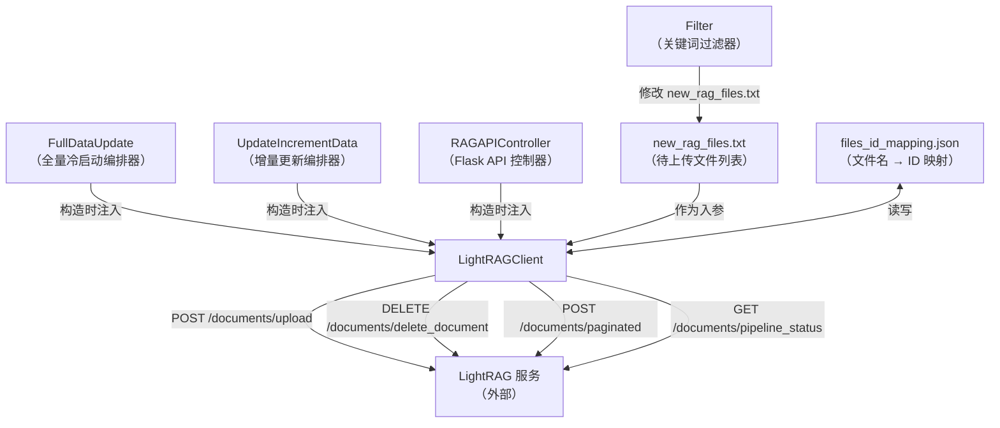

# LightRAG 客户端：文档上传与管道状态管理

## 1. 项目定位与核心价值

### 背景与痛点

在基于 RAG（Retrieval-Augmented Generation）架构的知识问答系统中，知识库的维护是一条贯穿系统全生命周期的核心链路：数据既需要在冷启动时批量灌入，也需要在增量更新时精准地删旧补新，还需要在对话推理时查询文档处理进度以保障数据质量。这意味着与 LightRAG 服务的交互逻辑，必须被抽象为一个可复用的、与业务编排逻辑解耦的独立模块。

若将 HTTP 调用、分页参数构造、错误处理、状态轮询等细节分散在各个调用方（`full_data_init.py`、`increment_date_update_timer.py`、`rag_api.py`）中，会导致代码重复、维护困难，且任何 LightRAG API 协议的变化都会引发多处修改。`LightRAGClient` 正是为解决这一问题而生——它作为系统中**唯一的 LightRAG HTTP 网关适配层**，集中封装了所有对 LightRAG 服务的 REST API 调用，向上层调用方提供语义清晰的方法接口，彻底隔离了底层协议细节。

### 核心特性解析

**统一的文档生命周期管理**是 `LightRAGClient` 的首要职责。该类覆盖了文档从入库到删除的完整生命周期：`upload_document()` 以 multipart/form-data 格式提交单个文件，接收 LightRAG 返回的 `track_id`；`delete_document()` 以 DELETE 请求携带 `doc_ids` 数组发起删除请求（`delete_file: false` 意指仅删除索引记录，不删除底层存储文件）；`get_filename_id_mapping_from_lightrag()` 则通过分页遍历 `/documents/paginated` 接口，将远端所有已有文档的 `file_path → id` 映射关系全量拉取并持久化到本地 JSON 文件，供差分计算使用。

**管道状态感知与主动背压控制**是该客户端最具工程价值的设计。LightRAG 内部的文档索引管道（Pipeline）是一个有状态的异步处理引擎：当它正在为已上传文档构建知识图谱时，处于"忙碌"状态，此时若发起删除或大批量上传，可能导致数据不一致。`LightRAGClient` 通过 `is_pipeline_status_busy()` 方法查询 `/documents/pipeline_status` 接口的 `busy` 字段，并在 `wait_for_pipeline_status_not_busy()` 中将其包装为阻塞式等待循环——每次上传或删除批次启动前，系统都会先"探测"管道状态，确认空闲后才发起操作，实现了主动式的流量背压（Backpressure）控制，避免了与索引管道的竞争条件（Race Condition）。

**分页大小的防御性校验**体现了该模块对 LightRAG API 协议约束的精确感知。LightRAG 的 `/documents/paginated` 接口要求 `page_size >= 10`，若传入更小值会触发 API 错误。`_resolve_page_size()` 方法在初始化阶段从 `config['retrieval']['paginated_page_size']` 读取配置值，执行类型转换（`int()`）、非法值回退（`except TypeError/ValueError`），以及最小值约束（`< MIN_PAGE_SIZE` 时强制修正为 10），确保所有后续分页请求始终合规。

**`Filter` 类**作为上传前置过滤器，职责极为单一：从 `config['filter_keywords']` 读取关键词列表，对 `new_rag_files.txt` 中的待上传文件路径逐一检查，剔除路径中包含任意关键词的文件，将过滤结果写回原文件。这种"原地过滤"设计（读取 → 过滤 → 写回同一文件）使其可以无缝嵌入上传流水线，无需引入额外的中间文件路径配置。

Sources: [lightrag_client.py](src/update_lightrag/lightrag_client.py#L9-L28), [lightrag_client.py](src/update_lightrag/lightrag_client.py#L340-L382), [filter.py](src/update_lightrag/filter.py#L1-L45)

---

## 2. 架构设计与模块划分

### 调用拓扑全景



### 模块职责详解

| 类 / 函数 | 源文件 | 核心职责 |
|---|---|---|
| `LightRAGClient` | `lightrag_client.py` | LightRAG HTTP API 的唯一网关适配层，封装全部 REST 调用 |
| `LightRAGClient._resolve_page_size()` | `lightrag_client.py#L19-L28` | 初始化阶段解析并校验 `page_size`，防止 API 协议违规 |
| `LightRAGClient.upload_document()` | `lightrag_client.py#L30-L44` | 单文件上传，multipart/form-data，返回 `track_id` |
| `LightRAGClient.upload_all_documents_from_file()` | `lightrag_client.py#L46-L108` | 批量上传编排：读取文件列表 → 等待管道空闲 → 逐文件上传 → 汇总日志 |
| `LightRAGClient.delete_document()` | `lightrag_client.py#L110-L127` | 单文档删除，仅删除索引记录（`delete_file: false`） |
| `LightRAGClient.delete_document_from_file()` | `lightrag_client.py#L129-L184` | 批量删除编排：读取 ID 列表 → 逐个等待管道空闲 → 逐个发起删除 |
| `LightRAGClient.get_filename_id_mapping_from_lightrag()` | `lightrag_client.py#L221-L266` | 分页全量拉取远端文件名→ID映射，持久化到本地 JSON |
| `LightRAGClient.extract_file_path_id_mapping()` | `lightrag_client.py#L186-L199` | 纯数据提取：从分页响应 JSON 中解析 `file_path → id` 字典 |
| `LightRAGClient._save_mapping_to_file()` | `lightrag_client.py#L201-L219` | 读-合并-写：将新映射与本地现有映射合并后全量覆盖写入 |
| `LightRAGClient.is_all_file_processed()` | `lightrag_client.py#L268-L304` | 状态探针：检查 `status_counts` 中 `pending` 和 `processing` 是否均为 0 |
| `LightRAGClient.is_lightrag_empty()` | `lightrag_client.py#L306-L338` | 幂等门控探针：读取 `pagination.total_count`，判断知识库是否为空 |
| `LightRAGClient.is_pipeline_status_busy()` | `lightrag_client.py#L340-L364` | 管道状态探针：查询 `/documents/pipeline_status` 的 `busy` 字段 |
| `LightRAGClient.wait_for_pipeline_status_not_busy()` | `lightrag_client.py#L366-L382` | 阻塞式轮询：直至管道空闲才返回，含失败重试（返回 `None` 时继续等待） |
| `Filter` | `filter.py` | 关键词黑名单过滤器，原地修改 `new_rag_files.txt` |
| `Filter.filter_upload_files()` | `filter.py#L8-L45` | 读取文件列表 → 按关键词过滤 → 写回，无关键词配置时安全跳过 |

**`LightRAGClient` 的三类调用方**在职责上各有侧重：`FullDataUpdate` 调用上传类方法和状态探针实现冷启动；`UpdateIncrementData` 综合使用上传、删除、映射拉取和管道状态检查实现增量同步；`RAGAPIController` 则仅使用 `is_pipeline_status_busy()`、`is_all_file_processed()` 等只读探针为前端 Dashboard 提供可观测性接口，不执行任何写操作。

Sources: [lightrag_client.py](src/update_lightrag/lightrag_client.py#L9-L382), [filter.py](src/update_lightrag/filter.py#L1-L45), [full_data_init.py](src/update_lightrag/full_data_init.py#L24-L25), [increment_date_update_timer.py](src/update_lightrag/increment_date_update_timer.py#L23-L25), [rag_api.py](src/ForumBot/rag_api.py#L23)

---

## 3. 技术栈与核心工作流

### 依赖技术栈

| 技术 | 版本约束 | 用途 |
|---|---|---|
| `requests` | Python 标准三方库 | 所有 HTTP 调用（POST/DELETE/GET） |
| `json` | Python 标准库 | 分页响应解析、映射文件读写 |
| `time` | Python 标准库 | 上传间隔 sleep（0.1s）、管道轮询间隔 sleep（1s） |
| LightRAG REST API | `/documents/*` 系列端点 | 上传、删除、分页查询、管道状态 |

### 核心工作流：批量上传链路

以全量冷启动场景下的文档上传为主链路，完整执行序列如下：

```
Filter.filter_upload_files()
  → 读取 new_rag_files.txt
  → 按关键词黑名单过滤
  → 写回 new_rag_files.txt

LightRAGClient.upload_all_documents_from_file()
  → wait_for_pipeline_status_not_busy()      # 等待管道空闲
      → is_pipeline_status_busy() × N        # GET /documents/pipeline_status
  → 逐文件循环：
      → upload_document(file_path, ...)      # POST /documents/upload
      → 记录 track_id / 错误信息
      → time.sleep(0.1)                      # 主动限速
  → 输出成功/失败/错误汇总日志
```

### 核心工作流：增量删除链路

增量更新场景中，删旧在先，补新在后，每次删除前均触发管道状态检查：

```
LightRAGClient.delete_document_from_file()
  → 读取 delete_rag_files_id.txt（文档 ID 列表）
  → 逐个 ID 循环：
      → wait_for_pipeline_status_not_busy()   # 每次删除前都等待空闲
      → delete_document(doc_id, ...)          # DELETE /documents/delete_document
      → 记录 deletion_started / 错误信息
  → 输出删除汇总日志
```

### 核心工作流：映射同步链路

映射同步用于在差分计算前，将 LightRAG 远端的文件注册信息同步到本地：

```
LightRAGClient.get_filename_id_mapping_from_lightrag()
  → page = 1
  → 循环：
      → POST /documents/paginated {page, page_size}
      → extract_file_path_id_mapping(result)   # 解析 file_path → id
      → _save_mapping_to_file(mapping)          # 读-合并-写入本地 JSON
      → 检查 pagination.page >= pagination.total_pages
      → 若否：page += 1，继续
  → 退出循环，记录总页数
```

### LightRAG API 端点速查

| 端点 | 方法 | 请求格式 | 关键响应字段 | 对应方法 |
|---|---|---|---|---|
| `/documents/upload` | POST | multipart/form-data（`file` 字段） | `status`, `track_id` | `upload_document()` |
| `/documents/delete_document` | DELETE | JSON `{doc_ids, delete_file}` | `status: deletion_started` | `delete_document()` |
| `/documents/paginated` | POST | JSON `{page, page_size}` | `documents[]`, `pagination`, `status_counts` | `get_filename_id_mapping_from_lightrag()`, `is_all_file_processed()`, `is_lightrag_empty()` |
| `/documents/pipeline_status` | GET | 无请求体 | `busy: bool` | `is_pipeline_status_busy()` |

Sources: [lightrag_client.py](src/update_lightrag/lightrag_client.py#L30-L108), [lightrag_client.py](src/update_lightrag/lightrag_client.py#L129-L184), [lightrag_client.py](src/update_lightrag/lightrag_client.py#L221-L266)

---

## 4. 典型代码示例

### 分页大小的防御性解析

```python
# src/update_lightrag/lightrag_client.py  L10-L28
class LightRAGClient:
    # /documents/paginated 接口分页大小约束：LightRAG 要求 page_size >= 10
    MIN_PAGE_SIZE = 10
    DEFAULT_PAGE_SIZE = 10

    def __init__(self, config):
        self.config = config
        self.verify_ssl = self.config.get('retrieval', {}).get('verify_ssl', True)
        self.page_size = self._resolve_page_size()

    def _resolve_page_size(self):
        page_size = self.config.get('retrieval', {}).get('paginated_page_size', self.DEFAULT_PAGE_SIZE)
        try:
            page_size = int(page_size)
        except (TypeError, ValueError):
            page_size = self.DEFAULT_PAGE_SIZE
        if page_size < self.MIN_PAGE_SIZE:
            page_size = self.MIN_PAGE_SIZE
        return page_size
```

三层防御：优先读配置 → 类型转换失败回退默认值 → 低于最小值强制修正。任何合法或非法的配置输入都不会让后续 API 调用携带违规的 `page_size`。

### 管道状态轮询：阻塞直至空闲

```python
# src/update_lightrag/lightrag_client.py  L366-L382
def wait_for_pipeline_status_not_busy(self, api_url, api_key=None):
    logger.info("检查管道状态是否空闲...")
    while True:
        is_busy = self.is_pipeline_status_busy(api_url, api_key)
        if is_busy is None:      # 查询失败（网络异常等）
            logger.warning("无法获取管道状态，等待1秒后重试")
            time.sleep(1)
        elif is_busy:            # 管道忙碌
            logger.info("管道正忙，等待1秒后重试...")
            time.sleep(1)
        else:                    # 管道空闲
            logger.info("管道已空闲，开始执行操作")
            break
```

注意三路分支：`None`（查询失败）和 `True`（忙碌）均触发等待重试，只有明确的 `False`（空闲）才允许流程继续。这确保了网络抖动不会被误判为"空闲"。

### 批量上传：完整错误分类与汇总

```python
# src/update_lightrag/lightrag_client.py  L46-L108
def upload_all_documents_from_file(self, file_list_path, api_url, api_key=None):
    # 上传前确保管道空闲
    self.wait_for_pipeline_status_not_busy(api_url)

    for i, file_path in enumerate(file_paths, 1):
        try:
            full_file_path = f"{self.config['lightrag_paths']['rag_data_dir']}/{file_path}"
            result = self.upload_document(full_file_path, api_url, api_key)
            if result.get("status") == "success":
                track_id = result.get("track_id")
                uploaded_documents.append({"file_path": file_path,
                                           "track_id": track_id, "status": "success"})
            else:
                uploaded_documents.append({"file_path": file_path,
                                           "error": result, "status": "failed"})
        except Exception as e:
            uploaded_documents.append({"file_path": file_path,
                                       "error": str(e), "status": "error"})
        time.sleep(0.1)  # 主动限速，避免请求过于密集
```

区分了三种结果态：`success`（API 返回成功）、`failed`（API 返回非成功响应）、`error`（网络/IO 异常），三者均被追加到 `uploaded_documents` 列表中统一汇总，保证即使部分文件失败也不中断整个批次。

### 分页全量映射拉取

```python
# src/update_lightrag/lightrag_client.py  L221-L266
def get_filename_id_mapping_from_lightrag(self, base_url, limit=50):
    page = 1
    while True:
        payload = {"page": page, "page_size": limit}
        response = requests.post(f"{base_url}/documents/paginated",
                                 json=payload, timeout=10, verify=self.verify_ssl)
        response.raise_for_status()
        result = response.json()

        mapping = self.extract_file_path_id_mapping(result)
        self._save_mapping_to_file(mapping)   # 每页立即落盘，防止中途崩溃丢失数据

        pagination = result.get('pagination', {})
        if pagination.get('page', 1) >= pagination.get('total_pages', 1):
            break
        page += 1
```

每页数据解析后立即调用 `_save_mapping_to_file()` 落盘（读-合并-写），而非全部拉完再一次性写入。这意味着即使拉取过程在中间某页因网络异常中断，已拉取的映射数据不会丢失，下次重新全量拉取仍可正确合并。

Sources: [lightrag_client.py](src/update_lightrag/lightrag_client.py#L9-L28), [lightrag_client.py](src/update_lightrag/lightrag_client.py#L46-L108), [lightrag_client.py](src/update_lightrag/lightrag_client.py#L221-L266), [lightrag_client.py](src/update_lightrag/lightrag_client.py#L366-L382)

---

## 5. 关键设计决策剖析

### 三态返回值：`True / False / None`

`is_pipeline_status_busy()`、`is_all_file_processed()`、`is_lightrag_empty()` 均返回三态值而非布尔值。当 HTTP 请求失败或 JSON 解析异常时，方法返回 `None` 而非抛出异常。这一设计使调用方（如 `wait_for_pipeline_status_not_busy()`）能够区分"明确得到答案（空闲）"与"未能得到答案（网络故障）"，后者触发等待重试而非错误传播，提升了整个管道的鲁邦性。

> 将"无法获取状态"与"状态为忙碌"同等处理（均触发等待重试），比将网络异常当作"空闲"来处理要安全得多——宁可多等，不可数据竞争。

### 映射文件：读-合并-覆盖写

`_save_mapping_to_file()` 每次写入时先读取本地现有 JSON，将新映射 `update()` 到旧映射上，再全量覆盖写回。这种增量追加语义意味着多次分页拉取可以安全地累积到同一文件，且同一 `file_path` 的 `id` 会被最新值覆盖（保证最终一致性）。映射文件同时也是全量初始化与增量更新之间共享的持久化状态，两个流程都依赖它做差分计算。

### `delete_file: false` 的语义选择

删除请求中固定传入 `delete_file: False`，仅删除 LightRAG 索引中的文档记录，不触碰底层存储（如向量数据库中的嵌入向量文件）。这是一个保守设计：知识图谱的底层存储由 LightRAG 自行管理，上层客户端不应越权干预，仅需通知"该文档已不在知识库中"即可。

Sources: [lightrag_client.py](src/update_lightrag/lightrag_client.py#L110-L127), [lightrag_client.py](src/update_lightrag/lightrag_client.py#L201-L219), [lightrag_client.py](src/update_lightrag/lightrag_client.py#L340-L382)

---

## 6. 探索建议

### 调用链纵向追踪

| 方向 | 关联文件 | 核心关注点 |
|---|---|---|
| 全量冷启动编排 | [`src/update_lightrag/full_data_init.py`](src/update_lightrag/full_data_init.py) | `LightRAGClient` 在七步冷启动流水线中的完整调用序列，幂等门控与完成轮询的实现细节 |
| 增量更新编排 | [`src/update_lightrag/increment_date_update_timer.py`](src/update_lightrag/increment_date_update_timer.py) | 删旧补新的顺序设计（`delete_document_from_file` 先于 `upload_all_documents_from_file`），管道状态的前置检查逻辑 |
| 可观测性接口层 | [`src/ForumBot/rag_api.py`](src/ForumBot/rag_api.py) | Flask 控制器如何将 `LightRAGClient` 的状态查询能力暴露为 REST API，供前端 Dashboard 消费 |
| 过滤配置驱动 | `config/config.yaml` | `filter_keywords` 列表的具体配置方式，`lightrag_paths` 各路径键值的语义，`retrieval.paginated_page_size` 的调优场景 |
| 单元测试规格 | [`tests/test_lightrag_client.py`](tests/test_lightrag_client.py) | 覆盖分页大小边界值（缺省/非法/低于最小值）、三态返回值、管道轮询的 Mock 策略，是理解各方法行为契约的最直接参考 |

### 数据流闭环视角

`LightRAGClient` 处于知识库维护链路的**数轴中心**——它既是数据写入 LightRAG 的唯一出口，也是读取 LightRAG 状态的唯一探针。完整理解数据流的推荐顺序是：

1. **`Filter`** — 控制哪些文件最终进入上传列表（上游过滤）
2. **`LightRAGClient`（本模块）** — 执行实际的 API 交互，管理文档生命周期
3. **`FullDataUpdate` / `UpdateIncrementData`** — 编排多个步骤的业务流程（上层调用方）
4. **`RAGAPIController`** — 将状态查询能力透传给外部消费者（下游透传层）

Sources: [full_data_init.py](src/update_lightrag/full_data_init.py#L16-L27), [increment_date_update_timer.py](src/update_lightrag/increment_date_update_timer.py#L158-L190), [rag_api.py](src/ForumBot/rag_api.py#L14-L23), [tests/test_lightrag_client.py](tests/test_lightrag_client.py#L1-L369)

---

## 🔗 关联模块与上下游

- **直接上游（过滤前置）**：[`filter.py`](src/update_lightrag/filter.py) — `Filter.filter_upload_files()` 在 `upload_all_documents_from_file()` 调用前修改文件列表，决定最终入库的文件集合
- **直接调用方（编排层）**：[`full_data_init.py`](src/update_lightrag/full_data_init.py) 与 [`increment_date_update_timer.py`](src/update_lightrag/increment_date_update_timer.py) — 全量与增量两条编排链路均以 `LightRAGClient` 作为与 LightRAG 服务交互的唯一基础设施层
- **旁路消费方（可观测性）**：[`src/ForumBot/rag_api.py`](src/ForumBot/rag_api.py) — Flask API 控制器持有 `LightRAGClient` 实例，仅调用只读状态探针方法，将管道状态和文档处理进度透传给外部调用方
